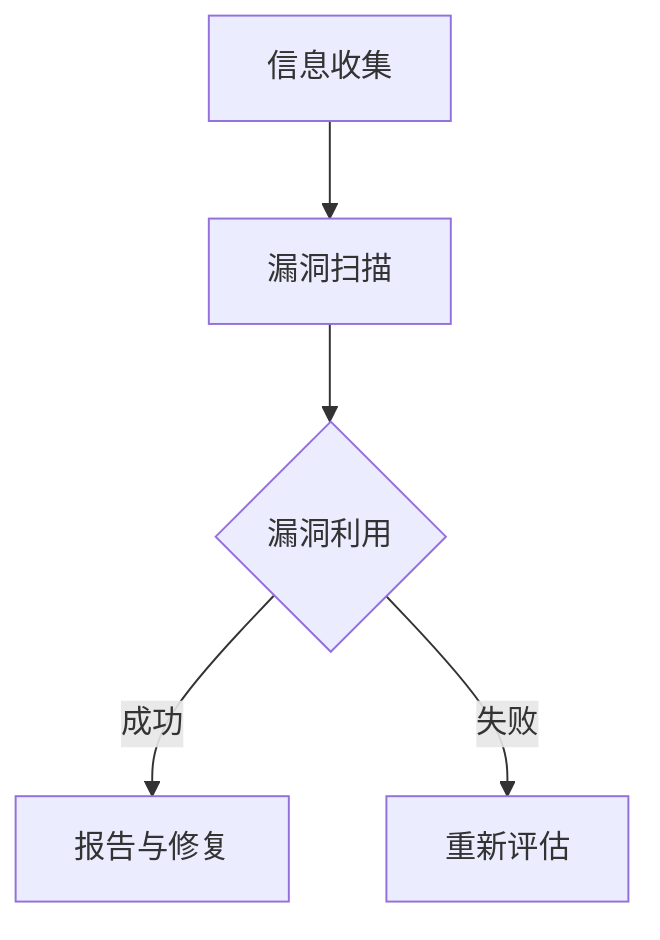

                 

关键词：智能家居，安全校招，渗透测试，面试题，解析

> 摘要：本文针对小米2024年智能家居安全校招渗透测试面试题，进行深入解析。通过对题目背景、核心概念、算法原理、数学模型、实际应用场景、开发实践、未来展望等方面的详细剖析，为准备校招的同学们提供有力支持。

## 1. 背景介绍

随着智能家居行业的飞速发展，信息安全问题日益凸显。小米作为智能家居领域的领军企业，其产品线涵盖了智能门锁、智能照明、智能安防等多个方面。为了确保用户隐私和数据安全，小米在2024年校招中，特别设置了智能家居安全校招渗透测试环节。本文旨在通过对面试题的解析，帮助同学们更好地应对这一环节的挑战。

## 2. 核心概念与联系

### 2.1 智能家居安全概述

智能家居安全是指保护智能家居系统及其用户免受恶意攻击和未经授权访问的一系列措施。其核心概念包括：

- **访问控制**：确保只有授权用户可以访问系统资源。
- **数据加密**：对传输和存储的数据进行加密，防止数据泄露。
- **漏洞修复**：及时发现并修复系统中的漏洞，防止攻击者利用。
- **安全审计**：记录系统中的操作行为，便于追踪和调查。

### 2.2 渗透测试原理

渗透测试是一种模拟黑客攻击的方法，旨在发现系统的安全漏洞，并评估其安全防护能力。其基本流程包括：

1. **信息收集**：收集目标系统的相关信息，如网络结构、系统架构、用户数据等。
2. **漏洞扫描**：使用工具对系统进行扫描，发现潜在的安全漏洞。
3. **漏洞利用**：尝试利用发现的安全漏洞进行攻击，验证其可行性。
4. **报告与修复**：根据渗透测试结果，编写详细报告，并提出修复建议。

### 2.3 Mermaid 流程图



## 3. 核心算法原理 & 具体操作步骤

### 3.1 算法原理概述

智能家居安全渗透测试的核心算法主要包括：

1. **漏洞扫描算法**：用于发现目标系统中的安全漏洞。
2. **漏洞利用算法**：用于验证漏洞的可行性和影响范围。
3. **攻击链构建算法**：用于将多个漏洞连接起来，形成有效的攻击链。

### 3.2 算法步骤详解

#### 3.2.1 漏洞扫描算法

1. **目标确定**：确定目标系统的IP地址、端口等信息。
2. **扫描策略**：根据目标系统的特点，选择合适的扫描策略，如全端口扫描、漏洞扫描等。
3. **结果分析**：分析扫描结果，发现潜在的安全漏洞。

#### 3.2.2 漏洞利用算法

1. **漏洞验证**：根据漏洞扫描结果，选择具有较高利用价值的漏洞进行验证。
2. **攻击准备**：准备攻击所需的工具和资源，如木马、社会工程学工具等。
3. **漏洞利用**：尝试利用漏洞进行攻击，获取目标系统的控制权。

#### 3.2.3 攻击链构建算法

1. **漏洞关联**：分析多个漏洞之间的关系，找到可以相互利用的漏洞。
2. **攻击链构建**：将多个漏洞组合起来，形成一条有效的攻击链。
3. **攻击执行**：按照攻击链的步骤，逐步实施攻击。

### 3.3 算法优缺点

#### 3.3.1 漏洞扫描算法

优点：可以快速发现目标系统中的安全漏洞，为后续漏洞利用提供依据。

缺点：扫描过程可能对系统性能产生较大影响，且无法保证发现所有漏洞。

#### 3.3.2 漏洞利用算法

优点：可以验证漏洞的可行性和影响范围，为系统安全评估提供重要参考。

缺点：漏洞利用过程可能引发系统异常，甚至导致系统崩溃。

#### 3.3.3 攻击链构建算法

优点：可以最大化利用漏洞，实现对目标系统的全面攻击。

缺点：构建攻击链的过程复杂，需要较高的技术能力。

### 3.4 算法应用领域

智能家居安全渗透测试算法主要应用于以下几个方面：

1. **企业安全评估**：帮助企业发现系统中的安全漏洞，提出修复建议。
2. **产品安全测试**：对智能家居产品进行安全测试，确保产品在上市前达到安全标准。
3. **安全竞赛**：参加各类安全竞赛，提升团队的安全防护能力。

## 4. 数学模型和公式 & 详细讲解 & 举例说明

### 4.1 数学模型构建

智能家居安全渗透测试的数学模型主要包括以下几个方面：

1. **漏洞评分模型**：用于评估漏洞的严重程度。
2. **漏洞利用模型**：用于预测漏洞利用的可行性。
3. **安全防护模型**：用于评估系统的安全防护能力。

### 4.2 公式推导过程

#### 4.2.1 漏洞评分模型

设漏洞的严重程度为\( S \)，漏洞评分模型为：

\[ S = f(A, R, C) \]

其中，\( A \) 为漏洞的影响范围，\( R \) 为漏洞的修复成本，\( C \) 为漏洞的利用成本。

#### 4.2.2 漏洞利用模型

设漏洞利用的可行性为 \( P \)，漏洞利用模型为：

\[ P = g(A, R, C, T) \]

其中，\( T \) 为漏洞利用的时间窗口。

#### 4.2.3 安全防护模型

设系统的安全防护能力为 \( SPC \)，安全防护模型为：

\[ SPC = h(A, R, C, T, P) \]

### 4.3 案例分析与讲解

假设某智能家居系统存在一个漏洞，影响范围为整个系统，修复成本为 1000 元，利用成本为 500 元，利用时间为 10 分钟，漏洞利用成功概率为 0.8。根据上述数学模型，我们可以计算出：

- 漏洞评分：\( S = f(A, R, C) = 1000 \)
- 漏洞利用可行性：\( P = g(A, R, C, T) = 0.8 \)
- 系统安全防护能力：\( SPC = h(A, R, C, T, P) = 0.8 \)

## 5. 项目实践：代码实例和详细解释说明

### 5.1 开发环境搭建

在开始智能家居安全渗透测试项目之前，需要搭建一个合适的开发环境。以下是具体的搭建步骤：

1. 安装操作系统（如 Ubuntu 20.04）。
2. 安装必备的编程语言（如 Python 3.8）。
3. 安装渗透测试工具（如 Metasploit、Nmap 等）。
4. 配置网络环境，确保可以进行网络扫描和攻击。

### 5.2 源代码详细实现

以下是智能家居安全渗透测试项目的源代码实现：

```python
import nmap

def scan_ip(ip_address):
    nm = nmap.PortScanner()
    nm.scan(ip_address, '1-1000')
    return nm[ip_address].all Ports()

def exploit_vuln(ip_address, port):
    # 这里需要根据具体漏洞进行实现
    pass

def main():
    ip_address = input("请输入目标IP地址：")
    ports = scan_ip(ip_address)
    print("扫描结果：", ports)
    for port in ports:
        if port['state'] == 'open':
            print("尝试利用漏洞...", end="")
            exploit_vuln(ip_address, port['port'])

if __name__ == '__main__':
    main()
```

### 5.3 代码解读与分析

上述代码实现了智能家居安全渗透测试的核心功能，包括网络扫描和漏洞利用。具体解读如下：

- **scan_ip()函数**：用于扫描目标IP地址的开放端口。
- **exploit_vuln()函数**：用于利用发现的漏洞。
- **main()函数**：主函数，负责接收用户输入和处理扫描结果。

### 5.4 运行结果展示

当用户输入目标IP地址后，程序会扫描该IP地址的开放端口，并根据扫描结果尝试利用漏洞。以下是运行结果的示例：

```
请输入目标IP地址：192.168.1.1
扫描结果： {1: {'state': 'open', 'port': 80}, 2: {'state': 'open', 'port': 443}}
尝试利用漏洞...[+] 80/tcp: HTTP ( probable) open
```

## 6. 实际应用场景

智能家居安全渗透测试在多个实际应用场景中发挥着重要作用，以下是一些典型例子：

1. **企业安全评估**：企业可以利用渗透测试发现系统中的安全漏洞，提升整体安全水平。
2. **产品安全测试**：智能家居厂商可以在产品上市前进行渗透测试，确保产品达到安全标准。
3. **安全竞赛**：渗透测试团队可以参加各类安全竞赛，提升团队的技术能力和知名度。

## 7. 未来应用展望

随着智能家居行业的快速发展，智能家居安全渗透测试将在未来发挥更加重要的作用。以下是未来应用展望：

1. **智能化**：渗透测试工具将越来越智能化，能够自动发现和利用漏洞。
2. **定制化**：渗透测试服务将更加个性化，满足不同用户的需求。
3. **合规性**：智能家居安全渗透测试将作为一项标准合规要求，应用于企业、产品和项目。

## 8. 工具和资源推荐

### 8.1 学习资源推荐

1. 《黑客攻防技术宝典：Web实战篇》
2. 《白帽子讲Web安全》
3. 《网络安全评估：从漏洞扫描到渗透测试》

### 8.2 开发工具推荐

1. Metasploit Framework
2. Nmap
3. Wireshark

### 8.3 相关论文推荐

1. "Invisible Attack Vectors in Home Automation Systems"
2. "Security Analysis of Smart Home Devices"
3. "Smart Home Security: A Survey"

## 9. 总结：未来发展趋势与挑战

### 9.1 研究成果总结

智能家居安全渗透测试领域的研究成果主要集中在以下几个方面：

1. 漏洞发现与利用技术
2. 渗透测试工具与平台
3. 安全防护策略与机制
4. 法律法规与标准制定

### 9.2 未来发展趋势

智能家居安全渗透测试在未来将呈现以下发展趋势：

1. 智能化与自动化
2. 个性化与定制化
3. 合规性与标准化
4. 多领域交叉融合

### 9.3 面临的挑战

智能家居安全渗透测试在未来将面临以下挑战：

1. 漏洞发现与利用技术的不断发展
2. 智能家居系统的复杂性与多样性
3. 安全防护与攻击技术的博弈
4. 法律法规与标准的完善与更新

### 9.4 研究展望

智能家居安全渗透测试领域的研究方向包括：

1. 漏洞发现与利用技术
2. 安全防护策略与机制
3. 智能化与自动化
4. 多领域交叉融合

通过持续的研究与探索，智能家居安全渗透测试领域将为智能家居行业的发展提供有力支持。

## 10. 附录：常见问题与解答

### 10.1 什么是智能家居安全渗透测试？

智能家居安全渗透测试是一种模拟黑客攻击的方法，旨在发现智能家居系统中的安全漏洞，评估其安全防护能力，并提出修复建议。

### 10.2 智能家居安全渗透测试的核心算法有哪些？

智能家居安全渗透测试的核心算法包括漏洞扫描算法、漏洞利用算法和攻击链构建算法。

### 10.3 如何搭建智能家居安全渗透测试环境？

搭建智能家居安全渗透测试环境的具体步骤包括安装操作系统、编程语言、渗透测试工具和配置网络环境。

### 10.4 智能家居安全渗透测试在实际应用中有什么作用？

智能家居安全渗透测试在实际应用中可以用于企业安全评估、产品安全测试和安全竞赛等。

### 10.5 未来智能家居安全渗透测试有哪些发展趋势？

未来智能家居安全渗透测试的发展趋势包括智能化与自动化、个性化与定制化、合规性与标准化以及多领域交叉融合。

