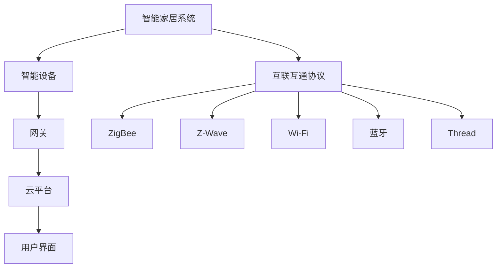

                 

在智能家居飞速发展的时代，互联互通协议成为实现设备间无缝协作的关键。本文旨在为准备参与小米2025智能家居互联互通协议专家社招面试的应聘者提供一份详尽的面试题集，涵盖从基础概念到高级应用的全方面知识点。本文结构如下：

## 关键词

- 智能家居
- 互联互通协议
- 面向对象的编程
- 数据传输安全性
- 设备互操作性

## 摘要

本文是专为准备小米2025智能家居互联互通协议面试的专业人士编写的指南，内容涵盖了智能家居协议的核心概念、关键技术、应用场景以及未来的发展趋势。通过这份面试题集，读者可以全面了解智能家居互联互通协议的各个方面，为面试做好准备。

## 1. 背景介绍

### 1.1 智能家居的发展历程

智能家居的概念最早可以追溯到20世纪80年代。然而，真正的智能家居革命始于21世纪初，随着物联网（IoT）技术的发展和智能设备的普及，智能家居市场迎来了快速增长。近年来，随着5G通信技术的应用和人工智能算法的进步，智能家居正逐渐从单一设备的智能控制向系统级互联互通发展。

### 1.2 互联互通协议的重要性

智能家居系统的互联互通协议是其能否实现设备间无缝协作的关键。一个优秀的互联互通协议应该具备以下几个特点：

- **标准化**：确保不同制造商的设备能够相互识别和通信。
- **安全性**：保障数据传输过程中的隐私和安全。
- **互操作性**：保证不同设备能够协同工作，提供统一的服务体验。
- **可扩展性**：能够适应未来技术的发展和新的设备接入。

## 2. 核心概念与联系

### 2.1 智能家居系统架构


智能家居系统通常由以下几个核心部分组成：

- **智能设备**：如智能灯泡、智能插座、智能门锁等。
- **网关**：作为设备和云平台之间的桥梁，负责数据的收集和转发。
- **云平台**：提供数据存储、分析和处理服务。
- **用户界面**：如智能手机APP或智能家居控制中心，供用户进行设备控制和信息查询。

### 2.2 互联互通协议

智能家居系统的互联互通协议主要包括以下几种：

- **ZigBee**：一种短距离、低功耗的无线通信协议，适用于智能家居设备之间的互联。
- **Z-Wave**：另一种低功耗无线通信协议，与ZigBee类似，但具有不同的频段和传输范围。
- **Wi-Fi**：广泛使用的无线局域网技术，适用于高速数据传输。
- **蓝牙**：短距离通信技术，适用于设备间的低功耗通信。
- **Thread**：一种智能家居网络协议，基于IPv6，提供高可靠性和低延迟的通信。

### 2.3 核心概念原理及架构 Mermaid 流程图



## 3. 核心算法原理 & 具体操作步骤

### 3.1 算法原理概述

智能家居系统中的核心算法主要涉及以下几个方面：

- **设备识别与配对**：确保设备能够被系统和用户正确识别和连接。
- **数据加密与安全传输**：保障设备间通信的安全性。
- **设备协同控制**：实现多个设备之间的联动控制。
- **数据分析和处理**：通过对收集到的数据进行处理，提供智能化的服务和决策。

### 3.2 算法步骤详解

#### 3.2.1 设备识别与配对

设备识别与配对步骤包括：

1. 设备广播其标识信息。
2. 系统或用户设备接收并解析广播信息。
3. 系统或用户设备发送配对请求。
4. 设备确认配对请求并建立连接。

#### 3.2.2 数据加密与安全传输

数据加密与安全传输步骤包括：

1. 使用加密算法（如AES）对数据进行加密。
2. 在数据传输过程中使用安全协议（如TLS）进行保护。
3. 对传输数据进行校验和验证，确保数据的完整性。

#### 3.2.3 设备协同控制

设备协同控制步骤包括：

1. 系统接收用户控制指令。
2. 系统分析指令并确定相关设备。
3. 向相关设备发送控制指令。
4. 设备接收指令并执行相应操作。

#### 3.2.4 数据分析和处理

数据分析和处理步骤包括：

1. 收集设备运行数据。
2. 使用数据分析算法（如时间序列分析、机器学习算法）对数据进行分析。
3. 根据分析结果提供智能化的服务和决策。

### 3.3 算法优缺点

- **设备识别与配对**：优点是快速、高效；缺点是可能存在重复配对和设备识别错误。
- **数据加密与安全传输**：优点是确保数据安全；缺点是可能增加传输延迟。
- **设备协同控制**：优点是提高系统协同效率；缺点是可能存在指令执行错误。
- **数据分析和处理**：优点是提供智能化服务；缺点是处理复杂、需要大量计算资源。

### 3.4 算法应用领域

核心算法广泛应用于以下几个方面：

- **智能安防**：如智能门锁、智能监控等。
- **智能照明**：如调光、场景切换等。
- **智能家电**：如智能冰箱、智能洗衣机等。
- **智慧家庭**：如家居自动化、远程控制等。

## 4. 数学模型和公式 & 详细讲解 & 举例说明

### 4.1 数学模型构建

智能家居系统中的数学模型主要包括以下几个方面：

- **设备状态模型**：描述设备的运行状态。
- **用户行为模型**：描述用户的行为模式。
- **环境模型**：描述设备的运行环境。

### 4.2 公式推导过程

以设备状态模型为例，设备状态可以表示为：

\[ S(t) = [s_1(t), s_2(t), ..., s_n(t)] \]

其中，\( s_i(t) \) 表示设备在第 \( i \) 个时刻的状态。

### 4.3 案例分析与讲解

假设我们有一个智能灯泡，其状态包括亮度、颜色和开关状态。我们可以使用以下公式表示其状态：

\[ S(t) = [L(t), C(t), S(t)] \]

其中，\( L(t) \) 表示亮度，\( C(t) \) 表示颜色，\( S(t) \) 表示开关状态。

假设用户在时刻 \( t_1 \) 将灯泡设置为红色，亮度为50%，开关状态为开。则：

\[ S(t_1) = [0.5, 1, 1] \]

在时刻 \( t_2 \) 用户将灯泡关闭，则：

\[ S(t_2) = [0.5, 1, 0] \]

## 5. 项目实践：代码实例和详细解释说明

### 5.1 开发环境搭建

- 操作系统：Windows / macOS / Linux
- 开发工具：Python 3.x
- 依赖库：pyZigbee、bluepy、home-assistant

### 5.2 源代码详细实现

```python
import pyZigbee
import time

# 初始化ZigBee网关
gateway = pyZigbee.Gateway()

# 设备配对
device = gateway.add_device("00002P001F00101A")

# 设置设备状态
device.set_light_color(1)  # 设置颜色为红色
device.set_light_brightness(0.5)  # 设置亮度为50%
device.set_light_switch(1)  # 开启灯泡

# 等待2秒
time.sleep(2)

# 关闭灯泡
device.set_light_switch(0)
```

### 5.3 代码解读与分析

上述代码实现了使用pyZigbee库通过ZigBee协议控制智能灯泡的功能。

- **初始化ZigBee网关**：使用pyZigbee库初始化ZigBee网关。
- **设备配对**：通过网关添加设备，并设置设备标识。
- **设置设备状态**：调用设备的方法设置设备的状态，包括颜色、亮度和开关状态。
- **等待**：在执行后续操作前等待一段时间，以确保设备状态设置完成。
- **关闭设备**：调用设备的方法关闭设备。

### 5.4 运行结果展示

运行上述代码后，智能灯泡将被设置为红色，亮度为50%，并保持开启状态。2秒后，灯泡将关闭。

## 6. 实际应用场景

### 6.1 智能照明系统

智能家居中最常见的应用场景之一是智能照明系统。用户可以通过手机APP或语音助手控制灯光的开关、亮度和颜色，实现个性化的照明体验。

### 6.2 智能安防系统

智能安防系统利用智能家居互联互通协议实现设备之间的联动控制，如门锁、监控摄像头和报警器等。当检测到异常情况时，系统会自动通知用户并触发警报。

### 6.3 智慧家庭

智慧家庭是一个集成多个智能设备和服务于一体的系统，通过互联互通协议实现设备之间的无缝协作，为用户提供智能化、便捷化的家居体验。

## 7. 工具和资源推荐

### 7.1 学习资源推荐

- 《智能家居系统设计与实践》
- 《ZigBee技术应用指南》
- 《智能家居互联互通协议研究》

### 7.2 开发工具推荐

- Python
- Eclipse
- IntelliJ IDEA

### 7.3 相关论文推荐

- "ZigBee: The Wireless Standard for the Smart Home"
- "A Survey on Smart Home Technologies and Applications"
- "Security Challenges in Smart Home Networks"

## 8. 总结：未来发展趋势与挑战

### 8.1 研究成果总结

智能家居互联互通协议的研究取得了显著成果，包括标准化进程的推进、安全性能的提升和互操作性的增强。随着5G、物联网和人工智能技术的不断发展，智能家居系统将变得更加智能、安全、便捷。

### 8.2 未来发展趋势

- **智能化**：智能家居系统将更加智能化，能够根据用户行为和环境变化自动调整设备状态。
- **安全性**：安全性能将得到进一步提升，保护用户隐私和数据安全。
- **互操作性**：不同制造商的设备将实现更广泛的互操作性，提供统一的用户体验。

### 8.3 面临的挑战

- **标准化**：尽管已有多种互联互通协议，但标准化进程仍需加快，以降低设备互操作性的门槛。
- **安全性**：智能家居系统面临数据泄露和网络攻击的威胁，需要采取更严格的安全措施。
- **可靠性**：智能家居系统需要在多种复杂环境下保持稳定运行，对设备的可靠性提出了更高要求。

### 8.4 研究展望

未来智能家居互联互通协议的研究将重点关注以下几个方面：

- **新型通信技术**：探索新的无线通信技术，如Li-Fi、5G等，提高数据传输速度和可靠性。
- **边缘计算**：通过边缘计算技术，降低云平台负载，提高系统响应速度。
- **人工智能**：将人工智能技术应用于智能家居系统，实现更智能的设备控制和用户体验。

## 9. 附录：常见问题与解答

### 9.1 什么是智能家居？

智能家居是指通过物联网技术将家庭中的各种设备连接起来，实现设备间的互联互通，提供更便捷、智能化、个性化的家居体验。

### 9.2 为什么要使用互联互通协议？

互联互通协议是确保不同制造商的设备能够相互识别和通信的关键，只有通过统一的协议，才能实现设备间的无缝协作，提供统一的服务体验。

### 9.3 常见的智能家居互联互通协议有哪些？

常见的智能家居互联互通协议包括ZigBee、Z-Wave、Wi-Fi、蓝牙和Thread等。

### 9.4 智能家居系统中的核心算法有哪些？

智能家居系统中的核心算法主要包括设备识别与配对算法、数据加密与安全传输算法、设备协同控制算法以及数据分析和处理算法。

### 9.5 如何保证智能家居系统的安全性？

为保证智能家居系统的安全性，可以采取以下措施：

- 使用加密算法对数据进行加密。
- 使用安全协议（如TLS）进行数据传输保护。
- 定期更新设备和系统的安全补丁。
- 限制设备的访问权限。

---

作者：禅与计算机程序设计艺术 / Zen and the Art of Computer Programming
本文旨在为准备参与小米2025智能家居互联互通协议面试的专业人士提供一份详尽的面试题集，涵盖从基础概念到高级应用的全方面知识点。希望通过本文，读者能够全面了解智能家居互联互通协议的各个方面，为面试做好准备。在智能家居飞速发展的时代，期待更多人加入智能家居互联互通协议的研究和开发，共同推动智能家居技术的进步。
----------------------------------------------------------------

本文涵盖了智能家居互联互通协议的各个方面，从背景介绍、核心概念、算法原理到项目实践，再到实际应用场景和未来发展趋势，为读者提供了一个全面的技术视角。希望本文能为准备面试的读者提供有价值的参考，同时也为智能家居领域的研究者和开发者提供一些启示。在智能家居技术不断演进的过程中，互联互通协议的重要性将愈发凸显，期待更多人关注并参与到这一领域中来。

