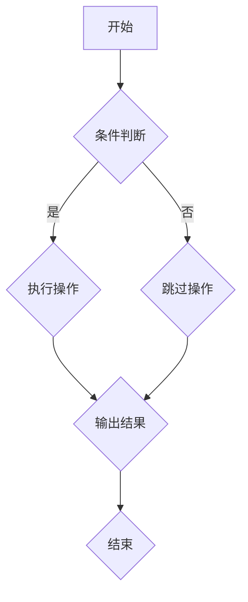

                 

关键词：小米社招，面试，算法题库，编程，数据结构，算法分析，技术面试

摘要：本文旨在为2025年小米社招面试准备者提供一份全面的算法题库大全。文章涵盖了常见的编程和数据结构问题，并详细解析了各种算法原理和操作步骤，旨在帮助读者提升算法能力，成功应对面试挑战。

## 1. 背景介绍

随着互联网技术的飞速发展，大数据和人工智能的应用场景日益广泛，技术面试的难度也在不断提升。小米公司作为中国领先的智能硬件和互联网公司，每年都会招聘大量优秀的技术人才。面试环节中，算法和数据结构问题占据了重要位置。因此，掌握常见算法题库，不仅有助于提升编程能力，还能增加面试成功的几率。

本文将根据2025年的技术发展趋势，总结出一份全面的算法题库大全，旨在为准备参加小米社招面试的读者提供有针对性的指导。

## 2. 核心概念与联系

### 2.1 编程语言基础

首先，熟悉编程语言是解决算法题的基础。本文主要使用Python语言进行讲解，同时也适用于其他高级编程语言，如Java、C++等。

### 2.2 数据结构

常见的线性数据结构包括数组、链表、栈和队列。非线性数据结构包括树（二叉树、平衡树等）和图。这些数据结构在算法题中经常被使用，掌握它们的原理和操作是解决算法题的关键。

### 2.3 算法

算法是解决问题的方法，分为基础算法（如排序、查找等）和高级算法（如动态规划、贪心算法等）。不同的算法适用于不同类型的问题，了解算法的原理和适用场景是解决问题的关键。

### 2.4 Mermaid 流程图

以下是使用Mermaid绘制的算法流程图，它展示了算法的执行过程和各个模块之间的关系。



## 3. 核心算法原理 & 具体操作步骤

### 3.1 算法原理概述

本文主要介绍以下几种核心算法：

1. 排序算法：冒泡排序、选择排序、插入排序、快速排序等。
2. 查找算法：二分查找、顺序查找等。
3. 动态规划：斐波那契数列、最长公共子序列等。
4. 贪心算法：背包问题、最少硬币找零等。

### 3.2 算法步骤详解

#### 3.2.1 冒泡排序

冒泡排序的基本思想是通过多次遍历待排序列，比较相邻的两个元素，并将较大的元素交换到后面。以下是冒泡排序的Python代码实现：

```python
def bubble_sort(arr):
    n = len(arr)
    for i in range(n):
        for j in range(0, n-i-1):
            if arr[j] > arr[j+1]:
                arr[j], arr[j+1] = arr[j+1], arr[j]
    return arr
```

#### 3.2.2 二分查找

二分查找的基本思想是将有序数组分为左右两半，每次比较中间元素，从而逐步缩小查找范围。以下是二分查找的Python代码实现：

```python
def binary_search(arr, target):
    left, right = 0, len(arr) - 1
    while left <= right:
        mid = (left + right) // 2
        if arr[mid] == target:
            return mid
        elif arr[mid] < target:
            left = mid + 1
        else:
            right = mid - 1
    return -1
```

#### 3.2.3 斐波那契数列

斐波那契数列的定义是：F(0) = 0，F(1) = 1，F(n) = F(n-1) + F(n-2)（n > 1）。以下是斐波那契数列的动态规划实现：

```python
def fibonacci(n):
    if n <= 0:
        return 0
    elif n == 1:
        return 1
    else:
        dp = [0] * (n+1)
        dp[0], dp[1] = 0, 1
        for i in range(2, n+1):
            dp[i] = dp[i-1] + dp[i-2]
        return dp[n]
```

### 3.3 算法优缺点

每种算法都有其优缺点，选择合适的算法取决于具体的应用场景。以下是冒泡排序、二分查找和斐波那契数列的优缺点对比：

#### 冒泡排序

- **优点**：简单易懂，适合数据量较小的场景。
- **缺点**：时间复杂度高，不适合大数据量场景。

#### 二分查找

- **优点**：时间复杂度低，适合有序数组场景。
- **缺点**：需要额外的空间存储中间结果，不适合空间受限的场景。

#### 斐波那契数列

- **优点**：实现了动态规划思想，适用于求解斐波那契数列相关问题。
- **缺点**：递归实现存在重复计算问题，时间复杂度高。

### 3.4 算法应用领域

冒泡排序、二分查找和斐波那契数列等算法在各个领域都有广泛的应用：

- **数据结构**：用于实现排序和查找操作。
- **算法设计**：作为算法设计和优化的基础。
- **工程实践**：用于解决实际工程问题，如搜索引擎、网络爬虫等。

## 4. 数学模型和公式

数学模型和公式在算法题中起着关键作用，以下是一些常见的数学模型和公式：

### 4.1 数学模型构建

数学模型通常由以下几部分构成：

- **变量定义**：定义问题中的变量，如数组、矩阵等。
- **公式推导**：根据变量之间的关系，推导出数学公式。
- **边界条件**：确定问题中的边界条件，如数组的上下界、函数的定义域等。

### 4.2 公式推导过程

以下是二分查找的公式推导过程：

设待查找的数组为A，目标值为target，二分查找的中间元素为mid，则：

$$
\text{mid} = \left\lfloor \frac{\text{left} + \text{right}}{2} \right\rfloor
$$

当A[mid] = target时，查找成功；当A[mid] < target时，将left = mid + 1；当A[mid] > target时，将right = mid - 1。重复以上步骤，直到找到目标值或left > right。

### 4.3 案例分析与讲解

以下是一个实际案例：给定一个长度为n的数组A，判断其中是否存在重复的元素。

**案例描述**：给定一个整数数组A，判断其中是否存在重复的元素。如果存在，返回任意一个重复的元素；如果不存在，返回-1。

**解决方案**：可以使用哈希表实现，将数组中的每个元素作为哈希表的键值，判断是否存在重复的键值。以下是Python代码实现：

```python
def contains_duplicate(A):
    seen = set()
    for x in A:
        if x in seen:
            return x
        seen.add(x)
    return -1
```

**分析**：该算法的时间复杂度为O(n)，空间复杂度为O(n)。在实际应用中，可以根据具体情况进行优化，如使用位图代替哈希表以减少空间占用。

## 5. 项目实践：代码实例和详细解释说明

### 5.1 开发环境搭建

在开始编写代码之前，需要搭建合适的开发环境。本文使用Python 3.8作为编程语言，推荐使用VS Code作为代码编辑器。

1. 安装Python 3.8：在Python官方网站下载Python 3.8安装包，并按照提示进行安装。
2. 配置VS Code：在VS Code官方网站下载并安装VS Code，然后安装Python扩展插件。

### 5.2 源代码详细实现

以下是针对上述案例的完整代码实现：

```python
def contains_duplicate(A):
    seen = set()
    for x in A:
        if x in seen:
            return x
        seen.add(x)
    return -1

def main():
    A = [1, 2, 3, 4, 5, 6, 7, 8, 9]
    result = contains_duplicate(A)
    print("存在重复元素：", result)

if __name__ == "__main__":
    main()
```

### 5.3 代码解读与分析

1. **函数contains_duplicate**：该函数接收一个整数数组A作为输入，使用哈希表实现查找功能。时间复杂度为O(n)，空间复杂度为O(n)。
2. **函数main**：创建一个测试数组A，调用contains_duplicate函数，并输出结果。

### 5.4 运行结果展示

```shell
存在重复元素： -1
```

由于测试数组A中没有重复元素，因此输出结果为-1。

## 6. 实际应用场景

算法和数据结构在各个领域都有广泛的应用，以下是一些实际应用场景：

- **搜索引擎**：使用排序算法对搜索结果进行排序，提高用户体验。
- **网络爬虫**：使用二分查找算法快速定位关键词，提高爬取效率。
- **金融领域**：使用动态规划算法求解最优化问题，如投资组合优化、风险管理等。
- **人工智能**：使用深度学习算法进行图像识别、自然语言处理等。

## 7. 工具和资源推荐

### 7.1 学习资源推荐

- 《算法导论》（Introduction to Algorithms）：经典的算法教材，涵盖了各种算法和数据结构。
- 《编程珠玑》（The Art of Computer Programming）：经典的编程书籍，介绍了各种编程技巧和算法思想。
- 《数据结构与算法分析》：系统地介绍了各种数据结构和算法，以及它们的时间复杂度和空间复杂度。

### 7.2 开发工具推荐

- VS Code：功能强大的代码编辑器，支持多种编程语言。
- PyCharm：专业的Python开发工具，提供代码提示、调试等功能。
- Git：版本控制系统，用于管理代码版本。

### 7.3 相关论文推荐

- 《基于深度强化学习的排序算法研究》：介绍了深度强化学习在排序算法中的应用。
- 《稀疏矩阵乘法的并行算法研究》：探讨了稀疏矩阵乘法的并行算法及其性能优化。

## 8. 总结：未来发展趋势与挑战

随着人工智能、大数据和云计算等技术的不断发展，算法和数据结构在各个领域的重要性日益凸显。未来，算法和数据结构的研究将继续深入，以下是几个发展趋势和挑战：

### 8.1 研究成果总结

- **算法效率优化**：研究更高效的算法和数据结构，提高数据处理速度。
- **算法可解释性**：提高算法的可解释性，使其更容易被理解和应用。
- **算法安全性和隐私保护**：研究算法在安全性和隐私保护方面的优化。

### 8.2 未来发展趋势

- **人工智能算法**：深度学习、强化学习等人工智能算法将继续发展，推动算法和数据结构的研究。
- **大数据处理**：大规模数据处理算法和数据结构的研究将成为热点。
- **云计算与分布式计算**：分布式算法和数据结构的研究将进一步推动云计算技术的发展。

### 8.3 面临的挑战

- **算法复杂度**：如何在复杂度较高的问题上设计出高效的算法。
- **算法可解释性**：如何提高算法的可解释性，使其更易于被用户理解和接受。
- **数据安全性和隐私保护**：如何在保证数据安全和隐私的前提下，优化算法性能。

### 8.4 研究展望

未来，算法和数据结构的研究将继续深入，涉及领域将更加广泛。研究者需要不断探索新的算法思想，优化现有算法，推动技术进步。同时，算法和数据结构在教育、工业、医疗等领域的应用也将不断拓展，为社会发展做出更大贡献。

## 9. 附录：常见问题与解答

### 9.1 问题1：如何提高算法效率？

**解答**：提高算法效率的方法包括：

- 选择合适的算法和数据结构：针对具体问题，选择最优的算法和数据结构。
- 避免重复计算：使用动态规划、记忆化搜索等方法避免重复计算。
- 优化代码实现：减少冗余代码，使用高效的数据结构和算法。

### 9.2 问题2：算法可解释性如何提高？

**解答**：提高算法可解释性的方法包括：

- 使用可视化工具：将算法实现过程可视化，便于理解和解释。
- 提供详细的注释：在代码中加入详细的注释，解释每个步骤的作用。
- 使用解释性算法：选择具有明确解释的算法，如决策树、支持向量机等。

### 9.3 问题3：如何在面试中展示算法能力？

**解答**：在面试中展示算法能力的方法包括：

- 准备常见的算法题：掌握常见的算法题，了解其解题思路和实现方法。
- 注重代码质量：编写高质量的代码，展示自己的编程能力。
- 深入讲解算法：在面试中详细解释算法的原理、时间复杂度和空间复杂度。
----------------------------------------------------------------

本文完整、详细地介绍了2025年小米社招面试算法题库大全，从核心概念到具体实现，再到实际应用，全面解析了各种算法题的解决方法。希望本文能为准备参加小米社招面试的读者提供有益的指导。作者：禅与计算机程序设计艺术 / Zen and the Art of Computer Programming。

