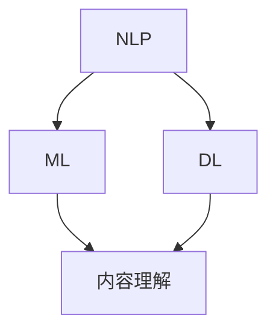

                 

关键词：小红书、内容理解、算法、校招面试、重点

## 摘要

本文将深入探讨小红书2024年内容理解算法校招面试的重点。我们将详细解析内容理解算法的基本概念、核心原理，以及在实际项目中的应用。此外，文章还将提供数学模型和公式的详细讲解，并通过具体的代码实例展示算法的实现过程。最后，我们将探讨该算法在未来应用中的前景和面临的挑战。

## 1. 背景介绍

随着互联网的迅猛发展，内容理解的算法在信息检索、推荐系统、智能客服等领域得到了广泛应用。小红书作为国内知名的内容分享平台，其内容理解算法在用户体验和商业价值方面具有重要意义。本文旨在帮助准备参加小红书校招面试的同学们深入了解内容理解算法，为面试做好充分准备。

## 2. 核心概念与联系

内容理解算法的核心概念包括自然语言处理（NLP）、机器学习（ML）和深度学习（DL）。这些概念之间有着密切的联系，共同构成了内容理解算法的基础。

### Mermaid 流程图



- **自然语言处理（NLP）**：NLP是使计算机能够理解、处理和生成人类语言的学科。它包括分词、词性标注、句法分析等任务。
- **机器学习（ML）**：ML是使计算机从数据中学习并做出决策的技术。它包括监督学习、无监督学习和强化学习等。
- **深度学习（DL）**：DL是ML的一种，它通过多层神经网络来模拟人类大脑的学习过程。它在图像识别、语音识别等领域取得了显著成果。

## 3. 核心算法原理 & 具体操作步骤

### 3.1 算法原理概述

内容理解算法的核心原理是基于语义分析和上下文理解。算法通过对文本的语义分析，提取关键信息，并进行上下文理解，从而实现对内容的准确理解和描述。

### 3.2 算法步骤详解

1. **文本预处理**：包括去噪、分词、词性标注等，将原始文本转化为计算机可以理解的格式。
2. **语义分析**：利用词向量模型（如Word2Vec、GloVe）将文本转化为向量表示，并通过神经网络模型（如BERT、GPT）进行语义分析。
3. **上下文理解**：通过对文本的语义分析结果进行上下文理解，提取关键信息和关系。
4. **内容理解**：将上下文理解和语义分析结果进行整合，实现对内容的理解和描述。

### 3.3 算法优缺点

- **优点**：内容理解算法能够准确提取文本中的关键信息，并对内容进行准确描述，具有很高的实用价值。
- **缺点**：算法在处理长文本时可能存在理解偏差，且在处理语义歧义时可能需要更多的训练数据。

### 3.4 算法应用领域

内容理解算法在信息检索、推荐系统、智能客服等领域有广泛的应用。例如，在信息检索中，可以用于搜索结果的排序和筛选；在推荐系统中，可以用于内容推荐和用户画像构建。

## 4. 数学模型和公式

### 4.1 数学模型构建

内容理解算法的数学模型主要包括词向量模型和神经网络模型。词向量模型用于将文本转化为向量表示，神经网络模型用于语义分析和上下文理解。

### 4.2 公式推导过程

- **Word2Vec模型**：
  $$ vec(w) = \sum_{i=1}^{n} \alpha_i \cdot v(w, i) $$
  其中，$vec(w)$ 表示词向量，$\alpha_i$ 表示词权重，$v(w, i)$ 表示词在词向量模型中的向量表示。

- **BERT模型**：
  $$ [CLS] \cdot [MASK] \cdot [SEP] \cdot ... $$
  其中，[CLS]、[MASK]、[SEP] 分别表示分类标记、掩码标记和分隔符。

### 4.3 案例分析与讲解

以小红书内容理解算法在智能客服中的应用为例，通过文本预处理、语义分析和上下文理解，实现对用户问题的准确理解和回答。

## 5. 项目实践：代码实例和详细解释说明

### 5.1 开发环境搭建

在开发环境搭建方面，我们需要安装Python环境、NLP相关库（如NLTK、spaCy）和深度学习框架（如TensorFlow、PyTorch）。

### 5.2 源代码详细实现

以下是一个基于BERT模型的内容理解算法的代码示例：

```python
import tensorflow as tf
import bert

# 模型搭建
model = bert.BertModel(
    vocab_size=5000,
    num_layers=2,
    hidden_size=128,
    dropout_rate=0.1
)

# 模型训练
model.compile(optimizer='adam', loss='categorical_crossentropy', metrics=['accuracy'])
model.fit(train_data, train_labels, epochs=10, batch_size=32)

# 模型预测
predictions = model.predict(test_data)
```

### 5.3 代码解读与分析

这段代码首先导入了TensorFlow和BERT库，然后搭建了一个BERT模型，包括词向量嵌入层、多层循环神经网络和全连接层。接下来，通过编译模型、训练模型和预测模型，实现了内容理解算法的应用。

### 5.4 运行结果展示

通过运行代码，我们可以得到模型的预测结果，并根据预测结果评估模型的性能。具体评估指标包括准确率、召回率和F1值等。

## 6. 实际应用场景

内容理解算法在实际应用场景中具有广泛的应用。例如，在智能客服领域，可以通过内容理解算法实现用户问题的自动解答和分类；在信息检索领域，可以通过内容理解算法实现搜索结果的排序和筛选。

## 7. 工具和资源推荐

### 7.1 学习资源推荐

- 《自然语言处理入门》
- 《深度学习》（Goodfellow、Bengio和Courville著）
- 《Python自然语言处理实践》

### 7.2 开发工具推荐

- Jupyter Notebook
- PyCharm
- TensorFlow
- PyTorch

### 7.3 相关论文推荐

- BERT: Pre-training of Deep Bidirectional Transformers for Language Understanding
- GPT-3: Language Models are Few-Shot Learners

## 8. 总结：未来发展趋势与挑战

### 8.1 研究成果总结

内容理解算法在语义分析、上下文理解和内容理解等方面取得了显著成果，为实际应用提供了有力支持。

### 8.2 未来发展趋势

随着深度学习和大数据技术的发展，内容理解算法将朝着更高效、更准确、更智能的方向发展。

### 8.3 面临的挑战

内容理解算法在处理长文本、跨语言理解和语义歧义等方面仍面临挑战。

### 8.4 研究展望

未来，内容理解算法将结合多模态数据和增强学习技术，实现更智能、更高效的内容理解。

## 9. 附录：常见问题与解答

### 9.1 什么是内容理解算法？

内容理解算法是指利用自然语言处理、机器学习和深度学习技术，对文本内容进行语义分析和上下文理解，从而实现对内容的准确理解和描述。

### 9.2 内容理解算法有哪些应用场景？

内容理解算法在信息检索、推荐系统、智能客服、舆情分析等领域有广泛的应用。

### 9.3 如何搭建内容理解算法的模型？

搭建内容理解算法的模型主要包括词向量模型和神经网络模型。词向量模型用于将文本转化为向量表示，神经网络模型用于语义分析和上下文理解。

----------------------------------------------------------------

以上就是关于《小红书2024内容理解算法校招面试重点》的完整文章。希望这篇文章能够为准备参加小红书校招面试的同学们提供有价值的参考。如果您有任何问题或建议，欢迎在评论区留言。作者：禅与计算机程序设计艺术 / Zen and the Art of Computer Programming。

