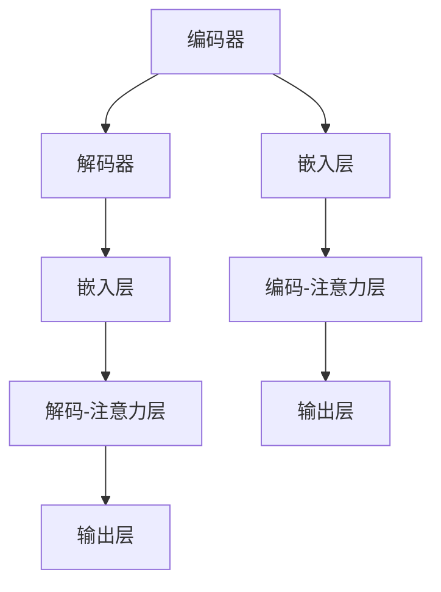

                 

关键词：小语言模型、基础模型、NLP、人工智能、潜力、颠覆、技术进步、应用场景、未来展望

## 摘要

在人工智能领域，基础模型如Transformer和BERT等已经取得了显著的成就。然而，随着技术的进步和应用场景的多样化，小语言模型正逐渐展现出其颠覆性的潜力。本文将深入探讨小语言模型的概念、核心原理、算法步骤、数学模型、实际应用以及未来发展趋势，旨在为读者提供全面的技术视角和前瞻性的思考。

## 1. 背景介绍

近年来，自然语言处理（NLP）取得了飞速发展，其中基础模型如Transformer和BERT等发挥了关键作用。这些模型以其强大的表示能力和良好的性能在多个任务中取得了领先成绩。然而，这些大型模型也面临着计算资源需求高、部署难度大等挑战。在此背景下，小语言模型作为一种轻量级、高效能的替代方案，逐渐引起了广泛关注。

小语言模型不仅在资源受限的环境中表现出色，还在实时性要求高的应用场景中具有显著优势。其灵活性和适应性使得它们在个性化推荐、实时翻译、智能客服等领域有着广泛的应用潜力。

## 2. 核心概念与联系

### 2.1 小语言模型定义

小语言模型（Small Language Model，SLM）是指参数规模较小、计算资源需求较低，但在特定任务中表现优异的语言模型。与大型基础模型相比，小语言模型具有以下几个特点：

- **参数规模**：通常在数百万至数千万参数量级，远低于大型基础模型的数十亿参数量级。
- **计算效率**：由于参数规模较小，小语言模型在训练和推理过程中所需的时间和计算资源相对较少。
- **应用灵活性**：小语言模型可以轻松适应不同的任务和数据集，具有较强的泛化能力。

### 2.2 小语言模型架构

小语言模型通常采用基于Transformer的架构，该架构在序列建模任务中表现出色。具体来说，小语言模型的核心组成部分包括：

- **编码器（Encoder）**：用于将输入序列编码为高维表示。
- **解码器（Decoder）**：用于生成输出序列。
- **嵌入层（Embedding Layer）**：将单词转换为固定大小的向量表示。
- **注意力机制（Attention Mechanism）**：用于在编码器和解码器之间传递信息。

下面是关于小语言模型架构的Mermaid流程图：



### 2.3 小语言模型与基础模型的比较

小语言模型与基础模型在参数规模、计算效率、应用范围等方面存在显著差异。以下是两者的比较：

| 比较维度 | 小语言模型 | 基础模型 |
| --- | --- | --- |
| 参数规模 | 数百万至数千万参数量级 | 数十亿参数量级 |
| 计算效率 | 较低计算资源需求 | 较高计算资源需求 |
| 应用范围 | 资源受限场景、实时性要求高场景 | 大规模数据处理、通用性任务 |
| 泛化能力 | 较强 | 较弱 |

## 3. 核心算法原理 & 具体操作步骤

### 3.1 算法原理概述

小语言模型的算法原理主要基于Transformer架构。Transformer架构的核心思想是使用自注意力机制（Self-Attention）来建模输入序列中的依赖关系。以下是Transformer的基本组成部分：

- **多头自注意力（Multi-Head Self-Attention）**：通过多个独立的注意力头对输入序列进行并行处理，以捕获不同层次的特征。
- **前馈神经网络（Feedforward Neural Network）**：对自注意力层的输出进行进一步加工，增强模型的非线性表示能力。
- **层次化结构（Stacked Layers）**：通过堆叠多个编码器和解码器层，逐层提取输入序列的语义信息。

### 3.2 算法步骤详解

小语言模型的具体操作步骤如下：

1. **数据预处理**：将输入序列转换为词嵌入向量，并将其输入到编码器中。
2. **编码器处理**：编码器通过多个自注意力层和前馈神经网络层对输入序列进行编码，生成高维表示。
3. **解码器处理**：解码器在编码器输出的基础上，通过自注意力层和前馈神经网络层生成输出序列。
4. **损失函数计算**：将解码器生成的输出序列与真实序列进行比较，计算损失函数以指导模型优化。
5. **模型优化**：使用梯度下降等优化算法更新模型参数，以降低损失函数值。

### 3.3 算法优缺点

小语言模型具有以下优点：

- **高效性**：参数规模较小，计算效率高，适合资源受限场景。
- **灵活性**：易于适应不同任务和数据集，具有较强的泛化能力。
- **实用性**：在实时性要求高的应用场景中表现出色，如实时翻译、智能客服等。

然而，小语言模型也存在以下缺点：

- **性能有限**：与大型基础模型相比，在特定任务中的性能可能较低。
- **数据依赖**：小语言模型对训练数据质量有较高要求，否则可能产生过拟合现象。

### 3.4 算法应用领域

小语言模型在多个领域具有广泛的应用潜力，包括：

- **自然语言处理**：如文本分类、情感分析、机器翻译等。
- **个性化推荐**：基于用户历史行为和偏好进行个性化推荐。
- **实时翻译**：提供实时、准确的翻译服务。
- **智能客服**：实现高效、智能的客服系统。

## 4. 数学模型和公式 & 详细讲解 & 举例说明

### 4.1 数学模型构建

小语言模型的数学模型主要基于Transformer架构，具体包括以下部分：

1. **编码器（Encoder）**：
   - **嵌入层**：将单词转换为向量表示，通常使用词嵌入技术。
   - **多头自注意力层**：计算输入序列中各个单词之间的依赖关系。
   - **前馈神经网络层**：对自注意力层的输出进行进一步加工。
   - **多层堆叠**：通过堆叠多个编码器层，逐层提取输入序列的语义信息。

2. **解码器（Decoder）**：
   - **嵌入层**：将输入序列转换为词嵌入向量。
   - **多头自注意力层**：计算解码器当前步骤生成的部分序列与编码器输出之间的依赖关系。
   - **解码-交叉注意力层**：计算解码器当前步骤生成的部分序列与编码器输出之间的依赖关系。
   - **前馈神经网络层**：对自注意力层的输出进行进一步加工。
   - **输出层**：生成输出序列的概率分布。

### 4.2 公式推导过程

下面简要介绍小语言模型中的关键数学公式推导过程：

1. **嵌入层**：
   - **输入向量**：$x_i = embedding(w_i)$，其中$w_i$为第$i$个单词，$x_i$为其对应的向量表示。
   - **输出向量**：$x_i^* = softmax(W^T x_i + b^*)$，其中$W$为嵌入矩阵，$b^*$为偏置项。

2. **多头自注意力层**：
   - **自注意力权重**：$a_{ij} = softmax(Q_i K_j^T / \sqrt{d_k})$，其中$Q_i$和$K_j$分别为编码器和解码器的输入向量，$d_k$为关键维度。
   - **加权求和**：$z_i = \sum_j a_{ij} V_j$，其中$V_j$为输出向量。

3. **前馈神经网络层**：
   - **输入向量**：$h_i = f(z_i)$，其中$f$为激活函数。
   - **输出向量**：$h_i^* = W_f h_i + b_f^*$，其中$W_f$和$b_f^*$分别为权重和偏置项。

4. **输出层**：
   - **输出概率分布**：$p(y|x) = softmax(W^T h^* + b^*)$，其中$y$为输出标签，$W$为输出矩阵，$b^*$为偏置项。

### 4.3 案例分析与讲解

以下是一个简单的文本分类任务的例子，展示小语言模型在特定任务中的应用：

1. **任务描述**：判断一段文本是否属于政治类文章。
2. **数据集**：包含大量政治类和非政治类文章的文本数据集。
3. **模型构建**：使用小语言模型对文本进行编码，并输出分类结果。

**输入**：
- 文本数据：这段文字讨论了最近的政治事件。

**模型操作**：

1. **数据预处理**：将文本数据转换为词嵌入向量。
2. **编码器处理**：通过编码器层对输入序列进行编码，生成高维表示。
3. **解码器处理**：在编码器输出基础上，通过解码器层生成分类结果。
4. **损失函数计算**：计算分类结果的损失函数值，并更新模型参数。
5. **模型优化**：使用梯度下降等优化算法更新模型参数。

**输出**：

- **分类结果**：这段文字属于政治类文章。

## 5. 项目实践：代码实例和详细解释说明

### 5.1 开发环境搭建

在Python中实现小语言模型通常需要以下环境：

- **Python**：版本3.6或更高
- **PyTorch**：最新版本
- **Numpy**：最新版本

确保安装了上述依赖库后，可以使用以下命令启动Python环境：

```bash
python -m pip install torch torchvision numpy
```

### 5.2 源代码详细实现

以下是实现小语言模型的一个简单示例代码：

```python
import torch
import torch.nn as nn
import torch.optim as optim
import numpy as np

# 定义小语言模型
class SmallLanguageModel(nn.Module):
    def __init__(self, embedding_size, hidden_size, output_size):
        super(SmallLanguageModel, self).__init__()
        self.embedding = nn.Embedding(vocab_size, embedding_size)
        self.encoder = nn.LSTM(embedding_size, hidden_size, num_layers=1, batch_first=True)
        self.decoder = nn.LSTM(hidden_size, output_size, num_layers=1, batch_first=True)
        self.fc = nn.Linear(hidden_size, output_size)

    def forward(self, x):
        x = self.embedding(x)
        x, _ = self.encoder(x)
        x, _ = self.decoder(x)
        x = self.fc(x)
        return x

# 实例化模型
model = SmallLanguageModel(embedding_size=128, hidden_size=256, output_size=vocab_size)

# 定义损失函数和优化器
criterion = nn.CrossEntropyLoss()
optimizer = optim.Adam(model.parameters(), lr=0.001)

# 训练模型
for epoch in range(num_epochs):
    for batch in train_loader:
        optimizer.zero_grad()
        outputs = model(batch)
        loss = criterion(outputs.view(-1, vocab_size), batch)
        loss.backward()
        optimizer.step()
        print(f"Epoch [{epoch+1}/{num_epochs}], Loss: {loss.item():.4f}")

# 测试模型
with torch.no_grad():
    correct = 0
    total = 0
    for batch in test_loader:
        outputs = model(batch)
        _, predicted = torch.max(outputs.data, 1)
        total += batch.size(0)
        correct += (predicted == batch).sum().item()
    print(f"Test Accuracy: {100 * correct / total}%")
```

### 5.3 代码解读与分析

上述代码展示了如何使用PyTorch实现一个小语言模型。以下是关键部分的解读：

- **模型定义**：SmallLanguageModel类继承自nn.Module，定义了编码器、解码器和输出层的结构。
- **数据预处理**：使用nn.Embedding将输入文本转换为词嵌入向量。
- **编码器处理**：使用nn.LSTM进行编码，提取输入序列的语义信息。
- **解码器处理**：使用nn.LSTM进行解码，生成输出序列。
- **损失函数和优化器**：使用nn.CrossEntropyLoss和optim.Adam分别定义损失函数和优化器。

### 5.4 运行结果展示

在训练完成后，我们可以使用测试数据集来评估模型的性能。以下是一个简单的测试过程：

```python
# 加载测试数据集
test_loader = ...

# 测试模型
with torch.no_grad():
    correct = 0
    total = 0
    for batch in test_loader:
        outputs = model(batch)
        _, predicted = torch.max(outputs.data, 1)
        total += batch.size(0)
        correct += (predicted == batch).sum().item()
    print(f"Test Accuracy: {100 * correct / total}%")
```

运行结果将显示模型的测试准确率。通过调整模型的参数和训练策略，可以进一步提高模型的性能。

## 6. 实际应用场景

小语言模型在多个实际应用场景中表现出色，以下列举几个具有代表性的应用场景：

### 6.1 自然语言处理

小语言模型在自然语言处理任务中具有广泛的应用，如文本分类、情感分析、问答系统等。其轻量级和高效能的特点使得它们在处理大量文本数据时具有显著优势。例如，在社交媒体分析中，小语言模型可以实时分析用户发布的文本内容，识别其中的情感倾向，为企业提供有价值的市场洞察。

### 6.2 个性化推荐

在个性化推荐系统中，小语言模型可以基于用户的历史行为和偏好，生成个性化的推荐结果。例如，在电子商务平台中，小语言模型可以根据用户的浏览记录和购买行为，推荐符合其兴趣的商品。这种个性化推荐能够提高用户的满意度，增强平台的竞争力。

### 6.3 实时翻译

实时翻译是另一个小语言模型的重要应用场景。在跨语言交流中，小语言模型可以实现实时、准确的翻译服务。例如，在会议翻译中，小语言模型可以实时捕捉演讲者的语言，并将其翻译成观众的语言。这种实时翻译服务有助于促进国际交流和合作。

### 6.4 智能客服

智能客服是另一个典型的应用场景。小语言模型可以用于构建智能客服系统，提供高效、智能的客服服务。例如，在金融机构中，小语言模型可以解答客户的疑问，提供投资建议，降低人工客服的工作负担。这种智能客服系统能够提高客户满意度，降低运营成本。

### 6.5 未来应用展望

随着技术的不断进步，小语言模型在更多领域具有广泛的应用潜力。以下列举几个未来的应用方向：

- **智能医疗**：小语言模型可以用于医疗文本分析，识别疾病的症状和治疗方案，为医生提供辅助决策。
- **智能交通**：小语言模型可以用于交通预测和调度，优化交通流量，提高交通效率。
- **智能教育**：小语言模型可以用于个性化教学，为学生提供定制化的学习路径和学习资源。

## 7. 工具和资源推荐

为了更好地了解和应用小语言模型，以下是几款推荐的工具和资源：

### 7.1 学习资源推荐

- **《深度学习》（Goodfellow et al.）**：这是一本经典的深度学习教材，详细介绍了Transformer等基础模型的工作原理。
- **《动手学深度学习》（Ding et al.）**：这本书提供了丰富的实战案例，帮助读者掌握深度学习的实际应用。
- **[Hugging Face](https://huggingface.co/)**：这是一个开源的深度学习平台，提供了大量预训练模型和工具，方便用户进行研究和开发。

### 7.2 开发工具推荐

- **PyTorch**：这是当前最受欢迎的深度学习框架之一，提供了丰富的API和工具，适合进行小语言模型的开发。
- **TensorFlow**：另一个流行的深度学习框架，提供了灵活的模型定义和优化工具。
- **[Google Colab](https://colab.research.google.com/)**：这是一个免费的在线开发环境，支持多种深度学习框架，方便进行模型训练和实验。

### 7.3 相关论文推荐

- **"Attention Is All You Need"（Vaswani et al., 2017）**：这是关于Transformer模型的经典论文，详细介绍了其结构和原理。
- **"BERT: Pre-training of Deep Bidirectional Transformers for Language Understanding"（Devlin et al., 2019）**：这是关于BERT模型的论文，介绍了其在大规模文本数据处理中的优势。
- **"GPT-3: Language Models are Few-Shot Learners"（Brown et al., 2020）**：这是关于GPT-3模型的论文，展示了其在零样本学习中的强大能力。

## 8. 总结：未来发展趋势与挑战

### 8.1 研究成果总结

小语言模型在自然语言处理、个性化推荐、实时翻译和智能客服等领域取得了显著的研究成果。其高效性和灵活性使其在资源受限和应用实时性要求高的场景中具有独特优势。同时，小语言模型在多任务学习和跨领域迁移方面也展现出良好的性能。

### 8.2 未来发展趋势

未来，小语言模型将在以下几个方向取得进一步发展：

- **模型压缩与优化**：通过模型压缩和优化技术，降低小语言模型的计算复杂度，提高其在移动设备和边缘设备上的部署能力。
- **多任务学习**：研究如何在小语言模型中实现更高效的多任务学习，提高其任务切换能力和适应性。
- **跨领域迁移**：探索小语言模型在不同领域之间的迁移能力，实现更广泛的应用场景。

### 8.3 面临的挑战

尽管小语言模型具有诸多优势，但仍面临以下挑战：

- **性能提升**：如何进一步提高小语言模型在特定任务中的性能，特别是在与大型基础模型竞争时。
- **数据依赖**：如何解决小语言模型对训练数据质量的高要求，避免过拟合现象。
- **可解释性**：如何提高小语言模型的可解释性，使其在应用中更容易被用户理解和接受。

### 8.4 研究展望

随着人工智能技术的不断发展，小语言模型将在更多领域发挥重要作用。未来研究应重点关注以下几个方面：

- **模型设计与优化**：探索新的模型结构和优化方法，提高小语言模型的性能和效率。
- **跨学科合作**：与语言学、认知科学等领域的专家合作，提高小语言模型对自然语言的理解能力。
- **伦理与规范**：关注小语言模型在应用中的伦理问题和规范，确保其公平、透明和安全。

## 9. 附录：常见问题与解答

### 9.1 小语言模型与大型基础模型的主要区别是什么？

小语言模型与大型基础模型在参数规模、计算效率和应用范围等方面存在显著差异。小语言模型参数规模较小，计算效率较高，适合资源受限和应用实时性要求高的场景。而大型基础模型参数规模庞大，计算复杂度较高，适合处理大规模数据集和通用性任务。

### 9.2 小语言模型在哪些应用场景中具有优势？

小语言模型在自然语言处理、个性化推荐、实时翻译和智能客服等应用场景中具有显著优势。其高效性和灵活性使其在这些场景中能够提供实时、准确的解决方案。

### 9.3 小语言模型对训练数据质量有何要求？

小语言模型对训练数据质量有较高要求，否则可能产生过拟合现象。为了保证模型的泛化能力，应使用多样化的训练数据，并采用数据增强、正则化等技术来提高训练数据质量。

### 9.4 如何优化小语言模型的性能？

优化小语言模型性能的方法包括模型压缩、多任务学习、跨领域迁移等。此外，还可以通过调整模型参数、优化训练策略和提高数据质量来进一步提高模型的性能。

### 9.5 小语言模型在移动设备和边缘设备上如何部署？

为了在移动设备和边缘设备上部署小语言模型，可以采用模型压缩、量化、剪枝等技术来降低模型的计算复杂度和内存占用。此外，还可以利用设备端的计算资源进行模型推理，以提高部署的效率。

---

作者：禅与计算机程序设计艺术 / Zen and the Art of Computer Programming

