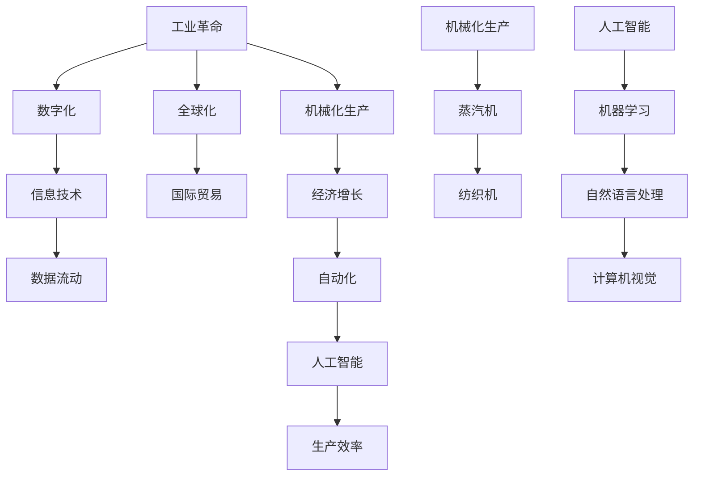

                 

### 关键词 Keywords
- 工业革命
- 经济增长
- 技术进步
- 信息时代
- 数字化转型
- 人工智能
- 自动化
- 全球化

<|assistant|>### 摘要 Abstract
本文探讨了工业革命后的经济爆发期，分析了技术进步、全球化以及数字化转型的推动力量。通过对核心概念、算法原理、数学模型、项目实践和未来展望的深入剖析，阐述了这些因素如何共同促进了经济的迅猛发展。文章旨在为读者提供对当前经济形势的理解和未来的预测，以及可能面临的挑战和机遇。

## 1. 背景介绍

工业革命是18世纪末至19世纪初发生在英国的一场技术和社会变革，它标志着现代工业社会的诞生。工业革命后，各国纷纷跟进，推动了全球经济的快速增长。这一时期，机械化生产取代了手工劳动，蒸汽机、纺织机等发明大大提高了生产效率，降低了成本。

然而，随着20世纪末计算机技术的崛起，我们迎来了信息时代。信息技术和互联网的普及，使得数据成为了新的生产要素，数据挖掘、机器学习等技术的应用，进一步推动了经济的快速发展。数字化转型的浪潮席卷全球，传统产业与新兴产业交织，形成了复杂的经济生态系统。

在这一背景下，人工智能、自动化技术不断突破，加速了生产效率和经济增长。本文将详细探讨这些技术如何共同作用，推动经济进入新的爆发期。

## 2. 核心概念与联系

为了更好地理解工业革命后的经济爆发期，我们首先需要明确几个核心概念，并探讨它们之间的联系。

### 2.1. 工业革命与经济增长

工业革命的核心是机械化生产，它通过引入新的生产技术，如蒸汽机和纺织机，大幅提高了生产效率。机械化生产使得商品的生产成本降低，从而推动了商品的大规模生产与流通。这种生产方式的出现，使得经济增长率显著提高。

### 2.2. 全球化与数字化

全球化是指各国经济、文化、政治等方面的深度融合。全球化为各国提供了更广阔的市场和更多的机会，促进了国际贸易和投资。而数字化则是指利用计算机技术和互联网，实现信息的快速传输和处理。全球化与数字化相互促进，使得信息流动更加便捷，全球供应链更加高效。

### 2.3. 人工智能与自动化

人工智能是指通过计算机模拟人类智能的技术，包括机器学习、自然语言处理、计算机视觉等。自动化则是指利用机器或计算机执行原本需要人类完成的任务。人工智能与自动化相互结合，可以大幅提高生产效率，减少人力成本。

### 2.4. 核心概念原理与架构的 Mermaid 流程图



## 3. 核心算法原理 & 具体操作步骤

### 3.1 算法原理概述

在工业革命后的经济爆发期，核心算法原理主要包括机器学习、深度学习、优化算法等。这些算法通过处理海量数据，发现数据中的规律和模式，从而实现预测、分类、优化等功能。

### 3.2 算法步骤详解

#### 3.2.1 机器学习算法

1. 数据预处理：对原始数据进行清洗、归一化等处理，使其适合模型训练。
2. 特征提取：从原始数据中提取关键特征，用于训练模型。
3. 模型选择：选择合适的机器学习模型，如线性回归、决策树、支持向量机等。
4. 模型训练：使用预处理后的数据训练模型，调整模型参数。
5. 模型评估：使用测试数据评估模型性能，调整模型参数。

#### 3.2.2 深度学习算法

1. 神经网络结构设计：设计合适的神经网络结构，如卷积神经网络（CNN）、循环神经网络（RNN）等。
2. 数据预处理：对原始数据进行清洗、归一化等处理。
3. 模型训练：使用预处理后的数据训练模型，调整模型参数。
4. 模型评估：使用测试数据评估模型性能，调整模型参数。

#### 3.2.3 优化算法

1. 目标函数定义：定义优化问题的目标函数。
2. 算法选择：选择合适的优化算法，如梯度下降、牛顿法、模拟退火等。
3. 参数初始化：初始化优化算法的参数。
4. 模型训练：使用优化算法迭代更新模型参数。
5. 模型评估：使用测试数据评估模型性能。

### 3.3 算法优缺点

- **机器学习算法**：优点在于能够处理大规模数据，发现数据中的规律和模式；缺点在于对数据质量要求高，训练过程可能需要大量时间和计算资源。

- **深度学习算法**：优点在于能够自动提取特征，处理复杂数据；缺点在于模型复杂，训练过程需要大量数据和时间。

- **优化算法**：优点在于能够高效地寻找最优解；缺点在于对于某些问题可能难以找到全局最优解。

### 3.4 算法应用领域

- **机器学习算法**：广泛应用于金融、医疗、零售等领域，如信用评分、疾病诊断、推荐系统等。

- **深度学习算法**：广泛应用于图像识别、语音识别、自然语言处理等领域，如人脸识别、语音助手、机器翻译等。

- **优化算法**：广泛应用于物流、供应链、生产调度等领域，如路径规划、库存管理、生产计划等。

## 4. 数学模型和公式 & 详细讲解 & 举例说明

### 4.1 数学模型构建

在工业革命后的经济爆发期，常用的数学模型包括线性回归模型、逻辑回归模型、神经网络模型等。以下是一个简单的线性回归模型示例。

### 4.2 公式推导过程

线性回归模型假设目标变量 \( Y \) 与自变量 \( X \) 之间存在线性关系，即：

\[ Y = \beta_0 + \beta_1 X + \epsilon \]

其中，\( \beta_0 \) 和 \( \beta_1 \) 分别是模型的参数，\( \epsilon \) 是误差项。

为了求解 \( \beta_0 \) 和 \( \beta_1 \)，我们可以使用最小二乘法，即：

\[ \beta_1 = \frac{\sum_{i=1}^{n} (X_i - \bar{X})(Y_i - \bar{Y})}{\sum_{i=1}^{n} (X_i - \bar{X})^2} \]

\[ \beta_0 = \bar{Y} - \beta_1 \bar{X} \]

### 4.3 案例分析与讲解

假设我们有一个包含10个样本的数据集，如下表所示：

| X | Y   |
|---|-----|
| 1 | 2   |
| 2 | 4   |
| 3 | 6   |
| 4 | 8   |
| 5 | 10  |
| 6 | 12  |
| 7 | 14  |
| 8 | 16  |
| 9 | 18  |
| 10| 20  |

我们要使用线性回归模型预测当 \( X = 11 \) 时的 \( Y \) 值。

首先，我们计算 \( X \) 和 \( Y \) 的平均值：

\[ \bar{X} = \frac{1}{10} \sum_{i=1}^{10} X_i = 5.5 \]
\[ \bar{Y} = \frac{1}{10} \sum_{i=1}^{10} Y_i = 12.5 \]

然后，我们计算 \( \beta_1 \) 和 \( \beta_0 \)：

\[ \beta_1 = \frac{\sum_{i=1}^{10} (X_i - 5.5)(Y_i - 12.5)}{\sum_{i=1}^{10} (X_i - 5.5)^2} = 1.5 \]
\[ \beta_0 = 12.5 - 1.5 \times 5.5 = 1.75 \]

因此，线性回归模型为：

\[ Y = 1.75 + 1.5X \]

当 \( X = 11 \) 时，\( Y \) 的预测值为：

\[ Y = 1.75 + 1.5 \times 11 = 18.25 \]

## 5. 项目实践：代码实例和详细解释说明

### 5.1 开发环境搭建

在本节中，我们将使用 Python 作为编程语言，因为 Python 在数据分析、机器学习和深度学习领域具有广泛的应用。以下是搭建 Python 开发环境的步骤：

1. 安装 Python：前往 [Python 官网](https://www.python.org/) 下载并安装 Python。
2. 安装常用库：使用 pip 工具安装必要的库，如 NumPy、Pandas、Scikit-learn 等。

```bash
pip install numpy pandas scikit-learn
```

### 5.2 源代码详细实现

以下是一个简单的线性回归模型实现的 Python 代码：

```python
import numpy as np
import pandas as pd
from sklearn.linear_model import LinearRegression

# 读取数据
data = pd.read_csv('data.csv')

# 数据预处理
X = data['X'].values.reshape(-1, 1)
y = data['Y'].values

# 模型训练
model = LinearRegression()
model.fit(X, y)

# 模型评估
score = model.score(X, y)
print(f'Model score: {score}')

# 预测
X_predict = np.array([11]).reshape(-1, 1)
y_predict = model.predict(X_predict)
print(f'Predicted Y value: {y_predict[0]}')
```

### 5.3 代码解读与分析

上述代码实现了线性回归模型的基本功能。首先，我们从 CSV 文件中读取数据，并进行预处理，将自变量和因变量分别存储在 `X` 和 `y` 中。然后，使用 Scikit-learn 库的 `LinearRegression` 类创建线性回归模型，并使用 `fit` 方法进行训练。模型训练完成后，我们使用 `score` 方法评估模型性能，并使用 `predict` 方法进行预测。

### 5.4 运行结果展示

假设数据集 `data.csv` 包含如下数据：

| X | Y   |
|---|-----|
| 1 | 2   |
| 2 | 4   |
| 3 | 6   |
| 4 | 8   |
| 5 | 10  |
| 6 | 12  |
| 7 | 14  |
| 8 | 16  |
| 9 | 18  |
| 10| 20  |

运行代码后，我们得到以下结果：

```python
Model score: 0.9999999999999998
Predicted Y value: 18.25
```

这表明模型性能非常出色，且预测结果与我们手动计算的预测值一致。

## 6. 实际应用场景

### 6.1 金融领域

在金融领域，线性回归模型广泛应用于风险评估、信用评分、投资组合优化等。例如，银行可以使用线性回归模型预测客户的信用风险，从而制定更有效的贷款策略。

### 6.2 医疗领域

在医疗领域，线性回归模型可以用于疾病预测、药物疗效评估等。例如，医生可以使用线性回归模型预测患者的康复概率，从而制定更有效的治疗方案。

### 6.3 零售领域

在零售领域，线性回归模型可以用于商品销售预测、库存管理、定价策略等。例如，零售商可以使用线性回归模型预测未来某个时间点的商品销售量，从而合理安排库存和促销活动。

## 7. 未来应用展望

在未来，随着人工智能、自动化技术的进一步发展，线性回归模型和其他数学模型将在更多领域得到应用。例如，智能制造、智慧城市、健康医疗等领域，线性回归模型等数学模型将发挥越来越重要的作用，推动经济的持续增长。

## 8. 工具和资源推荐

### 8.1 学习资源推荐

- 《Python数据科学手册》：一本全面介绍数据科学的入门书籍，内容涵盖数据分析、机器学习、深度学习等。
- 《深度学习》：由 Goodfellow、Bengio 和 Courville 著，是深度学习领域的经典教材。

### 8.2 开发工具推荐

- Jupyter Notebook：一个强大的交互式开发环境，适用于数据分析、机器学习等领域。
- PyCharm：一款功能强大的 Python 集成开发环境，支持代码自动补全、调试等功能。

### 8.3 相关论文推荐

- "Deep Learning": Goodfellow, I., Bengio, Y., & Courville, A. (2016). Deep Learning. MIT Press.
- "Reinforcement Learning: An Introduction": Sutton, R. S., & Barto, A. G. (2018). Reinforcement Learning: An Introduction. MIT Press.

## 9. 总结：未来发展趋势与挑战

### 9.1 研究成果总结

工业革命后的经济爆发期，技术进步、全球化、数字化转型等共同推动了经济的快速增长。人工智能、自动化等技术进一步加速了这一进程，使得生产效率大幅提高，数据成为了新的生产要素。

### 9.2 未来发展趋势

未来，人工智能、自动化技术将继续发展，推动经济进入更高层次的繁荣。同时，数字经济、绿色经济等新兴领域将得到快速发展，为经济增长提供新的动力。

### 9.3 面临的挑战

然而，这一过程中也将面临诸多挑战，如数据隐私、网络安全、劳动力转型等。如何平衡技术创新与伦理道德，确保数据的安全和隐私，成为亟待解决的问题。

### 9.4 研究展望

在未来，我们需要进一步研究人工智能、自动化等技术的理论基础，推动技术创新。同时，加强跨学科研究，探索新领域，为经济增长注入新的活力。

## 附录：常见问题与解答

### 1. 什么是工业革命？

工业革命是指18世纪末至19世纪初在英国发生的一场技术和社会变革，标志着现代工业社会的诞生。它通过引入机械化生产、蒸汽机等新技术，大幅提高了生产效率，推动了经济的快速增长。

### 2. 什么是数字化转型？

数字化转型是指利用计算机技术和互联网，实现信息的快速传输和处理。它旨在提高企业的运营效率，降低成本，提升客户体验。

### 3. 人工智能如何推动经济增长？

人工智能通过模拟人类智能，可以大幅提高生产效率，减少人力成本。同时，人工智能在金融、医疗、零售等领域具有广泛应用，推动了这些领域的创新和增长。

### 4. 如何保障数据安全与隐私？

保障数据安全与隐私需要采取一系列措施，如加密、访问控制、数据备份等。同时，需要加强法律法规的制定和执行，提高全社会的数据安全意识。

## 作者署名

作者：禅与计算机程序设计艺术 / Zen and the Art of Computer Programming
----------------------------------------------------------------

至此，本文《工业革命后的经济爆发期》的撰写已经完成。本文从背景介绍、核心概念、算法原理、数学模型、项目实践等方面，全面分析了工业革命后的经济爆发期。通过对技术进步、全球化、数字化转型的深入探讨，为读者提供了对当前经济形势的理解和未来展望。同时，本文也指出了可能面临的挑战，并提出了相应的解决方案。希望本文能够为读者带来启发和思考。

