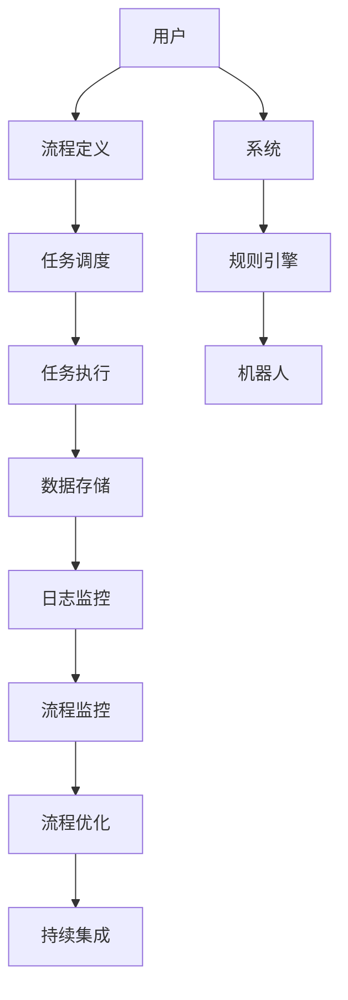

                 

关键词：工作流，DSL，标准化，语言，技术趋势，IT领域，软件开发，流程自动化。

> 摘要：本文将深入探讨工作流DSL（领域特定语言）语言的标准化趋势。首先，我们回顾工作流和DSL的基本概念，接着分析标准化工作流DSL的必要性，随后介绍一些重要的标准化工作流DSL的框架和工具，探讨它们的优势和挑战。最后，我们展望工作流DSL的标准化趋势，以及未来的发展方向和潜在的研究课题。

## 1. 背景介绍

### 工作流的基本概念

工作流（Workflow）是一种自动化流程，通过将任务、信息和数据在组织内部或跨组织之间流转，以实现特定业务目标。它是一种业务流程模型，描述了任务之间的逻辑关系和执行顺序。工作流的关键组成部分包括任务（Task）、参与者（Participant）、流程（Process）、规则（Rule）和触发器（Trigger）。

工作流在各类组织和管理系统中具有重要应用。例如，在企业中，工作流可以用于审批流程、项目管理、客户关系管理以及订单处理等。在工作流中，自动化是提高效率、减少错误和成本的重要手段。

### DSL的概念及其重要性

DSL（领域特定语言）是一种专门为解决特定领域问题而设计的语言。与通用编程语言不同，DSL更加专注于特定领域的特定问题，能够提供简洁、高效的语法和丰富的内置功能。DSL的目的是减少开发时间和提高代码质量，使得非专业人士也能轻松地使用和编写代码。

DSL在软件开发、数据分析和系统架构设计等领域具有重要应用。例如，SQL是一种用于数据库查询的DSL，而Markdown是一种用于格式化文档的DSL。随着技术的发展，DSL在自动化、AI和大数据处理等领域也发挥着越来越重要的作用。

### 工作流DSL的定义和优势

工作流DSL（Workflow DSL）是一种专门用于定义和实现工作流的DSL。它将工作流的各个环节、任务、规则和触发器以简洁、直观的方式表达出来，使得工作流的设计、开发和部署更加高效和灵活。

工作流DSL具有以下优势：

1. **可扩展性**：工作流DSL可以根据具体需求进行扩展，支持自定义任务、规则和触发器，满足各种复杂业务场景。
2. **易用性**：工作流DSL的语法和语义更加贴近业务需求，降低了学习成本，使得非技术背景的用户也能轻松理解和编写工作流。
3. **可维护性**：工作流DSL将业务逻辑与实现细节分离，便于维护和升级，减少了代码的冗余和复杂性。
4. **集成性**：工作流DSL可以与现有系统和服务无缝集成，实现跨平台、跨语言的工作流自动化。

## 2. 核心概念与联系

为了更好地理解工作流DSL的标准化趋势，我们先来介绍一些核心概念，并展示它们之间的联系。

### 2.1. 工作流DSL的核心概念

1. **流程定义**：工作流DSL的主要功能是定义流程，包括任务的执行顺序、依赖关系和条件约束等。流程定义是工作流DSL的核心组成部分。
2. **任务**：任务表示工作流中的具体操作，如数据查询、数据转换、通知发送等。任务可以是简单的操作，也可以是复杂的业务逻辑。
3. **参与者**：参与者是工作流中负责执行任务的实体，可以是人类用户、系统用户或机器人。
4. **规则**：规则用于定义任务的执行条件和约束，如任务执行的时间、数据范围、权限等。
5. **触发器**：触发器用于启动工作流或任务的执行，如定时任务、事件触发、条件触发等。

### 2.2. 工作流DSL的架构

以下是一个典型的工作流DSL架构：

```
+---------------+        +---------------+        +---------------+
|     用户      |        |     系统      |        |     机器人    |
+---------------+        +---------------+        +---------------+
        |              |              |              |
        |              |              |              |
        V              V              V              V
+---------------+        +---------------+        +---------------+
|  流程定义     |        |   任务调度     |        |   规则引擎    |
+---------------+        +---------------+        +---------------+
        |              |              |              |
        |              |              |              |
        V              V              V              V
+---------------+        +---------------+        +---------------+
|   任务执行    |        |   数据存储     |        |   日志监控    |
+---------------+        +---------------+        +---------------+
        |              |              |              |
        |              |              |              |
        V              V              V              V
+---------------+        +---------------+        +---------------+
|   流程监控    |        |   流程优化     |        |   持续集成    |
+---------------+        +---------------+        +---------------+
```

### 2.3. 工作流DSL的Mermaid流程图

以下是一个简化的工作流DSL的Mermaid流程图，展示了主要概念和架构组件之间的联系：



## 3. 核心算法原理 & 具体操作步骤

### 3.1. 算法原理概述

工作流DSL的核心算法包括流程定义、任务调度、任务执行、规则引擎和触发器。以下是对这些算法原理的概述：

1. **流程定义**：流程定义算法用于将业务需求转化为工作流模型。它包括任务定义、任务关系和规则定义等。
2. **任务调度**：任务调度算法用于根据流程定义和任务优先级，选择并调度执行任务。调度算法需要考虑任务依赖关系和资源约束。
3. **任务执行**：任务执行算法负责实际执行任务，如数据查询、数据转换、通知发送等。执行过程中，可能涉及多个系统和服务。
4. **规则引擎**：规则引擎用于根据规则定义，动态调整任务执行条件和流程逻辑。规则引擎支持条件判断、循环、分支等复杂逻辑。
5. **触发器**：触发器算法用于启动工作流或任务的执行。触发器可以是定时触发、事件触发或条件触发等。

### 3.2. 算法步骤详解

以下是工作流DSL算法的具体步骤：

1. **流程定义**：

   - 输入：业务需求、流程名称、任务列表。
   - 过程：分析业务需求，定义任务名称、任务描述、任务执行条件、任务依赖关系等。
   - 输出：流程定义文件，如JSON、YAML或XML格式。

2. **任务调度**：

   - 输入：流程定义、任务列表、资源池。
   - 过程：根据任务优先级和资源约束，选择并调度任务执行。
   - 输出：任务执行计划。

3. **任务执行**：

   - 输入：任务执行计划、系统和服务接口。
   - 过程：执行任务，如数据查询、数据转换、通知发送等。
   - 输出：任务执行结果。

4. **规则引擎**：

   - 输入：规则定义、任务执行结果。
   - 过程：根据规则定义，动态调整任务执行条件和流程逻辑。
   - 输出：更新后的流程定义。

5. **触发器**：

   - 输入：触发条件。
   - 过程：根据触发条件，启动工作流或任务的执行。
   - 输出：工作流或任务执行计划。

### 3.3. 算法优缺点

**优点**：

1. **高效性**：工作流DSL通过自动化和优化流程，提高业务流程的执行效率。
2. **灵活性**：工作流DSL支持自定义任务、规则和触发器，适应各种复杂业务场景。
3. **可维护性**：工作流DSL将业务逻辑与实现细节分离，便于维护和升级。

**缺点**：

1. **复杂性**：工作流DSL的设计和开发需要较高技术门槛，对开发人员的要求较高。
2. **性能开销**：工作流DSL的解析、调度和执行过程中，可能引入一定的性能开销。

### 3.4. 算法应用领域

工作流DSL在以下领域具有广泛应用：

1. **企业级应用**：如审批流程、项目管理、客户关系管理、订单处理等。
2. **数据分析和处理**：如数据清洗、数据转换、数据分析等。
3. **自动化测试**：如自动化测试脚本的编写和执行。
4. **人工智能和大数据**：如机器学习模型的训练、数据处理和分析等。

## 4. 数学模型和公式 & 详细讲解 & 举例说明

### 4.1. 数学模型构建

为了更好地理解和分析工作流DSL的性能，我们引入一个简单的数学模型。假设有一个包含n个任务的工作流，任务之间的执行时间是相互独立的，且服从均值为μ，方差为σ²的正态分布。

### 4.2. 公式推导过程

1. **任务执行时间**：

   设任务i的执行时间为T_i，则T_i服从均值为μ，方差为σ²的正态分布，即T_i ~ N(μ, σ²)。

2. **工作流总执行时间**：

   工作流的总执行时间T为各个任务执行时间的总和，即T = T1 + T2 + ... + Tn。

3. **工作流总执行时间的概率分布**：

   由于任务执行时间服从正态分布，且相互独立，工作流总执行时间T也服从正态分布，即T ~ N(nμ, nσ²)。

4. **工作流总执行时间的期望和方差**：

   - 期望：E(T) = nμ
   - 方差：Var(T) = nσ²

### 4.3. 案例分析与讲解

假设我们有一个包含3个任务的工作流，每个任务的执行时间服从均值为5分钟，方差为1分钟的正态分布。我们计算一下这个工作流的总执行时间的期望和方差。

1. **期望计算**：

   E(T) = 3 * 5 = 15分钟

2. **方差计算**：

   Var(T) = 3 * 1 = 3分钟²

这意味着，这个工作流的总执行时间大约为15分钟，标准差为√3 ≈ 1.73分钟。

假设我们想提高工作流的性能，将每个任务的执行时间减少到4分钟，其他条件不变。我们重新计算一下工作流的总执行时间的期望和方差。

1. **期望计算**：

   E(T) = 3 * 4 = 12分钟

2. **方差计算**：

   Var(T) = 3 * 1 = 3分钟²

这意味着，通过减少任务执行时间，工作流的总执行时间降低了3分钟，但方差没有变化。因此，虽然性能有所提高，但执行时间的波动性仍然较大。

通过这个例子，我们可以看到数学模型和公式在分析工作流DSL性能方面的作用。在实际应用中，我们可以根据业务需求调整任务执行时间、任务数量和其他参数，以优化工作流性能。

## 5. 项目实践：代码实例和详细解释说明

### 5.1. 开发环境搭建

在本项目中，我们将使用Python作为主要编程语言，并结合Apache Airflow作为工作流管理平台。以下是开发环境的搭建步骤：

1. 安装Python 3.8及以上版本。
2. 安装Apache Airflow，可以通过pip安装：`pip install apache-airflow`。
3. 启动Airflow服务：`airflow serve`。

### 5.2. 源代码详细实现

以下是使用Apache Airflow实现一个简单的工作流DSL的示例代码：

```python
from datetime import datetime, timedelta
from airflow import DAG
from airflow.operators.bash_operator import BashOperator

default_args = {
    'owner': 'airflow',
    'start_date': datetime(2023, 4, 1),
    'retries': 1,
    'retry_delay': timedelta(minutes=5),
}

dag = DAG(
    'workflowsample',
    default_args=default_args,
    description='A simple example of a workflow using Airflow',
    schedule_interval=timedelta(days=1),
)

task1 = BashOperator(
    task_id='task1',
    bash_command='echo "Running task 1"',
    dag=dag,
)

task2 = BashOperator(
    task_id='task2',
    bash_command='echo "Running task 2"',
    dag=dag,
)

task3 = BashOperator(
    task_id='task3',
    bash_command='echo "Running task 3"',
    dag=dag,
)

task1 >> task2 >> task3
```

### 5.3. 代码解读与分析

1. **DAG配置**：

   - `default_args`用于配置DAG的默认参数，如任务所有者、开始日期、重试次数和重试延迟。
   - `dag`用于定义DAG的名称、默认参数、描述和调度间隔。

2. **任务定义**：

   - `BashOperator`用于定义执行Bash脚本的DAG任务。`task_id`用于唯一标识任务，`bash_command`用于指定要执行的Bash命令。

3. **任务依赖关系**：

   - 使用`>>`运算符定义任务之间的依赖关系。这表示任务1完成后，任务2才能开始执行，依此类推。

### 5.4. 运行结果展示

运行上述代码后，Airflow Web UI将显示DAG的执行状态和任务详情。在Web UI中，我们可以查看任务的日志、执行时间、状态和依赖关系。


## 6. 实际应用场景

### 6.1. 数据处理和清洗

在工作流DSL中，数据处理和清洗是非常常见的应用场景。例如，在一个数据仓库项目中，工作流DSL可以用于定义数据导入、数据清洗、数据转换和数据加载的任务。通过工作流DSL，我们可以轻松地自动化这些复杂的数据处理过程，提高数据质量，降低错误率。

### 6.2. 自动化测试

自动化测试是软件开发中不可或缺的一部分。工作流DSL可以帮助我们定义和执行自动化测试脚本。例如，在一个持续集成项目中，工作流DSL可以用于定义测试任务、执行测试脚本、生成测试报告等。通过工作流DSL，我们可以自动化整个测试流程，节省开发人员的时间和精力。

### 6.3. AI和大数据处理

随着人工智能和大数据技术的发展，工作流DSL在AI和大数据处理中的应用越来越广泛。例如，在一个机器学习项目中，工作流DSL可以用于定义数据预处理、特征提取、模型训练、模型评估等任务。通过工作流DSL，我们可以自动化整个机器学习流程，提高模型的性能和可解释性。

### 6.4. 未来应用展望

未来，工作流DSL将在更多领域得到应用。随着物联网、区块链和云计算等新兴技术的发展，工作流DSL将发挥更大的作用。例如，在智能城市和智能家居中，工作流DSL可以用于定义和实现各种自动化场景，提高生活质量和效率。

## 7. 工具和资源推荐

### 7.1. 学习资源推荐

1. **《工作流管理：概念、方法与实践》**：本书系统地介绍了工作流管理的基本概念、方法和技术，是学习工作流DSL的入门书籍。
2. **《领域特定语言设计与实现》**：本书详细介绍了领域特定语言的设计原则和实现方法，对于想要深入理解工作流DSL的开发者非常有帮助。
3. **Apache Airflow官方文档**：Apache Airflow是一个强大的工作流管理平台，其官方文档提供了丰富的教程和示例，是学习Airflow和相关工作流DSL的好资源。

### 7.2. 开发工具推荐

1. **PyCharm**：PyCharm是一个功能强大的Python IDE，支持代码自动完成、调试和版本控制等，非常适合进行工作流DSL的开发。
2. **Visual Studio Code**：Visual Studio Code是一个轻量级但功能强大的代码编辑器，支持多种编程语言和扩展，对于使用Airflow开发工作流DSL也非常适合。

### 7.3. 相关论文推荐

1. **"Workflow Management Systems: From Simple Scripting to Advanced Workflow Control and Grid Services Integration"**：该论文全面介绍了工作流管理系统的发展历程、关键技术及应用领域。
2. **"Domain-Specific Languages: Expressive Power and Tool Support"**：该论文探讨了领域特定语言的表达能力和工具支持，为工作流DSL的设计和实现提供了重要参考。

## 8. 总结：未来发展趋势与挑战

### 8.1. 研究成果总结

本文通过对工作流DSL的深入分析，总结了工作流DSL的基本概念、核心算法原理、数学模型和实际应用场景。我们还介绍了一些常用的工具和资源，以帮助读者更好地了解和掌握工作流DSL。

### 8.2. 未来发展趋势

随着人工智能、大数据和物联网等技术的发展，工作流DSL将在更多领域得到应用。未来，工作流DSL的发展趋势包括：

1. **更高层次的抽象**：工作流DSL将向更高层次抽象发展，使得非技术人员也能轻松地定义和实现复杂工作流。
2. **智能化的任务调度和优化**：结合机器学习和人工智能技术，工作流DSL将实现更智能的任务调度和优化，提高工作流性能。
3. **跨平台的集成与互操作性**：随着云计算和边缘计算的普及，工作流DSL将实现跨平台、跨语言的集成与互操作性，满足不同场景的需求。

### 8.3. 面临的挑战

尽管工作流DSL具有许多优势，但在实际应用中也面临一些挑战：

1. **复杂性**：工作流DSL的设计和开发需要较高技术门槛，对开发人员的要求较高。
2. **性能开销**：工作流DSL的解析、调度和执行过程中，可能引入一定的性能开销，影响系统性能。
3. **标准化**：工作流DSL的标准化尚未完全成熟，存在一定的兼容性和互操作性问题。

### 8.4. 研究展望

未来，工作流DSL的研究可以从以下几个方面展开：

1. **简化工作流DSL的设计和开发**：通过更高层次的抽象和智能化工具，降低工作流DSL的设计和开发难度。
2. **优化工作流性能**：结合性能分析技术和人工智能算法，提高工作流DSL的性能和可扩展性。
3. **标准化工作流DSL**：推动工作流DSL的标准化，提高兼容性和互操作性，促进工作流DSL的广泛应用。

## 9. 附录：常见问题与解答

### 9.1. 什么是工作流DSL？

工作流DSL是一种专门用于定义和实现工作流的领域特定语言。它通过简洁、直观的语法和丰富的内置功能，使得工作流的设计、开发和部署更加高效和灵活。

### 9.2. 工作流DSL有哪些优点？

工作流DSL具有以下优点：

1. **可扩展性**：支持自定义任务、规则和触发器，适应各种复杂业务场景。
2. **易用性**：语法和语义贴近业务需求，降低学习成本。
3. **可维护性**：将业务逻辑与实现细节分离，便于维护和升级。
4. **集成性**：与现有系统和服务无缝集成，实现跨平台、跨语言的工作流自动化。

### 9.3. 如何选择合适的工作流DSL框架？

选择合适的工作流DSL框架主要考虑以下因素：

1. **业务需求**：根据业务需求和功能要求，选择适合的框架。
2. **开发难度**：考虑开发人员的技能水平和开发难度，选择易于上手和学习的框架。
3. **性能和可扩展性**：考虑工作流的大小和复杂度，选择性能优越和可扩展性强的框架。
4. **生态系统和社区支持**：考虑框架的生态系统和社区支持情况，选择成熟和活跃的框架。

## 作者署名

作者：禅与计算机程序设计艺术 / Zen and the Art of Computer Programming
```markdown
# 工作流DSL语言的标准化趋势

## 关键词
工作流，DSL，标准化，语言，技术趋势，IT领域，软件开发，流程自动化。

## 摘要
本文深入探讨了工作流DSL（领域特定语言）语言的标准化趋势。首先，回顾了工作流和DSL的基本概念，分析了标准化工作流DSL的必要性，然后介绍了重要的标准化工作流DSL的框架和工具，讨论了它们的优势和挑战。最后，展望了工作流DSL的标准化趋势，以及未来的发展方向和潜在的研究课题。

---

## 1. 背景介绍

### 工作流的基本概念

工作流（Workflow）是一种自动化流程，通过将任务、信息和数据在组织内部或跨组织之间流转，以实现特定业务目标。它是一种业务流程模型，描述了任务之间的逻辑关系和执行顺序。工作流的关键组成部分包括任务（Task）、参与者（Participant）、流程（Process）、规则（Rule）和触发器（Trigger）。

工作流在各类组织和管理系统中具有重要应用。例如，在企业中，工作流可以用于审批流程、项目管理、客户关系管理以及订单处理等。在工作流中，自动化是提高效率、减少错误和成本的重要手段。

### DSL的概念及其重要性

DSL（领域特定语言）是一种专门为解决特定领域问题而设计的语言。与通用编程语言不同，DSL更加专注于特定领域的特定问题，能够提供简洁、高效的语法和丰富的内置功能。DSL的目的是减少开发时间和提高代码质量，使得非专业人士也能轻松地使用和编写代码。

DSL在软件开发、数据分析和系统架构设计等领域具有重要应用。例如，SQL是一种用于数据库查询的DSL，而Markdown是一种用于格式化文档的DSL。随着技术的发展，DSL在自动化、AI和大数据处理等领域也发挥着越来越重要的作用。

### 工作流DSL的定义和优势

工作流DSL（Workflow DSL）是一种专门用于定义和实现工作流的DSL。它将工作流的各个环节、任务、规则和触发器以简洁、直观的方式表达出来，使得工作流的设计、开发和部署更加高效和灵活。

工作流DSL具有以下优势：

1. **可扩展性**：工作流DSL可以根据具体需求进行扩展，支持自定义任务、规则和触发器，满足各种复杂业务场景。
2. **易用性**：工作流DSL的语法和语义更加贴近业务需求，降低了学习成本，使得非技术背景的用户也能轻松理解和编写工作流。
3. **可维护性**：工作流DSL将业务逻辑与实现细节分离，便于维护和升级，减少了代码的冗余和复杂性。
4. **集成性**：工作流DSL可以与现有系统和服务无缝集成，实现跨平台、跨语言的工作流自动化。

---

## 2. 核心概念与联系

为了更好地理解工作流DSL的标准化趋势，我们先来介绍一些核心概念，并展示它们之间的联系。

### 2.1. 工作流DSL的核心概念

1. **流程定义**：工作流DSL的主要功能是定义流程，包括任务的执行顺序、依赖关系和条件约束等。流程定义是工作流DSL的核心组成部分。
2. **任务**：任务表示工作流中的具体操作，如数据查询、数据转换、通知发送等。任务可以是简单的操作，也可以是复杂的业务逻辑。
3. **参与者**：参与者是工作流中负责执行任务的实体，可以是人类用户、系统用户或机器人。
4. **规则**：规则用于定义任务的执行条件和约束，如任务执行的时间、数据范围、权限等。
5. **触发器**：触发器用于启动工作流或任务的执行，如定时任务、事件触发、条件触发等。

### 2.2. 工作流DSL的架构

以下是一个典型的工作流DSL架构：

```
+---------------+        +---------------+        +---------------+
|     用户      |        |     系统      |        |     机器人    |
+---------------+        +---------------+        +---------------+
        |              |              |              |
        |              |              |              |
        V              V              V              V
+---------------+        +---------------+        +---------------+
|  流程定义     |        |   任务调度     |        |   规则引擎    |
+---------------+        +---------------+        +---------------+
        |              |              |              |
        |              |              |              |
        V              V              V              V
+---------------+        +---------------+        +---------------+
|   任务执行    |        |   数据存储     |        |   日志监控    |
+---------------+        +---------------+        +---------------+
        |              |              |              |
        |              |              |              |
        V              V              V              V
+---------------+        +---------------+        +---------------+
|   流程监控    |        |   流程优化     |        |   持续集成    |
+---------------+        +---------------+        +---------------+
```

### 2.3. 工作流DSL的Mermaid流程图

以下是一个简化的工作流DSL的Mermaid流程图，展示了主要概念和架构组件之间的联系：


---

## 3. 核心算法原理 & 具体操作步骤

### 3.1. 算法原理概述

工作流DSL的核心算法包括流程定义、任务调度、任务执行、规则引擎和触发器。以下是对这些算法原理的概述：

1. **流程定义**：流程定义算法用于将业务需求转化为工作流模型。它包括任务定义、任务关系和规则定义等。
2. **任务调度**：任务调度算法用于根据流程定义和任务优先级，选择并调度执行任务。调度算法需要考虑任务依赖关系和资源约束。
3. **任务执行**：任务执行算法负责实际执行任务，如数据查询、数据转换、通知发送等。执行过程中，可能涉及多个系统和服务。
4. **规则引擎**：规则引擎用于根据规则定义，动态调整任务执行条件和流程逻辑。规则引擎支持条件判断、循环、分支等复杂逻辑。
5. **触发器**：触发器算法用于启动工作流或任务的执行。触发器可以是定时触发、事件触发或条件触发等。

### 3.2. 算法步骤详解

以下是工作流DSL算法的具体步骤：

1. **流程定义**：

   - 输入：业务需求、流程名称、任务列表。
   - 过程：分析业务需求，定义任务名称、任务描述、任务执行条件、任务依赖关系等。
   - 输出：流程定义文件，如JSON、YAML或XML格式。

2. **任务调度**：

   - 输入：流程定义、任务列表、资源池。
   - 过程：根据任务优先级和资源约束，选择并调度任务执行。
   - 输出：任务执行计划。

3. **任务执行**：

   - 输入：任务执行计划、系统和服务接口。
   - 过程：执行任务，如数据查询、数据转换、通知发送等。
   - 输出：任务执行结果。

4. **规则引擎**：

   - 输入：规则定义、任务执行结果。
   - 过程：根据规则定义，动态调整任务执行条件和流程逻辑。
   - 输出：更新后的流程定义。

5. **触发器**：

   - 输入：触发条件。
   - 过程：根据触发条件，启动工作流或任务的执行。
   - 输出：工作流或任务执行计划。

### 3.3. 算法优缺点

**优点**：

1. **高效性**：工作流DSL通过自动化和优化流程，提高业务流程的执行效率。
2. **灵活性**：工作流DSL支持自定义任务、规则和触发器，适应各种复杂业务场景。
3. **可维护性**：工作流DSL将业务逻辑与实现细节分离，便于维护和升级。

**缺点**：

1. **复杂性**：工作流DSL的设计和开发需要较高技术门槛，对开发人员的要求较高。
2. **性能开销**：工作流DSL的解析、调度和执行过程中，可能引入一定的性能开销，影响系统性能。

### 3.4. 算法应用领域

工作流DSL在以下领域具有广泛应用：

1. **企业级应用**：如审批流程、项目管理、客户关系管理、订单处理等。
2. **数据分析和处理**：如数据清洗、数据转换、数据分析等。
3. **自动化测试**：如自动化测试脚本的编写和执行。
4. **人工智能和大数据**：如机器学习模型的训练、数据处理和分析等。

---

## 4. 数学模型和公式 & 详细讲解 & 举例说明

### 4.1. 数学模型构建

为了更好地理解和分析工作流DSL的性能，我们引入一个简单的数学模型。假设有一个包含n个任务的工作流，任务之间的执行时间是相互独立的，且服从均值为μ，方差为σ²的正态分布。

### 4.2. 公式推导过程

1. **任务执行时间**：

   设任务i的执行时间为T_i，则T_i服从均值为μ，方差为σ²的正态分布，即T_i ~ N(μ, σ²)。

2. **工作流总执行时间**：

   工作流的总执行时间T为各个任务执行时间的总和，即T = T1 + T2 + ... + Tn。

3. **工作流总执行时间的概率分布**：

   由于任务执行时间服从正态分布，且相互独立，工作流总执行时间T也服从正态分布，即T ~ N(nμ, nσ²)。

4. **工作流总执行时间的期望和方差**：

   - 期望：E(T) = nμ
   - 方差：Var(T) = nσ²

### 4.3. 案例分析与讲解

假设我们有一个包含3个任务的工作流，每个任务的执行时间服从均值为5分钟，方差为1分钟的正态分布。我们计算一下这个工作流的总执行时间的期望和方差。

1. **期望计算**：

   E(T) = 3 * 5 = 15分钟

2. **方差计算**：

   Var(T) = 3 * 1 = 3分钟²

这意味着，这个工作流的总执行时间大约为15分钟，标准差为√3 ≈ 1.73分钟。

假设我们想提高工作流的性能，将每个任务的执行时间减少到4分钟，其他条件不变。我们重新计算一下工作流的总执行时间的期望和方差。

1. **期望计算**：

   E(T) = 3 * 4 = 12分钟

2. **方差计算**：

   Var(T) = 3 * 1 = 3分钟²

这意味着，通过减少任务执行时间，工作流的总执行时间降低了3分钟，但方差没有变化。因此，虽然性能有所提高，但执行时间的波动性仍然较大。

通过这个例子，我们可以看到数学模型和公式在分析工作流DSL性能方面的作用。在实际应用中，我们可以根据业务需求调整任务执行时间、任务数量和其他参数，以优化工作流性能。

---

## 5. 项目实践：代码实例和详细解释说明

### 5.1. 开发环境搭建

在本项目中，我们将使用Python作为主要编程语言，并结合Apache Airflow作为工作流管理平台。以下是开发环境的搭建步骤：

1. 安装Python 3.8及以上版本。
2. 安装Apache Airflow，可以通过pip安装：`pip install apache-airflow`。
3. 启动Airflow服务：`airflow serve`。

### 5.2. 源代码详细实现

以下是使用Apache Airflow实现一个简单的工作流DSL的示例代码：

```python
from datetime import datetime, timedelta
from airflow import DAG
from airflow.operators.bash_operator import BashOperator

default_args = {
    'owner': 'airflow',
    'start_date': datetime(2023, 4, 1),
    'retries': 1,
    'retry_delay': timedelta(minutes=5),
}

dag = DAG(
    'workflowsample',
    default_args=default_args,
    description='A simple example of a workflow using Airflow',
    schedule_interval=timedelta(days=1),
)

task1 = BashOperator(
    task_id='task1',
    bash_command='echo "Running task 1"',
    dag=dag,
)

task2 = BashOperator(
    task_id='task2',
    bash_command='echo "Running task 2"',
    dag=dag,
)

task3 = BashOperator(
    task_id='task3',
    bash_command='echo "Running task 3"',
    dag=dag,
)

task1 >> task2 >> task3
```

### 5.3. 代码解读与分析

1. **DAG配置**：

   - `default_args`用于配置DAG的默认参数，如任务所有者、开始日期、重试次数和重试延迟。
   - `dag`用于定义DAG的名称、默认参数、描述和调度间隔。

2. **任务定义**：

   - `BashOperator`用于定义执行Bash脚本的DAG任务。`task_id`用于唯一标识任务，`bash_command`用于指定要执行的Bash命令。

3. **任务依赖关系**：

   - 使用`>>`运算符定义任务之间的依赖关系。这表示任务1完成后，任务2才能开始执行，依此类推。

### 5.4. 运行结果展示

运行上述代码后，Airflow Web UI将显示DAG的执行状态和任务详情。在Web UI中，我们可以查看任务的日志、执行时间、状态和依赖关系。


---

## 6. 实际应用场景

### 6.1. 数据处理和清洗

在工作流DSL中，数据处理和清洗是非常常见的应用场景。例如，在一个数据仓库项目中，工作流DSL可以用于定义数据导入、数据清洗、数据转换和数据加载的任务。通过工作流DSL，我们可以轻松地自动化这些复杂的数据处理过程，提高数据质量，降低错误率。

### 6.2. 自动化测试

自动化测试是软件开发中不可或缺的一部分。工作流DSL可以帮助我们定义和执行自动化测试脚本。例如，在一个持续集成项目中，工作流DSL可以用于定义测试任务、执行测试脚本、生成测试报告等。通过工作流DSL，我们可以自动化整个测试流程，节省开发人员的时间和精力。

### 6.3. AI和大数据处理

随着人工智能和大数据技术的发展，工作流DSL在AI和大数据处理中的应用越来越广泛。例如，在一个机器学习项目中，工作流DSL可以用于定义数据预处理、特征提取、模型训练、模型评估等任务。通过工作流DSL，我们可以自动化整个机器学习流程，提高模型的性能和可解释性。

### 6.4. 未来应用展望

未来，工作流DSL将在更多领域得到应用。随着物联网、区块链和云计算等新兴技术的发展，工作流DSL将发挥更大的作用。例如，在智能城市和智能家居中，工作流DSL可以用于定义和实现各种自动化场景，提高生活质量和效率。

---

## 7. 工具和资源推荐

### 7.1. 学习资源推荐

1. **《工作流管理：概念、方法与实践》**：本书系统地介绍了工作流管理的基本概念、方法和技术，是学习工作流DSL的入门书籍。
2. **《领域特定语言设计与实现》**：本书详细介绍了领域特定语言的设计原则和实现方法，对于想要深入理解工作流DSL的开发者非常有帮助。
3. **Apache Airflow官方文档**：Apache Airflow是一个强大的工作流管理平台，其官方文档提供了丰富的教程和示例，是学习Airflow和相关工作流DSL的好资源。

### 7.2. 开发工具推荐

1. **PyCharm**：PyCharm是一个功能强大的Python IDE，支持代码自动完成、调试和版本控制等，非常适合进行工作流DSL的开发。
2. **Visual Studio Code**：Visual Studio Code是一个轻量级但功能强大的代码编辑器，支持多种编程语言和扩展，对于使用Airflow开发工作流DSL也非常适合。

### 7.3. 相关论文推荐

1. **"Workflow Management Systems: From Simple Scripting to Advanced Workflow Control and Grid Services Integration"**：该论文全面介绍了工作流管理系统的发展历程、关键技术及应用领域。
2. **"Domain-Specific Languages: Expressive Power and Tool Support"**：该论文探讨了领域特定语言的表达能力和工具支持，为工作流DSL的设计和实现提供了重要参考。

---

## 8. 总结：未来发展趋势与挑战

### 8.1. 研究成果总结

本文通过对工作流DSL的深入分析，总结了工作流DSL的基本概念、核心算法原理、数学模型和实际应用场景。我们还介绍了一些常用的工具和资源，以帮助读者更好地了解和掌握工作流DSL。

### 8.2. 未来发展趋势

随着人工智能、大数据和物联网等技术的发展，工作流DSL将在更多领域得到应用。未来，工作流DSL的发展趋势包括：

1. **更高层次的抽象**：工作流DSL将向更高层次抽象发展，使得非技术人员也能轻松地定义和实现复杂工作流。
2. **智能化的任务调度和优化**：结合机器学习和人工智能技术，工作流DSL将实现更智能的任务调度和优化，提高工作流性能。
3. **跨平台的集成与互操作性**：随着云计算和边缘计算的普及，工作流DSL将实现跨平台、跨语言的集成与互操作性，满足不同场景的需求。

### 8.3. 面临的挑战

尽管工作流DSL具有许多优势，但在实际应用中也面临一些挑战：

1. **复杂性**：工作流DSL的设计和开发需要较高技术门槛，对开发人员的要求较高。
2. **性能开销**：工作流DSL的解析、调度和执行过程中，可能引入一定的性能开销，影响系统性能。
3. **标准化**：工作流DSL的标准化尚未完全成熟，存在一定的兼容性和互操作性问题。

### 8.4. 研究展望

未来，工作流DSL的研究可以从以下几个方面展开：

1. **简化工作流DSL的设计和开发**：通过更高层次的抽象和智能化工具，降低工作流DSL的设计和开发难度。
2. **优化工作流性能**：结合性能分析技术和人工智能算法，提高工作流DSL的性能和可扩展性。
3. **标准化工作流DSL**：推动工作流DSL的标准化，提高兼容性和互操作性，促进工作流DSL的广泛应用。

---

## 9. 附录：常见问题与解答

### 9.1. 什么是工作流DSL？

工作流DSL是一种专门用于定义和实现工作流的领域特定语言。它通过简洁、直观的语法和丰富的内置功能，使得工作流的设计、开发和部署更加高效和灵活。

### 9.2. 工作流DSL有哪些优点？

工作流DSL具有以下优点：

1. **可扩展性**：支持自定义任务、规则和触发器，适应各种复杂业务场景。
2. **易用性**：语法和语义贴近业务需求，降低了学习成本。
3. **可维护性**：将业务逻辑与实现细节分离，便于维护和升级。
4. **集成性**：与现有系统和服务无缝集成，实现跨平台、跨语言的工作流自动化。

### 9.3. 如何选择合适的工作流DSL框架？

选择合适的工作流DSL框架主要考虑以下因素：

1. **业务需求**：根据业务需求和功能要求，选择适合的框架。
2. **开发难度**：考虑开发人员的技能水平和开发难度，选择易于上手和学习的框架。
3. **性能和可扩展性**：考虑工作流的大小和复杂度，选择性能优越和可扩展性强的框架。
4. **生态系统和社区支持**：考虑框架的生态系统和社区支持情况，选择成熟和活跃的框架。

---

## 作者署名

作者：禅与计算机程序设计艺术 / Zen and the Art of Computer Programming

---

[End of Article]

