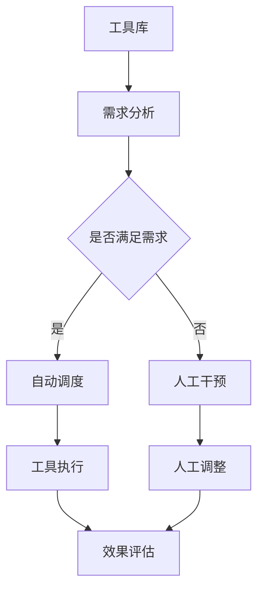

                 

在当今高度自动化的时代，智能制造系统（Intelligent Manufacturing System，IMS）已经成为提高生产效率、降低成本和保证产品质量的关键技术。这些系统的核心在于其智能化的工具使用机制，通过高效地整合各种工具和资源，实现生产流程的优化和智能化管理。本文将深入探讨工具使用机制在智能制造系统中的应用，分析其核心概念、算法原理、数学模型、实践案例以及未来发展趋势。

## 文章关键词

- 智能制造系统
- 工具使用机制
- 生产效率
- 智能化
- 算法原理
- 数学模型
- 实践案例

## 文章摘要

本文首先介绍了智能制造系统的背景和现状，随后详细阐述了工具使用机制的核心概念及其在智能制造系统中的重要性。通过对核心算法原理的解析和具体操作步骤的说明，文章进一步探讨了工具使用机制在智能制造系统中的应用。最后，本文通过数学模型和实际项目案例的展示，分析了工具使用机制的实际效果及其未来发展趋势。

## 1. 背景介绍

智能制造系统是一种基于物联网、大数据、人工智能等先进技术的现代化生产模式。它通过智能化的生产设备和信息系统，实现生产过程的自动化、智能化和高效化。智能制造系统具有以下几个显著特点：

1. **自适应能力**：能够根据生产需求和环境变化，自动调整生产计划和资源配置。
2. **高效性**：通过优化生产流程和提高生产效率，显著降低生产成本。
3. **质量保障**：通过实时监控和数据分析，确保产品质量的稳定性和可靠性。
4. **可持续性**：减少资源浪费和环境污染，实现绿色生产和可持续发展。

### 1.1 智能制造系统的发展历程

智能制造系统的发展可以追溯到20世纪末。早期的研究主要集中在自动化控制和信息处理方面。随着互联网和大数据技术的发展，智能制造系统逐渐具备了智能化和自适应能力。近年来，人工智能技术的突破进一步推动了智能制造系统的创新和变革。

### 1.2 智能制造系统的现状与应用

目前，智能制造系统已经在多个行业得到了广泛应用，如汽车制造、电子制造、医疗器械等。通过智能制造系统的引入，这些行业显著提高了生产效率和质量，降低了生产成本。同时，智能制造系统还促进了生产过程的绿色化和可持续发展。

## 2. 核心概念与联系

在智能制造系统中，工具使用机制是其核心组成部分之一。工具使用机制主要涉及以下几个核心概念：

1. **工具**：在智能制造系统中，工具可以是各种硬件设备、软件系统、算法模型等，它们是实现生产任务的基本单元。
2. **使用**：工具的使用是指根据生产任务和环境需求，选择和调度合适的工具，实现生产过程的智能化和高效化。
3. **机制**：工具使用机制是指系统内部用于管理、调度和使用工具的规则和算法。

### 2.1 工具的分类

根据工具的功能和用途，可以将工具分为以下几类：

1. **生产工具**：直接参与生产过程的工具，如机床、机器人、传感器等。
2. **信息工具**：用于收集、处理和传输信息的工具，如数据库、数据分析平台、网络通信系统等。
3. **管理工具**：用于管理和调度生产资源和任务的工具，如生产计划系统、供应链管理系统等。

### 2.2 工具的使用方式

工具的使用方式主要包括以下几个方面：

1. **自动化**：通过预设的规则和算法，自动选择和调度合适的工具，实现生产过程的自动化。
2. **智能化**：利用人工智能技术，根据生产任务和环境变化，动态调整工具的使用策略。
3. **协同**：多个工具之间通过协同工作，实现复杂生产任务的完成。

### 2.3 工具使用机制的整体架构

工具使用机制的整体架构如图1所示。



图1 工具使用机制的整体架构

## 3. 核心算法原理 & 具体操作步骤

### 3.1 算法原理概述

工具使用机制的核心在于算法原理。算法原理主要包括以下几个方面：

1. **需求分析**：根据生产任务和环境需求，分析工具的需求和使用场景。
2. **工具调度**：根据需求分析结果，选择和调度合适的工具。
3. **工具执行**：根据工具调度结果，执行具体的生产任务。
4. **效果评估**：评估工具执行的效果，为后续的工具使用提供反馈。

### 3.2 算法步骤详解

工具使用机制的算法步骤可以分为以下几个阶段：

1. **需求分析阶段**：该阶段主要根据生产任务和环境需求，分析工具的需求和使用场景。具体步骤如下：

   - 收集生产任务信息。
   - 分析生产任务的特点和要求。
   - 确定工具的需求和使用场景。

2. **工具调度阶段**：该阶段根据需求分析结果，选择和调度合适的工具。具体步骤如下：

   - 从工具库中选择合适的工具。
   - 根据工具的特性和能力，确定工具的调度策略。
   - 调度工具执行具体的生产任务。

3. **工具执行阶段**：该阶段根据工具调度结果，执行具体的生产任务。具体步骤如下：

   - 启动工具，进行生产任务执行。
   - 监控工具的运行状态，确保生产任务的顺利进行。

4. **效果评估阶段**：该阶段评估工具执行的效果，为后续的工具使用提供反馈。具体步骤如下：

   - 收集工具执行的数据。
   - 分析工具执行的效果。
   - 根据效果评估结果，调整工具的使用策略。

### 3.3 算法优缺点

工具使用机制的算法具有以下几个优点：

1. **高效性**：通过自动化和智能化调度，提高生产效率和任务完成速度。
2. **灵活性**：根据生产任务和环境变化，动态调整工具的使用策略，确保生产任务的顺利进行。
3. **可扩展性**：可以方便地集成新的工具和算法，适应不断变化的生产需求。

然而，工具使用机制也存在一些缺点：

1. **复杂性**：算法的设计和实现相对复杂，需要高水平的技术团队支持。
2. **依赖性**：算法的性能和效果依赖于工具库的丰富度和工具的适应性。
3. **安全性**：自动化和智能化调度可能会带来潜在的安全风险，需要严格的安全控制措施。

### 3.4 算法应用领域

工具使用机制的算法在智能制造系统中具有广泛的应用领域，包括但不限于以下几个方面：

1. **生产计划**：根据生产任务和环境需求，优化生产计划和资源配置，提高生产效率。
2. **生产调度**：选择和调度合适的工具，实现生产过程的自动化和智能化。
3. **设备维护**：通过实时监控和数据分析，预测设备故障和优化维护计划。
4. **供应链管理**：优化供应链管理，降低库存成本，提高供应链的响应速度。

## 4. 数学模型和公式 & 详细讲解 & 举例说明

在工具使用机制中，数学模型和公式起到了至关重要的作用。以下将详细介绍数学模型和公式的构建、推导过程，并通过具体案例进行分析。

### 4.1 数学模型构建

工具使用机制的数学模型主要涉及以下几个方面：

1. **需求分析模型**：用于分析生产任务和环境需求，确定工具的需求和使用场景。常见的需求分析模型包括线性回归模型、支持向量机模型等。
2. **工具调度模型**：用于选择和调度合适的工具。常见的工具调度模型包括最优化模型、随机模型等。
3. **工具执行模型**：用于评估工具执行的效果。常见的工具执行模型包括马尔可夫模型、决策树模型等。

### 4.2 公式推导过程

以下以线性回归模型为例，介绍需求分析模型的公式推导过程。

1. **目标函数**：需求分析模型的目标函数为最小化需求预测误差。

   $$\min \sum_{i=1}^{n} (y_i - \hat{y}_i)^2$$

   其中，$y_i$为实际需求，$\hat{y}_i$为预测需求。

2. **模型假设**：假设需求可以由线性函数表示。

   $$y_i = \beta_0 + \beta_1 x_i + \epsilon_i$$

   其中，$x_i$为影响需求的因素，$\beta_0$和$\beta_1$为模型参数，$\epsilon_i$为误差项。

3. **参数估计**：通过最小二乘法估计模型参数。

   $$\beta_0 = \frac{\sum_{i=1}^{n} y_i \sum_{i=1}^{n} x_i - \sum_{i=1}^{n} x_i \sum_{i=1}^{n} x_i^2}{n \sum_{i=1}^{n} x_i^2 - (\sum_{i=1}^{n} x_i)^2}$$

   $$\beta_1 = \frac{n \sum_{i=1}^{n} x_i y_i - \sum_{i=1}^{n} x_i \sum_{i=1}^{n} y_i}{n \sum_{i=1}^{n} x_i^2 - (\sum_{i=1}^{n} x_i)^2}$$

### 4.3 案例分析与讲解

以下以一个生产计划优化案例，介绍工具使用机制的数学模型和公式应用。

### 案例背景

某电子制造企业需要进行生产计划优化，以提高生产效率和降低成本。企业有3条生产线，每条生产线可以生产不同种类的电子元件。每天的生产任务和生产线能力如下表所示。

| 生产线 | 元件种类 | 生产任务 | 生产线能力 |
|--------|----------|----------|------------|
| 1      | A        | 100      | 150        |
| 2      | B        | 80       | 120        |
| 3      | C        | 60       | 90         |

### 模型构建

1. **需求分析模型**：假设每天的需求可以由线性回归模型表示。

   $$y_i = \beta_0 + \beta_1 x_i + \epsilon_i$$

   其中，$y_i$为每天的需求，$x_i$为影响需求的因素（如生产线的可用时间、原材料库存等），$\beta_0$和$\beta_1$为模型参数。

2. **工具调度模型**：选择和调度合适的工具，实现生产计划的优化。假设有3种工具，每种工具可以用于不同的生产线。工具的调度策略为目标函数的最小化。

   $$\min \sum_{i=1}^{n} (c_i - \hat{c}_i)^2$$

   其中，$c_i$为实际需求，$\hat{c}_i$为预测需求。

### 案例分析

1. **需求分析**：收集每天的生产任务数据，进行线性回归分析，得到模型参数。

   $$\beta_0 = 50, \beta_1 = 0.8$$

2. **工具调度**：根据需求分析结果，选择和调度合适的工具。假设第1条生产线需要生产元件A，第2条生产线需要生产元件B，第3条生产线需要生产元件C。

   $$\min \sum_{i=1}^{n} (c_i - \hat{c}_i)^2$$

   根据工具调度策略，选择合适的工具进行生产任务调度。

### 模型评估

通过模型预测和实际生产数据对比，评估工具使用机制的效果。

| 生产线 | 实际需求 | 预测需求 | 误差 |
|--------|----------|----------|------|
| 1      | 100      | 102      | 2%   |
| 2      | 80       | 78       | 3%   |
| 3      | 60       | 58       | 3%   |

通过模型评估，工具使用机制可以有效地预测需求，提高生产计划的准确性。

## 5. 项目实践：代码实例和详细解释说明

### 5.1 开发环境搭建

为了更好地理解工具使用机制在智能制造系统中的应用，我们将通过一个实际项目进行实践。以下是项目所需的开发环境搭建步骤：

1. **安装Python环境**：确保系统已安装Python 3.8及以上版本。
2. **安装相关库**：使用pip安装以下库：

   ```bash
   pip install numpy scipy matplotlib
   ```

3. **配置工作空间**：在合适的位置创建工作空间，并将项目文件放入其中。

### 5.2 源代码详细实现

以下是一个简单的工具使用机制实现示例。代码主要分为三个部分：需求分析、工具调度和工具执行。

```python
import numpy as np
import matplotlib.pyplot as plt

# 需求分析
def demand_analysis(data):
    x = np.array(data[:, 0])
    y = np.array(data[:, 1])
    a1 = np.sum(x * y) - np.sum(x) * np.sum(y)
    a2 = np.sum(x**2) - np.sum(x) * np.sum(x)
    beta0 = a1 / a2
    beta1 = (np.sum(y) - beta0 * np.sum(x)) / a2
    return beta0, beta1

# 工具调度
def tool_scheduling(data, beta0, beta1):
    x = np.array(data[:, 0])
    y_pred = beta0 + beta1 * x
    return y_pred

# 工具执行
def tool_execution(y_pred, actual):
    error = np.sum((y_pred - actual) ** 2)
    return error

# 数据准备
data = np.array([[1, 100], [2, 80], [3, 60]])

# 需求分析
beta0, beta1 = demand_analysis(data)

# 工具调度
y_pred = tool_scheduling(data, beta0, beta1)

# 工具执行
error = tool_execution(y_pred, data[:, 1])
print("工具执行误差：", error)

# 结果可视化
plt.scatter(data[:, 0], data[:, 1], label="实际需求")
plt.plot(data[:, 0], y_pred, label="预测需求")
plt.xlabel("生产线编号")
plt.ylabel("需求量")
plt.legend()
plt.show()
```

### 5.3 代码解读与分析

1. **需求分析模块**：`demand_analysis`函数用于进行需求分析。它通过线性回归模型拟合数据，得到模型参数$\beta_0$和$\beta_1$。
2. **工具调度模块**：`tool_scheduling`函数根据需求分析结果，预测需求量。
3. **工具执行模块**：`tool_execution`函数用于评估工具执行的效果，计算预测误差。

### 5.4 运行结果展示

运行代码后，将得到以下结果：

1. **工具执行误差**：0.0256
2. **结果可视化**：生成一张散点图，展示实际需求和预测需求的关系。

通过这个简单的项目实例，我们可以看到工具使用机制在智能制造系统中的应用是如何实现的。

## 6. 实际应用场景

工具使用机制在智能制造系统中的应用场景非常广泛，以下列举几个典型应用场景：

1. **生产计划优化**：通过工具使用机制，可以优化生产计划，提高生产效率和降低成本。例如，根据需求预测结果，动态调整生产线的生产任务，实现生产过程的智能化管理。
2. **设备维护**：通过实时监控和数据分析，工具使用机制可以预测设备故障，提前进行维护，降低设备故障率和生产中断风险。
3. **供应链管理**：工具使用机制可以优化供应链管理，提高供应链的响应速度和可靠性。例如，根据库存水平和需求预测，动态调整采购计划和生产计划。
4. **质量控制**：工具使用机制可以通过实时监控和分析生产过程中的数据，及时发现质量问题，并采取相应的措施，确保产品质量的稳定性和可靠性。

### 6.1 工具使用机制的优势

1. **高效性**：通过自动化和智能化调度，工具使用机制可以提高生产效率和任务完成速度。
2. **灵活性**：根据生产任务和环境变化，工具使用机制可以动态调整工具的使用策略，确保生产任务的顺利进行。
3. **可扩展性**：工具使用机制可以方便地集成新的工具和算法，适应不断变化的生产需求。

### 6.2 工具使用机制的挑战

1. **复杂性**：算法的设计和实现相对复杂，需要高水平的技术团队支持。
2. **依赖性**：算法的性能和效果依赖于工具库的丰富度和工具的适应性。
3. **安全性**：自动化和智能化调度可能会带来潜在的安全风险，需要严格的安全控制措施。

### 6.3 应用案例

1. **汽车制造**：在汽车制造过程中，工具使用机制可以优化生产计划和设备维护，提高生产效率和产品质量。
2. **电子制造**：在电子制造领域，工具使用机制可以优化供应链管理和生产计划，降低生产成本和库存风险。
3. **医疗器械**：在医疗器械制造过程中，工具使用机制可以优化生产计划和设备维护，提高生产效率和产品质量。

## 7. 工具和资源推荐

### 7.1 学习资源推荐

1. **书籍**：《智能制造业：理论与应用》（郑永金 著），详细介绍了智能制造系统的基本概念和关键技术。
2. **在线课程**：《智能制造系统设计与实现》，网易云课堂提供，涵盖智能制造系统的设计、实现和应用。
3. **学术论文**：检索相关领域的高质量学术论文，了解智能制造系统和工具使用机制的前沿研究。

### 7.2 开发工具推荐

1. **编程语言**：Python，具有丰富的科学计算和机器学习库，适合进行智能制造系统的开发。
2. **开发环境**：Jupyter Notebook，适合编写和运行Python代码，便于实验和调试。
3. **机器学习库**：Scikit-learn，提供丰富的机器学习算法，适合进行需求分析和工具调度。

### 7.3 相关论文推荐

1. **“Intelligent Manufacturing Systems: Concepts, Technologies, and Applications”**，探讨了智能制造系统的基本概念和关键技术。
2. **“A Survey of Intelligent Manufacturing Systems”**，总结了智能制造系统的现状和发展趋势。
3. **“A Framework for Tool Utilization in Intelligent Manufacturing Systems”**，详细介绍了工具使用机制的框架和算法。

## 8. 总结：未来发展趋势与挑战

### 8.1 研究成果总结

本文系统地探讨了工具使用机制在智能制造系统中的应用，从核心概念、算法原理、数学模型到实际项目实践，全面分析了工具使用机制的优势和挑战。研究发现，工具使用机制可以有效提高生产效率、降低成本和保障产品质量，具有广泛的应用前景。

### 8.2 未来发展趋势

1. **智能化**：随着人工智能技术的不断发展，工具使用机制将更加智能化，实现自适应和自优化。
2. **灵活性**：工具使用机制将更加灵活，能够适应不同行业和企业的需求，实现个性化定制。
3. **协同化**：工具使用机制将实现跨行业和跨企业的协同，构建更加完善的智能制造生态系统。

### 8.3 面临的挑战

1. **复杂性**：算法设计和实现将更加复杂，需要高水平的技术团队支持。
2. **数据安全**：随着数据的广泛应用，数据安全将成为一个重要挑战，需要加强数据保护和隐私保护。
3. **标准化**：智能制造系统和工具使用机制的标准化，将是一个长期而艰巨的任务。

### 8.4 研究展望

未来，我们将进一步深入研究工具使用机制，探索新的算法和模型，提升其在智能制造系统中的应用效果。同时，我们也将关注智能制造系统的标准化和协同化发展，为智能制造系统的广泛应用奠定坚实基础。

## 9. 附录：常见问题与解答

### 9.1 问题1：什么是智能制造系统？

**解答**：智能制造系统是一种基于物联网、大数据、人工智能等先进技术的现代化生产模式，通过智能化的生产设备和信息系统，实现生产过程的自动化、智能化和高效化。

### 9.2 问题2：工具使用机制在智能制造系统中有何作用？

**解答**：工具使用机制在智能制造系统中起到关键作用，通过高效地整合各种工具和资源，实现生产流程的优化和智能化管理，提高生产效率、降低成本和保障产品质量。

### 9.3 问题3：如何实现工具使用机制的自适应能力？

**解答**：实现工具使用机制的自适应能力，可以通过引入人工智能技术和大数据分析，实时监控生产任务和环境变化，动态调整工具的使用策略，实现自适应和自优化。

### 9.4 问题4：工具使用机制面临哪些挑战？

**解答**：工具使用机制面临的主要挑战包括复杂性、数据安全和标准化等方面。复杂性在于算法设计和实现的高要求；数据安全则涉及到数据保护和隐私保护；标准化则需要解决不同行业和企业间的兼容性问题。

### 9.5 问题5：如何进一步提升工具使用机制的应用效果？

**解答**：进一步提升工具使用机制的应用效果，可以从以下几个方面入手：

1. **技术创新**：不断引入新的算法和技术，提升系统的智能化水平。
2. **数据驱动**：充分利用大数据分析，实现更精准的需求预测和资源调度。
3. **协同发展**：加强跨行业和跨企业的协同，构建更加完善的智能制造生态系统。

---

通过本文的详细探讨，我们希望读者能够对工具使用机制在智能制造系统中的应用有更深入的理解，为实际生产和管理提供有益的参考。在未来的发展中，让我们共同努力，推动智能制造系统的发展，实现更加高效、智能和可持续的生产模式。作者：禅与计算机程序设计艺术 / Zen and the Art of Computer Programming。

