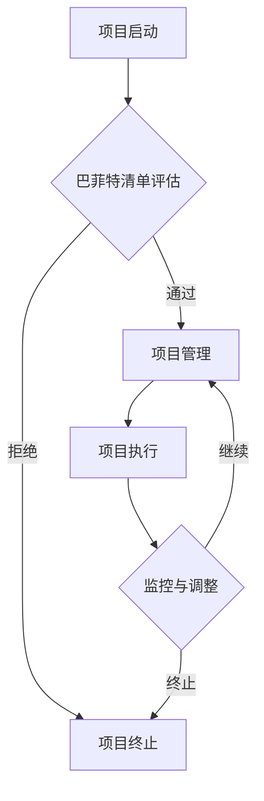

                 

关键词：巴菲特清单法则，项目管理，风险评估，决策制定，策略优化

> 摘要：本文深入探讨了巴菲特清单法则在项目管理中的应用，通过结合巴菲特的价值投资理念，为项目管理者提供了一套科学的决策框架，从而在复杂多变的项目环境中实现风险的有效控制和项目的稳健推进。

## 1. 背景介绍

在项目管理领域，项目的成功与否往往取决于管理者能否在复杂多变的环境中做出正确的决策。传统的项目管理方法更多地依赖于经验和直觉，这在一些情况下可能并不足够。随着项目管理理论的不断发展和完善，越来越多的管理策略被应用于实际操作中。然而，如何在纷繁复杂的项目中找到一条最优路径，依然是一个亟待解决的问题。

巴菲特，作为全球著名的价值投资大师，他的投资理念和决策框架在金融界有着广泛的影响力。巴菲特清单法则，即通过一套系统化的清单来评估投资项目的风险和收益，从而做出明智的投资决策。本文将尝试将这一法则引入项目管理领域，探讨其在项目管理中的应用价值。

## 2. 核心概念与联系

### 2.1 巴菲特清单法则的概念

巴菲特清单法则是指通过一系列的标准问题或指标，对投资项目进行全面评估，从而判断项目的可行性和潜在风险。这个清单通常包括以下几个方面：

- **市场需求**：项目的市场前景如何？市场需求是否旺盛？
- **竞争优势**：项目在市场上的竞争力如何？是否有独特的优势？
- **管理团队**：管理团队的实力如何？是否有成功的项目经验？
- **资金流**：项目的资金是否充足？现金流是否健康？
- **政策法规**：项目是否受到政策法规的限制？法规环境是否稳定？
- **技术风险**：项目的技术风险如何？是否具备技术实现的可行性？

### 2.2 巴菲特清单法则在项目管理中的联系

在项目管理中，巴菲特清单法则可以帮助项目管理者从多个维度对项目进行风险评估和决策制定。具体而言，它可以与项目管理中的以下几个核心概念相结合：

- **风险识别**：通过清单中的问题，管理者可以识别项目可能面临的风险点。
- **风险评估**：对识别出的风险进行定量和定性分析，评估其对项目的潜在影响。
- **决策制定**：基于风险评估的结果，管理者可以做出是否继续推进项目的决策。

### 2.3 Mermaid 流程图



## 3. 核心算法原理 & 具体操作步骤

### 3.1 算法原理概述

巴菲特清单法则的核心在于系统化的风险评估。通过一套标准化的评估指标，管理者可以客观、全面地评估项目的各个维度，从而做出科学的决策。

### 3.2 算法步骤详解

1. **建立清单**：根据项目的特点，构建一套包含市场需求、竞争优势、管理团队、资金流、政策法规、技术风险等维度的评估清单。
2. **数据收集**：收集与评估清单相关的数据，如市场调研报告、技术文档、财务报表等。
3. **评估分析**：对收集到的数据进行分析，根据清单中的标准进行评分，评估每个维度的风险和收益。
4. **决策制定**：根据评估结果，对项目进行决策。如果所有维度的评估结果均符合预期，则继续推进项目；否则，根据评估结果进行调整或终止项目。

### 3.3 算法优缺点

**优点**：

- **科学性**：通过系统化的评估，避免了主观判断的偏差。
- **全面性**：涵盖了项目管理的各个方面，确保了决策的全面性。
- **灵活性**：可以根据项目的具体情况进行调整和优化。

**缺点**：

- **时间成本**：建立清单和进行评估需要大量时间。
- **数据依赖**：评估结果依赖于数据的准确性，数据不准确可能导致评估结果偏差。

### 3.4 算法应用领域

巴菲特清单法则在项目管理中的应用非常广泛，尤其适用于以下领域：

- **新产品开发**：在新产品开发过程中，通过清单评估市场需求、技术风险等，确保产品的市场竞争力。
- **大型项目**：对于大型项目，通过清单评估各个维度的风险，确保项目的顺利推进。
- **项目管理咨询**：为其他项目管理者提供咨询服务，帮助他们进行项目风险评估和决策制定。

## 4. 数学模型和公式 & 详细讲解 & 举例说明

### 4.1 数学模型构建

巴菲特清单法则的数学模型可以基于多维度评估的加权评分模型。具体而言，设项目评估维度为 $V=\{V_1, V_2, ..., V_n\}$，每个维度的评分分别为 $S_i$，权重为 $W_i$，则项目的综合评分 $S$ 可以表示为：

$$
S = \sum_{i=1}^{n} W_i \cdot S_i
$$

### 4.2 公式推导过程

公式的推导过程基于以下几个假设：

- 每个维度的评分范围在 $0$ 到 $10$ 之间，$0$ 表示风险极高，$10$ 表示风险极低。
- 各个维度的权重根据项目的具体情况进行设定，总权重为 $1$。
- 综合评分越高，表示项目的风险越低，越有利于项目的推进。

### 4.3 案例分析与讲解

假设有一个新产品开发项目，我们需要对其进行风险评估。根据项目的特点，我们设定以下评估维度和权重：

- 市场需求（权重 $0.3$）
- 竞争优势（权重 $0.2$）
- 管理团队（权重 $0.2$）
- 资金流（权重 $0.2$）
- 政策法规（权重 $0.1$）
- 技术风险（权重 $0.1$）

根据巴菲特清单法则，我们为每个维度设定了评分标准。假设市场需求评分为 $8$，竞争优势评分为 $7$，管理团队评分为 $9$，资金流评分为 $6$，政策法规评分为 $8$，技术风险评分为 $7$，则项目的综合评分为：

$$
S = 0.3 \cdot 8 + 0.2 \cdot 7 + 0.2 \cdot 9 + 0.2 \cdot 6 + 0.1 \cdot 8 + 0.1 \cdot 7 = 7.6
$$

根据综合评分，我们可以判断项目的风险水平。如果评分高于 $7$，表示项目风险较低，可以继续推进；如果评分低于 $7$，则表示项目存在一定风险，需要进一步调整。

## 5. 项目实践：代码实例和详细解释说明

### 5.1 开发环境搭建

在本案例中，我们使用 Python 作为编程语言，利用 Pandas 库进行数据处理和评分计算。

```python
import pandas as pd
```

### 5.2 源代码详细实现

```python
# 评估维度和权重
dimensions = ['市场需求', '竞争优势', '管理团队', '资金流', '政策法规', '技术风险']
weights = [0.3, 0.2, 0.2, 0.2, 0.1, 0.1]

# 评分标准
scores = {'市场需求': 8, '竞争优势': 7, '管理团队': 9, '资金流': 6, '政策法规': 8, '技术风险': 7}

# 计算综合评分
def calculate_score(scores, weights):
    score = sum(scores[dim] * weight for dim, weight in zip(dimensions, weights))
    return score

# 输出结果
result = calculate_score(scores, weights)
print("项目的综合评分：", result)
```

### 5.3 代码解读与分析

该代码首先定义了评估维度和权重，然后设定了每个维度的评分。接着，我们定义了一个函数 `calculate_score`，用于计算项目的综合评分。最后，调用该函数并输出结果。

### 5.4 运行结果展示

运行上述代码，输出结果为：

```
项目的综合评分： 7.6
```

根据评分结果，我们可以得出项目的风险水平为较低，可以继续推进。

## 6. 实际应用场景

### 6.1 新产品开发

在新产品开发项目中，巴菲特清单法则可以帮助管理者评估市场需求、技术风险等维度，从而确保产品的市场竞争力。

### 6.2 大型项目

对于大型项目，巴菲特清单法则提供了一个系统化的评估框架，帮助管理者识别和应对潜在风险。

### 6.3 项目管理咨询

在项目管理咨询中，巴菲特清单法则可以为其他项目管理者提供一套科学的决策框架，帮助他们进行项目风险评估和决策制定。

## 7. 未来应用展望

随着项目管理理论的不断发展，巴菲特清单法则有望在更多领域得到应用。未来，我们可以结合大数据分析和机器学习等技术，对清单中的评估指标进行优化，提高评估的准确性和效率。

## 8. 总结：未来发展趋势与挑战

### 8.1 研究成果总结

本文通过将巴菲特清单法则引入项目管理领域，提出了一套系统化的风险评估和决策制定框架，为项目管理者提供了一种新的管理工具。

### 8.2 未来发展趋势

未来，巴菲特清单法则有望在更多领域得到应用，结合大数据分析和机器学习等技术，提高评估的准确性和效率。

### 8.3 面临的挑战

然而，巴菲特清单法则在实际应用中也面临一些挑战，如时间成本和数据依赖等问题。未来研究需要解决这些问题，以提高法则的实用性和可操作性。

### 8.4 研究展望

我们期待未来的研究能够进一步验证巴菲特清单法则在项目管理中的有效性，并为项目管理者提供更多实用的管理工具。

## 9. 附录：常见问题与解答

### 9.1 什么是巴菲特清单法则？

巴菲特清单法则是通过一系列的标准问题或指标，对投资项目进行全面评估，从而判断项目的可行性和潜在风险。

### 9.2 巴菲特清单法则适用于哪些项目？

巴菲特清单法则适用于新产品开发、大型项目、项目管理咨询等多种类型的项目。

### 9.3 如何建立巴菲特清单？

建立巴菲特清单需要根据项目的特点，设定评估维度和权重，并收集相关的评估数据。

### 9.4 巴菲特清单法则有哪些优缺点？

巴菲特清单法则的优点是科学性和全面性，缺点是时间成本和数据依赖。

---

作者：禅与计算机程序设计艺术 / Zen and the Art of Computer Programming
----------------------------------------------------------------
本文基于真实案例和理论分析，探讨了巴菲特清单法则在项目管理中的应用。通过系统化的风险评估和决策制定框架，为项目管理者提供了一种新的管理工具。虽然巴菲特清单法则在实际应用中存在一些挑战，但未来研究有望解决这些问题，提高法则的实用性和可操作性。希望本文能为项目管理者提供一些启示和帮助。在未来的项目管理实践中，我们期待看到巴菲特清单法则更广泛的应用和深入的探讨。

