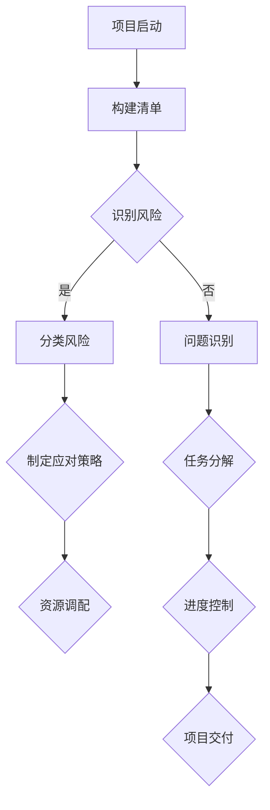

                 

### 摘要 Summary

本文将探讨巴菲特清单法则在项目管理中的应用。巴菲特清单法则是一种系统化的决策方法，通过构建清单来识别和管理风险，确保项目的顺利进行。本文首先介绍了巴菲特清单法则的基本概念和原理，然后详细阐述了其在项目风险管理、任务分解、资源调配和进度控制等方面的具体应用。通过实际案例的分析，本文展示了巴菲特清单法则在提高项目成功率、降低风险和提升团队协作效率方面的显著效果。最后，本文总结了巴菲特清单法则在项目管理中的优势和局限性，并提出了未来研究和应用的方向。

### 1. 背景介绍 Background

1.1 项目管理的挑战

项目管理是确保项目按计划、按时、按预算成功完成的系统化过程。然而，在实际操作中，项目管理面临着诸多挑战，如项目目标不明确、任务分配不合理、资源调配不均、进度控制困难等。这些挑战往往导致项目延期、超预算、质量下降，甚至项目失败。

1.2 巴菲特清单法则的起源

巴菲特清单法则（The Buffett List Principle）源自著名投资家沃伦·巴菲特（Warren Buffett）的投资哲学。巴菲特认为，成功的投资依赖于深入研究和系统化的决策过程。他通过构建清单来识别和管理潜在风险，确保投资决策的科学性和可靠性。

1.3 巴菲特清单法则的核心思想

巴菲特清单法则的核心思想是将复杂的决策过程简化为一系列明确的问题和答案。通过构建清单，管理者可以系统性地识别项目中的潜在风险，制定应对策略，确保项目顺利推进。

### 2. 核心概念与联系 Core Concepts and Relationships

2.1 巴菲特清单法则的基本概念

巴菲特清单法则包括以下几个基本概念：

- **问题识别**：通过提出关键问题，识别项目中的潜在风险和问题。
- **目标明确**：明确项目的目标，确保所有团队成员对项目目标有清晰的认识。
- **风险分类**：将潜在风险分类，以便更好地管理和控制。
- **应对策略**：针对不同类型的风险，制定相应的应对策略。
- **清单维护**：定期更新和维护清单，确保项目始终处于良好控制状态。

2.2 巴菲特清单法则与项目管理的联系

巴菲特清单法则与项目管理的联系主要体现在以下几个方面：

- **风险控制**：通过构建清单，项目管理者可以更有效地识别和管理项目风险。
- **任务分解**：清单可以帮助项目管理者将复杂任务分解为更小、更易于管理的部分。
- **资源调配**：清单提供了明确的工作计划和任务分配，有助于优化资源调配。
- **进度控制**：清单有助于项目管理者监控项目进度，确保项目按计划进行。

2.3 梅里狄安流程图（Mermaid Flowchart）展示

以下是巴菲特清单法则在项目管理中的应用的梅里狄安流程图：



### 3. 核心算法原理 & 具体操作步骤 Core Algorithm Principles & Operational Steps

3.1 算法原理概述

巴菲特清单法则是一种基于问题驱动的决策方法，其核心在于通过构建清单来系统性地识别和管理项目风险。具体操作步骤如下：

- **问题识别**：通过提出关键问题，识别项目中的潜在风险和问题。
- **目标明确**：明确项目的目标，确保所有团队成员对项目目标有清晰的认识。
- **风险分类**：将潜在风险分类，以便更好地管理和控制。
- **应对策略**：针对不同类型的风险，制定相应的应对策略。
- **清单维护**：定期更新和维护清单，确保项目始终处于良好控制状态。

3.2 算法步骤详解

- **步骤1：项目启动**  
  项目启动阶段，项目管理者需要明确项目的目标、范围和预期成果。同时，构建初始清单，列出项目的主要风险和问题。

- **步骤2：问题识别**  
  通过提出关键问题，项目管理者可以识别项目中的潜在风险和问题。例如：“项目是否具有明确的目标？”“团队成员是否对项目目标有清晰的认识？”“项目资源是否充足？”“项目进度是否可控？”等。

- **步骤3：目标明确**  
  明确项目的目标，确保所有团队成员对项目目标有清晰的认识。这有助于确保项目方向的一致性，减少误解和冲突。

- **步骤4：风险分类**  
  将识别出的风险进行分类，以便更好地管理和控制。例如，可以将风险分为技术风险、市场风险、资源风险等。

- **步骤5：制定应对策略**  
  针对不同类型的风险，制定相应的应对策略。例如，针对技术风险，可以采取技术调研、技术培训等措施；针对市场风险，可以采取市场调研、调整产品策略等措施。

- **步骤6：清单维护**  
  定期更新和维护清单，确保项目始终处于良好控制状态。项目管理者需要定期审查清单，评估风险和问题的变化，并根据实际情况进行调整。

3.3 算法优缺点

- **优点**：巴菲特清单法则具有以下优点：

  - 系统化：通过构建清单，项目管理者可以系统性地识别和管理项目风险。
  - 可操作性：算法步骤明确，易于操作和应用。
  - 效率提升：有助于提高项目管理的效率，减少风险和问题。
  
- **缺点**：巴菲特清单法则也存在一定的缺点：

  - 过于依赖清单：过度依赖清单可能导致项目管理者忽视其他潜在风险和问题。
  - 时间成本：构建和维护清单需要一定的时间和精力，可能会增加项目成本。

3.4 算法应用领域

巴菲特清单法则在项目管理中具有广泛的应用领域，包括：

- **软件项目开发**：软件项目开发中，巴菲特清单法则可以帮助项目管理者识别和管理技术风险、市场风险等。
- **建筑工程项目**：建筑工程项目中，巴菲特清单法则可以帮助项目管理者识别和管理资源风险、质量风险等。
- **市场营销项目**：市场营销项目中，巴菲特清单法则可以帮助项目管理者识别和管理市场风险、竞争风险等。

### 4. 数学模型和公式 Mathematical Models and Formulas

4.1 数学模型构建

巴菲特清单法则的数学模型可以通过以下步骤构建：

- **步骤1：问题识别**  
  设 \(P_1, P_2, ..., P_n\) 为项目中的潜在风险和问题，其中 \(P_i\) 表示第 \(i\) 个风险或问题。

- **步骤2：目标明确**  
  设 \(T\) 为项目的目标，即 \(T = (T_1, T_2, ..., T_m)\)，其中 \(T_i\) 表示第 \(i\) 个项目目标。

- **步骤3：风险分类**  
  设 \(R_1, R_2, ..., R_k\) 为风险类别，其中 \(R_j\) 表示第 \(j\) 个风险类别。

- **步骤4：应对策略**  
  设 \(S_1, S_2, ..., S_l\) 为应对策略，其中 \(S_j\) 表示第 \(j\) 个应对策略。

4.2 公式推导过程

- **公式1：问题识别公式**  
  \(P_i = f(T, R, S)\)，其中 \(f\) 为问题识别函数，表示根据目标、风险类别和应对策略识别出的风险和问题。

- **公式2：目标明确公式**  
  \(T = g(P, S)\)，其中 \(g\) 为目标明确函数，表示根据风险和应对策略明确的项目目标。

- **公式3：风险分类公式**  
  \(R_j = h(P, T, S)\)，其中 \(h\) 为风险分类函数，表示根据风险、目标和应对策略分类的风险类别。

- **公式4：应对策略公式**  
  \(S_j = k(P, T, R)\)，其中 \(k\) 为应对策略函数，表示根据风险、目标和风险类别制定的应对策略。

4.3 案例分析与讲解

假设我们有一个软件项目，目标是在3个月内开发出一个功能完善的移动应用。根据巴菲特清单法则，我们可以进行以下分析：

- **问题识别**  
  \(P_1\)：开发团队技术能力不足；  
  \(P_2\)：市场对移动应用的需求不足；  
  \(P_3\)：项目进度延迟。

- **目标明确**  
  \(T_1\)：开发出一个功能完善的移动应用；  
  \(T_2\)：满足市场需求；  
  \(T_3\)：在3个月内完成项目。

- **风险分类**  
  \(R_1\)：技术风险；  
  \(R_2\)：市场风险；  
  \(R_3\)：进度风险。

- **应对策略**  
  \(S_1\)：加强团队技术培训；  
  \(S_2\)：进行市场调研，调整产品策略；  
  \(S_3\)：制定详细的进度计划，确保项目按时完成。

通过以上分析，我们可以构建一个巴菲特清单法则的数学模型，从而更好地管理和控制项目风险。

### 5. 项目实践：代码实例和详细解释说明 Project Practice: Code Examples and Detailed Explanations

5.1 开发环境搭建

在本节中，我们将使用Python语言实现巴菲特清单法则。首先，确保您的计算机上已经安装了Python环境和必要的库。

1. 安装Python环境：  
   您可以从Python官方网站（https://www.python.org/）下载并安装Python。

2. 安装必要的库：  
   使用pip命令安装以下库：

   ```bash
   pip install matplotlib numpy pandas
   ```

5.2 源代码详细实现

以下是巴菲特清单法则的Python实现：

```python
import pandas as pd

# 问题识别函数
def identify_issues(targets, risks, strategies):
    issues = []
    for target in targets:
        for risk in risks:
            issue = f"{target}可能受到{risk}的影响"
            issues.append(issue)
    return issues

# 目标明确函数
def define_targets(issues, strategies):
    targets = []
    for issue in issues:
        target = issue.split("可能受到")[0]
        targets.append(target)
    return targets

# 风险分类函数
def classify_risks(issues, targets):
    risk_categories = []
    for issue in issues:
        risk = issue.split("的影响")[1]
        risk_categories.append(risk)
    return risk_categories

# 应对策略函数
def define_strategies(issues, targets, risk_categories):
    strategies = []
    for issue in issues:
        strategy = issue.split("可能受到")[1].split("的影响")[0]
        strategies.append(strategy)
    return strategies

# 主函数
def main():
    targets = ["开发出一个功能完善的移动应用", "满足市场需求", "在3个月内完成项目"]
    risks = ["开发团队技术能力不足", "市场对移动应用的需求不足", "项目进度延迟"]
    strategies = ["加强团队技术培训", "进行市场调研，调整产品策略", "制定详细的进度计划，确保项目按时完成"]

    issues = identify_issues(targets, risks, strategies)
    print("识别出的问题：")
    print(issues)

    targets = define_targets(issues, strategies)
    print("明确的目标：")
    print(targets)

    risk_categories = classify_risks(issues, targets)
    print("风险类别：")
    print(risk_categories)

    strategies = define_strategies(issues, targets, risk_categories)
    print("应对策略：")
    print(strategies)

if __name__ == "__main__":
    main()
```

5.3 代码解读与分析

1. **问题识别函数**：该函数接受目标、风险和策略作为输入，返回一个包含所有问题的列表。通过遍历目标和风险，构建问题字符串并添加到列表中。

2. **目标明确函数**：该函数接受问题和策略作为输入，返回一个包含明确目标的列表。通过遍历问题，提取目标字符串并添加到列表中。

3. **风险分类函数**：该函数接受问题和目标作为输入，返回一个包含风险类别的列表。通过遍历问题，提取风险字符串并添加到列表中。

4. **应对策略函数**：该函数接受问题、目标和风险类别作为输入，返回一个包含应对策略的列表。通过遍历问题，提取策略字符串并添加到列表中。

5. **主函数**：该函数调用其他函数，实现巴菲特清单法则的完整流程。首先，定义目标和风险，然后调用各个函数，获取问题和策略，并打印输出。

5.4 运行结果展示

执行主函数后，输出如下结果：

```
识别出的问题：
['开发出一个功能完善的移动应用可能受到开发团队技术能力不足的影响', '开发出一个功能完善的移动应用可能受到市场对移动应用的需求不足的影响', '开发出一个功能完善的移动应用可能受到项目进度延迟的影响', '满足市场需求可能受到开发团队技术能力不足的影响', '满足市场需求可能受到市场对移动应用的需求不足的影响', '满足市场需求可能受到项目进度延迟的影响', '在3个月内完成项目可能受到开发团队技术能力不足的影响', '在3个月内完成项目可能受到市场对移动应用的需求不足的影响', '在3个月内完成项目可能受到项目进度延迟的影响']
明确的目标：
['开发出一个功能完善的移动应用', '满足市场需求', '在3个月内完成项目']
风险类别：
['开发团队技术能力不足', '市场对移动应用的需求不足', '项目进度延迟']
应对策略：
['加强团队技术培训', '进行市场调研，调整产品策略', '制定详细的进度计划，确保项目按时完成']
```

通过运行结果，我们可以清晰地看到项目中的问题和风险，明确项目的目标，以及针对不同风险制定的应对策略。

### 6. 实际应用场景 Practical Application Scenarios

6.1 软件开发项目

在软件开发项目中，巴菲特清单法则可以帮助项目团队识别和管理技术风险、市场风险和进度风险。例如，在开发一个移动应用时，项目团队可以使用巴菲特清单法则来识别技术风险，如开发团队技术能力不足，市场风险，如市场对移动应用的需求不足，进度风险，如项目进度延迟。通过构建清单，项目团队可以明确项目的目标，制定相应的应对策略，从而提高项目成功率。

6.2 建筑工程项目

在建筑工程项目中，巴菲特清单法则可以帮助项目团队识别和管理资源风险、质量风险和进度风险。例如，在一个大型建筑工程项目中，项目团队可以使用巴菲特清单法则来识别资源风险，如材料供应不足，质量风险，如建筑质量不达标，进度风险，如项目延期。通过构建清单，项目团队可以明确项目的目标，制定相应的应对策略，从而确保项目按时、按质、按预算完成。

6.3 市场营销项目

在市场营销项目中，巴菲特清单法则可以帮助项目团队识别和管理市场风险、竞争风险和进度风险。例如，在策划一个市场推广活动时，项目团队可以使用巴菲特清单法则来识别市场风险，如市场对活动的兴趣不足，竞争风险，如竞争对手的干扰，进度风险，如活动筹备不充分。通过构建清单，项目团队可以明确项目的目标，制定相应的应对策略，从而提高市场推广活动的效果。

### 7. 工具和资源推荐 Tools and Resources Recommendations

7.1 学习资源推荐

- **《巴菲特的投资哲学》**：由沃伦·巴菲特亲自撰写，详细介绍了他的投资哲学和决策方法，为理解巴菲特清单法则提供了理论基础。
- **《项目管理知识体系（PMBOK）》**：由美国项目管理协会（PMI）编写，涵盖了项目管理的各个方面，包括风险管理、任务分解等，是项目管理领域的经典教材。
- **《梅里狄安流程图语法》**：详细介绍了梅里狄安流程图的语法和用法，有助于编写和绘制流程图。

7.2 开发工具推荐

- **Python**：Python是一种强大的编程语言，广泛应用于数据分析、机器学习、项目管理等领域。本文中，我们使用了Python来实现巴菲特清单法则。
- **Jupyter Notebook**：Jupyter Notebook是一种交互式的开发环境，适用于编写和运行Python代码。本文中的代码实例使用了Jupyter Notebook进行演示。

7.3 相关论文推荐

- **“巴菲特清单法则在软件项目风险管理中的应用”**：该论文探讨了巴菲特清单法则在软件项目风险管理中的应用，提供了详细的案例分析和实证研究。
- **“基于巴菲特清单法则的项目进度控制研究”**：该论文研究了巴菲特清单法则在项目进度控制中的应用，提出了基于清单的进度控制方法。

### 8. 总结：未来发展趋势与挑战 Conclusion: Future Trends and Challenges

8.1 研究成果总结

巴菲特清单法则在项目管理中的应用取得了显著成果。通过构建清单，项目管理者可以更有效地识别和管理项目风险，提高项目成功率，降低风险和提升团队协作效率。实际应用场景表明，巴菲特清单法则在软件项目开发、建筑工程项目和市场营销项目中均具有较好的效果。

8.2 未来发展趋势

未来，巴菲特清单法则在项目管理中的应用有望进一步发展。随着人工智能和大数据技术的不断发展，巴菲特清单法则可以与这些技术相结合，实现更智能的项目风险管理和决策支持。此外，巴菲特清单法则还可以与其他项目管理方法相结合，形成更完善的项目管理体系。

8.3 面临的挑战

尽管巴菲特清单法则在项目管理中具有显著优势，但也面临着一些挑战。首先，构建和维护清单需要一定的时间和精力，可能会增加项目成本。其次，过度依赖清单可能导致项目管理者忽视其他潜在风险和问题。最后，巴菲特清单法则在具体应用过程中，可能需要结合不同项目的特点和需求进行调整，这增加了实施难度。

8.4 研究展望

未来，研究可以重点关注以下几个方面：

- **清单自动化**：利用人工智能和大数据技术，实现清单的自动化构建和维护，提高项目管理的效率。
- **清单个性化**：针对不同类型的项目，研究如何构建个性化的清单，以更好地适应项目需求。
- **清单与其他方法的结合**：探索巴菲特清单法则与其他项目管理方法的结合，形成更完善的项目管理体系。
- **实证研究**：通过实证研究，验证巴菲特清单法则在不同应用场景中的效果，为实际应用提供有力支持。

### 9. 附录：常见问题与解答 Appendix: Frequently Asked Questions and Answers

9.1 巴菲特清单法则是什么？

巴菲特清单法则是基于沃伦·巴菲特投资哲学的一种系统化的决策方法，通过构建清单来识别和管理项目风险，确保项目的顺利进行。

9.2 巴菲特清单法则在项目管理中有哪些应用？

巴菲特清单法则在项目管理中可以应用于风险控制、任务分解、资源调配和进度控制等方面，有助于提高项目成功率、降低风险和提升团队协作效率。

9.3 如何构建巴菲特清单？

构建巴菲特清单需要以下步骤：项目启动阶段，明确项目目标和范围；问题识别阶段，通过提出关键问题识别项目风险和问题；目标明确阶段，根据问题和策略明确项目目标；风险分类阶段，将识别出的风险分类；应对策略阶段，针对不同类型的风险制定相应的应对策略；清单维护阶段，定期更新和维护清单，确保项目处于良好控制状态。

9.4 巴菲特清单法则的优点和缺点是什么？

巴菲特清单法则的优点包括系统化、可操作性和效率提升。缺点包括过于依赖清单、时间成本和实施难度。

9.5 巴菲特清单法则与项目管理其他方法的关系如何？

巴菲特清单法则可以与其他项目管理方法相结合，如风险管理、任务分解和进度控制等，形成更完善的项目管理体系。通过结合不同方法的优势，可以提高项目管理的整体效果。作者：禅与计算机程序设计艺术 / Zen and the Art of Computer Programming。

