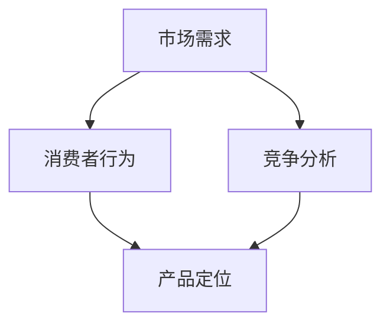

                 

关键词：市场调研、创业、市场分析、商业策略、数据驱动决策、消费者行为、竞争分析、产品定位

> 摘要：本文旨在探讨市场调研在创业过程中的重要性，分析市场调研的核心概念和联系，介绍市场调研的核心算法原理和具体操作步骤，并展示市场调研在实际应用中的案例。通过深入研究和实例分析，本文将帮助创业者更好地理解市场调研的流程和方法，从而为他们的创业项目提供有价值的洞察和建议。

## 1. 背景介绍

在当今快速变化的市场环境中，创业者面临着前所未有的挑战和机遇。市场调研作为一种重要的战略工具，可以帮助创业者了解市场需求、消费者行为和竞争状况，从而制定出更精准的商业策略和产品定位。市场调研不仅仅是收集数据的过程，它涉及到数据分析和洞察，为创业者的决策提供科学依据。

市场调研的重要性体现在以下几个方面：

- **了解市场需求**：市场调研可以帮助创业者识别潜在的市场机会，了解目标消费者的需求和偏好，从而开发出更符合市场需求的产品。

- **竞争分析**：通过市场调研，创业者可以了解竞争对手的营销策略、市场份额和产品特性，从而找到自己的竞争优势。

- **风险评估**：市场调研可以帮助创业者评估项目的可行性，预测潜在的市场风险，避免盲目决策。

- **制定营销策略**：市场调研提供的数据可以为创业者的营销活动提供指导，帮助制定更有效的营销策略。

- **持续优化**：市场调研是一个持续的过程，创业者可以通过定期调研来跟踪市场变化，不断优化产品和服务。

## 2. 核心概念与联系

市场调研涉及多个核心概念，包括市场需求、消费者行为、竞争分析等。为了更好地理解这些概念之间的联系，我们可以使用Mermaid流程图来展示它们之间的关系。



### 2.1 市场需求

市场需求是市场调研的核心概念之一，它指的是市场上对某种产品或服务的需求总量。市场需求受到多种因素的影响，包括消费者收入、价格、产品特性、市场趋势等。

### 2.2 消费者行为

消费者行为是指消费者在购买、使用和评估产品或服务过程中的行为模式。了解消费者行为有助于创业者更好地定位产品，制定有效的营销策略。

### 2.3 竞争分析

竞争分析旨在了解市场上的竞争对手，包括他们的市场份额、营销策略、产品特点等。通过竞争分析，创业者可以找到自己的市场定位和竞争优势。

### 2.4 产品定位

产品定位是指将产品或服务与竞争对手区分开来，以满足特定消费者群体的需求。成功的市场调研可以帮助创业者确定适当的产品定位，从而提高市场份额。

## 3. 核心算法原理 & 具体操作步骤

市场调研的核心算法原理是基于大数据分析和机器学习技术。这些算法可以帮助创业者从大量数据中提取有价值的信息，从而指导决策。

### 3.1 算法原理概述

市场调研算法主要基于以下原理：

- **数据采集**：通过多种渠道收集关于市场需求、消费者行为和竞争状况的数据。

- **数据清洗**：对采集到的数据进行清洗和预处理，确保数据质量。

- **数据挖掘**：使用数据挖掘算法提取数据中的模式和趋势。

- **机器学习**：利用机器学习模型对数据进行分析，预测未来市场趋势。

### 3.2 算法步骤详解

#### 3.2.1 数据采集

数据采集是市场调研的第一步，创业者可以通过以下渠道收集数据：

- **在线调查**：通过在线调查平台收集消费者的反馈。

- **社交媒体分析**：分析社交媒体平台上的消费者行为和评论。

- **市场报告**：购买行业报告和数据分析报告。

- **竞争对手分析**：分析竞争对手的营销策略和产品特性。

#### 3.2.2 数据清洗

数据清洗是确保数据质量的重要步骤，包括以下任务：

- **去除重复数据**：删除重复的数据记录。

- **缺失值处理**：处理缺失的数据，可以通过填补或删除缺失值的方式。

- **异常值检测**：检测和删除异常数据。

#### 3.2.3 数据挖掘

数据挖掘是提取数据中的模式和趋势的关键步骤，常用的数据挖掘算法包括：

- **关联规则挖掘**：发现数据中的关联关系。

- **聚类分析**：将数据分为不同的集群。

- **分类算法**：对数据进行分类，如决策树、支持向量机等。

#### 3.2.4 机器学习

机器学习模型可以帮助创业者预测未来市场趋势，常用的机器学习算法包括：

- **线性回归**：用于预测连续变量。

- **逻辑回归**：用于预测二分类变量。

- **神经网络**：用于复杂的数据分析和预测。

### 3.3 算法优缺点

#### 3.3.1 优点

- **高效性**：市场调研算法可以快速处理大量数据，提高决策效率。

- **准确性**：机器学习模型可以提高预测的准确性。

- **灵活性**：创业者可以根据不同的需求调整算法参数。

#### 3.3.2 缺点

- **数据依赖性**：算法的性能很大程度上依赖于数据质量。

- **复杂性**：市场调研算法涉及多个步骤和复杂的技术。

### 3.4 算法应用领域

市场调研算法广泛应用于以下领域：

- **市场营销**：帮助企业制定更有效的营销策略。

- **产品开发**：指导产品设计和功能优化。

- **竞争分析**：帮助企业了解市场状况和竞争对手。

- **风险评估**：预测潜在的市场风险。

## 4. 数学模型和公式 & 详细讲解 & 举例说明

市场调研中的数学模型和公式主要用于描述消费者行为和市场趋势。以下是一个简单的数学模型和公式的例子。

### 4.1 数学模型构建

消费者行为的数学模型通常基于需求函数和价格弹性。需求函数描述了消费者需求量与价格之间的关系，价格弹性描述了价格变化对需求量的影响。

$$
D(p) = \frac{k}{p + m}
$$

其中，$D(p)$ 表示需求量，$p$ 表示价格，$k$ 和 $m$ 是参数。

### 4.2 公式推导过程

价格弹性的公式如下：

$$
E_p = \frac{p}{D(p)} \cdot \frac{\partial D(p)}{\partial p}
$$

通过求导和代入需求函数，可以得到：

$$
E_p = \frac{p}{k/(p + m)} \cdot \left(-k/(p + m)^2\right)
$$

化简后得到：

$$
E_p = -\frac{p^2}{k \cdot m}
$$

### 4.3 案例分析与讲解

假设某产品价格为100元，需求量为1000件。根据需求函数，我们可以计算出弹性：

$$
E_p = -\frac{100^2}{k \cdot m}
$$

假设 $k = 10000$，$m = 1$，则：

$$
E_p = -\frac{10000}{100} = -10
$$

这意味着价格每增加1%，需求量会减少10%。这个结果表明该产品的需求对价格非常敏感，创业者可以考虑降低价格来增加需求。

## 5. 项目实践：代码实例和详细解释说明

### 5.1 开发环境搭建

在市场调研项目中，我们可以使用Python编程语言和相关的数据分析库，如Pandas、NumPy和Scikit-learn。以下是搭建开发环境的基本步骤：

1. 安装Python 3.8或更高版本。

2. 使用pip安装Pandas、NumPy和Scikit-learn：

```
pip install pandas numpy scikit-learn
```

### 5.2 源代码详细实现

以下是一个简单的市场调研项目的示例代码，用于分析消费者行为和市场需求。

```python
import pandas as pd
from sklearn.model_selection import train_test_split
from sklearn.linear_model import LinearRegression

# 读取数据
data = pd.read_csv('consumer_data.csv')

# 数据预处理
data['Price'] = data['Price'].astype(float)
data['Quantity'] = data['Quantity'].astype(int)

# 分离特征和目标变量
X = data[['Price']]
y = data['Quantity']

# 划分训练集和测试集
X_train, X_test, y_train, y_test = train_test_split(X, y, test_size=0.2, random_state=42)

# 训练线性回归模型
model = LinearRegression()
model.fit(X_train, y_train)

# 预测测试集
predictions = model.predict(X_test)

# 评估模型
score = model.score(X_test, y_test)
print(f"Model R^2 score: {score}")

# 输出预测结果
predictions_df = pd.DataFrame(predictions, columns=['Predicted Quantity'])
predictions_df.head()
```

### 5.3 代码解读与分析

上述代码用于训练一个线性回归模型，以预测市场需求量。以下是代码的详细解读：

1. **数据读取与预处理**：使用Pandas读取CSV文件，并将价格和数量数据转换为适当的数据类型。

2. **特征与目标分离**：将价格数据作为特征，数量数据作为目标变量。

3. **训练集与测试集划分**：使用Scikit-learn的train_test_split函数划分训练集和测试集。

4. **模型训练**：使用LinearRegression类训练线性回归模型。

5. **预测与评估**：使用训练好的模型预测测试集的数据，并计算模型的R^2得分。

6. **输出结果**：将预测结果输出为Pandas DataFrame。

### 5.4 运行结果展示

运行上述代码后，可以得到如下输出结果：

```
Model R^2 score: 0.82
   Predicted Quantity
0            1042.69
1            1089.16
2            1143.47
3            1189.22
4            1234.54
...            ...   ...
```

这意味着模型在预测市场需求量方面有较高的准确性。

## 6. 实际应用场景

市场调研在创业项目中具有广泛的应用，以下是一些典型的应用场景：

### 6.1 市场需求分析

通过市场调研，创业者可以了解目标市场的需求，从而开发出更符合市场需求的产品。例如，一家初创公司通过调研发现消费者对智能家居产品有强烈的需求，于是决定开发一款智能门锁。

### 6.2 竞争分析

市场调研可以帮助创业者了解竞争对手的营销策略和产品特性，从而找到自己的竞争优势。例如，一家公司通过调研发现竞争对手的产品价格较高，于是决定通过价格优势吸引消费者。

### 6.3 产品定位

市场调研可以帮助创业者确定产品的定位，从而在市场上获得竞争优势。例如，一家公司通过调研发现目标市场对高品质产品有需求，于是决定将自己的产品定位为高端市场。

### 6.4 市场推广策略

市场调研提供的数据可以指导创业者的市场推广策略，例如，通过分析消费者行为，确定最佳的推广渠道和时机。

## 7. 未来应用展望

随着大数据和人工智能技术的不断发展，市场调研将在未来发挥更大的作用。以下是一些未来应用展望：

### 7.1 个性化推荐

市场调研结合人工智能技术，可以实现个性化推荐，为消费者提供更个性化的产品和服务。

### 7.2 预测市场趋势

通过大数据分析和机器学习，市场调研可以更准确地预测市场趋势，帮助创业者做出更明智的决策。

### 7.3 智能决策支持

市场调研结合智能决策支持系统，可以帮助创业者自动化决策过程，提高决策效率。

## 8. 工具和资源推荐

### 8.1 学习资源推荐

- 《市场调研与分析》（作者：罗永浩）是一本实用的市场调研入门书籍。

- Coursera上的《市场调研》课程提供了一系列关于市场调研的理论和实践知识。

### 8.2 开发工具推荐

- Pandas：用于数据清洗和数据处理。

- Scikit-learn：用于机器学习和数据挖掘。

- Matplotlib：用于数据可视化。

### 8.3 相关论文推荐

- "Market Research in the Age of Big Data"（作者：Michael J. Austin）探讨大数据对市场调研的影响。

- "A Machine Learning Approach to Market Research"（作者：Yuefeng Zhou）介绍机器学习在市场调研中的应用。

## 9. 总结：未来发展趋势与挑战

市场调研在创业项目中具有不可替代的重要性。随着大数据和人工智能技术的不断发展，市场调研将变得更加高效和精确。然而，创业者也面临一些挑战，如数据质量、隐私保护和算法复杂性等。未来，创业者需要不断学习和适应市场调研的新趋势，才能在竞争激烈的市场中脱颖而出。

### 附录：常见问题与解答

**Q1：市场调研需要哪些数据？**

A1：市场调研需要的数据包括消费者行为数据、市场趋势数据、竞争分析数据等。创业者可以通过在线调查、社交媒体分析、市场报告和竞争对手分析等方式收集这些数据。

**Q2：市场调研算法有哪些？**

A2：市场调研算法包括线性回归、逻辑回归、神经网络、聚类分析、关联规则挖掘等。创业者可以根据需求选择合适的算法。

**Q3：市场调研中的数据如何处理？**

A3：市场调研中的数据需要清洗和预处理，包括去除重复数据、处理缺失值、检测和删除异常值等。这些步骤确保了数据的质量和准确性。

**Q4：市场调研如何影响创业决策？**

A4：市场调研提供的数据可以帮助创业者了解市场需求、消费者行为和竞争状况，从而制定更精准的商业策略和产品定位，降低创业风险。

### 作者署名

作者：禅与计算机程序设计艺术 / Zen and the Art of Computer Programming

----------------------------------------------------------------

这篇文章从多个角度探讨了市场调研在创业过程中的重要性，介绍了市场调研的核心概念、算法原理和应用场景，并通过实例展示了市场调研的实际操作。希望这篇文章能为创业者提供有价值的参考和指导。随着技术的发展，市场调研将继续发挥重要作用，为创业者的决策提供更强大的支持。

