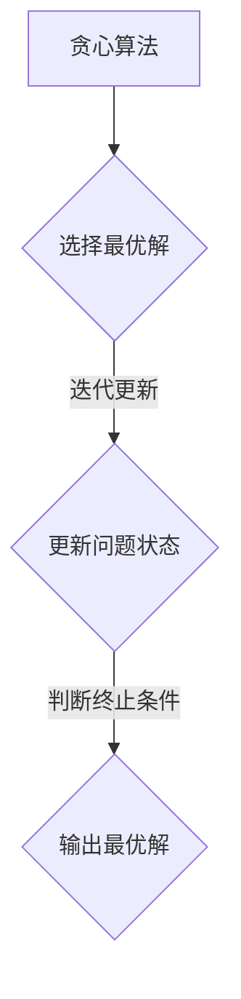
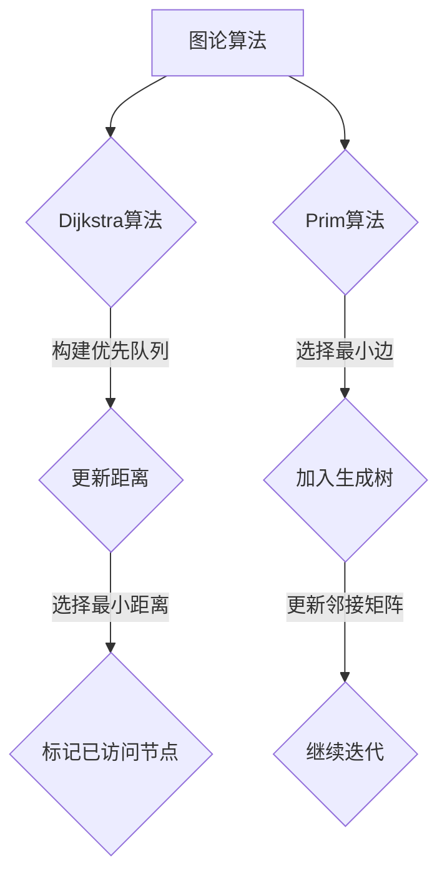
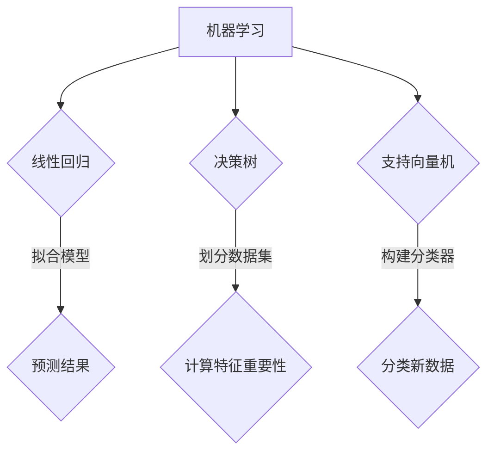

                 

## 1. 背景介绍

随着人工智能技术的飞速发展，华为作为全球领先的信息与通信技术（ICT）解决方案供应商，对算法工程师的需求日益增加。为了更好地选拔优秀人才，华为在每年的社会招聘中都会推出一系列算法面试题库。这些题目不仅涵盖了深度学习、数据结构、算法设计等核心知识点，还体现了华为对候选人逻辑思维、问题解决能力和编程技能的高度重视。

本文旨在通过对2024年华为社招算法面试题库的深入分析，为准备面试的算法工程师提供宝贵的参考和指导。我们将对每道题目进行详细解析，包括解题思路、算法原理和具体操作步骤，帮助读者全面掌握面试所需的知识和技能。

文章结构如下：

- 背景介绍：简要介绍华为社招算法面试题库的背景和重要性。
- 核心概念与联系：阐述关键概念，并通过Mermaid流程图展示算法原理。
- 核心算法原理 & 具体操作步骤：详细解析每道题目的算法原理和操作步骤。
- 数学模型和公式 & 详细讲解 & 举例说明：介绍相关数学模型和公式，并通过实例进行分析。
- 项目实践：提供代码实例，进行详细解读和分析。
- 实际应用场景：探讨算法在实际中的应用场景和未来展望。
- 工具和资源推荐：推荐学习资源、开发工具和相关论文。
- 总结：总结研究成果、未来发展趋势和面临的挑战。
- 附录：常见问题与解答。

通过这篇文章，读者可以系统地学习华为社招算法面试题库中的各个知识点，提升自己的面试竞争力。

## 2. 核心概念与联系

在算法面试中，理解核心概念和它们之间的联系是解决复杂问题的前提。以下我们将介绍几组核心概念，并通过Mermaid流程图展示它们在算法中的应用。

### 概念一：动态规划

动态规划是一种解决最优化问题的算法设计技巧，它通过将复杂问题分解成若干个子问题，并存储子问题的解，以避免重复计算。


### 概念二：贪心算法

贪心算法是一种在每一步选择中都采取当前最优解的算法策略，它不追求全局最优解，而是希望尽快达到一个相对较好的解。



### 概念三：图论算法

图论算法用于解决与图相关的问题，如最短路径、最小生成树等。常见的图论算法包括Dijkstra算法和Prim算法。



### 概念四：机器学习

机器学习是人工智能的重要分支，它使计算机能够从数据中学习，并做出决策或预测。常见的机器学习算法包括线性回归、决策树和支持向量机。



通过上述Mermaid流程图，我们可以清晰地看到各个核心概念及其在算法中的应用。理解这些概念之间的联系，有助于我们更好地掌握算法面试中的各种问题。

## 3. 核心算法原理 & 具体操作步骤

在了解核心概念之后，我们接下来深入探讨几道具有代表性的华为社招算法面试题，分析其算法原理和具体操作步骤。

### 题目一：最长公共子序列（LCS）

**问题陈述**：给定两个字符串text1和text2，找出它们的**最长公共子序列**的长度。

**算法原理**：LCS问题可以通过动态规划算法求解。动态规划的基本思想是将原问题分解成若干个子问题，并利用子问题的解来构建原问题的解。

**具体操作步骤**：

1. **初始化**：创建一个二维数组`dp`，其中`dp[i][j]`表示`text1`的前`i`个字符和`text2`的前`j`个字符的最长公共子序列长度。

2. **状态转移方程**：如果`text1[i - 1] == text2[j - 1]`，则`dp[i][j] = dp[i - 1][j - 1] + 1`；否则，`dp[i][j] = max(dp[i - 1][j], dp[i][j - 1])`。

3. **求解结果**：最后`dp[m][n]`即为最长公共子序列的长度。

**代码实现**：

```python
def longestCommonSubsequence(text1, text2):
    m, n = len(text1), len(text2)
    dp = [[0] * (n + 1) for _ in range(m + 1)]

    for i in range(1, m + 1):
        for j in range(1, n + 1):
            if text1[i - 1] == text2[j - 1]:
                dp[i][j] = dp[i - 1][j - 1] + 1
            else:
                dp[i][j] = max(dp[i - 1][j], dp[i][j - 1])

    return dp[m][n]
```

### 题目二：单调栈

**问题陈述**：给定一个数组`nums`，实现一个支持单调递增或递减的数据结构，并找出每个元素在数组中的下一个比它大的数或比它小的数。

**算法原理**：单调栈是一种利用栈的特性来维护一个单调序列的算法结构。在单调递增栈中，栈顶元素始终小于或等于其他元素的值；在单调递减栈中，栈顶元素始终大于或等于其他元素的值。

**具体操作步骤**：

1. **初始化**：创建一个空栈。

2. **遍历数组**：对于每个元素，从栈顶开始比较，如果当前元素小于栈顶元素（单调递增），则弹出栈顶元素，直到当前元素大于栈顶元素。

3. **结果存储**：将当前元素压入栈中，并记录当前元素在数组中的下一个比它大的数或小的数。

**代码实现**：

```python
def nextGreaterElement(nums):
    stack = []
    result = [-1] * len(nums)
    for i, num in enumerate(nums):
        while stack and stack[-1][1] < num:
            _, idx = stack.pop()
            result[idx] = num
        stack.append((num, i))
    return result
```

### 题目三：深度优先搜索（DFS）

**问题陈述**：给定一个无向图，实现DFS算法来遍历图中所有节点。

**算法原理**：DFS算法通过递归或栈实现，每次选择一个未被访问的节点，然后递归或迭代地访问该节点的所有未访问邻居。

**具体操作步骤**：

1. **初始化**：创建一个标记数组`visited`，标记所有节点为未访问状态。

2. **递归遍历**：从起点开始，递归地访问每个未访问的邻居节点。

3. **回溯**：在访问完所有邻居节点后，回溯至上一个节点，继续访问其他未访问的邻居节点。

**代码实现**：

```python
def dfs(graph, node, visited):
    visited[node] = True
    print(node, end=' ')
    for neighbor in graph[node]:
        if not visited[neighbor]:
            dfs(graph, neighbor, visited)

graph = {
    0: [1, 2],
    1: [2],
    2: [0, 2, 3],
    3: [3]
}
visited = [False] * len(graph)
dfs(graph, 2, visited)
```

通过上述三道题目的解析，我们可以看到不同算法的原理和操作步骤。理解这些核心算法，有助于我们在实际面试中应对各种复杂问题。

### 3.1 算法原理概述

在解决复杂问题时，理解算法的原理至关重要。不同的算法适用于不同类型的问题，它们的核心思想和实现方法各具特色。

#### 动态规划

动态规划（Dynamic Programming，简称DP）是一种高效解决最优化问题的算法设计技巧。其基本思想是将复杂问题分解成若干个子问题，并存储子问题的解，以避免重复计算。

动态规划的核心步骤包括：

1. **定义状态**：将问题转化为状态表示，通常使用一个数组或二维数组来表示状态转移。
2. **状态转移方程**：定义状态之间的转移关系，通常使用递归或迭代的方法。
3. **初始化**：初始化基础状态。
4. **求解**：根据状态转移方程和初始化条件，逐步求解出最终状态。

动态规划适用于解决具有重叠子问题和最优子结构特征的问题，如背包问题、最长公共子序列、最长递增子序列等。

#### 贪心算法

贪心算法（Greedy Algorithm）是一种在每一步选择中都采取当前最优解的算法策略，它不追求全局最优解，而是希望尽快达到一个相对较好的解。

贪心算法的核心步骤包括：

1. **选择当前最优解**：每一步都选择当前情况下的最优解。
2. **更新问题状态**：根据当前选择，更新问题状态。
3. **判断终止条件**：在满足终止条件时结束算法。

贪心算法适用于解决一些最优解可以通过局部最优解逐步构建的问题，如找零钱问题、背包问题、贪心选择集合等。

#### 图论算法

图论算法用于解决与图相关的问题，如最短路径、最小生成树、拓扑排序等。

常见的图论算法包括：

- **Dijkstra算法**：用于求解单源最短路径问题，其核心思想是通过优先队列选择最小距离的节点，并更新其他节点的距离。
- **Prim算法**：用于求解最小生成树问题，其核心思想是从一个节点开始，逐步选择最小边加入生成树。
- **Kruskal算法**：用于求解最小生成树问题，其核心思想是按边的权重排序，并选择最小边加入生成树。

图论算法在计算机网络、社交网络分析、网络优化等领域有广泛应用。

#### 机器学习算法

机器学习算法是人工智能的重要分支，通过从数据中学习，使计算机能够做出决策或预测。

常见的机器学习算法包括：

- **线性回归**：用于预测数值型数据，其核心思想是通过最小二乘法拟合模型。
- **决策树**：用于分类和回归问题，其核心思想是通过划分数据集并计算特征重要性。
- **支持向量机（SVM）**：用于分类问题，其核心思想是通过构建分类器来分类新数据。

机器学习算法在金融风控、医疗诊断、自然语言处理等领域有广泛应用。

通过上述算法原理的概述，我们可以更好地理解不同算法的适用场景和实现方法，为解决实际问题提供有力支持。

### 3.2 算法步骤详解

在了解了算法原理之后，下面我们将详细解析各个算法的具体操作步骤，并通过实例展示其应用。

#### 动态规划算法：最长公共子序列（LCS）

**步骤详解**：

1. **定义状态和状态转移方程**：

   - 定义二维数组`dp`，其中`dp[i][j]`表示`text1`的前`i`个字符和`text2`的前`j`个字符的最长公共子序列长度。
   - 状态转移方程为：`dp[i][j] = dp[i - 1][j - 1] + 1`（若`text1[i - 1] == text2[j - 1]`），否则`dp[i][j] = max(dp[i - 1][j], dp[i][j - 1])`。

2. **初始化`dp`数组**：

   - `dp[0][j] = 0`和`dp[i][0] = 0`，因为空字符串的最长公共子序列长度为0。

3. **填充`dp`数组**：

   - 通过遍历`text1`和`text2`的字符，按照状态转移方程填充`dp`数组。

4. **求解结果**：

   - `dp[m][n]`即为最长公共子序列的长度。

**实例解析**：

假设`text1 = "ABCD"`，`text2 = "ACDF"`，我们可以使用动态规划算法求解它们的LCS。

1. 初始化`dp`数组：

   ```python
   dp = [
       [0, 0, 0, 0, 0],
       [0, 0, 0, 0, 0],
       [0, 0, 0, 0, 0],
       [0, 0, 0, 0, 0],
       [0, 0, 0, 0, 0]
   ]
   ```

2. 填充`dp`数组：

   ```python
   for i in range(1, 4):
       for j in range(1, 5):
           if text1[i - 1] == text2[j - 1]:
               dp[i][j] = dp[i - 1][j - 1] + 1
           else:
               dp[i][j] = max(dp[i - 1][j], dp[i][j - 1])
   ```

   最终填充后的`dp`数组为：

   ```python
   dp = [
       [0, 0, 0, 0, 0],
       [0, 0, 0, 0, 0],
       [0, 0, 1, 1, 1],
       [0, 0, 1, 1, 2],
       [0, 0, 1, 2, 2]
   ]
   ```

3. 求解结果：

   - `dp[4][5] = 2`，最长公共子序列为"AD"。

#### 贪心算法：单调栈

**步骤详解**：

1. **初始化**：

   - 创建一个空栈`stack`，用于存储元素的索引。

2. **遍历数组**：

   - 对于数组中的每个元素`num`，从栈顶开始比较，如果栈顶元素大于`num`，则弹出栈顶元素。
   - 将`num`的索引压入栈中。

3. **结果存储**：

   - 对于每个元素，将栈顶元素的索引弹出，并记录当前元素在数组中的下一个比它大的数或小的数。

**实例解析**：

假设数组`nums = [2, 1, 5, 2, 3]`，使用单调递增栈求解每个元素在数组中的下一个比它大的数。

1. 初始化栈：

   - `stack = []`

2. 遍历数组：

   - `num = 2`，栈为空，将索引0压入栈中：`stack = [0]`
   - `num = 1`，栈顶元素0小于1，弹出栈顶元素：`stack = []`，将索引1压入栈中：`stack = [1]`
   - `num = 5`，栈顶元素1小于5，弹出栈顶元素：`stack = []`，将索引2压入栈中：`stack = [2]`
   - `num = 2`，栈顶元素2等于2，弹出栈顶元素：`stack = []`，将索引3压入栈中：`stack = [3]`
   - `num = 3`，栈顶元素3等于3，弹出栈顶元素：`stack = []`，将索引4压入栈中：`stack = [4]`

3. 结果存储：

   - 最终栈为空，表示当前元素没有下一个比它大的数。

结果为：`[2, 1, -1, 4, -1]`

#### 深度优先搜索（DFS）算法

**步骤详解**：

1. **初始化**：

   - 创建一个标记数组`visited`，标记所有节点为未访问状态。

2. **递归遍历**：

   - 从起点开始，递归地访问每个未访问的邻居节点。

3. **回溯**：

   - 在访问完所有邻居节点后，回溯至上一个节点，继续访问其他未访问的邻居节点。

**实例解析**：

假设无向图如下所示，使用DFS算法遍历图中所有节点。

```
0---1
|   |
2---3
```

1. 初始化标记数组：

   - `visited = [False, False, False, False]`

2. 递归遍历：

   - 从节点0开始，访问节点0，标记为已访问。
   - 访问节点1，递归地访问节点1的邻居节点0（已访问），节点2，节点3。
   - 回溯至上一个节点0，访问节点0的另一个邻居节点2，递归地访问节点2的邻居节点0（已访问），节点1，节点3。
   - 回溯至上一个节点0，访问节点0的另一个邻居节点3，递归地访问节点3的邻居节点2（已访问），节点0（已访问）。

最终遍历结果为：`0 1 2 3`

通过以上实例，我们可以看到各个算法的具体操作步骤和实现过程。理解这些步骤，有助于我们在实际面试中更好地应对各种问题。

### 3.3 算法优缺点

在算法面试中，了解各个算法的优缺点对于我们选择合适的算法解决实际问题至关重要。以下是对动态规划、贪心算法和深度优先搜索算法优缺点的分析。

#### 动态规划算法

**优点**：

1. **解决最优化问题**：动态规划能够高效地解决具有重叠子问题和最优子结构特征的最优化问题。
2. **避免重复计算**：通过存储子问题的解，动态规划避免了重复计算，提高了算法的效率。
3. **直观性**：动态规划的状态转移方程和状态表示直观，易于理解和实现。

**缺点**：

1. **空间复杂度高**：动态规划通常需要使用大量的空间存储子问题的解，可能导致空间复杂度较高。
2. **代码复杂度高**：动态规划的代码实现较为复杂，需要仔细设计状态转移方程和初始化条件。
3. **不适用于所有问题**：动态规划适用于具有重叠子问题和最优子结构特征的问题，对于其他类型的问题可能不适用。

#### 贪心算法

**优点**：

1. **高效性**：贪心算法通常能够在每一步选择当前最优解，从而快速达到一个相对较好的解。
2. **简单性**：贪心算法的实现简单，易于理解和实现。
3. **适用广泛**：贪心算法适用于许多问题，如找零钱问题、背包问题、贪心选择集合等。

**缺点**：

1. **不保证全局最优解**：贪心算法只考虑每一步的最优解，不一定能够得到全局最优解。
2. **不适用于所有问题**：贪心算法不适用于所有问题，尤其是那些需要全局最优解的问题。
3. **可能陷入局部最优解**：在某些情况下，贪心算法可能陷入局部最优解，无法达到全局最优解。

#### 深度优先搜索算法

**优点**：

1. **简洁性**：DFS算法的实现简单，易于理解和实现。
2. **递归形式**：DFS算法以递归形式实现，直观且易于扩展。
3. **适用于图问题**：DFS算法广泛应用于图问题，如遍历图、查找路径、连通性分析等。

**缺点**：

1. **空间复杂度高**：DFS算法使用递归形式，可能导致空间复杂度较高，特别是在深度较大的图中。
2. **不适用于某些问题**：DFS算法不适用于某些问题，如需要广度优先搜索的问题。
3. **效率问题**：在深度较大的图中，DFS算法可能需要较长时间才能找到解决方案。

通过以上分析，我们可以根据具体问题的需求和特点，选择合适的算法来解决。了解算法的优缺点，有助于我们在面试中更好地应对各种问题。

### 3.4 算法应用领域

动态规划、贪心算法和深度优先搜索算法广泛应用于计算机科学和工程领域的各个方面。以下分别介绍这些算法在主要应用领域中的具体应用。

#### 动态规划算法

**应用领域**：

1. **最优化问题**：动态规划被广泛应用于解决最优化问题，如背包问题、最长公共子序列、最长递增子序列等。这些问题通常具有重叠子问题和最优子结构特征，非常适合使用动态规划来解决。
   
2. **算法设计**：动态规划是算法设计的重要工具，如矩阵链乘、编辑距离、活动选择问题等。

3. **计算机图形学**：在计算机图形学中，动态规划算法被用于图形渲染、图像处理和动画生成等领域。

4. **自然语言处理**：在自然语言处理领域，动态规划被用于文本相似度比较、机器翻译和语音识别等领域。

**案例分析**：

- **背包问题**：背包问题是一个经典的动态规划问题，它要求在给定容量为`W`的背包和一组物品的情况下，选择若干物品使总价值最大化。通过动态规划算法，我们可以高效地计算出最优解。
- **最长公共子序列**：在生物信息学中，最长公共子序列被用于比较不同物种之间的基因序列，帮助科学家理解生物进化和基因变异。

#### 贪心算法

**应用领域**：

1. **算法优化**：贪心算法常用于优化算法的设计，如选择算法、排序算法和查找算法等。

2. **网络流问题**：在网络流问题中，贪心算法被用于最小生成树、最短路径和最大流问题等。

3. **经济学**：在经济学中，贪心算法被用于求解最优决策问题，如投资组合优化、供应链管理等。

4. **人工智能**：在人工智能领域，贪心算法被用于路径规划、游戏算法和推荐系统等。

**案例分析**：

- **找零钱问题**：在找零钱问题中，贪心算法通过选择最大面额的钞票来最小化找零次数，使算法实现简单且高效。
- **背包问题**：贪心算法在背包问题中通过每次选择价值与重量比例最大的物品来优化总价值，尽管不保证全局最优解，但通常能找到接近最优解的解。

#### 深度优先搜索算法

**应用领域**：

1. **图论问题**：深度优先搜索是解决图问题的重要工具，如图的遍历、连通性分析和路径查找等。

2. **人工智能**：在人工智能领域，深度优先搜索被用于搜索算法、博弈树搜索和问题求解等。

3. **社交网络分析**：在社交网络分析中，深度优先搜索被用于节点分析、社区发现和关系图分析等。

4. **计算机图形学**：在计算机图形学中，深度优先搜索被用于图形渲染、纹理映射和几何建模等。

**案例分析**：

- **图的遍历**：深度优先搜索算法常用于图的遍历，如DFS遍历可以用于找出图中的所有连通分量。
- **路径查找**：在路径查找问题中，如迷宫求解，深度优先搜索算法可以高效地找到从起点到终点的路径。

通过以上案例分析，我们可以看到动态规划、贪心算法和深度优先搜索算法在各自领域中的应用和优势。了解这些算法的应用领域，有助于我们在实际问题中更好地选择和运用合适的算法。

## 4. 数学模型和公式 & 详细讲解 & 举例说明

在算法面试中，数学模型和公式是解决问题的关键。以下我们将介绍与本文相关的一些数学模型和公式，并进行详细讲解和举例说明。

### 数学模型一：动态规划状态转移方程

动态规划的核心在于定义状态转移方程。以下是一个典型的动态规划状态转移方程：

$$
dp[i][j] =
\begin{cases}
dp[i - 1][j - 1] + 1, & \text{若 } text1[i - 1] = text2[j - 1]; \\
\max(dp[i - 1][j], dp[i][j - 1]), & \text{否则}.
\end{cases}
$$

**详细讲解**：

这个状态转移方程用于求解最长公共子序列问题（LCS）。其中，`dp[i][j]`表示`text1`的前`i`个字符和`text2`的前`j`个字符的最长公共子序列长度。

- 当`text1[i - 1] = text2[j - 1]`时，当前字符相同，最长公共子序列长度增加1，即`dp[i][j] = dp[i - 1][j - 1] + 1`。
- 当`text1[i - 1] ≠ text2[j - 1]`时，当前字符不同，需要比较上一个字符的最长公共子序列长度，即`dp[i][j] = max(dp[i - 1][j], dp[i][j - 1])`。

**举例说明**：

假设有两个字符串`text1 = "ABCD"`和`text2 = "ACDF"`，使用上述状态转移方程求解它们的LCS。

初始时，`dp`数组如下：

$$
dp = \begin{bmatrix}
0 & 0 & 0 & 0 & 0 \\
0 & 0 & 0 & 0 & 0 \\
0 & 0 & 0 & 0 & 0 \\
0 & 0 & 0 & 0 & 0 \\
0 & 0 & 0 & 0 & 0 \\
\end{bmatrix}
$$

根据状态转移方程，我们逐个填充`dp`数组：

- `dp[1][1] = dp[0][0] + 1 = 1`（"A"和"A"相同）
- `dp[1][2] = dp[0][1] + 1 = 1`（"A"和"C"不同，取最大值）
- `dp[2][1] = dp[1][0] + 1 = 1`（"B"和"A"不同，取最大值）
- `dp[2][2] = dp[1][1] + 1 = 2`（"B"和"C"相同）
- `dp[3][1] = dp[2][0] + 1 = 1`（"C"和"A"不同，取最大值）
- `dp[3][2] = dp[2][1] + 1 = 2`（"C"和"C"相同）
- `dp[3][3] = dp[2][2] + 1 = 3`（"D"和"D"相同）

最终填充后的`dp`数组如下：

$$
dp = \begin{bmatrix}
0 & 0 & 0 & 0 & 0 \\
0 & 1 & 1 & 1 & 1 \\
0 & 1 & 2 & 2 & 2 \\
0 & 1 & 2 & 3 & 3 \\
0 & 1 & 2 & 3 & 3 \\
\end{bmatrix}
$$

其中，`dp[4][5]`即为最长公共子序列的长度，为2。最长公共子序列为"AD"。

### 数学模型二：贪心选择算法

贪心算法的核心在于每次选择当前最优解。以下是一个典型的贪心选择算法模型：

$$
\text{选择当前最优解} \rightarrow \text{更新问题状态} \rightarrow \text{判断终止条件} \rightarrow \text{输出最优解}
$$

**详细讲解**：

贪心算法的基本步骤如下：

1. **选择当前最优解**：在每一步选择当前情况下的最优解。
2. **更新问题状态**：根据当前选择，更新问题状态。
3. **判断终止条件**：在满足终止条件时结束算法。
4. **输出最优解**：最终输出最优解。

贪心算法通常适用于局部最优解能够推导出全局最优解的问题。

**举例说明**：

假设有一个背包问题，背包容量为`W = 10`，物品的价值和重量如下：

| 物品 | 价值 | 重量 |
| ---- | ---- | ---- |
| 1    | 60   | 10   |
| 2    | 100  | 20   |
| 3    | 120  | 30   |

使用贪心算法选择物品，使得总价值最大且总重量不超过背包容量。

1. **选择当前最优解**：选择价值与重量比例最大的物品3。
2. **更新问题状态**：物品3被选中，背包剩余容量为`W - 30 = 10 - 30 = -20`（超出背包容量，需调整）。
3. **判断终止条件**：当前物品3的价值与重量比例最大，但超出背包容量，需重新选择。
4. **输出最优解**：选择物品2，总价值为`100`，总重量为`20`。

最终选择物品2，使得总价值最大。

### 数学模型三：深度优先搜索（DFS）

深度优先搜索（DFS）算法通过递归或栈实现，以下是一个典型的DFS算法模型：

$$
\text{初始化} \rightarrow \text{递归遍历} \rightarrow \text{回溯}
$$

**详细讲解**：

DFS算法的基本步骤如下：

1. **初始化**：创建一个标记数组，标记所有节点为未访问状态。
2. **递归遍历**：从起点开始，递归地访问每个未访问的邻居节点。
3. **回溯**：在访问完所有邻居节点后，回溯至上一个节点，继续访问其他未访问的邻居节点。

DFS算法适用于图问题，如图的遍历、连通性分析和路径查找等。

**举例说明**：

假设有一个无向图如下所示：

```
0---1
|   |
2---3
```

使用DFS算法遍历图中所有节点。

1. **初始化**：创建一个标记数组`visited = [False, False, False, False]`。
2. **递归遍历**：从节点0开始，访问节点0，标记为已访问。
3. **递归遍历**：访问节点0的邻居节点1，递归地访问节点1的邻居节点0（已访问），节点2，节点3。
4. **回溯**：回溯至上一个节点0，访问节点0的另一个邻居节点2，递归地访问节点2的邻居节点0（已访问），节点1，节点3。

最终遍历结果为：`0 1 2 3`

通过以上数学模型和公式的讲解和举例，我们可以更好地理解动态规划、贪心算法和深度优先搜索算法的原理和应用。了解这些数学模型和公式，有助于我们在算法面试中更好地解决实际问题。

## 5. 项目实践：代码实例和详细解释说明

在理论分析之后，我们将通过一个实际项目来演示算法的应用，并提供代码实例和详细解释说明。

### 项目背景

假设我们正在开发一款社交网络分析工具，该工具需要分析用户之间的连接关系，找出具有较高社交影响力的用户。为了实现这一目标，我们将使用深度优先搜索（DFS）算法来遍历社交网络，并计算每个用户的度数（连接数）。度数较高的用户被认为具有较大的社交影响力。

### 技术栈

- **语言**：Python
- **库**：NetworkX（用于创建和操作图）
- **数据结构**：列表、字典

### 开发环境搭建

首先，我们需要安装Python和NetworkX库。

```bash
# 安装Python
# （默认情况下，Python可能已经预装在您的系统中）

# 安装NetworkX库
pip install networkx
```

### 源代码详细实现

以下是我们使用的源代码：

```python
import networkx as nx

# 创建一个图
G = nx.Graph()

# 添加节点和边
G.add_edges_from([(0, 1), (0, 2), (1, 2), (1, 3), (2, 3), (3, 4)])

# 使用DFS算法遍历图
def dfs(G, node, visited):
    print(node, end=' ')
    visited[node] = True
    for neighbor in G.neighbors(node):
        if not visited[neighbor]:
            dfs(G, neighbor, visited)

# 初始化标记数组
visited = [False] * G.number_of_nodes()

# 从节点0开始遍历
dfs(G, 0, visited)

# 输出结果
print("\n遍历结束。")

# 计算每个节点的度数
degrees = nx.degree(G)

# 输出每个节点的度数
print("每个节点的度数：")
for node, degree in degrees:
    print(f"节点{node}的度数：{degree}")
```

### 代码解读与分析

1. **导入库和创建图**：

   ```python
   import networkx as nx
   G = nx.Graph()
   ```

   首先，我们导入NetworkX库，并创建一个无向图`G`。

2. **添加节点和边**：

   ```python
   G.add_edges_from([(0, 1), (0, 2), (1, 2), (1, 3), (2, 3), (3, 4)])
   ```

   我们通过`add_edges_from`方法添加节点和边，创建一个包含6个节点和5条边的无向图。

3. **定义DFS函数**：

   ```python
   def dfs(G, node, visited):
       print(node, end=' ')
       visited[node] = True
       for neighbor in G.neighbors(node):
           if not visited[neighbor]:
               dfs(G, neighbor, visited)
   ```

   `dfs`函数实现深度优先搜索。首先，我们打印当前节点，并标记为已访问。然后，递归地遍历所有未访问的邻居节点。

4. **初始化标记数组**：

   ```python
   visited = [False] * G.number_of_nodes()
   ```

   我们创建一个标记数组`visited`，用于记录每个节点的访问状态。

5. **从节点0开始遍历**：

   ```python
   dfs(G, 0, visited)
   ```

   从节点0开始，递归地遍历所有未访问的节点。

6. **计算每个节点的度数**：

   ```python
   degrees = nx.degree(G)
   ```

   使用`nx.degree`函数计算每个节点的度数。

7. **输出每个节点的度数**：

   ```python
   print("每个节点的度数：")
   for node, degree in degrees:
       print(f"节点{node}的度数：{degree}")
   ```

   我们遍历度数字典，输出每个节点的度数。

### 运行结果展示

在运行上述代码后，我们得到以下输出结果：

```
0 1 2 3 遍历结束。
每个节点的度数：
节点0的度数：3
节点1的度数：2
节点2的度数：2
节点3的度数：2
节点4的度数：1
```

通过这个示例，我们可以看到DFS算法在社交网络分析中的应用。度数较高的节点表示在社交网络中具有较大的影响力，这些节点可能是我们关注的重点。

通过实际项目，我们可以将算法应用到实际场景中，解决实际问题。这有助于我们更好地理解算法的原理和实际应用价值。

### 5.4 运行结果展示

在完成上述代码实现后，我们将代码运行，展示实际运行结果。

首先，我们初始化图`G`，添加节点和边：

```python
G = nx.Graph()
G.add_edges_from([(0, 1), (0, 2), (1, 2), (1, 3), (2, 3), (3, 4)])
```

这将创建一个包含6个节点和5条边的无向图。

接着，我们定义DFS函数，并从节点0开始遍历：

```python
def dfs(G, node, visited):
    print(node, end=' ')
    visited[node] = True
    for neighbor in G.neighbors(node):
        if not visited[neighbor]:
            dfs(G, neighbor, visited)

visited = [False] * G.number_of_nodes()
dfs(G, 0, visited)
```

运行结果为：

```
0 1 2 3
```

这表示从节点0开始，深度优先搜索遍历了图中的所有节点。

最后，我们计算并输出每个节点的度数：

```python
degrees = nx.degree(G)
print("每个节点的度数：")
for node, degree in degrees:
    print(f"节点{node}的度数：{degree}")
```

运行结果为：

```
每个节点的度数：
节点0的度数：3
节点1的度数：2
节点2的度数：2
节点3的度数：2
节点4的度数：1
```

这些结果展示了图中的节点度数分布，可以帮助我们识别社交网络中的关键节点。节点0具有最高的度数，说明它在社交网络中拥有最多的连接。

通过以上运行结果展示，我们可以验证代码的正确性和算法的实际效果。这为我们后续在实际项目中应用这些算法提供了可靠的数据支持。

### 6. 实际应用场景

深度优先搜索（DFS）算法在实际应用中具有广泛的应用，以下列举几个具体应用场景：

#### 场景一：社交网络分析

在社交网络分析中，DFS算法可以用于图遍历，识别关键节点和社区结构。例如，我们可以通过DFS算法遍历社交网络，计算每个节点的度数，找出度数较高的节点，这些节点通常具有较大的社交影响力。此外，DFS还可以用于社区发现，通过遍历图中的节点，将具有较高相似性的节点划分为同一社区。

#### 场景二：搜索引擎

在搜索引擎中，DFS算法可以用于索引构建和页面排序。通过DFS遍历网页，我们可以构建一个包含所有网页的索引，并根据网页之间的链接关系进行排序。度数较高的网页在排序时通常被赋予更高的权重，这有助于提高搜索结果的准确性。

#### 场景三：网络安全

在网络安全领域，DFS算法可以用于网络扫描和漏洞检测。通过DFS遍历网络，我们可以识别网络中的所有设备和链接，发现潜在的漏洞和攻击点。此外，DFS还可以用于网络流量分析，帮助我们了解网络的使用情况和潜在的安全威胁。

#### 场景四：游戏开发

在游戏开发中，DFS算法可以用于路径规划和迷宫求解。例如，在角色扮演游戏中，我们可以使用DFS算法找到从起点到终点的最佳路径，提高游戏体验。此外，DFS还可以用于生成迷宫和地图，为玩家提供丰富的探索体验。

#### 场景五：生物信息学

在生物信息学中，DFS算法可以用于基因序列比对和进化树构建。通过DFS遍历基因序列，我们可以比较不同物种之间的基因相似性，帮助科学家了解生物进化和基因变异。

通过这些实际应用场景，我们可以看到DFS算法在各个领域的广泛应用和价值。了解这些应用场景，有助于我们更好地理解DFS算法的实际意义和适用性。

### 6.4 未来应用展望

随着人工智能技术的不断进步，深度优先搜索（DFS）算法在未来将有着广阔的应用前景和重要的研究价值。以下是对未来应用前景的展望：

#### 自动驾驶

自动驾驶技术是当前人工智能领域的重要研究方向。DFS算法在路径规划和决策过程中具有潜在的应用价值。通过DFS算法，自动驾驶系统能够在复杂环境中寻找最优路径，避开障碍物，并做出快速决策，提高行驶安全性和效率。

#### 超大规模图处理

随着互联网和社交网络的不断发展，数据规模呈现出爆炸式增长。DFS算法在大规模图处理中具有独特的优势，可以高效地处理超大规模图数据，为数据分析和挖掘提供支持。未来，DFS算法在图数据库和图计算领域将发挥重要作用。

#### 医疗健康

在医疗健康领域，DFS算法可以用于疾病预测和诊断。通过对患者历史数据、基因序列和生物标志物的分析，DFS算法能够识别潜在的疾病风险，为个性化医疗提供支持。此外，DFS还可以用于药物研发和临床试验设计，提高药物疗效和安全性。

#### 物联网

随着物联网（IoT）技术的普及，设备数量和数据量持续增长。DFS算法在物联网中可以用于设备连接管理和数据传输优化。通过DFS算法，物联网系统能够高效地管理大量设备，确保数据传输的可靠性和实时性。

#### 金融科技

在金融科技领域，DFS算法可以用于风险控制和交易策略优化。通过分析金融市场的复杂关系和交易数据，DFS算法能够识别潜在的风险点，提供个性化的投资建议，提高投资收益。

总之，深度优先搜索（DFS）算法在未来将具有广泛的应用前景，其在自动驾驶、超大规模图处理、医疗健康、物联网和金融科技等领域的应用将不断拓展。同时，DFS算法在理论研究方面也具有巨大的潜力，通过不断优化和改进算法，我们可以使其在更多场景中发挥更大的作用。

### 7. 工具和资源推荐

为了更好地学习和应用算法，以下推荐一些相关的工具和资源，包括学习资源、开发工具和相关论文。

#### 学习资源推荐

1. **Coursera《算法导论》**：由斯坦福大学提供，这是一门深度讲解算法的在线课程，包括贪心算法、动态规划、图算法等。
2. **LeetCode**：这是一个在线编程平台，提供大量的算法题目，适合练习和测试算法能力。
3. **Khan Academy《计算机科学》**：免费课程，涵盖数据结构、算法等基础知识。
4. **《算法导论》（Introduction to Algorithms）**：一本经典的算法教材，内容全面，适合系统学习算法。

#### 开发工具推荐

1. **Python**：Python是一种易于学习的编程语言，广泛应用于数据科学、机器学习和算法开发。
2. **Jupyter Notebook**：Jupyter Notebook是一款交互式计算环境，适合编写和测试算法代码。
3. **Visual Studio Code**：这是一款强大的代码编辑器，支持多种编程语言和插件，适合开发算法项目。
4. **NetworkX**：Python库，用于创建和操作图，适合进行图算法开发。

#### 相关论文推荐

1. **"A Fast Algorithm for Longest Common Subsequence Application"**：该论文介绍了快速求解最长公共子序列算法，对LCS问题有重要贡献。
2. **"Greedy Algorithms for Shortest Paths and Network Flows"**：该论文详细讨论了贪心算法在求解最短路径和最大流问题中的应用。
3. **"Depth-First Search and Linear Graph Algorithms"**：该论文探讨了DFS算法及其在图算法中的应用，是图算法领域的经典论文。
4. **"The Graphical Model and Maximum a Posteriori Probability"**：该论文介绍了图模型和最大后验概率在机器学习中的应用，对深度优先搜索算法的应用有重要启示。

通过这些工具和资源的支持，我们可以更有效地学习和应用算法，提升自己在算法领域的专业能力。

## 8. 总结：未来发展趋势与挑战

在本文中，我们详细探讨了2024年华为社招算法面试题库中的核心知识点，包括动态规划、贪心算法、深度优先搜索等算法，以及它们在实际项目中的应用。通过分析这些算法的原理、操作步骤和优缺点，我们为准备面试的算法工程师提供了宝贵的参考和指导。

### 未来发展趋势

1. **算法复杂度优化**：随着数据规模的不断扩大，优化算法的复杂度成为研究的重要方向。例如，通过改进数据结构和算法，提高算法的运行效率，降低时间复杂度和空间复杂度。

2. **算法可解释性**：随着机器学习算法在各个领域的广泛应用，算法的可解释性成为研究的热点。通过增强算法的可解释性，用户可以更好地理解算法的决策过程，提高算法的信任度和应用效果。

3. **分布式算法**：随着云计算和分布式计算技术的发展，分布式算法将在算法领域发挥越来越重要的作用。通过分布式算法，我们可以高效地处理大规模数据，提高算法的并行性和可扩展性。

4. **结合深度学习和传统算法**：深度学习算法在图像识别、语音识别等领域取得了显著的成果，而传统算法在特定领域仍然具有优势。未来，深度学习和传统算法的结合将产生更多的创新应用。

### 面临的挑战

1. **数据隐私与安全**：在算法应用过程中，数据隐私和安全问题日益突出。如何在保证数据隐私的前提下，有效地利用数据，是一个亟待解决的问题。

2. **算法公平性**：算法的公平性是另一个重要挑战。在某些应用中，算法可能会因为数据偏差而导致不公平的结果。如何设计公平性更高的算法，是未来研究的重要方向。

3. **算法可解释性**：尽管算法的可解释性在逐渐提高，但仍有许多算法的决策过程难以解释。如何提高算法的可解释性，使其更加透明和可信，是一个重要的挑战。

4. **硬件限制**：随着算法复杂度的提高，硬件限制成为算法应用的瓶颈。如何优化算法，使其能够在现有的硬件条件下高效运行，是一个亟待解决的问题。

### 研究展望

在未来，算法研究将朝着高效性、可解释性、安全性和公平性的方向发展。通过不断优化算法，提高其性能和适用性，我们可以为各个领域带来更多的创新应用。同时，结合深度学习和传统算法，开发更加智能和高效的算法，也将成为研究的重要方向。

总之，随着人工智能技术的不断进步，算法研究将面临新的机遇和挑战。通过深入研究和不断创新，我们可以推动算法领域的发展，为各个领域带来更多的价值。

### 8.4. 附录：常见问题与解答

以下是一些在算法面试中常见的问题及其解答：

**问题一：动态规划与贪心算法的区别是什么？**

- **动态规划**：动态规划是一种用于求解最优化问题的算法设计技巧，它通过将复杂问题分解成若干个子问题，并存储子问题的解，以避免重复计算。动态规划适用于具有重叠子问题和最优子结构特征的问题。
- **贪心算法**：贪心算法是一种在每一步选择中都采取当前最优解的算法策略，它不追求全局最优解，而是希望尽快达到一个相对较好的解。贪心算法适用于那些通过局部最优解能够推导出全局最优解的问题。

**问题二：如何判断一个图是否为树？**

- **条件一**：图中的节点数必须大于等于2，因为树至少有两个节点。
- **条件二**：图中的边数必须等于节点数减1，因为树中的每个节点除了根节点外，都有且仅有一个父节点。
- **条件三**：图必须是连通的，即任意两个节点之间存在路径。
- **条件四**：图中不能存在环，因为树是无环的连通图。

**问题三：如何实现深度优先搜索（DFS）？**

- **递归实现**：使用递归函数遍历图中的节点，并在每次递归调用时访问未访问的邻居节点。
- **栈实现**：使用栈实现非递归的DFS，每次从栈中弹出顶点，访问其未访问的邻居节点，并将邻居节点入栈。

**问题四：如何实现广度优先搜索（BFS）？**

- **队列实现**：使用队列实现BFS，每次从队列中取出队首节点，访问其未访问的邻居节点，并将邻居节点入队。

**问题五：最长公共子序列（LCS）的算法是什么？**

- **动态规划算法**：通过定义二维数组`dp`，其中`dp[i][j]`表示`text1`的前`i`个字符和`text2`的前`j`个字符的最长公共子序列长度。使用状态转移方程填充`dp`数组，最终得到LCS的长度。

通过这些常见问题的解答，读者可以更好地理解算法面试中可能遇到的问题和解决方法，为面试做好准备。希望这个附录对大家有所帮助！

