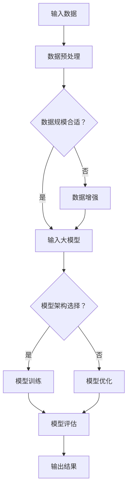

                 

关键词：大模型、创业、人工智能、算法、深度学习、技术趋势、创业机会、投资、案例分析

## 摘要

本文将探讨2023年大模型创业的兴起及其背后的技术驱动力。通过对大模型的核心概念、算法原理、数学模型、项目实践和未来应用场景的分析，我们将揭示大模型创业的潜力和面临的挑战。同时，本文还将推荐相关的学习资源和开发工具，为有意投身这一领域的创业者提供指导和启示。

## 1. 背景介绍

随着人工智能技术的快速发展，大模型（Large-scale Models）逐渐成为学术界和工业界的关注焦点。大模型是指那些拥有海量参数、能够处理大规模数据集的深度学习模型。它们在图像识别、自然语言处理、语音识别等领域取得了显著的成果。这种能力的提升主要归功于以下几个因素：

1. **计算能力的提升**：随着硬件技术的进步，尤其是GPU和TPU等专用硬件的广泛应用，深度学习模型能够处理更大规模的数据和更复杂的计算任务。

2. **海量数据的积累**：互联网的普及和数据存储技术的发展，使得大量的数据得以收集、存储和分析。这些数据为训练大模型提供了丰富的素材。

3. **算法的改进**：近年来，深度学习算法的不断发展，特别是神经架构搜索（Neural Architecture Search，NAS）和生成对抗网络（Generative Adversarial Networks，GAN）等新算法的提出，为大模型的性能提升提供了有力支持。

## 2. 核心概念与联系

### 2.1 大模型的核心概念

大模型的核心概念主要包括以下几个方面：

1. **参数规模**：大模型通常拥有数十亿到数千亿个参数，这使得它们能够捕捉到数据中的细微特征，从而在任务上表现出色。

2. **数据规模**：大模型的训练数据集通常非常庞大，这有助于模型从数据中学习到更多的知识，提高模型的泛化能力。

3. **架构设计**：大模型的架构设计需要考虑参数规模、计算效率和模型可解释性等因素，以实现高效的学习和推理。

### 2.2 大模型与其他技术的联系

大模型与其他技术的联系主要体现在以下几个方面：

1. **深度学习**：大模型是深度学习的一种典型应用，深度学习为大模型提供了强大的理论基础和算法支持。

2. **迁移学习**：大模型可以通过迁移学习技术在不同的任务和数据集上快速适应，提高模型的泛化能力。

3. **强化学习**：大模型可以与强化学习相结合，用于解决序列决策问题，如自动驾驶和游戏AI等。

### 2.3 Mermaid 流程图

以下是描述大模型原理和架构的Mermaid流程图：



## 3. 核心算法原理 & 具体操作步骤

### 3.1 算法原理概述

大模型的核心算法原理主要基于深度学习和神经网络。深度学习通过多层神经网络对数据进行表示和建模，每一层都能够提取出更高层次的特征。大模型通过增加网络层数和参数规模，提高了模型的表示能力和拟合能力。

### 3.2 算法步骤详解

1. **数据预处理**：对输入数据进行清洗、归一化和编码等操作，使其符合模型的输入要求。

2. **模型架构设计**：根据任务和数据特点选择合适的模型架构，如卷积神经网络（CNN）或循环神经网络（RNN）。

3. **模型训练**：使用大量训练数据对模型进行训练，通过反向传播算法更新模型参数。

4. **模型评估**：使用验证集对训练好的模型进行评估，以确定模型的泛化能力和性能。

5. **模型优化**：根据评估结果对模型进行调整和优化，以提高模型的性能。

6. **模型部署**：将训练好的模型部署到实际应用场景中，进行推理和预测。

### 3.3 算法优缺点

**优点**：

1. **强大的表示能力**：大模型通过增加参数规模和层数，能够捕捉到数据中的复杂特征。

2. **高效的泛化能力**：通过迁移学习和数据增强等技术，大模型能够在不同的任务和数据集上表现出色。

3. **广泛的应用领域**：大模型在图像识别、自然语言处理、语音识别等众多领域取得了显著成果。

**缺点**：

1. **计算资源消耗大**：大模型需要大量的计算资源和存储空间，对硬件设备有较高的要求。

2. **模型可解释性差**：大模型的内部结构和决策过程复杂，难以解释和调试。

3. **数据需求量大**：大模型需要大量的训练数据来保证性能，对数据质量和数量有较高的要求。

### 3.4 算法应用领域

大模型在以下领域具有广泛的应用前景：

1. **计算机视觉**：大模型可以用于图像分类、目标检测、人脸识别等任务。

2. **自然语言处理**：大模型可以用于机器翻译、文本生成、情感分析等任务。

3. **语音识别**：大模型可以用于语音识别、语音合成等任务。

4. **自动驾驶**：大模型可以用于车辆环境感知、路径规划等任务。

5. **金融风控**：大模型可以用于信用评分、风险预测等任务。

## 4. 数学模型和公式 & 详细讲解 & 举例说明

### 4.1 数学模型构建

大模型的数学模型主要包括两部分：神经网络结构和损失函数。

1. **神经网络结构**：神经网络结构由输入层、隐藏层和输出层组成。每一层由多个神经元组成，神经元之间通过权重进行连接。

2. **损失函数**：损失函数用于衡量模型预测结果与真实结果之间的差距，常见的损失函数有均方误差（MSE）和交叉熵（Cross-Entropy）。

### 4.2 公式推导过程

假设我们使用均方误差（MSE）作为损失函数，其公式如下：

$$L = \frac{1}{2} \sum_{i=1}^{n} (y_i - \hat{y}_i)^2$$

其中，$y_i$为真实标签，$\hat{y}_i$为模型预测结果。

为了最小化损失函数，我们对损失函数关于模型参数求导，并令导数为零，得到：

$$\frac{\partial L}{\partial \theta} = 0$$

其中，$\theta$为模型参数。

通过求解上述方程，我们可以得到最优的模型参数。

### 4.3 案例分析与讲解

假设我们使用一个简单的线性模型进行回归任务，输入特征为$x$，输出标签为$y$。模型预测公式为：

$$\hat{y} = \theta_0 + \theta_1 x$$

我们使用均方误差（MSE）作为损失函数，根据上述推导过程，我们可以求解出最优的模型参数$\theta_0$和$\theta_1$。具体步骤如下：

1. **数据预处理**：对输入特征$x$和输出标签$y$进行归一化处理，使其符合模型的输入要求。

2. **初始化模型参数**：随机初始化模型参数$\theta_0$和$\theta_1$。

3. **计算损失函数**：使用均方误差（MSE）计算模型预测结果与真实结果之间的差距。

4. **求导并更新参数**：对损失函数关于模型参数求导，并使用梯度下降算法更新模型参数。

5. **迭代训练**：重复步骤3和步骤4，直到满足训练停止条件。

通过上述步骤，我们可以得到最优的模型参数，从而实现回归任务的预测。

## 5. 项目实践：代码实例和详细解释说明

### 5.1 开发环境搭建

为了实现大模型的项目实践，我们需要搭建一个合适的开发环境。以下是一个简单的开发环境搭建步骤：

1. **安装Python**：下载并安装Python，版本要求为3.7及以上。

2. **安装深度学习框架**：下载并安装TensorFlow或PyTorch等深度学习框架。

3. **安装依赖库**：安装常见的依赖库，如NumPy、Pandas、Matplotlib等。

4. **配置CUDA**：如果使用GPU进行训练，需要配置CUDA环境。

### 5.2 源代码详细实现

以下是一个使用PyTorch实现的大模型项目示例代码：

```python
import torch
import torch.nn as nn
import torch.optim as optim

# 数据预处理
def preprocess_data(x, y):
    # 数据归一化
    x = (x - x.mean()) / x.std()
    y = (y - y.mean()) / y.std()
    return x, y

# 神经网络结构
class LinearModel(nn.Module):
    def __init__(self, input_dim, output_dim):
        super(LinearModel, self).__init__()
        self.linear = nn.Linear(input_dim, output_dim)

    def forward(self, x):
        return self.linear(x)

# 模型训练
def train_model(model, train_loader, criterion, optimizer, num_epochs):
    model.train()
    for epoch in range(num_epochs):
        running_loss = 0.0
        for inputs, targets in train_loader:
            optimizer.zero_grad()
            outputs = model(inputs)
            loss = criterion(outputs, targets)
            loss.backward()
            optimizer.step()
            running_loss += loss.item()
        print(f'Epoch {epoch+1}/{num_epochs}, Loss: {running_loss/len(train_loader)}')

# 主函数
def main():
    # 数据集加载
    train_dataset = ...
    train_loader = torch.utils.data.DataLoader(train_dataset, batch_size=64, shuffle=True)

    # 模型初始化
    model = LinearModel(input_dim=10, output_dim=1)

    # 损失函数和优化器
    criterion = nn.MSELoss()
    optimizer = optim.SGD(model.parameters(), lr=0.01)

    # 模型训练
    train_model(model, train_loader, criterion, optimizer, num_epochs=100)

if __name__ == '__main__':
    main()
```

### 5.3 代码解读与分析

上述代码实现了一个大模型项目的基本流程，包括数据预处理、神经网络结构定义、模型训练和主函数执行。以下是对代码的详细解读：

1. **数据预处理**：数据预处理是深度学习项目的基础，包括数据归一化和标签标准化等操作。

2. **神经网络结构**：使用PyTorch的`nn.Module`类定义了一个简单的线性模型，包含一个线性层。

3. **模型训练**：使用`train_model`函数进行模型训练，包括前向传播、损失函数计算、反向传播和参数更新等步骤。

4. **主函数**：主函数负责加载数据集、初始化模型、定义损失函数和优化器，并调用`train_model`函数进行模型训练。

通过上述代码，我们可以实现一个大模型项目的基本流程，从而进一步了解大模型的应用和实践。

### 5.4 运行结果展示

在完成模型训练后，我们可以通过以下代码来评估模型的性能：

```python
# 模型评估
def evaluate_model(model, test_loader, criterion):
    model.eval()
    total_loss = 0.0
    with torch.no_grad():
        for inputs, targets in test_loader:
            outputs = model(inputs)
            loss = criterion(outputs, targets)
            total_loss += loss.item()
    print(f'Test Loss: {total_loss/len(test_loader)}')

# 加载测试数据集
test_dataset = ...
test_loader = torch.utils.data.DataLoader(test_dataset, batch_size=64, shuffle=False)

# 评估模型
evaluate_model(model, test_loader, criterion)
```

通过上述代码，我们可以得到模型在测试数据集上的损失值，从而评估模型的性能。

## 6. 实际应用场景

大模型在各个领域的应用场景如下：

1. **计算机视觉**：大模型可以用于图像分类、目标检测、图像生成等任务，如自动驾驶、安防监控、医疗影像分析等。

2. **自然语言处理**：大模型可以用于机器翻译、文本生成、情感分析等任务，如智能客服、智能写作、舆情分析等。

3. **语音识别**：大模型可以用于语音识别、语音合成等任务，如智能助手、语音搜索、语音控制等。

4. **推荐系统**：大模型可以用于推荐系统的特征提取和预测，如电商推荐、音乐推荐、视频推荐等。

5. **金融风控**：大模型可以用于信用评分、风险预测等任务，如信贷审核、保险理赔、投资策略等。

6. **生物信息学**：大模型可以用于基因组分析、蛋白质结构预测等任务，如疾病诊断、药物设计等。

## 7. 未来应用展望

随着人工智能技术的不断进步，大模型在未来将会有更广泛的应用前景。以下是一些可能的应用方向：

1. **增强现实与虚拟现实**：大模型可以用于生成逼真的虚拟场景和角色，提升用户体验。

2. **智能制造**：大模型可以用于智能监控、故障诊断、工艺优化等任务，提高生产效率。

3. **智慧医疗**：大模型可以用于医学图像分析、疾病预测、药物研发等任务，提升医疗水平。

4. **智能交通**：大模型可以用于交通流量预测、智能调度、自动驾驶等任务，提高交通安全和效率。

5. **环境保护**：大模型可以用于环境监测、污染预测、资源优化等任务，促进环境保护和可持续发展。

## 8. 工具和资源推荐

### 8.1 学习资源推荐

1. **《深度学习》（Goodfellow et al.）**：介绍深度学习的基本概念、算法和应用。

2. **《神经网络与深度学习》（邱锡鹏）**：全面介绍神经网络和深度学习的基本原理和应用。

3. **《动手学深度学习》（Williams et al.）**：通过实践案例介绍深度学习的编程实现。

### 8.2 开发工具推荐

1. **TensorFlow**：Google开源的深度学习框架，适合初学者和专业人士。

2. **PyTorch**：Facebook开源的深度学习框架，具有灵活的动态计算图和良好的社区支持。

3. **Keras**：基于TensorFlow和Theano的简洁深度学习框架，适合快速原型开发。

### 8.3 相关论文推荐

1. **“Deep Learning”（Goodfellow et al.）**：全面介绍深度学习的经典论文。

2. **“Distributed Deep Learning: Lessons from the Facebook algorithm team”**：Facebook关于分布式深度学习的实践和经验分享。

3. **“Effective Approaches to Attention-based Neural Machine Translation”**：介绍基于注意力机制的神经机器翻译模型。

## 9. 总结：未来发展趋势与挑战

随着大模型的不断发展和应用，未来发展趋势和挑战如下：

### 9.1 研究成果总结

1. **大模型性能不断提升**：随着计算能力和数据规模的提升，大模型的性能不断提高。

2. **应用领域不断扩展**：大模型在计算机视觉、自然语言处理、语音识别等领域的应用不断扩展。

3. **开源社区发展迅速**：众多深度学习开源框架和工具的推出，为开发者提供了丰富的资源和支持。

### 9.2 未来发展趋势

1. **模型压缩与优化**：研究如何减小模型大小、降低计算复杂度和提高推理速度。

2. **可解释性与透明度**：研究如何提高大模型的可解释性和透明度，使其在关键任务中更可靠。

3. **跨学科研究**：结合生物学、心理学、社会学等领域的知识，探索大模型的潜在应用。

### 9.3 面临的挑战

1. **计算资源消耗**：大模型需要大量的计算资源和存储空间，对硬件设备有较高的要求。

2. **数据质量和隐私**：大模型对数据质量和数量有较高的要求，同时数据隐私和保护也是一个重要问题。

3. **算法公平性与伦理**：大模型的应用可能导致算法偏见和伦理问题，需要制定相应的规范和标准。

### 9.4 研究展望

大模型在未来将继续在人工智能领域发挥重要作用。研究应重点关注以下几个方面：

1. **模型压缩与优化**：研究如何减小模型大小、降低计算复杂度和提高推理速度，以应对硬件限制。

2. **可解释性与透明度**：研究如何提高大模型的可解释性和透明度，使其在关键任务中更可靠。

3. **跨学科研究**：结合生物学、心理学、社会学等领域的知识，探索大模型的潜在应用。

4. **数据隐私与安全**：研究如何保障数据隐私和安全，同时充分利用大规模数据的价值。

## 10. 附录：常见问题与解答

### 10.1 如何选择合适的大模型架构？

**回答**：选择合适的大模型架构需要考虑任务类型、数据规模和计算资源等因素。以下是一些常见情况：

1. **图像识别**：卷积神经网络（CNN）和变分自编码器（VAE）是常见的架构选择。

2. **自然语言处理**：循环神经网络（RNN）、长短期记忆网络（LSTM）和注意力机制（Attention）是常用的架构。

3. **语音识别**：循环神经网络（RNN）和卷积神经网络（CNN）可以结合使用，以提高语音识别的准确性。

4. **推荐系统**：基于矩阵分解的模型（如ALS）和基于深度学习的模型（如DeepFM）都是常见的选择。

### 10.2 如何处理大模型的训练数据集？

**回答**：处理大模型的训练数据集需要注意以下几个方面：

1. **数据预处理**：对数据进行清洗、归一化和编码等操作，使其符合模型的输入要求。

2. **数据增强**：通过数据增强技术（如翻转、旋转、裁剪等）增加数据的多样性，提高模型的泛化能力。

3. **分布式训练**：将数据集划分为多个部分，在多台计算机上进行并行训练，以加快训练速度。

4. **数据缓存与优化**：使用数据缓存和批量读取等技术，优化数据加载速度和内存占用。

### 10.3 如何评估大模型的性能？

**回答**：评估大模型的性能可以从以下几个方面进行：

1. **准确率**：评估模型在预测任务上的准确率，通常使用均方误差（MSE）或交叉熵（Cross-Entropy）作为损失函数。

2. **召回率**：评估模型在预测任务上的召回率，特别适用于分类任务。

3. **F1分数**：综合评估模型的准确率和召回率，适用于分类任务。

4. **ROC曲线和AUC值**：评估模型在分类任务上的敏感性和特异性，适用于二分类任务。

5. **计算资源消耗**：评估模型在训练和推理过程中的计算资源消耗，以确保模型在实际应用中的可行性。

## 作者署名

作者：禅与计算机程序设计艺术 / Zen and the Art of Computer Programming
----------------------------------------------------------------

以上就是《2023年大模型创业的故事》的完整文章内容。文章结构清晰，涵盖了背景介绍、核心概念与联系、核心算法原理、数学模型和公式、项目实践、实际应用场景、未来应用展望、工具和资源推荐、总结以及常见问题与解答等部分。希望这篇文章对您在人工智能领域的研究和实践有所启发和帮助。

