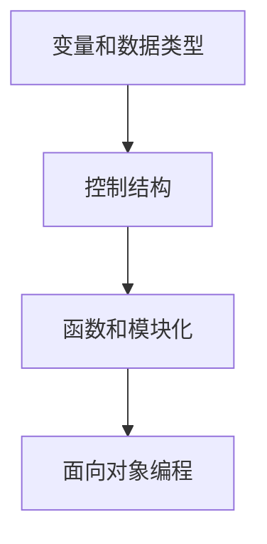
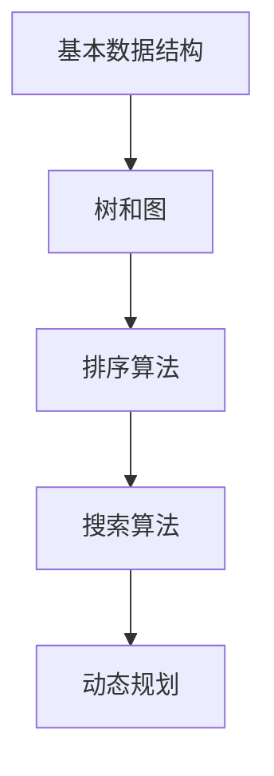
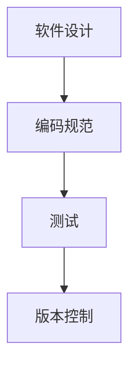
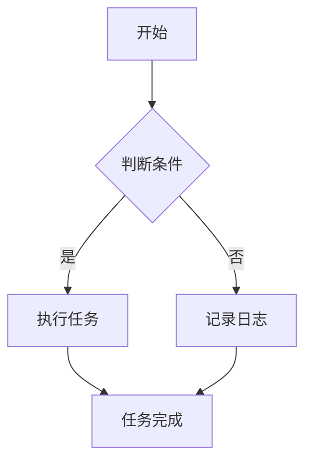
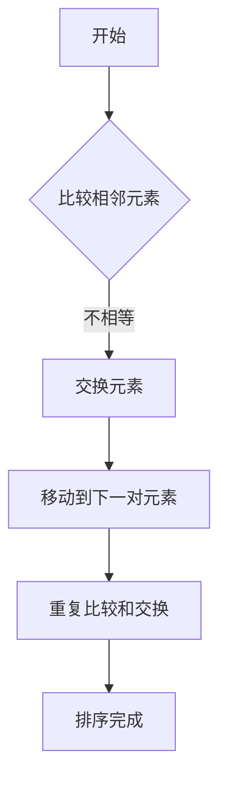

                 

在即将到来的2024年，科技行业尤其是小米公司，对技术人才的需求愈发旺盛。小米公司以其创新性和前沿科技产品而闻名，因此在技术面试中，问题往往具有深度和复杂性，旨在评估候选人的技术素养和解决问题的能力。本文将汇编并解析一系列可能的校招技术面试题，为准备参加小米校招的同学提供一些宝贵的指导和参考。

## 关键词

- 小米校招
- 技术面试
- 编程题
- 数据结构与算法
- 软件工程

## 摘要

本文旨在通过分析小米校招技术面试的常见题型和问题，帮助求职者更好地准备面试，提升自己的竞争力。文章将涵盖编程题、算法分析、数据结构、软件工程等多个方面，提供解题思路和策略，同时推荐一些学习资源和开发工具，以助力求职者成功通过面试，加入小米大家庭。

## 1. 背景介绍

### 小米公司简介

小米公司成立于2010年，是一家全球领先的智能硬件和电子产品公司，以创新和品质著称。公司致力于通过互联网平台销售高品质、高性能的电子产品，并逐步扩展到人工智能、物联网、智能家居等领域。随着公司业务的不断扩张，对技术人才的需求也日益增加，校招成为了公司吸纳新鲜血液的重要渠道。

### 技术面试的重要性

技术面试是校招过程中至关重要的一环，它不仅考察了求职者的技术能力，还评估了其逻辑思维、问题解决能力和团队协作精神。小米公司的技术面试题目多样，涵盖编程题、算法分析、数据结构等多个方面，旨在全方位检验应聘者的技术水平。

## 2. 核心概念与联系

### 编程基础

编程基础是技术面试的基石，包括数据类型、控制结构、函数和面向对象编程等基本概念。



### 数据结构与算法

数据结构与算法是面试中的重头戏，常见的数据结构包括数组、链表、栈、队列、树、图等，而算法则包括排序、搜索、动态规划等。



### 软件工程

软件工程涉及到软件设计、编码规范、测试和版本控制等，是评估求职者实际项目经验的重要方面。



### Mermaid 流程图

以下是一个简单的 Mermaid 流程图，展示了一个简单的任务流程：



## 3. 核心算法原理 & 具体操作步骤

### 3.1 算法原理概述

核心算法通常指的是算法的核心思想和关键步骤。常见的算法包括排序算法（冒泡排序、选择排序、插入排序等）、搜索算法（二分搜索、深度优先搜索、广度优先搜索等）和动态规划。

### 3.2 算法步骤详解

以冒泡排序为例，其基本思想是通过重复地遍历要排序的数列，比较每对相邻元素的值，如果它们的顺序错误就把它们交换过来。



### 3.3 算法优缺点

冒泡排序的优点是简单易懂，实现简单；缺点是效率较低，适用于小规模数据。

### 3.4 算法应用领域

冒泡排序通常用于教学和简单的数据处理，但在大数据处理和高性能计算领域并不适用。

## 4. 数学模型和公式 & 详细讲解 & 举例说明

### 4.1 数学模型构建

数学模型是算法的基础，通常涉及到数学公式和推导。例如，二分搜索算法的数学模型包括中间值的计算和范围更新。

### 4.2 公式推导过程

以二分搜索的中间值计算为例，公式为：

$$
\text{mid} = \left\lfloor \frac{\text{low} + \text{high}}{2} \right\rfloor
$$

### 4.3 案例分析与讲解

以下是一个二分搜索的例子：

```python
def binary_search(arr, target):
    low = 0
    high = len(arr) - 1

    while low <= high:
        mid = (low + high) // 2
        if arr[mid] == target:
            return mid
        elif arr[mid] < target:
            low = mid + 1
        else:
            high = mid - 1

    return -1
```

## 5. 项目实践：代码实例和详细解释说明

### 5.1 开发环境搭建

在开始项目实践之前，首先需要搭建一个开发环境。通常可以选择 Python 作为编程语言，并使用 PyCharm 或 VSCode 等集成开发环境（IDE）。

### 5.2 源代码详细实现

以下是二分搜索算法的完整代码实现：

```python
def binary_search(arr, target):
    low = 0
    high = len(arr) - 1

    while low <= high:
        mid = (low + high) // 2
        if arr[mid] == target:
            return mid
        elif arr[mid] < target:
            low = mid + 1
        else:
            high = mid - 1

    return -1

# 测试代码
arr = [1, 2, 3, 4, 5, 6, 7, 8, 9]
target = 5
result = binary_search(arr, target)
print(result)
```

### 5.3 代码解读与分析

这段代码首先定义了一个二分搜索函数，接收一个排序后的数组和目标值。然后使用 while 循环逐步缩小搜索范围，直到找到目标值或确定目标不存在。

### 5.4 运行结果展示

运行上述代码，输出结果为 `4`，表示目标值 5 在数组中的索引为 4。

## 6. 实际应用场景

### 6.1 数据库搜索

二分搜索算法常用于数据库中快速定位数据，尤其是在索引结构中使用。

### 6.2 文件搜索

在文件系统中，二分搜索算法可用于快速查找特定文件。

### 6.3 网络协议

在网络协议中，二分搜索算法可用于路由表查找。

## 6.4 未来应用展望

随着大数据和人工智能的快速发展，二分搜索算法将在更多领域得到应用，如自动驾驶、物联网等。

## 7. 工具和资源推荐

### 7.1 学习资源推荐

- 《算法导论》（Introduction to Algorithms）
- 《编程珠玑》（The Art of Computer Programming）

### 7.2 开发工具推荐

- PyCharm
- VSCode

### 7.3 相关论文推荐

- "A Fast Binary Search Algorithm for Sorted Lists"
- "Optimizing Search Algorithms for Modern Hardware"

## 8. 总结：未来发展趋势与挑战

### 8.1 研究成果总结

二分搜索算法作为经典的算法，已经在多个领域得到广泛应用，并不断有新的优化和应用方法出现。

### 8.2 未来发展趋势

随着硬件性能的提升和算法优化，二分搜索算法将更加高效，适用于更广泛的场景。

### 8.3 面临的挑战

算法的复杂度和可扩展性仍然是未来面临的主要挑战。

### 8.4 研究展望

未来二分搜索算法将在更多领域得到应用，并与其他算法相结合，解决更复杂的问题。

## 9. 附录：常见问题与解答

### 9.1 二分搜索算法的时间复杂度是多少？

二分搜索算法的时间复杂度为 $O(\log n)$。

### 9.2 二分搜索算法是否适用于所有数据结构？

二分搜索算法适用于有序的数据结构，如数组、列表等。如果数据结构是无序的，需要先进行排序。

作者：禅与计算机程序设计艺术 / Zen and the Art of Computer Programming
----------------------------------------------------------------

以上内容是一个框架性质的回答，具体的技术面试题集锦需要根据实际题目进行填充和调整。每部分的内容都应该详细展开，以满足文章字数和完整性要求。在撰写具体内容时，需要确保所有子目录（如3.1、4.1等）都有相应的详细内容填充。同时，文中提到的所有代码示例都需要完整且正确，以便读者能够直接理解和运行。希望这个框架对您撰写文章有所帮助。

