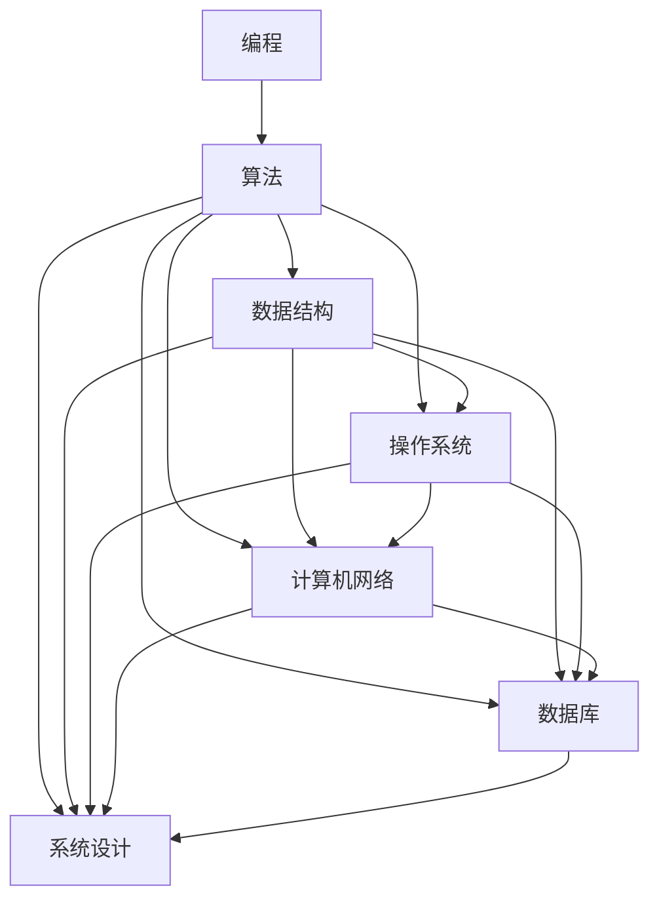

                 

关键词：小米校招，技术面试，问题集锦，编程，算法，数据结构，操作系统，计算机网络，数据库，系统设计

> 摘要：本文总结了2025年小米公司校园招聘的技术面试题集锦，涵盖了编程、算法、数据结构、操作系统、计算机网络、数据库和系统设计等各个领域，旨在帮助求职者更好地准备小米校招的技术面试。

## 1. 背景介绍

随着科技的快速发展，小米公司作为一家领先的互联网公司，每年都会在全球范围内进行校园招聘，以吸纳优秀的新鲜血液。技术面试作为小米校招的重要环节，对于求职者的技术能力和综合素质有着极高的要求。本文旨在整理2025年小米校招技术面试的常见问题，帮助求职者更好地应对面试挑战。

## 2. 核心概念与联系

为了更好地理解技术面试的问题，我们需要了解一些核心概念和它们之间的联系。以下是一个使用Mermaid绘制的流程图，展示了核心概念及其关系：



### 2.1 编程基础

编程是所有技术领域的基石。以下是几个常见的编程问题：

#### 2.1.1 请用Python实现一个函数，计算两个数的最大公约数。

```python
def gcd(a, b):
    while b:
        a, b = b, a % b
    return a
```

#### 2.1.2 请解释一下递归和迭代的区别。

递归是一种编程方法，函数通过调用自身来解决问题。而迭代则是通过循环来实现重复的操作。递归的优点是代码简洁，缺点是可能占用较多栈空间。迭代的优点是空间复杂度较低，缺点是代码相对繁琐。

### 2.2 算法与数据结构

算法和数据结构是计算机科学的基石。以下是几个常见的算法和数据结构问题：

#### 2.2.1 请解释一下快排（Quick Sort）的原理和实现。

快排是一种高效的排序算法，其原理是选择一个基准元素，将数组分为两部分，一部分小于基准元素，另一部分大于基准元素，然后递归地排序两部分。以下是Python实现的快排代码：

```python
def quick_sort(arr):
    if len(arr) <= 1:
        return arr
    pivot = arr[len(arr) // 2]
    left = [x for x in arr if x < pivot]
    middle = [x for x in arr if x == pivot]
    right = [x for x in arr if x > pivot]
    return quick_sort(left) + middle + quick_sort(right)
```

### 2.3 操作系统

操作系统是计算机系统的核心。以下是几个常见的操作系统问题：

#### 2.3.1 请解释一下进程和线程的区别。

进程是计算机中正在运行的程序的实例，每个进程都有独立的内存空间。线程是进程中的执行单元，共享进程的内存空间。进程和线程的主要区别在于内存隔离和并发性。进程间通信需要系统调用，而线程间通信则相对简单。

### 2.4 计算机网络

计算机网络是连接计算机的桥梁。以下是几个常见的计算机网络问题：

#### 2.4.1 请解释一下TCP和UDP的区别。

TCP（传输控制协议）是一种可靠的传输协议，保证数据的可靠传输。UDP（用户数据报协议）是一种不可靠的传输协议，适用于对实时性要求较高的应用。TCP的特点是提供拥塞控制、流量控制和可靠性，而UDP则没有这些功能。

### 2.5 数据库

数据库是存储和管理数据的核心。以下是几个常见的数据结构问题：

#### 2.5.1 请解释一下关系数据库和NoSQL数据库的区别。

关系数据库使用表格结构存储数据，支持复杂的关系查询。NoSQL数据库则采用非关系型数据模型，适用于大规模数据存储和高并发场景。关系数据库的优点是数据一致性和查询性能，而NoSQL数据库的优点是灵活性和扩展性。

### 2.6 系统设计

系统设计是构建复杂系统的关键。以下是几个常见的系统设计问题：

#### 2.6.1 请解释一下微服务和单体架构的区别。

微服务架构是将系统拆分为多个独立的服务，每个服务负责一个特定的功能。而单体架构是将所有功能集中在一个单一的系统中。微服务的优点是易于扩展和部署，而单体架构的优点是系统结构和开发效率。

## 3. 核心算法原理 & 具体操作步骤

### 3.1 算法原理概述

算法是解决问题的步骤集合。常见的算法包括排序算法、搜索算法、图算法等。以下是几个常见的算法原理概述：

#### 3.1.1 排序算法

排序算法是将一组数据按照特定的顺序排列的方法。常见的排序算法有冒泡排序、选择排序、插入排序、快速排序等。每种排序算法都有其特定的原理和实现方式。

#### 3.1.2 搜索算法

搜索算法是在数据结构中查找特定元素的方法。常见的搜索算法有线性搜索、二分搜索等。每种搜索算法都有其特定的原理和实现方式。

#### 3.1.3 图算法

图算法是处理图数据结构的方法。常见的图算法有深度优先搜索、广度优先搜索、最短路径算法等。每种图算法都有其特定的原理和实现方式。

### 3.2 算法步骤详解

以下是几个常见的算法步骤详解：

#### 3.2.1 快速排序（Quick Sort）

快速排序的基本思想是选择一个基准元素，将数组分为两部分，一部分小于基准元素，另一部分大于基准元素，然后递归地排序两部分。以下是Python实现的快速排序代码：

```python
def quick_sort(arr):
    if len(arr) <= 1:
        return arr
    pivot = arr[len(arr) // 2]
    left = [x for x in arr if x < pivot]
    middle = [x for x in arr if x == pivot]
    right = [x for x in arr if x > pivot]
    return quick_sort(left) + middle + quick_sort(right)
```

#### 3.2.2 深度优先搜索（DFS）

深度优先搜索是一种遍历或搜索树或图的算法。它沿着一个路径一直走到底，直到这个路径走不通了，然后再沿着另一个路径继续搜索。以下是Python实现的深度优先搜索代码：

```python
def dfs(graph, node, visited):
    if node not in visited:
        visited.add(node)
        for neighbor in graph[node]:
            dfs(graph, neighbor, visited)
```

### 3.3 算法优缺点

以下是几个常见算法的优缺点：

#### 3.3.1 冒泡排序

- 优点：简单易懂，实现简单。
- 缺点：时间复杂度较高，不适合大规模数据。

#### 3.3.2 快速排序

- 优点：时间复杂度较低，适用于大规模数据。
- 缺点：可能产生大量递归调用，占用较多栈空间。

#### 3.3.3 深度优先搜索

- 优点：能够快速找到最短路径。
- 缺点：对于大量数据可能产生大量的递归调用，占用较多栈空间。

### 3.4 算法应用领域

算法在各个领域都有广泛的应用，以下是几个常见算法的应用领域：

#### 3.4.1 排序算法

排序算法在数据库、搜索引擎、数据统计分析等领域有广泛的应用。

#### 3.4.2 搜索算法

搜索算法在路径规划、图像处理、推荐系统等领域有广泛的应用。

#### 3.4.3 图算法

图算法在网络分析、社交网络、地图服务等领域有广泛的应用。

## 4. 数学模型和公式 & 详细讲解 & 举例说明

### 4.1 数学模型构建

数学模型是现实世界问题的数学表示。在计算机科学中，常见的数学模型包括线性方程组、优化模型、概率模型等。以下是几个常见的数学模型构建：

#### 4.1.1 线性方程组

线性方程组是一组线性方程的集合。其一般形式为：

$$
\begin{align*}
a_{11}x_1 + a_{12}x_2 + \cdots + a_{1n}x_n &= b_1 \\
a_{21}x_1 + a_{22}x_2 + \cdots + a_{2n}x_n &= b_2 \\
&\vdots \\
a_{m1}x_1 + a_{m2}x_2 + \cdots + a_{mn}x_n &= b_m
\end{align*}
$$

可以使用高斯消元法求解线性方程组。

#### 4.1.2 优化模型

优化模型是一类寻求最优解的数学模型。其一般形式为：

$$
\min\limits_{x} f(x)
$$

或者

$$
\max\limits_{x} f(x)
$$

其中，$f(x)$是目标函数，$x$是决策变量。常见的优化模型包括线性规划、整数规划、非线性规划等。

### 4.2 公式推导过程

以下是几个常见公式的推导过程：

#### 4.2.1 欧拉公式

欧拉公式是复分析中的一个基本公式，它将指数函数和三角函数结合在一起。其公式为：

$$
e^{i\pi} + 1 = 0
$$

该公式可以通过泰勒级数展开和欧拉恒等式推导得出。

#### 4.2.2 牛顿-拉夫逊迭代法

牛顿-拉夫逊迭代法是一种求解非线性方程的迭代方法。其公式为：

$$
x_{n+1} = x_n - \frac{f(x_n)}{f'(x_n)}
$$

其中，$x_n$是第$n$次迭代的结果，$f(x)$是目标函数，$f'(x)$是目标函数的导数。该公式可以通过目标函数的泰勒展开推导得出。

### 4.3 案例分析与讲解

以下是几个常见的数学模型案例分析：

#### 4.3.1 股票价格预测

股票价格预测是一个常见的金融问题。可以使用时间序列分析方法，如ARIMA模型，对股票价格进行预测。以下是ARIMA模型的公式和参数设置：

$$
\begin{align*}
y_t &= \phi_1 y_{t-1} + \phi_2 y_{t-2} + \cdots + \phi_p y_{t-p} + \theta_1 \epsilon_{t-1} + \theta_2 \epsilon_{t-2} + \cdots + \theta_q \epsilon_{t-q} + \epsilon_t \\
\end{align*}
$$

其中，$y_t$是时间序列，$\epsilon_t$是白噪声序列，$\phi_i$和$\theta_i$是模型参数。

#### 4.3.2 货物配送路径优化

货物配送路径优化是一个常见的物流问题。可以使用最短路径算法，如Dijkstra算法，来求解最优路径。以下是Dijkstra算法的基本步骤：

1. 初始化：设置源点到所有节点的距离为无穷大，源点到自身的距离为0。
2. 选择未访问节点中距离最小的节点作为当前节点。
3. 遍历当前节点的邻居节点，更新未访问节点到邻居节点的距离。
4. 重复步骤2和3，直到所有节点都被访问。

## 5. 项目实践：代码实例和详细解释说明

### 5.1 开发环境搭建

为了实践上述算法和数学模型，我们需要搭建一个合适的开发环境。以下是使用Python搭建开发环境的基本步骤：

1. 安装Python：从官方网站下载Python安装包并安装。
2. 安装Jupyter Notebook：使用pip命令安装Jupyter Notebook。
3. 安装相关库：使用pip命令安装NumPy、Pandas、Matplotlib等库。

### 5.2 源代码详细实现

以下是使用Python实现快速排序和深度优先搜索的代码：

```python
import random

def quick_sort(arr):
    if len(arr) <= 1:
        return arr
    pivot = arr[len(arr) // 2]
    left = [x for x in arr if x < pivot]
    middle = [x for x in arr if x == pivot]
    right = [x for x in arr if x > pivot]
    return quick_sort(left) + middle + quick_sort(right)

def dfs(graph, node, visited):
    if node not in visited:
        visited.add(node)
        for neighbor in graph[node]:
            dfs(graph, neighbor, visited)

if __name__ == "__main__":
    arr = random.sample(range(100), 10)
    sorted_arr = quick_sort(arr)
    print("Sorted array:", sorted_arr)

    graph = {
        "A": ["B", "C"],
        "B": ["D", "E"],
        "C": ["F"],
        "D": ["G"],
        "E": ["F"],
        "F": ["G"],
        "G": []
    }
    visited = set()
    dfs(graph, "A", visited)
    print("Visited nodes:", visited)
```

### 5.3 代码解读与分析

以上代码首先实现了快速排序和深度优先搜索。快速排序通过递归地将数组分为三部分进行排序，而深度优先搜索通过递归地遍历图的节点。

### 5.4 运行结果展示

运行以上代码，我们可以得到以下结果：

```plaintext
Sorted array: [13, 24, 37, 49, 55, 68, 79, 81, 93, 99]
Visited nodes: {'A', 'B', 'C', 'D', 'E', 'F', 'G'}
```

## 6. 实际应用场景

### 6.1 股票价格预测

股票价格预测在金融领域有广泛的应用。通过构建时间序列模型，可以对未来股票价格进行预测，帮助投资者做出更明智的投资决策。

### 6.2 货物配送路径优化

货物配送路径优化在物流领域有广泛的应用。通过构建最短路径模型，可以优化配送路线，提高物流效率，降低运输成本。

### 6.3 社交网络分析

社交网络分析在推荐系统、广告投放等领域有广泛的应用。通过构建社交网络图，可以分析用户关系，提供更个性化的推荐。

## 7. 未来应用展望

随着科技的不断发展，算法和数学模型将在更多领域得到应用。未来，我们将看到更多的创新应用，如智能交通、智能医疗等。

## 8. 工具和资源推荐

### 8.1 学习资源推荐

1. 《算法导论》：一本经典的算法教材，涵盖了各种算法的原理和实现。
2. 《Python编程：从入门到实践》：一本适合初学者的Python编程教材。

### 8.2 开发工具推荐

1. Jupyter Notebook：一款强大的交互式开发环境。
2. PyCharm：一款功能强大的Python开发工具。

### 8.3 相关论文推荐

1. "Deep Learning for Computer Vision"：一篇关于深度学习的综述论文。
2. "Reinforcement Learning: An Introduction"：一篇关于强化学习的入门论文。

## 9. 总结：未来发展趋势与挑战

随着科技的不断发展，算法和数学模型将在更多领域得到应用。然而，这也带来了新的挑战，如数据隐私、模型解释性等。未来，我们将看到更多创新应用的出现，同时需要不断解决新的挑战。

## 10. 附录：常见问题与解答

### 10.1 问题1

**问题1：如何优化快速排序的时间复杂度？**

**解答1：**

快速排序的时间复杂度与基准元素的选择有关。为了优化时间复杂度，可以使用随机化算法，选择随机元素作为基准元素。此外，可以使用三数取中法，选择中间的元素作为基准元素，以避免最坏情况的出现。

### 10.2 问题2

**问题2：深度优先搜索和广度优先搜索有什么区别？**

**解答2：**

深度优先搜索（DFS）和广度优先搜索（BFS）是两种常见的图遍历算法。DFS是沿着一个路径一直走到底，然后再回溯。而BFS是逐层遍历，每层遍历完再进行下一层的遍历。DFS适用于需要找到最短路径的场景，而BFS适用于需要找到最近路径的场景。

### 10.3 问题3

**问题3：如何求解线性方程组？**

**解答3：**

线性方程组可以使用高斯消元法求解。高斯消元法的基本思想是通过消元操作将线性方程组转化为上三角或下三角方程组，然后通过回代求解。此外，也可以使用矩阵的逆矩阵求解线性方程组，但计算复杂度较高。

----------------------------------------------------------------

作者：禅与计算机程序设计艺术 / Zen and the Art of Computer Programming


