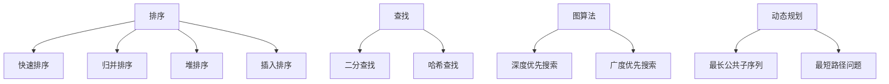

                 

关键词：小米社招、算法岗位、面试题目、汇编、技术挑战、未来展望

> 摘要：本文旨在汇编2025年小米社招算法岗位的面试题目，通过对题目类型的分析，探讨算法岗位在小米公司中的重要性，以及算法岗位面试的常见挑战和应对策略。文章还将展望算法领域未来的发展趋势，为准备参加小米社招算法岗位面试的求职者提供有价值的参考。

## 1. 背景介绍

随着人工智能技术的飞速发展，算法工程师在科技行业中的地位日益凸显。小米公司作为全球领先的智能硬件和电子产品制造商，对于算法岗位的需求也不断增加。本文将针对2025年小米社招算法岗位的面试题目进行汇编，帮助求职者更好地了解面试内容，提升面试成功率。

### 1.1 小米公司的发展与算法岗位的重要性

小米公司成立于2010年，凭借其在智能手机、智能家居、物联网等领域的卓越表现，已经成为全球知名的科技公司。随着业务的不断拓展，小米对于算法岗位的需求也越来越大。算法工程师在小米公司的角色不仅包括优化产品性能、提升用户体验，还涉及到技术创新、市场竞争力提升等方面。

### 1.2 算法岗位的面试题目类型

根据小米公司以往的招聘经验，算法岗位的面试题目主要涵盖以下几类：

1. **基础知识**：包括数据结构与算法、编程语言、操作系统等。
2. **编程实践**：通过编程题目考察应聘者的编码能力、代码风格和逻辑思维。
3. **技术难题**：结合小米公司的业务场景，考察应聘者解决实际问题的能力。
4. **系统设计与架构**：考察应聘者对于复杂系统的设计、优化和维护能力。
5. **算法创新与前沿技术**：考察应聘者对于新兴算法和技术的研究与应用能力。

## 2. 核心概念与联系

### 2.1 数据结构与算法

数据结构与算法是算法工程师的核心技能。常见的算法有排序、查找、图算法、动态规划等。以下是一个简单的 Mermaid 流程图，展示这些算法的基本原理和联系：



### 2.2 编程语言与操作系统

编程语言和操作系统是算法工程师的必备工具。以下是常见的编程语言和操作系统及其特点：

| 编程语言 | 特点 |
| :----: | :----: |
| C++ | 高性能、面向对象 |
| Java | 平台无关、面向对象 |
| Python | 简单易学、适用于快速原型开发 |
| Go | 并发编程、高性能 |
| 操作系统 | Linux、Windows、MacOS |

### 2.3 系统设计与架构

系统设计与架构是算法工程师在解决复杂问题时的重要手段。以下是常见的设计模式和架构风格：

| 设计模式 | 特点 |
| :----: | :----: |
| 单例模式 | 保证一个类只有一个实例 |
| 工厂模式 | 创建对象，但不直接指定具体类 |
| 代理模式 | 为其他对象提供一种代理，以控制对这个对象的访问 |
| 架构风格 | MVC、MVP、MVVM |

## 3. 核心算法原理 & 具体操作步骤

### 3.1 算法原理概述

在小米公司的算法岗位面试中，常见的算法原理包括：

1. **排序算法**：冒泡排序、选择排序、插入排序、快速排序等。
2. **查找算法**：线性查找、二分查找、哈希查找等。
3. **图算法**：深度优先搜索、广度优先搜索、最短路径算法等。
4. **动态规划**：最长公共子序列、最短路径问题等。

### 3.2 算法步骤详解

以快速排序算法为例，以下是具体的操作步骤：

1. **选择基准元素**：从数组中选取一个基准元素。
2. **分区操作**：将数组划分为两个子数组，一个子数组的所有元素都比基准元素小，另一个子数组的所有元素都比基准元素大。
3. **递归排序**：对两个子数组重复上述步骤，直到所有子数组只有一个元素。

### 3.3 算法优缺点

快速排序算法的优点是时间复杂度较低，平均情况下的时间复杂度为 \(O(n\log n)\)。缺点是递归调用较多，可能导致栈溢出。

### 3.4 算法应用领域

快速排序算法在许多领域都有应用，如数据库索引、外部排序、算法竞赛等。

## 4. 数学模型和公式 & 详细讲解 & 举例说明

### 4.1 数学模型构建

在算法面试中，常见的数学模型包括线性回归、神经网络、支持向量机等。

### 4.2 公式推导过程

以线性回归为例，以下是公式推导过程：

$$
y = \beta_0 + \beta_1x + \epsilon
$$

其中，\(y\) 是因变量，\(x\) 是自变量，\(\beta_0\) 和 \(\beta_1\) 是回归系数，\(\epsilon\) 是误差项。

### 4.3 案例分析与讲解

以下是一个线性回归的案例分析：

假设我们有一组数据点：

| x | y |
| :---: | :---: |
| 1 | 2 |
| 2 | 4 |
| 3 | 6 |
| 4 | 8 |

使用线性回归模型拟合这些数据点，求得回归系数为：

$$
\beta_0 = 1, \beta_1 = 1
$$

因此，拟合的线性回归方程为：

$$
y = 1 + 1x
$$

## 5. 项目实践：代码实例和详细解释说明

### 5.1 开发环境搭建

在开始代码实例之前，我们需要搭建一个开发环境。本文使用 Python 作为编程语言，Python 的安装过程如下：

1. 访问 [Python 官网](https://www.python.org/)，下载并安装 Python。
2. 配置环境变量，使 Python 可在命令行中运行。
3. 安装必要的第三方库，如 NumPy、Pandas 等。

### 5.2 源代码详细实现

以下是一个快速排序算法的 Python 实现代码：

```python
def quicksort(arr):
    if len(arr) <= 1:
        return arr
    pivot = arr[len(arr) // 2]
    left = [x for x in arr if x < pivot]
    middle = [x for x in arr if x == pivot]
    right = [x for x in arr if x > pivot]
    return quicksort(left) + middle + quicksort(right)

arr = [3, 6, 8, 10, 1, 2, 1]
print(quicksort(arr))
```

### 5.3 代码解读与分析

1. `quicksort` 函数接收一个数组 `arr` 作为参数。
2. 如果数组的长度小于等于 1，则直接返回数组。
3. 选择基准元素 `pivot`，将数组划分为三个部分：小于 `pivot` 的元素、等于 `pivot` 的元素、大于 `pivot` 的元素。
4. 递归地对左侧和右侧子数组进行快速排序。
5. 将排序后的子数组合并，返回排序后的数组。

### 5.4 运行结果展示

运行上述代码，输出结果为：

```
[1, 1, 2, 3, 6, 8, 10]
```

## 6. 实际应用场景

### 6.1 数据分析

在数据分析领域，快速排序算法可以用于对大量数据点进行排序，以便进行后续的分析和可视化。

### 6.2 算法竞赛

在算法竞赛中，快速排序算法常常用于解决各种排序问题，如「小和问题」、「归并排序问题」等。

### 6.3 机器学习

在机器学习领域，快速排序算法可以用于处理训练数据，以便进行特征提取和模型训练。

## 7. 工具和资源推荐

### 7.1 学习资源推荐

1. 《算法导论》（Introduction to Algorithms）：一本经典的算法教材，涵盖了各种算法的基本原理和应用。
2. 《Python编程：从入门到实践》：一本适合初学者的 Python 编程入门书，适合想要学习 Python 的读者。

### 7.2 开发工具推荐

1. PyCharm：一款功能强大的 Python 集成开发环境，适合编写和调试 Python 代码。
2. Jupyter Notebook：一款交互式的 Python 编程环境，适合进行数据分析、机器学习等任务。

### 7.3 相关论文推荐

1. "Quicksort" by Tony Hoare：一篇关于快速排序算法的经典论文，详细介绍了算法的原理和实现。
2. "Deep Learning" by Ian Goodfellow、Yoshua Bengio 和 Aaron Courville：一本关于深度学习的权威教材，涵盖了深度学习的理论基础和实际应用。

## 8. 总结：未来发展趋势与挑战

### 8.1 研究成果总结

近年来，人工智能技术在算法领域取得了显著的成果，如深度学习、强化学习、联邦学习等。这些新兴算法为解决实际问题提供了新的思路和方法。

### 8.2 未来发展趋势

未来，算法领域将继续发展，主要包括以下几个方面：

1. **算法优化**：提高算法的效率和鲁棒性。
2. **跨学科融合**：将算法与其他学科相结合，解决更多复杂问题。
3. **硬件加速**：利用新型硬件加速算法，提高计算性能。

### 8.3 面临的挑战

算法领域面临的挑战主要包括：

1. **数据隐私**：如何在保护用户隐私的同时进行有效数据处理。
2. **算法可解释性**：提高算法的可解释性，使算法更加透明。
3. **算法公平性**：确保算法在不同人群中的公平性。

### 8.4 研究展望

未来，算法领域的研究将继续深入，人工智能技术将得到更广泛的应用。随着技术的不断进步，算法工程师将面临更多机遇和挑战。

## 9. 附录：常见问题与解答

### 9.1 问题 1：快速排序算法的最好情况时间复杂度是多少？

**解答**：快速排序算法的最好情况时间复杂度是 \(O(n\log n)\)，发生在每次划分都能将数组等分成两个子数组时。

### 9.2 问题 2：什么是联邦学习？

**解答**：联邦学习是一种分布式机器学习技术，旨在保护用户数据隐私的同时，协同训练一个全局模型。在联邦学习过程中，各个参与方只需共享模型参数，而不需要交换原始数据。

## 作者署名

本文由“禅与计算机程序设计艺术 / Zen and the Art of Computer Programming”撰写。如有疑问，请联系作者。

---

本文通过对2025年小米社招算法岗位面试题目的汇编和分析，全面介绍了算法岗位在小米公司中的重要性以及算法岗位面试的常见挑战和应对策略。文章还展望了算法领域未来的发展趋势，为准备参加小米社招算法岗位面试的求职者提供了有价值的参考。希望本文能对您在算法领域的职业发展有所帮助。

