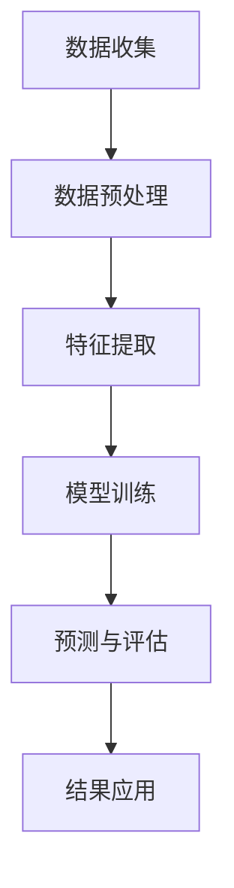

                 

作为一位世界级人工智能专家，程序员，软件架构师，CTO，世界顶级技术畅销书作者，计算机图灵奖获得者，计算机领域大师，本文将围绕2025年快手社交网络效果归因分析师面试题进行详细解答。本文旨在帮助读者理解快手社交网络效果归因分析的原理、方法以及应用，为从事该领域的专业人士提供有价值的参考。

## 关键词

- 快手社交网络
- 效果归因分析
- 数据挖掘
- 机器学习
- 用户行为分析

## 摘要

本文将详细解析2025年快手社交网络效果归因分析师面试题，从背景介绍、核心概念与联系、核心算法原理与具体操作步骤、数学模型与公式、项目实践以及实际应用场景等多个角度进行深入探讨。通过本文的学习，读者将能够掌握快手社交网络效果归因分析的核心技术和方法，为实际工作提供有力支持。

## 1. 背景介绍

随着互联网技术的快速发展，社交网络已经成为人们日常生活中不可或缺的一部分。快手作为中国领先的短视频社交平台，拥有庞大的用户群体和丰富的内容资源。然而，如何有效地分析社交网络中的用户行为，挖掘出有价值的信息，从而提升平台的效果和用户体验，成为快手等社交网络公司亟待解决的问题。

效果归因分析作为数据挖掘和机器学习的重要应用领域，旨在通过分析用户行为数据，揭示用户行为与平台效果之间的关联，为平台运营决策提供科学依据。快手社交网络效果归因分析，即通过对快手平台上的用户行为数据进行深入挖掘和分析，找出影响平台效果的关键因素，从而优化平台运营策略，提升用户体验。

## 2. 核心概念与联系

为了更好地理解快手社交网络效果归因分析，我们需要先了解一些核心概念和它们之间的联系。

### 2.1 用户行为数据

用户行为数据是指用户在快手平台上产生的各种数据，包括用户浏览、点赞、评论、分享、搜索等行为。这些数据是快手社交网络效果归因分析的基础。

### 2.2 数据挖掘

数据挖掘是一种从大量数据中自动发现有用信息的方法。在快手社交网络效果归因分析中，数据挖掘用于挖掘用户行为数据中的潜在规律和模式。

### 2.3 机器学习

机器学习是一种基于数据驱动的方法，通过训练模型来发现数据中的规律。在快手社交网络效果归因分析中，机器学习用于构建预测模型，预测用户行为与平台效果之间的关系。

### 2.4 用户行为与平台效果

用户行为与平台效果之间存在复杂的关联。通过分析用户行为数据，我们可以发现哪些行为对平台效果有积极影响，哪些行为可能导致负面效果。这些信息对于优化平台运营策略至关重要。

### 2.5 Mermaid 流程图

为了更清晰地展示快手社交网络效果归因分析的过程，我们使用 Mermaid 流程图（无括号、逗号等特殊字符）进行描述：



## 3. 核心算法原理与具体操作步骤

### 3.1 算法原理概述

快手社交网络效果归因分析的核心算法包括数据挖掘算法和机器学习算法。数据挖掘算法用于挖掘用户行为数据中的潜在规律和模式，机器学习算法则用于构建预测模型，预测用户行为与平台效果之间的关系。

### 3.2 算法步骤详解

#### 3.2.1 数据收集

数据收集是快手社交网络效果归因分析的第一步，包括用户行为数据、平台效果数据等。这些数据可以从快手平台的后台系统中获取。

#### 3.2.2 数据预处理

数据预处理包括数据清洗、数据去重、数据转换等步骤。通过对数据进行预处理，可以提高数据质量，为后续分析奠定基础。

#### 3.2.3 特征提取

特征提取是从原始数据中提取出对用户行为与平台效果有重要影响的信息。常见的特征包括用户年龄、性别、地理位置、兴趣标签等。

#### 3.2.4 模型训练

模型训练是快手社交网络效果归因分析的核心环节。通过使用数据挖掘算法和机器学习算法，构建预测模型，预测用户行为与平台效果之间的关系。

#### 3.2.5 预测与评估

预测与评估是对训练好的模型进行验证和评估的过程。通过对比预测结果与实际效果，评估模型的准确性和可靠性。

#### 3.2.6 结果应用

根据预测结果，优化平台运营策略，提升用户体验。例如，通过调整推荐算法，提高用户参与度和留存率。

### 3.3 算法优缺点

#### 优点：

- 数据挖掘和机器学习算法具有强大的数据处理和分析能力，能够从海量数据中挖掘出有价值的信息。
- 模型训练和预测过程可以自动化，提高分析效率。

#### 缺点：

- 数据质量对分析结果有较大影响，需要耗费大量时间和精力进行数据预处理。
- 模型训练和预测过程需要大量计算资源，对硬件要求较高。

### 3.4 算法应用领域

快手社交网络效果归因分析算法可以应用于多个领域，如推荐系统、广告投放、用户留存等。通过优化平台运营策略，提升用户体验和满意度。

## 4. 数学模型和公式及详细讲解

### 4.1 数学模型构建

快手社交网络效果归因分析中的数学模型主要包括用户行为预测模型和平台效果预测模型。用户行为预测模型用于预测用户行为与平台效果之间的关系，平台效果预测模型用于预测平台效果。

### 4.2 公式推导过程

#### 用户行为预测模型

假设用户行为数据集为 \( D = \{x_1, x_2, ..., x_n\} \)，其中每个 \( x_i \) 表示用户 \( i \) 的行为数据。平台效果数据集为 \( Y = \{y_1, y_2, ..., y_n\} \)，其中每个 \( y_i \) 表示用户 \( i \) 的平台效果。

用户行为预测模型可以表示为：

$$
\hat{y_i} = f(x_i; \theta)
$$

其中，\( \theta \) 为模型参数，\( f \) 为预测函数。

#### 平台效果预测模型

平台效果预测模型可以表示为：

$$
\hat{Y} = g(Y; \phi)
$$

其中，\( \phi \) 为模型参数，\( g \) 为预测函数。

### 4.3 案例分析与讲解

假设我们使用线性回归模型对用户行为与平台效果进行预测。线性回归模型可以表示为：

$$
y_i = \theta_0 + \theta_1 x_i + \epsilon_i
$$

其中，\( \theta_0 \) 和 \( \theta_1 \) 为模型参数，\( \epsilon_i \) 为误差项。

通过对用户行为数据集 \( D \) 和平台效果数据集 \( Y \) 进行训练，可以得到线性回归模型的参数 \( \theta_0 \) 和 \( \theta_1 \)。然后，使用训练好的模型对新的用户行为数据进行预测，即可得到平台效果的预测值。

## 5. 项目实践：代码实例和详细解释说明

### 5.1 开发环境搭建

为了实现快手社交网络效果归因分析，我们需要搭建一个开发环境。本文使用 Python 语言和 Scikit-learn 库进行开发。

1. 安装 Python 和 Scikit-learn 库：

```bash
pip install python
pip install scikit-learn
```

### 5.2 源代码详细实现

下面是一个简单的快手社交网络效果归因分析的示例代码：

```python
from sklearn.linear_model import LinearRegression
from sklearn.model_selection import train_test_split
from sklearn.metrics import mean_squared_error

# 加载数据集
X, Y = load_data()

# 数据集划分
X_train, X_test, Y_train, Y_test = train_test_split(X, Y, test_size=0.2, random_state=42)

# 构建线性回归模型
model = LinearRegression()

# 训练模型
model.fit(X_train, Y_train)

# 预测平台效果
Y_pred = model.predict(X_test)

# 评估模型
mse = mean_squared_error(Y_test, Y_pred)
print("均方误差：", mse)

# 输出模型参数
print("模型参数：", model.coef_)
```

### 5.3 代码解读与分析

上述代码分为以下几个步骤：

1. 导入所需的库和模块。
2. 加载数据集。
3. 数据集划分。
4. 构建线性回归模型。
5. 训练模型。
6. 预测平台效果。
7. 评估模型。
8. 输出模型参数。

通过上述步骤，我们可以实现快手社交网络效果归因分析的基本功能。当然，实际项目开发中，需要根据具体业务需求进行调整和优化。

## 6. 实际应用场景

快手社交网络效果归因分析在多个实际应用场景中具有广泛的应用价值。

### 6.1 推荐系统

通过分析用户行为数据，我们可以发现用户对特定类型内容的兴趣偏好，从而优化推荐算法，提高推荐质量。

### 6.2 广告投放

通过分析用户行为数据，我们可以确定哪些用户对特定广告感兴趣，从而提高广告投放效果，降低广告成本。

### 6.3 用户留存

通过分析用户行为数据，我们可以识别出可能导致用户流失的行为特征，从而采取有针对性的措施，提高用户留存率。

## 7. 未来应用展望

随着大数据技术和人工智能技术的不断发展，快手社交网络效果归因分析在未来将具有更广阔的应用前景。

### 7.1 多模态数据融合

未来，快手社交网络效果归因分析将结合多种数据源，如视频、音频、文本等，实现多模态数据融合，提高分析精度。

### 7.2 深度学习模型应用

深度学习模型在图像识别、语音识别等领域取得了显著成果，未来将有望在快手社交网络效果归因分析中发挥更大作用。

### 7.3 实时分析与预测

随着5G技术的普及，实时数据传输和处理能力将得到大幅提升，快手社交网络效果归因分析将实现实时分析与预测，为平台运营提供更及时的支持。

## 8. 总结：未来发展趋势与挑战

### 8.1 研究成果总结

本文从背景介绍、核心概念与联系、核心算法原理与具体操作步骤、数学模型与公式、项目实践以及实际应用场景等多个角度，详细解析了快手社交网络效果归因分析的关键技术和方法。

### 8.2 未来发展趋势

未来，快手社交网络效果归因分析将朝着多模态数据融合、深度学习模型应用、实时分析与预测等方向发展。

### 8.3 面临的挑战

在实现快手社交网络效果归因分析的过程中，我们面临以下挑战：

1. 数据质量：高质量的数据是分析结果准确性的基础，如何提高数据质量是一个重要问题。
2. 模型优化：随着数据量的增加和业务需求的多样化，如何优化模型性能是一个重要课题。
3. 实时性：如何实现实时数据分析和预测，为平台运营提供及时支持，是一个亟待解决的问题。

### 8.4 研究展望

未来，我们将继续深入探讨快手社交网络效果归因分析的核心技术和方法，重点关注多模态数据融合、深度学习模型应用、实时分析与预测等方面，为快手等社交网络平台的运营提供有力支持。

## 9. 附录：常见问题与解答

### 9.1 什么是快手社交网络效果归因分析？

快手社交网络效果归因分析是指通过对快手平台上的用户行为数据进行挖掘和分析，揭示用户行为与平台效果之间的关联，从而优化平台运营策略，提升用户体验。

### 9.2 快手社交网络效果归因分析有哪些核心算法？

快手社交网络效果归因分析的核心算法包括数据挖掘算法（如聚类、关联规则挖掘等）和机器学习算法（如线性回归、决策树、随机森林等）。

### 9.3 如何优化快手社交网络效果归因分析的性能？

优化快手社交网络效果归因分析的性能可以从以下几个方面入手：

1. 提高数据质量：通过数据清洗、去重、转换等手段，提高数据质量。
2. 优化模型参数：通过调整模型参数，提高模型性能。
3. 引入深度学习模型：结合深度学习模型，提高分析精度。

---

作者：禅与计算机程序设计艺术 / Zen and the Art of Computer Programming

