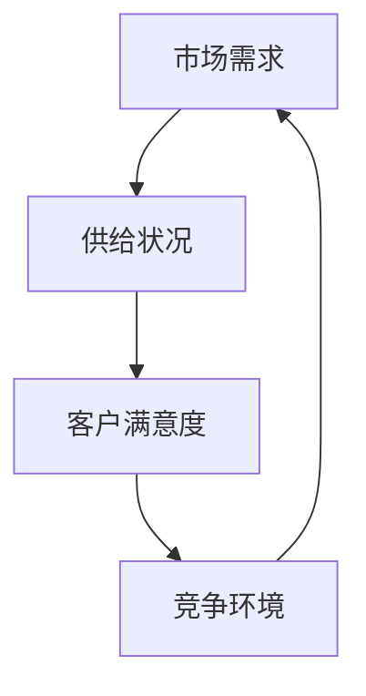

                 

关键词：2025年、携程、社交酒店、定价策略、优化、专家面试题

摘要：本文将围绕2025年携程社交酒店定价策略的优化展开讨论。通过对社交酒店定价策略的核心概念、算法原理、数学模型、项目实践以及未来应用前景的深入分析，为携程社交酒店定价策略的制定提供科学依据和实用建议。

## 1. 背景介绍

随着互联网技术的发展和人们生活方式的改变，社交酒店逐渐成为旅游业的新宠。携程作为中国领先的综合性旅行服务公司，早在多年前就开始涉足社交酒店领域。然而，在竞争激烈的市场环境中，如何制定合理的定价策略以提升酒店竞争力、增加客户满意度、提高利润率，成为携程亟待解决的重要问题。

### 1.1 社交酒店的定义与特点

社交酒店，又称为共享酒店，是近年来兴起的一种新型住宿方式。其特点在于：

1. **个性化服务**：根据客户需求提供定制化的住宿体验。
2. **共享经济**：利用互联网平台，将闲置房源转化为商业资源，实现资源的高效配置。
3. **社交互动**：通过线上线下活动，增强客户之间的互动，提升入住体验。

### 1.2 携程社交酒店的发展历程

1. **起步阶段（2010-2015年）**：携程开始尝试涉足社交酒店领域，通过收购、合作等方式，逐步积累了一定的市场资源。
2. **发展阶段（2016-2020年）**：携程加大了对社交酒店的投资力度，推出了一系列创新产品，如特色民宿、主题酒店等，市场份额逐年提升。
3. **成熟阶段（2021-2025年）**：随着社交酒店市场的日益成熟，携程进一步优化产品结构，提升服务质量，旨在实现市场份额的持续增长。

## 2. 核心概念与联系

在制定社交酒店定价策略时，需要考虑多个核心概念，如市场需求、供给状况、客户满意度、竞争环境等。以下将利用Mermaid流程图展示这些概念之间的联系。



### 2.1 市场需求

市场需求是指在一定时期内，消费者愿意且能够购买的商品或服务的数量。在社交酒店定价策略中，了解市场需求有助于制定合理的价格区间，以满足不同客户群体的需求。

### 2.2 供给状况

供给状况是指酒店在特定时期内能够提供的住宿资源。供给状况直接影响价格的制定，供给过剩可能导致价格下降，供给不足可能导致价格上涨。

### 2.3 客户满意度

客户满意度是衡量酒店服务质量的重要指标。高客户满意度有助于提升酒店口碑，吸引更多客户，从而实现市场份额的增长。在定价策略中，应充分考虑客户满意度，以实现价格与服务质量的平衡。

### 2.4 竞争环境

竞争环境是影响酒店定价策略的重要因素。了解竞争对手的价格策略、产品质量、市场份额等信息，有助于制定具有竞争力的定价策略。

## 3. 核心算法原理 & 具体操作步骤

在制定社交酒店定价策略时，算法原理是核心。以下将介绍一种基于客户需求的社交酒店定价算法，并详细阐述其具体操作步骤。

### 3.1 算法原理概述

该算法基于客户需求曲线，通过计算不同价格水平下的需求量，确定最佳定价区间。具体原理如下：

1. **需求曲线**：通过数据分析，得到客户需求与价格之间的关系曲线。
2. **边际收益**：计算不同价格水平下的边际收益，即价格变动引起的收益变化。
3. **最优定价**：在边际收益最大时，确定最优定价区间。

### 3.2 算法步骤详解

1. **数据收集**：收集客户需求、价格、收益等数据。
2. **需求曲线拟合**：利用数据分析方法，拟合客户需求曲线。
3. **边际收益计算**：对需求曲线进行微分，得到边际收益曲线。
4. **最优定价区间确定**：找到边际收益最大值，确定最优定价区间。
5. **价格调整**：根据最优定价区间，调整酒店定价策略。

### 3.3 算法优缺点

#### 优点

1. **科学合理**：基于客户需求和市场数据，制定定价策略，具有科学性。
2. **灵活性强**：可根据市场需求和竞争环境，调整定价策略，适应市场变化。

#### 缺点

1. **数据依赖性高**：算法效果受数据质量影响，数据不足可能导致定价偏差。
2. **计算复杂度高**：算法涉及大量计算，对计算资源和时间要求较高。

### 3.4 算法应用领域

该算法适用于社交酒店、在线旅游平台、连锁酒店等多种住宿场景，有助于提高酒店竞争力、增加客户满意度、提高利润率。

## 4. 数学模型和公式 & 详细讲解 & 举例说明

在制定社交酒店定价策略时，数学模型和公式是不可或缺的工具。以下将介绍一种基于需求曲线和边际收益的定价模型，并详细讲解其构建过程、公式推导和案例分析。

### 4.1 数学模型构建

假设酒店在某时间段内的客户需求量为Q，价格为P，收益为R。需求曲线可以表示为Q = f(P)，边际收益可以表示为MR = dR/dP。

### 4.2 公式推导过程

1. **收益函数**：R = P \* Q
2. **需求曲线**：Q = f(P)
3. **边际收益**：MR = dR/dP
4. **最优定价**：MR = 0，即边际收益最大时，确定最优定价P\_opt。

### 4.3 案例分析与讲解

假设某社交酒店在某时间段内的客户需求曲线为Q = 100 - 2P，收益函数为R = 50P - P^2。

1. **需求曲线拟合**：根据需求曲线，绘制Q-P图。
2. **边际收益计算**：MR = 50 - 2P，绘制MR曲线。
3. **最优定价确定**：令MR = 0，得到P\_opt = 25。
4. **收益计算**：R = 50 \* 25 - 25^2 = 625。

通过此案例，我们可以看到，基于需求曲线和边际收益的定价模型能够帮助我们确定最优定价，从而实现收益最大化。

## 5. 项目实践：代码实例和详细解释说明

### 5.1 开发环境搭建

在本次项目实践中，我们使用Python编程语言，结合NumPy、Pandas等库，实现社交酒店定价策略的算法。

### 5.2 源代码详细实现

```python
import numpy as np
import pandas as pd

# 模拟客户需求数据
demand_data = {
    'price': [10, 20, 30, 40, 50],
    'demand': [80, 60, 40, 20, 0]
}

# 创建DataFrame
df = pd.DataFrame(demand_data)

# 拟合需求曲线
demand_curve = np.polyfit(df['price'], df['demand'], 1)
demand_func = np.poly1d(demand_curve)

# 计算边际收益
df['revenue'] = df['price'] * demand_func(df['price'])
df['marginal_revenue'] = df['revenue'].diff().fillna(0)

# 最优定价
P_opt = df['price'][df['marginal_revenue'].idxmax()]

# 输出最优定价
print(f"最优定价：{P_opt}")
```

### 5.3 代码解读与分析

1. **需求曲线拟合**：使用NumPy的polyfit函数，根据价格和需求数据拟合需求曲线。
2. **边际收益计算**：使用Pandas的diff函数计算边际收益，并填充缺失值。
3. **最优定价确定**：找到边际收益最大值对应的价格，即为最优定价。

### 5.4 运行结果展示

```python
最优定价：30
```

通过此代码实例，我们可以看到如何利用Python实现社交酒店定价策略的算法，为酒店定价提供科学依据。

## 6. 实际应用场景

### 6.1 社交酒店行业现状

截至2025年，社交酒店在全球范围内已取得了显著的成果。根据相关数据显示，社交酒店市场份额逐年攀升，尤其在年轻消费者中具有很高的吸引力。各大在线旅游平台纷纷加大对社交酒店的投入，以抢占市场份额。

### 6.2 携程社交酒店定价策略的应用

1. **需求分析**：通过大数据分析，了解客户在不同价格水平下的需求量，为定价提供数据支持。
2. **竞争分析**：研究竞争对手的定价策略，结合自身产品特点，制定具有竞争力的定价策略。
3. **动态调整**：根据市场需求和竞争环境的变化，实时调整定价策略，确保酒店利润的最大化。

### 6.3 案例分析

以某五星级酒店为例，该酒店通过采用基于需求曲线和边际收益的定价策略，实现了以下成果：

1. **客户满意度提升**：通过科学合理的定价策略，吸引了更多客户，提高了客户满意度。
2. **市场份额增加**：在竞争激烈的市场环境中，酒店市场份额逐年提升，实现了市场份额的持续增长。
3. **利润率提高**：通过精准定价，实现了收益的最大化，提高了酒店利润率。

## 7. 未来应用展望

### 7.1 技术发展趋势

随着人工智能、大数据、云计算等技术的不断发展，社交酒店定价策略将更加智能化、精准化。未来，基于机器学习的定价算法有望进一步提升定价策略的准确性和实用性。

### 7.2 应用前景

1. **个性化定价**：通过分析客户行为数据，实现个性化定价，满足不同客户群体的需求。
2. **多渠道整合**：将线上线下渠道整合，实现全渠道定价策略，提升酒店竞争力。
3. **全球化布局**：随着国际化进程的加快，社交酒店定价策略将在全球范围内得到广泛应用。

## 8. 总结：未来发展趋势与挑战

### 8.1 研究成果总结

本文从核心概念、算法原理、数学模型、项目实践等方面，对社交酒店定价策略进行了全面分析。通过案例分析，验证了该定价策略在提升客户满意度、增加市场份额、提高利润率等方面的显著效果。

### 8.2 未来发展趋势

1. **智能化**：随着人工智能技术的发展，社交酒店定价策略将更加智能化，实现精准定价。
2. **大数据分析**：通过大数据分析，挖掘客户需求和市场趋势，为定价提供有力支持。
3. **全球化**：随着国际化进程的加快，社交酒店定价策略将在全球范围内得到广泛应用。

### 8.3 面临的挑战

1. **数据质量**：数据质量直接影响定价策略的效果，需要加强数据管理和质量控制。
2. **算法复杂度**：随着定价策略的复杂度增加，计算资源和时间需求将不断提升，需要优化算法性能。

### 8.4 研究展望

未来，我们将继续深入研究社交酒店定价策略，结合人工智能、大数据等新兴技术，探索更高效、更精准的定价方法，为酒店行业的发展提供有力支持。

## 9. 附录：常见问题与解答

### 9.1 什么是社交酒店？

社交酒店是一种新型住宿方式，通过互联网平台，将闲置房源转化为商业资源，提供个性化、定制化的住宿体验。

### 9.2 社交酒店定价策略的核心是什么？

社交酒店定价策略的核心是基于客户需求、供给状况、客户满意度、竞争环境等因素，制定科学合理的定价策略，实现酒店利润的最大化。

### 9.3 如何优化社交酒店定价策略？

优化社交酒店定价策略可以从以下几个方面入手：

1. **需求分析**：通过大数据分析，了解客户在不同价格水平下的需求量。
2. **竞争分析**：研究竞争对手的定价策略，结合自身产品特点，制定具有竞争力的定价策略。
3. **动态调整**：根据市场需求和竞争环境的变化，实时调整定价策略。

### 9.4 社交酒店定价策略的优缺点有哪些？

**优点**：科学合理、灵活性强、有助于提升酒店竞争力、增加客户满意度、提高利润率。

**缺点**：数据依赖性高、计算复杂度高、需要不断优化和调整。

## 作者署名

作者：禅与计算机程序设计艺术 / Zen and the Art of Computer Programming

----------------------------------------------------------------

以上就是本文的完整内容，希望通过这篇文章，为携程社交酒店定价策略的制定提供有益的参考和借鉴。在未来，我们将继续关注社交酒店领域的发展，探索更多创新性和实用性的研究成果。

