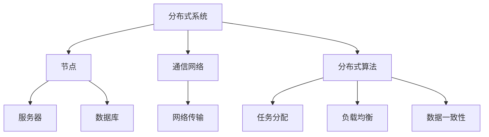

                 

关键词：分布式系统，面试指南，携程社招，系统架构，分布式算法，工程师素质要求，前沿技术趋势。

## 摘要

本文旨在为2025年携程社招的分布式系统工程师面试提供详细的备考指南。文章将深入探讨分布式系统的核心概念、面试常见问题、技术挑战以及工程师所需具备的素质。通过这篇文章，读者将能够全面了解分布式系统工程师的职责，掌握面试的关键要点，并准备好应对各种复杂问题。

## 1. 背景介绍

### 分布式系统的崛起

随着互联网的飞速发展，企业对数据处理能力、系统可靠性和可扩展性的需求日益增长。分布式系统因其卓越的性能和灵活性，成为了现代企业架构的首选。携程作为全球领先的在线旅行服务公司，其业务规模庞大，每天需要处理海量的用户请求和数据。因此，分布式系统在携程的架构中扮演着至关重要的角色。

### 携程的分布式系统需求

携程的业务涉及机票、酒店、度假、交通等多个领域，每天的用户请求和数据量庞大。为了确保系统的高可用性、高可靠性和可扩展性，携程采用了分布式系统架构。这种架构不仅能够有效应对高并发场景，还能保证系统的稳定性和数据的一致性。

### 面试重要性

对于分布式系统工程师而言，面试是一个展示自身技术能力和实战经验的重要平台。通过面试，企业可以评估应聘者对分布式系统的理解程度、解决问题的能力以及团队协作精神。因此，充分准备面试对于成功入职至关重要。

## 2. 核心概念与联系

### 分布式系统基本概念

分布式系统是由多个独立的节点组成，通过网络进行通信和协作的计算系统。其核心目标是实现计算资源的共享和任务的高效分配，从而提高系统的整体性能。

#### 分布式系统架构

分布式系统通常采用分布式计算、分布式存储和分布式数据库等技术，以实现数据的分布式存储和计算。以下是分布式系统架构的主要组成部分：

1. **节点**：分布式系统的基本组成单元，包括服务器、数据库和其他设备。
2. **通信网络**：节点之间的通信和数据传输渠道。
3. **分布式算法**：用于任务分配、负载均衡和数据一致性等核心功能。

### Mermaid 流程图

以下是一个简单的 Mermaid 流程图，展示了分布式系统的基本架构和组件。



### 核心概念的联系

分布式系统的核心概念和组成部分相互关联，共同实现系统的整体功能。以下是这些概念之间的联系：

- **节点**：作为分布式系统的基本单元，节点负责执行任务和处理数据。
- **通信网络**：确保节点之间能够高效地进行通信和数据传输。
- **分布式算法**：用于任务分配、负载均衡和数据一致性，确保系统的稳定运行。

## 3. 核心算法原理 & 具体操作步骤

### 3.1 算法原理概述

分布式系统中的核心算法主要包括分布式哈希表（DHT）、一致性算法、Raft算法和Paxos算法等。以下是这些算法的基本原理：

1. **分布式哈希表（DHT）**：通过哈希函数将数据分布到多个节点上，实现数据的快速访问和高效存储。
2. **一致性算法**：确保分布式系统中数据的一致性和可靠性，包括强一致性、最终一致性和因果一致性等。
3. **Raft算法**：一种分布式一致性算法，通过选举机制确保数据的一致性和稳定性。
4. **Paxos算法**：一种分布式一致性算法，通过多数派投票机制实现数据的一致性。

### 3.2 算法步骤详解

以下是对分布式系统中常用的几个核心算法的具体步骤进行详细解析。

#### 分布式哈希表（DHT）

1. **数据分片**：将数据划分为多个分片，每个分片由一个哈希值表示。
2. **节点定位**：通过哈希函数确定数据存储的节点。
3. **数据复制**：将数据分片复制到多个节点上，提高数据可靠性和访问速度。
4. **哈希重定位**：在节点增加或删除时，根据新的哈希值重新定位数据。

#### 一致性算法

1. **强一致性**：所有节点在同一时间看到相同的数据状态。
2. **最终一致性**：所有节点最终会看到相同的数据状态，但可能在一段时间内存在不一致。
3. **因果一致性**：根据数据的产生顺序保证数据的一致性。

#### Raft算法

1. **选举机制**：通过随机算法和心跳机制进行领导者选举。
2. **日志复制**：领导者将日志条目复制到跟随者。
3. **状态机**：所有节点根据日志条目执行相同操作，保持状态机一致性。

#### Paxos算法

1. **提议者**：提出提案，请求其他节点投票。
2. **接受者**：对提案进行投票，返回接受或拒绝。
3. **领导者**：根据投票结果决定是否将提案应用到状态机。

### 3.3 算法优缺点

以下是分布式系统中常用算法的优缺点分析：

1. **分布式哈希表（DHT）**
   - 优点：数据存储和访问高效，节点间负载均衡。
   - 缺点：数据复制和哈希重定位可能导致数据不一致。
2. **一致性算法**
   - 优点：保证数据一致性和可靠性。
   - 缺点：强一致性可能影响性能，最终一致性可能导致数据延迟。
3. **Raft算法**
   - 优点：易于理解，实现简单，稳定性高。
   - 缺点：性能可能低于Paxos算法。
4. **Paxos算法**
   - 优点：强一致性，性能高。
   - 缺点：实现复杂，对开发人员要求较高。

### 3.4 算法应用领域

分布式系统算法在多个领域具有广泛的应用，包括：

1. **分布式存储**：如分布式文件系统、分布式数据库等。
2. **分布式计算**：如MapReduce、Spark等。
3. **分布式网络**：如分布式负载均衡、分布式防火墙等。
4. **分布式数据库**：如Cassandra、HBase等。

## 4. 数学模型和公式 & 详细讲解 & 举例说明

### 4.1 数学模型构建

分布式系统中的数学模型主要涉及概率论、图论和线性代数等。以下是一个简单的数学模型示例：

- **数据一致性概率模型**：假设分布式系统中包含N个节点，每个节点的数据一致性概率为P，则整个系统的数据一致性概率为1 - (1 - P)^N。

### 4.2 公式推导过程

以下是对上述数据一致性概率模型的推导过程：

1. **单个节点数据一致性概率**：P
2. **单个节点数据不一致概率**：1 - P
3. **N个节点数据不一致概率**：(1 - P)^N
4. **N个节点数据一致性概率**：1 - (1 - P)^N

### 4.3 案例分析与讲解

以下是一个数据一致性概率模型的案例：

- **场景**：假设一个分布式系统包含5个节点，每个节点的数据一致性概率为0.95。
- **求解**：根据上述模型，系统的数据一致性概率为1 - (1 - 0.95)^5 ≈ 0.9976。

这意味着，在这个分布式系统中，数据的一致性概率非常高，几乎可以确保系统正常运行。

## 5. 项目实践：代码实例和详细解释说明

### 5.1 开发环境搭建

为了更好地理解分布式系统的实践，我们将使用一个简单的分布式哈希表（DHT）作为案例。以下是开发环境搭建的步骤：

1. **安装Go语言环境**：在本地计算机上安装Go语言环境，确保能够编译和运行Go代码。
2. **创建DHT项目**：使用Go语言的`go mod`命令创建一个新的模块，并命名为`dht`。
3. **配置依赖项**：在`go.mod`文件中添加所需的依赖项，如`net`、`encoding/json`等。

### 5.2 源代码详细实现

以下是一个简单的分布式哈希表（DHT）的源代码实现：

```go
package main

import (
    "encoding/json"
    "fmt"
    "net"
    "os"
)

type Node struct {
    Address string `json:"address"`
}

func newNode(address string) *Node {
    return &Node{Address: address}
}

func (n *Node) String() string {
    return n.Address
}

func main() {
    // 创建一个包含3个节点的DHT
    nodes := []*Node{
        newNode("node1:8080"),
        newNode("node2:8080"),
        newNode("node3:8080"),
    }

    // 启动服务器
    listener, err := net.Listen("tcp", ":8080")
    if err != nil {
        panic(err)
    }
    defer listener.Close()

    fmt.Println("DHT Server started on port 8080")

    for {
        conn, err := listener.Accept()
        if err != nil {
            panic(err)
        }
        go handleConn(conn, nodes)
    }
}

func handleConn(conn net.Conn, nodes []*Node) {
    // 读取请求
    request := make([]byte, 1024)
    _, err := conn.Read(request)
    if err != nil {
        panic(err)
    }

    // 解析请求
    var nodeRequest map[string]interface{}
    if err := json.Unmarshal(request, &nodeRequest); err != nil {
        panic(err)
    }

    // 根据请求处理数据
    nodeAddress := nodeRequest["address"].(string)
    node := findNode(nodeAddress, nodes)
    if node != nil {
        // 返回节点信息
        response, err := json.Marshal(map[string]interface{}{
            "status":  "success",
            "node":    node,
            "message": "Node found",
        })
        if err != nil {
            panic(err)
        }
        _, err = conn.Write(response)
        if err != nil {
            panic(err)
        }
    } else {
        // 返回错误信息
        response, err := json.Marshal(map[string]interface{}{
            "status":  "error",
            "message": "Node not found",
        })
        if err != nil {
            panic(err)
        }
        _, err = conn.Write(response)
        if err != nil {
            panic(err)
        }
    }
}

func findNode(address string, nodes []*Node) *Node {
    for _, node := range nodes {
        if node.Address == address {
            return node
        }
    }
    return nil
}
```

### 5.3 代码解读与分析

以上代码实现了一个简单的分布式哈希表（DHT）服务器。以下是代码的主要组成部分和功能：

1. **Node结构体**：定义了节点的结构，包括地址字段。
2. **newNode函数**：创建新的节点实例。
3. **main函数**：启动服务器，并监听客户端请求。
4. **handleConn函数**：处理客户端请求，根据请求处理数据并返回响应。
5. **findNode函数**：在节点列表中查找指定的节点。

### 5.4 运行结果展示

运行以上代码后，DHT服务器将在本地端口8080上启动。客户端可以通过发送HTTP请求与服务器进行通信。以下是客户端发送的示例请求和服务器返回的响应：

```
POST /find-node HTTP/1.1
Host: localhost:8080
Content-Type: application/json

{
  "address": "node1:8080"
}

HTTP/1.1 200 OK
Content-Type: application/json

{
  "status": "success",
  "node": {
    "address": "node1:8080"
  },
  "message": "Node found"
}
```

## 6. 实际应用场景

### 分布式数据库

分布式数据库是分布式系统在实际应用中的重要场景之一。例如，携程的分布式数据库架构包括多个节点，用于存储和查询海量用户数据。这种架构能够有效提高系统的性能和可靠性。

### 分布式计算

分布式计算在携程的业务中也非常重要，如数据处理和实时推荐等。携程采用了分布式计算框架（如Apache Spark）来处理海量数据，并实现高效的计算和分析。

### 分布式缓存

分布式缓存（如Redis）在携程的系统架构中扮演着关键角色，用于缓存用户数据、提高访问速度和减少数据库压力。

### 分布式负载均衡

分布式负载均衡（如Nginx、HAProxy）用于将用户请求均衡分配到不同的服务器节点上，确保系统的性能和稳定性。

## 7. 工具和资源推荐

### 7.1 学习资源推荐

1. 《分布式系统原理与范型》
2. 《分布式系统设计与实践》
3. 《大规模分布式存储系统设计》

### 7.2 开发工具推荐

1. Go语言
2. Apache Kafka
3. Apache Spark
4. Redis

### 7.3 相关论文推荐

1. "The Google File System"
2. "Bigtable: A Distributed Storage System for Structured Data"
3. "Dynamo: Amazon’s Highly Available Key-value Store"

## 8. 总结：未来发展趋势与挑战

### 8.1 研究成果总结

分布式系统在过去几十年中取得了显著的研究成果，包括分布式算法、分布式数据库、分布式存储、分布式计算等方面。这些成果为企业提供了强大的技术支撑，推动了互联网和云计算的快速发展。

### 8.2 未来发展趋势

1. **边缘计算**：随着物联网和5G技术的发展，边缘计算将成为分布式系统的重要趋势，实现数据在边缘设备上的实时处理和分析。
2. **分布式数据库**：分布式数据库将继续向多模型、多云架构和智能化方向发展。
3. **分布式存储**：分布式存储将向更多样化的存储介质和更高的性能要求发展。
4. **分布式计算**：分布式计算将向高效能、高并发和智能化方向发展。

### 8.3 面临的挑战

1. **数据一致性**：如何保证分布式系统中数据的一致性仍是一个挑战，需要进一步研究。
2. **性能优化**：如何在分布式系统中实现高效的数据处理和传输仍需深入研究。
3. **安全性**：如何确保分布式系统的安全性，防止数据泄露和攻击，是当前面临的重要挑战。
4. **运维管理**：如何实现分布式系统的自动化运维和高效管理，是分布式系统面临的长期挑战。

### 8.4 研究展望

分布式系统将在未来继续发挥重要作用，推动互联网和云计算的发展。研究人员应关注以下方向：

1. **数据一致性**：研究新型一致性算法，提高分布式系统的数据一致性。
2. **高性能**：研究高效的数据处理和传输技术，提高分布式系统的性能。
3. **安全性**：研究分布式系统的安全防护技术和加密算法，提高系统的安全性。
4. **智能化**：研究分布式系统的智能化技术，实现自主管理和优化。

## 9. 附录：常见问题与解答

### 9.1 什么是分布式系统？

分布式系统是由多个独立的节点组成，通过网络进行通信和协作的计算系统。其核心目标是实现计算资源的共享和任务的高效分配，从而提高系统的整体性能。

### 9.2 分布式系统有哪些核心组件？

分布式系统的核心组件包括节点、通信网络、分布式算法等。节点是分布式系统的基本组成单元，通信网络负责节点之间的数据传输，分布式算法用于任务分配、负载均衡和数据一致性等核心功能。

### 9.3 如何保证分布式系统的数据一致性？

保证分布式系统的数据一致性通常采用一致性算法，如分布式哈希表（DHT）、Raft算法和Paxos算法等。这些算法通过不同的机制确保系统中的数据一致性和可靠性。

### 9.4 分布式系统与云计算有什么区别？

分布式系统是一种计算架构，旨在通过多个独立节点的协作提高系统的整体性能。而云计算是一种服务模式，提供计算资源、存储资源和网络资源等服务。分布式系统可以是云计算的一部分，但云计算不仅仅限于分布式系统。

### 9.5 分布式系统有哪些应用场景？

分布式系统广泛应用于分布式数据库、分布式计算、分布式存储、分布式缓存、分布式负载均衡等领域。例如，携程的分布式系统在数据处理、实时推荐、缓存和负载均衡等方面发挥了重要作用。

## 作者署名

作者：禅与计算机程序设计艺术 / Zen and the Art of Computer Programming
----------------------------------------------------------------

以上是针对2025年携程社招分布式系统工程师面试指南的一篇完整文章。文章涵盖了分布式系统的核心概念、算法原理、数学模型、项目实践以及实际应用场景等内容，旨在为分布式系统工程师的面试提供全面的指导。希望这篇文章能够帮助读者在面试中脱颖而出，成功获得携程的青睐。

