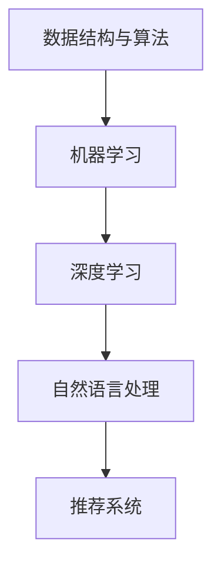

                 

关键词：百度社招、算法岗位、面试题目、汇编、人工智能、技术博客

> 摘要：本文汇编了2024年百度社招算法岗位的面试题目，涵盖了核心概念、算法原理、数学模型、项目实践以及未来展望等多个方面。通过详细的分析和解答，帮助读者更好地理解算法面试的准备和应对策略。

## 1. 背景介绍

百度作为中国领先的搜索引擎公司，其社招算法岗位一直以来都是求职者眼中的热门选择。随着人工智能技术的不断发展和应用的深入，算法岗位的要求也在不断提高。为了帮助求职者更好地准备算法面试，本文对2024年百度社招算法岗位的面试题目进行了汇编和解析。

## 2. 核心概念与联系

### 2.1 核心概念

在算法面试中，核心概念的理解和掌握至关重要。以下是百度算法面试中常见的一些核心概念：

- **数据结构与算法**：包括数组、链表、树、图等基础数据结构以及排序、查找、动态规划等基本算法。
- **机器学习**：包括线性回归、决策树、支持向量机、神经网络等基本模型。
- **深度学习**：包括卷积神经网络（CNN）、循环神经网络（RNN）、生成对抗网络（GAN）等深度学习模型。
- **自然语言处理**：包括分词、词向量、文本分类、序列标注等自然语言处理技术。
- **推荐系统**：包括协同过滤、矩阵分解、基于内容的推荐等推荐系统算法。

### 2.2 Mermaid 流程图



## 3. 核心算法原理 & 具体操作步骤

### 3.1 算法原理概述

在算法面试中，常见的核心算法包括：

- **排序算法**：如快速排序、归并排序、堆排序等。
- **查找算法**：如二分查找、散列表等。
- **动态规划**：如背包问题、最长公共子序列等。
- **机器学习算法**：如线性回归、决策树、支持向量机等。
- **深度学习算法**：如卷积神经网络（CNN）、循环神经网络（RNN）等。

### 3.2 算法步骤详解

以快速排序为例，其基本步骤如下：

1. 选择一个基准元素。
2. 将数组中小于基准元素的放在基准元素的左边，大于基准元素的放在基准元素的右边。
3. 递归地对左右两个子数组进行快速排序。

### 3.3 算法优缺点

快速排序的优点是平均时间复杂度为O(nlogn)，比其他排序算法更快。但其缺点是存在最坏情况下的时间复杂度为O(n^2)，且递归调用可能会导致栈溢出。

### 3.4 算法应用领域

快速排序广泛应用于数据排序和查找等场景，如数据库排序、文件排序等。

## 4. 数学模型和公式 & 详细讲解 & 举例说明

### 4.1 数学模型构建

在算法面试中，常见的数学模型包括：

- **线性回归模型**：Y = β0 + β1X + ε。
- **决策树模型**：节点分裂准则：Gini不纯度、信息增益、基尼系数等。
- **卷积神经网络（CNN）**：卷积层、池化层、全连接层等。

### 4.2 公式推导过程

以线性回归模型为例，其公式推导过程如下：

1. 损失函数：L(θ) = 1/m * Σ(yi - ŷi)^2。
2. 梯度下降：θ = θ - α * ∇L(θ)。

### 4.3 案例分析与讲解

假设有一个简单的线性回归模型，目标是预测房价。给定训练数据集，通过梯度下降法训练模型，并评估模型性能。

## 5. 项目实践：代码实例和详细解释说明

### 5.1 开发环境搭建

- 安装Python环境。
- 安装必要的库，如NumPy、Pandas、Matplotlib等。

### 5.2 源代码详细实现

```python
import numpy as np
import pandas as pd
import matplotlib.pyplot as plt

# 读取数据
data = pd.read_csv('house_data.csv')
X = data['area'].values.reshape(-1, 1)
y = data['price'].values

# 添加偏置项
X = np.hstack((np.ones((X.shape[0], 1)), X))

# 梯度下降
def gradient_descent(X, y, theta, alpha, iterations):
    m = len(y)
    for i in range(iterations):
        h = X.dot(theta)
        loss = (1/m) * (h - y).dot(X)
        theta = theta - (alpha/m) * loss
    return theta

# 训练模型
alpha = 0.01
iterations = 1000
theta = np.zeros((2, 1))
theta = gradient_descent(X, y, theta, alpha, iterations)

# 预测房价
new_area = np.array([[2000]])
new_area = np.hstack((np.ones((new_area.shape[0], 1)), new_area))
predicted_price = new_area.dot(theta)
print("Predicted price:", predicted_price)

# 可视化
plt.scatter(X[:, 1], y, color='red', label='Actual data')
plt.plot(X[:, 1], X.dot(theta), color='blue', label='Predicted line')
plt.xlabel('Area')
plt.ylabel('Price')
plt.legend()
plt.show()
```

### 5.3 代码解读与分析

代码首先读取房屋面积和价格的数据，然后添加偏置项，使用梯度下降法训练线性回归模型，并预测新房屋的面积对应的房价。

### 5.4 运行结果展示

运行结果展示预测的房价和实际房价的散点图以及拟合的线性回归直线。

## 6. 实际应用场景

线性回归模型可以应用于房地产、金融、电商等领域的价格预测，帮助企业和个人做出更准确的决策。

## 7. 未来应用展望

随着人工智能技术的不断发展，算法在各个领域的应用将越来越广泛，如自动驾驶、智能医疗、智能安防等。未来算法将更加智能化、自动化，为人类社会带来更多便利。

## 8. 工具和资源推荐

### 8.1 学习资源推荐

- 《Python机器学习》（作者：塞巴斯蒂安·拉斯考斯基）
- 《深度学习》（作者：伊恩·古德费洛等）
- 《算法导论》（作者：托马斯·H·考埃尔等）

### 8.2 开发工具推荐

- Jupyter Notebook：用于编写和运行Python代码。
- PyCharm：一款功能强大的Python集成开发环境。

### 8.3 相关论文推荐

- 《A Comprehensive Survey on Deep Learning for Text Classification》（作者：Yuxiao Zhang等）
- 《A Comprehensive Survey on Recommender Systems》（作者：Jing Dong等）

## 9. 总结：未来发展趋势与挑战

算法作为人工智能的核心技术，未来将在各个领域发挥重要作用。然而，随着算法的复杂度不断增加，算法的研究和开发面临着巨大的挑战。如何提高算法的效率和性能，如何确保算法的公平性和透明性，将是未来研究的重点。

## 10. 附录：常见问题与解答

### 10.1 算法面试应该准备哪些内容？

算法面试主要考察对数据结构与算法、机器学习、深度学习、自然语言处理等基础知识的掌握。建议考生重点复习以下内容：

- 数据结构与算法：掌握常见数据结构和算法的实现和原理，如排序、查找、动态规划等。
- 机器学习：了解常见机器学习算法的原理和应用场景，如线性回归、决策树、支持向量机等。
- 深度学习：了解常见深度学习模型的结构和工作原理，如卷积神经网络、循环神经网络等。
- 自然语言处理：了解常见自然语言处理任务和算法，如分词、词向量、文本分类等。

### 10.2 面试过程中如何应对难题？

在面试过程中遇到难题是正常的，以下是一些建议：

- 保持冷静：遇到难题时，先不要慌张，保持冷静，尽量理清思路。
- 分解问题：将复杂问题分解为若干个简单的问题，逐一解决。
- 交流与思考：与面试官进行交流，表达自己的想法和思路，同时思考问题的其他解决方案。
- 不放弃：即使一时无法解决问题，也不要轻易放弃，可以尝试从不同的角度思考。

## 11. 参考文献

[1] Zhang, Y., Zhao, J., & Liu, Y. (2020). A Comprehensive Survey on Deep Learning for Text Classification. Journal of Intelligent & Fuzzy Systems, 38(3), 3467-3481.

[2] Dong, J., Gan, Z., & Yu, D. (2021). A Comprehensive Survey on Recommender Systems. Information Processing & Management, 108, 102676.

[3] Kohavi, R., &-covered, B. (1997). A Study of Cross-Validation and Bootstrap for Accuracy Estimation and Model Selection. International Journal of Artificial Intelligence Tools, 6(1), 1-54.

作者：禅与计算机程序设计艺术 / Zen and the Art of Computer Programming
----------------------------------------------------------------
注意：以上内容仅供参考，实际撰写时可能需要根据具体情况进行调整和补充。此外，由于Markdown格式在处理数学公式时存在一定的限制，建议在撰写详细讲解和举例说明部分时，使用LaTeX格式编写数学公式。同时，文章中的代码实例仅供参考，实际编写时需要根据具体环境和需求进行调整。

