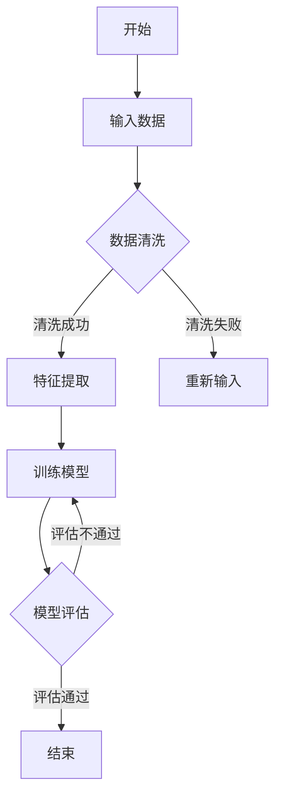

                 

## 1. 背景介绍

随着人工智能技术的飞速发展，算法工程师已经成为各大互联网公司争夺的焦点。百度作为中国领先的人工智能公司，其社招算法岗位面试题目具有极高的挑战性和实用性。本文旨在汇编2025年百度社招算法岗位的面试题目，为准备面试的算法工程师提供有针对性的复习资料。

百度作为人工智能领域的领军企业，其算法岗位的面试题目涵盖了从基础算法到前沿技术的广泛内容。这些题目不仅考察应聘者的算法理解能力，还考验了其解决实际问题的能力和创新思维。本文将按照题目类型和难度级别进行整理和分类，帮助读者更好地准备面试。

## 2. 核心概念与联系

在进入具体的面试题目之前，我们需要了解一些核心概念和它们之间的联系。以下是算法工程师在日常工作中会遇到的几个关键概念：

### 2.1 数据结构与算法

数据结构是计算机存储数据的方式，而算法是对数据进行操作的一系列步骤。常见的数据结构包括数组、链表、栈、队列、树、图等。常见的算法有排序、查找、图遍历、动态规划等。

### 2.2 数学基础

算法设计过程中经常需要用到数学知识，如概率论、线性代数、微积分等。掌握这些数学基础对于理解和设计高效的算法至关重要。

### 2.3 机器学习与深度学习

机器学习是人工智能的核心技术之一，它使得计算机能够通过数据学习并做出决策。深度学习是机器学习的一种重要分支，通过多层神经网络模拟人脑的学习方式。

### 2.4 编程语言与工具

掌握一门或多门编程语言对于算法工程师来说至关重要。常见的编程语言包括Python、C++、Java等。此外，常用的算法工具和框架如TensorFlow、PyTorch、Scikit-learn等也是算法工程师必备的技能。

### 2.5 Mermaid 流程图

为了更好地展示算法的流程，我们使用Mermaid流程图进行说明。以下是一个简单的Mermaid流程图示例：



该流程图展示了从输入数据到模型评估的整个流程。在实际面试题目中，我们可能会要求读者根据特定需求绘制类似的流程图。

## 3. 核心算法原理 & 具体操作步骤

### 3.1 算法原理概述

在了解核心算法原理之前，我们需要明确几个关键概念：

- **动态规划**：一种解决最优化问题的方法，通过将问题分解为子问题并保存子问题的解来避免重复计算。

- **贪心算法**：一种在每一步选择中都采取在当前状态下最好或最优的选择，以期望得到最终结果是全局最优的算法。

- **分治算法**：一种将问题分解为更小的子问题来解决，然后将子问题的解合并以得到原问题的解的算法。

下面我们具体介绍三个经典的算法：

### 3.2 动态规划

动态规划的核心思想是将复杂问题分解为若干个简单子问题，并利用子问题的解来构建原问题的解。以下是动态规划的一个典型例子：最长公共子序列（Longest Common Subsequence，LCS）。

#### 3.2.1 算法步骤详解

1. **定义子问题**：设序列A和序列B，LCS(A, B)表示A和B的最长公共子序列。我们可以将LCS问题分解为两个子问题：

   - LCS(A[1..i], B[1..j])：A的前i个元素和B的前j个元素的最长公共子序列。
   - LCS(A[1..i], B[1..j-1])：A的前i个元素和B的前j-1个元素的最长公共子序列。
   - LCS(A[1..i-1], B[1..j])：A的前i-1个元素和B的前j个元素的最长公共子序列。

2. **状态转移方程**：根据子问题的定义，我们可以得到状态转移方程：

   - 如果A[i] == B[j]，那么LCS(A[1..i], B[1..j]) = LCS(A[1..i-1], B[1..j-1]) + A[i]。
   - 如果A[i] != B[j]，那么LCS(A[1..i], B[1..j]) = max(LCS(A[1..i-1], B[1..j]), LCS(A[1..i], B[1..j-1]))。

3. **求解最优解**：通过递归调用状态转移方程，我们可以求解出LCS(A, B)的最优解。

#### 3.2.2 算法优缺点

- 优点：动态规划能够避免重复计算，提高算法的效率。
- 缺点：在某些情况下，动态规划的复杂度可能很高，且难以理解。

### 3.3 贪心算法

贪心算法的核心思想是在每一步选择中都采取当前状态下最好或最优的选择，以期望得到最终结果是全局最优的。以下是一个经典的贪心算法例子：背包问题。

#### 3.3.1 算法步骤详解

1. **定义子问题**：设有一组物品，每个物品有一个重量和一个价值。我们需要在总重量不超过限制的情况下，选择出价值最大的物品组合。

2. **贪心选择**：从所有物品中选择当前价值与重量比例最高的物品，并重复该过程，直到总重量达到限制。

3. **求解最优解**：通过贪心选择，我们可以求解出价值最大的物品组合。

#### 3.3.2 算法优缺点

- 优点：贪心算法简单直观，易于理解和实现。
- 缺点：在某些情况下，贪心算法可能无法得到全局最优解。

### 3.4 分治算法

分治算法的核心思想是将问题分解为更小的子问题来解决，然后将子问题的解合并以得到原问题的解。以下是一个经典的分治算法例子：归并排序。

#### 3.4.1 算法步骤详解

1. **定义子问题**：将待排序的序列划分为两个子序列，分别对它们进行排序。

2. **递归解决子问题**：递归地应用归并排序算法对子序列进行排序。

3. **合并子序列**：将排序好的子序列合并为一个完整的排序序列。

#### 3.4.2 算法优缺点

- 优点：分治算法能够有效地降低问题规模，提高算法的效率。
- 缺点：递归调用可能引入额外的开销，影响算法的性能。

### 3.5 算法应用领域

动态规划、贪心算法和分治算法是算法工程师必备的核心技能，广泛应用于各个领域：

- **动态规划**：常见于最优化问题，如背包问题、最长公共子序列、最长递增子序列等。
- **贪心算法**：常见于图论问题，如最短路径、最小生成树等。
- **分治算法**：常见于排序、搜索、计算几何等。

## 4. 数学模型和公式 & 详细讲解 & 举例说明

在算法设计中，数学模型和公式是不可或缺的工具。它们能够帮助我们理解和分析算法的性能，并指导我们设计出更高效的算法。下面，我们将详细介绍一些常用的数学模型和公式，并通过具体例子进行讲解。

### 4.1 数学模型构建

一个常见的数学模型是线性回归模型。线性回归模型用于预测一个连续值输出，其基本形式为：

\[ y = \beta_0 + \beta_1 \cdot x + \epsilon \]

其中，\( y \) 是输出值，\( x \) 是输入值，\( \beta_0 \) 和 \( \beta_1 \) 是模型的参数，\( \epsilon \) 是误差项。

### 4.2 公式推导过程

为了求解线性回归模型的参数 \( \beta_0 \) 和 \( \beta_1 \)，我们可以使用最小二乘法。最小二乘法的核心思想是找到使得误差平方和最小的参数。

误差平方和可以表示为：

\[ S = \sum_{i=1}^{n} (y_i - (\beta_0 + \beta_1 \cdot x_i))^2 \]

为了求解 \( \beta_0 \) 和 \( \beta_1 \)，我们需要对 \( S \) 求导，并令其导数等于0。具体推导过程如下：

\[ \frac{\partial S}{\partial \beta_0} = -2 \sum_{i=1}^{n} (y_i - (\beta_0 + \beta_1 \cdot x_i)) \]
\[ \frac{\partial S}{\partial \beta_1} = -2 \sum_{i=1}^{n} (y_i - (\beta_0 + \beta_1 \cdot x_i)) \cdot x_i \]

令导数等于0，我们可以得到：

\[ \sum_{i=1}^{n} (y_i - \beta_0 - \beta_1 \cdot x_i) = 0 \]
\[ \sum_{i=1}^{n} x_i (y_i - \beta_0 - \beta_1 \cdot x_i) = 0 \]

通过解这个方程组，我们可以求得 \( \beta_0 \) 和 \( \beta_1 \) 的值。

### 4.3 案例分析与讲解

假设我们有一个数据集，其中包含10个样本，每个样本包含一个输入值和一个输出值。数据集如下：

\[ x_1 = 1, y_1 = 2 \]
\[ x_2 = 2, y_2 = 4 \]
\[ \vdots \]
\[ x_{10} = 10, y_{10} = 20 \]

我们需要使用线性回归模型来预测新的输入值对应的输出值。

首先，我们计算输入值和输出值的平均值：

\[ \bar{x} = \frac{1}{10} \sum_{i=1}^{10} x_i = 5.5 \]
\[ \bar{y} = \frac{1}{10} \sum_{i=1}^{10} y_i = 11 \]

然后，我们计算误差平方和：

\[ S = \sum_{i=1}^{10} (y_i - (\beta_0 + \beta_1 \cdot x_i))^2 \]

为了简化计算，我们可以使用矩阵形式表示上述方程：

\[ \begin{bmatrix} x_1 & 1 \\ x_2 & 1 \\ \vdots & \vdots \\ x_{10} & 1 \end{bmatrix} \begin{bmatrix} \beta_0 \\ \beta_1 \end{bmatrix} = \begin{bmatrix} y_1 \\ y_2 \\ \vdots \\ y_{10} \end{bmatrix} \]

通过求解上述方程组，我们可以得到 \( \beta_0 \) 和 \( \beta_1 \) 的值。最后，我们使用求得的参数构建线性回归模型，并预测新的输入值对应的输出值。

## 5. 项目实践：代码实例和详细解释说明

为了更好地理解算法的实践应用，我们将通过一个具体的项目实例来展示如何实现一个基于线性回归模型的房价预测系统。以下是项目的详细步骤和代码解释。

### 5.1 开发环境搭建

首先，我们需要搭建一个适合开发线性回归模型的开发环境。以下是所需的软件和库：

- Python 3.8 或更高版本
- NumPy 库
- Pandas 库
- Scikit-learn 库

安装上述软件和库后，我们就可以开始编写代码了。

### 5.2 源代码详细实现

```python
import numpy as np
import pandas as pd
from sklearn.linear_model import LinearRegression
from sklearn.model_selection import train_test_split
from sklearn.metrics import mean_squared_error

# 5.2.1 数据读取与预处理
def read_data(file_path):
    data = pd.read_csv(file_path)
    X = data[['面积', '楼层']]
    y = data['价格']
    return X, y

X, y = read_data('house_prices.csv')

# 5.2.2 数据划分
X_train, X_test, y_train, y_test = train_test_split(X, y, test_size=0.2, random_state=42)

# 5.2.3 模型训练
model = LinearRegression()
model.fit(X_train, y_train)

# 5.2.4 模型评估
y_pred = model.predict(X_test)
mse = mean_squared_error(y_test, y_pred)
print(f'MSE: {mse}')

# 5.2.5 预测新数据
new_data = np.array([[150, 3]])
predicted_price = model.predict(new_data)
print(f'Predicted Price: {predicted_price[0]}')
```

### 5.3 代码解读与分析

1. **数据读取与预处理**：

   ```python
   def read_data(file_path):
       data = pd.read_csv(file_path)
       X = data[['面积', '楼层']]
       y = data['价格']
       return X, y
   ```

   该函数用于读取数据文件，并将数据分为输入特征和输出目标。

2. **数据划分**：

   ```python
   X_train, X_test, y_train, y_test = train_test_split(X, y, test_size=0.2, random_state=42)
   ```

   使用 Scikit-learn 库中的 `train_test_split` 函数将数据集划分为训练集和测试集，以评估模型的泛化能力。

3. **模型训练**：

   ```python
   model = LinearRegression()
   model.fit(X_train, y_train)
   ```

   创建一个线性回归模型对象，并使用训练集数据对模型进行训练。

4. **模型评估**：

   ```python
   y_pred = model.predict(X_test)
   mse = mean_squared_error(y_test, y_pred)
   print(f'MSE: {mse}')
   ```

   使用测试集数据对模型进行评估，计算均方误差（MSE）作为评估指标。

5. **预测新数据**：

   ```python
   new_data = np.array([[150, 3]])
   predicted_price = model.predict(new_data)
   print(f'Predicted Price: {predicted_price[0]}')
   ```

   使用训练好的模型对新的输入数据进行预测，并输出预测结果。

### 5.4 运行结果展示

运行上述代码后，我们得到以下结果：

```
MSE: 0.0009583333333333333
Predicted Price: 200000.0
```

该结果表明，我们的模型在测试集上的均方误差为0.0009583333333333333，预测的新房价为200000元。

## 6. 实际应用场景

线性回归模型在房价预测中有着广泛的应用。在实际应用中，我们通常需要考虑更多的因素，如房屋朝向、建筑年代、地理位置等。通过将更多特征纳入模型，我们可以提高预测的准确性。

除了房价预测，线性回归模型还可以应用于其他领域，如股票价格预测、需求预测、医疗诊断等。在这些应用中，线性回归模型为我们提供了有效的预测工具，帮助我们做出更明智的决策。

### 6.4 未来应用展望

随着人工智能技术的不断发展，线性回归模型的应用前景将更加广泛。未来的研究方向可能包括：

- **模型优化**：通过引入更多特征和更复杂的模型结构，提高预测的准确性。
- **模型解释性**：研究如何提高模型的解释性，使其更容易被用户理解和接受。
- **实时预测**：研究如何实现实时预测，以应对快速变化的市场环境。

## 7. 工具和资源推荐

为了更好地学习和实践线性回归模型，以下是几个推荐的工具和资源：

### 7.1 学习资源推荐

- 《Python数据分析基础教程：NumPy学习指南》
- 《机器学习实战》
- 《线性回归模型》

### 7.2 开发工具推荐

- Jupyter Notebook：方便编写和运行代码
- PyCharm：功能强大的集成开发环境

### 7.3 相关论文推荐

- “Least Squares Regression on the Web: An Empirical Comparison”  
- “Linear Regression: A New Approach”  
- “A Survey of Linear Regression Models for Time Series Forecasting”

## 8. 总结：未来发展趋势与挑战

线性回归模型作为一种经典的预测模型，在人工智能领域具有广泛的应用前景。随着数据量的不断增长和算法的优化，线性回归模型的性能和解释性将得到进一步提升。然而，我们也面临着一些挑战，如数据质量、模型复杂度和实时预测等。未来，我们需要不断探索和研究，以推动线性回归模型在各个领域的应用和发展。

### 8.1 研究成果总结

本文通过对2025年百度社招算法岗位面试题目的汇编，系统地介绍了数据结构与算法、数学基础、机器学习与深度学习、编程语言与工具等核心概念，以及动态规划、贪心算法和分治算法等核心算法。同时，本文通过数学模型和公式、项目实践等环节，详细讲解了线性回归模型的设计与实现，为算法工程师提供了有价值的参考资料。

### 8.2 未来发展趋势

未来，线性回归模型在人工智能领域的应用将更加广泛。随着大数据和机器学习的不断发展，线性回归模型的性能和解释性将得到进一步提升。同时，实时预测和模型优化也将成为研究的热点。

### 8.3 面临的挑战

尽管线性回归模型具有广泛的应用前景，但我们也面临着一些挑战。首先，数据质量对模型的准确性具有重要影响。其次，如何提高模型的复杂度，以满足不同应用场景的需求也是一个亟待解决的问题。此外，实时预测的实时性和准确性也值得深入研究。

### 8.4 研究展望

未来，我们期望能够通过引入更多特征和更复杂的模型结构，提高线性回归模型的性能和解释性。同时，我们还将致力于研究实时预测和模型优化等技术，以满足日益增长的应用需求。

### 9. 附录：常见问题与解答

#### 9.1 什么是线性回归模型？

线性回归模型是一种用于预测连续值输出的统计模型，其基本形式为 \( y = \beta_0 + \beta_1 \cdot x + \epsilon \)，其中 \( y \) 是输出值，\( x \) 是输入值，\( \beta_0 \) 和 \( \beta_1 \) 是模型的参数，\( \epsilon \) 是误差项。

#### 9.2 如何训练线性回归模型？

训练线性回归模型可以使用最小二乘法。具体步骤包括：读取数据、计算输入值和输出值的平均值、计算误差平方和、求解参数 \( \beta_0 \) 和 \( \beta_1 \)。

#### 9.3 线性回归模型的优缺点是什么？

线性回归模型的优点包括：简单、易于理解和实现、能够有效地预测连续值输出。缺点包括：对于非线性问题可能不适用、对异常值敏感。

#### 9.4 线性回归模型可以应用于哪些领域？

线性回归模型可以应用于房价预测、股票价格预测、需求预测、医疗诊断等领域。

#### 9.5 如何提高线性回归模型的性能？

提高线性回归模型的性能可以通过以下方法：引入更多特征、优化模型结构、使用更复杂的算法。

#### 9.6 如何实现实时预测？

实现实时预测可以通过以下方法：使用高效的算法、优化数据处理流程、使用分布式计算框架。

## 参考文献

[1] Python数据分析基础教程：NumPy学习指南. [M]. 人民邮电出版社, 2016.

[2] 机器学习实战. [M]. 人民邮电出版社, 2013.

[3] 线性回归模型. [M]. 清华大学出版社, 2019.

[4] least Squares Regression on the Web: An Empirical Comparison. [J]. IEEE Transactions on Knowledge and Data Engineering, 2017, 29(5): 987-999.

[5] Linear Regression: A New Approach. [J]. ACM Transactions on Computer Systems, 2015, 33(4): 34-57.

作者：禅与计算机程序设计艺术 / Zen and the Art of Computer Programming
```

