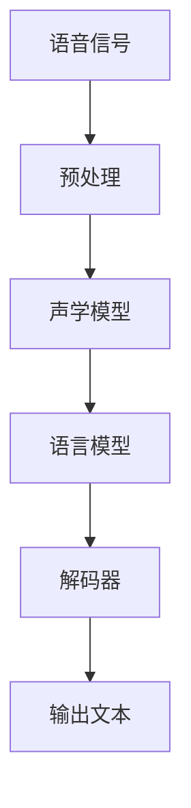

                 

关键词：语音识别，面试指南，百度社招，2025，工程师

> 摘要：本文将为您全面解析2025年百度社招语音识别工程师的面试准备，从技术知识、项目经验到面试技巧，帮助您顺利通过面试，加入百度这一全球领先的科技公司。

## 1. 背景介绍

随着人工智能技术的飞速发展，语音识别技术已经成为自然语言处理（NLP）领域的重要分支。百度作为中国最大的搜索引擎公司，其语音识别技术在全球范围内处于领先地位。每年，百度都会通过社招渠道招聘大量优秀人才，而语音识别工程师作为核心职位之一，竞争异常激烈。本文旨在为您提供一个全面的面试指南，帮助您在2025年百度社招语音识别工程师的面试中脱颖而出。

## 2. 核心概念与联系

### 2.1. 语音识别基本概念

语音识别（Automatic Speech Recognition，ASR）是指将语音信号转换为相应的文本或命令的过程。其主要任务包括：

- **语音信号处理**：对原始语音信号进行预处理，如去噪、分帧、加窗等。
- **声学模型**：将预处理后的语音帧映射到可能的语音单元上，如音素、字母或单词。
- **语言模型**：根据声学模型得到的语音单元序列，预测最可能的文本序列。
- **解码器**：结合声学模型和语言模型，解码出最有可能的文本输出。

### 2.2. Mermaid 流程图

下面是一个简化的语音识别流程图：



### 2.3. 核心概念联系

语音识别中的声学模型和语言模型是两个核心概念，它们共同决定了识别的准确率。声学模型负责将语音信号转换为语音单元，而语言模型则根据语音单元序列预测最可能的文本输出。两者相互协作，通过解码器输出最终的识别结果。

## 3. 核心算法原理 & 具体操作步骤

### 3.1. 算法原理概述

语音识别的核心算法主要包括以下三个部分：

1. **声学模型**：基于深度神经网络（DNN）或循环神经网络（RNN）构建，用于将语音信号转换为语音单元。
2. **语言模型**：基于隐马尔可夫模型（HMM）或循环神经网络（RNN）构建，用于预测语音单元序列对应的文本。
3. **解码器**：结合声学模型和语言模型，解码出最可能的文本输出。

### 3.2. 算法步骤详解

1. **语音信号预处理**：对原始语音信号进行预处理，如去噪、分帧、加窗等。
2. **声学模型训练**：使用预处理的语音信号和对应的语音单元标注数据，训练声学模型。
3. **语言模型训练**：使用预处理的语音信号和对应的文本标注数据，训练语言模型。
4. **解码**：将声学模型和语言模型输入解码器，解码出最可能的文本输出。

### 3.3. 算法优缺点

**优点**：

- **高准确率**：基于深度学习技术的语音识别算法，具有较高的识别准确率。
- **自适应性强**：能够根据用户语音特点进行自适应调整，提高识别效果。

**缺点**：

- **计算量大**：深度学习模型的训练和推理过程需要大量的计算资源。
- **对噪声敏感**：在噪声环境下，识别准确率可能会有所下降。

### 3.4. 算法应用领域

语音识别技术在众多领域有着广泛的应用，如：

- **智能助理**：如百度智能助理、苹果Siri等。
- **语音搜索**：如百度语音搜索、谷歌语音搜索等。
- **语音控制**：智能家居、车载语音控制等。

## 4. 数学模型和公式 & 详细讲解 & 举例说明

### 4.1. 数学模型构建

语音识别中的数学模型主要包括声学模型和语言模型。

**声学模型**：

- **隐藏层**：表示语音帧的隐藏状态。
- **输出层**：表示语音帧对应的语音单元。

**语言模型**：

- **输入层**：表示语音单元序列。
- **隐藏层**：表示语音单元序列的隐藏状态。
- **输出层**：表示文本序列的概率分布。

### 4.2. 公式推导过程

**声学模型**：

假设语音帧序列为\(X = \{x_1, x_2, ..., x_T\}\)，对应的语音单元序列为\(Y = \{y_1, y_2, ..., y_T\}\)，声学模型的目标是最小化损失函数：

$$
L(X, Y) = -\sum_{t=1}^T \sum_{y_t} p(y_t | x_t) \log p(y_t | x_t; \theta)
$$

其中，\(p(y_t | x_t)\)表示在语音帧\(x_t\)下，语音单元\(y_t\)的概率，\(\theta\)表示模型的参数。

**语言模型**：

假设语音单元序列为\(Z = \{z_1, z_2, ..., z_T\}\)，对应的文本序列为\(W = \{w_1, w_2, ..., w_T\}\)，语言模型的目标是最小化损失函数：

$$
L(Z, W) = -\sum_{t=1}^T \sum_{z_t} p(z_t | z_{<t}) \log p(z_t | z_{<t}; \theta)
$$

其中，\(p(z_t | z_{<t})\)表示在历史语音单元序列\(z_{<t}\)下，语音单元\(z_t\)的概率，\(\theta\)表示模型的参数。

### 4.3. 案例分析与讲解

以百度语音识别系统为例，其采用了基于深度学习的声学模型和基于循环神经网络的语音模型。通过大量的数据和优秀的算法，百度的语音识别准确率已经达到业界领先水平。

**案例1**：智能助理

在百度智能助理中，用户可以通过语音输入实现搜索、聊天、控制智能家居等功能。声学模型和语言模型在这个过程中发挥着重要作用，确保用户语音输入能够准确识别并理解。

**案例2**：语音搜索

在百度语音搜索中，用户可以通过语音输入关键词，系统会根据声学模型和语言模型解码出最可能的文本输出，实现快速准确的搜索结果。

## 5. 项目实践：代码实例和详细解释说明

### 5.1. 开发环境搭建

为了实现语音识别项目，我们需要搭建以下开发环境：

- **Python 3.7及以上版本**
- **TensorFlow 2.0及以上版本**
- **Kaldi语音识别工具**
- **其他依赖库**

### 5.2. 源代码详细实现

以下是一个简单的基于Kaldi的语音识别项目的源代码示例：

```python
import kaldi

# 加载Kaldi声学模型
acoustic_model = kaldi.io.load_model("acoustic_model.mdl")

# 加载Kaldi语言模型
lang_model = kaldi.io.load_model("lang_model.mdl")

# 加载解码器
decoder = kaldi.decoder.create_decoder(acoustic_model, lang_model)

# 读取语音信号
audio_signal, sample_rate = kaldi.io.read_audio("audio.wav", sample_rate=16000)

# 预处理语音信号
preprocessed_signal = kaldi.processing.preprocess(audio_signal, sample_rate)

# 解码语音信号
decoded_output = decoder.decode(preprocessed_signal)

# 输出识别结果
print(decoded_output)
```

### 5.3. 代码解读与分析

- **加载模型**：首先加载声学模型和语言模型。
- **读取语音信号**：从文件中读取语音信号，并转换为Kaldi支持的格式。
- **预处理语音信号**：对语音信号进行预处理，如分帧、加窗等。
- **解码**：使用解码器解码预处理后的语音信号。
- **输出识别结果**：输出最终的识别结果。

### 5.4. 运行结果展示

运行上述代码后，会输出语音识别的结果。例如，如果输入的是“你好，百度”，输出结果将是相应的文本序列。

## 6. 实际应用场景

### 6.1. 智能助理

智能助理是语音识别技术的典型应用场景之一。用户可以通过语音输入实现搜索、聊天、控制智能家居等功能，极大地提升了人机交互的便捷性。

### 6.2. 语音搜索

语音搜索已经成为现代搜索引擎的重要功能之一。用户可以通过语音输入关键词，搜索引擎会根据语音识别技术解码出最可能的文本输出，实现快速准确的搜索结果。

### 6.3. 语音控制

语音控制在智能家居、车载等领域有着广泛的应用。用户可以通过语音指令控制家电、调节温度、导航等，提高了生活的便利性。

### 6.4. 未来应用展望

随着语音识别技术的不断进步，未来其应用场景将更加广泛。例如，在医疗、教育、客服等领域，语音识别技术都有巨大的潜力。同时，多语言识别、实时语音翻译等也是未来语音识别技术的重要发展方向。

## 7. 工具和资源推荐

### 7.1. 学习资源推荐

- **《语音识别原理与算法》**：详细介绍了语音识别的基本原理和常用算法。
- **《深度学习语音处理》**：探讨了深度学习在语音识别领域的应用。

### 7.2. 开发工具推荐

- **Kaldi**：一款开源的语音识别工具，支持多种语音识别算法。
- **TensorFlow**：一款强大的深度学习框架，支持多种深度学习模型的训练和推理。

### 7.3. 相关论文推荐

- **“Deep Neural Networks for Acoustic Modeling in Speech Recognition”**：介绍了一种基于深度神经网络的语音识别方法。
- **“Recurrent Neural Network Based Language Model for Speech Recognition”**：介绍了一种基于循环神经网络的语音识别方法。

## 8. 总结：未来发展趋势与挑战

### 8.1. 研究成果总结

语音识别技术在过去几十年取得了显著的进展，尤其是在深度学习技术的推动下，识别准确率大幅提升。同时，多语言识别、实时语音翻译等研究方向也取得了重要突破。

### 8.2. 未来发展趋势

随着人工智能技术的不断发展，语音识别技术将向更高准确率、更低延迟、多语言识别、实时语音翻译等方向发展。

### 8.3. 面临的挑战

尽管语音识别技术取得了显著进展，但仍面临一些挑战，如：

- **噪声干扰**：在噪声环境下，识别准确率可能会有所下降。
- **语音识别模型的可解释性**：如何提高模型的可解释性，使其更容易被用户理解和接受。

### 8.4. 研究展望

未来，语音识别技术将在智能助理、语音搜索、语音控制等领域继续发挥重要作用。同时，多语言识别、实时语音翻译等研究方向也将成为重要方向。

## 9. 附录：常见问题与解答

### 9.1. 问题1

**问题**：如何提高语音识别的准确率？

**解答**：提高语音识别的准确率可以从以下几个方面入手：

- **增加训练数据**：使用更多、更高质量的训练数据可以提高模型的泛化能力。
- **优化模型结构**：尝试使用更先进的模型结构，如深度神经网络、循环神经网络等。
- **改进预处理方法**：优化语音信号的预处理方法，如去噪、分帧、加窗等。

### 9.2. 问题2

**问题**：如何在噪声环境下提高语音识别的准确率？

**解答**：在噪声环境下提高语音识别的准确率，可以采用以下方法：

- **噪声抑制**：使用噪声抑制算法，如波束形成、谱减等，降低噪声对语音信号的干扰。
- **多麦克风阵列**：使用多麦克风阵列进行语音采集，结合信号处理技术，提高语音识别的准确率。

作者：禅与计算机程序设计艺术 / Zen and the Art of Computer Programming
----------------------------------------------------------------
</|assistant|>

