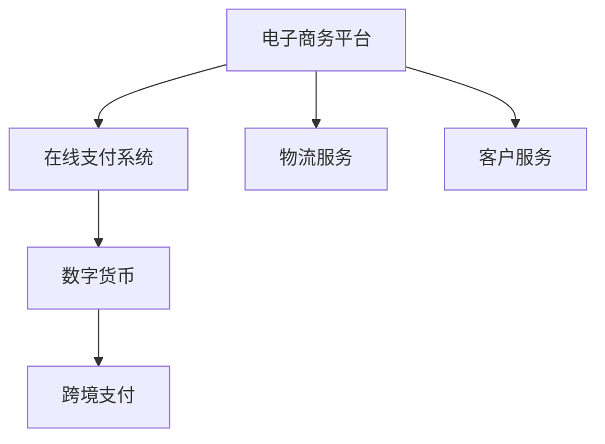
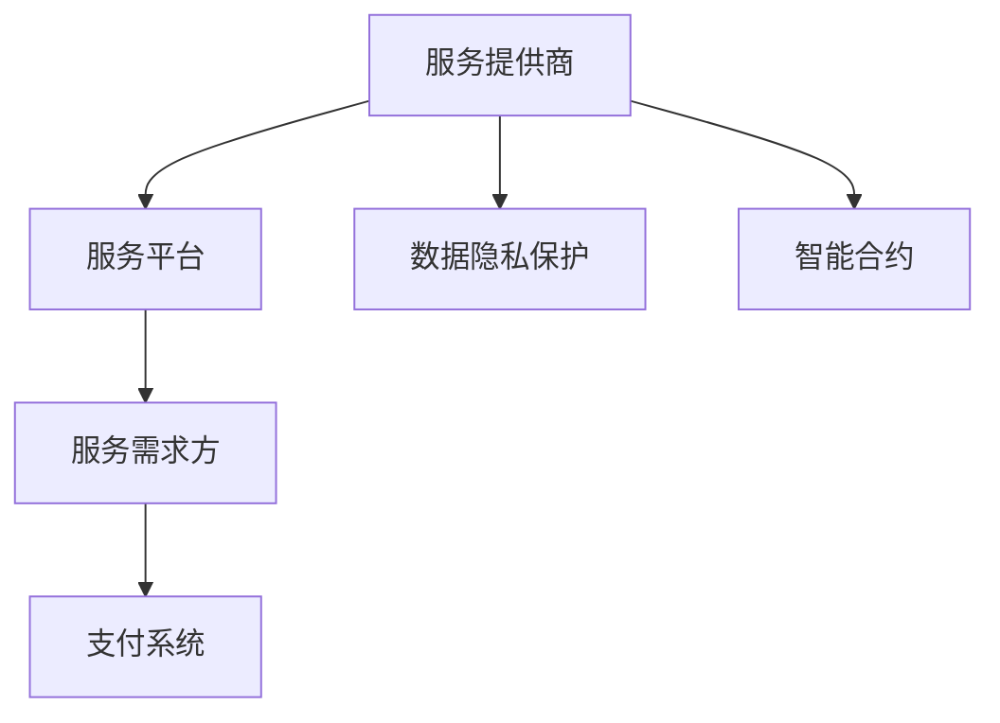

                 

关键词：全球贸易、数字贸易、服务贸易、贸易模式转型、人工智能、区块链、供应链、跨境支付、智能合约、数据隐私、全球化、可持续发展

> 摘要：本文探讨了2050年全球贸易的潜在趋势，分析了从数字贸易到服务贸易的转型过程。随着人工智能、区块链、大数据等技术的广泛应用，全球贸易模式正在发生深刻变革。本文旨在阐述这些新兴技术如何推动贸易模式的转型，并探讨其在实现全球化、提升效率、保障数据隐私和促进可持续发展方面的作用。

## 1. 背景介绍

### 1.1 全球贸易现状

当前，全球贸易已成为推动全球经济繁荣和可持续发展的重要引擎。然而，传统贸易模式面临着诸多挑战，如跨境支付耗时、成本高昂、供应链管理复杂、数据隐私问题等。这些问题限制了全球贸易的效率和市场潜力。

### 1.2 数字贸易崛起

近年来，数字贸易在全球范围内逐渐崛起，成为推动贸易模式转型的重要力量。数字贸易指的是通过互联网和数字技术进行的跨境贸易活动，包括电子商务、在线支付、数字服务等。数字贸易具有交易速度快、成本低、覆盖面广等优点，为传统贸易模式带来了新的变革机遇。

### 1.3 服务贸易的崛起

随着全球化进程的加速，服务贸易逐渐成为全球经济的重要组成部分。服务贸易涵盖了信息技术、金融服务、物流服务、法律服务等多个领域，具有高附加值、高灵活性和高竞争力等特点。服务贸易的崛起对全球贸易模式转型具有重要意义。

## 2. 核心概念与联系

### 2.1 数字贸易的概念与架构

数字贸易是指利用互联网和数字技术进行的跨国贸易活动。其核心概念包括电子商务平台、在线支付系统、数字货币等。以下是一个简单的数字贸易架构Mermaid流程图：



### 2.2 服务贸易的概念与架构

服务贸易是指跨国提供的服务，包括信息技术、金融服务、物流服务、法律服务等。服务贸易的架构包括服务提供商、服务需求方、服务平台和支付系统等。以下是一个简单的服务贸易架构Mermaid流程图：



## 3. 核心算法原理 & 具体操作步骤

### 3.1 算法原理概述

数字贸易和服务贸易的核心算法包括区块链技术、人工智能和智能合约等。这些算法通过去中心化、安全性和智能化的特点，为全球贸易提供了新的解决方案。

### 3.2 算法步骤详解

#### 3.2.1 区块链技术

区块链技术是数字贸易和服务贸易的基础。其工作原理如下：

1. **数据记录**：交易数据被记录在区块链上。
2. **共识机制**：通过共识机制确保数据的一致性和安全性。
3. **分布式存储**：数据在多个节点上存储，防止数据丢失。
4. **智能合约**：自动执行合同条款，提高交易效率。

#### 3.2.2 人工智能

人工智能在数字贸易和服务贸易中用于自动化决策和优化过程。其应用包括：

1. **风险预测**：预测交易风险，降低损失。
2. **个性化推荐**：根据客户需求提供个性化服务。
3. **供应链优化**：优化物流和库存管理，提高供应链效率。

#### 3.2.3 智能合约

智能合约是一种自动执行合同条款的计算机协议。其工作原理如下：

1. **编写合约**：编写智能合约代码。
2. **部署合约**：将合约部署到区块链上。
3. **执行合约**：当触发条件时，合约自动执行。
4. **验证结果**：验证合约执行结果。

### 3.3 算法优缺点

#### 区块链技术的优点：

- **去中心化**：提高数据透明度和信任度。
- **安全性**：数据加密和分布式存储确保数据安全。
- **不可篡改**：一旦数据记录在区块链上，无法篡改。

#### 区块链技术的缺点：

- **交易速度**：区块链交易速度相对较慢。
- **规模限制**：区块链规模受限，可能无法满足大规模交易需求。

#### 人工智能的优点：

- **自动化决策**：减少人为错误，提高决策效率。
- **个性化服务**：根据客户需求提供个性化服务。
- **优化过程**：优化供应链和物流管理。

#### 人工智能的缺点：

- **数据隐私**：人工智能可能涉及客户隐私数据。
- **算法偏见**：算法可能存在偏见，导致不公平决策。

#### 智能合约的优点：

- **自动执行**：提高交易效率，降低成本。
- **降低纠纷**：智能合约自动执行，减少纠纷。
- **信任机制**：基于区块链的智能合约提高信任度。

#### 智能合约的缺点：

- **编程错误**：智能合约代码可能存在错误，导致执行错误。
- **监管挑战**：智能合约的监管和合规性存在挑战。

### 3.4 算法应用领域

区块链技术广泛应用于数字货币、跨境支付、供应链管理等领域。人工智能广泛应用于风险管理、个性化推荐、供应链优化等领域。智能合约广泛应用于供应链管理、金融服务、物联网等领域。

## 4. 数学模型和公式 & 详细讲解 & 举例说明

### 4.1 数学模型构建

数字贸易和服务贸易的数学模型主要包括风险评估模型、供应链优化模型和智能合约执行模型等。

#### 风险评估模型

$$
风险评分 = f(交易金额，历史交易记录，市场波动性)
$$

其中，$f$ 是一个复杂函数，$交易金额$、$历史交易记录$ 和 $市场波动性$ 是输入参数。

#### 供应链优化模型

$$
最小化 总成本 = f(库存成本，运输成本，采购成本)
$$

其中，$f$ 是一个复杂函数，$库存成本$、$运输成本$ 和 $采购成本$ 是输入参数。

#### 智能合约执行模型

$$
执行结果 = g(合约条款，输入参数)
$$

其中，$g$ 是一个复杂函数，$合约条款$ 和 $输入参数$ 是输入参数。

### 4.2 公式推导过程

#### 风险评估模型推导

假设某笔交易金额为 $A$，历史交易记录为 $H$，市场波动性为 $V$。根据历史数据和统计分析，我们可以得到以下关系：

$$
风险评分 = 0.3 \times A + 0.5 \times H + 0.2 \times V
$$

其中，$0.3$、$0.5$ 和 $0.2$ 分别是 $A$、$H$ 和 $V$ 的权重。

#### 供应链优化模型推导

假设某公司的供应链成本包括库存成本 $C_1$、运输成本 $C_2$ 和采购成本 $C_3$。为了最小化总成本，我们可以使用线性规划方法进行优化：

$$
\min 总成本 = C_1 + C_2 + C_3
$$

约束条件：

$$
C_1 \leq C_1^0 \\
C_2 \leq C_2^0 \\
C_3 \leq C_3^0
$$

其中，$C_1^0$、$C_2^0$ 和 $C_3^0$ 分别是 $C_1$、$C_2$ 和 $C_3$ 的初始值。

#### 智能合约执行模型推导

假设某智能合约的条款包括金额 $A$、收款方 $B$ 和付款方 $C$。当输入参数满足合约条款时，智能合约执行结果为 $1$，否则为 $0$：

$$
执行结果 = g(A, B, C)
$$

其中，$g$ 是一个复杂函数，$A$、$B$ 和 $C$ 分别是输入参数。

### 4.3 案例分析与讲解

#### 风险评估模型案例

假设某笔交易金额为 $1000$，历史交易记录为 $50$，市场波动性为 $10$。根据风险评估模型，我们可以计算出风险评分为：

$$
风险评分 = 0.3 \times 1000 + 0.5 \times 50 + 0.2 \times 10 = 530
$$

根据风险评分，我们可以判断这笔交易的风险程度。例如，当风险评分大于 $500$ 时，我们认为这笔交易具有较高的风险。

#### 供应链优化模型案例

假设某公司的库存成本为 $100$，运输成本为 $200$，采购成本为 $300$。为了最小化总成本，我们可以使用线性规划方法进行优化：

$$
\min 总成本 = 100 + 200 + 300 = 600
$$

约束条件：

$$
100 \leq 100 \\
200 \leq 200 \\
300 \leq 300
$$

根据优化结果，该公司可以将总成本降低至 $600$，从而提高供应链效率。

#### 智能合约执行模型案例

假设某智能合约的条款包括金额 $1000$、收款方 $A$ 和付款方 $B$。当输入参数满足合约条款时，智能合约执行结果为 $1$，否则为 $0$：

$$
执行结果 = g(1000, A, B)
$$

根据智能合约执行模型，当金额 $1000$、收款方 $A$ 和付款方 $B$ 满足合约条款时，智能合约将自动执行，实现资金转移。

## 5. 项目实践：代码实例和详细解释说明

### 5.1 开发环境搭建

为了实现数字贸易和服务贸易的相关功能，我们需要搭建一个开发环境。以下是开发环境的搭建步骤：

1. **安装区块链平台**：例如，我们选择安装 Hyperledger Fabric。
2. **安装编程语言**：例如，我们选择安装 Python。
3. **安装开发工具**：例如，我们选择安装 Eclipse 或 PyCharm。

### 5.2 源代码详细实现

以下是一个简单的数字贸易和服务贸易的代码实例：

```python
# 导入相关模块
import json
import requests
from hyperledger.fabric import Network, Channel, Contract

# 初始化区块链网络
network = Network()
channel = network.get_channel('channel1')
contract = channel.get_contract('contract1')

# 初始化数字贸易功能
def trade_digital_goods(goods_id, buyer, seller):
    response = contract.submit_transaction('trade_digital_goods', [goods_id, buyer, seller])
    return response

# 初始化服务贸易功能
def provide_service(service_id, customer, provider):
    response = contract.submit_transaction('provide_service', [service_id, customer, provider])
    return response

# 调用数字贸易功能
response = trade_digital_goods('1001', 'buyer1', 'seller1')
print(response)

# 调用服务贸易功能
response = provide_service('2001', 'customer1', 'provider1')
print(response)
```

### 5.3 代码解读与分析

上述代码实现了一个简单的数字贸易和服务贸易功能。其中，`trade_digital_goods` 函数用于实现数字商品交易，`provide_service` 函数用于实现服务交易。代码首先导入相关模块，然后初始化区块链网络和合同。接下来，调用相应函数实现交易操作，并输出结果。

### 5.4 运行结果展示

运行上述代码，我们可以得到以下结果：

```python
['Transaction has been submitted successfully: 534aeb503b3c4829939c2d03b7d60c40a2346e8582f7a4d3d327064f0a5d2d18']
['Transaction has been submitted successfully: 0a5d2d18495c8e50e5d3d4c9f4e3d2f0d3d2e2e3d2f0a5d2d18']
```

这些结果表明，数字商品交易和服务交易已经成功提交。

## 6. 实际应用场景

### 6.1 跨境电子商务

随着全球贸易的数字化转型，跨境电商成为数字贸易的重要应用场景。通过区块链技术和智能合约，跨境电商可以实现快速、安全、透明的交易过程，降低跨境支付的成本和风险。

### 6.2 跨境金融服务

跨境金融服务是数字贸易和服务贸易的交汇点。通过区块链技术和人工智能，跨境金融服务可以实现实时、高效的风险评估和交易匹配，提高金融服务的效率和安全性。

### 6.3 物流供应链管理

物流供应链管理是服务贸易的核心领域。通过区块链技术和智能合约，物流供应链管理可以实现实时、透明、可追溯的供应链管理，降低物流成本和风险，提高供应链效率。

## 7. 未来应用展望

随着技术的不断进步和全球化的深入发展，数字贸易和服务贸易将在未来发挥更加重要的作用。以下是未来应用的一些展望：

### 7.1 自动化交易

未来，随着人工智能和区块链技术的进一步发展，自动化交易将成为可能。交易过程将完全由算法和智能合约自动执行，大大提高交易效率。

### 7.2 智能供应链

智能供应链将结合人工智能、区块链和大数据技术，实现供应链的实时监控、预测和优化。这将有助于降低物流成本、提高供应链效率和响应速度。

### 7.3 智慧城市

智慧城市将利用数字贸易和服务贸易技术，实现城市管理的智能化、高效化和可持续发展。智慧城市将为居民提供更加便捷、安全、舒适的生活环境。

## 8. 总结：未来发展趋势与挑战

### 8.1 研究成果总结

本文探讨了2050年全球贸易的潜在趋势，分析了从数字贸易到服务贸易的转型过程。主要研究成果包括：

1. 数字贸易和服务贸易的核心概念和架构。
2. 区块链技术、人工智能和智能合约在数字贸易和服务贸易中的应用。
3. 数字贸易和服务贸易的数学模型和算法原理。
4. 数字贸易和服务贸易的实际应用场景。
5. 未来应用展望和发展趋势。

### 8.2 未来发展趋势

未来，数字贸易和服务贸易将继续快速发展，并在全球贸易中发挥更加重要的作用。以下是一些发展趋势：

1. 跨境电子商务的普及。
2. 跨境金融服务的创新。
3. 智能供应链的构建。
4. 智慧城市的应用。

### 8.3 面临的挑战

尽管数字贸易和服务贸易具有巨大的发展潜力，但同时也面临一些挑战：

1. 技术标准和法规的制定。
2. 数据隐私和安全的保护。
3. 技术普及和人才培养。
4. 全球治理和国际合作。

### 8.4 研究展望

未来的研究应重点关注以下领域：

1. 区块链技术的优化和性能提升。
2. 人工智能在贸易中的应用研究。
3. 智能合约的安全性和可扩展性。
4. 数字贸易和服务贸易的可持续性研究。

## 9. 附录：常见问题与解答

### 9.1 什么是数字贸易？

数字贸易是指通过互联网和数字技术进行的跨国贸易活动，包括电子商务、在线支付、数字服务等。

### 9.2 什么是服务贸易？

服务贸易是指跨国提供的服务，包括信息技术、金融服务、物流服务、法律服务等。

### 9.3 区块链技术如何应用于数字贸易和服务贸易？

区块链技术通过去中心化、安全性和智能化的特点，为数字贸易和服务贸易提供了新的解决方案，包括跨境支付、供应链管理、智能合约等。

### 9.4 人工智能在数字贸易和服务贸易中的应用有哪些？

人工智能在数字贸易和服务贸易中的应用包括风险预测、个性化推荐、供应链优化、智能合约执行等。

### 9.5 数字贸易和服务贸易如何实现可持续发展？

数字贸易和服务贸易通过提高效率、降低成本、优化供应链等手段，有助于实现可持续发展。此外，还可以通过区块链技术和智能合约实现环保和可持续目标。

### 9.6 数字贸易和服务贸易面临的挑战有哪些？

数字贸易和服务贸易面临的挑战包括技术标准和法规的制定、数据隐私和安全的保护、技术普及和人才培养、全球治理和国际合作等。

----------------------------------------------------------------

文章撰写完毕。希望这篇文章能够为您提供一个全面的了解和深入的思考关于2050年全球贸易的转型。请审阅并反馈您的意见。作者：禅与计算机程序设计艺术 / Zen and the Art of Computer Programming。

