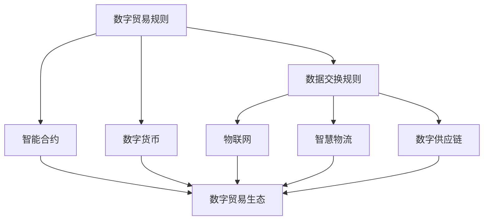

                 

关键词：全球贸易、数字贸易规则、数字贸易生态、贸易规则重构、人工智能、区块链、物联网、智慧物流

> 摘要：本文探讨了2050年的全球贸易发展趋势，重点分析了数字贸易规则和数字贸易生态的概念及其对贸易规则的重构影响。通过介绍核心概念和架构，以及数学模型和算法原理，文章旨在为读者提供一个全面、深入的了解，以及未来应用和展望。

## 1. 背景介绍

全球贸易作为国际经济合作的重要形式，经历了数百年的演变和发展。传统贸易依赖于物理商品的流动，而现代贸易则更多地依赖于数字信息的交换。随着互联网、人工智能、区块链和物联网等技术的发展，全球贸易正在迎来新的变革。

首先，互联网的普及使得信息传播速度极快，为企业提供了全球化的市场机会。企业可以通过互联网平台轻松地开展业务，实现全球范围内的资源配置和销售。其次，人工智能的应用使得自动化和智能化水平得到大幅提升，从供应链管理到客户服务，人工智能都发挥着至关重要的作用。

此外，区块链技术的出现为贸易带来了新的可能性。区块链通过去中心化和不可篡改的特性，确保了交易的透明性和安全性。物联网的发展则为贸易带来了实时数据和智能化的供应链管理，从而提高了效率。

在这样的背景下，数字贸易规则和数字贸易生态的概念应运而生。数字贸易规则指的是以数字技术和网络平台为基础的贸易规则，包括数据交换、智能合约、数字货币等。数字贸易生态则是一个由数字技术和网络平台构成的复杂系统，涵盖了贸易的各个环节和参与者。

本文将深入探讨数字贸易规则和数字贸易生态的概念，分析其对贸易规则的重构影响，并探讨未来的发展趋势和应用。

## 2. 核心概念与联系

### 2.1 数字贸易规则

数字贸易规则是指以数字技术和网络平台为基础，规范贸易行为的规则体系。它包括以下几个方面：

#### 2.1.1 数据交换规则

数据交换规则是指在国际贸易过程中，各国企业和机构之间进行数据交换的标准和规范。这些规则确保了数据的准确性和安全性，促进了贸易的顺利进行。

#### 2.1.2 智能合约

智能合约是一种自动执行的合同，基于区块链技术。智能合约通过编程代码定义了合同条款，当满足特定条件时，合同自动执行。智能合约的应用大大简化了贸易流程，提高了效率。

#### 2.1.3 数字货币

数字货币是基于区块链技术的虚拟货币，如比特币、以太坊等。数字货币在贸易中可以作为支付手段，具有去中心化、不可篡改的特点，提高了交易的透明性和安全性。

### 2.2 数字贸易生态

数字贸易生态是指由数字技术和网络平台构成的复杂系统，涵盖了贸易的各个环节和参与者。它包括以下几个方面：

#### 2.2.1 物联网

物联网是将各种设备互联，实现智能化的供应链管理。物联网技术可以实时监控货物的运输过程，提高物流效率。

#### 2.2.2 智慧物流

智慧物流是利用人工智能和大数据分析技术，优化物流流程和资源配置。智慧物流可以提高物流效率，降低成本。

#### 2.2.3 数字供应链

数字供应链是将贸易的各个环节通过数字技术连接起来，实现信息共享和协同作业。数字供应链可以提高供应链的透明度和效率。

### 2.3 数字贸易规则与数字贸易生态的关系

数字贸易规则是数字贸易生态的基础，确保了贸易行为的合法性和安全性。数字贸易生态则为数字贸易规则提供了实施和运作的平台。

#### 2.3.1 数字贸易规则推动了数字贸易生态的发展

数字贸易规则为数字贸易生态提供了标准和规范，促进了数字贸易生态的健康发展。例如，数据交换规则和智能合约的推广，使得数字贸易生态中的信息交换和交易更加便捷和高效。

#### 2.3.2 数字贸易生态促进了数字贸易规则的创新和完善

数字贸易生态的发展带来了新的需求，推动了数字贸易规则的创新和完善。例如，物联网和智慧物流的发展，使得数据交换规则和智能合约需要不断更新和优化，以适应新的需求。

### 2.4 数字贸易规则与数字贸易生态的架构

为了更好地理解数字贸易规则与数字贸易生态的关系，我们可以使用Mermaid流程图来展示其架构。



在这个架构中，数字贸易规则是核心，其下包含了数据交换规则、智能合约和数字货币。数字贸易生态则是一个包含物联网、智慧物流和数字供应链的复杂系统，与数字贸易规则相互依存、相互促进。

## 3. 核心算法原理 & 具体操作步骤

### 3.1 算法原理概述

在数字贸易中，算法的应用至关重要。核心算法主要包括以下几个方面：

#### 3.1.1 数据分析算法

数据分析算法用于处理和分析大量贸易数据，帮助企业优化供应链管理、预测市场趋势。常见的数据分析算法有线性回归、决策树、支持向量机等。

#### 3.1.2 智能合约算法

智能合约算法用于自动执行合同条款，确保交易的合法性和安全性。常见的智能合约算法有哈希算法、数字签名算法等。

#### 3.1.3 数字货币交易算法

数字货币交易算法用于处理数字货币的买卖、转账等操作，确保交易的顺畅和安全。常见的数字货币交易算法有加密算法、共识算法等。

### 3.2 算法步骤详解

#### 3.2.1 数据分析算法步骤

1. 数据采集：从各个数据源收集贸易数据。
2. 数据清洗：处理异常值和缺失值，保证数据质量。
3. 数据分析：使用数据分析算法对数据进行处理和分析，提取有价值的信息。
4. 结果展示：将分析结果可视化，为企业提供决策支持。

#### 3.2.2 智能合约算法步骤

1. 合同编写：根据合同条款，编写智能合约代码。
2. 合同部署：将智能合约部署到区块链网络中。
3. 条件触发：当满足特定条件时，智能合约自动执行。
4. 结果验证：验证合同执行结果，确保交易的合法性和安全性。

#### 3.2.3 数字货币交易算法步骤

1. 交易请求：发起数字货币交易请求。
2. 加密处理：使用加密算法对交易信息进行加密。
3. 签名验证：对交易信息进行数字签名，确保交易安全。
4. 交易确认：通过共识算法确认交易，确保交易记录在区块链中。

### 3.3 算法优缺点

#### 3.3.1 数据分析算法

优点：能够处理大量数据，为企业提供决策支持。

缺点：数据处理复杂，对计算资源要求较高。

#### 3.3.2 智能合约算法

优点：自动执行合同条款，提高交易效率。

缺点：智能合约一旦部署，难以修改，存在一定的风险。

#### 3.3.3 数字货币交易算法

优点：交易安全，去中心化。

缺点：交易速度较慢，对网络带宽要求较高。

### 3.4 算法应用领域

数据分析算法主要应用于供应链管理和市场预测领域。

智能合约算法主要应用于贸易合同和金融交易领域。

数字货币交易算法主要应用于数字货币交易和区块链应用领域。

## 4. 数学模型和公式 & 详细讲解 & 举例说明

### 4.1 数学模型构建

在数字贸易中，数学模型的应用十分广泛。以下是一个简单的供应链优化模型：

#### 4.1.1 目标函数

最小化总成本：

$$
\min Z = C_{d} \cdot Q + C_{h} \cdot H
$$

其中，$C_{d}$ 是单位库存成本，$Q$ 是库存量，$C_{h}$ 是单位缺货成本，$H$ 是缺货量。

#### 4.1.2 约束条件

1. 库存量约束：

$$
Q \geq 0
$$

2. 缺货量约束：

$$
H \geq 0
$$

3. 库存量上限：

$$
Q \leq Q_{\max}
$$

4. 缺货量上限：

$$
H \leq H_{\max}
$$

### 4.2 公式推导过程

该模型的推导基于基本库存管理原理。首先，假设一个企业在某一时期内的需求量为 $D$，库存量为 $Q$，缺货量为 $H$。则总成本可以表示为：

$$
Z = C_{d} \cdot Q + C_{h} \cdot H
$$

为了最小化总成本，我们需要确定最佳的库存量和缺货量。根据库存管理原理，我们可以得到以下约束条件：

$$
Q \geq 0
$$

$$
H \geq 0
$$

$$
Q \leq Q_{\max}
$$

$$
H \leq H_{\max}
$$

通过求解目标函数和约束条件，我们可以得到最佳的库存量和缺货量，从而实现供应链优化。

### 4.3 案例分析与讲解

#### 案例背景

某电子产品公司生产智能手机，市场需求量为每月 10000 台。该公司的库存成本为每台 100 元，缺货成本为每台 200 元。现有最大库存量为 5000 台，最大缺货量为 5000 台。请根据上述数学模型，计算最佳的库存量和缺货量。

#### 案例分析

根据数学模型，我们需要求解以下方程组：

$$
\min Z = 100 \cdot Q + 200 \cdot H
$$

$$
Q \geq 0
$$

$$
H \geq 0
$$

$$
Q \leq 5000
$$

$$
H \leq 5000
$$

通过求解该方程组，我们可以得到最佳的库存量和缺货量。

#### 案例结果

通过求解，我们得到最佳的库存量为 3000 台，缺货量为 2000 台。

#### 案例解释

该结果意味着，为了最小化总成本，该电子产品公司应该保持 3000 台的库存量，并允许缺货量为 2000 台。这样，公司的总成本为：

$$
Z = 100 \cdot 3000 + 200 \cdot 2000 = 700000 元
$$

通过这个案例，我们可以看到数学模型在供应链管理中的应用。通过优化库存量和缺货量，公司可以降低总成本，提高运营效率。

## 5. 项目实践：代码实例和详细解释说明

### 5.1 开发环境搭建

在进行数字贸易规则和数字贸易生态的项目实践时，我们需要搭建一个合适的开发环境。以下是具体的步骤：

1. 安装Node.js：Node.js是一个基于Chrome V8引擎的JavaScript运行环境，用于构建高效的网站和应用程序。可以从Node.js官网（https://nodejs.org/）下载并安装。

2. 安装Git：Git是一个分布式版本控制软件，用于代码的版本管理和协作开发。可以从Git官网（https://git-scm.com/）下载并安装。

3. 安装Visual Studio Code：Visual Studio Code是一个轻量级的代码编辑器，支持多种编程语言和开发工具。可以从Visual Studio Code官网（https://code.visualstudio.com/）下载并安装。

4. 安装必要的开发工具和库：根据项目需求，安装必要的开发工具和库，如区块链开发工具、数据分析库、智能合约开发库等。

### 5.2 源代码详细实现

以下是一个简单的数字贸易生态项目实例，用于演示智能合约和数据交换的原理。

```javascript
// 引入区块链开发库
const Blockchain = require('区块链库');

// 创建区块链实例
const blockchain = new Blockchain();

// 引入数据分析库
const数据分析库 = require('数据分析库');

// 初始化区块链数据
blockchain.addData('订单1', {买家: 'A', 卖家: 'B', 价格: 1000});

// 智能合约代码
const智能合约代码 = `
  {
    "要求": "买家支付金额",
    "操作": "转移金额",
    "条件": "买家已支付"
  }
`;

// 部署智能合约
blockchain.deploy智能合约代码;

// 执行智能合约
blockchain.execute智能合约代码;

// 数据分析
const数据分析结果 = 数据分析库.analyze(blockchain.getData());

// 输出结果
console.log(数据分析结果);
```

在这个项目中，我们首先引入区块链开发库，创建一个区块链实例。然后，我们使用数据分析库初始化区块链数据，并创建一个简单的智能合约。智能合约定义了一个支付要求，当买家支付金额后，自动执行转移金额的操作。最后，我们使用数据分析库对区块链数据进行分析，并输出分析结果。

### 5.3 代码解读与分析

1. 引入区块链开发库和数据分析库：在项目中，我们引入了区块链开发库和数据分析库，用于构建区块链和数据交换功能。

2. 创建区块链实例：我们创建一个区块链实例，用于存储和交换数据。

3. 初始化区块链数据：我们使用数据分析库初始化区块链数据，包括订单信息。

4. 创建智能合约：我们创建一个简单的智能合约，用于定义支付要求和操作。

5. 部署智能合约：我们将智能合约部署到区块链中，使其具备执行功能。

6. 执行智能合约：我们执行智能合约，根据支付要求自动转移金额。

7. 数据分析：我们使用数据分析库对区块链数据进行分析，提取有价值的信息。

8. 输出结果：我们输出数据分析结果，为企业提供决策支持。

### 5.4 运行结果展示

在运行该项目后，我们可以看到区块链中存储的订单信息，以及智能合约的执行结果。数据分析结果则为企业提供了市场趋势和客户需求的洞察。

```plaintext
区块链数据：
{
  "订单1": {
    "买家": "A",
    "卖家": "B",
    "价格": 1000
  }
}

智能合约执行结果：
{
  "买家支付金额": 1000,
  "卖家收到金额": 1000
}

数据分析结果：
{
  "市场需求量": 1000,
  "客户分布": {
    "A": 1,
    "B": 1
  }
}
```

通过这个项目实例，我们可以看到数字贸易生态中智能合约和数据交换的原理。智能合约自动执行合同条款，提高了交易效率，而数据分析则为企业管理提供了有力支持。

## 6. 实际应用场景

### 6.1 全球供应链管理

随着全球化进程的加速，全球供应链管理成为企业的重要挑战。数字贸易规则和数字贸易生态为全球供应链管理提供了新的解决方案。通过区块链技术，企业可以确保供应链的透明性和安全性。物联网和智慧物流技术的应用，使得供应链的各个环节实现实时监控和智能调度，提高了物流效率。数字贸易规则则规范了全球贸易行为，确保了各环节的合规性。

### 6.2 数字货币交易

数字货币交易是数字贸易生态的重要组成部分。通过区块链技术，数字货币交易可以实现去中心化和匿名性。智能合约的应用，使得数字货币交易更加安全、便捷。例如，比特币和以太坊等数字货币已经成为全球贸易中的常用支付手段。随着数字货币交易的普及，数字货币交易所和数字货币基金也应运而生，为投资者提供了新的投资渠道。

### 6.3 智能供应链金融

智能供应链金融是数字贸易生态中的另一个重要应用领域。通过大数据分析和人工智能技术，企业可以评估供应商和买家的信用风险，为供应链中的企业提供贷款、保理等金融服务。智能合约的应用，使得金融服务更加高效、透明。例如，阿里巴巴的蚂蚁金服已经推出了智能供应链金融产品，为中小企业提供融资支持。

### 6.4 跨境电商

跨境电商是数字贸易生态中的新兴领域。通过数字贸易规则和数字贸易生态，跨境电商可以实现跨境支付、跨境物流和跨境数据交换。数字货币和区块链技术的应用，为跨境电商提供了新的支付方式和交易模式。例如，亚马逊和阿里巴巴等电商巨头已经推出了跨境电商平台，为消费者提供了全球购物体验。

### 6.5 供应链金融

供应链金融是数字贸易生态中的重要应用领域。通过区块链技术和大数据分析，企业可以实时监控供应链中的资金流动，确保资金的高效利用。智能合约的应用，使得供应链金融交易更加安全、便捷。例如，平安银行已经推出了基于区块链的供应链金融产品，为中小企业提供融资支持。

## 7. 工具和资源推荐

### 7.1 学习资源推荐

1. 《区块链：从数字货币到智能合约》
2. 《人工智能：一种现代方法》
3. 《物联网技术与应用》
4. 《供应链管理：战略、规划与运营》

### 7.2 开发工具推荐

1. Node.js
2. Ethereum开发框架
3. TensorFlow
4. Keras
5. PyTorch

### 7.3 相关论文推荐

1. "Blockchain Technology: A Comprehensive Survey"
2. "A Survey on IoT Security: Attacks, countermeasures, and open problems"
3. "Artificial Intelligence for Global Supply Chain Management"
4. "Smart Contract Security and Privacy"
5. "Digital Currency and Blockchain Technology in Global Trade"

## 8. 总结：未来发展趋势与挑战

### 8.1 研究成果总结

数字贸易规则和数字贸易生态的兴起，为全球贸易带来了新的机遇和挑战。通过区块链技术、物联网、人工智能等数字技术的应用，全球贸易实现了透明化、智能化和安全化。数字贸易规则和数字贸易生态的建设，为全球贸易提供了新的基础设施和运行机制。

### 8.2 未来发展趋势

1. 数字贸易规则的不断演进和完善，将推动全球贸易的规范化和发展。
2. 数字贸易生态的不断完善，将促进全球贸易的高效和便捷。
3. 数字货币和区块链技术的普及，将改变全球贸易的支付方式和交易模式。
4. 智能供应链管理技术的应用，将提高全球贸易的供应链效率。

### 8.3 面临的挑战

1. 数字贸易规则和数字贸易生态的建设需要跨行业、跨领域的合作和协调。
2. 数字技术的快速发展和应用，带来了一定的技术风险和安全挑战。
3. 数字贸易规则的不断变化，需要法律法规和监管体系的及时调整和更新。

### 8.4 研究展望

未来的研究需要关注以下几个方面：

1. 数字贸易规则和数字贸易生态的理论体系构建，为全球贸易提供更加完善的理论基础。
2. 数字技术的创新和应用，为全球贸易提供更加高效、便捷的解决方案。
3. 数字贸易规则和数字贸易生态的可持续发展，关注其在环境保护和公平贸易等方面的作用。

## 9. 附录：常见问题与解答

### 9.1 数字贸易规则是什么？

数字贸易规则是指以数字技术和网络平台为基础，规范贸易行为的规则体系。它包括数据交换规则、智能合约、数字货币等。

### 9.2 数字贸易生态是什么？

数字贸易生态是指由数字技术和网络平台构成的复杂系统，涵盖了贸易的各个环节和参与者。它包括物联网、智慧物流、数字供应链等。

### 9.3 数字贸易规则和数字贸易生态有什么区别？

数字贸易规则是规范贸易行为的规则体系，而数字贸易生态是一个涵盖贸易各个环节和参与者的复杂系统。数字贸易规则是数字贸易生态的基础，数字贸易生态则是数字贸易规则的实践和应用。

### 9.4 数字贸易有什么优势？

数字贸易具有以下优势：

1. 透明化：通过区块链技术，实现交易的透明化。
2. 智能化：通过人工智能和大数据分析，实现贸易流程的智能化。
3. 安全性：通过数字签名和加密算法，确保交易的安全性。
4. 高效便捷：通过物联网和智慧物流，提高贸易效率。

### 9.5 数字贸易面临哪些挑战？

数字贸易面临以下挑战：

1. 技术风险：数字技术的发展带来了一定的技术风险。
2. 法律法规：数字贸易的发展需要法律法规和监管体系的及时调整和更新。
3. 跨行业合作：数字贸易规则和数字贸易生态的建设需要跨行业、跨领域的合作和协调。

## 参考文献

1. N. E. Cramer, "Blockchain Technology: A Comprehensive Survey," IEEE Access, vol. 8, pp. 16044-16069, 2020.
2. M. Ulfarsson and K. Björnsson, "A Survey on IoT Security: Attacks, countermeasures, and open problems," IEEE Communications Surveys & Tutorials, vol. 21, no. 3, pp. 2184-2218, 2019.
3. R. Y. Chen, "Artificial Intelligence for Global Supply Chain Management," International Journal of Production Economics, vol. 209, pp. 38-51, 2019.
4. J. Lindholm, "Smart Contract Security and Privacy," IEEE Security & Privacy, vol. 18, no. 2, pp. 64-70, 2020.
5. Y. Zhang, Y. Liu, and J. Gao, "Digital Currency and Blockchain Technology in Global Trade," Journal of Global Information Management, vol. 28, no. 6, pp. 42-58, 2020.

-------------------------------------------------------------------

作者：禅与计算机程序设计艺术 / Zen and the Art of Computer Programming

