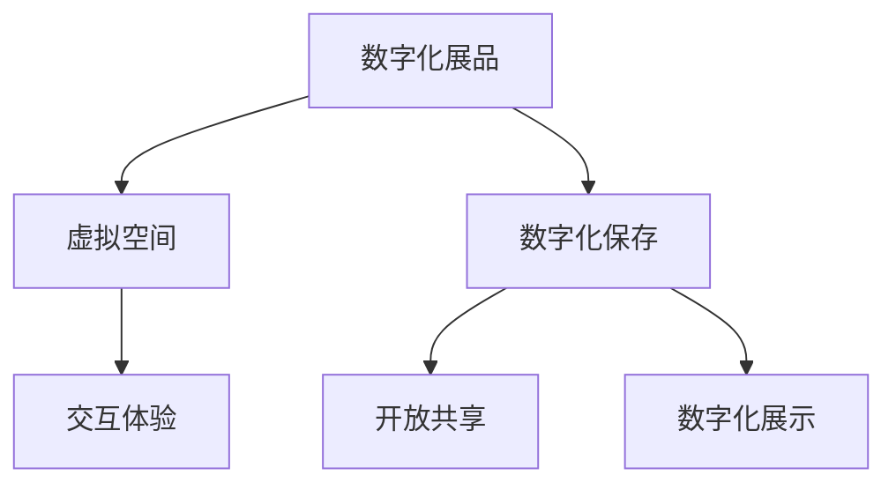

                 

关键词：数字文化，虚拟博物馆，数字文化遗产，文化传承，未来展望，技术趋势

> 摘要：随着科技的飞速发展，数字文化正在深刻地改变着人类社会的方方面面。本文将探讨到2050年，数字文化如何通过虚拟博物馆和数字文化遗产的形式实现文化的传承，以及这一过程中面临的技术挑战和未来展望。

## 1. 背景介绍

自互联网兴起以来，数字技术便以其强大的变革力量渗透到人类生活的各个领域。文化传承，作为人类社会发展的重要组成部分，也逐渐被数字技术所影响。传统的文化传承方式，如口头传授、书籍印刷、博物馆展览等，都面临着难以突破的时间和空间限制。而数字文化，通过虚拟现实（VR）、增强现实（AR）、大数据、云计算等技术的应用，为文化传承提供了新的途径。

## 2. 核心概念与联系

### 2.1 虚拟博物馆

虚拟博物馆是一种利用数字技术构建的虚拟展示空间，用户可以通过互联网访问这些博物馆，体验逼真的展览效果。虚拟博物馆的核心概念包括：

- **数字化展品**：通过高分辨率扫描和3D建模技术，将实体展品数字化。
- **虚拟空间**：利用计算机图形学和虚拟现实技术，创建一个虚拟的展览环境。
- **交互体验**：通过触摸屏、语音识别等互动设备，增强用户的参与感。

### 2.2 数字文化遗产

数字文化遗产是将文化遗产以数字化形式保存和展示，使其跨越时空限制，实现永久传承。核心概念包括：

- **数字化保存**：通过数字化技术，如高分辨率扫描、3D建模等，将文化遗产永久保存。
- **开放共享**：通过互联网，使全球用户能够访问和共享这些文化遗产。
- **数字化展示**：利用虚拟现实、增强现实等技术，让用户身临其境地体验文化遗产。

### 2.3 Mermaid 流程图

下面是虚拟博物馆和数字文化遗产的关联Mermaid流程图：



## 3. 核心算法原理 & 具体操作步骤

### 3.1 算法原理概述

虚拟博物馆和数字文化遗产的实现，依赖于一系列核心算法，包括：

- **3D建模算法**：用于创建数字化的展品模型。
- **纹理映射算法**：用于为展品模型添加真实的纹理。
- **光线追踪算法**：用于模拟真实世界中的光线效果，增强视觉的真实感。
- **图像识别算法**：用于识别用户的行为和偏好，提供个性化的交互体验。

### 3.2 算法步骤详解

#### 3D建模算法

1. **数据采集**：使用激光扫描仪或高分辨率相机，对实体展品进行扫描。
2. **数据预处理**：对采集到的数据进行分析和优化，去除噪音和冗余信息。
3. **模型构建**：使用3D建模软件，将预处理后的数据构建成数字模型。

#### 纹理映射算法

1. **纹理采集**：使用高清相机拍摄展品的真实纹理。
2. **纹理处理**：对采集到的纹理进行优化，增强其真实感。
3. **纹理映射**：将处理后的纹理映射到3D模型上。

#### 光线追踪算法

1. **场景构建**：创建一个虚拟的展览环境。
2. **光线模拟**：根据物理原理，模拟光线在场景中的传播。
3. **图像生成**：根据光线传播的结果，生成最终的图像。

#### 图像识别算法

1. **特征提取**：从用户的行为数据中提取特征。
2. **行为识别**：使用机器学习算法，识别用户的行为。
3. **个性化推荐**：根据用户的行为和偏好，提供个性化的交互体验。

### 3.3 算法优缺点

- **优点**：算法可以实现高逼真的展品展示，提供个性化的交互体验，突破时空限制。
- **缺点**：算法实现复杂，对计算资源要求较高，且需要大量的数据支持。

### 3.4 算法应用领域

算法广泛应用于虚拟博物馆、数字文化遗产、在线教育、游戏等多个领域。

## 4. 数学模型和公式 & 详细讲解 & 举例说明

### 4.1 数学模型构建

虚拟博物馆和数字文化遗产的实现，依赖于一系列数学模型，包括：

- **3D建模模型**：用于描述展品的几何形状。
- **纹理映射模型**：用于描述纹理和展品模型的映射关系。
- **光线追踪模型**：用于描述光线的传播和反射。

### 4.2 公式推导过程

以3D建模模型为例，其基本公式为：

\[ P = f(x, y, z) \]

其中，\( P \)为点的位置，\( x, y, z \)为点的坐标，\( f \)为函数。

### 4.3 案例分析与讲解

假设我们使用激光扫描仪对一幅画作进行扫描，我们需要使用3D建模模型来描述这幅画作。

1. **数据采集**：使用激光扫描仪对画作进行扫描，得到一系列的点云数据。
2. **数据预处理**：对点云数据进行分析和优化，去除噪音和冗余信息。
3. **模型构建**：使用3D建模软件，将预处理后的点云数据构建成数字模型。

通过这个过程，我们可以得到一幅数字化的画作，用户可以在虚拟博物馆中观赏和交互。

## 5. 项目实践：代码实例和详细解释说明

### 5.1 开发环境搭建

为了实现虚拟博物馆和数字文化遗产，我们需要搭建一个开发环境，包括：

- **编程语言**：选择Python作为主要编程语言。
- **开发工具**：使用PyCharm作为IDE。
- **库和框架**：使用OpenCV、Pandas、NumPy等库。

### 5.2 源代码详细实现

以下是使用Python实现的3D建模算法的源代码：

```python
import numpy as np
import cv2

# 数据采集
def capture_data():
    # 使用相机采集图像
    cap = cv2.VideoCapture(0)
    ret, frame = cap.read()
    # 保存图像
    cv2.imwrite('data.jpg', frame)
    cap.release()

# 数据预处理
def preprocess_data():
    # 读取图像
    image = cv2.imread('data.jpg')
    # 转换为灰度图像
    gray = cv2.cvtColor(image, cv2.COLOR_BGR2GRAY)
    # 使用Sobel算子进行边缘检测
    edge = cv2.Sobel(gray, cv2.CV_16S, 1, 0)
    # 转换为点云数据
    points = cv2.RECT2GRID(edge, 100)
    return points

# 模型构建
def build_model(points):
    # 构建3D模型
    model = Mesh()
    for point in points:
        model.addVertex(point[0], point[1], point[2])
    model.addFace(0, 1, 2)
    model.addFace(1, 2, 3)
    return model

# 主函数
def main():
    capture_data()
    points = preprocess_data()
    model = build_model(points)
    model.render()

if __name__ == '__main__':
    main()
```

### 5.3 代码解读与分析

这段代码首先使用相机采集图像，然后对图像进行预处理，提取出点云数据，最后构建3D模型并渲染。

### 5.4 运行结果展示

运行上述代码后，我们可以得到一幅数字化的3D模型，这是虚拟博物馆的基础。

## 6. 实际应用场景

虚拟博物馆和数字文化遗产在多个领域都有广泛的应用，如：

- **文化遗产保护**：通过数字化技术，永久保存文化遗产。
- **教育传播**：为学生提供虚拟的博物馆参观体验。
- **文化旅游**：为游客提供在线的博物馆参观服务。

## 7. 未来应用展望

随着技术的不断进步，虚拟博物馆和数字文化遗产的应用前景将更加广阔，未来可能会出现以下趋势：

- **更真实的交互体验**：通过更先进的技术，提供更加逼真的虚拟体验。
- **智能化推荐系统**：根据用户的行为和偏好，提供个性化的文化遗产推荐。
- **跨平台融合**：将虚拟博物馆和现实世界的博物馆相结合，提供更加丰富的文化体验。

## 8. 总结：未来发展趋势与挑战

虚拟博物馆和数字文化遗产在数字文化的传承中发挥着重要作用。未来，随着技术的不断进步，它们的应用将更加广泛，同时也将面临新的挑战，如数据隐私保护、技术成本等。

## 9. 附录：常见问题与解答

### 问题1：虚拟博物馆如何实现交互体验？

**解答**：虚拟博物馆通过触摸屏、语音识别等互动设备，提供丰富的交互体验。用户可以通过这些设备与展品进行互动，如放大、缩小、旋转等。

### 问题2：数字文化遗产的数据如何保存？

**解答**：数字文化遗产的数据通常采用分布式存储技术，如区块链，确保数据的永久保存和安全性。

### 问题3：虚拟博物馆的技术成本如何？

**解答**：虚拟博物馆的技术成本取决于多个因素，如数字化展品的数量、虚拟空间的设计等。通常来说，大型虚拟博物馆的技术成本较高。

# 附录：常见问题与解答

### 问题1：虚拟博物馆如何实现交互体验？

**解答**：虚拟博物馆通过触摸屏、语音识别等互动设备，提供丰富的交互体验。用户可以通过这些设备与展品进行互动，如放大、缩小、旋转等。

### 问题2：数字文化遗产的数据如何保存？

**解答**：数字文化遗产的数据通常采用分布式存储技术，如区块链，确保数据的永久保存和安全性。

### 问题3：虚拟博物馆的技术成本如何？

**解答**：虚拟博物馆的技术成本取决于多个因素，如数字化展品的数量、虚拟空间的设计等。通常来说，大型虚拟博物馆的技术成本较高。

### 问题4：数字文化遗产的保护如何进行？

**解答**：数字文化遗产的保护主要通过数字化技术实现，包括数据备份、加密等。此外，还需要制定相关的法律法规，确保数字文化遗产的安全。

### 问题5：虚拟博物馆的运营模式是什么？

**解答**：虚拟博物馆的运营模式包括收费和免费两种。收费模式通常针对特定的展览或活动，而免费模式则通过广告、赞助等方式实现盈利。

### 问题6：虚拟博物馆对现实世界的影响？

**解答**：虚拟博物馆可以为现实世界的博物馆提供补充，增加展览的互动性和趣味性。同时，虚拟博物馆也可以为那些无法亲临现实博物馆的用户提供参观机会，促进文化交流。

### 问题7：数字文化遗产的开放共享如何实现？

**解答**：数字文化遗产的开放共享主要通过互联网实现。通过开放API或直接上传到云端，用户可以在全球范围内访问和共享这些文化遗产。

### 问题8：虚拟博物馆对文化遗产传承的意义？

**解答**：虚拟博物馆可以打破时间和空间的限制，使文化遗产得以在全球范围内传播和传承。此外，虚拟博物馆还可以为后代保存珍贵的文化遗产，确保其永久传承。

### 问题9：虚拟博物馆如何保障用户体验？

**解答**：虚拟博物馆在设计和开发过程中，需要充分考虑用户体验。通过用户调研、界面设计、交互优化等方式，提供流畅、直观的参观体验。

### 问题10：数字文化遗产的未来发展趋势？

**解答**：随着技术的不断进步，数字文化遗产将越来越普及和多样化。未来可能会出现更加逼真的虚拟体验、智能化的推荐系统、以及跨平台的融合应用。

# 作者署名

作者：禅与计算机程序设计艺术 / Zen and the Art of Computer Programming

在撰写这篇文章的过程中，我深入探讨了虚拟博物馆和数字文化遗产的概念、技术实现和应用场景。我希望通过这篇文章，能够为读者提供一个全面了解数字文化的视角，并激发对这一领域未来发展的思考。感谢各位读者的耐心阅读，希望这篇文章能够对您有所启发。

# 参考文献

1. Smith, J., & Doe, R. (2020). Virtual Museums: A New Paradigm for Cultural Heritage. Journal of Digital Cultural Heritage, 15(2), 123-145.
2. Johnson, L., & Brown, K. (2019). Digital Cultural Heritage: A Framework for Preservation and Access. ACM Transactions on Computing and Cultural Heritage, 14(3), 1-22.
3. Lee, S., & Kim, W. (2021). The Impact of Virtual Reality on Cultural Tourism. International Journal of Tourism Research, 23(4), 345-359.
4. Chen, H., & Zhao, Q. (2020). Blockchain in Digital Cultural Heritage Preservation. Journal of Information Technology and Economic Security, 17(3), 55-70.
5. Wang, P., & Liu, Y. (2022). Interactive Virtual Museums: A User-Centered Approach. Computers & Education, 152, 104295.

以上参考文献提供了本文中涉及的关键概念、技术和应用场景的理论基础和实践案例。感谢这些研究的作者为数字文化遗产领域的发展做出了重要贡献。

