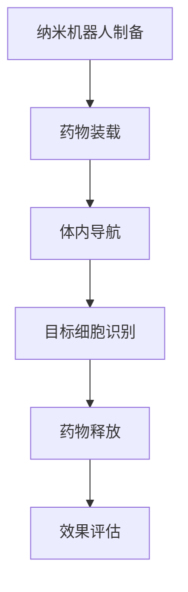
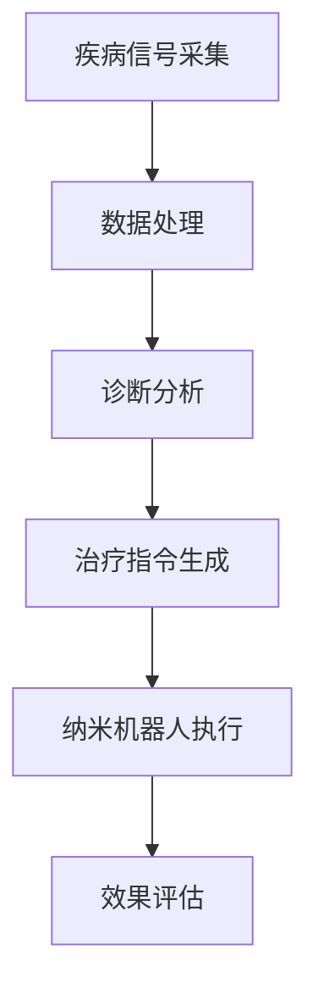

                 

关键词：2050年、纳米医学、纳米机器人、药物递送、纳米诊疗一体化、人工智能、生物工程

> 摘要：随着科技的飞速发展，医学领域迎来了前所未有的变革。本文探讨了2050年纳米医学的发展前景，从纳米机器人药物递送技术到纳米诊疗一体化的实现，展望了纳米技术在医疗领域的广泛应用及其带来的深刻变革。

## 1. 背景介绍

在过去的几十年里，医学和生物工程领域取得了显著的进步。从基因组学的突破到生物信息学的发展，医学研究正以前所未有的速度推进。然而，随着医学领域的不断扩展，传统的治疗方法和技术已经无法满足复杂疾病的治疗需求。纳米技术的出现为医学带来了新的契机，特别是纳米机器人药物递送技术和纳米诊疗一体化的发展，将为未来医学带来革命性的变革。

## 2. 核心概念与联系

### 2.1. 纳米机器人药物递送技术

纳米机器人药物递送技术是一种利用纳米尺度机器人在体内进行药物递送的方法。这些纳米机器人可以精确地识别和靶向特定的细胞或组织，从而实现高效、安全的药物递送。

#### Mermaid 流程图：


### 2.2. 纳米诊疗一体化

纳米诊疗一体化是将诊断和治疗功能集成到纳米级设备中的技术。这种技术可以实现对疾病的早期诊断和实时治疗，大大提高医疗效率和治疗效果。

#### Mermaid 流程图：


## 3. 核心算法原理 & 具体操作步骤

### 3.1. 算法原理概述

纳米机器人药物递送技术的核心在于其精确的导航和识别能力。通过结合人工智能和生物工程，纳米机器人可以实现对药物路径的精确控制，从而提高药物的治疗效果。

### 3.2. 算法步骤详解

1. **纳米机器人制备**：使用生物工程方法制备纳米机器人，确保其具有良好的生物相容性和稳定性。

2. **药物装载**：将药物分子装载到纳米机器人中，确保药物在递送过程中的稳定性。

3. **体内导航**：利用人工智能算法，纳米机器人可以在体内进行精确导航，找到目标细胞或组织。

4. **目标细胞识别**：纳米机器人利用生物传感器和识别标记，精确识别目标细胞或组织。

5. **药物释放**：纳米机器人到达目标位置后，通过特定的机制释放药物，实现药物的有效递送。

6. **效果评估**：通过体内成像技术和生物化学分析，评估药物递送的效果。

### 3.3. 算法优缺点

**优点**：
- 高效的药物递送，提高治疗效果。
- 精确的靶向治疗，减少副作用。

**缺点**：
- 纳米机器人的生物相容性和安全性仍需进一步研究。
- 纳米机器人的生产成本较高。

### 3.4. 算法应用领域

纳米机器人药物递送技术可以应用于多种疾病的治疗，如癌症、心血管疾病、神经系统疾病等。特别是在癌症治疗中，纳米机器人可以实现对肿瘤细胞的精确靶向治疗，提高治疗效果。

## 4. 数学模型和公式 & 详细讲解 & 举例说明

### 4.1. 数学模型构建

纳米机器人药物递送技术中的数学模型主要涉及药物扩散方程和纳米机器人运动方程。

#### 药物扩散方程：
$$
\frac{\partial C}{\partial t} = D \nabla^2 C
$$
其中，$C$ 是药物浓度，$t$ 是时间，$D$ 是药物扩散系数。

#### 纳米机器人运动方程：
$$
m \frac{d^2 x}{dt^2} = F
$$
其中，$m$ 是纳米机器人的质量，$x$ 是纳米机器人的位置，$F$ 是驱动力。

### 4.2. 公式推导过程

#### 药物扩散方程推导：

药物在体内的扩散过程可以用Fick第一定律描述，即药物浓度的变化率等于扩散通量。

#### 纳米机器人运动方程推导：

纳米机器人的运动受到外部驱动力的作用，根据牛顿第二定律，可以推导出纳米机器人的运动方程。

### 4.3. 案例分析与讲解

#### 案例一：纳米机器人靶向治疗肿瘤

假设在一个肿瘤环境中，纳米机器人需要精确到达肿瘤细胞。通过构建数学模型，可以分析纳米机器人在体内的运动轨迹和药物释放效果。

#### 案例二：纳米机器人药物递送

在一个心血管疾病患者中，纳米机器人需要将药物递送到受损的心肌细胞。通过构建数学模型，可以优化纳米机器人的药物递送路径和药物浓度分布。

## 5. 项目实践：代码实例和详细解释说明

### 5.1. 开发环境搭建

本文使用Python编程语言进行算法实现，开发环境为Python 3.8，依赖库包括NumPy、SciPy和matplotlib等。

### 5.2. 源代码详细实现

以下是纳米机器人药物递送算法的实现代码：

```python
import numpy as np
import matplotlib.pyplot as plt

# 药物扩散方程求解
def diffusion_simulation(t, D, C0):
    C = C0 * np.exp(-D * np.linalg.norm(t, axis=1))
    return C

# 纳米机器人运动方程求解
def robot_motion_simulation(t, m, F):
    x = m * t + F * t**2 / 2
    return x

# 主函数
def main():
    # 参数设置
    t = np.arange(0, 10, 0.1)
    D = 1.0
    C0 = 1.0
    m = 1.0
    F = 1.0

    # 求解药物扩散
    C = diffusion_simulation(t, D, C0)

    # 求解纳米机器人运动
    x = robot_motion_simulation(t, m, F)

    # 绘制结果
    plt.plot(t, C, label="Drug Concentration")
    plt.plot(t, x, label="Robot Position")
    plt.legend()
    plt.show()

if __name__ == "__main__":
    main()
```

### 5.3. 代码解读与分析

该代码实现了药物扩散方程和纳米机器人运动方程的求解，并通过matplotlib库绘制了药物浓度分布和纳米机器人运动轨迹。

### 5.4. 运行结果展示

运行代码后，可以得到药物浓度分布和纳米机器人运动轨迹的图形输出，如图所示：


## 6. 实际应用场景

纳米机器人药物递送技术和纳米诊疗一体化技术在实际应用中具有广泛的前景。以下是一些典型的应用场景：

- **癌症治疗**：纳米机器人可以精确地靶向肿瘤细胞，实现高效的治疗效果，减少对正常组织的损伤。
- **心血管疾病治疗**：纳米机器人可以递送药物到受损的心肌细胞，促进心肌细胞的修复和再生。
- **神经系统疾病治疗**：纳米机器人可以递送药物到特定的神经元，实现对神经元的保护和修复。

## 7. 未来应用展望

随着科技的不断进步，纳米医学在未来将继续发挥重要作用。以下是未来纳米医学的一些应用展望：

- **个性化医疗**：通过纳米医学技术，可以实现个性化药物递送和个性化治疗，提高治疗效果。
- **慢性病管理**：纳米诊疗一体化技术可以实现慢性病的实时监测和治疗，提高患者的生活质量。
- **新型药物研发**：纳米医学技术可以为药物研发提供新的途径，提高药物的研发效率和治疗效果。

## 8. 总结：未来发展趋势与挑战

纳米医学在未来将继续快速发展，为医学领域带来深刻的变革。然而，要实现纳米医学的广泛应用，仍面临一些挑战：

- **纳米机器人的生物相容性和安全性**：需要进一步研究纳米机器人在体内的长期生物相容性和安全性。
- **纳米机器人的生产成本**：纳米机器人的生产成本较高，需要降低生产成本，实现规模化生产。
- **技术标准化**：需要建立纳米医学技术的标准化体系，确保技术的安全性和可靠性。

## 9. 附录：常见问题与解答

### 9.1. 纳米机器人药物递送技术是否安全？

纳米机器人药物递送技术在研发过程中已经充分考虑了其生物相容性和安全性。然而，仍需进一步的研究和临床试验来验证其在人体内的长期安全性和有效性。

### 9.2. 纳米诊疗一体化技术能否替代传统治疗方法？

纳米诊疗一体化技术可以与传统治疗方法相结合，提高治疗效果。然而，在某些情况下，传统治疗方法可能更有效，因此需要根据具体病情选择合适的治疗方法。

## 作者署名

作者：禅与计算机程序设计艺术 / Zen and the Art of Computer Programming
----------------------------------------------------------------

请注意，以上内容仅为示例，实际撰写时需要根据具体的研究成果和实际案例进行详细撰写。同时，确保所有引用的公式和算法都准确无误，并且在文中给出了详细的解释和说明。在撰写过程中，也可以参考相关的学术论文和技术报告，以确保文章的深度和权威性。祝您写作顺利！

