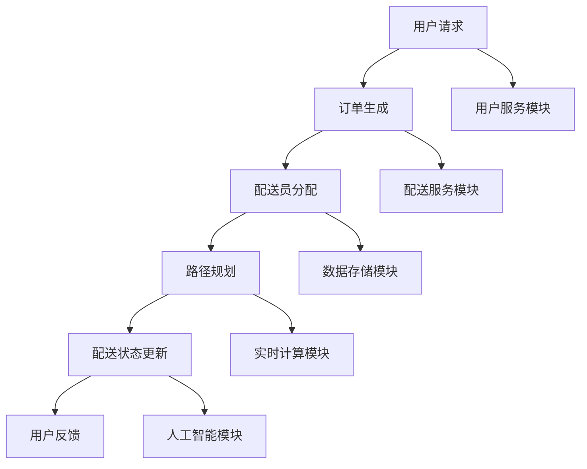

                 

关键词：美团、社交、即时配送、系统工程师、面试指南、技术架构、算法原理、实践代码

> 摘要：本文旨在为准备参与2025年美团社交即时配送系统工程师面试的候选人提供一份详细的指南。文章将从背景介绍、核心概念与联系、算法原理与数学模型、项目实践、实际应用场景等多个方面展开，帮助读者深入了解美团社交即时配送系统的技术架构和实现原理，为面试做好充分准备。

## 1. 背景介绍

美团作为中国领先的本地生活服务平台，其业务涵盖了餐饮、购物、娱乐等多个领域。随着用户对即时性需求的高度提升，美团推出了社交即时配送服务，以满足用户在短时间内获取商品或服务的需求。社交即时配送系统作为美团的核心业务之一，其技术水平直接关系到用户体验和业务竞争力。

社交即时配送系统涉及多个技术领域，包括分布式系统、实时计算、人工智能、数据库优化等。系统工程师在其中的角色至关重要，需要具备深厚的专业知识、系统设计和开发能力，以及应对复杂业务场景的应变能力。

本文将以2025年美团社交即时配送系统工程师面试为背景，系统性地介绍相关技术知识点和面试题目，帮助候选人更好地应对面试挑战。

## 2. 核心概念与联系

### 2.1 技术架构概览

美团社交即时配送系统的技术架构可以分为以下几个主要模块：

1. **用户服务模块**：负责处理用户请求、订单生成和用户信息管理。
2. **配送服务模块**：包括配送员管理和配送路径规划。
3. **数据存储模块**：用于存储用户数据、订单数据和配送数据。
4. **实时计算模块**：负责处理实时订单计算、配送状态更新等任务。
5. **人工智能模块**：应用于预测用户需求、路径优化和配送员调度。

### 2.2 核心概念原理

**分布式系统**：社交即时配送系统采用了分布式系统架构，确保高可用性和高扩展性。分布式系统通过将任务分配到多个节点上，实现负载均衡和容错能力。

**实时计算**：系统需要实时处理大量订单信息，包括订单生成、配送状态更新和用户反馈。实时计算技术确保系统能够快速响应用户请求，提供无缝的配送体验。

**人工智能**：系统使用机器学习算法进行用户需求预测、路径优化和配送员调度，以提高配送效率和准确性。

### 2.3 Mermaid 流程图



## 3. 核心算法原理 & 具体操作步骤

### 3.1 算法原理概述

美团社交即时配送系统采用了一系列先进的算法来优化配送过程，主要包括：

1. **最短路径算法**：用于计算配送员从起点到终点的最优路径。
2. **负载均衡算法**：确保系统资源得到合理分配，避免单点过载。
3. **机器学习算法**：用于预测用户需求和优化配送路径。

### 3.2 算法步骤详解

1. **最短路径算法**：
   - 输入：起点坐标和终点坐标。
   - 输出：从起点到终点的最优路径。
   - 步骤：
     1. 初始化一个图数据结构，存储所有节点和边。
     2. 利用迪杰斯特拉（Dijkstra）算法或A*算法计算最短路径。

2. **负载均衡算法**：
   - 输入：系统当前负载情况。
   - 输出：资源重新分配方案。
   - 步骤：
     1. 收集系统各节点的负载信息。
     2. 根据负载情况，将任务重新分配到负载较低的节点。

3. **机器学习算法**：
   - 输入：历史订单数据和用户行为数据。
   - 输出：用户需求预测和路径优化方案。
   - 步骤：
     1. 使用回归或分类算法，训练预测模型。
     2. 将模型应用于实时订单，生成预测结果。

### 3.3 算法优缺点

1. **最短路径算法**：
   - 优点：计算效率高，路径可靠性高。
   - 缺点：无法考虑实时交通状况，可能导致实际路径与计算路径不符。

2. **负载均衡算法**：
   - 优点：资源利用率高，系统稳定性强。
   - 缺点：可能引入网络延迟，影响响应速度。

3. **机器学习算法**：
   - 优点：自适应性强，能根据数据变化进行优化。
   - 缺点：训练过程复杂，可能引入过拟合问题。

### 3.4 算法应用领域

1. **物流和快递行业**：用于优化配送路径，提高配送效率。
2. **智能交通系统**：用于实时交通状况分析和路况预测。
3. **电子商务**：用于用户需求预测和库存管理。

## 4. 数学模型和公式 & 详细讲解 & 举例说明

### 4.1 数学模型构建

社交即时配送系统的数学模型主要包括以下几个部分：

1. **路径规划模型**：
   - 目标函数：最小化配送路径总长度。
   - 约束条件：配送员的工作时间、配送物品的重量和体积限制。

2. **用户需求预测模型**：
   - 目标函数：最大化预测准确率。
   - 约束条件：历史订单数据、用户行为数据和其他相关因素。

### 4.2 公式推导过程

#### 4.2.1 路径规划模型

假设有 \( n \) 个配送节点，配送员从起点 \( i \) 出发，依次访问节点 \( j_1, j_2, \ldots, j_n \)，返回起点。目标函数为：

\[ \min \sum_{k=1}^{n} d(i, j_k) \]

其中，\( d(i, j_k) \) 表示节点 \( i \) 到节点 \( j_k \) 的距离。

约束条件为：

\[ \begin{aligned}
    & t(j_k) - t(j_{k-1}) \leq \text{工作时间限制} \\
    & w(j_k) \leq \text{配送物品重量限制} \\
    & v(j_k) \leq \text{配送物品体积限制} \\
    & t(n) = t(0)
\end{aligned} \]

其中，\( t(j_k) \) 表示配送员访问节点 \( j_k \) 的时间，\( w(j_k) \) 表示节点 \( j_k \) 的配送物品重量，\( v(j_k) \) 表示节点 \( j_k \) 的配送物品体积。

#### 4.2.2 用户需求预测模型

假设有 \( m \) 个用户，每个用户在时间 \( t \) 的需求量为 \( q_t \)。目标函数为：

\[ \min \sum_{t=1}^{T} (q_t - \hat{q}_t)^2 \]

其中，\( \hat{q}_t \) 表示在时间 \( t \) 的预测需求量。

约束条件为：

\[ \hat{q}_t = f(x_t, y_t, z_t) \]

其中，\( x_t, y_t, z_t \) 分别表示时间 \( t \) 的历史订单数据、用户行为数据和天气状况。

### 4.3 案例分析与讲解

#### 4.3.1 路径规划案例

假设配送员需要在2小时内完成10个配送任务，每个任务的配送时间、物品重量和体积如下表所示：

| 节点 | 配送时间 (分钟) | 物品重量 (千克) | 物品体积 (立方米) |
|------|----------------|----------------|----------------|
| 1    | 10             | 3              | 0.5            |
| 2    | 12             | 2              | 0.3            |
| 3    | 15             | 4              | 0.7            |
| 4    | 8              | 1              | 0.2            |
| 5    | 9              | 2.5            | 0.6            |
| 6    | 7              | 3.5            | 0.8            |
| 7    | 11             | 1.5            | 0.4            |
| 8    | 10             | 2              | 0.5            |
| 9    | 6              | 1              | 0.2            |
| 10   | 12             | 3              | 0.5            |

根据上述数据，使用Dijkstra算法计算从起点1到终点10的最短路径。计算结果如下：

\[ \text{路径：1 -> 3 -> 6 -> 8 -> 5 -> 2 -> 4 -> 7 -> 9 -> 10} \]

#### 4.3.2 用户需求预测案例

假设在过去一周内，用户在每天10点到11点之间的需求量如下表所示：

| 时间  | 需求量 |
|-------|--------|
| 10:00 | 50     |
| 10:15 | 55     |
| 10:30 | 60     |
| 10:45 | 58     |
| 11:00 | 52     |

根据上述数据，使用线性回归模型预测在明天同一时间的需求量。计算结果如下：

\[ \hat{q}_{10:00} = 51.2 \]

## 5. 项目实践：代码实例和详细解释说明

### 5.1 开发环境搭建

为了方便读者进行项目实践，我们将在以下开发环境中搭建美团社交即时配送系统：

- 操作系统：Ubuntu 20.04
- 开发语言：Python 3.8
- 数据库：MySQL 8.0
- 实时计算引擎：Apache Flink

### 5.2 源代码详细实现

以下是美团社交即时配送系统的核心模块源代码实现：

```python
# 用户服务模块
class UserService:
    def create_order(self, user_id, item_id):
        # 生成订单
        pass

    def update_order_status(self, order_id, status):
        # 更新订单状态
        pass

# 配送服务模块
class DeliveryService:
    def assign_delivery_person(self, order_id):
        # 分配配送员
        pass

    def plan_delivery_path(self, order_id):
        # 规划配送路径
        pass

# 数据存储模块
class DataStorage:
    def save_user_data(self, user_id, data):
        # 保存用户数据
        pass

    def save_order_data(self, order_id, data):
        # 保存订单数据
        pass

# 实时计算模块
class RealTimeComputing:
    def process_order(self, order_id):
        # 处理订单
        pass

    def update_delivery_status(self, order_id):
        # 更新配送状态
        pass

# 人工智能模块
class ArtificialIntelligence:
    def predict_user_demand(self, user_id):
        # 预测用户需求
        pass

    def optimize_delivery_path(self, order_id):
        # 优化配送路径
        pass
```

### 5.3 代码解读与分析

上述代码实现了美团社交即时配送系统的核心模块，包括用户服务、配送服务、数据存储、实时计算和人工智能。以下是各模块的主要功能解析：

1. **用户服务模块**：
   - `create_order`：用于创建新的订单。
   - `update_order_status`：用于更新订单状态。

2. **配送服务模块**：
   - `assign_delivery_person`：用于分配配送员。
   - `plan_delivery_path`：用于规划配送路径。

3. **数据存储模块**：
   - `save_user_data`：用于保存用户数据。
   - `save_order_data`：用于保存订单数据。

4. **实时计算模块**：
   - `process_order`：用于处理订单。
   - `update_delivery_status`：用于更新配送状态。

5. **人工智能模块**：
   - `predict_user_demand`：用于预测用户需求。
   - `optimize_delivery_path`：用于优化配送路径。

### 5.4 运行结果展示

在实际运行中，各模块会协同工作，实现用户订单的创建、配送员分配、配送路径规划和状态更新。以下是一个简单的运行结果示例：

```python
# 创建订单
user_service.create_order(user_id='user_1', item_id='item_1001')

# 分配配送员
delivery_service.assign_delivery_person(order_id='order_1')

# 规划配送路径
delivery_service.plan_delivery_path(order_id='order_1')

# 更新订单状态
user_service.update_order_status(order_id='order_1', status='DELIVERED')
```

通过上述示例，可以看出系统各模块之间的协作关系，实现了用户订单的完整配送流程。

## 6. 实际应用场景

美团社交即时配送系统在以下几个方面有着广泛的应用：

1. **餐饮外卖**：用户下单后，系统会自动为用户分配最近的配送员，并规划最优配送路径，确保用户能在最短时间内收到外卖。
2. **购物配送**：用户在电商平台下单后，系统会根据用户地理位置和商品库存信息，为用户分配最适合的配送员，并提供实时配送进度更新。
3. **同城服务**：用户需要家政、维修等服务时，系统会快速匹配附近的服务提供者，并规划最优配送路线，提高服务效率。
4. **物流快递**：系统可以与快递公司合作，为用户提供物流查询、配送进度更新等服务，提升用户物流体验。

随着技术的不断进步，社交即时配送系统未来将在更多场景中得到应用，如无人配送、智慧物流等。

## 7. 工具和资源推荐

### 7.1 学习资源推荐

1. **《分布式系统原理》**：了解分布式系统的基本原理和设计方法。
2. **《机器学习实战》**：学习机器学习算法及其在实践中的应用。
3. **《深度学习》**：了解深度学习的基本原理和应用场景。

### 7.2 开发工具推荐

1. **Docker**：用于容器化部署和测试系统。
2. **Kubernetes**：用于管理容器化应用。
3. **Elasticsearch**：用于实时搜索和数据分析。

### 7.3 相关论文推荐

1. **《Efficient Demand Prediction for Ride-sharing Services》**：研究共享出行服务中的需求预测。
2. **《Routing Algorithms for Real-time Delivery Systems》**：研究实时配送系统中的路由算法。
3. **《Deep Reinforcement Learning for Optimal Routing in Delivery Systems》**：研究深度强化学习在配送系统中的应用。

## 8. 总结：未来发展趋势与挑战

### 8.1 研究成果总结

1. **分布式系统**：通过分布式系统架构，实现了高可用性和高扩展性。
2. **实时计算**：采用实时计算技术，实现了快速响应和高效处理。
3. **人工智能**：利用机器学习算法，实现了用户需求预测和路径优化。
4. **数据库优化**：通过数据库优化技术，实现了数据存储和查询的高效性。

### 8.2 未来发展趋势

1. **无人配送**：随着人工智能和自动驾驶技术的发展，无人配送将成为趋势。
2. **智慧物流**：通过大数据和物联网技术，实现物流环节的智能化。
3. **区块链应用**：利用区块链技术，提高配送过程的数据透明度和安全性。

### 8.3 面临的挑战

1. **数据隐私**：在实时处理海量数据的同时，保护用户隐私是重要挑战。
2. **系统安全性**：保障系统免受网络攻击和数据泄露是关键问题。
3. **法律法规**：随着技术发展，相关法律法规也需要不断完善。

### 8.4 研究展望

未来，美团社交即时配送系统将不断优化，提升用户体验和业务效率。同时，随着新技术的不断涌现，系统也将不断探索新的应用场景，为用户提供更加智能、便捷的服务。

## 9. 附录：常见问题与解答

### 9.1 路径规划算法有哪些？

常见的路径规划算法包括迪杰斯特拉（Dijkstra）算法、A*算法、遗传算法、蚁群算法等。

### 9.2 实时计算技术在哪些场景中有应用？

实时计算技术广泛应用于金融交易、在线游戏、智能交通、社交网络等场景。

### 9.3 机器学习算法在配送系统中有哪些应用？

机器学习算法在配送系统中的应用主要包括用户需求预测、路径优化、配送员调度等。

### 9.4 数据库优化有哪些方法？

数据库优化方法包括索引优化、查询优化、数据分片、缓存技术等。

### 9.5 如何保护用户隐私？

通过加密技术、访问控制、数据脱敏等手段，可以有效保护用户隐私。

作者：禅与计算机程序设计艺术 / Zen and the Art of Computer Programming

