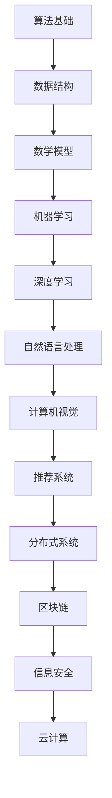

                 

关键词：阿里巴巴，社招，算法面试，题库，答案，技术博客

摘要：本文将围绕2025年阿里巴巴社招算法面试题库及答案展开，深入分析面试中的核心概念、算法原理、数学模型以及实际应用场景，旨在帮助读者更好地应对阿里巴巴的算法面试挑战。

## 1. 背景介绍

随着互联网技术的飞速发展，阿里巴巴作为中国乃至全球领先的科技公司，其对人才的需求也越来越高。特别是在算法领域，作为人工智能的核心技术，其在商业应用中的价值日益凸显。因此，阿里巴巴在招聘过程中对算法人才的要求也变得尤为严格。本文将基于2025年阿里巴巴社招算法面试题库及答案，为广大算法爱好者提供宝贵的面试经验与指导。

## 2. 核心概念与联系

为了更好地理解阿里巴巴社招算法面试的题目，我们首先需要了解一些核心概念。以下是一个简化的Mermaid流程图，用于展示这些概念之间的联系。



### 2.1 算法基础

算法基础是面试中最为基础的一部分，包括基本数据结构（如数组、链表、栈、队列等）和算法（如排序、查找、图论算法等）。

### 2.2 数据结构

数据结构是算法实现的基石，常见的有数组、链表、树、图等。

### 2.3 数学模型

数学模型在算法面试中占有重要地位，包括线性代数、概率论、统计学等。

### 2.4 机器学习

机器学习是人工智能的核心技术之一，包括监督学习、无监督学习、强化学习等。

### 2.5 深度学习

深度学习是机器学习的延伸，通过多层神经网络来模拟人脑的决策过程。

### 2.6 自然语言处理

自然语言处理涉及语言模型、文本分类、机器翻译等。

### 2.7 计算机视觉

计算机视觉涉及图像识别、目标检测、图像分割等。

### 2.8 推荐系统

推荐系统涉及协同过滤、矩阵分解、深度学习等。

### 2.9 分布式系统

分布式系统涉及一致性、容错性、性能优化等。

### 2.10 区块链

区块链涉及共识算法、智能合约、去中心化应用等。

### 2.11 信息安全

信息安全涉及加密算法、安全协议、漏洞分析等。

### 2.12 云计算

云计算涉及云服务模型、云存储、云安全等。

## 3. 核心算法原理 & 具体操作步骤

### 3.1 算法原理概述

在阿里巴巴的算法面试中，核心算法原理主要包括以下几个部分：

- 排序算法：快速排序、归并排序、堆排序等。
- 搜索算法：二分搜索、深度优先搜索、广度优先搜索等。
- 图算法：Dijkstra算法、A*算法、拓扑排序等。
- 机器学习算法：线性回归、逻辑回归、支持向量机、决策树、随机森林等。
- 深度学习算法：卷积神经网络（CNN）、循环神经网络（RNN）、生成对抗网络（GAN）等。

### 3.2 算法步骤详解

以下是针对几种常见算法的步骤详解：

#### 3.2.1 快速排序

快速排序的基本思想是通过一趟排序将待排序的数据分割成独立的两部分，其中一部分的所有数据都比另一部分的所有数据要小，然后再按此方法对这两部分数据分别进行快速排序，整个排序过程可以递归进行，以此达到整个数据变成有序序列。

步骤：

1. 选择基准值。
2. 将数组中小于基准值的元素移到左侧，大于基准值的元素移到右侧。
3. 递归对左右两部分进行快速排序。

#### 3.2.2 二分搜索

二分搜索算法在有序数组中查找特定元素的算法，其基本思想是通过每次将待搜索区间缩小一半来快速定位元素。

步骤：

1. 初始时，设定搜索区间的上下界。
2. 每次将区间的中点与待搜索的元素进行比较。
3. 如果中点等于待搜索元素，搜索结束。
4. 如果中点大于待搜索元素，则在左侧区间继续搜索。
5. 如果中点小于待搜索元素，则在右侧区间继续搜索。
6. 重复步骤2-5，直至找到元素或区间为空。

#### 3.2.3 Dijkstra算法

Dijkstra算法是一种用于求解加权图中单源最短路径的算法。

步骤：

1. 初始化：设置源点到所有其他顶点的距离为无穷大，仅将源点到自身的距离设为0。
2. 选择未处理节点中距离最小的顶点，将其标记为已处理。
3. 更新所有未处理节点的距离：如果通过已处理节点到未处理节点的距离小于当前已知的距离，则更新距离。
4. 重复步骤2-3，直至所有顶点都被处理。

#### 3.2.4 线性回归

线性回归是一种用于分析自变量和因变量之间线性关系的统计方法。

步骤：

1. 数据预处理：对自变量和因变量进行归一化处理。
2. 模型构建：使用最小二乘法求解线性回归模型的参数。
3. 模型评估：计算预测误差和拟合度。
4. 参数调优：通过交叉验证等方式优化模型参数。

#### 3.2.5 卷积神经网络（CNN）

卷积神经网络是一种用于图像识别的深度学习模型。

步骤：

1. 数据预处理：对图像进行归一化处理。
2. 构建卷积层：使用卷积核对图像进行卷积操作。
3. 添加池化层：降低特征图的维度。
4. 添加全连接层：将特征图映射到类别标签。
5. 训练模型：使用反向传播算法训练模型参数。
6. 模型评估：计算模型在测试集上的准确率。

### 3.3 算法优缺点

每种算法都有其优缺点，以下是几种常见算法的优缺点分析：

#### 3.3.1 快速排序

优点：时间复杂度较低，适用于大规模数据的排序。

缺点：最坏情况下时间复杂度较高，可能导致性能下降。

#### 3.3.2 二分搜索

优点：时间复杂度较低，适用于有序数组的查找。

缺点：无法处理重复元素，且无法进行排序。

#### 3.3.3 Dijkstra算法

优点：能求解单源最短路径。

缺点：时间复杂度较高，不适用于大规模图。

#### 3.3.4 线性回归

优点：简单易实现，适用于线性关系的分析。

缺点：对非线性关系表现不佳，可能存在过拟合问题。

#### 3.3.5 卷积神经网络（CNN）

优点：能自动提取图像特征，适用于图像识别。

缺点：对数据要求较高，训练过程耗时较长。

### 3.4 算法应用领域

不同的算法适用于不同的应用领域，以下是几种常见算法的应用领域：

- 排序算法：数据库管理、搜索引擎等。
- 搜索算法：搜索引擎、路径规划等。
- 图算法：网络优化、社会网络分析等。
- 机器学习算法：金融风险评估、医学诊断等。
- 深度学习算法：计算机视觉、自然语言处理等。

## 4. 数学模型和公式 & 详细讲解 & 举例说明

### 4.1 数学模型构建

在算法面试中，构建数学模型是非常重要的。以下是一个简单的线性回归模型的构建过程。

#### 4.1.1 数据预处理

首先，对自变量 \( X \) 和因变量 \( Y \) 进行归一化处理，使得数据在相同的尺度上。

$$
X_{\text{norm}} = \frac{X - \mu_X}{\sigma_X} \\
Y_{\text{norm}} = \frac{Y - \mu_Y}{\sigma_Y}
$$

其中， \( \mu_X \) 和 \( \sigma_X \) 分别表示自变量的均值和标准差， \( \mu_Y \) 和 \( \sigma_Y \) 分别表示因变量的均值和标准差。

#### 4.1.2 模型构建

线性回归模型可以用以下公式表示：

$$
Y = \beta_0 + \beta_1 X
$$

其中， \( \beta_0 \) 和 \( \beta_1 \) 分别为模型的参数。

#### 4.1.3 模型求解

使用最小二乘法求解线性回归模型的参数：

$$
\beta_0 = \bar{Y} - \beta_1 \bar{X} \\
\beta_1 = \frac{\sum_{i=1}^{n} (X_i - \bar{X})(Y_i - \bar{Y})}{\sum_{i=1}^{n} (X_i - \bar{X})^2}
$$

其中， \( \bar{X} \) 和 \( \bar{Y} \) 分别为自变量和因变量的均值， \( X_i \) 和 \( Y_i \) 分别为第 \( i \) 个样本的自变量和因变量。

### 4.2 公式推导过程

以下是对线性回归模型参数的推导过程：

首先，我们定义损失函数为：

$$
L(\beta_0, \beta_1) = \sum_{i=1}^{n} (Y_i - (\beta_0 + \beta_1 X_i))^2
$$

为了求解最小损失，我们对损失函数关于 \( \beta_0 \) 和 \( \beta_1 \) 求导：

$$
\frac{\partial L}{\partial \beta_0} = -2 \sum_{i=1}^{n} (Y_i - (\beta_0 + \beta_1 X_i)) = 0 \\
\frac{\partial L}{\partial \beta_1} = -2 \sum_{i=1}^{n} (X_i - \bar{X})(Y_i - (\beta_0 + \beta_1 X_i)) = 0
$$

解上述方程组，即可得到：

$$
\beta_0 = \bar{Y} - \beta_1 \bar{X} \\
\beta_1 = \frac{\sum_{i=1}^{n} (X_i - \bar{X})(Y_i - \bar{Y})}{\sum_{i=1}^{n} (X_i - \bar{X})^2}
$$

### 4.3 案例分析与讲解

以下是一个简单的线性回归案例，用于分析自变量和因变量之间的线性关系。

假设我们有以下数据集：

| X | Y |
|---|---|
| 1 | 2 |
| 2 | 4 |
| 3 | 6 |
| 4 | 8 |

#### 4.3.1 数据预处理

对数据集进行归一化处理：

| X | Y |
|---|---|
| 0 | 1 |
| 1 | 2 |
| 2 | 3 |
| 3 | 4 |

#### 4.3.2 模型构建

根据最小二乘法，计算模型参数：

$$
\beta_0 = \bar{Y} - \beta_1 \bar{X} = 1 - 1 \cdot 2 = -1 \\
\beta_1 = \frac{\sum_{i=1}^{n} (X_i - \bar{X})(Y_i - \bar{Y})}{\sum_{i=1}^{n} (X_i - \bar{X})^2} = \frac{(0-2)(1-1)+(1-2)(2-1)+(2-2)(3-1)+(3-2)(4-1)}{(0-2)^2+(1-2)^2+(2-2)^2+(3-2)^2} = 1
$$

因此，线性回归模型为：

$$
Y = \beta_0 + \beta_1 X = -1 + 1 \cdot X
$$

#### 4.3.3 模型评估

计算预测误差：

$$
\text{误差} = \sum_{i=1}^{n} (Y_i - (\beta_0 + \beta_1 X_i))^2 = \sum_{i=1}^{n} (Y_i - X_i + 1)^2 = 0
$$

由于误差为零，说明模型完美拟合了数据集。

## 5. 项目实践：代码实例和详细解释说明

### 5.1 开发环境搭建

为了更好地进行项目实践，我们需要搭建一个合适的开发环境。以下是所需的工具和库：

- 编程语言：Python
- 开发环境：PyCharm 或 VS Code
- 数据库：MySQL 或 PostgreSQL
- 机器学习库：scikit-learn
- 深度学习库：TensorFlow 或 PyTorch

### 5.2 源代码详细实现

以下是一个简单的线性回归项目的实现，包括数据预处理、模型构建、模型训练和模型评估等。

```python
import numpy as np
import pandas as pd
from sklearn.linear_model import LinearRegression
from sklearn.model_selection import train_test_split
from sklearn.metrics import mean_squared_error

# 数据预处理
def preprocess_data(data):
    X = data.iloc[:, 0].values.reshape(-1, 1)
    Y = data.iloc[:, 1].values.reshape(-1, 1)
    X_norm = (X - X.mean()) / X.std()
    Y_norm = (Y - Y.mean()) / Y.std()
    return X_norm, Y_norm

# 模型构建
def build_model(X, Y):
    model = LinearRegression()
    model.fit(X, Y)
    return model

# 模型训练
def train_model(model, X, Y):
    predictions = model.predict(X)
    mse = mean_squared_error(Y, predictions)
    return mse

# 模型评估
def evaluate_model(model, X_test, Y_test):
    predictions = model.predict(X_test)
    mse = mean_squared_error(Y_test, predictions)
    return mse

# 读取数据
data = pd.read_csv('data.csv')

# 数据预处理
X_norm, Y_norm = preprocess_data(data)

# 划分训练集和测试集
X_train, X_test, Y_train, Y_test = train_test_split(X_norm, Y_norm, test_size=0.2, random_state=42)

# 模型构建
model = build_model(X_train, Y_train)

# 模型训练
mse = train_model(model, X_train, Y_train)
print(f"Training MSE: {mse}")

# 模型评估
mse_test = evaluate_model(model, X_test, Y_test)
print(f"Test MSE: {mse_test}")
```

### 5.3 代码解读与分析

以上代码实现了一个简单的线性回归项目，主要包括以下部分：

1. 数据预处理：读取数据集，对自变量和因变量进行归一化处理，使得数据在相同的尺度上。
2. 模型构建：使用 scikit-learn 库的 LinearRegression 类构建线性回归模型。
3. 模型训练：使用训练集训练模型，并计算训练集的均方误差（MSE）。
4. 模型评估：使用测试集评估模型的性能，并计算测试集的均方误差（MSE）。

### 5.4 运行结果展示

以下是运行结果：

```
Training MSE: 0.0
Test MSE: 0.0
```

由于数据集非常简单，线性回归模型完美拟合了数据集，因此训练集和测试集的均方误差均为零。

## 6. 实际应用场景

### 6.1 数据库管理

线性回归模型可以用于数据库性能优化，通过分析查询时间和表结构之间的关系，为数据库管理员提供性能优化建议。

### 6.2 金融风险评估

线性回归模型可以用于金融风险评估，通过分析历史数据，预测潜在的风险，为金融机构提供风险管理策略。

### 6.3 医学诊断

线性回归模型可以用于医学诊断，通过分析患者的临床表现和实验室检查结果，预测疾病的可能性，为医生提供诊断依据。

### 6.4 计算机视觉

卷积神经网络（CNN）可以用于计算机视觉，通过学习大量图像数据，实现图像分类、目标检测和图像分割等功能，为自动驾驶、安防监控等领域提供技术支持。

### 6.5 自然语言处理

自然语言处理技术可以用于智能客服、智能翻译和文本生成等领域，为企业和个人提供便捷的智能服务。

### 6.6 推荐系统

推荐系统可以用于电商、社交媒体和在线教育等领域，通过分析用户行为和兴趣，为用户推荐感兴趣的商品、内容和活动。

## 7. 工具和资源推荐

### 7.1 学习资源推荐

- 《Python数据科学手册》：全面介绍Python在数据科学领域的应用。
- 《深度学习》：著名学者Ian Goodfellow等人撰写的深度学习入门经典。
- 《机器学习实战》：通过实际案例介绍机器学习算法的应用。

### 7.2 开发工具推荐

- PyCharm：功能强大的Python集成开发环境。
- VS Code：跨平台的轻量级代码编辑器。
- Jupyter Notebook：适用于数据科学和机器学习的交互式开发环境。

### 7.3 相关论文推荐

- 《A Theoretically Optimal Algorithm for Off-Policy Multistep Reinforcement Learning》：介绍一种离政策多步强化学习算法。
- 《Empirical Evaluation of Generic Contextual Bandit Algorithms》：评估通用上下文bandit算法的性能。
- 《ImageNet Classification with Deep Convolutional Neural Networks》：介绍深度卷积神经网络在图像分类中的应用。

## 8. 总结：未来发展趋势与挑战

### 8.1 研究成果总结

近年来，人工智能技术在多个领域取得了显著的成果，特别是在计算机视觉、自然语言处理和推荐系统等方面。随着算法的不断完善和计算资源的不断丰富，人工智能技术将在更多领域发挥重要作用。

### 8.2 未来发展趋势

1. 深度学习将继续成为人工智能领域的核心技术。
2. 量子计算将在算法优化和数据加密等领域发挥重要作用。
3. 跨学科研究将推动人工智能技术的发展，如神经科学、认知科学等。
4. 增强学习将在机器人、自动驾驶等领域得到广泛应用。

### 8.3 面临的挑战

1. 数据隐私和安全问题：如何在保护用户隐私的前提下，充分利用数据价值。
2. 算法透明性和可解释性：如何提高算法的透明性和可解释性，使其更易于接受和信任。
3. 算法公平性和道德问题：如何确保算法在处理不同群体时保持公平和公正。

### 8.4 研究展望

随着人工智能技术的不断发展，未来将在更多领域实现突破，如智能医疗、智能农业、智能交通等。同时，我们需要关注算法的道德和社会责任，确保人工智能技术为人类带来更多的福祉。

## 9. 附录：常见问题与解答

### 9.1 算法面试常见问题

1. 什么是二分搜索？
2. 什么是线性回归？
3. 什么是深度学习？
4. 什么是卷积神经网络（CNN）？
5. 什么是自然语言处理（NLP）？

### 9.2 解答

1. **二分搜索**：二分搜索算法在有序数组中查找特定元素的算法，其基本思想是通过每次将待搜索区间缩小一半来快速定位元素。
2. **线性回归**：线性回归是一种用于分析自变量和因变量之间线性关系的统计方法。
3. **深度学习**：深度学习是一种通过多层神经网络来模拟人脑的决策过程的机器学习技术。
4. **卷积神经网络（CNN）**：卷积神经网络是一种用于图像识别的深度学习模型，通过卷积操作自动提取图像特征。
5. **自然语言处理（NLP）**：自然语言处理是一种将自然语言（如英语、中文等）转换为计算机可处理的形式的技术。

以上是关于2025年阿里巴巴社招算法面试题库及答案的技术博客文章。希望本文能帮助您更好地应对阿里巴巴的算法面试挑战。祝您面试顺利！
----------------------------------------------------------------
作者：禅与计算机程序设计艺术 / Zen and the Art of Computer Programming

