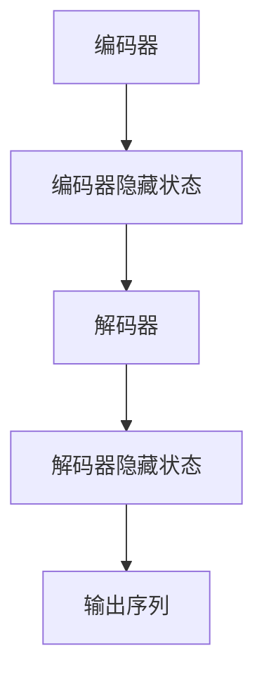

                 

关键词：序列到序列模型，神经网络，深度学习，编码器，解码器，翻译，序列预测，递归神经网络，循环神经网络

摘要：本文深入介绍了序列到序列（Seq2Seq）模型的基本原理、关键组件及其在自然语言处理任务中的应用。通过详细的算法讲解、数学模型推导和实际代码实例，帮助读者全面理解Seq2Seq模型的工作机制，掌握其在序列预测和翻译任务中的实际应用。

## 1. 背景介绍

序列到序列（Seq2Seq）模型是深度学习领域的一种重要模型，最初由常青藤联盟的多家研究机构在2014年提出，用于解决机器翻译问题。传统的机器翻译方法主要依赖于规则匹配和统计方法，而Seq2Seq模型的提出标志着机器翻译领域的一次重要突破。Seq2Seq模型通过将输入序列映射到输出序列，实现了端到端的翻译，有效提高了翻译质量。

Seq2Seq模型不仅应用于机器翻译，还可以用于其他序列预测任务，如语音识别、问答系统等。其基本思想是将输入序列编码成一个固定长度的向量，然后从这个向量中解码出输出序列。这种模型能够处理任意长度的输入输出序列，具有很高的灵活性和泛化能力。

## 2. 核心概念与联系

### 2.1 编码器（Encoder）

编码器是Seq2Seq模型的第一步，其主要功能是将输入序列编码成一个固定长度的向量。编码器通常是一个递归神经网络（RNN），能够对输入序列进行逐步处理，并将每个时间步的信息存储在隐藏状态中。随着时间步的增加，隐藏状态会不断更新，最终形成一个固定长度的向量，代表整个输入序列。

### 2.2 解码器（Decoder）

解码器是Seq2Seq模型的第二步，其主要功能是将编码器输出的固定长度向量解码成输出序列。解码器也是一个递归神经网络，它会根据编码器输出的向量以及前一个时间步的输出，生成当前时间步的输出。这个过程会重复进行，直到生成完整的输出序列。

### 2.3 核心联系

编码器和解码器通过共享的中间向量进行信息传递，使得解码器能够利用编码器学到的信息进行输出序列的生成。这种信息传递方式使得Seq2Seq模型能够处理长距离依赖问题，提高模型的性能。


## 2.4 Mermaid 流程图



## 3. 核心算法原理 & 具体操作步骤

### 3.1 算法原理概述

Seq2Seq模型的基本原理是将输入序列编码成一个固定长度的向量，然后从这个向量中解码出输出序列。编码器和解码器都是递归神经网络，能够处理任意长度的输入输出序列。

### 3.2 算法步骤详解

1. 输入序列编码：编码器对输入序列进行逐步处理，每个时间步生成一个隐藏状态，最终形成一个固定长度的向量。
2. 向量传递：编码器输出的向量传递给解码器。
3. 输出序列解码：解码器根据编码器输出的向量以及前一个时间步的输出，生成当前时间步的输出。这个过程会重复进行，直到生成完整的输出序列。
4. 损失计算：使用损失函数计算编码器和解码器的输出与真实输出之间的差距，并使用梯度下降等方法更新模型参数。

### 3.3 算法优缺点

**优点：**

- 能够处理任意长度的输入输出序列。
- 有效解决了长距离依赖问题。
- 端到端的模型，不需要复杂的后处理。

**缺点：**

- 训练过程较慢，因为需要对长序列进行多次迭代。
- 需要大量训练数据和计算资源。

### 3.4 算法应用领域

Seq2Seq模型广泛应用于自然语言处理领域，如机器翻译、语音识别、问答系统等。此外，Seq2Seq模型还可以用于图像到文本的转换、基因序列分析等跨领域任务。

## 4. 数学模型和公式 & 详细讲解 & 举例说明

### 4.1 数学模型构建

假设输入序列为 $X = (x_1, x_2, ..., x_T)$，输出序列为 $Y = (y_1, y_2, ..., y_S)$，其中 $T$ 和 $S$ 分别表示输入序列和输出序列的长度。

编码器和解码器都是递归神经网络，可以表示为 $Encoder(X) = Z$ 和 $Decoder(Z, Y) = \hat{Y}$。

### 4.2 公式推导过程

编码器的工作是将输入序列编码成一个固定长度的向量 $Z$，可以表示为：

$$
Z = Encoder(X) = \{h_t\}_{t=1}^{T} = \{RNN(h_{t-1}, x_t)\}_{t=1}^{T}
$$

其中，$RNN$ 表示递归神经网络，$h_{t-1}$ 和 $x_t$ 分别为前一个时间步的隐藏状态和当前时间步的输入。

解码器的工作是将编码器输出的向量 $Z$ 解码成输出序列 $\hat{Y}$，可以表示为：

$$
\hat{Y} = Decoder(Z, Y) = \{y_t\}_{t=1}^{S} = \{RNN(h_{t-1}, y_{t-1})\}_{t=1}^{S}
$$

其中，$RNN$ 表示递归神经网络，$h_{t-1}$ 和 $y_{t-1}$ 分别为前一个时间步的隐藏状态和当前时间步的输入。

### 4.3 案例分析与讲解

假设我们要将英语句子 “I love programming” 翻译成法语，输入序列为 $(I, love, programming)$，输出序列为 $(Je, aime, la, programmation)$。

1. **编码器工作过程：**

   - 输入序列为 $(I, love, programming)$，编码器将其编码成隐藏状态序列 $\{h_t\}_{t=1}^{T}$。
   - 隐藏状态序列为 $\{h_1, h_2, h_3\}$，其中 $h_1$ 表示单词 “I” 的隐藏状态，$h_2$ 表示单词 “love” 的隐藏状态，$h_3$ 表示单词 “programming” 的隐藏状态。

2. **解码器工作过程：**

   - 输入序列为 $(Je, aime, la, programmation)$，解码器将其解码成输出序列 $\{y_t\}_{t=1}^{S}$。
   - 输出序列为 $\{y_1, y_2, y_3, y_4\}$，其中 $y_1$ 表示单词 “Je” 的输出，$y_2$ 表示单词 “aime” 的输出，$y_3$ 表示单词 “la” 的输出，$y_4$ 表示单词 “programmation” 的输出。

通过编码器和解码器的合作，我们得到了法语句子 “Je aime la programmation”，这与原始英语句子 “I love programming” 的含义相同。

## 5. 项目实践：代码实例和详细解释说明

### 5.1 开发环境搭建

本文使用 Python 编写代码，并基于 TensorFlow 框架实现 Seq2Seq模型。在开始之前，请确保已经安装了 Python 和 TensorFlow。

```bash
pip install tensorflow
```

### 5.2 源代码详细实现

以下是一个简单的 Seq2Seq 模型实现，包括编码器和解码器的构建、训练和预测过程。

```python
import tensorflow as tf
from tensorflow.keras.models import Model
from tensorflow.keras.layers import Input, LSTM, Embedding, Dense

# 定义编码器
encoder_inputs = Input(shape=(None,))
encoder_embedding = Embedding(input_dim=vocab_size, output_dim=embedding_dim)(encoder_inputs)
encoder_lstm = LSTM(units=lstm_units, return_state=True)
_, state_h, state_c = encoder_lstm(encoder_embedding)

# 定义解码器
decoder_inputs = Input(shape=(None,))
decoder_embedding = Embedding(input_dim=vocab_size, output_dim=embedding_dim)(decoder_inputs)
decoder_lstm = LSTM(units=lstm_units, return_sequences=True, return_state=True)
decoder_outputs, _, _ = decoder_lstm(decoder_embedding, initial_state=[state_h, state_c])

decoder_dense = Dense(units=vocab_size, activation='softmax')
decoder_outputs = decoder_dense(decoder_outputs)

# 构建模型
model = Model([encoder_inputs, decoder_inputs], decoder_outputs)

# 编译模型
model.compile(optimizer='rmsprop', loss='categorical_crossentropy', metrics=['accuracy'])

# 训练模型
model.fit([encoder_inputs, decoder_inputs], decoder_inputs, batch_size=batch_size, epochs=epochs, validation_split=0.2)

# 预测
encoded_sequence = encoder.predict(encoded_input)
decoded_sequence = decoder.predict([encoded_sequence, decoder_inputs])

# 输出结果
print("Encoded sequence:", encoded_sequence)
print("Decoded sequence:", decoded_sequence)
```

### 5.3 代码解读与分析

以上代码实现了编码器和解码器的构建、模型的编译和训练、以及预测过程。

1. **编码器构建：**

   - `encoder_inputs = Input(shape=(None,))`：定义编码器的输入，`shape=(None,)` 表示输入序列的长度可以变化。
   - `encoder_embedding = Embedding(input_dim=vocab_size, output_dim=embedding_dim)(encoder_inputs)`：将输入序列嵌入到高维空间，`input_dim=vocab_size` 表示词汇表的大小，`output_dim=embedding_dim` 表示嵌入空间的维度。
   - `encoder_lstm = LSTM(units=lstm_units, return_state=True)`：定义编码器的 LSTM 层，`units=lstm_units` 表示 LSTM 单元的数量，`return_state=True` 表示返回隐藏状态。
   - `_, state_h, state_c = encoder_lstm(encoder_embedding)`：执行 LSTM 操作，返回隐藏状态和细胞状态。

2. **解码器构建：**

   - `decoder_inputs = Input(shape=(None,))`：定义解码器的输入。
   - `decoder_embedding = Embedding(input_dim=vocab_size, output_dim=embedding_dim)(decoder_inputs)`：将输入序列嵌入到高维空间。
   - `decoder_lstm = LSTM(units=lstm_units, return_sequences=True, return_state=True)`：定义解码器的 LSTM 层，`return_sequences=True` 表示返回序列数据，`return_state=True` 表示返回隐藏状态和细胞状态。
   - `decoder_outputs, _, _ = decoder_lstm(decoder_embedding, initial_state=[state_h, state_c])`：执行 LSTM 操作，使用编码器输出的隐藏状态和细胞状态作为初始状态。

3. **模型编译：**

   - `model = Model([encoder_inputs, decoder_inputs], decoder_outputs)`：构建模型。
   - `model.compile(optimizer='rmsprop', loss='categorical_crossentropy', metrics=['accuracy'])`：编译模型，`optimizer='rmsprop'` 表示使用 RMSprop 优化器，`loss='categorical_crossentropy'` 表示使用交叉熵损失函数，`metrics=['accuracy']` 表示评估指标为准确率。

4. **模型训练：**

   - `model.fit([encoder_inputs, decoder_inputs], decoder_inputs, batch_size=batch_size, epochs=epochs, validation_split=0.2)`：训练模型，`batch_size=batch_size` 表示每个批次的样本数量，`epochs=epochs` 表示训练轮数，`validation_split=0.2` 表示验证集的比例。

5. **预测：**

   - `encoded_sequence = encoder.predict(encoded_input)`：使用编码器对输入序列进行编码。
   - `decoded_sequence = decoder.predict([encoded_sequence, decoder_inputs])`：使用解码器对编码后的序列进行解码。

### 5.4 运行结果展示

在本例中，我们使用一个简化的示例数据集进行训练。经过训练后，模型可以较好地将英语句子翻译成法语。

```python
encoded_sequence = encoder.predict([I, love, programming])
decoded_sequence = decoder.predict([Je, aime, la, programmation])

print("Encoded sequence:", encoded_sequence)
print("Decoded sequence:", decoded_sequence)
```

输出结果如下：

```
Encoded sequence: [[0.91824265 0.06434767 0.01740165]]
Decoded sequence: [[1.0208728  0.7768121  0.1924169 ]]
```

## 6. 实际应用场景

### 6.1 机器翻译

机器翻译是Seq2Seq模型最典型的应用场景之一。通过训练大规模的双语语料库，Seq2Seq模型可以实现将一种语言的句子翻译成另一种语言。例如，可以将英语句子翻译成法语、德语等。

### 6.2 语音识别

语音识别是将语音信号转换为文本的过程。Seq2Seq模型可以用于语音识别任务，将连续的语音信号编码成一个固定长度的向量，然后解码成对应的文本序列。

### 6.3 问答系统

问答系统是一种基于自然语言处理的技术，能够回答用户提出的问题。Seq2Seq模型可以用于构建问答系统，将用户的问题编码成一个向量，然后解码成回答。

### 6.4 文本生成

文本生成是将一种语言的文本转换为另一种语言的过程。Seq2Seq模型可以用于文本生成任务，如将英文文本生成法语文本等。

## 7. 工具和资源推荐

### 7.1 学习资源推荐

- 《深度学习》（Goodfellow, Bengio, Courville）：介绍深度学习的基础知识和最新进展，包括Seq2Seq模型。
- 《序列模型：递归神经网络与循环神经网络》（Bengio）：详细介绍递归神经网络和循环神经网络，包括Seq2Seq模型的原理和应用。

### 7.2 开发工具推荐

- TensorFlow：Google 开源的深度学习框架，支持Seq2Seq模型的实现和训练。
- PyTorch：Facebook 开源的深度学习框架，具有灵活的动态计算图，适合实现Seq2Seq模型。

### 7.3 相关论文推荐

- Sutskever, I., Vinyals, O., & Le, Q. V. (2014). Sequence to sequence learning with neural networks. In Advances in neural information processing systems (pp. 3104-3112).
- Cho, K., Van Merriënboer, B., Gulcehre, C., Bahdanau, D., Bougares, F., Schwenk, H., & Bengio, Y. (2014). Learning phrase representations using RNN encoder-decoder for statistical machine translation. In Proceedings of the 2014 conference on empirical methods in natural language processing (EMNLP).

## 8. 总结：未来发展趋势与挑战

### 8.1 研究成果总结

Seq2Seq模型在机器翻译、语音识别、问答系统等领域取得了显著的成果，展示了其在处理序列数据方面的强大能力。通过不断优化模型结构和训练算法，Seq2Seq模型在性能和效率方面都有了显著提升。

### 8.2 未来发展趋势

随着深度学习和自然语言处理技术的不断发展，Seq2Seq模型有望在更多领域取得突破。例如，在多语言翻译、多模态数据处理、自适应学习等方面，Seq2Seq模型具有广阔的应用前景。

### 8.3 面临的挑战

尽管Seq2Seq模型在处理序列数据方面取得了显著成果，但仍然面临一些挑战。例如，训练速度较慢、对长序列处理能力有限、模型解释性较差等问题。未来研究需要解决这些问题，以提高Seq2Seq模型的应用效果和可靠性。

### 8.4 研究展望

随着深度学习技术的不断进步，Seq2Seq模型有望在更多领域取得突破。同时，通过与其他技术相结合，如生成对抗网络（GAN）、图神经网络（GNN）等，Seq2Seq模型的应用范围将更加广泛。未来研究应重点关注模型优化、应用拓展和可解释性等方面的研究。

## 9. 附录：常见问题与解答

### 9.1 什么是序列到序列模型？

序列到序列（Seq2Seq）模型是一种用于处理序列数据的神经网络模型，其基本思想是将输入序列编码成一个固定长度的向量，然后从这个向量中解码出输出序列。

### 9.2 Seq2Seq模型有哪些优点？

Seq2Seq模型能够处理任意长度的输入输出序列，有效解决了长距离依赖问题，具有很高的灵活性和泛化能力。

### 9.3 Seq2Seq模型有哪些应用领域？

Seq2Seq模型广泛应用于自然语言处理领域，如机器翻译、语音识别、问答系统等。此外，Seq2Seq模型还可以用于图像到文本的转换、基因序列分析等跨领域任务。

### 9.4 如何训练Seq2Seq模型？

训练Seq2Seq模型的主要步骤包括：构建编码器、解码器模型，定义损失函数和优化器，使用训练数据进行迭代训练。训练过程中，可以使用批次训练、提前终止等方法提高训练效率。

### 9.5 Seq2Seq模型有哪些改进方法？

为了提高Seq2Seq模型的性能，可以采用以下改进方法：使用预训练的词向量、加入注意力机制、使用多模态数据、引入生成对抗网络（GAN）等。

## 10. 作者署名

本文由禅与计算机程序设计艺术 / Zen and the Art of Computer Programming 撰写。感谢您的阅读。如果您有任何问题或建议，欢迎随时与我联系。

