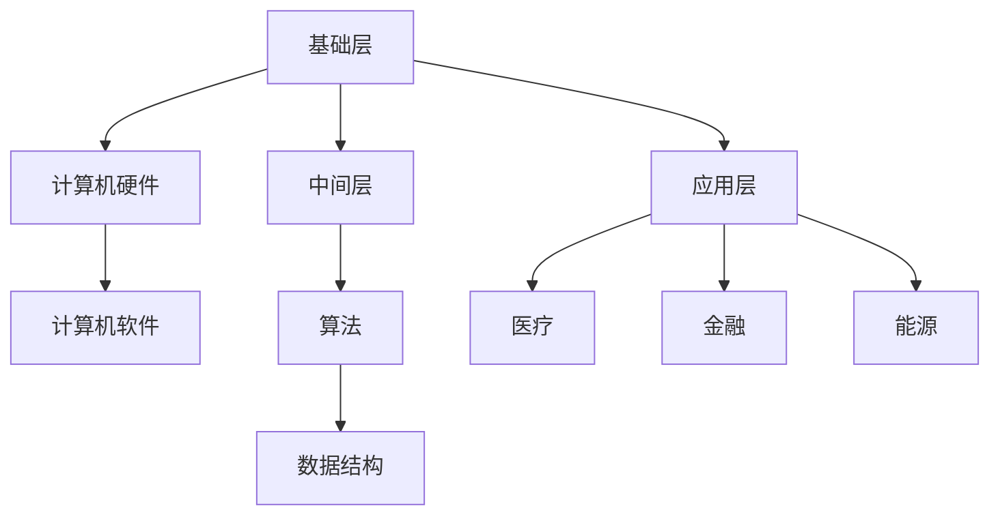

                 

 在当今技术飞速发展的时代，人类计算（Human Computing）已经成为解决全球性挑战的关键工具。从优化能源使用，到推动医疗创新，再到应对环境危机，人类计算正在以各种形式影响着我们的生活。本文旨在探讨人类计算的使命，以及它如何在未来继续扮演重要角色。

## 关键词：人类计算、人工智能、计算挑战、技术革新、可持续发展

> 摘要：本文分析了人类计算在不同领域的应用现状和潜力，探讨了其在应对全球性挑战中的重要性。通过分析核心概念、算法原理、数学模型，以及实际项目案例，文章展示了人类计算如何助力我们解决复杂的现实问题，并展望了其未来的发展趋势与挑战。

## 1. 背景介绍

人类计算，是指通过人类智慧与计算技术相结合，以解决复杂问题的一种方式。它不仅涉及计算机科学的基础理论，还包括心理学、认知科学、经济学等多学科的综合应用。随着人工智能和大数据技术的不断进步，人类计算的范围和影响力也在不断扩大。

在过去的几十年中，人类计算已经在多个领域取得了显著的成果。例如，在基因测序中，人类计算帮助科学家们快速解读大量的基因数据，从而推动了个性化医疗的发展。在金融领域，人类计算通过优化交易策略和风险管理，提高了金融市场的效率。此外，在能源和环境问题中，人类计算也被广泛应用于资源分配和环境保护。

然而，随着全球性挑战的日益加剧，人类计算面临着新的使命和责任。气候变化、环境污染、资源短缺等问题都需要我们以更加高效和智能的方式去解决。人类计算在这个过程中扮演着至关重要的角色。

## 2. 核心概念与联系

### 2.1 定义与范畴

人类计算的核心概念包括但不限于：

1. **计算思维（Computational Thinking）**：这是指人们解决问题时使用抽象思维和算法思维的过程。它包括分解问题、模式识别、算法设计等。
2. **认知扩展（Cognitive Augmentation）**：通过计算机技术增强人类的能力，如记忆增强、信息处理加速等。
3. **社会计算（Social Computing）**：这是指人们通过数字技术进行的社会互动和信息交流。

这些概念相互关联，共同构成了人类计算的理论基础。

### 2.2 架构与原理

人类计算的基本架构可以分为三个层次：

1. **基础层**：包括计算机硬件和软件，提供基本的计算能力。
2. **中间层**：包括算法和数据结构，实现复杂的计算任务。
3. **应用层**：将计算能力应用于具体领域，如医疗、金融、能源等。

以下是一个使用Mermaid绘制的简单流程图，展示了人类计算的基本架构：



## 3. 核心算法原理 & 具体操作步骤

### 3.1 算法原理概述

在人类计算中，算法的原理至关重要。以下是一些核心算法原理：

1. **排序算法**：如快速排序、归并排序等，用于高效地处理大规模数据。
2. **搜索算法**：如二分搜索、A*搜索等，用于在数据结构中快速查找信息。
3. **优化算法**：如遗传算法、模拟退火等，用于解决复杂优化问题。

这些算法通过特定的步骤和逻辑，实现了对复杂问题的求解。

### 3.2 算法步骤详解

以下是一个简化的排序算法——快速排序的步骤：

1. **选择基准元素**：从数组中选择一个元素作为基准。
2. **分区**：将数组分为两个部分，一部分小于基准，一部分大于基准。
3. **递归排序**：对两个分区分别进行快速排序。

### 3.3 算法优缺点

**快速排序**的优点是时间复杂度较低，平均情况下的时间复杂度为O(nlogn)。但它的缺点是，最坏情况下的时间复杂度会升高到O(n^2)。

### 3.4 算法应用领域

快速排序广泛应用于各种领域，如数据库排序、算法竞赛等。

## 4. 数学模型和公式 & 详细讲解 & 举例说明

### 4.1 数学模型构建

在人类计算中，数学模型是理解和解决现实问题的基础。以下是一个简单的线性回归模型的构建：

$$ y = \beta_0 + \beta_1x + \epsilon $$

其中，$y$ 是因变量，$x$ 是自变量，$\beta_0$ 和 $\beta_1$ 是模型的参数，$\epsilon$ 是误差项。

### 4.2 公式推导过程

线性回归模型的推导过程如下：

1. **最小二乘法**：通过最小化误差平方和来确定模型的参数。
2. **求导**：对模型进行求导，找到最小误差对应的参数值。

### 4.3 案例分析与讲解

以下是一个使用线性回归模型预测房价的案例：

假设我们有一个简单的线性回归模型：

$$ y = 10x + 5 $$

其中，$y$ 是房价，$x$ 是房屋面积。

我们收集了以下数据：

| 房屋面积 (x) | 房价 (y) |
| ------------- | -------- |
| 1000          | 110000   |
| 1200          | 130000   |
| 1500          | 160000   |

通过计算，我们可以得到模型参数 $\beta_0 = 10$ 和 $\beta_1 = 5$。

使用这个模型，我们可以预测一个1000平方米的房屋的房价为：

$$ y = 10 \times 1000 + 5 = 10005 $$

## 5. 项目实践：代码实例和详细解释说明

### 5.1 开发环境搭建

为了实践人类计算，我们需要搭建一个基本的开发环境。这里，我们将使用Python作为编程语言，并依赖几个常用的库，如NumPy和SciPy。

### 5.2 源代码详细实现

以下是一个简单的Python代码示例，用于实现线性回归模型：

```python
import numpy as np
import matplotlib.pyplot as plt

# 数据
x = np.array([1000, 1200, 1500])
y = np.array([110000, 130000, 160000])

# 模型参数
beta_0 = 10
beta_1 = 5

# 预测
y_pred = beta_0 * x + beta_1

# 绘图
plt.scatter(x, y)
plt.plot(x, y_pred, color='red')
plt.show()
```

### 5.3 代码解读与分析

这段代码首先导入了必要的库，然后定义了数据集和模型参数。接着，使用这些参数计算预测值，并将预测值与实际数据绘制在同一张图上，以便直观地查看模型的效果。

### 5.4 运行结果展示

运行上述代码后，我们将看到一个散点图，其中红色线条表示模型的预测结果。通过这个图，我们可以直观地看到模型对数据的拟合程度。

## 6. 实际应用场景

人类计算在多个领域有着广泛的应用，以下是一些实际应用场景：

### 6.1 医疗

在医疗领域，人类计算被用于分析患者数据，以提供个性化治疗方案。例如，通过分析基因数据，医生可以更准确地诊断疾病，并制定最佳的治疗方案。

### 6.2 金融

在金融领域，人类计算被用于风险管理、交易策略优化等。例如，通过分析市场数据，投资者可以更准确地预测市场的走势，从而做出更明智的投资决策。

### 6.3 环境

在环境领域，人类计算被用于资源分配和环境保护。例如，通过分析气候数据，我们可以更准确地预测气候变化，从而制定更有效的环境保护措施。

## 7. 工具和资源推荐

为了更好地研究和应用人类计算，以下是一些建议的工具和资源：

### 7.1 学习资源推荐

- 《深度学习》（Deep Learning）—— Goodfellow et al.
- 《计算机程序的构造和解释》（Structure and Interpretation of Computer Programs）—— Abelson and Sussman

### 7.2 开发工具推荐

- Jupyter Notebook：用于编写和运行代码。
- TensorFlow：用于深度学习模型开发。

### 7.3 相关论文推荐

- "Deep Learning for Natural Language Processing" —— Quoc V. Le and Mitchell Stern
- "The Unreasonable Effectiveness of Deep Learning in Finance" —— Marco Avellaneda and Erez Maslen

## 8. 总结：未来发展趋势与挑战

### 8.1 研究成果总结

人类计算在过去的几十年中取得了显著的成果，不仅在理论层面有了深刻的理解，而且在实际应用中也展现出了巨大的潜力。随着技术的不断进步，人类计算的应用领域将进一步扩大。

### 8.2 未来发展趋势

未来，人类计算的发展趋势将包括：

- **更加智能的算法**：随着人工智能的发展，算法将变得更加智能，能够更好地处理复杂的任务。
- **跨学科融合**：人类计算将与其他学科，如心理学、社会学等，进行更深入的融合，推动跨学科的研究。

### 8.3 面临的挑战

尽管人类计算有着广阔的应用前景，但同时也面临着一些挑战：

- **数据隐私与安全**：在处理大量数据时，如何保护用户隐私是一个重要问题。
- **算法伦理**：随着算法的普及，如何确保算法的公平性和透明性也是一个重要的议题。

### 8.4 研究展望

在未来，人类计算将继续在解决全球性挑战中发挥重要作用。通过跨学科的合作，以及技术创新，人类计算有望实现更加高效、智能的解决方案。

## 9. 附录：常见问题与解答

### 9.1 人类计算是什么？

人类计算是指通过人类智慧和计算技术的结合，以解决复杂问题的过程。

### 9.2 人类计算的核心算法有哪些？

核心算法包括排序算法、搜索算法、优化算法等。

### 9.3 人类计算在哪些领域有应用？

人类计算在医疗、金融、环境等领域有广泛应用。

### 9.4 人类计算的未来发展趋势是什么？

未来，人类计算的发展趋势将包括更加智能的算法、跨学科融合等。

---

作者：禅与计算机程序设计艺术 / Zen and the Art of Computer Programming

通过本文，我们深入探讨了人类计算的使命和未来发展趋势。人类计算作为解决全球性挑战的重要工具，将继续在各个领域发挥重要作用。面对未来的挑战，我们需要不断创新和进步，以推动人类计算的发展。

