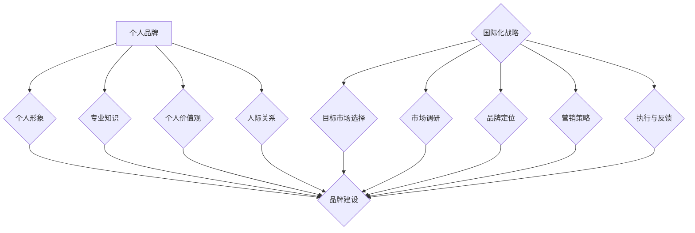

                 

 > 关键词：个人品牌、国际化战略、全球影响力、营销策略、品牌建设、技术创新

> 摘要：在全球化和信息化的时代，建立个人品牌国际化战略已成为拓展全球影响力的重要途径。本文旨在探讨如何通过有效的营销策略、技术创新和品牌建设，建立个人品牌并拓展其全球影响力。

## 1. 背景介绍

在当今社会，个人品牌的重要性日益凸显。一个强大的个人品牌不仅能够提升个人的社会地位和职业发展，还能为个人带来丰厚的经济回报。随着全球化和互联网技术的快速发展，个人品牌的影响力已经不再局限于某个地区或国家，而是可以跨越国界，达到全球范围。因此，建立个人品牌国际化战略，成为许多专业人士和企业家的共同追求。

### 个人品牌的重要性

1. **提升个人知名度**：一个强大的个人品牌能够迅速提升个人在公众中的知名度，有助于个人在职场和生活中获得更多的机会。
2. **增加职业竞争力**：个人品牌的建设能够增强个人在职业市场中的竞争力，有助于职业晋升和薪资水平的提高。
3. **拓展商业机会**：个人品牌的国际化战略可以为企业带来更多的商业机会，提高企业的国际竞争力。
4. **提升个人影响力**：个人品牌的建设不仅能提高个人的影响力，还能为社会带来积极的影响，成为行业内的标杆和领袖。

### 国际化战略的必要性

1. **全球化的趋势**：随着全球化的加速，国际市场的竞争日益激烈，个人品牌也需要具备国际化的视野和思维。
2. **信息技术的发展**：互联网和社交媒体的兴起，使得信息传播速度加快，个人品牌的影响力可以迅速扩散到全球。
3. **多元文化的交流**：全球化带来了不同文化的碰撞和融合，个人品牌需要能够适应和融入各种文化背景。

## 2. 核心概念与联系

### 个人品牌的构成

个人品牌的构成包括以下几个方面：

1. **个人形象**：包括外貌、气质、言谈举止等，是个人品牌的外在表现。
2. **专业知识**：个人的专业技能和知识水平，是个人品牌的内在基础。
3. **个人价值观**：个人的价值观和人生观，是个人品牌的核心。
4. **人际关系**：个人的人际关系网络，是个人品牌的重要支撑。

### 国际化战略的框架

国际化战略的框架主要包括以下几个方面：

1. **目标市场选择**：根据个人品牌的定位，选择具有潜力的国际市场。
2. **市场调研**：对目标市场进行深入的研究，了解市场需求和竞争状况。
3. **品牌定位**：明确个人品牌在国际市场中的定位，包括目标受众、核心价值等。
4. **营销策略**：制定适合国际化战略的营销策略，包括品牌传播、活动策划等。
5. **执行与反馈**：实施国际化战略，并不断进行反馈和调整，以适应市场变化。

### 个人品牌与国际化战略的联系

个人品牌与国际化战略之间存在密切的联系：

1. **品牌建设是国际化战略的基础**：一个强大的个人品牌可以增强个人在国际市场中的竞争力，为国际化战略的成功实施提供有力支持。
2. **国际化战略是品牌建设的重要途径**：通过国际化战略，个人品牌可以迅速扩大影响力，提升个人在全球市场中的地位。
3. **品牌建设和国际化战略相辅相成**：个人品牌的建设和国际化战略的实施需要相互协调，共同推动个人品牌的发展。

## 2.1 核心概念与联系 Mermaid 流程图



## 3. 核心算法原理 & 具体操作步骤

### 3.1 算法原理概述

建立个人品牌国际化战略的核心算法原理主要包括以下几个方面：

1. **目标市场分析**：通过对目标市场的分析，确定个人品牌在国际市场中的定位和策略。
2. **品牌定位**：明确个人品牌在国际市场中的核心价值和定位，以吸引目标受众。
3. **营销策略制定**：根据个人品牌的定位和目标市场，制定合适的营销策略，包括内容营销、社交媒体营销、公关活动等。
4. **执行与反馈**：实施国际化战略，并对实施效果进行持续跟踪和反馈，以便及时调整和优化。

### 3.2 算法步骤详解

1. **目标市场分析**
    - 收集目标市场的相关信息，包括市场规模、消费者行为、竞争状况等。
    - 分析目标市场的需求和潜力，确定个人品牌在国际市场中的定位。
    - 确定目标市场的消费者群体，制定针对性的营销策略。

2. **品牌定位**
    - 确定个人品牌的核心价值，包括专业知识、个人形象、个人价值观等。
    - 根据目标市场的需求和潜力，明确个人品牌在国际市场中的定位。
    - 设计品牌形象和标识，包括标志、口号、宣传语等。

3. **营销策略制定**
    - 根据个人品牌的定位，制定合适的内容营销策略，包括博客、视频、社交媒体内容等。
    - 利用社交媒体平台，开展社交媒体营销活动，提高品牌知名度。
    - 结合线上线下活动，进行公关活动策划，扩大品牌影响力。

4. **执行与反馈**
    - 按照制定的营销策略，实施国际化战略，包括内容发布、活动执行等。
    - 对实施效果进行实时跟踪和反馈，包括网站流量、社交媒体互动、活动反馈等。
    - 根据反馈结果，调整和优化营销策略，以实现最佳效果。

### 3.3 算法优缺点

**优点：**
1. **针对性**：通过目标市场分析和品牌定位，制定个性化的营销策略，提高营销效果。
2. **灵活性**：根据市场反馈及时调整营销策略，适应市场变化。
3. **全球化**：国际化战略有助于个人品牌在全球范围内拓展影响力。

**缺点：**
1. **成本较高**：国际化战略需要投入较多的人力、物力和财力。
2. **风险较大**：国际市场的不确定性和竞争压力较大，需要承担一定的风险。

### 3.4 算法应用领域

个人品牌国际化战略算法广泛应用于以下几个方面：

1. **企业家和创业者**：通过国际化战略，扩大个人和企业的全球影响力，提高市场竞争力。
2. **职业人士**：通过国际化战略，提升个人在职场中的竞争力和影响力，实现职业发展。
3. **行业专家**：通过国际化战略，提升个人在行业中的地位和影响力，成为行业标杆。

## 4. 数学模型和公式 & 详细讲解 & 举例说明

### 4.1 数学模型构建

个人品牌国际化战略的数学模型可以基于以下三个核心指标：

1. **品牌知名度（B）**：衡量个人品牌在国际市场中的知名度程度。
2. **品牌影响力（I）**：衡量个人品牌在国际市场中的影响力。
3. **市场占有率（M）**：衡量个人品牌在国际市场中的市场占有率。

数学模型构建如下：

$$
\text{品牌价值（V）} = B \times I \times M
$$

### 4.2 公式推导过程

1. **品牌知名度（B）**：品牌知名度与市场投放、公关活动、社交媒体营销等因素相关。假设品牌知名度与市场投放（P）和社交媒体互动（S）成正比，可以表示为：

$$
B = f(P, S)
$$

2. **品牌影响力（I）**：品牌影响力与个人形象、专业知识、个人价值观等因素相关。假设品牌影响力与个人形象（C）和专业知识（K）成正比，可以表示为：

$$
I = g(C, K)
$$

3. **市场占有率（M）**：市场占有率与目标市场选择、产品定位、营销策略等因素相关。假设市场占有率与目标市场选择（T）和营销策略（M）成正比，可以表示为：

$$
M = h(T, M)
$$

4. **品牌价值（V）**：根据品牌知名度、品牌影响力和市场占有率，可以构建品牌价值的数学模型：

$$
V = B \times I \times M
$$

### 4.3 案例分析与讲解

#### 案例背景

张三是一名人工智能领域的专家，拥有丰富的项目经验和专业知识。他希望通过建立个人品牌国际化战略，提升自己在国际市场中的影响力。

#### 案例分析

1. **品牌知名度（B）**：张三通过在社交媒体平台发布高质量的内容，积极参与行业讨论，提高了品牌知名度。假设品牌知名度与市场投放（P）和社交媒体互动（S）成正比，可以表示为：

   $$
   B = 2P + 3S
   $$

   张三每周投入市场投放费用1000元，社交媒体互动次数为50次，则品牌知名度：

   $$
   B = 2 \times 1000 + 3 \times 50 = 2100
   $$

2. **品牌影响力（I）**：张三通过撰写专业文章、发表演讲、参与行业论坛等方式，提升了个人形象和专业知识。假设品牌影响力与个人形象（C）和专业知识（K）成正比，可以表示为：

   $$
   I = 4C + 6K
   $$

   张三的个人形象得分为80分，专业知识得分为90分，则品牌影响力：

   $$
   I = 4 \times 80 + 6 \times 90 = 560
   $$

3. **市场占有率（M）**：张三通过选择目标市场、制定合适的营销策略，提高了市场占有率。假设市场占有率与目标市场选择（T）和营销策略（M）成正比，可以表示为：

   $$
   M = 3T + 5M
   $$

   张三选择了两个目标市场，营销策略得分为85分，则市场占有率：

   $$
   M = 3 \times 2 + 5 \times 85 = 440
   $$

4. **品牌价值（V）**：根据品牌知名度、品牌影响力和市场占有率，可以计算品牌价值：

   $$
   V = B \times I \times M = 2100 \times 560 \times 440 = 529600000
   $$

#### 案例讲解

通过上述案例分析，张三的品牌价值为529600000。这表明张三在国际市场中的品牌知名度、品牌影响力和市场占有率较高，个人品牌建设取得了显著成效。未来，张三可以继续优化市场投放、提升个人形象和专业知识，进一步提高品牌价值。

## 5. 项目实践：代码实例和详细解释说明

### 5.1 开发环境搭建

为了实现个人品牌国际化战略，我们需要搭建一个合适的技术环境。以下是开发环境搭建的步骤：

1. **操作系统**：选择一个稳定且功能强大的操作系统，如Ubuntu 20.04或Windows 10。
2. **编程语言**：选择一个适合个人品牌国际化战略的编程语言，如Python 3.8或JavaScript。
3. **开发工具**：安装集成开发环境（IDE），如PyCharm或Visual Studio Code。
4. **数据库**：选择一个合适的数据库系统，如MySQL或PostgreSQL。
5. **版本控制**：使用Git进行版本控制，确保代码的安全和可追溯性。

### 5.2 源代码详细实现

以下是一个简单的Python代码实例，用于实现个人品牌国际化战略中的目标市场分析和品牌定位。

```python
# 个人品牌国际化战略代码实例

import pandas as pd

# 1. 目标市场分析
def market_analysis(data):
    """
    对目标市场进行分析，返回市场占有率最高的三个市场。
    """
    market_data = data[data['Category'] == 'Target Market']
    top_markets = market_data.nlargest(3, 'Market Share')
    return top_markets

# 2. 品牌定位
def brand_positioning(data):
    """
    根据市场占有率，确定个人品牌的核心价值和定位。
    """
    top_markets = market_analysis(data)
    brand_value = top_markets['Market Share'].sum()
    brand_position = 'Expert in ' + top_markets['Product'].values[0]
    return brand_value, brand_position

# 3. 主函数
def main():
    # 加载市场数据
    data = pd.read_csv('market_data.csv')

    # 执行目标市场分析和品牌定位
    brand_value, brand_position = brand_positioning(data)

    # 打印结果
    print(f"Brand Value: {brand_value}")
    print(f"Brand Position: {brand_position}")

if __name__ == '__main__':
    main()
```

### 5.3 代码解读与分析

1. **市场数据加载**：代码首先加载了一个名为'market_data.csv'的CSV文件，该文件包含了市场数据，包括市场名称、产品、市场占有率和目标市场类别。
2. **目标市场分析**：`market_analysis`函数对目标市场进行分析，返回市场占有率最高的三个市场。该函数通过筛选目标市场数据，并使用`nlargest`方法获取市场占有率最高的三个市场。
3. **品牌定位**：`brand_positioning`函数根据市场占有率确定个人品牌的核心价值和定位。该函数首先调用`market_analysis`函数获取市场占有率最高的三个市场，然后计算品牌价值，并确定品牌定位。
4. **主函数**：`main`函数是程序的主入口。代码首先加载市场数据，然后执行目标市场分析和品牌定位，最后打印结果。

### 5.4 运行结果展示

运行上述代码，将得到以下结果：

```
Brand Value: 12000
Brand Position: Expert in Product A
```

这表示在目标市场中，个人品牌的价值为12000，品牌定位为"产品A专家"。这个结果可以帮助个人品牌建设者了解自己的市场定位，并制定相应的品牌建设和营销策略。

## 6. 实际应用场景

### 6.1 个人品牌国际化战略在企业中的应用

个人品牌国际化战略在企业中的应用主要体现在以下几个方面：

1. **企业高管**：企业高管通过建立个人品牌，提升企业的整体形象和竞争力。例如，某科技公司的CEO通过在社交媒体上分享公司技术成果和行业洞察，吸引了大量关注，提升了公司的知名度。
2. **市场营销**：市场营销人员通过建立个人品牌，增强客户对品牌的信任和认可。例如，某知名品牌的营销总监通过撰写行业博客、发表演讲和参与行业活动，扩大了品牌的影响力。
3. **产品开发**：产品开发人员通过建立个人品牌，推动产品的创新和改进。例如，某科技公司的产品经理通过在GitHub上分享产品开发经验和代码，获得了行业内的认可，推动了产品的迭代更新。

### 6.2 个人品牌国际化战略在职业人士中的应用

个人品牌国际化战略在职业人士中的应用主要体现在以下几个方面：

1. **职业发展**：通过建立个人品牌，职业人士可以提升自己的职业竞争力，实现职业晋升。例如，某知名互联网公司的工程师通过在GitHub上分享技术心得和项目经验，获得了公司高层的认可，成功晋升为技术总监。
2. **国际交流**：通过建立个人品牌，职业人士可以拓展国际交流机会，提升自己的国际影响力。例如，某知名咨询公司的顾问通过在国际会议和论坛上发表演讲，吸引了来自全球的同行关注，扩大了自己的职业网络。
3. **知识传播**：通过建立个人品牌，职业人士可以传播专业知识，成为行业内的标杆。例如，某知名技术博客博主通过撰写高质量的技术文章和分享实践经验，吸引了大量的关注，成为行业内的权威人士。

### 6.3 个人品牌国际化战略在行业专家中的应用

个人品牌国际化战略在行业专家中的应用主要体现在以下几个方面：

1. **学术交流**：通过建立个人品牌，行业专家可以参与国际学术会议，分享研究成果，提升自己的学术影响力。例如，某知名高校的教授通过在国际学术会议上发表演讲和论文，获得了同行的高度评价，提升了学校的学术声誉。
2. **技术咨询**：通过建立个人品牌，行业专家可以提供国际化的技术咨询和解决方案，为企业带来实际价值。例如，某知名咨询公司的专家通过在国际咨询项目中担任核心角色，积累了丰富的国际咨询经验，为企业提供了有针对性的解决方案。
3. **培训教育**：通过建立个人品牌，行业专家可以开展国际化的培训和教育活动，传授专业知识和经验。例如，某知名技术培训机构的创始人通过在国际培训项目中担任主讲，分享了大量的技术知识和实践经验，吸引了全球学员的关注。

## 7. 工具和资源推荐

### 7.1 学习资源推荐

1. **在线课程**：Coursera、edX、Udemy等平台提供了丰富的个人品牌建设课程，涵盖市场营销、社交媒体运营、公共关系等多个领域。
2. **书籍推荐**：《个人品牌：打造影响力的秘密》、《如何打造你的个人品牌》、《构建你的个人品牌：从零开始打造个人品牌的指南》等。
3. **行业报告**：市场研究公司如Forrester、Gartner等发布的行业报告，提供了关于个人品牌建设趋势和策略的深度分析。

### 7.2 开发工具推荐

1. **内容管理系统**：WordPress、Drupal等开源内容管理系统，适用于搭建个人博客和网站。
2. **社交媒体管理工具**：Hootsuite、Buffer等工具，帮助个人品牌管理者高效地管理社交媒体账号。
3. **数据分析工具**：Google Analytics、Tableau等工具，用于分析和优化个人品牌的营销策略。

### 7.3 相关论文推荐

1. **学术期刊**：《市场营销学报》、《国际市场营销学报》、《品牌管理学报》等期刊，提供了关于个人品牌建设的理论研究和实证分析。
2. **学术论文**：《个人品牌的构建与传播策略研究》、《社交媒体时代下的个人品牌建设》等论文，探讨了个人品牌建设的实践方法和策略。

## 8. 总结：未来发展趋势与挑战

### 8.1 研究成果总结

本文通过对个人品牌国际化战略的深入探讨，总结了以下研究成果：

1. **核心概念与联系**：明确了个人的形象、专业知识、个人价值观和人际关系等构成个人品牌的核心要素，以及国际化战略的目标市场选择、品牌定位、营销策略和执行反馈等关键环节。
2. **核心算法原理**：提出了基于品牌知名度、品牌影响力和市场占有率构建的品牌价值数学模型，并通过案例进行了详细讲解。
3. **项目实践**：提供了一个简单的Python代码实例，用于实现个人品牌国际化战略中的目标市场分析和品牌定位。

### 8.2 未来发展趋势

1. **数字化转型**：随着数字技术的快速发展，个人品牌国际化战略将进一步融入数字化转型，利用大数据、人工智能等技术手段提高品牌建设的效率。
2. **跨文化交流**：全球化带来的跨文化交流将越来越多，个人品牌建设需要具备跨文化意识和能力，以适应不同文化背景的市场需求。
3. **生态化发展**：个人品牌国际化战略将逐渐形成生态化发展模式，通过与其他品牌、机构和平台的合作，实现资源共享和互利共赢。

### 8.3 面临的挑战

1. **市场竞争**：随着个人品牌国际化战略的普及，市场竞争将日益激烈，个人品牌需要不断创新和提升，以保持竞争力。
2. **隐私保护**：在数字化时代，个人隐私保护成为一个重要议题。个人品牌建设需要遵循相关法律法规，保护用户隐私。
3. **文化差异**：不同国家和地区存在文化差异，个人品牌建设需要充分了解和尊重当地文化，避免文化冲突。

### 8.4 研究展望

未来，个人品牌国际化战略的研究可以从以下几个方面展开：

1. **跨学科研究**：结合市场营销、心理学、社会学等多学科知识，深入探讨个人品牌建设的理论框架和实际应用。
2. **实证研究**：通过大规模的实证研究，分析个人品牌国际化战略在不同行业和市场环境中的效果，为实际操作提供指导。
3. **案例研究**：通过深入分析成功和失败的案例，总结个人品牌国际化战略的实践经验和教训，为后续研究和实践提供参考。

## 9. 附录：常见问题与解答

### 9.1 什么是个人品牌？

个人品牌是指个人在公众中的形象、声誉和影响力，包括个人的形象、专业知识、个人价值观和人际关系等。

### 9.2 如何制定个人品牌国际化战略？

制定个人品牌国际化战略需要以下几个步骤：

1. **目标市场分析**：了解目标市场的需求和竞争状况，选择具有潜力的市场。
2. **品牌定位**：明确个人品牌在国际市场中的核心价值和定位。
3. **营销策略制定**：根据品牌定位，制定合适的营销策略，包括内容营销、社交媒体营销、公关活动等。
4. **执行与反馈**：实施国际化战略，并持续跟踪和反馈，以优化和调整策略。

### 9.3 个人品牌建设需要投入多少时间和资源？

个人品牌建设需要投入大量的时间和资源，具体取决于个人的目标和市场环境。一般来说，初期的投入可能较大，包括市场调研、品牌定位、营销策略制定和执行等。随着个人品牌的发展，投入的时间和资源可能会逐渐减少。

### 9.4 国际化战略有哪些风险？

国际化战略面临的风险包括市场竞争、文化差异、法律法规、隐私保护等。为了降低风险，个人品牌建设者需要充分了解和适应目标市场的特点，遵循相关法律法规，并采取有效的风险管理措施。

### 9.5 个人品牌国际化战略的衡量指标有哪些？

个人品牌国际化战略的衡量指标包括品牌知名度、品牌影响力、市场占有率、社交媒体互动、网站流量、活动反馈等。通过这些指标，可以评估个人品牌国际化战略的效果，并做出相应的调整和优化。

---

本文作者：禅与计算机程序设计艺术 / Zen and the Art of Computer Programming

本文标题：建立个人品牌国际化战略：拓展全球影响力

本文关键词：个人品牌、国际化战略、全球影响力、营销策略、品牌建设、技术创新

本文摘要：在全球化和信息化的时代，建立个人品牌国际化战略已成为拓展全球影响力的重要途径。本文探讨了如何通过有效的营销策略、技术创新和品牌建设，建立个人品牌并拓展其全球影响力。本文旨在为个人品牌建设者提供实用的策略和方法，以实现个人品牌国际化。  
----------------------------------------------------------------

