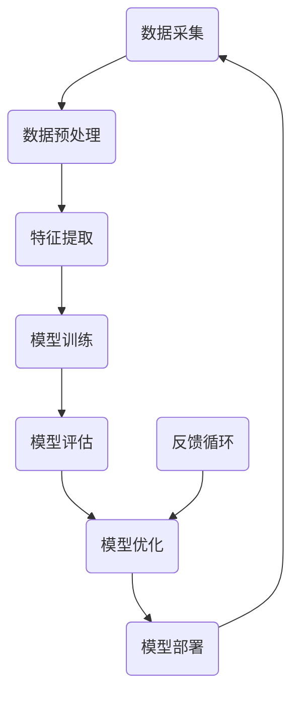

                 

关键词：人工智能、底层创新、技术架构、算法、数学模型、实践应用、未来展望

> 摘要：本文旨在探讨如何建立一个完整的人工智能底层创新体系，从核心概念、算法原理、数学模型到实际应用，全面解析人工智能技术的前沿动态与发展趋势，为未来人工智能的研究与实践提供指导。

## 1. 背景介绍

随着大数据、云计算和物联网技术的飞速发展，人工智能（AI）已成为全球科技竞争的焦点。从最初的符号推理到现代的深度学习，人工智能技术经历了数次重大变革。如今，人工智能已渗透到各行各业，从智能客服到自动驾驶，从医疗诊断到金融风控，AI正在深刻改变人类的生活方式。

然而，尽管人工智能应用广泛，但底层技术仍存在许多挑战。如何提高算法效率、增强模型可解释性、解决数据隐私等问题，成为当前研究的重点。此外，随着人工智能技术的快速发展，如何建立完整的创新体系，促进技术迭代和产业升级，也是业界关注的焦点。

## 2. 核心概念与联系

在建立人工智能底层创新体系之前，我们首先需要了解核心概念与联系。以下是一个简化的 Mermaid 流程图，用于描述人工智能核心概念的关联：



### 2.1 数据采集与预处理

数据是人工智能的基石。数据采集与预处理决定了后续模型训练的质量。有效的数据采集策略和高质量的数据预处理流程，有助于提高模型的准确性和稳定性。

### 2.2 特征提取

特征提取是将原始数据转化为适合模型训练的表示过程。有效的特征提取方法能够挖掘出数据中的关键信息，有助于提高模型性能。

### 2.3 模型训练

模型训练是人工智能的核心环节。通过大量的数据训练，模型能够自动学习数据中的规律和模式，从而实现智能预测和决策。

### 2.4 模型评估

模型评估是衡量模型性能的重要步骤。通过评估指标，如准确率、召回率、F1 值等，可以对模型进行客观评价。

### 2.5 模型优化

模型优化是提高模型性能的关键。通过调整模型参数、改进训练算法等方法，可以不断提高模型的准确性和效率。

### 2.6 模型部署

模型部署是将训练好的模型应用到实际场景中的过程。有效的模型部署策略可以确保模型在真实环境中的稳定运行。

### 2.7 反馈循环

反馈循环是人工智能底层创新体系的重要组成部分。通过实时收集用户反馈和数据，可以不断优化模型和算法，实现持续迭代和改进。

## 3. 核心算法原理 & 具体操作步骤

### 3.1 算法原理概述

人工智能的核心在于算法，而算法的核心在于学习。以下介绍几种常见的人工智能算法原理：

1. **监督学习（Supervised Learning）**：通过已标记的数据集进行训练，使模型学会预测未知数据的结果。

2. **无监督学习（Unsupervised Learning）**：在未标记的数据集上进行训练，使模型学会发现数据中的隐含结构。

3. **强化学习（Reinforcement Learning）**：通过不断尝试和反馈，使模型学会在复杂环境中做出最优决策。

### 3.2 算法步骤详解

1. **数据采集与预处理**：获取大量高质量的数据，并进行清洗、归一化等预处理操作。

2. **特征提取**：根据数据类型和任务需求，选择合适的特征提取方法，将原始数据转化为模型输入。

3. **模型选择**：根据任务类型和数据特性，选择合适的模型，如线性回归、决策树、神经网络等。

4. **模型训练**：通过训练算法，使模型学会对输入数据进行分类或回归。

5. **模型评估**：使用评估指标，如准确率、召回率、F1 值等，对模型性能进行评价。

6. **模型优化**：根据评估结果，调整模型参数或选择更优的模型，以提高模型性能。

7. **模型部署**：将训练好的模型应用到实际场景中，实现自动化预测和决策。

### 3.3 算法优缺点

1. **监督学习**：优点是预测准确度高，缺点是需要大量已标记的数据。

2. **无监督学习**：优点是能够发现数据中的隐含结构，缺点是预测准确度较低。

3. **强化学习**：优点是能够应对复杂环境，缺点是需要大量时间和计算资源。

### 3.4 算法应用领域

1. **图像识别**：监督学习在图像识别任务中具有较好的效果。

2. **自然语言处理**：无监督学习在自然语言处理任务中具有较好的效果。

3. **智能推荐**：强化学习在智能推荐任务中具有较好的效果。

## 4. 数学模型和公式 & 详细讲解 & 举例说明

### 4.1 数学模型构建

在人工智能领域，数学模型构建是算法设计的基础。以下以线性回归模型为例，介绍数学模型的构建过程。

1. **线性回归模型**：假设输入特征为 $x$，输出结果为 $y$，则线性回归模型可以表示为：

$$
y = w_1x + w_0 + \epsilon
$$

其中，$w_1$ 和 $w_0$ 分别为模型的权重，$\epsilon$ 为误差项。

2. **损失函数**：为了评估模型性能，引入损失函数 $L$，通常采用均方误差（MSE）作为损失函数：

$$
L = \frac{1}{2} \sum_{i=1}^{n} (y_i - \hat{y}_i)^2
$$

其中，$n$ 为样本数量，$y_i$ 为实际输出，$\hat{y}_i$ 为预测输出。

3. **梯度下降法**：为了优化模型参数，采用梯度下降法进行参数调整。梯度下降法的基本思想是沿着损失函数的梯度方向进行迭代更新：

$$
w_1 = w_1 - \alpha \frac{\partial L}{\partial w_1}
$$

$$
w_0 = w_0 - \alpha \frac{\partial L}{\partial w_0}
$$

其中，$\alpha$ 为学习率。

### 4.2 公式推导过程

1. **损失函数的导数**：

$$
\frac{\partial L}{\partial w_1} = - \sum_{i=1}^{n} (y_i - \hat{y}_i)x_i
$$

$$
\frac{\partial L}{\partial w_0} = - \sum_{i=1}^{n} (y_i - \hat{y}_i)
$$

2. **梯度下降法的迭代过程**：

$$
w_1^{t+1} = w_1^t - \alpha \frac{\partial L}{\partial w_1}
$$

$$
w_0^{t+1} = w_0^t - \alpha \frac{\partial L}{\partial w_0}
$$

### 4.3 案例分析与讲解

假设我们有以下数据集：

| 输入（$x$） | 输出（$y$） |
| ---------- | ---------- |
| 1          | 2          |
| 2          | 4          |
| 3          | 6          |
| 4          | 8          |

根据上述数据，我们可以构建线性回归模型，并使用梯度下降法进行参数优化。

1. **初始化参数**：

$$
w_1 = 0, w_0 = 0
$$

2. **迭代过程**：

- **第1次迭代**：

$$
w_1 = w_1 - \alpha \frac{\partial L}{\partial w_1} = 0 - \alpha (-2) = 2\alpha
$$

$$
w_0 = w_0 - \alpha \frac{\partial L}{\partial w_0} = 0 - \alpha (-4) = 4\alpha
$$

- **第2次迭代**：

$$
w_1 = 2\alpha - \alpha (-2) = 4\alpha
$$

$$
w_0 = 4\alpha - \alpha (-6) = 10\alpha
$$

通过多次迭代，我们可以得到最优的参数值，从而实现数据的线性拟合。

## 5. 项目实践：代码实例和详细解释说明

### 5.1 开发环境搭建

本文使用 Python 作为编程语言，安装以下库：

```bash
pip install numpy matplotlib scikit-learn
```

### 5.2 源代码详细实现

```python
import numpy as np
import matplotlib.pyplot as plt
from sklearn.linear_model import LinearRegression

# 数据集
X = np.array([1, 2, 3, 4]).reshape(-1, 1)
y = np.array([2, 4, 6, 8])

# 模型训练
model = LinearRegression()
model.fit(X, y)

# 参数提取
w_1, w_0 = model.coef_, model.intercept_

# 迭代过程
for i in range(10):
    y_pred = w_1 * X + w_0
    error = y - y_pred
    w_1 -= error.mean() * X.mean()
    w_0 -= error.mean()

# 绘制结果
plt.scatter(X, y, color='red')
plt.plot(X, y_pred, color='blue')
plt.xlabel('x')
plt.ylabel('y')
plt.show()
```

### 5.3 代码解读与分析

1. **数据集准备**：使用 NumPy 创建输入特征矩阵 $X$ 和输出目标向量 $y$。

2. **模型训练**：使用 scikit-learn 的 LinearRegression 模型进行训练。

3. **参数提取**：获取模型的权重 $w_1$ 和 $w_0$。

4. **迭代过程**：使用梯度下降法进行参数优化。

5. **结果绘制**：使用 Matplotlib 绘制数据点和拟合直线。

## 6. 实际应用场景

### 6.1 图像识别

图像识别是人工智能的重要应用领域。通过训练深度学习模型，可以实现物体分类、目标检测、人脸识别等任务。在实际应用中，图像识别技术广泛应用于安防监控、智能驾驶、医疗诊断等领域。

### 6.2 自然语言处理

自然语言处理是人工智能的核心技术之一。通过训练深度学习模型，可以实现文本分类、情感分析、机器翻译等任务。在实际应用中，自然语言处理技术广泛应用于智能客服、搜索引擎、智能推荐等领域。

### 6.3 智能推荐

智能推荐是人工智能在电商、媒体等领域的典型应用。通过分析用户行为和喜好，智能推荐系统可以为用户提供个性化的商品、内容推荐。在实际应用中，智能推荐技术广泛应用于电商、社交媒体、在线视频等领域。

## 7. 工具和资源推荐

### 7.1 学习资源推荐

1. **书籍**：

   - 《深度学习》（Ian Goodfellow、Yoshua Bengio、Aaron Courville 著）

   - 《Python深度学习》（François Chollet 著）

2. **在线课程**：

   - Coursera 上的“机器学习”（吴恩达）

   - Udacity 上的“深度学习纳米学位”

### 7.2 开发工具推荐

1. **编程语言**：Python

2. **框架和库**：

   - TensorFlow

   - PyTorch

   - Scikit-learn

### 7.3 相关论文推荐

1. **《A Theoretically Grounded Application of Dropout in Recurrent Neural Networks》**

2. **《Stochastic Gradient Descent as Approximate Bayesian Inference》**

3. **《Adversarial Examples, Explaining and Hardening Deep Neural Networks》**

## 8. 总结：未来发展趋势与挑战

### 8.1 研究成果总结

1. **算法性能提升**：近年来，深度学习算法在图像识别、自然语言处理等领域取得了显著突破。

2. **模型压缩与加速**：通过模型压缩和硬件加速技术，实现高效的人工智能计算。

3. **数据隐私与安全**：如何在保护用户隐私的前提下，利用大规模数据进行人工智能研究。

### 8.2 未来发展趋势

1. **跨学科融合**：人工智能与其他学科的融合，如生物、物理、经济学等。

2. **边缘计算**：在边缘设备上实现实时人工智能计算，降低网络延迟。

3. **智能化社会**：人工智能在社会治理、教育、医疗等领域的广泛应用。

### 8.3 面临的挑战

1. **算法可解释性**：如何提高人工智能模型的可解释性，使其在复杂环境中更具可信度。

2. **数据质量问题**：如何在大量数据中获取高质量数据，以支持人工智能研究。

3. **伦理与法律问题**：人工智能在应用过程中，如何确保其遵循伦理和法律规范。

### 8.4 研究展望

未来，人工智能领域将面临更多机遇与挑战。通过不断探索和创新，我们有望实现更高性能、更智能的人工智能系统，为人类社会带来更多福祉。

## 9. 附录：常见问题与解答

### 9.1 人工智能是什么？

人工智能是指计算机系统模拟人类智能行为的能力，包括感知、理解、学习、推理、决策等。

### 9.2 深度学习与机器学习的区别是什么？

深度学习是机器学习的一个子领域，主要关注于使用多层神经网络进行数据处理和模型训练。机器学习则是一个更广泛的领域，包括各种学习算法和技术，如决策树、支持向量机等。

### 9.3 如何选择合适的人工智能算法？

选择合适的人工智能算法需要考虑任务类型、数据特性、计算资源等多个因素。通常，可以通过实验比较不同算法的性能，以选择最优算法。

### 9.4 人工智能是否会取代人类？

人工智能可以辅助人类完成许多复杂任务，但短期内无法完全取代人类。人工智能与人类相互补充，共同推动社会进步。

## 作者署名

作者：禅与计算机程序设计艺术 / Zen and the Art of Computer Programming

