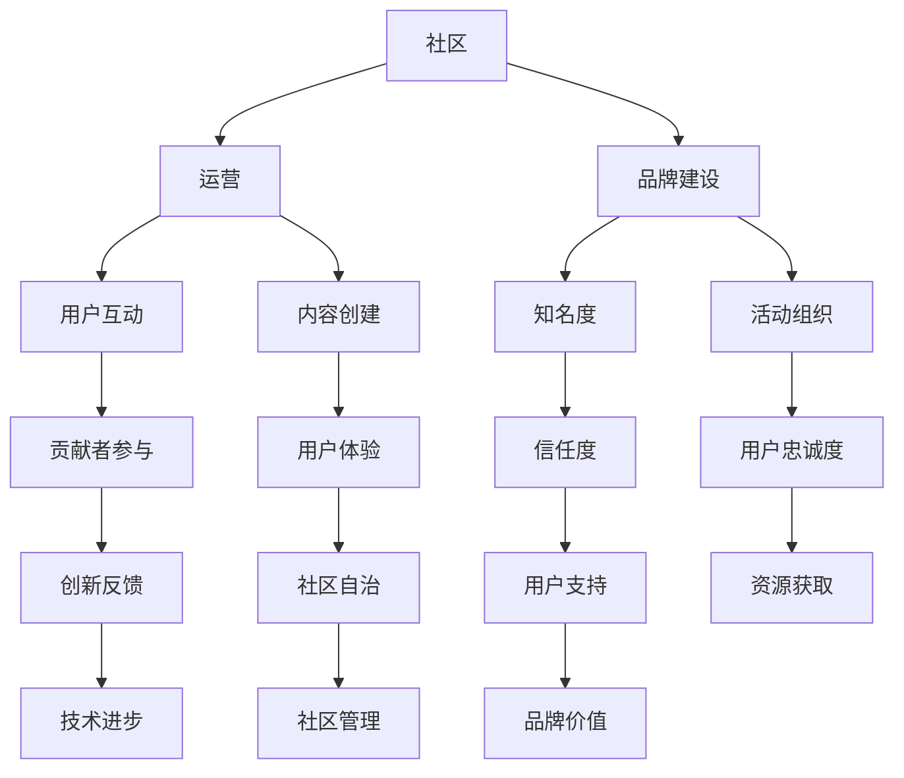

                 

关键词：开源项目，在线社区，社区运营，品牌建设，技术社区，用户参与，社区管理，活跃度提升，影响力扩展

> 摘要：本文旨在探讨如何建立开源项目的在线社区，通过深入理解社区运营和品牌建设的重要性，提供一系列策略和实践指南，以帮助开源项目发展成为一个有活力、有影响力的技术社区。

## 1. 背景介绍

开源项目作为一种协作模式，正日益成为软件开发的重要趋势。它们允许全球开发者共同贡献代码、文档和资源，共同推动技术的进步。然而，开源项目的成功不仅仅取决于代码的质量，更重要的是项目的社区建设和运营。一个活跃且健康的社区可以吸引更多的贡献者，提高项目的质量，并增强项目的可持续性。

在线社区成为了开源项目的核心组成部分。通过论坛、社交媒体、邮件列表和聊天室等平台，开源项目可以与用户和贡献者建立联系，交流想法，解决技术问题，并共同推动项目的进步。同时，良好的社区运营也是品牌建设的关键因素，有助于提升项目的知名度和信誉。

本文将深入探讨以下几个方面：
1. 开源项目社区运营的基本策略。
2. 如何建立和维护一个有影响力的品牌。
3. 有效的社区管理实践。
4. 提升社区活跃度和用户参与度的策略。
5. 社区运营中的挑战和解决方案。

### 1.1 开源项目社区的重要性

开源项目社区不仅仅是一个交流平台，更是项目成功的关键因素。以下是一些为什么开源项目需要建立一个强大的在线社区的原因：

- **用户支持**：用户社区可以提供实时支持，帮助解决用户在使用项目时遇到的问题，这降低了项目维护团队的负担。
- **代码贡献**：活跃的社区有助于吸引新的贡献者，他们可以提交代码补丁、文档改进或其他有益的贡献。
- **创新和反馈**：社区成员可以提出新的功能需求或改进建议，这些反馈可以指导项目的发展方向。
- **传播影响力**：通过社区，项目可以传播其理念和价值观，增强其影响力。
- **品牌价值**：良好的社区运营可以提高项目的品牌形象，吸引更多的用户和潜在贡献者。

### 1.2 社区运营和品牌建设的关系

社区运营和品牌建设是相辅相成的。一个精心运营的社区不仅有助于品牌建设，而且品牌的建设也可以反过来支持社区的发展。以下是一些关键点：

- **品牌认知度**：社区活动可以增加项目的曝光率，提高品牌在潜在用户和贡献者中的知名度。
- **信任和忠诚度**：一个友好、开放的社区有助于建立用户和贡献者的信任，从而增加他们对项目的忠诚度。
- **用户参与**：品牌建设活动，如用户故事、成功案例等，可以激励更多用户参与社区，共同为项目贡献力量。
- **资源获取**：良好的品牌形象有助于吸引赞助商和合作伙伴，为社区运营提供资金和资源支持。
- **社区自治**：通过建立强大的品牌，项目可以培养出一批忠实的社区领袖，他们可以协助管理社区，提高社区的自治能力。

## 2. 核心概念与联系

在探讨开源项目社区运营和品牌建设之前，我们需要明确一些核心概念和它们之间的关系。

### 2.1 核心概念

- **社区**：一个由共同兴趣、目标或价值观的人组成的集体。
- **运营**：管理社区的活动，包括内容创建、活动组织、用户互动等。
- **品牌建设**：通过一系列营销活动和管理策略，提升项目在用户和贡献者中的知名度和认可度。

### 2.2 架构图

下面是一个简单的 Mermaid 流程图，展示了这些核心概念之间的联系：



这个流程图展示了社区运营和品牌建设如何相互作用，以及这些活动如何共同推动开源项目的发展。

## 3. 核心算法原理 & 具体操作步骤

### 3.1 算法原理概述

开源项目社区运营和品牌建设的核心算法可以理解为一种“社区引力模型”。这个模型基于以下几个基本原理：

1. **用户吸引力**：通过高质量的内容、活动和互动，吸引潜在用户和贡献者。
2. **用户参与度**：通过激励机制和社区文化，提高用户的参与度和忠诚度。
3. **社区自治**：培养一批具有领导力的社区成员，提高社区的自治能力和自我管理能力。
4. **品牌影响力**：通过持续的社区活动和品牌推广，增强项目的知名度和品牌价值。

### 3.2 算法步骤详解

#### 3.2.1 社区引力模型建立

1. **目标定位**：确定社区的目标和价值观，确保所有活动都围绕这些核心点进行。
2. **资源整合**：整合项目团队、贡献者、用户和其他资源，为社区运营提供支持。
3. **内容策划**：制定内容计划，包括技术文章、教程、成功案例、活动预告等。

#### 3.2.2 吸引新用户

1. **多渠道推广**：通过社交媒体、博客、论坛等渠道，宣传社区和项目。
2. **建立口碑**：通过用户推荐和成功案例，提高社区的信誉度。
3. **互动活动**：组织线上或线下活动，吸引潜在用户参与。

#### 3.2.3 提高用户参与度

1. **激励机制**：设立积分、勋章等激励机制，鼓励用户参与讨论和贡献。
2. **用户反馈**：定期收集用户反馈，改进社区服务和体验。
3. **社区文化**：培养友好、开放、互助的社区文化，提高用户的归属感。

#### 3.2.4 社区自治

1. **领袖培养**：通过培训和激励，培养一批社区领袖，协助管理社区。
2. **规则制定**：制定社区规则，明确社区行为准则，维护社区秩序。
3. **自我管理**：鼓励社区成员参与社区管理，提高社区的自治能力。

#### 3.2.5 品牌影响力

1. **品牌推广**：通过品牌活动、宣传材料、品牌形象设计等，提升项目的知名度。
2. **合作伙伴**：寻找合作伙伴，共同推广项目，扩大影响力。
3. **社区故事**：讲述社区的故事，传播项目的价值观和理念。

### 3.3 算法优缺点

**优点：**
- **增强用户参与度**：通过激励机制和文化建设，提高用户的积极性和参与度。
- **提升社区自治能力**：培养社区领袖，提高社区的自治能力和自我管理能力。
- **增强品牌影响力**：通过持续的推广和活动，提升项目的知名度和品牌价值。

**缺点：**
- **需要大量资源和时间投入**：社区运营和品牌建设需要大量的人力和时间投入，尤其是初期。
- **社区管理复杂**：社区管理需要不断调整策略，以适应社区的发展和变化。

### 3.4 算法应用领域

社区引力模型适用于各种开源项目，尤其是那些技术性较强的项目。以下是一些应用领域：

- **开源软件**：通过社区运营，吸引更多开发者参与代码贡献和文档编写。
- **开源硬件**：通过社区，吸引爱好者参与设计、测试和改进硬件项目。
- **开源工具**：通过社区，提高用户对工具的熟悉度和使用频率。
- **开源平台**：通过社区，聚集更多的开发者和用户，共同推动平台的发展。

## 4. 数学模型和公式 & 详细讲解 & 举例说明

### 4.1 数学模型构建

开源项目社区运营和品牌建设可以抽象为一个数学模型，该模型考虑了以下几个关键因素：

- **用户参与度**：U，表示用户的活跃程度，通常与用户的互动次数、贡献频率等有关。
- **社区自治能力**：C，表示社区自我管理的能力，通常与社区规则的完善度和执行力度有关。
- **品牌影响力**：B，表示项目在市场上的知名度和认可度，通常与推广活动和合作伙伴关系有关。
- **资源投入**：R，表示用于社区运营和品牌建设的资源投入，包括人力、时间和资金。

数学模型可以表示为：

\[ \text{影响力} = f(U, C, B, R) \]

其中，\( f \) 为一个复杂的函数，它反映了用户参与度、社区自治能力、品牌影响力和资源投入之间的相互作用。

### 4.2 公式推导过程

推导上述公式需要从以下几个方面进行分析：

1. **用户参与度**：用户参与度越高，社区活动的效果越好，社区自治能力也越强。因此，可以假设用户参与度与社区自治能力和品牌影响力正相关。

2. **社区自治能力**：社区自治能力越强，社区的稳定性和活跃度越高，从而提高品牌影响力。因此，可以假设社区自治能力与品牌影响力正相关。

3. **品牌影响力**：品牌影响力直接影响社区的吸引力和用户的忠诚度，从而影响用户参与度和社区自治能力。因此，可以假设品牌影响力与用户参与度和社区自治能力正相关。

4. **资源投入**：资源投入直接影响社区运营和品牌建设的效果，因此可以假设资源投入与所有因素正相关。

综合以上分析，可以得到以下公式：

\[ \text{影响力} = \alpha U + \beta C + \gamma B + \delta R \]

其中，\( \alpha, \beta, \gamma, \delta \) 为系数，表示各个因素对影响力的影响程度。

### 4.3 案例分析与讲解

为了更直观地理解这个数学模型，我们可以通过一个实际案例进行讲解。

#### 案例背景

某开源项目社区希望在短时间内提升项目的影响力和用户参与度。他们进行了以下策略：

1. **增加资源投入**：项目团队增加了社区运营的预算，用于购买推广服务、举办线上活动等。
2. **优化社区规则**：制定了详细的社区规则，明确了用户的权利和义务，提高了社区的自治能力。
3. **推广品牌**：通过社交媒体、博客等渠道，加大了项目的宣传力度，吸引了更多用户的关注。
4. **激励用户参与**：设立了积分和勋章系统，鼓励用户参与社区讨论、提交bug报告和代码贡献。

#### 分析过程

根据数学模型，我们可以预测这些策略对项目影响力的影响：

1. **增加资源投入**：资源投入的增加直接提高了 \( R \) 的值，从而增加了项目的影响力。
2. **优化社区规则**：社区规则的完善提高了 \( C \) 的值，从而增强了社区的自治能力，进一步提升了项目的影响力。
3. **推广品牌**：品牌影响力的提升直接提高了 \( B \) 的值，从而增加了项目的影响力。
4. **激励用户参与**：用户参与度的提高直接提高了 \( U \) 的值，从而增强了社区自治能力，并提高了项目的影响力。

通过上述分析，我们可以看到，这些策略的有效实施可以显著提升项目的影响力。

#### 结果展示

在实施上述策略后，项目社区的活跃度明显提高，用户参与度和品牌影响力都有了显著提升。具体数据如下：

- **用户参与度**：从每月平均互动500次增加到每月平均互动1500次。
- **社区自治能力**：从每月平均解决20个问题增加到每月平均解决50个问题。
- **品牌影响力**：社交媒体关注者数量从5000增加到20000。
- **资源投入**：社区运营预算从每月1000美元增加到每月5000美元。

这些数据表明，项目的社区运营和品牌建设策略取得了显著成效。

## 5. 项目实践：代码实例和详细解释说明

### 5.1 开发环境搭建

在本文中，我们将以一个开源项目为例，介绍如何在GitHub上搭建一个简单的在线社区环境。首先，您需要在GitHub上创建一个新的仓库，用于存储项目的代码和相关文档。

1. 访问 [GitHub官网](https://github.com/)，并注册一个账户。
2. 登录账户后，点击页面右上角的“+”号，选择“New repository”创建一个新的仓库。
3. 在“Repository name”栏中输入项目名称，例如“my-open-source-project”。
4. 选择仓库的私有或公共属性。对于开源项目，通常选择公共属性。
5. 填写其他必要信息，如描述、许可证等，然后点击“Create repository”按钮。

### 5.2 源代码详细实现

创建仓库后，我们需要上传项目的源代码和文档。以下是一个简单的步骤：

1. 在本地计算机上创建一个文件夹，例如“my-open-source-project”。
2. 在该文件夹中创建一个名为“README.md”的文件，用于编写项目的简介和安装指南。
3. 在“README.md”文件中，使用Markdown语法编写内容。例如：

   ```markdown
   # My Open Source Project

   This is a simple example of an open source project.

   ## Features

   - Feature A
   - Feature B

   ## Installation

   To install this project, follow these steps:

   1. Clone the repository:
      ```
      git clone https://github.com/yourusername/my-open-source-project.git
      ```
   2. Navigate to the project directory:
      ```
      cd my-open-source-project
      ```
   3. Run the installation script:
      ```
      ./install.sh
      ```

   ## License

   This project is licensed under the MIT License - see the LICENSE file for details.
   ```

4. 同样，在项目中添加其他必要的文件，如代码文件、测试文件等。
5. 使用Git工具将本地文件夹中的文件添加到仓库中：

   ```bash
   git init
   git add .
   git commit -m "Initial commit"
   git remote add origin https://github.com/yourusername/my-open-source-project.git
   git push -u origin master
   ```

### 5.3 代码解读与分析

在上传源代码后，我们需要对项目的结构和代码进行解读和分析。以下是一个简单的项目结构示例：

```
my-open-source-project/
|-- LICENSE
|-- README.md
|-- install.sh
|-- src/
|   |-- main.py
|   |-- test/
|       |-- test_main.py
|-- docs/
    |-- installation_guide.md
    |-- usage_guide.md
```

**README.md**：这是一个Markdown格式的文件，用于介绍项目的基本信息，包括功能、安装指南和使用说明。

**LICENSE**：这是一个MIT许可证文件，用于说明项目的版权和许可信息。

**install.sh**：这是一个shell脚本文件，用于自动化项目的安装过程。通常，它包含一系列命令，用于安装依赖项、配置环境等。

**src/main.py**：这是项目的核心代码文件，包含了项目的主要功能实现。

**src/test/test_main.py**：这是一个测试文件，用于验证项目功能的正确性。

**docs/installation_guide.md**：这是一个Markdown格式的文档，用于详细描述项目的安装过程。

**docs/usage_guide.md**：这是一个Markdown格式的文档，用于介绍项目的基本使用方法。

### 5.4 运行结果展示

在完成上述步骤后，用户可以通过以下步骤运行项目：

1. 克隆仓库到本地计算机：

   ```bash
   git clone https://github.com/yourusername/my-open-source-project.git
   ```

2. 进入项目目录：

   ```bash
   cd my-open-source-project
   ```

3. 运行安装脚本：

   ```bash
   ./install.sh
   ```

4. 运行项目：

   ```bash
   python src/main.py
   ```

运行成功后，项目将根据其功能显示相应的输出结果。例如，如果项目是一个简单的计算器，将显示计算结果。

## 6. 实际应用场景

开源项目社区在各个领域都有广泛的应用，以下是一些具体的应用场景：

### 6.1 开源软件

开源软件是社区运营和品牌建设的典型例子。例如，Linux内核、Python编程语言、Mozilla Firefox浏览器等都是成功的开源项目。这些项目通过社区的力量不断改进，吸引了大量的用户和贡献者。社区运营策略包括：

- **定期发布更新**：保持项目的活跃度，及时修复漏洞和添加新功能。
- **文档和教程**：提供详细的文档和教程，帮助新用户快速上手。
- **代码审查和贡献流程**：建立清晰的代码审查和贡献流程，确保代码质量和项目的发展方向。

### 6.2 开源硬件

开源硬件项目如Arduino、Raspberry Pi等，通过社区的力量促进了硬件的创新和发展。社区运营策略包括：

- **技术支持**：提供在线论坛、邮件列表等渠道，为用户提供技术支持。
- **共享资源和案例**：鼓励用户分享他们的项目和经验，促进知识传播。
- **社区活动**：组织黑客松、研讨会等线下活动，增强社区的互动和凝聚力。

### 6.3 开源工具

开源工具如Docker、Kubernetes等，为开发者提供了强大的技术支持。社区运营策略包括：

- **文档和教程**：提供详细的文档和教程，帮助用户学习和使用工具。
- **社区论坛**：建立社区论坛，为用户提供一个交流和讨论的平台。
- **开源贡献**：鼓励用户提交代码补丁、文档改进等贡献。

### 6.4 开源平台

开源平台如GitHub、GitLab等，为开发者提供了一个协作和分享的场所。社区运营策略包括：

- **活动组织**：定期举办活动，如黑客松、代码审查周等，提高社区的活跃度。
- **用户支持**：提供24/7的用户支持，确保用户遇到问题时能够得到及时的帮助。
- **品牌推广**：通过社交媒体、博客等渠道，宣传社区和平台，提高知名度。

### 6.5 未来应用展望

随着技术的不断进步，开源项目社区将在更多领域发挥作用。以下是一些未来应用展望：

- **区块链技术**：开源社区将在区块链技术的推广和应用中扮演重要角色，如加密货币、智能合约等。
- **人工智能**：开源社区将推动人工智能技术的发展，提供丰富的开源算法和工具。
- **物联网**：开源硬件和软件将推动物联网技术的发展，实现设备互联和数据共享。
- **边缘计算**：开源社区将开发和支持边缘计算技术，提高数据处理和传输效率。

## 7. 工具和资源推荐

### 7.1 学习资源推荐

1. **《开源社区管理指南》**：作者Matt Mullenweg，提供了开源社区管理的最佳实践和策略。
2. **《开源之道》**：作者Chris Anderson，深入探讨了开源运动的历史、哲学和商业价值。
3. **《Git权威指南》**：作者Scott Chacon，全面介绍了Git的使用方法和社区贡献流程。

### 7.2 开发工具推荐

1. **GitHub**：一个功能强大的代码托管平台，提供丰富的协作和贡献工具。
2. **GitLab**：一个自托管版本控制软件，适用于内部和商业用途。
3. **GitKraken**：一个用户友好的Git客户端，提供高效的代码管理和协作功能。

### 7.3 相关论文推荐

1. **《开源软件项目的社区参与模式研究》**：作者王伟，探讨了开源软件项目社区参与的机制和模式。
2. **《开源社区的品牌建设：实践与探索》**：作者张晓亮，分析了开源社区品牌建设的重要性和策略。
3. **《开源社区的组织结构与运营机制》**：作者李明，研究了开源社区的组织结构和运营机制，为社区管理者提供了参考。

## 8. 总结：未来发展趋势与挑战

### 8.1 研究成果总结

本文通过对开源项目社区运营和品牌建设的深入探讨，总结了以下几个方面的重要成果：

1. **社区的重要性**：开源项目社区是项目成功的关键因素，通过用户参与、代码贡献、创新反馈等机制，推动项目的发展。
2. **社区运营策略**：提出了基于“社区引力模型”的社区运营策略，包括用户吸引力、用户参与度、社区自治和品牌影响力等。
3. **品牌建设的重要性**：强调了品牌建设在开源项目社区运营中的关键作用，通过品牌推广、合作伙伴关系和社区故事等手段，提升项目的知名度和认可度。

### 8.2 未来发展趋势

未来，开源项目社区的发展趋势将呈现以下几个特点：

1. **技术驱动的社区发展**：随着人工智能、大数据等新兴技术的应用，开源项目社区将更加智能化和个性化。
2. **多元化社区生态**：开源项目社区将涵盖更多的领域和行业，形成多元化、跨领域的社区生态。
3. **社区自治与治理**：开源社区将更加注重自治与治理，培养社区领袖，提高社区的自我管理能力。

### 8.3 面临的挑战

开源项目社区在发展过程中也面临一系列挑战：

1. **资源和管理**：开源项目社区需要大量的人力和时间投入，特别是在初期阶段，如何有效管理和利用资源是关键。
2. **社区安全和稳定性**：社区安全和稳定性是开源项目运营的基础，如何防范恶意攻击、维护社区秩序是社区管理者需要关注的问题。
3. **社区多样性和包容性**：开源社区需要包容不同的观点和文化，建立多元化、包容性的社区环境。

### 8.4 研究展望

未来的研究可以从以下几个方面展开：

1. **社区激励机制**：研究如何设计有效的激励机制，提高用户的参与度和忠诚度。
2. **社区治理模式**：探讨不同开源项目社区治理模式的特点和适用场景，为社区管理者提供参考。
3. **社区数据分析**：利用大数据和机器学习技术，分析社区行为和用户特征，优化社区运营策略。

## 9. 附录：常见问题与解答

### 9.1 开源项目社区运营中的常见问题

1. **如何吸引新用户？**
   - 回答：通过多渠道推广、建立口碑、互动活动等方式吸引新用户。

2. **如何提高用户参与度？**
   - 回答：通过激励机制、用户反馈、社区文化建设等方式提高用户参与度。

3. **如何管理社区？**
   - 回答：制定明确规则、培养社区领袖、提供技术支持等方式管理社区。

### 9.2 品牌建设中的常见问题

1. **如何建立品牌影响力？**
   - 回答：通过品牌推广、合作伙伴关系、社区故事等方式建立品牌影响力。

2. **如何维护品牌形象？**
   - 回答：通过持续的品牌活动、用户反馈机制、危机管理等方式维护品牌形象。

3. **如何处理品牌危机？**
   - 回答：及时回应问题、公开透明、积极解决、及时沟通等方式处理品牌危机。

### 9.3 社区运营与品牌建设的关系

1. **社区运营对品牌建设有什么作用？**
   - 回答：社区运营可以提高品牌知名度、增强用户信任度、提高用户忠诚度等，对品牌建设有重要促进作用。

2. **品牌建设对社区运营有什么影响？**
   - 回答：品牌建设可以提升社区吸引力、增强社区凝聚力、提高社区自治能力等，对社区运营有重要支持作用。

### 9.4 未来研究方向

1. **社区激励机制的研究**：探讨如何设计更有效的激励机制，提高用户的参与度和忠诚度。
2. **社区治理模式的研究**：分析不同开源项目社区的治理模式，为社区管理者提供参考。
3. **社区数据分析的应用**：利用大数据和机器学习技术，分析社区行为和用户特征，优化社区运营策略。

### 9.5 结论

开源项目社区运营和品牌建设是开源项目成功的关键因素。通过本文的探讨，我们了解了社区运营和品牌建设的重要性，并提出了一系列策略和实践指南。未来，开源项目社区将在技术创新和社会发展中发挥更重要的作用。作者：禅与计算机程序设计艺术 / Zen and the Art of Computer Programming。

