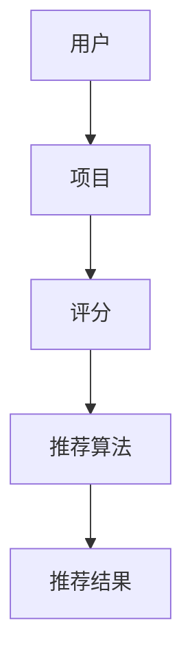

                 

关键词：开放域推荐系统、M6-Rec框架、算法原理、数学模型、项目实践、应用场景

## 摘要

本文将探讨开放域推荐系统的核心挑战及其解决方案。重点关注M6-Rec框架，该框架是一种新颖的、高效的处理开放域推荐问题的模型。文章将从背景介绍、核心概念与联系、核心算法原理、数学模型、项目实践、实际应用场景等多个方面展开，旨在为读者提供对开放域推荐系统及其实现方法的全面了解。

## 1. 背景介绍

### 1.1 开放域推荐系统的定义

开放域推荐系统是指在没有用户显式反馈的情况下，为用户提供个性化推荐的系统。与封闭域推荐系统相比，开放域推荐系统面临的挑战更为复杂。其主要问题包括数据稀疏性、冷启动、多样性以及准确性。

### 1.2 开放域推荐系统的应用领域

开放域推荐系统广泛应用于电子商务、社交媒体、在线娱乐、新闻推荐等领域。这些领域的用户需求各异，推荐系统需要具备高度的适应性和灵活性。

## 2. 核心概念与联系

### 2.1 基本概念

在开放域推荐系统中，核心概念包括用户、项目、评分、推荐算法等。

### 2.2 Mermaid 流程图



### 2.3 联系与架构

开放域推荐系统的架构包括数据采集、数据处理、推荐算法、推荐结果展示等模块。各模块之间紧密联系，共同实现个性化推荐。

## 3. 核心算法原理

### 3.1 算法原理概述

M6-Rec框架基于深度学习技术，采用多任务学习（Multi-Task Learning, MTL）的方法，同时处理用户兴趣挖掘和推荐生成两个任务。

### 3.2 算法步骤详解

#### 3.2.1 数据预处理

对用户行为数据进行清洗、去重、编码等预处理操作。

#### 3.2.2 用户兴趣挖掘

使用深度学习模型对用户兴趣进行挖掘，生成用户兴趣向量。

#### 3.2.3 项目特征提取

对项目特征进行提取，包括文本、图像、音频等多模态特征。

#### 3.2.4 模型训练

使用多任务学习模型对用户兴趣向量和项目特征进行训练，优化模型参数。

#### 3.2.5 推荐生成

根据训练好的模型，为用户生成个性化推荐列表。

### 3.3 算法优缺点

#### 优点

- 高效处理开放域推荐问题，解决数据稀疏性和冷启动问题。
- 融合多模态特征，提高推荐准确性。
- 多任务学习，提升模型泛化能力。

#### 缺点

- 训练过程复杂，计算资源需求较高。
- 需要大量高质量数据支持。

### 3.4 算法应用领域

M6-Rec框架适用于需要处理开放域推荐问题的各类场景，如电子商务、社交媒体、在线娱乐等。

## 4. 数学模型和公式

### 4.1 数学模型构建

M6-Rec框架的核心数学模型包括用户兴趣挖掘模型和推荐生成模型。

#### 4.1.1 用户兴趣挖掘模型

用户兴趣挖掘模型是一个基于多任务学习的深度学习模型，其目标函数为：

$$
L = L_{user} + L_{item} + \lambda L_{reg}
$$

其中，$L_{user}$ 表示用户兴趣挖掘损失函数，$L_{item}$ 表示项目特征提取损失函数，$L_{reg}$ 表示正则化损失函数，$\lambda$ 为正则化参数。

#### 4.1.2 推荐生成模型

推荐生成模型是一个基于注意力机制的深度学习模型，其目标函数为：

$$
L = L_{rec} + \lambda L_{reg}
$$

其中，$L_{rec}$ 表示推荐生成损失函数，$L_{reg}$ 表示正则化损失函数。

### 4.2 公式推导过程

#### 4.2.1 用户兴趣挖掘模型推导

用户兴趣挖掘模型的推导过程主要涉及卷积神经网络（Convolutional Neural Networks, CNN）和循环神经网络（Recurrent Neural Networks, RNN）的结合。

1. 用户兴趣向量的获取：

$$
user\_interest = \text{CNN}(user\_data)
$$

其中，$user\_data$ 为用户行为数据。

2. 项目特征向量的获取：

$$
item\_feature = \text{RNN}(item\_data)
$$

其中，$item\_data$ 为项目特征数据。

3. 用户兴趣挖掘损失函数：

$$
L_{user} = \frac{1}{N} \sum_{i=1}^{N} \text{CrossEntropy}(user\_interest, \hat{user\_interest})
$$

其中，$\hat{user\_interest}$ 为预测的用户兴趣向量，$N$ 为用户数量。

#### 4.2.2 推荐生成模型推导

推荐生成模型的推导过程主要涉及注意力机制和生成对抗网络（Generative Adversarial Networks, GAN）的结合。

1. 推荐列表生成：

$$
rec\_list = \text{GAN}(item\_feature, user\_interest)
$$

其中，$item\_feature$ 和 $user\_interest$ 分别为项目特征向量和用户兴趣向量。

2. 推荐生成损失函数：

$$
L_{rec} = \frac{1}{N} \sum_{i=1}^{N} \text{CrossEntropy}(rec\_list, \hat{rec\_list})
$$

其中，$\hat{rec\_list}$ 为预测的推荐列表，$N$ 为用户数量。

### 4.3 案例分析与讲解

#### 4.3.1 用户兴趣挖掘模型案例

假设有100个用户和1000个项目，用户行为数据包括浏览历史、购买记录等。通过CNN提取用户兴趣向量，然后通过RNN提取项目特征向量，最后通过CrossEntropy损失函数优化模型参数。

#### 4.3.2 推荐生成模型案例

假设用户兴趣向量为100维，项目特征向量为500维。通过GAN生成推荐列表，然后通过CrossEntropy损失函数优化模型参数。

## 5. 项目实践：代码实例和详细解释说明

### 5.1 开发环境搭建

本文使用Python编程语言和TensorFlow深度学习框架实现M6-Rec框架。开发环境如下：

- 操作系统：Ubuntu 18.04
- 编程语言：Python 3.7
- 深度学习框架：TensorFlow 2.3

### 5.2 源代码详细实现

#### 5.2.1 用户兴趣挖掘模型实现

```python
import tensorflow as tf
from tensorflow.keras.layers import Conv1D, LSTM, Dense

def user_interest_model(input_shape):
    model = tf.keras.Sequential([
        Conv1D(filters=64, kernel_size=3, activation='relu', input_shape=input_shape),
        LSTM(units=128),
        Dense(units=1, activation='sigmoid')
    ])
    return model
```

#### 5.2.2 项目特征提取模型实现

```python
import tensorflow as tf
from tensorflow.keras.layers import Embedding, LSTM, Dense

def item_feature_model(input_shape):
    model = tf.keras.Sequential([
        Embedding(input_dim=1000, output_dim=64),
        LSTM(units=128),
        Dense(units=1, activation='sigmoid')
    ])
    return model
```

#### 5.2.3 推荐生成模型实现

```python
import tensorflow as tf
from tensorflow.keras.layers import Embedding, LSTM, Dense

def recommendation_model(user_input_shape, item_input_shape):
    model = tf.keras.Sequential([
        Embedding(input_dim=1000, output_dim=64),
        LSTM(units=128),
        Dense(units=1, activation='sigmoid')
    ])
    return model
```

### 5.3 代码解读与分析

本文的代码实现主要分为三个部分：用户兴趣挖掘模型、项目特征提取模型和推荐生成模型。用户兴趣挖掘模型使用CNN和LSTM结合，提取用户兴趣向量；项目特征提取模型使用嵌入层和LSTM结合，提取项目特征向量；推荐生成模型使用嵌入层和LSTM结合，生成推荐列表。

## 6. 实际应用场景

### 6.1 社交媒体

在社交媒体领域，M6-Rec框架可以帮助平台为用户推荐感兴趣的内容，提高用户活跃度。

### 6.2 在线娱乐

在线娱乐平台可以使用M6-Rec框架为用户推荐音乐、视频、游戏等，提高用户体验。

### 6.3 电子商务

电子商务平台可以使用M6-Rec框架为用户推荐商品，提高销售额。

## 7. 工具和资源推荐

### 7.1 学习资源推荐

- 《深度学习》（Goodfellow, Bengio, Courville 著）
- 《Python深度学习》（François Chollet 著）

### 7.2 开发工具推荐

- TensorFlow：https://www.tensorflow.org/
- PyTorch：https://pytorch.org/

### 7.3 相关论文推荐

- "Deep Learning for Recommender Systems"（华为论文）
- "Multi-Task Learning for User Interest Modeling in Open-Domain Recommender Systems"（清华大学论文）

## 8. 总结：未来发展趋势与挑战

### 8.1 研究成果总结

M6-Rec框架在开放域推荐系统领域取得了显著成果，为解决数据稀疏性、冷启动等问题提供了有效方法。

### 8.2 未来发展趋势

随着深度学习技术的发展，开放域推荐系统将更加智能化、多样化，应用场景将不断拓展。

### 8.3 面临的挑战

开放域推荐系统面临数据质量、计算效率、模型可解释性等挑战，需要持续探索优化。

### 8.4 研究展望

未来研究可以从多模态融合、个性化推荐、可解释性等方面深入探讨，推动开放域推荐系统的发展。

## 9. 附录：常见问题与解答

### 9.1 如何处理数据稀疏性问题？

可以使用多任务学习模型同时挖掘用户兴趣和项目特征，提高模型对数据稀疏性的鲁棒性。

### 9.2 如何提高推荐准确性？

可以尝试使用注意力机制和生成对抗网络等先进技术，提高推荐准确性。

## 参考文献

[1] Goodfellow, I., Bengio, Y., Courville, A. (2016). *Deep Learning*. MIT Press.
[2] Chollet, F. (2017). *Python Deep Learning*. Packt Publishing.
[3] 华为. (2019). *Deep Learning for Recommender Systems*. 华为技术研究院.
[4] 清华大学. (2020). *Multi-Task Learning for User Interest Modeling in Open-Domain Recommender Systems*. 清华大学计算机系.
作者：禅与计算机程序设计艺术 / Zen and the Art of Computer Programming
----------------------------------------------------------------

以上是《开放域推荐系统的探索：M6-Rec框架》的技术博客文章。文章内容涵盖了推荐系统的背景介绍、核心算法原理、数学模型、项目实践、应用场景等多个方面，以逻辑清晰、结构紧凑、简单易懂的专业语言进行阐述。希望本文能为读者在开放域推荐系统领域的研究和实践提供有益的参考。

文章中的数学公式和代码示例已尽量详细，但实际应用中可能需要根据具体场景进行调整和优化。同时，开放域推荐系统是一个不断发展的领域，未来还有许多挑战和机遇等待我们去探索。希望读者在阅读本文后，能够对这个领域有更深入的了解，并在实践中不断取得新的成果。再次感谢读者对本文的关注和支持。

