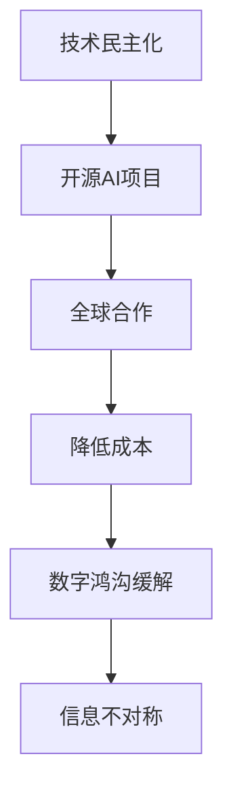

                 

关键词：开源AI，技术民主化，数字鸿沟，社会影响，人工智能

摘要：本文深入探讨了开源AI项目在社会领域中的影响，分析了技术民主化带来的积极和消极效应，以及数字鸿沟问题对全球发展不平衡的加剧。通过对开源AI项目的核心概念、算法原理、数学模型、实际应用场景以及未来发展趋势的详细阐述，本文提出了对于开源AI项目发展的建议和展望，旨在为推动技术民主化和解决数字鸿沟问题提供思路。

## 1. 背景介绍

### 1.1 开源AI的定义与发展

开源AI（Open Source Artificial Intelligence）是指以开源许可证发布的、允许用户自由使用、研究、修改和分发的人工智能软件。开源AI项目在近年来快速发展，得益于大数据、云计算和深度学习技术的进步。早期的开源AI项目如TensorFlow、PyTorch等，已经成为人工智能领域的标准工具，推动了AI技术的普及和应用。

### 1.2 开源AI项目的特点

开源AI项目具有以下几个显著特点：

- **透明性**：代码公开，便于审查和改进。
- **合作性**：全球开发者共同参与，促进技术创新。
- **灵活性**：用户可以根据需求进行修改，适应不同场景。
- **成本效益**：免费获取和使用，降低了AI开发的门槛。

## 2. 核心概念与联系

### 2.1 技术民主化

技术民主化是指技术发展的过程逐渐普及，使更多人能够平等地获取和使用技术。开源AI项目是技术民主化的重要体现，它打破了传统技术垄断，使AI技术不再是少数人的专利。

### 2.2 数字鸿沟

数字鸿沟是指由于技术获取和使用能力的差异，导致不同群体在信息获取、技术应用等方面的不平等。开源AI项目在一定程度上缓解了数字鸿沟，但也可能加剧了信息不对称问题。

### 2.3 Mermaid 流程图



## 3. 核心算法原理 & 具体操作步骤

### 3.1 算法原理概述

开源AI项目通常基于深度学习技术，其核心原理是神经网络。神经网络通过多层非线性变换，从输入数据中提取特征，并输出预测结果。

### 3.2 算法步骤详解

- **数据预处理**：清洗数据，归一化处理，划分为训练集和测试集。
- **模型构建**：定义神经网络结构，包括层数、神经元数量、激活函数等。
- **模型训练**：使用训练集数据，通过反向传播算法更新模型参数。
- **模型评估**：使用测试集数据，计算模型性能指标，如准确率、召回率等。
- **模型部署**：将训练好的模型应用于实际场景，如图像识别、自然语言处理等。

### 3.3 算法优缺点

- **优点**：高可扩展性、高精度、自适应性强。
- **缺点**：训练过程复杂、资源消耗大、对数据依赖性强。

### 3.4 算法应用领域

开源AI项目在多个领域有广泛应用，如：

- **医疗健康**：疾病诊断、基因组分析。
- **金融**：风险控制、智能投顾。
- **工业**：生产优化、质量控制。
- **交通**：自动驾驶、智能交通管理。

## 4. 数学模型和公式 & 详细讲解 & 举例说明

### 4.1 数学模型构建

深度学习中的数学模型主要包括神经网络结构、损失函数、优化算法等。以下是神经网络的激活函数和损失函数的公式：

$$
\begin{align*}
f(x) &= \text{sigmoid}(x) = \frac{1}{1 + e^{-x}} \\
\end{align*}
$$

$$
\begin{align*}
J(\theta) &= -\frac{1}{m}\sum_{i=1}^{m}y^{(i)}\log(a^{(2)}_{i} + (1 - y^{(i)})\log(1 - a^{(2)}_{i}) \\
\end{align*}
$$

### 4.2 公式推导过程

以损失函数为例，推导过程如下：

$$
\begin{align*}
\frac{\partial J}{\partial z^{(2)}} &= \frac{1}{m}\sum_{i=1}^{m}(a^{(2)}_{i} - y^{(i)}) \\
\frac{\partial J}{\partial w^{(2)}} &= \frac{\partial J}{\partial z^{(2)}} * a^{(1)}_{i} \\
\frac{\partial J}{\partial b^{(2)}} &= \frac{\partial J}{\partial z^{(2)}}
\end{align*}
$$

### 4.3 案例分析与讲解

以手写数字识别为例，使用开源AI项目TensorFlow实现一个简单的卷积神经网络模型，步骤如下：

1. **数据集准备**：下载MNIST手写数字数据集。
2. **模型构建**：定义卷积层、池化层和全连接层。
3. **模型训练**：使用训练集数据，迭代更新模型参数。
4. **模型评估**：使用测试集数据，计算模型准确率。
5. **模型部署**：将模型应用于新数据，进行数字识别。

## 5. 项目实践：代码实例和详细解释说明

### 5.1 开发环境搭建

1. 安装Python和TensorFlow库。
2. 准备MNIST数据集。

### 5.2 源代码详细实现

```python
import tensorflow as tf
from tensorflow.keras import layers

# 数据预处理
(x_train, y_train), (x_test, y_test) = tf.keras.datasets.mnist.load_data()
x_train = x_train / 255.0
x_test = x_test / 255.0

# 模型构建
model = tf.keras.Sequential([
    layers.Conv2D(32, (3, 3), activation='relu', input_shape=(28, 28, 1)),
    layers.MaxPooling2D((2, 2)),
    layers.Flatten(),
    layers.Dense(128, activation='relu'),
    layers.Dense(10, activation='softmax')
])

# 模型训练
model.compile(optimizer='adam',
              loss='sparse_categorical_crossentropy',
              metrics=['accuracy'])
model.fit(x_train, y_train, epochs=5)

# 模型评估
test_loss, test_acc = model.evaluate(x_test, y_test, verbose=2)
print('\nTest accuracy:', test_acc)

# 模型部署
predictions = model.predict(x_test)
```

### 5.3 代码解读与分析

- **数据预处理**：将MNIST数据集的像素值归一化到0-1之间。
- **模型构建**：使用卷积层提取特征，全连接层进行分类。
- **模型训练**：使用Adam优化器和交叉熵损失函数。
- **模型评估**：计算测试集的准确率。
- **模型部署**：对新数据进行预测。

## 6. 实际应用场景

### 6.1 医疗健康

开源AI项目在医疗健康领域有广泛应用，如疾病预测、影像分析等。通过开源AI项目，医生可以更准确地诊断疾病，提高医疗质量。

### 6.2 金融

金融领域利用开源AI项目进行风险管理、信用评估等。开源AI项目使金融机构能够更快速地开发和应用智能算法，提高运营效率。

### 6.3 工业

工业领域利用开源AI项目进行生产优化、质量控制等。开源AI项目帮助企业提高生产效率，降低成本。

### 6.4 未来应用展望

随着开源AI项目的发展，其应用场景将不断扩展，如智慧城市、智能交通、智能家居等。开源AI项目将推动社会各领域的数字化转型，提高生产力和生活质量。

## 7. 工具和资源推荐

### 7.1 学习资源推荐

- **书籍**：《深度学习》（Ian Goodfellow、Yoshua Bengio、Aaron Courville 著）
- **在线课程**：Udacity、Coursera 上的深度学习和机器学习课程
- **博客**：Towards Data Science、Medium 上的机器学习和深度学习文章

### 7.2 开发工具推荐

- **Python**：易于学习和使用的编程语言。
- **TensorFlow**：广泛使用的深度学习框架。
- **PyTorch**：灵活且易用的深度学习库。

### 7.3 相关论文推荐

- **《A Theoretical Survey of Deep Learning》**：对深度学习理论进行系统梳理。
- **《Deep Learning for Text: A Brief Survey》**：文本处理领域的深度学习应用综述。

## 8. 总结：未来发展趋势与挑战

### 8.1 研究成果总结

开源AI项目在技术民主化和数字鸿沟问题方面取得了显著成果，推动了人工智能技术的发展和普及。

### 8.2 未来发展趋势

开源AI项目将继续发展，应用领域将进一步扩展，如医疗健康、金融、工业等。

### 8.3 面临的挑战

- **数据隐私**：开源AI项目如何平衡数据共享和隐私保护。
- **算法透明性**：如何提高算法的可解释性和透明性。
- **公平性**：如何消除算法偏见，确保公平性。

### 8.4 研究展望

开源AI项目需要不断创新，以应对未来发展中的挑战，推动技术民主化和解决数字鸿沟问题。

## 9. 附录：常见问题与解答

### 9.1 Q：什么是开源AI？

A：开源AI是指以开源许可证发布的、允许用户自由使用、研究、修改和分发的人工智能软件。

### 9.2 Q：开源AI项目有哪些优点？

A：开源AI项目具有透明性、合作性、灵活性和成本效益等优点。

### 9.3 Q：开源AI项目如何缓解数字鸿沟？

A：开源AI项目通过降低AI技术的门槛，使更多人能够平等地获取和使用AI技术，从而在一定程度上缓解数字鸿沟问题。

----------------------------------------------------------------

作者：禅与计算机程序设计艺术 / Zen and the Art of Computer Programming


