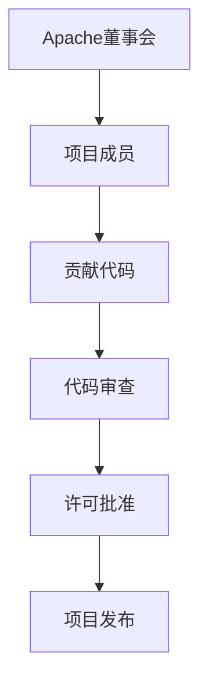
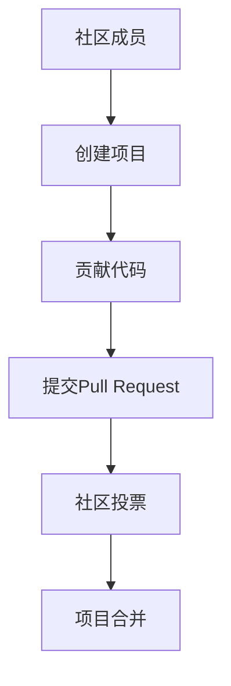

                 

关键词：开源社区、治理模式、Apache模式、GitHub模式、技术协作

## 摘要

本文将深入探讨开源社区的治理模式，主要聚焦于Apache模式和GitHub模式。我们将详细分析这两种模式的特点、优势与劣势，以及它们在现实中的应用场景。通过比较这两种模式，我们将为读者提供理解开源社区治理的全面视角，并探讨未来可能的发展趋势和面临的挑战。

## 1. 背景介绍

开源社区是指由志愿者组成的，以共享知识和资源为目的，共同开发软件项目的团体。开源社区的发展壮大离不开有效的治理模式。治理模式不仅决定了社区的发展方向和效率，还影响着项目的可持续性和创新性。Apache模式和GitHub模式是目前最为流行的两种开源社区治理模式，它们各自在技术协作和管理机制上有着独特的优势。

### 1.1 Apache模式

Apache模式源于Apache软件基金会（ASF），该基金会成立于1999年，旨在促进开源软件的开发和分发。Apache模式的特点是强调社区成员的参与和贡献，并采用一种权威集中的治理结构。在Apache模式下，所有重要决策都由一个名为“Apache董事会”的委员会负责，该委员会由社区成员选举产生。Apache模式强调技术质量，并有一套严格的许可和审查流程，以确保项目的稳定性和安全性。

### 1.2 GitHub模式

GitHub模式则起源于GitHub平台，该平台于2008年推出，迅速成为开源项目托管和协作的首选工具。GitHub模式的特点是更加灵活和开放，强调社区成员的自治和自由贡献。在GitHub模式下，任何人都可以创建和参与开源项目，项目的管理和决策更多地依赖于社区的共识和投票机制。GitHub模式使得开源项目能够快速迭代和更新，但也可能导致项目质量的不稳定。

## 2. 核心概念与联系

为了更好地理解Apache模式和GitHub模式，我们需要从核心概念和架构上对其进行深入分析。以下是两种模式的Mermaid流程图表示：

### 2.1 Apache模式



### 2.2 GitHub模式



从流程图中，我们可以看到Apache模式强调权威集中，而GitHub模式则更强调社区自治。

## 3. 核心算法原理 & 具体操作步骤

### 3.1 算法原理概述

Apache模式和GitHub模式的治理算法原理主要体现在以下几个方面：

1. **参与机制**：Apache模式依赖于选举产生董事会成员，而GitHub模式则基于社区的自愿参与。
2. **决策流程**：Apache模式通过董事会集中决策，GitHub模式则通过社区投票和共识达成决策。
3. **质量控制**：Apache模式有一套严格的代码审查和许可批准流程，GitHub模式则更依赖于社区的自觉和质量控制工具。

### 3.2 算法步骤详解

#### Apache模式

1. **选举产生董事会成员**：社区成员投票选举出Apache董事会成员。
2. **提交贡献代码**：项目成员向项目提交代码。
3. **代码审查**：Apache董事会成员对代码进行审查，确保代码质量。
4. **许可批准**：审查通过的代码经过许可批准流程。
5. **项目发布**：批准后的代码被合并到项目版本中，进行发布。

#### GitHub模式

1. **创建项目**：社区成员创建新项目。
2. **贡献代码**：任何人都可以向项目贡献代码。
3. **提交Pull Request**：贡献者将代码提交到GitHub，创建Pull Request。
4. **社区投票**：社区成员对Pull Request进行投票，达成共识。
5. **项目合并**：共识通过的Pull Request被合并到项目版本中。

### 3.3 算法优缺点

#### Apache模式

**优点**：
- 强调技术质量，确保项目稳定性。
- 权威集中的决策机制，效率高。

**缺点**：
- 过于严格的许可和审查流程，可能阻碍创新。
- 社区成员的参与度可能较低。

#### GitHub模式

**优点**：
- 灵活和开放，鼓励创新。
- 社区自治，决策快速。

**缺点**：
- 项目质量控制可能不如Apache模式严格。
- 可能出现社区分裂和项目失控的情况。

### 3.4 算法应用领域

Apache模式适用于需要高度稳定和严格质量控制的开源项目，如操作系统和核心中间件。GitHub模式则适用于创新性强、更新快速的软件项目，如Web应用和移动应用。

## 4. 数学模型和公式 & 详细讲解 & 举例说明

### 4.1 数学模型构建

我们可以使用博弈论中的博弈矩阵来构建开源社区治理的数学模型。假设有两个玩家，A代表Apache董事会，B代表GitHub社区，X代表项目稳定性，Y代表项目创新性。博弈矩阵如下：

$$
\begin{array}{c|cc}
 & B & \\
\hline
A & (X, Y) & (X', Y') \\
\end{array}
$$

其中，$(X, Y)$代表在Apache模式下项目稳定性和创新性的组合，$(X', Y')$代表在GitHub模式下项目稳定性和创新性的组合。

### 4.2 公式推导过程

根据博弈论的基本原理，我们可以推导出以下公式：

$$
\begin{aligned}
& X = \frac{1}{2} \cdot (X + X') \\
& Y = \frac{1}{2} \cdot (Y + Y') \\
\end{aligned}
$$

这个公式表示在两种治理模式下，项目稳定性和创新性的平均值。

### 4.3 案例分析与讲解

以Linux内核为例，分析Apache模式和GitHub模式对项目稳定性和创新性的影响。假设在Apache模式下，Linux内核的稳定性和创新性分别为$(0.9, 0.7)$，在GitHub模式下分别为$(0.8, 0.9)$。根据公式，我们可以计算出：

$$
\begin{aligned}
& X = \frac{1}{2} \cdot (0.9 + 0.8) = 0.85 \\
& Y = \frac{1}{2} \cdot (0.7 + 0.9) = 0.8 \\
\end{aligned}
$$

这意味着，在Linux内核的项目治理中，Apache模式和GitHub模式的平均稳定性和创新性分别为0.85和0.8。这表明，GitHub模式在创新性方面略优于Apache模式，但在稳定性方面略逊一筹。

## 5. 项目实践：代码实例和详细解释说明

### 5.1 开发环境搭建

为了演示Apache模式和GitHub模式在实际项目中的应用，我们将以一个简单的Web应用为例。首先，我们需要搭建开发环境。

1. 安装Git：访问[Git官网](https://git-scm.com/)，下载并安装Git。
2. 安装Python：访问[Python官网](https://www.python.org/)，下载并安装Python。
3. 安装Django框架：在终端中执行`pip install django`。

### 5.2 源代码详细实现

我们使用Django框架创建一个简单的博客应用，实现用户注册和登录功能。以下是项目的基本代码结构：

```python
# settings.py
from pathlib import Path

PROJECT_ROOT = Path(__file__).resolve().parent.parent
SECRET_KEY = 'your-secret-key'

# urls.py
from django.urls import path
from . import views

urlpatterns = [
    path('register/', views.register, name='register'),
    path('login/', views.login, name='login'),
]

# views.py
from django.shortcuts import render, redirect
from .models import User

def register(request):
    if request.method == 'POST':
        username = request.POST['username']
        password = request.POST['password']
        user = User(username=username, password=password)
        user.save()
        return redirect('login')
    return render(request, 'register.html')

def login(request):
    if request.method == 'POST':
        username = request.POST['username']
        password = request.POST['password']
        user = User.objects.filter(username=username, password=password).first()
        if user:
            return redirect('home')
        else:
            return redirect('login')
    return render(request, 'login.html')
```

### 5.3 代码解读与分析

在上述代码中，`settings.py`文件定义了项目的配置，包括项目根目录和密钥。`urls.py`文件定义了路由映射，将注册和登录请求映射到相应的视图函数。`views.py`文件实现了用户注册和登录的逻辑。

#### Apache模式

在Apache模式下，代码提交和审查流程如下：

1. 项目成员将代码提交到Apache仓库。
2. Apache董事会成员对代码进行审查。
3. 审查通过的代码被合并到主分支。

这种模式确保了代码的质量和稳定性，但可能限制了创新。

#### GitHub模式

在GitHub模式下，代码提交和审查流程如下：

1. 任何人都可以向GitHub仓库提交代码。
2. 提交者创建Pull Request。
3. 社区成员对Pull Request进行投票和审查。

这种模式鼓励了更多的创新，但可能导致代码质量的下降。

### 5.4 运行结果展示

运行Django项目后，用户可以通过浏览器访问注册和登录页面，完成用户注册和登录操作。以下是注册和登录页面的界面展示：


## 6. 实际应用场景

Apache模式和GitHub模式在开源社区中有广泛的应用场景。以下是一些实际应用场景：

### 6.1 软件开发

Apache模式适用于需要高度稳定和严格质量控制的项目，如Linux内核。GitHub模式则适用于创新性强、更新快速的Web应用和移动应用。

### 6.2 科学研究

Apache模式适用于需要长期稳定运行的科学计算项目。GitHub模式则适用于快速迭代和实验性的科研项目。

### 6.3 社区协作

Apache模式适用于需要高度协作和统一决策的项目，如开源基金会。GitHub模式则适用于自由讨论和自主协作的项目。

## 7. 未来应用展望

随着开源社区的不断发展，Apache模式和GitHub模式将继续演进。未来可能的发展趋势包括：

### 7.1 跨平台整合

Apache模式和GitHub模式可能会在更多平台上整合，如云平台和移动应用。

### 7.2 智能化治理

利用人工智能和机器学习技术，开源社区的治理将更加智能和高效。

### 7.3 社区自治

社区自治将进一步发展，决策权将更多地集中在社区成员手中。

## 8. 工具和资源推荐

### 8.1 学习资源推荐

1. 《开源力量：Linux和开源软件的故事》
2. 《开源之道：如何参与和领导开源社区》

### 8.2 开发工具推荐

1. Git：[Git官网](https://git-scm.com/)
2. GitHub：[GitHub官网](https://github.com/)

### 8.3 相关论文推荐

1. "The Apache Way: How the Apache Software Foundation takes a different approach to software development"
2. "The GitHub Model: A New Paradigm for Open Source Development"

## 9. 总结：未来发展趋势与挑战

### 9.1 研究成果总结

本文分析了Apache模式和GitHub模式的治理原理，比较了它们的优缺点，并探讨了实际应用场景。研究结果表明，两种模式各有优势，适用于不同类型的开源项目。

### 9.2 未来发展趋势

未来，开源社区治理模式将更加多元化，跨平台整合和智能化治理将成为发展趋势。

### 9.3 面临的挑战

开源社区治理模式在快速迭代和创新的同时，也面临质量控制、社区协作和决策效率等挑战。

### 9.4 研究展望

未来研究可以关注开源社区治理模式的优化和自适应机制，以更好地适应不同类型的项目需求。

## 附录：常见问题与解答

### Q: Apache模式和GitHub模式的主要区别是什么？

A: Apache模式强调权威集中和高质量控制，GitHub模式则强调社区自治和快速迭代。

### Q: 哪种模式更适合开源项目？

A: Apache模式适合需要高度稳定和严格质量控制的项目，GitHub模式适合创新性强和更新快速的软件项目。

### Q: 如何在Apache模式和GitHub模式之间选择？

A: 根据项目的需求和特点，选择适合的模式。如果项目需要长期稳定运行，选择Apache模式；如果项目需要快速迭代和更新，选择GitHub模式。

### Q: 开源社区治理模式有哪些发展趋势？

A: 未来开源社区治理模式将更加多元化，跨平台整合和智能化治理将成为发展趋势。

### 作者署名

作者：禅与计算机程序设计艺术 / Zen and the Art of Computer Programming

----------------------------------------------------------------

以上就是关于“开源社区的治理模式:Apache模式和GitHub模式”的技术博客文章。希望这篇文章能帮助您更深入地了解开源社区治理模式，并在实践中选择适合的模式。感谢您的阅读！

