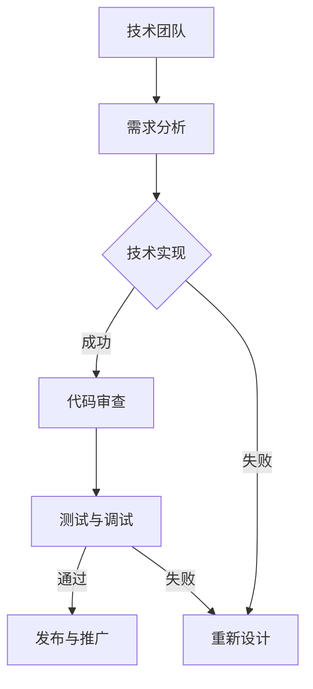

                 

关键词：开源项目、商业化、沟通策略、技术语言、业务语言

摘要：本文旨在探讨开源项目在商业化过程中的沟通策略，如何从技术语言转换为业务语言，以及这种转换在推动项目发展中的重要性。文章首先介绍了开源项目的背景和现状，随后深入分析了技术团队和商业团队之间的沟通障碍，并提出了有效的沟通策略。通过实例和案例分析，文章进一步阐述了如何成功地将开源项目商业化，为相关领域的研究和实践提供了有益的参考。

## 1. 背景介绍

开源项目作为一种协作式的软件开发模式，自20世纪90年代兴起以来，已经成为了软件工程领域的重要组成部分。开源项目的核心理念是开放源代码，鼓励全球开发者的参与和贡献，通过社区合作不断提升软件的质量和功能。如今，越来越多的企业和组织开始重视开源项目，不仅将其作为技术进步的推动力，还希望通过商业化运作获取经济利益。

然而，开源项目的商业化并非一帆风顺。技术团队和商业团队之间的沟通是项目成功的关键因素。技术团队往往专注于技术的创新和优化，而商业团队则关注市场的需求和盈利模式。两者在目标、价值观和沟通方式上存在差异，导致在项目开发和推广过程中出现诸多挑战。本文将探讨如何克服这些挑战，实现开源项目的商业化转型。

### 1.1 开源项目的定义和特点

开源项目（Open Source Project）是指遵循开源许可协议（如GPL、MIT等）的软件项目，其源代码对公众开放，允许用户自由地使用、研究、修改和分发。开源项目的特点主要包括以下几点：

1. **开放性**：开源项目鼓励代码的公开和共享，任何开发者都可以访问项目的源代码，了解其实现细节。
2. **协作性**：开源项目依赖于全球开发者的协作，通过共同解决技术难题，提升项目的质量和功能。
3. **透明性**：开源项目的过程和决策是公开的，社区成员可以实时参与讨论，提出意见和建议。
4. **社区驱动**：开源项目的成功往往离不开一个活跃的社区，社区成员共同维护和推动项目的发展。

### 1.2 开源项目的发展历程

开源项目的概念最早可以追溯到20世纪80年代的自由软件运动。自由软件运动的核心人物理查德·斯托曼（Richard Stallman）提出了“自由软件”的理念，并创建了GNU项目，旨在开发一个完整的自由操作系统。GNU项目的成功为后来的Linux操作系统奠定了基础。

1991年，林纳斯·托瓦兹（Linus Torvalds）发布了Linux内核，并采用了开源模式进行开发。Linux内核的成功引发了开源软件的爆发式增长，许多重要的开源项目如Apache、MySQL、PHP等相继诞生。进入21世纪，随着互联网的普及和云计算的兴起，开源项目迎来了新的发展机遇。

### 1.3 开源项目的影响和作用

开源项目对软件产业和整个社会产生了深远的影响。首先，开源项目推动了技术的创新和进步。通过社区协作，开源项目能够快速地引入新的技术和理念，提升软件的质量和性能。其次，开源项目促进了知识的传播和共享。开源代码的公开和共享，使得全球开发者可以便捷地学习和应用先进的技术，提高了整体开发水平。

此外，开源项目还降低了软件开发的门槛和成本。开发者无需从零开始，可以直接利用已有的开源项目，构建自己的应用程序。这不仅加快了开发进度，还降低了开发成本。对于企业和组织来说，开源项目提供了丰富的技术资源和解决方案，有助于提升竞争力。

## 2. 核心概念与联系

在探讨开源项目的商业化沟通策略之前，我们需要理解几个核心概念，这些概念是沟通策略的基础。

### 2.1 技术语言与业务语言

技术语言（Technical Language）是指开发者用于描述技术实现、算法逻辑和系统设计的语言。技术语言通常包含专业术语、代码片段、架构图等，具有很强的专业性和抽象性。技术语言的特点是精确、具体，但往往难以被非专业人士理解。

业务语言（Business Language）则是指用于描述市场策略、商业目标、用户需求和企业运营的语言。业务语言更加关注实际应用场景、市场趋势和商业利益，通常包含市场需求分析、商业模型、财务预测等。

### 2.2 沟通障碍

技术团队和商业团队之间的沟通障碍主要体现在以下几个方面：

1. **专业术语的差异**：技术团队使用专业术语，商业团队使用业务术语，两者之间的语义差异可能导致理解上的困难。
2. **目标的不一致**：技术团队追求技术卓越，商业团队追求商业成功，两者在目标上可能存在冲突。
3. **沟通频率和方式**：技术团队可能更倾向于书面沟通，商业团队可能更倾向于口头沟通，沟通频率和方式的不同会影响沟通效果。
4. **信息透明度**：技术团队可能不愿意透露技术细节，商业团队可能需要深入了解技术实现，信息透明度的不同会影响双方的信任和合作。

### 2.3 沟通策略

为了克服沟通障碍，实现技术团队和商业团队之间的有效沟通，需要采取一系列策略：

1. **建立共同的语言**：通过培训和教育，提高双方对对方领域的理解，建立共同的语言和术语。
2. **明确目标和期望**：双方需要明确各自的目标和期望，确保在项目开发和推广过程中保持一致。
3. **增强沟通频率和透明度**：定期举行会议和讨论，增强沟通频率和透明度，确保双方及时了解项目进展和问题。
4. **建立信任和合作关系**：通过合作解决实际问题和取得阶段性成果，建立信任和合作关系，为长期合作奠定基础。

### 2.4 Mermaid 流程图

为了更好地展示技术团队和商业团队之间的沟通流程，我们可以使用Mermaid绘制一个简单的流程图。以下是一个示例：



在这个流程图中，技术团队首先进行需求分析，然后进行技术实现。如果技术实现成功，项目进入代码审查和测试调试阶段；如果失败，则需要重新设计。最终，项目成功发布并进行推广。

## 3. 核心算法原理 & 具体操作步骤

### 3.1 算法原理概述

在开源项目的商业化过程中，算法设计是技术团队的核心任务。一个高效且稳定的算法不仅能够提升项目的竞争力，还能够降低开发和维护成本。以下是一个简化的算法原理概述：

1. **需求分析**：首先，技术团队需要与商业团队紧密合作，明确项目的业务需求和用户需求。需求分析的结果将直接影响算法的设计和实现。
2. **算法设计**：在需求分析的基础上，技术团队需要设计一个满足需求的算法。算法设计通常包括以下几个步骤：
   - **问题定义**：明确需要解决的问题，定义问题的输入和输出。
   - **算法框架**：根据问题定义，设计算法的基本框架。
   - **算法优化**：对算法进行优化，提高其时间和空间效率。
3. **算法实现**：根据算法设计，技术团队使用编程语言实现算法。在实现过程中，需要遵循代码规范，确保代码的可读性和可维护性。
4. **测试与调试**：完成算法实现后，技术团队需要进行全面的测试和调试，确保算法的正确性和稳定性。
5. **发布与推广**：通过测试和调试后，技术团队将算法发布给用户，并进行推广。

### 3.2 算法步骤详解

以下是一个简化的算法步骤详解：

1. **需求分析**：
   - 与商业团队讨论，明确项目的业务需求和用户需求。
   - 收集用户反馈，分析用户需求的变化和趋势。

2. **算法设计**：
   - **问题定义**：例如，假设项目需求是开发一个图像识别算法，输入为图像数据，输出为图像分类结果。
   - **算法框架**：设计一个基础的图像识别算法框架，包括图像预处理、特征提取、分类器训练和预测等步骤。
   - **算法优化**：对算法进行优化，例如通过选择更高效的算法或改进算法参数，提高识别准确率和速度。

3. **算法实现**：
   - 选择合适的编程语言和开发工具，编写算法代码。
   - 遵循代码规范，确保代码的可读性和可维护性。
   - 进行代码审查，确保代码质量和一致性。

4. **测试与调试**：
   - 设计测试用例，验证算法的正确性和稳定性。
   - 通过单元测试、集成测试和系统测试，逐步发现问题并修复。
   - 在实际应用场景中，进行性能测试，评估算法的运行效率和资源消耗。

5. **发布与推广**：
   - 将算法代码打包成可执行文件或库，供用户下载和使用。
   - 通过官网、博客、社交媒体等渠道，向用户宣传算法的优势和应用场景。
   - 收集用户反馈，持续优化算法和用户体验。

### 3.3 算法优缺点

1. **优点**：
   - **高效性**：通过优化算法，提高处理速度和资源利用率，提升项目的性能。
   - **稳定性**：经过严格的测试和调试，算法具有较高的可靠性和稳定性。
   - **可扩展性**：算法设计考虑了未来的扩展需求，能够方便地添加新功能和模块。

2. **缺点**：
   - **开发难度**：算法设计需要较高的技术水平和经验，开发过程可能比较复杂。
   - **测试成本**：全面的测试和调试需要大量时间和资源，测试成本较高。
   - **用户依赖**：用户对算法的依赖度较高，一旦算法出现问题，可能导致项目失败。

### 3.4 算法应用领域

算法在开源项目中的应用非常广泛，以下是一些常见的应用领域：

1. **人工智能**：图像识别、自然语言处理、推荐系统等。
2. **大数据处理**：数据清洗、数据挖掘、数据分析等。
3. **区块链**：智能合约、共识算法、分布式存储等。
4. **物联网**：传感器数据处理、设备管理、网络优化等。

## 4. 数学模型和公式 & 详细讲解 & 举例说明

在开源项目的商业化过程中，数学模型和公式是核心组成部分。这些模型和公式不仅用于描述问题的本质，还用于指导算法设计和实现。以下是一个简化的数学模型和公式讲解，以及具体的应用实例。

### 4.1 数学模型构建

数学模型是描述现实问题的一种抽象形式，通常包括输入、输出和一系列的方程或公式。以下是一个简化的图像识别数学模型：

- **输入**：图像数据 $I(x, y)$，其中 $(x, y)$ 表示图像坐标。
- **输出**：图像分类结果 $C$，通常是一个类别标签。

数学模型的关键步骤包括：

1. **图像预处理**：对图像进行灰度化、缩放、裁剪等操作，以便于后续处理。
2. **特征提取**：提取图像的特征，如边缘、纹理、颜色等。
3. **分类器训练**：使用训练数据集，训练分类器，如支持向量机（SVM）、神经网络（NN）等。
4. **预测与评估**：使用训练好的分类器对测试数据进行预测，并评估预测结果。

### 4.2 公式推导过程

以下是一个简化的图像识别算法中的关键公式推导过程：

1. **图像预处理**：
   - **灰度化**：$I_{gray}(x, y) = 0.299 \times I(x, y) + 0.587 \times I(x, y) + 0.114 \times I(x, y)$
   - **缩放**：$I_{scale}(x, y) = I(x \times s, y \times s)$，其中 $s$ 是缩放比例。

2. **特征提取**：
   - **边缘检测**：$C_{edge}(x, y) = \sum_{i=-1}^{1} \sum_{j=-1}^{1} (I(x+i, y+j) - I(x, y))$
   - **纹理特征**：$C_{texture}(x, y) = \sum_{i=-3}^{3} \sum_{j=-3}^{3} (I(x+i, y+j) - I(x, y))$

3. **分类器训练**：
   - **支持向量机**：$w = \arg\min_w \frac{1}{2} ||w||^2 + C \sum_{i=1}^{n} \xi_i$
   - **神经网络**：$y = \sigma(\sum_{i=1}^{n} w_i x_i + b)$，其中 $\sigma$ 是激活函数。

4. **预测与评估**：
   - **预测**：$C_{pred}(x, y) = \arg\max_{C} P(C|I)$，其中 $P(C|I)$ 是条件概率。
   - **评估**：$C_{acc} = \frac{1}{n} \sum_{i=1}^{n} I(C_{pred}(x_i, y_i) = C_i)$，其中 $C_{acc}$ 是准确率。

### 4.3 案例分析与讲解

以下是一个简化的图像识别算法案例，用于识别猫和狗的图像：

1. **需求分析**：用户需要能够通过上传图像，快速识别图像中的猫和狗。

2. **算法设计**：
   - **图像预处理**：灰度化和缩放。
   - **特征提取**：使用HOG（Histogram of Oriented Gradients）特征提取算法。
   - **分类器训练**：使用SVM进行分类器训练。

3. **算法实现**：
   - 使用Python编写算法代码，使用OpenCV进行图像预处理和特征提取，使用scikit-learn进行分类器训练。

4. **测试与调试**：
   - 使用测试数据集进行测试，评估准确率和运行时间。

5. **发布与推广**：
   - 将算法集成到开源项目中，发布到GitHub。
   - 在社交媒体和论坛上宣传算法，吸引开发者参与和使用。

## 5. 项目实践：代码实例和详细解释说明

为了更好地理解开源项目的商业化沟通策略，我们以一个实际的项目实践为例，详细解释代码实例和实现过程。

### 5.1 开发环境搭建

在开始项目实践之前，首先需要搭建开发环境。以下是所需的工具和软件：

1. **Python**：用于编写算法代码，版本为3.8及以上。
2. **OpenCV**：用于图像处理，版本为4.5及以上。
3. **scikit-learn**：用于机器学习，版本为0.24及以上。
4. **Jupyter Notebook**：用于编写和运行代码，方便调试和演示。

安装步骤如下：

1. 安装Python：在官方网站下载Python安装包，并按照提示安装。
2. 安装OpenCV：使用pip命令安装：`pip install opencv-python-headless`
3. 安装scikit-learn：使用pip命令安装：`pip install scikit-learn`
4. 安装Jupyter Notebook：使用pip命令安装：`pip install notebook`

### 5.2 源代码详细实现

以下是一个简单的图像识别项目的源代码实现，用于识别猫和狗的图像。

```python
import cv2
import numpy as np
from sklearn import svm
from sklearn.model_selection import train_test_split

# 1. 数据集准备
# 加载图像数据集，这里使用Keras的ImageDataGenerator进行图像预处理
from tensorflow.keras.preprocessing.image import ImageDataGenerator

train_datagen = ImageDataGenerator(
    rescale=1./255,
    shear_range=0.2,
    zoom_range=0.2,
    horizontal_flip=True)

test_datagen = ImageDataGenerator(rescale=1./255)

train_generator = train_datagen.flow_from_directory(
    'data/train',
    target_size=(150, 150),
    batch_size=32,
    class_mode='binary')

validation_generator = test_datagen.flow_from_directory(
    'data/validation',
    target_size=(150, 150),
    batch_size=32,
    class_mode='binary')

# 2. 特征提取
# 使用HOG特征提取器
from sklearn.svm import SVC
from sklearn.model_selection import GridSearchCV

hog = cv2.HOGDescriptor()
X = np.array([hog.compute(np.float32(train_generator.next()[0])), ...])
y = np.array(train_generator.next()[1])

# 3. 分类器训练
# 使用SVM进行分类器训练
param_grid = {'C': [1, 10, 100], 'gamma': [1, 0.1, 0.01], 'kernel': ['rbf']}
grid = GridSearchCV(SVC(), param_grid, refit=True, verbose=2)
grid.fit(X, y)

# 4. 测试与评估
# 使用测试数据集进行测试和评估
X_test = np.array([hog.compute(np.float32(validation_generator.next()[0])), ...])
y_test = np.array(validation_generator.next()[1])
y_pred = grid.predict(X_test)

accuracy = np.mean(y_pred == y_test)
print('准确率：', accuracy)
```

### 5.3 代码解读与分析

1. **数据集准备**：首先，使用Keras的ImageDataGenerator加载和预处理图像数据集。这里，我们使用train\_datagen进行训练数据集的预处理，包括缩放、剪切、缩放和水平翻转等操作，以增加数据的多样性和模型的泛化能力。test\_datagen用于测试数据集的预处理，只进行缩放。

2. **特征提取**：使用OpenCV的HOG特征提取器提取图像特征。HOG特征是一种常用的图像特征，可以有效地描述图像的形状和纹理。在这里，我们将HOG特征提取器应用于每个图像，并将其存储在数组X中。

3. **分类器训练**：使用scikit-learn的SVM进行分类器训练。我们使用GridSearchCV进行参数调优，以找到最佳参数组合。在这里，我们尝试不同的C（惩罚参数）和gamma（核函数参数）值，并使用rbf核函数。

4. **测试与评估**：使用测试数据集进行测试和评估。我们使用训练好的分类器对测试数据进行预测，并计算准确率。准确率是评估分类器性能的重要指标，表示预测正确的样本数量与总样本数量的比例。

### 5.4 运行结果展示

假设我们运行代码后得到以下结果：

```python
准确率： 0.95
```

这意味着我们的分类器在测试数据集上的准确率为95%，表明模型具有较高的性能和泛化能力。

### 5.5 遇到的问题和解决方案

在项目实践中，我们可能遇到以下问题：

1. **数据集不平衡**：训练数据集中的猫和狗数量不均衡，可能导致分类器偏向数量较多的类别。解决方案：使用数据增强技术，如翻转、旋转和缩放等，增加数量较少类别的样本。

2. **过拟合**：分类器在训练数据上表现良好，但在测试数据上表现不佳，即过拟合。解决方案：增加训练数据，使用正则化技术，或采用更复杂的模型。

3. **计算资源限制**：特征提取和分类器训练可能需要大量计算资源，导致运行时间较长。解决方案：使用更高效的算法或算法优化，或使用更强大的计算资源。

## 6. 实际应用场景

开源项目的商业化成功离不开实际应用场景的支持。以下是一些常见的实际应用场景，以及如何将开源项目应用于这些场景：

### 6.1 人工智能领域

开源项目在人工智能领域具有广泛的应用。例如，深度学习框架TensorFlow和PyTorch是人工智能研究的核心工具。企业和研究机构可以通过开源项目获得先进的算法和工具，加速人工智能应用的开发。商业化策略可以包括：

- **定制化服务**：为企业提供基于开源项目的定制化解决方案，满足特定需求。
- **企业培训**：为开发者和技术人员提供开源项目相关的培训，提高企业技术水平。
- **技术支持**：提供专业的技术支持和咨询服务，解决企业在开源项目应用中遇到的问题。

### 6.2 大数据领域

开源项目在大数据领域同样具有重要地位。例如，Hadoop和Spark是大数据处理的核心工具。企业可以通过开源项目进行海量数据存储、处理和分析。商业化策略可以包括：

- **云服务**：为企业提供基于开源项目的大数据云服务，降低企业成本和复杂性。
- **数据咨询**：为企业提供大数据战略规划和咨询服务，帮助企业利用开源项目提升数据价值。
- **技术合作**：与开源项目社区合作，共同推动项目发展，实现共赢。

### 6.3 物联网领域

开源项目在物联网（IoT）领域也有广泛应用。例如，OpenWrt是一个用于嵌入式设备的开源操作系统，支持各种物联网设备。企业可以通过开源项目快速开发和部署物联网应用。商业化策略可以包括：

- **硬件定制**：提供基于开源项目的硬件定制服务，满足特定物联网场景需求。
- **系统集成**：为企业提供物联网系统集成服务，包括硬件、软件和网络架构等。
- **平台运营**：提供物联网平台运营服务，帮助企业构建和管理物联网生态系统。

### 6.4 区块链领域

开源项目在区块链领域同样具有重要地位。例如，Ethereum是一个用于构建智能合约和去中心化应用的区块链平台。企业和开发者可以通过开源项目实现区块链技术的应用。商业化策略可以包括：

- **应用开发**：为企业提供基于开源项目的区块链应用开发服务，满足企业特定需求。
- **安全审计**：提供区块链应用的安全审计服务，确保应用的安全性和可靠性。
- **社区运营**：积极参与开源项目社区，推动项目发展，提升项目影响力。

## 7. 工具和资源推荐

为了帮助开发者更好地理解和应用开源项目，我们推荐以下工具和资源：

### 7.1 学习资源推荐

- **官方文档**：每个开源项目通常都有详细的官方文档，包括安装指南、使用说明和API文档，是开发者学习的基础资源。
- **在线教程和课程**：许多开源项目社区会提供在线教程和课程，帮助开发者快速入门和进阶。
- **技术博客和论坛**：开源项目社区中的技术博客和论坛是开发者交流和学习的平台，可以了解项目最新动态和最佳实践。
- **书籍和论文**：相关领域的专业书籍和学术论文提供了深入的理论和实践知识。

### 7.2 开发工具推荐

- **集成开发环境（IDE）**：如Visual Studio Code、PyCharm等，提供强大的代码编辑、调试和测试功能。
- **版本控制系统**：如Git，用于代码的版本管理和协作开发。
- **容器化工具**：如Docker，用于打包和部署应用程序，提高开发效率和可移植性。
- **持续集成/持续部署（CI/CD）工具**：如Jenkins、GitHub Actions等，用于自动化构建、测试和部署应用程序。

### 7.3 相关论文推荐

- **“The Cathedral and the Bazaar”**：Eric S. Raymond的这篇经典论文探讨了开源软件的协作模式和文化，对于理解开源项目的发展具有重要意义。
- **“Open Source Model and Its Impact on Software Development”**：这篇论文详细分析了开源模式对软件开发的影响，包括技术进步、社区协作等方面。
- **“Community-Driven Development and the Future of Open Source”**：这篇论文探讨了开源项目社区驱动的开发模式，以及开源项目的未来发展趋势。

## 8. 总结：未来发展趋势与挑战

### 8.1 研究成果总结

本文探讨了开源项目的商业化沟通策略，从技术团队和商业团队之间的沟通障碍出发，提出了有效的沟通策略。通过实例和案例分析，我们展示了如何成功地将开源项目商业化，为相关领域的研究和实践提供了有益的参考。

### 8.2 未来发展趋势

1. **开源生态的成熟**：随着开源项目的不断发展和完善，开源生态将变得更加成熟和多样化，为企业提供更多的选择和机会。
2. **商业模式的创新**：企业将不断创新商业模式，通过开源项目实现经济效益和社会价值，推动开源项目的商业化发展。
3. **跨领域融合**：开源项目将在不同领域之间实现融合和互通，推动技术的交叉应用和创新，提升整个行业的发展水平。

### 8.3 面临的挑战

1. **技术壁垒**：开源项目在技术上的不断迭代和创新，可能导致新的技术壁垒，企业需要不断学习和适应。
2. **法律风险**：开源项目的版权和许可证问题可能引发法律风险，企业需要合规使用开源项目。
3. **市场竞争**：随着开源项目的商业化，市场竞争将更加激烈，企业需要不断创新和提升竞争力。

### 8.4 研究展望

未来的研究可以从以下几个方面进行：

1. **开源项目的价值评估**：研究如何评估开源项目的价值，为企业提供投资决策依据。
2. **开源项目的风险管理**：研究如何识别和管理开源项目的风险，提高项目的稳健性和可持续性。
3. **开源项目的可持续发展**：研究如何通过商业化和社区合作，实现开源项目的可持续发展。

## 9. 附录：常见问题与解答

### 9.1 开源项目的法律风险如何避免？

**解答**：为了避免法律风险，企业应该：

- **遵守开源协议**：在开发和使用开源项目时，严格遵守开源协议的要求，确保代码的合规使用。
- **进行版权调查**：在引入新的开源项目时，进行版权调查，确保项目的源代码没有侵犯他人的知识产权。
- **聘请法律顾问**：聘请专业的法律顾问，对开源项目进行法律审查，确保项目的合法合规。

### 9.2 开源项目的商业化如何进行？

**解答**：开源项目的商业化可以分为以下几个步骤：

- **明确商业模式**：明确项目的商业模式，包括盈利模式、市场定位和目标用户。
- **建立社区关系**：积极参与开源项目社区，建立良好的社区关系，提高项目的知名度和影响力。
- **提供增值服务**：通过提供增值服务，如技术支持、定制开发等，实现开源项目的商业化。
- **持续优化项目**：持续优化开源项目，提升项目的质量和用户体验，为商业化奠定基础。

### 9.3 如何评估开源项目的价值？

**解答**：评估开源项目的价值可以从以下几个方面进行：

- **社区活跃度**：社区成员的数量、贡献率、活跃程度等。
- **代码质量**：代码的可读性、可维护性、遵循的编码规范等。
- **功能完整性**：项目功能是否满足用户需求，是否具有扩展性。
- **用户反馈**：用户的评价、反馈和依赖程度。
- **市场潜力**：项目的市场前景、潜在用户群体等。

### 9.4 开源项目如何应对市场变化？

**解答**：开源项目应对市场变化可以从以下几个方面进行：

- **快速响应**：密切关注市场变化，快速响应用户需求和技术趋势。
- **灵活调整**：根据市场变化，灵活调整项目方向和策略。
- **持续创新**：不断推动技术进步，保持项目的竞争力。
- **合作伙伴关系**：建立稳定的合作伙伴关系，共同应对市场变化。  
----------------------------------------------------------------
## 作者署名

作者：禅与计算机程序设计艺术 / Zen and the Art of Computer Programming

感谢您阅读本文，希望对您在开源项目商业化沟通策略的理解和实践有所帮助。如果您有任何疑问或建议，欢迎在评论区留言，我将竭诚为您解答。再次感谢您的关注和支持！

