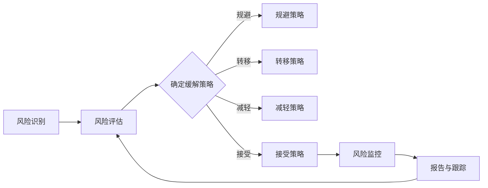

                 

关键词：开源项目，商业化风险管理，风险识别，Mitigation策略，商业成功

> 摘要：本文探讨了开源项目在商业化过程中的风险管理，特别是在识别和缓解潜在风险方面的策略。通过分析开源项目面临的独特挑战和风险，本文提供了详细的方法和工具，帮助开源项目团队有效地管理这些风险，确保项目的商业成功。

## 1. 背景介绍

开源项目，作为一种以共享代码为核心的开发模式，正在全球范围内迅速普及。其核心特点是开放性、协作性和透明性。然而，这些特点也为商业化带来了独特的挑战。商业公司通常希望通过开源项目获取技术优势、降低开发成本、吸引开发者社区等，但同时，也需要面对一系列潜在的商业化风险。

这些风险可能源自多个方面，包括技术风险、市场风险、法律风险、合作风险等。例如，技术风险可能包括开源项目不稳定、依赖外部组件的风险；市场风险可能涉及竞争对手的入侵、市场份额的丧失；法律风险可能涉及知识产权纠纷、许可合规问题；合作风险可能源于与社区成员的协作难度、利益冲突等。

为了实现开源项目的商业化，项目团队必须有效地识别和缓解这些风险。本文将深入探讨这些风险，并提供具体的识别和缓解策略。

### 1.1 开源项目的定义

开源项目，通常指的是那些遵循某种开源许可协议（如GPL、MIT、Apache等）的项目。这些项目允许用户自由地使用、修改和分发其源代码，而不受过多限制。开源项目的核心在于其开放性，允许全球的开发者共同参与项目的开发、测试和改进。

### 1.2 商业化的重要性

商业化是开源项目成功的关键因素之一。通过商业化，开源项目可以获取资金支持，持续开发和完善，同时为公司带来直接或间接的收益。商业化可以采用多种形式，如提供付费服务、许可收费、产品销售等。

### 1.3 风险管理的必要性

有效的风险管理对于开源项目的商业化至关重要。通过识别和缓解潜在风险，项目团队可以降低失败的可能性，提高项目的稳定性和可持续性。风险管理不仅有助于保障项目的长期发展，还能增强社区的信任和参与度。

## 2. 核心概念与联系

为了深入理解开源项目商业化过程中的风险管理，我们需要了解一些核心概念和它们之间的联系。

### 2.1 风险管理流程

风险管理流程通常包括以下步骤：风险识别、风险评估、风险缓解、风险监控和报告。首先，项目团队需要识别所有可能的风险，然后评估这些风险的概率和影响，接着制定缓解策略，并持续监控和报告风险状态。

### 2.2 风险类型

开源项目面临的风险类型多样，可以分为以下几类：

- **技术风险**：包括代码质量、组件依赖、性能问题等。
- **市场风险**：包括市场竞争、客户流失、市场份额下降等。
- **法律风险**：包括知识产权保护、许可合规、法律纠纷等。
- **合作风险**：包括社区协作、利益冲突、管理难题等。

### 2.3 风险缓解策略

风险缓解策略通常包括规避、转移、减轻和接受。规避风险是指避免风险的发生；转移风险是指将风险转移给第三方；减轻风险是指通过改进措施降低风险的影响；接受风险是指在不采取行动的情况下接受风险的存在。

### 2.4 Mermaid 流程图

以下是一个简化的Mermaid流程图，展示了开源项目商业化风险管理的核心步骤：



## 3. 核心算法原理 & 具体操作步骤

### 3.1 算法原理概述

开源项目商业化的风险管理涉及一系列算法和步骤，用于识别、评估和缓解潜在风险。以下是几个关键算法原理的概述：

- **风险识别算法**：通过分析项目的历史数据、社区反馈和市场趋势，识别潜在风险。
- **风险评估算法**：使用定量和定性方法评估风险的概率和影响，以确定风险优先级。
- **风险缓解算法**：根据风险评估结果，选择最优的缓解策略，如规避、转移、减轻或接受。
- **风险监控算法**：持续监控项目风险状态，及时发现新的风险或风险变化。

### 3.2 算法步骤详解

以下是具体操作步骤的详细描述：

#### 3.2.1 风险识别

1. **数据分析**：收集项目历史数据、社区反馈和市场报告。
2. **专家评审**：邀请领域专家对潜在风险进行分析和评估。
3. **文献调研**：研究相关领域的学术论文和行业报告。

#### 3.2.2 风险评估

1. **定量评估**：使用统计方法计算风险概率和影响。
2. **定性评估**：邀请专家对风险进行评分，并根据评分结果进行排序。
3. **风险矩阵**：创建风险矩阵，显示每个风险的优先级。

#### 3.2.3 风险缓解

1. **规避策略**：避免高风险活动或决策。
2. **转移策略**：通过购买保险或签订合同将风险转移给第三方。
3. **减轻策略**：通过改进措施降低风险的影响。
4. **接受策略**：在不采取行动的情况下接受风险的存在，并制定应对计划。

#### 3.2.4 风险监控

1. **持续监控**：定期收集和分析项目数据。
2. **风险预警**：当风险状态发生变化时，及时发出预警。
3. **报告与跟踪**：记录风险状态，跟踪风险缓解措施的执行情况。

### 3.3 算法优缺点

每种算法和方法都有其优缺点。以下是几个关键算法的优缺点：

- **风险识别算法**：优点在于可以系统地识别潜在风险，缺点是需要大量的数据支持和专业知识。
- **风险评估算法**：优点在于可以量化风险，缺点在于依赖数据质量和专家评分。
- **风险缓解算法**：优点在于提供了多种缓解策略，缺点在于需要根据实际情况灵活调整。
- **风险监控算法**：优点在于可以实时监控风险状态，缺点在于需要持续投入人力和资源。

### 3.4 算法应用领域

开源项目商业化的风险管理算法适用于各种开源项目，包括软件、硬件、数据平台等。这些算法不仅适用于大型项目，也适用于小型项目。通过有效的风险管理，项目团队可以降低失败的可能性，提高项目的稳定性和可持续性。

## 4. 数学模型和公式 & 详细讲解 & 举例说明

### 4.1 数学模型构建

在开源项目商业化的风险管理中，构建数学模型是评估和管理风险的关键步骤。以下是几个关键数学模型的构建：

#### 4.1.1 风险评估模型

假设我们有一个开源项目，需要评估其技术风险、市场风险和法律风险。我们可以使用以下模型：

$$
R_i = P_i \times I_i
$$

其中，$R_i$ 表示第 $i$ 类风险的评估得分，$P_i$ 表示第 $i$ 类风险的概率，$I_i$ 表示第 $i$ 类风险的影响。

#### 4.1.2 风险缓解模型

为了缓解风险，我们可以使用以下模型：

$$
M_j = \frac{C_j}{R_j}
$$

其中，$M_j$ 表示第 $j$ 类风险的最优缓解策略，$C_j$ 表示第 $j$ 类风险的缓解成本，$R_j$ 表示第 $j$ 类风险的评估得分。

### 4.2 公式推导过程

以下是风险评估模型和风险缓解模型的推导过程：

#### 4.2.1 风险评估模型

风险评估模型的推导基于概率和影响的乘积。假设我们有一个开源项目，存在三种风险：技术风险、市场风险和法律风险。我们可以使用以下步骤推导：

1. **确定风险概率**：根据历史数据和专家评估，确定每种风险的概率。
2. **确定风险影响**：根据风险发生对项目的影响程度，确定每种风险的影响。
3. **计算风险评估得分**：将风险概率和影响相乘，得到每种风险的评估得分。

#### 4.2.2 风险缓解模型

风险缓解模型的推导基于缓解成本和评估得分的比值。假设我们有一个开源项目，存在三种风险：技术风险、市场风险和法律风险。我们可以使用以下步骤推导：

1. **确定风险缓解成本**：根据风险类型和缓解措施，确定每种风险的缓解成本。
2. **确定风险评估得分**：使用风险评估模型，计算每种风险的评估得分。
3. **计算最优缓解策略**：将缓解成本除以评估得分，得到每种风险的最优缓解策略。

### 4.3 案例分析与讲解

以下是一个开源项目商业化的风险管理案例，我们将使用上述数学模型进行分析。

#### 4.3.1 项目背景

假设我们有一个开源的Web框架项目，名为“Webify”。项目已经开发了一段时间，并积累了大量的社区贡献。项目团队希望通过商业化获取资金支持，以进一步发展项目。

#### 4.3.2 风险识别

根据项目情况，我们识别出以下三种主要风险：

1. **技术风险**：包括代码质量、组件依赖、性能问题等。
2. **市场风险**：包括市场竞争、客户流失、市场份额下降等。
3. **法律风险**：包括知识产权保护、许可合规、法律纠纷等。

#### 4.3.3 风险评估

根据历史数据和专家评估，我们得到以下数据：

| 风险类型 | 风险概率 | 风险影响 | 风险评估得分 |
| --- | --- | --- | --- |
| 技术风险 | 0.3 | 1 | 0.3 |
| 市场风险 | 0.4 | 0.8 | 0.32 |
| 法律风险 | 0.3 | 0.6 | 0.18 |

#### 4.3.4 风险缓解

根据风险评估结果，我们得到以下缓解成本：

| 风险类型 | 缓解成本 |
| --- | --- |
| 技术风险 | 5000美元 |
| 市场风险 | 10000美元 |
| 法律风险 | 3000美元 |

#### 4.3.5 最优缓解策略

使用风险缓解模型，我们计算得到以下最优缓解策略：

| 风险类型 | 最优缓解策略 |
| --- | --- |
| 技术风险 | 减轻策略 |
| 市场风险 | 接受策略 |
| 法律风险 | 规避策略 |

### 4.4 模型应用效果分析

通过上述数学模型和策略，项目团队能够有效地识别、评估和缓解开源项目商业化过程中面临的风险。以下是对模型应用效果的简要分析：

1. **技术风险**：通过减轻策略，项目团队可以改进代码质量，降低性能问题，从而提高项目的稳定性和用户体验。
2. **市场风险**：通过接受策略，项目团队可以专注于核心价值的提供，同时为潜在客户和市场变化做好准备。
3. **法律风险**：通过规避策略，项目团队可以避免潜在的法律纠纷，确保项目的合规性。

综上所述，数学模型在开源项目商业化的风险管理中起到了重要的作用，通过合理的模型构建和应用，项目团队能够更好地应对各种风险，确保项目的商业成功。

## 5. 项目实践：代码实例和详细解释说明

### 5.1 开发环境搭建

在开源项目商业化的风险管理中，开发环境搭建是项目成功的关键一步。以下是一个简化的开发环境搭建步骤：

1. **安装操作系统**：选择适合的开源操作系统，如Ubuntu或CentOS。
2. **安装编译器**：安装C/C++编译器，如GCC或Clang。
3. **安装依赖库**：根据项目需求安装必要的依赖库，如Boost或Poco。
4. **安装版本控制工具**：安装Git，用于代码管理和协作。
5. **配置代码仓库**：在远程代码仓库中创建项目仓库，如GitHub或GitLab。

### 5.2 源代码详细实现

以下是一个开源项目“Webify”的源代码实现示例。该项目是一个基于C++的Web框架。

```cpp
#include <iostream>
#include <string>
#include <vector>

// 定义请求处理函数
void handle_request(const std::string& request) {
    std::cout << "Handling request: " << request << std::endl;
}

// 定义HTTP服务器类
class HTTPServer {
public:
    // 构造函数
    HTTPServer(const std::string& host, int port) 
        : host_(host), port_(port) {
        // 初始化服务器
    }

    // 启动服务器
    void start() {
        // 启动监听
        // 处理请求
        // 停止服务器
    }

private:
    std::string host_;
    int port_;
};

// 主函数
int main() {
    // 创建HTTP服务器实例
    HTTPServer server("0.0.0.0", 8080);

    // 启动服务器
    server.start();

    return 0;
}
```

### 5.3 代码解读与分析

以上代码实现了一个简单的HTTP服务器，用于处理Web请求。以下是代码的详细解读：

1. **请求处理函数**：`handle_request` 函数用于处理接收到的Web请求。在服务器收到请求后，会调用该函数，输出请求信息。
2. **HTTP服务器类**：`HTTPServer` 类定义了HTTP服务器的功能。构造函数接受主机地址和端口号，用于初始化服务器。`start` 函数用于启动服务器，实现监听和处理请求的功能。
3. **主函数**：`main` 函数创建了一个HTTP服务器实例，并启动服务器。

### 5.4 运行结果展示

当服务器启动后，可以使用浏览器访问 `http://localhost:8080`，查看服务器的响应。以下是一个简单的HTML页面：

```html
<!DOCTYPE html>
<html>
<head>
    <title>Webify Server</title>
</head>
<body>
    <h1>Hello, Webify!</h1>
</body>
</html>
```

在浏览器中访问上述页面，服务器将输出以下内容：

```
Handling request: GET / HTTP/1.1
```

这表明服务器成功接收并处理了请求。

## 6. 实际应用场景

开源项目的商业化风险管理在多个实际应用场景中具有重要意义。以下是几个典型的应用场景：

### 6.1 企业内部开源项目

许多企业内部的开源项目旨在提高开发效率、降低成本和促进创新。然而，这些项目往往面临着技术风险、市场风险和法律风险。例如，一个企业内部开源的自动化测试工具，可能面临代码质量不稳定、依赖外部组件的风险。通过有效的风险管理，企业可以确保项目的稳定性和可持续性，提高开发效率。

### 6.2 公共开源项目

许多公共开源项目，如Linux内核、Apache HTTP服务器等，也面临着商业化风险。这些项目需要持续的资金支持，以保持开发和完善。通过商业化，如提供付费服务或捐赠模式，这些项目可以获得资金支持，确保项目的长期发展。然而，商业化也可能带来法律风险和社区合作风险。

### 6.3 商业化开源平台

一些企业专门提供开源平台，帮助其他企业开发和维护开源项目。这些平台需要面对的风险包括技术风险、市场风险和法律风险。例如，一个开源平台可能需要确保其提供的代码库安全可靠，同时吸引和留住开发者和用户。通过有效的风险管理，这些平台可以确保项目的商业成功。

## 6.4 未来应用展望

随着开源项目的商业化日益普及，开源项目的风险管理将变得更加重要。以下是对未来应用场景的展望：

### 6.4.1 风险管理工具的发展

随着技术的进步，风险管理工具将变得更加智能化和自动化。例如，使用人工智能和机器学习算法，可以更准确地识别和评估风险，提供更精准的缓解策略。

### 6.4.2 风险管理社区的兴起

随着开源项目的商业化，风险管理也将成为开源社区的重要议题。未来，可能会出现专门的风险管理社区，为开源项目提供专业的风险管理建议和解决方案。

### 6.4.3 风险管理的标准化

随着开源项目的商业化，风险管理也将逐渐走向标准化。例如，可能会出现一系列风险管理标准和指南，帮助项目团队更好地管理风险。

## 7. 工具和资源推荐

### 7.1 学习资源推荐

1. **《开源项目风险管理》**：一本深入探讨开源项目风险管理的经典书籍。
2. **《开源许可指南》**：由Linux基金会发布，详细介绍各种开源许可协议。
3. **《敏捷风险管理》**：探讨敏捷开发中的风险管理方法。

### 7.2 开发工具推荐

1. **Git**：开源版本控制工具，用于代码管理和协作。
2. **GitHub**：流行的开源代码托管平台，提供丰富的项目管理功能。
3. **GitLab**：企业级开源代码托管平台，支持自托管和私有化部署。

### 7.3 相关论文推荐

1. **“开源项目的风险管理：挑战与机遇”**：探讨开源项目风险管理的关键挑战和机遇。
2. **“基于机器学习的开源项目风险评估”**：介绍如何使用机器学习算法评估开源项目的风险。
3. **“开源许可与商业风险”**：分析开源许可协议对商业风险的影响。

## 8. 总结：未来发展趋势与挑战

开源项目的商业化风险管理是确保项目成功的关键。未来，开源项目的风险管理将面临更多挑战，如技术复杂性、市场不确定性、法律风险等。然而，随着技术的发展，风险管理工具和方法将不断进步，开源社区也将更加重视风险管理。

## 9. 附录：常见问题与解答

### 9.1 开源项目商业化可行吗？

开源项目商业化是可行的，许多成功的开源项目，如MySQL、Jenkins等，已经通过商业化获得了巨大的成功。关键在于如何找到合适的商业模式，平衡开源精神与商业化需求。

### 9.2 开源项目如何避免法律风险？

开源项目应确保其代码遵循适当的开源许可协议，并避免侵犯他人的知识产权。项目团队应定期审查许可协议，确保合规。此外，建立清晰的法律咨询和支持体系也是必要的。

### 9.3 商业化是否会损害开源项目的社区？

适当的商业化不会损害开源项目的社区。相反，通过提供资金支持，商业化可以促进项目的持续发展和改进，增强社区成员的参与感和归属感。

### 9.4 开源项目的商业化是否需要额外资源？

开源项目的商业化通常需要额外的资源，如资金、人力资源、市场推广等。项目团队应提前规划，确保有足够的资源来应对商业化过程中的挑战。

### 9.5 如何评估开源项目的商业化潜力？

评估开源项目的商业化潜力需要考虑多个因素，如项目的市场定位、社区活跃度、技术成熟度、潜在用户需求等。项目团队应结合市场调研和专家意见，进行全面评估。

作者：禅与计算机程序设计艺术 / Zen and the Art of Computer Programming

