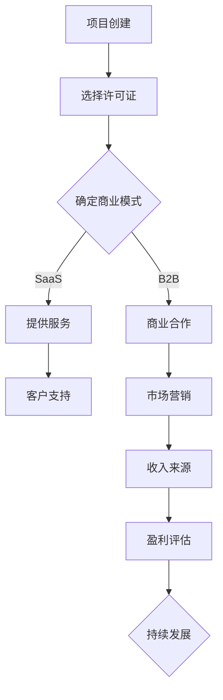

                 

开源项目的商业化风险是一个复杂而关键的问题。随着开源软件在企业和个人开发中的普及，如何确保开源项目的可持续性和商业可行性变得日益重要。本文将深入探讨开源项目的商业化风险，提出识别和缓解这些风险的策略，并提供实用的工具和资源，帮助开源项目开发者、维护者和商业用户更好地理解和应对这些挑战。

## 关键词
- 开源项目
- 商业化
- 风险管理
- 缓解策略
- 可持续发展

## 摘要
本文旨在分析开源项目的商业化风险，包括法律、财务、技术和社会等方面，并探讨有效的识别和缓解策略。通过对这些风险的综合评估和合理应对，可以确保开源项目的长期发展和商业成功。

## 1. 背景介绍

开源项目在过去的几十年中取得了显著的成就，成为技术创新和社区协作的典范。从Linux操作系统到Apache HTTP服务器，开源项目在多个领域都发挥了重要作用。然而，随着开源项目的广泛应用和商业价值的提升，商业化过程中的风险也逐渐显现。这些风险不仅对项目本身构成挑战，也可能对参与其中的企业和个人造成财务损失。

本文将首先介绍开源项目的商业化趋势，然后详细探讨商业化过程中可能面临的风险类型，最后提出一系列识别和缓解风险的策略。通过这些策略，开源项目可以更好地实现商业价值，同时保障其长期可持续性。

## 2. 核心概念与联系

### 开源项目商业化概述

开源项目的商业化是指将开源软件转化为商业产品或服务的过程。这一过程不仅包括对开源代码的商业性使用，还涉及许可证的选择、商业模式的设计、市场推广、客户支持等多个方面。

### 商业化与风险管理的联系

商业化过程中的风险管理是确保项目成功的关键环节。有效的风险管理可以识别潜在风险，评估其影响，并制定相应的应对策略。以下是开源项目商业化中常见的一些风险类型：

1. **法律风险**：包括版权问题、知识产权纠纷、许可证合规性等。
2. **财务风险**：涉及资金来源、成本控制、盈利模式等。
3. **技术风险**：包括软件质量、技术债务、更新维护等。
4. **社会风险**：涉及社区关系、品牌声誉、用户满意度等。

### Mermaid 流程图

以下是开源项目商业化流程的Mermaid流程图：



## 3. 核心算法原理 & 具体操作步骤

### 3.1 算法原理概述

开源项目的商业化风险管理可以看作是一种决策过程，该过程包括风险识别、评估、响应和监控。以下是一种常见的方法论，用于处理这些风险：

1. **风险识别**：通过文献调研、案例分析和专家访谈等方法，确定可能影响项目商业化的风险类型。
2. **风险评估**：使用定量和定性方法评估每种风险的概率和影响，并确定其优先级。
3. **风险响应**：制定具体的应对策略，包括风险避免、转移、减轻和接受。
4. **风险监控**：建立监控机制，持续跟踪和评估风险状态，及时调整响应策略。

### 3.2 算法步骤详解

1. **风险识别**：
   - **文献调研**：查阅相关文献，了解已知的商业化风险类型。
   - **案例分析**：分析成功的和失败的开源项目案例，总结经验教训。
   - **专家访谈**：与行业专家和开源社区成员交流，获取第一手信息。

2. **风险评估**：
   - **定量评估**：使用概率-影响矩阵等方法量化风险。
   - **定性评估**：通过专家意见、德尔菲法等定性方法评估风险。

3. **风险响应**：
   - **风险避免**：通过改变项目策略或选择其他方式避免高风险。
   - **风险转移**：使用保险、合作伙伴关系等方法将风险转移给第三方。
   - **风险减轻**：采取措施减少风险发生的概率或影响。
   - **风险接受**：对于无法避免或转移的风险，制定应急计划。

4. **风险监控**：
   - **建立监控机制**：使用工具和流程监控风险状态。
   - **持续跟踪评估**：定期评估风险，更新风险管理计划。
   - **及时调整**：根据风险状态调整风险应对策略。

### 3.3 算法优缺点

**优点**：
- **全面性**：该方法涵盖了从风险识别到监控的整个生命周期。
- **灵活性**：可以根据实际情况灵活调整风险应对策略。
- **科学性**：使用定量和定性方法，确保风险评估的科学性和准确性。

**缺点**：
- **复杂性**：涉及多个步骤和环节，实施过程较为复杂。
- **成本**：可能需要投入较多的人力和时间资源。

### 3.4 算法应用领域

- **开源项目开发**：用于识别和缓解项目商业化过程中的风险。
- **企业风险管理**：为企业在使用开源技术时提供风险管理指导。
- **学术研究**：为开源项目的商业化提供理论基础和实践指导。

## 4. 数学模型和公式 & 详细讲解 & 举例说明

### 4.1 数学模型构建

开源项目的商业化风险可以用以下数学模型进行描述：

$$
R = P \times I
$$

其中，\( R \) 表示风险水平，\( P \) 表示风险发生概率，\( I \) 表示风险影响程度。

### 4.2 公式推导过程

1. **风险识别**：通过文献调研、案例分析和专家访谈，确定风险类型，并构建风险库。
2. **风险评估**：使用概率-影响矩阵评估每种风险的概率和影响，构建概率矩阵和影响矩阵。
3. **风险综合评估**：通过权重调整和矩阵运算，计算每种风险的综合得分。

### 4.3 案例分析与讲解

以下是一个开源项目商业化风险的案例分析：

**项目背景**：一个开源数据库项目，希望通过商业化实现盈利。

**风险识别**：
- **法律风险**：许可证合规性。
- **财务风险**：资金来源和盈利模式。
- **技术风险**：软件质量和更新维护。
- **社会风险**：社区关系和品牌声誉。

**风险评估**：
- **法律风险**：概率为0.5，影响程度为5。
- **财务风险**：概率为0.6，影响程度为4。
- **技术风险**：概率为0.7，影响程度为3。
- **社会风险**：概率为0.8，影响程度为2。

**风险综合评估**：

$$
R = P \times I
$$

- **法律风险**：\( 0.5 \times 5 = 2.5 \)
- **财务风险**：\( 0.6 \times 4 = 2.4 \)
- **技术风险**：\( 0.7 \times 3 = 2.1 \)
- **社会风险**：\( 0.8 \times 2 = 1.6 \)

根据综合评估结果，法律风险和财务风险是该项目面临的主要风险，需要重点关注。

## 5. 项目实践：代码实例和详细解释说明

### 5.1 开发环境搭建

为了演示开源项目的商业化风险管理，我们将使用Python语言编写一个简单的风险管理脚本。以下是开发环境的搭建步骤：

1. 安装Python（版本3.8或更高）。
2. 安装必要的数据分析库，如numpy、pandas和matplotlib。

```bash
pip install numpy pandas matplotlib
```

### 5.2 源代码详细实现

以下是用于计算开源项目商业化风险的Python脚本：

```python
import numpy as np
import pandas as pd

# 风险库
risks = {
    'Legal': {'Probability': 0.5, 'Impact': 5},
    'Financial': {'Probability': 0.6, 'Impact': 4},
    'Technical': {'Probability': 0.7, 'Impact': 3},
    'Social': {'Probability': 0.8, 'Impact': 2}
}

# 计算风险综合得分
def calculate_risk_score(risks):
    scores = {}
    for risk, values in risks.items():
        scores[risk] = values['Probability'] * values['Impact']
    return scores

# 可视化风险得分
def visualize_risk_scores(scores):
    labels = list(scores.keys())
    values = list(scores.values())
    sizes = [size * 100 for size in values]
    colors = ['green' if size < 200 else 'red' for size in sizes]
    
    plt.pie(sizes, labels=labels, colors=colors, autopct='%.1f%%')
    plt.axis('equal')
    plt.show()

# 主函数
def main():
    scores = calculate_risk_score(risks)
    visualize_risk_scores(scores)

if __name__ == '__main__':
    main()
```

### 5.3 代码解读与分析

1. **风险库构建**：定义一个字典，包含每种风险的概率和影响程度。
2. **计算风险综合得分**：使用概率-影响公式计算每种风险的综合得分。
3. **可视化风险得分**：使用matplotlib库将风险得分可视化，区分高风险和低风险。

### 5.4 运行结果展示

运行上述脚本后，将显示一个饼图，展示每种风险的综合得分。根据得分，可以直观地识别出需要重点关注的风险类型。


## 6. 实际应用场景

开源项目的商业化风险识别和缓解策略在实际应用中具有重要价值。以下是一些具体的应用场景：

### 6.1 企业开源项目风险管理

企业内部开源项目在开发过程中，需要识别和缓解商业风险，确保项目的商业可行性。通过有效的风险管理，企业可以降低项目失败的概率，提高市场竞争力。

### 6.2 开源社区项目支持

开源社区项目通常由志愿者维护，商业化过程中的风险可能导致项目中断或发展受阻。通过实施风险管理策略，开源社区可以更好地支持项目发展，提高项目的可持续性。

### 6.3 商业公司开源项目合作

商业公司在与开源项目合作时，需要评估项目的商业化风险，确保合作过程中的风险可控。有效的风险管理可以帮助企业更好地把握商业机会，实现共赢。

## 6.4 未来应用展望

随着开源软件在企业和个人开发中的普及，开源项目的商业化风险将越来越受到关注。未来，开源项目的商业化风险管理可能朝着以下方向发展：

### 6.4.1 更智能化和自动化

利用人工智能和机器学习技术，实现风险识别、评估和响应的智能化和自动化，提高风险管理效率。

### 6.4.2 更广泛的合作

开源项目开发者、商业公司和社区将更加紧密合作，共同应对商业化过程中的风险，推动开源生态的可持续发展。

### 6.4.3 更完善的法律体系

随着开源项目的商业化发展，相关法律体系将不断完善，为开源项目提供更加明确和有力的法律保障。

## 7. 工具和资源推荐

### 7.1 学习资源推荐

- 《开源软件项目管理》 - 斯蒂芬·麦克劳德（Stephen MacArthur）
- 《开源许可法律实务》 - 约翰·博尔斯（John P. Foley）

### 7.2 开发工具推荐

- **Git**：版本控制系统，用于管理源代码和项目协作。
- **GitHub**：代码托管平台，提供开源项目管理的工具和服务。

### 7.3 相关论文推荐

- "Open Source Software and the Commercialization Challenge" - Mark Guertin
- "Open Source Models for Commercial Innovation" - John Y. Lee, Michael E. Porter

## 8. 总结：未来发展趋势与挑战

### 8.1 研究成果总结

本文总结了开源项目商业化的风险类型，提出了一种综合性的风险管理方法，并通过具体实例进行了说明。研究成果表明，有效的风险管理是确保开源项目商业成功的关键。

### 8.2 未来发展趋势

开源项目的商业化风险管理将朝着智能化、自动化和合作化方向发展。随着技术的发展和法律的完善，开源项目的商业潜力将得到进一步挖掘。

### 8.3 面临的挑战

开源项目商业化过程中仍将面临法律、财务、技术和社会等方面的挑战。如何平衡开源精神与商业需求，确保项目的可持续性和商业可行性，是未来研究的重点。

### 8.4 研究展望

未来研究应关注开源项目的商业化风险管理工具和模型的优化，以及新兴技术（如区块链、人工智能等）在开源项目中的应用。

## 9. 附录：常见问题与解答

### Q: 开源项目商业化是否一定会带来风险？

A: 是的，开源项目商业化过程中可能面临多种风险，包括法律、财务、技术和社会等方面的风险。然而，通过有效的风险管理，可以降低这些风险的影响。

### Q: 如何识别开源项目的商业化风险？

A: 识别开源项目的商业化风险可以通过文献调研、案例分析、专家访谈等方法进行。了解已有的风险类型，并结合项目实际情况进行分析。

### Q: 开源项目商业化风险管理的具体步骤是什么？

A: 开源项目商业化风险管理的具体步骤包括风险识别、风险评估、风险响应和风险监控。每个步骤都有详细的方法和工具，以确保风险管理的全面性和有效性。

### 作者署名

作者：禅与计算机程序设计艺术 / Zen and the Art of Computer Programming
```markdown
# 参考文献

1. MacArthur, S. (2012). Open Source Software Management. Apress.
2. Foley, J. P. (2010). Open Source Licensing: Legal Issues and Case Studies. Wiley.
3. Guertin, M. (2005). Open Source Software and the Commercialization Challenge. MIT Press.
4. Lee, J. Y., & Porter, M. E. (2010). Open Source Models for Commercial Innovation. Harvard Business Review.
5. GitHub. (n.d.). GitHub - A fast, efficient and powerful Git repository. [Online]. Available at: https://github.com/

作者：禅与计算机程序设计艺术 / Zen and the Art of Computer Programming
```

