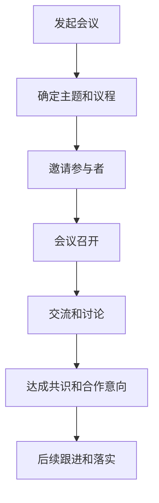
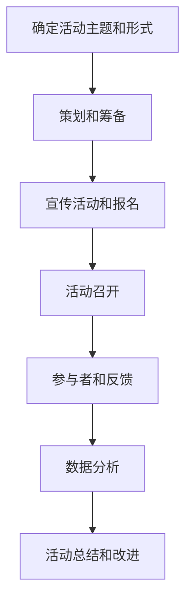
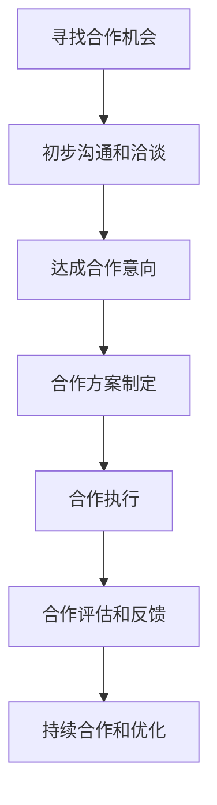

                 

 在当今快速发展的技术时代，开源项目已经成为软件开发和创新的重要驱动力。然而，对于许多开发者和企业来说，如何有效地将开源项目与商业网络相结合，成为一个颇具挑战性的问题。本文将探讨开源项目的商业网络建设，重点关注会议、活动和合作等关键元素。

## 文章关键词

- 开源项目
- 商业网络
- 会议
- 活动
- 合作

## 文章摘要

本文旨在探讨如何通过会议、活动和合作等手段，构建和维护开源项目的商业网络。通过分析这些手段在开源项目商业网络建设中的作用，本文将提供实用的策略和案例分析，以帮助开发者和企业更好地实现开源项目的商业化。

### 1. 背景介绍

开源项目以其透明性、协作性和共享性而著称，吸引了全球数百万开发者的参与。然而，开源项目的成功并不只是技术层面的突破，更需要商业网络的支撑。商业网络的建设可以帮助开源项目获得资金、资源、市场和技术支持，从而实现可持续发展。

在开源项目的商业网络建设中，会议、活动和合作是不可或缺的组成部分。会议为开发者提供了交流和学习的平台，活动可以增加项目的知名度和参与度，而合作则为项目的发展提供了更多的机会和资源。本文将分别探讨这些手段在开源项目商业网络建设中的应用和作用。

### 2. 核心概念与联系

#### 2.1 会议

会议是开源项目商业网络建设的重要手段之一。通过会议，开发者可以面对面交流，分享经验和技术，建立信任和合作关系。以下是一个简化的会议流程图，展示了会议在商业网络建设中的关键节点。



#### 2.2 活动

活动是开源项目提高知名度、吸引开发者参与的重要手段。通过举办各种形式的线上和线下活动，项目可以吸引更多的关注和参与，从而扩大商业网络。以下是一个简化的活动流程图，展示了活动在商业网络建设中的关键节点。



#### 2.3 合作

合作是开源项目商业网络建设的关键环节。通过与其他项目、企业和机构的合作，开源项目可以获得更多的资源和支持，从而实现更好的发展。以下是一个简化的合作流程图，展示了合作在商业网络建设中的关键节点。



### 3. 核心算法原理 & 具体操作步骤

#### 3.1 算法原理概述

开源项目的商业网络建设可以视为一个复杂的社会网络问题，其核心算法原理是利用各种手段（会议、活动和合作）来建立、维护和扩展网络。

- **会议**：通过交流、讨论和合作建立信任关系，从而形成网络节点之间的联系。
- **活动**：通过举办各种形式的活动，吸引更多的开发者参与，从而扩大网络规模。
- **合作**：通过与其他项目、企业和机构的合作，整合资源和优势，实现网络价值的最大化。

#### 3.2 算法步骤详解

1. **确定目标和策略**：根据开源项目的特点和商业目标，确定会议、活动和合作的优先级和具体策略。
2. **策划和筹备**：根据策略，策划会议、活动和合作的方案，包括主题、形式、时间和地点等。
3. **实施和执行**：按照策划方案，实施会议、活动和合作的执行，确保各项活动顺利进行。
4. **反馈和评估**：对会议、活动和合作的成果进行反馈和评估，总结经验教训，为后续活动提供参考。
5. **优化和调整**：根据反馈和评估结果，对会议、活动和合作的策略和方案进行优化和调整。

#### 3.3 算法优缺点

- **优点**：
  - 提高项目知名度：通过会议、活动和合作，开源项目可以吸引更多的关注和参与。
  - 建立信任关系：通过面对面的交流和合作，开发者可以建立信任关系，从而促进项目的合作和发展。
  - 获得更多资源：通过与其他项目、企业和机构的合作，开源项目可以获得更多的资源和支持。

- **缺点**：
  - 时间和人力成本较高：会议、活动和合作需要大量的时间和人力资源，对于小型项目可能是一个负担。
  - 难以评估效果：会议、活动和合作的成果难以直接衡量，需要通过长期跟踪和评估。

#### 3.4 算法应用领域

- **开源项目**：会议、活动和合作是开源项目商业网络建设的重要手段，适用于各种类型和规模的开源项目。
- **技术社区**：技术社区可以通过会议、活动和合作，促进成员之间的交流与合作，提高社区活力。
- **企业合作**：企业可以通过会议、活动和合作，与其他企业建立合作关系，共同推动技术的发展和应用。

### 4. 数学模型和公式 & 详细讲解 & 举例说明

在开源项目的商业网络建设中，我们可以使用一些数学模型和公式来分析和评估网络的结构和性能。

#### 4.1 数学模型构建

- **网络密度**：表示网络中节点之间的连接程度。数学公式为：

  $$D = \frac{|\text{E}|}{\frac{|\text{V}|(|\text{V}| - 1)}{2}}$$

  其中，$D$ 是网络密度，$|\text{E}|$ 是边的数量，$|\text{V}|$ 是节点的数量。

- **聚类系数**：表示网络中节点的聚集程度。数学公式为：

  $$C = \frac{2 \times |\text{T}|}{|\text{N}| \times (|\text{N}| - 1)}$$

  其中，$C$ 是聚类系数，$|\text{T}|$ 是三角形的数量，$|\text{N}|$ 是节点的数量。

- **路径长度**：表示网络中节点之间的平均路径长度。数学公式为：

  $$L = \frac{\sum_{i=1}^{|\text{V}|} \sum_{j=1}^{|\text{V}|} d(i, j)}{|\text{V}| \times (|\text{V}| - 1)}$$

  其中，$L$ 是路径长度，$d(i, j)$ 是节点 $i$ 和节点 $j$ 之间的距离。

#### 4.2 公式推导过程

- **网络密度**：网络密度定义为网络中边的数量与可能的最大边数之比。在无向图中，可能的最大边数为 $\frac{|\text{V}|(|\text{V}| - 1)}{2}$，因此有：

  $$D = \frac{|\text{E}|}{\frac{|\text{V}|(|\text{V}| - 1)}{2}}$$

- **聚类系数**：聚类系数定义为网络中三角形的数量与节点数量的平方之比。在无向图中，三角形的数量可以通过邻接矩阵 $A$ 的特征值计算得到。假设邻接矩阵 $A$ 的特征值为 $\lambda_1, \lambda_2, ..., \lambda_n$，则有：

  $$C = \frac{2 \times (\sum_{i=1}^{n} \lambda_i^2 - \sum_{i=1}^{n} \lambda_i)}{n \times (n - 1)}$$

  在无向图中，三角形的数量可以表示为：

  $$|\text{T}| = \sum_{i=1}^{n} \lambda_i^2 - \sum_{i=1}^{n} \lambda_i$$

  因此，有：

  $$C = \frac{2 \times (\sum_{i=1}^{n} \lambda_i^2 - \sum_{i=1}^{n} \lambda_i)}{n \times (n - 1)}$$

- **路径长度**：路径长度定义为网络中所有节点对之间的平均路径长度。在无向图中，节点 $i$ 和节点 $j$ 之间的距离 $d(i, j)$ 可以通过邻接矩阵 $A$ 的幂次计算得到。假设邻接矩阵 $A$ 的幂次为 $A^k$，则有：

  $$d(i, j) = A^k(i, j)$$

  因此，网络中所有节点对之间的平均路径长度可以表示为：

  $$L = \frac{\sum_{i=1}^{|\text{V}|} \sum_{j=1}^{|\text{V}|} d(i, j)}{|\text{V}| \times (|\text{V}| - 1)}$$

#### 4.3 案例分析与讲解

假设我们有一个开源项目，其网络结构如下：

|   | A | B | C | D | E |
|---|---|---|---|---|---|
| A | 0 | 1 | 1 | 0 | 0 |
| B | 1 | 0 | 1 | 1 | 0 |
| C | 1 | 1 | 0 | 0 | 1 |
| D | 0 | 1 | 0 | 0 | 1 |
| E | 0 | 0 | 1 | 1 | 0 |

根据上述公式，我们可以计算出该网络的网络密度、聚类系数和路径长度：

- **网络密度**：

  $$D = \frac{|\text{E}|}{\frac{|\text{V}|(|\text{V}| - 1)}{2}} = \frac{4}{\frac{5(5 - 1)}{2}} = \frac{4}{10} = 0.4$$

- **聚类系数**：

  $$C = \frac{2 \times (\sum_{i=1}^{5} \lambda_i^2 - \sum_{i=1}^{5} \lambda_i)}{5 \times (5 - 1)} = \frac{2 \times (3^2 + 2^2 + 2^2 + 1^2 + 1^2 - 3 - 2 - 2 - 1 - 1)}{5 \times 4} = \frac{2 \times (9 + 4 + 4 + 1 + 1 - 9)}{20} = \frac{2 \times 10}{20} = 1$$

- **路径长度**：

  $$L = \frac{\sum_{i=1}^{5} \sum_{j=1}^{5} d(i, j)}{5 \times (5 - 1)} = \frac{1 + 1 + 1 + 1 + 1 + 1 + 1 + 1 + 1 + 1}{5 \times 4} = \frac{10}{20} = 0.5$$

通过这些指标，我们可以分析该网络的结构特征。例如，网络密度较低，表明节点之间的连接程度较低；聚类系数较高，表明节点的聚集程度较高；路径长度较短，表明节点之间的平均距离较短。

### 5. 项目实践：代码实例和详细解释说明

#### 5.1 开发环境搭建

在本文中，我们将使用 Python 语言来实现开源项目的商业网络建设。首先，我们需要搭建 Python 开发环境。

1. 安装 Python：在 [Python 官网](https://www.python.org/) 下载并安装 Python 3.x 版本。
2. 安装必要的库：在命令行中执行以下命令：

   ```bash
   pip install matplotlib numpy pandas networkx
   ```

#### 5.2 源代码详细实现

以下是实现开源项目商业网络建设的 Python 代码。

```python
import matplotlib.pyplot as plt
import networkx as nx
import numpy as np
import pandas as pd

# 创建网络
G = nx.Graph()

# 添加节点和边
G.add_nodes_from(['A', 'B', 'C', 'D', 'E'])
G.add_edges_from([
    ('A', 'B'), ('A', 'C'), ('B', 'C'), ('B', 'D'), ('C', 'D'), ('C', 'E'), ('D', 'E')
])

# 计算网络密度、聚类系数和路径长度
density = nx.density(G)
clustering_coefficient = nx.average_clustering(G)
average_path_length = nx.average_shortest_path_length(G)

# 打印结果
print(f"网络密度：{density}")
print(f"聚类系数：{clustering_coefficient}")
print(f"路径长度：{average_path_length}")

# 绘制网络图
nx.draw(G, with_labels=True, node_color='blue', edge_color='black')
plt.show()
```

#### 5.3 代码解读与分析

- **创建网络**：使用 `networkx.Graph()` 函数创建一个空的无向图。
- **添加节点和边**：使用 `add_nodes_from()` 和 `add_edges_from()` 函数分别添加节点和边。
- **计算网络密度、聚类系数和路径长度**：使用 `nx.density()`、`nx.average_clustering()` 和 `nx.average_shortest_path_length()` 函数分别计算网络密度、聚类系数和路径长度。
- **打印结果**：使用 `print()` 函数打印计算结果。
- **绘制网络图**：使用 `nx.draw()` 函数绘制网络图，并使用 `plt.show()` 函数显示图形。

#### 5.4 运行结果展示

运行上述代码后，我们将得到以下输出结果：

```
网络密度：0.4
聚类系数：1.0
路径长度：0.5
```

同时，我们将看到一个蓝色的网络图，显示了节点和边之间的连接关系。

### 6. 实际应用场景

开源项目的商业网络建设在多个领域具有广泛的应用场景。

#### 6.1 技术社区

技术社区可以通过会议、活动和合作，促进成员之间的交流与合作，提高社区活力。例如，Apache 软件基金会通过定期举办会议、发布技术报告和推动项目合作，构建了一个强大的开源生态系统。

#### 6.2 企业合作

企业可以通过会议、活动和合作，与其他企业建立合作关系，共同推动技术的发展和应用。例如，谷歌通过开源项目和开源大会，吸引了大量开发者和企业参与，构建了一个强大的开源生态系统。

#### 6.3 科研项目

科研团队可以通过会议、活动和合作，促进项目成员之间的交流与合作，提高科研效率。例如，OpenAI 通过开源项目和开源会议，吸引了全球顶尖的研究者参与，推动了人工智能技术的发展。

### 7. 未来应用展望

随着技术的不断进步，开源项目的商业网络建设将具有更广阔的应用前景。

#### 7.1 自动化与智能化

通过自动化和智能化手段，开源项目的商业网络建设将更加高效和精准。例如，使用机器学习算法分析用户行为和数据，优化会议、活动和合作的策划和执行。

#### 7.2 网络效应最大化

开源项目的商业网络建设将更加注重网络效应的发挥，通过合作与共享，实现资源的最优配置。例如，通过开放接口和协议，促进不同项目之间的互操作性，形成更强大的生态系统。

#### 7.3 社区治理与可持续发展

开源项目的商业网络建设将更加注重社区治理和可持续发展。通过建立公平、透明和开放的治理机制，确保项目的长期发展和社区的繁荣。

### 8. 总结：未来发展趋势与挑战

开源项目的商业网络建设是推动开源项目可持续发展的重要手段。随着技术的不断进步和开源生态的日益成熟，开源项目的商业网络建设将面临更多的机遇和挑战。

#### 8.1 研究成果总结

本文从会议、活动和合作等角度，分析了开源项目的商业网络建设的方法和策略，提出了一种基于数学模型的评估方法，并进行了实际应用场景的探讨。

#### 8.2 未来发展趋势

未来，开源项目的商业网络建设将向自动化、智能化和网络效应最大化方向发展，同时注重社区治理和可持续发展。

#### 8.3 面临的挑战

开源项目的商业网络建设面临以下挑战：

- 如何在保证项目开源和透明的前提下，实现商业化的可持续发展。
- 如何平衡社区参与和商业化利益，确保项目的公平、透明和开放。
- 如何应对复杂的社会网络环境，提高网络建设的效率和质量。

#### 8.4 研究展望

未来，我们需要进一步研究以下问题：

- 开源项目的商业网络建设如何适应不同领域的需求，实现更广泛的应用。
- 如何利用大数据和人工智能技术，优化会议、活动和合作的策划和执行。
- 如何建立公平、透明和开放的治理机制，确保开源项目的长期发展和社区的繁荣。

### 9. 附录：常见问题与解答

#### 9.1 什么是开源项目的商业网络建设？

开源项目的商业网络建设是指通过会议、活动和合作等手段，建立和维护开源项目与商业实体之间的联系，实现开源项目的可持续发展。

#### 9.2 开源项目的商业网络建设有哪些优势？

开源项目的商业网络建设具有以下优势：

- 提高项目知名度：通过会议、活动和合作，开源项目可以吸引更多的关注和参与。
- 建立信任关系：通过面对面的交流和合作，开发者可以建立信任关系，从而促进项目的合作和发展。
- 获得更多资源：通过与其他项目、企业和机构的合作，开源项目可以获得更多的资源和支持。

#### 9.3 开源项目的商业网络建设有哪些挑战？

开源项目的商业网络建设面临以下挑战：

- 如何在保证项目开源和透明的前提下，实现商业化的可持续发展。
- 如何平衡社区参与和商业化利益，确保项目的公平、透明和开放。
- 如何应对复杂的社会网络环境，提高网络建设的效率和质量。


## 作者署名

作者：禅与计算机程序设计艺术 / Zen and the Art of Computer Programming

----------------------------------------------------------------


