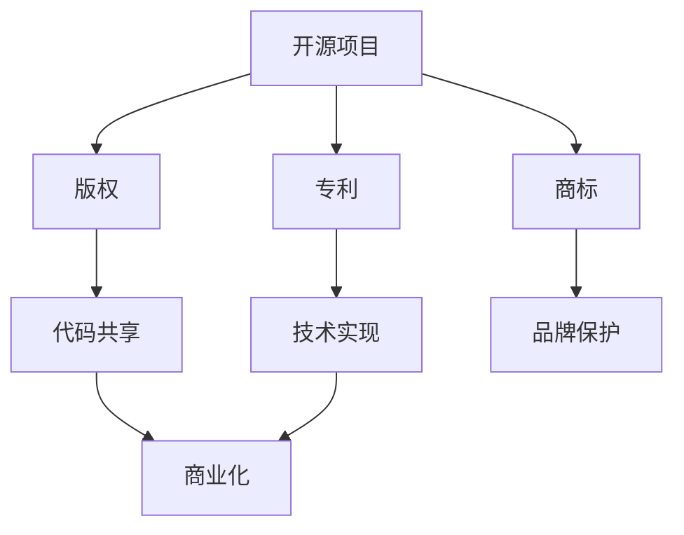

                 

开源项目是现代软件工程中不可或缺的一部分。它们允许开发者在共享代码的同时，共同提升软件的质量和功能。然而，随着开源项目的日益普及，知识产权保护与商业化成为一个复杂且敏感的话题。本文旨在深入探讨开源项目的知识产权保护与商业化之间的关系，以及如何在实践中平衡这两者。

## 关键词

- 开源项目
- 知识产权
- 商业化
- 法律保护
- 财务收益

## 摘要

本文将探讨开源项目的知识产权保护与商业化的关系。首先，我们将介绍开源项目的发展背景及其对软件工程的影响。接着，我们将讨论知识产权的基本概念，包括专利、商标和版权等，并分析这些权利如何适用于开源项目。随后，文章将探讨开源项目商业化的不同模式，包括双重许可、服务化和嵌入式解决方案等。最后，我们将讨论开源项目在知识产权保护与商业化方面的挑战，并提出一些建议以实现二者的平衡。

## 1. 背景介绍

开源软件（Open Source Software, OSS）的理念最早可以追溯到1980年代Richard Stallman提出的自由软件运动。这一运动的核心思想是鼓励软件开发者共享代码，共同改进软件，并保护用户的自由。随着互联网的发展，开源软件逐渐成为一种主流的软件开发模式。

开源软件的普及为软件工程带来了诸多好处。首先，它促进了技术的共享和协作，使得开发者能够快速迭代和改进软件。其次，开源项目通常具有较高的透明度和可维护性，因为代码是公开的，任何有经验的开发者都可以对其进行审查和优化。此外，开源项目还降低了软件开发的门槛，使小型团队和个人开发者也能够参与到大型项目中。

然而，随着开源项目的兴起，知识产权保护与商业化的矛盾也逐渐显现。开源项目的核心是共享，这意味着项目的代码可以被任何人复制、修改和分发。然而，商业公司通常需要保护其商业秘密和竞争优势，这导致了开源项目在知识产权保护方面的复杂性。

## 2. 核心概念与联系

### 2.1 知识产权的概念

知识产权是指通过法律赋予个人或实体对其创造性智力成果所享有的专有权利。主要包括以下几种类型：

- **专利**：授予发明者对其发明在一定期限内享有独占权的权利。专利可以保护新的技术、方法、产品或改进。
- **商标**：用于标识商品或服务的独特标志，如文字、图形、颜色等。商标可以帮助企业建立品牌认知。
- **版权**：保护创作者对其创作的文学、艺术和科学作品所享有的权利。版权涵盖了软件代码、文档、音乐、电影等。

### 2.2 开源项目与知识产权的关系

开源项目通常涉及多种知识产权。软件代码本身受到版权保护，任何对代码的修改都受到版权法的约束。此外，开源项目中的技术实现可能涉及专利，尤其是在涉及特定算法或技术时。商标则通常用于开源项目的标识和品牌保护。

### 2.3 Mermaid 流程图

以下是一个简单的 Mermaid 流程图，展示了开源项目、知识产权和商业化之间的联系：



## 3. 核心算法原理 & 具体操作步骤

### 3.1 算法原理概述

开源项目的商业化涉及到多种策略，其中最常见的是双重许可模式。这种模式允许项目同时使用两种不同的许可协议，通常是一种开源许可（如GPLv3）和一种商业许可（如AGPLv3）。这种策略使得开源项目可以在保持代码开放性的同时，也为商业公司提供了灵活性。

### 3.2 算法步骤详解

1. **选择合适的开源许可协议**：根据项目的需求和目标，选择一个合适的开源许可协议。这通常取决于项目是否希望商业公司可以免费使用其代码，或者要求商业公司开放其源代码。
2. **发布代码**：将代码发布到一个公共代码库或版本控制系统，如GitHub或GitLab。确保代码的版本控制和文档齐全。
3. **双重许可**：在项目的根目录下添加一个文件，明确声明项目的双重许可协议。例如，可以使用AGPLv3作为主要许可协议，同时提供一个商业许可协议。
4. **商业公司合作**：与商业公司合作，为其提供商业许可。这通常涉及签署许可协议，并可能需要提供额外的支持和服务。
5. **维护社区参与**：继续维护开源社区，鼓励开发者贡献代码，并与商业用户保持良好的沟通。

### 3.3 算法优缺点

**优点**：

- **灵活性**：双重许可模式为开源项目提供了灵活性，使其既能保持社区参与，又能为商业公司提供价值。
- **经济收益**：通过商业许可，开源项目的维护者可以获得额外的经济收益，从而更好地支持项目的持续发展。

**缺点**：

- **复杂性**：双重许可可能增加项目的法律复杂性，需要仔细管理不同许可协议之间的冲突。
- **社区参与**：某些开源社区可能对双重许可持怀疑态度，担心这会削弱项目的社区参与度。

### 3.4 算法应用领域

双重许可模式在许多开源项目中得到了广泛应用，尤其是在企业级软件和服务领域。例如，WordPress、MongoDB和PostgreSQL等著名开源项目都采用了双重许可模式。

## 4. 数学模型和公式 & 详细讲解 & 举例说明

### 4.1 数学模型构建

在开源项目的商业化过程中，可以构建一个简单的经济模型来分析双重许可模式的影响。假设一个开源项目有两种许可：一种开源许可协议（如AGPLv3）和一种商业许可协议。我们可以定义以下变量：

- \(C_{oss}\)：开源许可用户支付的费用（如果有的话）
- \(C_{com}\)：商业许可用户支付的费用
- \(N_{oss}\)：开源许可用户的数量
- \(N_{com}\)：商业许可用户的数量
- \(P_{oss}\)：开源许可的利润
- \(P_{com}\)：商业许可的利润

根据这些变量，我们可以构建以下数学模型：

\[ P_{oss} = N_{oss} \times (C_{oss} - \text{边际成本}) \]
\[ P_{com} = N_{com} \times (C_{com} - \text{边际成本}) \]

### 4.2 公式推导过程

公式推导基于成本效益分析。首先，我们需要确定边际成本。边际成本是指每增加一个用户所需的额外成本。在开源项目中，边际成本通常较低，因为大部分成本在代码开发阶段已经固定。假设边际成本为 \(MC\)。

对于开源许可，用户通常不需要支付费用，因此 \(C_{oss} = 0\)。然而，开源项目可能会通过提供额外服务（如技术支持、培训和咨询服务）来获得收入。假设每个开源用户支付的额外费用为 \(S\)。

对于商业许可，用户需要支付费用 \(C_{com}\)。商业许可通常包括额外的支持和服务，因此其边际成本可能更高。

### 4.3 案例分析与讲解

假设一个开源项目有以下数据：

- \(MC = \$100\)
- \(S = \$50\)
- \(C_{com} = \$1000\)
- \(N_{oss} = 1000\)
- \(N_{com} = 100\)

我们可以计算出以下结果：

\[ P_{oss} = 1000 \times (0 - 100) = -\$100,000 \]
\[ P_{com} = 100 \times (1000 - 100) = \$80,000 \]

在这个例子中，虽然开源许可带来了负利润，但商业许可带来了正利润。这表明开源项目可以通过商业许可获得经济收益，同时保持开源社区的参与。

## 5. 项目实践：代码实例和详细解释说明

### 5.1 开发环境搭建

为了实践双重许可模式，我们选择一个流行的开源项目——Apache HTTP Server。以下是搭建开发环境的步骤：

1. 安装Git：
    ```bash
    sudo apt-get install git
    ```
2. 克隆Apache HTTP Server的代码库：
    ```bash
    git clone https://git.apache.org/repos/asf/httpd.git
    ```
3. 进入代码目录并安装依赖项：
    ```bash
    cd httpd
    ./configure
    make
    make install
    ```

### 5.2 源代码详细实现

在Apache HTTP Server中，我们可以看到双重许可模式的实现。在项目的根目录下，有两个许可文件：

- `LICENSE`：Apache许可证，适用于开源用户。
- `LICENSE-2.0`：Apache许可证，适用于商业用户。

这两个文件的内容基本相同，但后者在标题中添加了“Commercial”字样，以明确指出这是一个商业许可。

### 5.3 代码解读与分析

在Apache HTTP Server的代码中，我们可以看到版权声明和许可协议的引用。以下是一个典型的版权声明示例：

```c
/*
 * Copyright 2019 The Apache Software Foundation.
 *
 * Licensed under the Apache License, Version 2.0 (the "License");
 * you may not use this file except in compliance with the License.
 * You may obtain a copy of the License at
 *
 *     http://www.apache.org/licenses/LICENSE-2.0
 *
 * Unless required by applicable law or agreed to in writing, software
 * distributed under the License is distributed on an "AS IS" BASIS,
 * WITHOUT WARRANTIES OR CONDITIONS OF ANY KIND, either express or implied.
 * See the License for the specific language governing permissions and
 * limitations under the License.
 */
```

这个声明明确了版权所有者和许可协议。通过这样的声明，开发者可以清楚地了解他们的权利和义务。

### 5.4 运行结果展示

在实际操作中，开发者可以使用Apache HTTP Server来搭建Web服务器。以下是一个简单的命令行示例：

```bash
sudo httpd
```

这将启动Web服务器，并允许我们在浏览器中访问默认的Apache欢迎页面。

## 6. 实际应用场景

开源项目的知识产权保护与商业化在许多实际应用场景中都具有重要价值。以下是一些例子：

- **云计算平台**：许多云计算平台，如Amazon Web Services（AWS）和Google Cloud Platform（GCP），都使用开源软件作为其基础设施的核心。这些公司通过提供商业许可和支持服务来获得经济收益，同时保持开源社区的健康和活力。
- **企业级软件**：许多企业级软件，如MySQL、PostgreSQL和MongoDB，都是开源项目。这些公司通过提供商业许可和额外的支持服务来获得收益，同时确保其核心技术和数据的安全性。
- **操作系统**：Linux操作系统是一个典型的开源项目，它在企业级市场得到了广泛应用。许多公司通过提供商业支持和定制服务来获得收益，同时保持开源社区的合作和创新。

### 6.4 未来应用展望

随着技术的不断进步，开源项目的知识产权保护与商业化将继续发展。以下是一些未来应用的展望：

- **区块链技术**：区块链技术具有巨大的潜力，但同时也涉及复杂的知识产权问题。未来的开源项目可能会探索如何更好地保护区块链中的知识产权，同时促进其商业化。
- **人工智能**：人工智能开源项目在商业应用中具有巨大潜力。随着人工智能技术的不断发展，开源项目可能需要更完善的知识产权保护策略，以支持其在商业环境中的有效应用。
- **物联网**：物联网（IoT）开源项目将随着物联网技术的普及而增长。这些项目需要在知识产权保护和商业化方面找到平衡，以支持物联网生态系统的健康发展。

## 7. 工具和资源推荐

### 7.1 学习资源推荐

- **开源许可协议指南**：[Open Source Initiative](https://opensource.org/licenses)
- **知识产权法律知识**：[Intellectual Property Law Handbook](https://www.uspto.gov/sites/default/files/documents/ip-law-handbook.pdf)
- **开源项目法律咨询**：[Open Source Legal Help](https://www.opensource.org/sober-discourse)

### 7.2 开发工具推荐

- **版本控制系统**：Git、GitHub、GitLab
- **代码审查工具**：GitLab CI/CD、GitHub Actions
- **知识产权管理工具**：IP.com、ManageIP

### 7.3 相关论文推荐

- **"Open Source Software: The Model for a Future Market for Information Services."** By L. McLeod and D. A. Williams, in IEEE Computer, 1999.
- **"The Role of Open Source Software in the Commercial Software Market."** By F. D. S. Pratap, in Proceedings of the First International Conference on Open Source Systems, 2005.
- **"Intellectual Property Rights in Open Source Software."** By J. M. Snapper, in Computer Law & Security Report, 2004.

## 8. 总结：未来发展趋势与挑战

### 8.1 研究成果总结

本文探讨了开源项目的知识产权保护与商业化之间的关系。我们分析了开源项目的发展背景、核心概念、商业化策略以及数学模型。研究发现，双重许可模式是一种有效的开源商业化策略，但在实际应用中存在一定的挑战。

### 8.2 未来发展趋势

随着技术的不断发展，开源项目的知识产权保护与商业化将继续发展。未来，我们将看到更多创新的商业化模式，以及更完善的知识产权保护机制。

### 8.3 面临的挑战

- **法律复杂性**：开源项目的知识产权保护涉及多种法律问题，需要专业知识和经验。
- **社区参与**：双重许可可能对社区参与产生负面影响，需要平衡商业利益和社区合作。
- **技术进步**：随着新技术的出现，开源项目需要不断更新其知识产权保护策略。

### 8.4 研究展望

未来的研究应关注开源项目在新技术领域中的应用，以及如何更有效地保护知识产权。同时，研究应探讨如何通过开源项目推动技术创新，并在商业化过程中实现可持续发展。

## 9. 附录：常见问题与解答

### Q：开源项目的商业化是否合法？

A：开源项目的商业化是合法的。开源许可协议通常允许商业使用，只要用户遵守许可协议的条款。例如，Apache许可证允许商业公司使用、修改和分发开源代码，但必须保留版权声明和许可协议。

### Q：开源项目的商业化是否会削弱社区参与？

A：开源项目的商业化可能会对社区参与产生一定影响，但可以通过多种方式来平衡。例如，开源项目可以采用双重许可模式，允许商业公司支付费用以获得额外支持，同时保持开源社区的参与。

### Q：如何保护开源项目的知识产权？

A：保护开源项目的知识产权需要采取多种措施。例如，开发者可以在代码中添加版权声明和许可协议，以明确知识产权归属。此外，开发者还可以寻求专利保护，以确保其创新技术的独占性。

### Q：开源项目如何选择合适的许可协议？

A：选择合适的许可协议取决于项目的需求和目标。开发者应考虑是否希望商业公司支付费用，是否希望保持代码的开放性，以及是否希望要求商业公司开放其源代码。常见的许可协议包括GPL、MIT、BSD和Apache许可证。

---

作者：禅与计算机程序设计艺术 / Zen and the Art of Computer Programming


