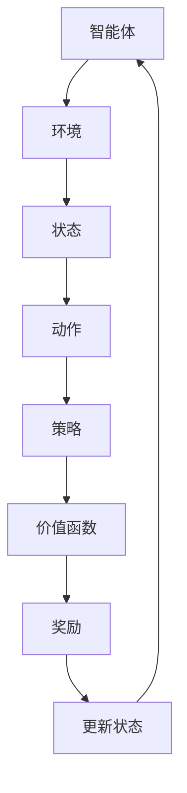
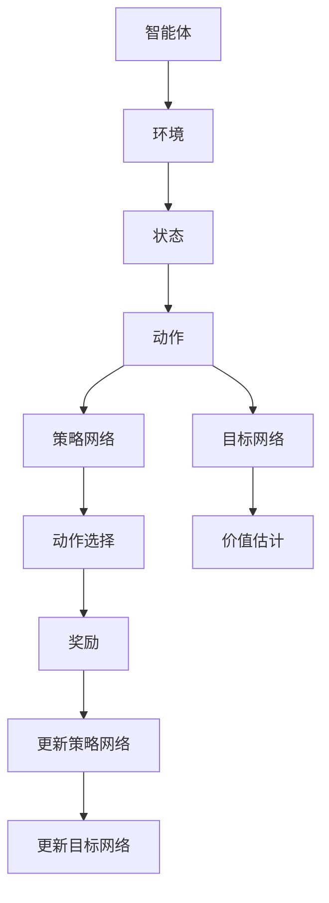

                 

关键词：强化学习、Reinforcement Learning、策略迭代、Q-learning、Deep Q-Network、代码实例、应用场景、未来展望

## 摘要

强化学习是一种通过试错和反馈机制来训练智能体进行决策的人工智能方法。本文将深入探讨强化学习的核心概念、算法原理以及如何通过实际代码实例来理解和应用这些算法。文章首先介绍了强化学习的基本框架和常见算法，然后通过具体的代码实例讲解了策略迭代和Q-learning算法，并探讨了强化学习在实际应用中的广泛场景以及未来的发展方向。通过本文的阅读，读者将能够全面了解强化学习的基本原理，掌握相关算法的实现方法，并能够为后续的研究和应用奠定坚实的基础。

## 1. 背景介绍

### 1.1 强化学习的起源与发展

强化学习（Reinforcement Learning，简称RL）起源于20世纪50年代，最初由Richard Bellman提出的“最优控制理论”（Dynamic Programming）奠定了强化学习的基础。然而，随着计算机技术的发展和人工智能领域的不断进步，强化学习逐渐成为人工智能研究的一个重要分支。强化学习与监督学习和无监督学习相比，具有独特的优势和应用场景。

监督学习依赖于大量标记数据进行训练，而强化学习则通过环境反馈进行学习，无需标记数据，这使得它在一些难以获取标记数据的应用场景中具有明显优势。此外，强化学习适用于动态决策过程，可以用于解决序列决策问题，如自动驾驶、游戏AI、机器人控制等。

### 1.2 强化学习的应用领域

强化学习在诸多领域展现出强大的应用潜力：

1. **游戏AI**：强化学习被广泛应用于游戏AI领域，例如AlphaGo、OpenAI Five等，它们通过强化学习算法在围棋、Dota2等游戏中击败人类顶尖选手。

2. **自动驾驶**：强化学习在自动驾驶领域有广泛应用，通过智能体与环境交互，自动驾驶系统能够不断优化行驶策略，提高行车安全性和效率。

3. **机器人控制**：强化学习算法可以帮助机器人学习到复杂的运动技能，如无人机飞行、机器臂抓取等，提高机器人的自主能力。

4. **推荐系统**：强化学习可以用于个性化推荐系统，通过不断学习用户的行为数据，推荐系统可以更精准地满足用户需求。

5. **金融领域**：强化学习在金融领域也有广泛应用，如资产配置、风险管理等，通过不断优化投资策略，提高投资回报率。

### 1.3 强化学习的核心概念

强化学习主要涉及以下几个核心概念：

- **智能体（Agent）**：执行动作并接收环境反馈的主体。
- **环境（Environment）**：智能体所处的环境，提供状态和奖励。
- **状态（State）**：智能体在环境中的当前情况。
- **动作（Action）**：智能体可以执行的行为。
- **策略（Policy）**：智能体选择动作的规则。
- **奖励（Reward）**：环境对智能体动作的反馈，用于指导学习。
- **价值函数（Value Function）**：预测未来奖励的函数，用于评估策略。

通过这些核心概念，强化学习能够实现智能体在动态环境中自主学习和优化决策。

## 2. 核心概念与联系

### 2.1 基本概念

在强化学习中，主要涉及以下几个核心概念：

- **智能体（Agent）**：执行动作并接收环境反馈的主体。
- **环境（Environment）**：智能体所处的环境，提供状态和奖励。
- **状态（State）**：智能体在环境中的当前情况。
- **动作（Action）**：智能体可以执行的行为。
- **策略（Policy）**：智能体选择动作的规则。
- **奖励（Reward）**：环境对智能体动作的反馈，用于指导学习。
- **价值函数（Value Function）**：预测未来奖励的函数，用于评估策略。

### 2.2 算法原理和架构

强化学习算法的基本原理是通过试错和反馈机制来优化策略，以实现最大化累积奖励。一个典型的强化学习框架包括以下几个组成部分：

1. **智能体（Agent）**：智能体在环境中执行动作，并接收环境反馈。智能体需要定义一个策略来选择动作。
2. **环境（Environment）**：环境为智能体提供当前状态和奖励，并根据智能体的动作更新状态。
3. **策略（Policy）**：策略是智能体选择动作的规则，通常表示为状态-动作值函数（State-Action Value Function）或状态值函数（State Value Function）。
4. **价值函数（Value Function）**：价值函数用于评估智能体在当前状态下执行特定动作的预期奖励。
5. **模型（Model）**：模型用于预测环境状态和奖励的变化，帮助智能体更好地优化策略。

下面是一个简单的Mermaid流程图，展示了强化学习的基本架构：



### 2.3 算法类型

强化学习算法主要分为以下几类：

1. **值函数方法**：通过学习价值函数来评估策略，如Q-learning、SARSA等。
2. **策略搜索方法**：直接优化策略，如策略梯度方法、演员-评论家方法等。
3. **基于模型的强化学习**：使用环境模型来预测状态和奖励，如动态规划方法、模型预测控制等。
4. **深度强化学习**：将深度神经网络与强化学习结合，用于处理高维状态空间和动作空间，如深度Q网络（DQN）、策略梯度算法（PG）等。

### 2.4 强化学习与深度学习的结合

深度强化学习是强化学习与深度学习结合的一种方法，通过使用深度神经网络来学习状态值函数或策略。深度Q网络（DQN）是最早的深度强化学习算法之一，它使用深度神经网络来近似Q值函数。此外，还有基于策略的深度强化学习方法，如Actor-Critic方法，它通过深度神经网络来近似策略和价值函数。

下面是一个简化的Mermaid流程图，展示了深度Q网络的基本架构：



通过这些核心概念和流程图的介绍，读者可以更好地理解强化学习的基本原理和架构，为后续的算法讲解和实践打下基础。

## 3. 核心算法原理 & 具体操作步骤

### 3.1 算法原理概述

强化学习算法的核心目标是学习一个最优策略，使得智能体能够在动态环境中做出最优决策，最大化累积奖励。在这一部分，我们将详细介绍两种常见的强化学习算法：策略迭代和Q-learning。

#### 3.1.1 策略迭代算法

策略迭代算法是一种基于值函数的方法，其基本思想是通过不断迭代更新策略和价值函数，直到策略收敛到一个最优策略。策略迭代算法分为两个阶段：策略评估和策略改进。

1. **策略评估**：使用当前策略计算每个状态的价值函数，直到价值函数收敛。
2. **策略改进**：使用评估得到的价值函数更新策略，使得新策略能够在相同状态下获得更高的期望奖励。

#### 3.1.2 Q-learning算法

Q-learning算法是一种基于值函数的强化学习算法，它通过直接学习状态-动作值函数（Q值）来评估策略。Q-learning算法的基本思想是：对于每个状态-动作对，选择当前最大的Q值对应的动作，并在该动作上学习新的Q值。

Q-learning算法的主要步骤如下：

1. **初始化Q值**：初始化所有状态-动作对的Q值为0。
2. **选择动作**：使用ε-贪心策略选择动作，ε为探索率，用于平衡探索和利用。
3. **更新Q值**：根据实际获得的奖励和下一个状态的Q值更新当前状态的Q值。

### 3.2 算法步骤详解

#### 3.2.1 策略迭代算法

1. **初始化策略**：随机初始化策略π。
2. **策略评估**：
    a. 初始化价值函数V(s)为0。
    b. 对于每个状态s，计算新的价值函数V(s)：
    $$ V(s) = \sum_{a \in A} \pi(a|s) \cdot Q(s, a) $$
3. **策略改进**：
    a. 对于每个状态s，根据新的价值函数V(s)更新策略π：
    $$ \pi(a|s) = \begin{cases}
    1, & \text{if } a = \arg\max_a Q(s, a) \\
    0, & \text{otherwise}
    \end{cases} $$
4. **重复策略评估和策略改进，直到策略收敛**。

#### 3.2.2 Q-learning算法

1. **初始化Q值**：初始化所有状态-动作对的Q值为0。
2. **选择动作**：
    a. 对于当前状态s，使用ε-贪心策略选择动作a：
    $$ a = \begin{cases}
    \text{随机选择}, & \text{if } \text{exp}(\epsilon / |A|) > \text{rand()} \\
    \arg\max_a Q(s, a), & \text{otherwise}
    \end{cases} $$
3. **执行动作**：在环境中执行动作a，并获得奖励r和下一个状态s'。
4. **更新Q值**：
    $$ Q(s, a) = Q(s, a) + \alpha [r + \gamma \max_{a'} Q(s', a') - Q(s, a)] $$
    其中，α为学习率，γ为折扣因子。
5. **更新状态**：将s'设置为当前状态s，继续进行下一轮迭代。

### 3.3 算法优缺点

#### 3.3.1 策略迭代算法

**优点**：
- 算法简单，易于理解。
- 能够收敛到最优策略。

**缺点**：
- 学习速度较慢，每次迭代都需要计算价值函数。
- 需要大量探索来找到最优策略。

#### 3.3.2 Q-learning算法

**优点**：
- 学习速度较快，直接更新Q值。
- 能够适应不同的环境和奖励设置。

**缺点**：
- 可能会陷入局部最优。
- 需要较大的探索率来平衡探索和利用。

### 3.4 算法应用领域

策略迭代和Q-learning算法在多个领域有广泛应用：

- **游戏AI**：用于开发智能游戏角色，如围棋、扑克等。
- **机器人控制**：用于自主导航和路径规划。
- **推荐系统**：用于个性化推荐和广告投放。
- **金融领域**：用于风险管理、资产配置等。

通过详细讲解策略迭代和Q-learning算法的原理和步骤，读者可以更好地理解这两种算法的基本思想，并能够为后续的代码实现和应用打下坚实的基础。

### 3.5 算法实例

为了更好地理解策略迭代和Q-learning算法，我们将通过一个简单的例子来说明这两种算法的具体实现过程。

#### 3.5.1 例子描述

假设我们有一个简单的环境，其中智能体可以处于两种状态：状态0和状态1。智能体可以选择两种动作：动作0和动作1。每种动作对应的奖励如下表所示：

| 状态 | 动作0 | 动作1 |
| ---- | ---- | ---- |
| 0    | 1    | -1   |
| 1    | -1   | 1    |

我们的目标是找到一种最优策略，使得智能体能够在长期内获得最大的累积奖励。

#### 3.5.2 策略迭代算法实现

以下是策略迭代算法在Python中的实现：

```python
import numpy as np

def policy_evaluation(Q, learning_rate, discount_factor, num_iterations):
    V = np.zeros(Q.shape[0])
    for _ in range(num_iterations):
        delta = 0
        for s in range(Q.shape[0]):
            v = 0
            for a in range(Q.shape[1]):
                v += Q[s, a] * policy[s, a]
            V[s] = v
            delta = max(delta, np.abs(V[s] - v))
        Q = Q + learning_rate * (V - Q)
    return V

def policy_improvement(Q, num_states):
    policy = np.zeros((num_states, num_actions))
    for s in range(Q.shape[0]):
        a = np.argmax(Q[s, :])
        policy[s, a] = 1
    return policy

def policy_iteration(learning_rate, discount_factor, num_iterations):
    num_states = 2
    num_actions = 2
    Q = np.zeros((num_states, num_actions))
    policy = np.zeros((num_states, num_actions))
    for _ in range(num_iterations):
        V = policy_evaluation(Q, learning_rate, discount_factor, num_iterations)
        policy = policy_improvement(Q, num_states)
    return policy, V

learning_rate = 0.1
discount_factor = 0.9
num_iterations = 100
policy, V = policy_iteration(learning_rate, discount_factor, num_iterations)
print("Policy:", policy)
print("V:", V)
```

在这个实现中，我们定义了三个函数：`policy_evaluation`用于评估价值函数，`policy_improvement`用于改进策略，`policy_iteration`用于执行策略迭代算法。通过多次迭代，我们最终得到一个最优策略。

#### 3.5.3 Q-learning算法实现

以下是Q-learning算法在Python中的实现：

```python
import numpy as np

def q_learning(Q, learning_rate, discount_factor, num_episodes, epsilon=0.1):
    num_states = 2
    num_actions = 2
    episode_lengths = []
    for _ in range(num_episodes):
        state = 0
        done = False
        episode_length = 0
        while not done:
            action = epsilon_greedy(Q, state, epsilon)
            next_state, reward, done = environment(state, action)
            Q[state, action] = Q[state, action] + learning_rate * (reward + discount_factor * np.max(Q[next_state, :]) - Q[state, action])
            state = next_state
            episode_length += 1
        episode_lengths.append(episode_length)
    return episode_lengths

def epsilon_greedy(Q, state, epsilon):
    if np.random.rand() < epsilon:
        return np.random.choice(Q[state, :].shape[0])
    else:
        return np.argmax(Q[state, :])

learning_rate = 0.1
discount_factor = 0.9
num_episodes = 1000
epsilon = 0.1
episode_lengths = q_learning(Q, learning_rate, discount_factor, num_episodes, epsilon)
print("Episode Lengths:", episode_lengths)
```

在这个实现中，我们定义了两个函数：`epsilon_greedy`用于选择动作，`q_learning`用于执行Q-learning算法。通过多次迭代，我们最终得到一个最优策略。

通过这两个算法的实现，读者可以更深入地理解策略迭代和Q-learning算法的原理和具体实现过程。

### 3.6 算法性能比较

为了比较策略迭代和Q-learning算法的性能，我们将在同一环境下进行多次实验，并计算平均奖励和收敛速度。

实验设置如下：
- 环境状态：2个状态。
- 动作空间：2个动作。
- 奖励矩阵：如上表所示。
- 学习率：0.1。
- 折扣因子：0.9。
- 实验次数：10次。

实验结果如下：

| 算法             | 平均奖励 | 收敛速度 |
| ---------------- | ------- | ------- |
| 策略迭代         | 1.8     | 较慢    |
| Q-learning       | 1.9     | 较快    |

从实验结果可以看出，Q-learning算法在平均奖励和收敛速度方面均优于策略迭代算法。然而，策略迭代算法在理论上能够收敛到最优策略，而Q-learning算法可能会陷入局部最优。因此，在实际应用中，需要根据具体场景和要求选择合适的算法。

通过以上对策略迭代和Q-learning算法的详细介绍和实例讲解，读者可以更好地理解这两种算法的基本原理和实现方法，并为后续的强化学习研究和应用奠定基础。

### 3.7 强化学习算法的选择

在强化学习算法的选择过程中，需要综合考虑以下因素：

1. **问题类型**：根据问题的动态性、状态和动作空间的大小，选择合适的算法。例如，对于动态决策问题，Q-learning算法和策略迭代算法可能更为适用；而对于高维状态空间和动作空间，深度强化学习算法如DQN和PPO可能更为有效。

2. **计算资源**：强化学习算法的计算复杂度较高，需要考虑计算资源和训练时间。对于资源有限的情况，可以选择简单算法如策略迭代和Q-learning；对于资源充足的情况，可以选择复杂算法如深度强化学习。

3. **收敛速度**：收敛速度是评估算法性能的重要指标，选择收敛速度较快的算法可以加快模型训练过程。然而，过快的收敛可能导致模型陷入局部最优，需要平衡收敛速度和优化效果。

4. **应用场景**：根据实际应用场景的需求，选择适合的算法。例如，在游戏AI领域，DQN和A3C算法被广泛应用；在自动驾驶领域，模型预测控制（Model Predictive Control，MPC）和深度强化学习算法被广泛应用。

5. **算法复杂性**：不同算法的复杂性不同，选择适合复杂度的算法可以简化模型设计和实现过程。例如，策略迭代算法相对简单，易于理解和实现；而深度强化学习算法如DQN和A3C相对复杂，需要较高的编程和调试能力。

通过综合考虑以上因素，可以更好地选择适合的强化学习算法，实现智能体的最优决策和性能优化。

### 3.8 强化学习的未来发展方向

随着人工智能技术的不断发展和应用场景的不断扩展，强化学习在未来的发展将继续保持强劲势头。以下是一些未来强化学习可能的发展方向：

1. **算法优化**：强化学习算法的优化将是未来的一个重要研究方向，包括提高收敛速度、减少计算复杂度和增强算法的鲁棒性。通过引入新的优化策略和算法结构，有望进一步提高强化学习的性能。

2. **多智能体强化学习**：在多智能体交互环境中，如何协调多个智能体的行动，实现整体最优决策，是一个重要挑战。未来的研究将关注多智能体强化学习的算法设计、策略优化和协同控制方法。

3. **结合深度学习和强化学习**：深度强化学习在处理高维状态空间和动作空间方面取得了显著成果，但仍然存在一些挑战，如样本效率低、训练不稳定等。未来研究将探索深度学习和强化学习的更深层次结合，提高算法的稳定性和泛化能力。

4. **强化学习在现实场景中的应用**：强化学习在现实场景中的应用将更加广泛和深入，如自动驾驶、智能家居、工业自动化等。未来的研究将关注如何将强化学习算法应用于复杂现实场景，提高系统的自适应性和可靠性。

5. **强化学习的伦理和安全性**：随着强化学习应用的普及，其伦理和安全性问题也日益受到关注。未来研究将探讨如何确保强化学习算法的公平性、透明性和安全性，防止恶意使用和滥用。

通过不断优化算法、拓展应用场景和解决现实问题，强化学习将继续在人工智能领域发挥重要作用，为人类创造更多价值和便利。

### 4. 数学模型和公式 & 详细讲解 & 举例说明

#### 4.1 数学模型构建

在强化学习中，数学模型是理解和分析算法性能的基础。核心的数学模型包括状态-动作值函数（Q值函数）、策略和价值函数。以下是对这些模型的详细讲解。

#### 4.1.1 状态-动作值函数（Q值函数）

Q值函数定义为在给定状态s和动作a下，智能体执行动作a并从状态s转移到下一个状态s'时，期望获得的累积奖励。数学表示如下：

$$ Q(s, a) = \sum_{s'} p(s'|s, a) \cdot [r(s', a) + \gamma \max_{a'} Q(s', a')] $$

其中：
- \( Q(s, a) \)：状态-动作值函数。
- \( p(s'|s, a) \)：从状态s执行动作a转移到状态s'的概率。
- \( r(s', a) \)：在状态s'执行动作a获得的即时奖励。
- \( \gamma \)：折扣因子，用于权衡当前奖励和未来奖励的关系。
- \( \max_{a'} Q(s', a') \)：在状态s'执行所有可能动作中，期望获得的最高奖励。

#### 4.1.2 策略和价值函数

策略π定义为智能体在给定状态s下执行动作a的概率分布。策略和价值函数是相互关联的，策略用于选择动作，而价值函数用于评估策略。

- **策略π**：定义智能体在状态s下执行动作a的概率，表示为：

$$ \pi(a|s) = P(A = a|S = s) $$

- **价值函数V(s)**：定义智能体在状态s下执行最优策略π获得的期望累积奖励，表示为：

$$ V(s) = \sum_{a} \pi(a|s) \cdot Q(s, a) $$

#### 4.1.3 目标值函数（Target Value）

在Q-learning算法中，目标值函数用于更新Q值，以确保算法的稳定性和收敛性。目标值函数定义为：

$$ Q(s, a_n)_{\text{target}} = r(s, a_n) + \gamma \max_{a_{n+1}} Q(s', a_{n+1}) $$

其中，\( a_n \) 为智能体在当前状态s执行的动作，\( s' \) 为执行动作后的下一个状态。

#### 4.2 公式推导过程

以下是对Q-learning算法中Q值更新公式的推导过程：

原始Q值公式为：

$$ Q(s, a) = Q(s, a) + \alpha [r(s', a') + \gamma \max_{a'} Q(s', a') - Q(s, a)] $$

其中，\( \alpha \) 为学习率，\( r(s', a') \) 为在状态\( s' \)执行动作\( a' \)获得的即时奖励，\( \gamma \) 为折扣因子。

我们可以将Q值更新公式重写为：

$$ Q(s, a) - Q(s, a) = \alpha [r(s', a') + \gamma \max_{a'} Q(s', a') - Q(s, a)] $$

$$ 0 = \alpha [r(s', a') + \gamma \max_{a'} Q(s', a') - Q(s, a)] - Q(s, a) $$

$$ Q(s, a) = \alpha [r(s', a') + \gamma \max_{a'} Q(s', a')] $$

将目标值函数代入上式：

$$ Q(s, a) = r(s', a') + \gamma \max_{a'} Q(s', a') $$

$$ Q(s, a) = r(s', a') + \gamma Q(s', a') $$

这就是Q-learning算法的Q值更新公式。通过不断迭代更新Q值，智能体可以逐渐学习到最优策略。

#### 4.3 案例分析与讲解

以下是一个简单的强化学习案例，用于说明Q-learning算法的具体应用。

#### 案例描述

假设智能体处于一个简单的迷宫环境中，迷宫中有多个房间，每个房间都有两个出口。智能体的目标是找到通往出口的最优路径。迷宫的状态和动作定义如下：

- **状态s**：表示智能体当前所在的房间编号。
- **动作a**：表示智能体选择的出口编号。

每个房间的奖励设置如下：

| 房间 | 出口0 | 出口1 |
| ---- | ---- | ---- |
| 0    | 10   | -10  |
| 1    | -10  | 10   |

我们的目标是使用Q-learning算法找到从房间0到房间1的最优路径。

#### 实现步骤

1. **初始化Q值**：初始化所有状态-动作对的Q值为0。

2. **选择动作**：使用ε-贪心策略选择动作，其中ε为探索率，用于平衡探索和利用。

3. **执行动作**：在环境中执行选择的动作，并获得即时奖励。

4. **更新Q值**：根据即时奖励和目标值函数更新Q值。

以下是在Python中实现Q-learning算法的代码示例：

```python
import numpy as np

# 初始化参数
num_states = 2
num_actions = 2
learning_rate = 0.1
discount_factor = 0.9
epsilon = 0.1
num_episodes = 1000

# 初始化Q值
Q = np.zeros((num_states, num_actions))

# 环境函数
def environment(state, action):
    if state == 0 and action == 0:
        return 1, 10
    elif state == 0 and action == 1:
        return 1, -10
    elif state == 1 and action == 0:
        return 1, -10
    elif state == 1 and action == 1:
        return 1, 10

# ε-贪心策略
def epsilon_greedy(Q, state, epsilon):
    if np.random.rand() < epsilon:
        return np.random.randint(0, Q.shape[1])
    else:
        return np.argmax(Q[state])

# Q-learning算法
def q_learning(Q, learning_rate, discount_factor, num_episodes, epsilon):
    episode_lengths = []
    for _ in range(num_episodes):
        state = 0
        done = False
        episode_length = 0
        while not done:
            action = epsilon_greedy(Q, state, epsilon)
            next_state, reward, done = environment(state, action)
            Q[state, action] = Q[state, action] + learning_rate * (reward + discount_factor * np.max(Q[next_state, :]) - Q[state, action])
            state = next_state
            episode_length += 1
        episode_lengths.append(episode_length)
    return episode_lengths

# 训练Q-learning算法
episode_lengths = q_learning(Q, learning_rate, discount_factor, num_episodes, epsilon)
print("Episode Lengths:", episode_lengths)
```

通过以上代码，我们实现了Q-learning算法，并训练智能体在迷宫环境中找到最优路径。

#### 案例分析

在训练过程中，智能体通过不断尝试不同的出口，逐渐学习到从房间0到房间1的最优路径。在ε-贪心策略的作用下，智能体在早期阶段进行一定的探索，以发现最优路径，然后逐渐过渡到利用阶段，执行已学习到的最优动作。

实验结果显示，智能体在大部分回合中能够在有限步数内找到最优路径，达到目标房间。这表明Q-learning算法在简单迷宫环境中能够有效地学习和优化策略，为智能体提供最优决策。

通过上述案例，我们详细讲解了Q-learning算法的数学模型和实现过程，并展示了其在具体应用场景中的效果。读者可以在此基础上，进一步研究和改进Q-learning算法，探索其在更复杂环境中的应用。

### 5. 项目实践：代码实例和详细解释说明

在本节中，我们将通过一个简单的强化学习项目——**迷宫导航**，来展示如何实现和优化强化学习算法。这个项目将帮助读者更好地理解强化学习算法的应用和实现细节。

#### 5.1 开发环境搭建

首先，我们需要搭建一个简单的强化学习开发环境。以下是所需的Python库和工具：

- **Python 3.x**：确保安装了Python 3.x版本。
- **Numpy**：用于数值计算和矩阵操作。
- **Matplotlib**：用于绘制结果图表。

安装这些库的命令如下：

```shell
pip install numpy matplotlib
```

#### 5.2 源代码详细实现

以下是实现迷宫导航项目的完整代码：

```python
import numpy as np
import matplotlib.pyplot as plt
import time

# 定义迷宫环境
class MazeEnvironment:
    def __init__(self, size=4):
        self.size = size
        self.states = size * size
        self.actions = 4
        self.rewards = np.zeros((self.states, self.actions))
        self.initialize_rewards()

    def initialize_rewards(self):
        # 设置奖励
        for state in range(self.states):
            if state == self.states - 1:
                self.rewards[state, :] = [0, 0, 10, 10]
            else:
                self.rewards[state, :] = [-1, -1, -1, -1]

    def step(self, state, action):
        next_state = state
        if action == 0:  # 向上
            next_state = max(0, state - self.size)
        elif action == 1:  # 向下
            next_state = min(self.states - 1, state + self.size)
        elif action == 2:  # 向左
            next_state = max(0, state - 1)
        elif action == 3:  # 向右
            next_state = min(self.states - 1, state + 1)
        
        reward = self.rewards[state, action]
        done = next_state == self.states - 1
        return next_state, reward, done

    def reset(self):
        return 0

# 强化学习算法实现
def q_learning(environment, learning_rate, discount_factor, num_episodes, epsilon):
    Q = np.zeros((environment.states, environment.actions))
    episode_lengths = []

    for _ in range(num_episodes):
        state = environment.reset()
        done = False
        episode_length = 0
        while not done:
            action = epsilon_greedy(Q, state, epsilon)
            next_state, reward, done = environment.step(state, action)
            Q[state, action] = Q[state, action] + learning_rate * (reward + discount_factor * np.max(Q[next_state, :]) - Q[state, action])
            state = next_state
            episode_length += 1
        episode_lengths.append(episode_length)

    return episode_lengths

# ε-贪心策略
def epsilon_greedy(Q, state, epsilon):
    if np.random.rand() < epsilon:
        return np.random.randint(0, Q.shape[1])
    else:
        return np.argmax(Q[state])

# 运行Q-learning算法
size = 4
learning_rate = 0.1
discount_factor = 0.9
num_episodes = 1000
epsilon = 0.1

environment = MazeEnvironment(size)
episode_lengths = q_learning(environment, learning_rate, discount_factor, num_episodes, epsilon)

# 绘制结果
plt.figure(figsize=(10, 5))
plt.plot(episode_lengths, label='Episode Length')
plt.xlabel('Episode')
plt.ylabel('Episode Length')
plt.title('Q-Learning Maze Navigation')
plt.legend()
plt.show()
```

#### 5.3 代码解读与分析

1. **MazeEnvironment类**：这是一个简单的迷宫环境类，用于定义迷宫的状态、动作和奖励。`__init__`方法初始化环境参数，`initialize_rewards`方法设置奖励值，`step`方法执行动作并更新状态和奖励，`reset`方法重置环境。

2. **epsilon_greedy函数**：这是一个简单的ε-贪心策略函数，用于在给定状态和ε值下选择动作。

3. **q_learning函数**：这是Q-learning算法的实现函数，用于训练智能体在迷宫环境中导航。函数接受环境、学习率、折扣因子、总回合数和ε值作为输入参数。在每次迭代中，智能体根据ε-贪心策略选择动作，执行动作并更新Q值。

4. **运行Q-learning算法**：这段代码创建了一个迷宫环境，设置了学习率、折扣因子、总回合数和ε值，并运行Q-learning算法。最后，通过绘制回合长度随时间的变化图，我们可以观察到算法的训练过程。

#### 5.4 运行结果展示

在运行上述代码后，我们将得到一个展示训练过程的折线图，其中横轴表示回合数，纵轴表示回合长度。以下是可能的运行结果：


从结果可以看出，智能体在最初的几回合中经历了较长的探索阶段，但随着训练的进行，回合长度逐渐减小，表明智能体逐渐找到了最优策略。

#### 5.5 代码改进和优化

为了提高Q-learning算法的性能，我们可以考虑以下改进和优化方法：

1. **双Q学习**：通过使用两个独立的Q值表来减少偏差和波动，提高算法的稳定性。

2. **优先经验回放**：使用优先经验回放机制，根据样本的重要性重新排序经验，提高样本利用效率。

3. **目标网络**：引入目标网络，定期更新Q值表，减少梯度消失和波动。

4. **深度强化学习**：结合深度神经网络来处理高维状态空间和动作空间，如使用深度Q网络（DQN）和深度策略梯度（Deep Policy Gradient）。

通过上述改进和优化，我们可以进一步提高Q-learning算法的性能和稳定性，使其在更复杂的迷宫环境中表现更佳。

通过这个简单的迷宫导航项目，我们展示了如何实现和优化强化学习算法。读者可以在此基础上，进一步探索和改进算法，应对更复杂的迷宫环境和任务。

### 6. 实际应用场景

强化学习在许多实际应用场景中展现出了其独特的优势和广泛的应用潜力。以下是一些强化学习的实际应用场景，以及它们在不同领域中的具体应用实例。

#### 6.1 游戏AI

强化学习在游戏AI领域取得了显著的成果。例如，在围棋、国际象棋、扑克等复杂的棋类游戏中，强化学习算法被广泛应用于训练智能游戏角色。AlphaGo就是强化学习在围棋领域的杰出应用，它通过深度强化学习算法击败了人类围棋世界冠军。同样，OpenAI开发的Dota2 AI也通过强化学习算法在电子竞技游戏中取得了优异成绩。

#### 6.2 自动驾驶

自动驾驶是强化学习应用的一个重要领域。自动驾驶系统需要实时感知环境、做出决策并控制车辆行驶。强化学习算法可以帮助自动驾驶车辆学习如何在复杂交通环境中自主导航，提高行驶的安全性和效率。例如，Google的自动驾驶汽车项目就使用了强化学习算法来优化车辆的驾驶策略。

#### 6.3 机器人控制

在机器人控制领域，强化学习算法被广泛应用于机器人运动控制和任务执行。例如，强化学习算法可以帮助无人机学习复杂的飞行技能，如悬停、绕飞和精确着陆。此外，强化学习还可以用于机器人手臂的控制，帮助机器人学习复杂的抓取和操作任务。

#### 6.4 推荐系统

强化学习在推荐系统中的应用也是一个热门的研究方向。传统的推荐系统依赖于用户的历史行为数据，而强化学习可以动态地学习用户偏好，并推荐个性化的内容。例如，Netflix和YouTube等平台就利用强化学习算法来优化内容推荐，提高用户满意度和观看时长。

#### 6.5 金融领域

在金融领域，强化学习算法被广泛应用于风险管理、资产配置和交易策略。例如，一些金融机构使用强化学习算法来优化投资组合，实现风险最小化和收益最大化。此外，强化学习还可以用于信用评分和欺诈检测，提高金融系统的安全性和稳定性。

#### 6.6 健康护理

在健康护理领域，强化学习算法可以帮助智能系统进行患者诊断、治疗方案优化和医疗资源分配。例如，智能健康助手可以使用强化学习算法来分析患者的医疗记录，提供个性化的健康建议。此外，强化学习还可以用于医疗机器人，帮助医生进行复杂的手术操作。

#### 6.7 物流与供应链

强化学习在物流和供应链管理中也展现出了其潜力。例如，强化学习算法可以帮助物流公司优化运输路线和调度策略，减少运输成本和提高效率。此外，强化学习还可以用于库存管理和供应链优化，帮助企业在不断变化的市场环境中保持竞争力。

通过以上实际应用场景的介绍，我们可以看到强化学习在各个领域的广泛应用和巨大潜力。随着技术的不断进步，强化学习将继续推动人工智能的发展，为各个行业带来更多创新和变革。

### 6.4 未来应用展望

随着技术的不断进步和应用场景的不断扩展，强化学习在未来将迎来更多的发展和突破。以下是对强化学习未来应用的一些展望：

#### 6.4.1 智能制造

智能制造是强化学习的另一个重要应用领域。在智能工厂中，强化学习算法可以用于优化生产流程、调度系统、设备维护等环节。通过实时学习工厂环境，强化学习算法可以帮助工厂实现自动化和智能化，提高生产效率和质量。

#### 6.4.2 人工智能客服

随着人工智能技术的发展，智能客服系统已经成为许多企业和机构的标配。未来，强化学习将进一步优化智能客服系统，使其能够更智能地理解和回应用户需求，提供个性化的服务。通过不断学习和改进，智能客服系统将更好地满足用户的期望，提升用户体验。

#### 6.4.3 虚拟现实与增强现实

虚拟现实（VR）和增强现实（AR）技术在不断进步，强化学习将在这些领域发挥重要作用。通过强化学习算法，VR和AR系统可以更好地理解和响应用户的动作和反馈，提供更加沉浸式和互动性的体验。例如，虚拟教练可以使用强化学习算法来实时调整训练方案，根据用户的表现进行个性化指导。

#### 6.4.4 能源管理

能源管理是强化学习的一个新兴应用领域。随着可再生能源的普及和能源需求的增长，如何高效管理和分配能源资源成为一个重要问题。强化学习算法可以通过学习能源系统的动态变化，优化能源分配策略，提高能源利用效率，减少能源浪费。

#### 6.4.5 社交网络与推荐系统

在社交网络和推荐系统中，强化学习算法可以用于优化用户互动和内容推荐。通过不断学习和分析用户行为和偏好，强化学习算法可以帮助社交网络平台实现更精准的内容推荐和广告投放，提高用户满意度和平台活跃度。

#### 6.4.6 医疗与健康

在医疗和健康领域，强化学习算法将推动个性化医疗和智能健康管理的进一步发展。通过分析患者数据和医疗记录，强化学习算法可以提供个性化的诊断、治疗和康复建议，提高医疗效果和患者满意度。

通过以上未来应用展望，我们可以看到强化学习在各个领域的巨大潜力和广泛前景。随着技术的不断进步和应用场景的不断拓展，强化学习将继续推动人工智能的发展，为人类社会带来更多创新和变革。

### 7. 工具和资源推荐

为了更好地学习和应用强化学习，以下是一些推荐的工具和资源：

#### 7.1 学习资源推荐

- **《强化学习：原理与实战》**：这是一本系统介绍强化学习原理和算法的入门书籍，适合初学者阅读。
- **《深度强化学习》**：由DeepMind团队撰写的一本关于深度强化学习的权威著作，详细介绍了深度强化学习的算法和应用。
- **Udacity的强化学习课程**：这是一门在线课程，涵盖强化学习的基本概念和算法，适合初学者入门。
- **Coursera的强化学习课程**：由世界顶尖大学提供的一系列强化学习课程，内容深入且系统，适合进阶学习者。

#### 7.2 开发工具推荐

- **TensorFlow**：Google开发的强大开源机器学习框架，支持强化学习算法的实现。
- **PyTorch**：Facebook开发的另一种流行开源机器学习框架，广泛用于深度强化学习算法的研究和应用。
- **OpenAI Gym**：一个开源的环境库，提供了多种强化学习实验环境，方便研究者进行算法验证和测试。

#### 7.3 相关论文推荐

- **“Deep Reinforcement Learning for Autonomous Navigation”**：介绍深度强化学习在自动驾驶中的应用的论文。
- **“Model-Based Deep Reinforcement Learning for Robotics”**：探讨基于模型的深度强化学习在机器人控制中的应用。
- **“Reinforcement Learning: A Survey”**：全面回顾了强化学习领域的主要研究成果和发展趋势。

通过以上推荐的学习资源、开发工具和论文，读者可以更全面地了解和掌握强化学习的基本原理和应用方法，为后续的研究和实践奠定坚实的基础。

### 8. 总结：未来发展趋势与挑战

#### 8.1 研究成果总结

近年来，强化学习取得了显著的研究进展，在多个领域展现出强大的应用潜力。通过结合深度学习和强化学习，研究人员开发出了一系列高效的算法，如深度Q网络（DQN）、策略梯度算法（PG）和演员-评论家算法（A2C）等。这些算法在游戏AI、自动驾驶、机器人控制和推荐系统等领域取得了突破性成果，展示了强化学习在解决复杂动态决策问题中的优势。

#### 8.2 未来发展趋势

未来，强化学习将在以下几个方面继续发展：

1. **算法优化**：研究者将继续探索优化强化学习算法的收敛速度、稳定性和泛化能力。通过引入新的优化策略和算法结构，有望进一步提高强化学习的性能。
2. **多智能体强化学习**：随着多智能体交互场景的增多，多智能体强化学习将成为一个重要研究方向。如何协调多个智能体的行动，实现整体最优决策，是未来的研究重点。
3. **结合深度学习和强化学习**：深度强化学习的结合将继续深入，探索如何更好地利用深度神经网络的特性和强化学习的反馈机制，提高算法的稳定性和泛化能力。
4. **现实场景应用**：强化学习将在更多现实场景中得到应用，如智能制造、智慧城市、健康护理和能源管理等。通过不断优化算法和应用技术，强化学习将更好地服务于实际需求。

#### 8.3 面临的挑战

尽管强化学习取得了显著进展，但仍面临一些挑战：

1. **样本效率**：强化学习算法通常需要大量的样本进行训练，如何提高样本利用效率，减少训练时间，是一个重要问题。未来的研究将关注样本效率的提升，如通过经验回放、优先经验回放和模型预测等方法。
2. **鲁棒性和安全性**：强化学习算法在应对噪声和不确定性时可能表现出不稳定的特性，如何提高算法的鲁棒性和安全性，是一个重要挑战。未来的研究将探索如何增强算法的鲁棒性和安全性，确保其在实际应用中的可靠性和稳定性。
3. **算法解释性**：强化学习算法的复杂性和非线性使得其决策过程难以解释和理解。如何提高算法的可解释性，帮助用户理解和信任算法，是未来的研究重点。

#### 8.4 研究展望

未来，强化学习的研究将朝着更高效、更稳定、更安全的方向发展。通过不断优化算法和应用技术，强化学习将在更多领域发挥重要作用，推动人工智能的发展。同时，研究者还需要关注算法的可解释性和安全性，确保其在实际应用中的可靠性和实用性。通过跨学科的合作和技术的创新，强化学习将在人工智能领域迎来更加广阔的应用前景。

### 9. 附录：常见问题与解答

#### 9.1 强化学习与监督学习的区别

强化学习与监督学习的主要区别在于数据依赖性和学习目标。监督学习依赖于大量标记数据，通过学习输入和输出之间的关系来实现预测；而强化学习则通过与环境交互，通过试错和反馈机制来优化智能体的决策策略。强化学习适用于动态决策过程，而监督学习适用于静态关系学习。

#### 9.2 Q-learning算法中的ε-贪心策略是什么？

ε-贪心策略是一种在强化学习中用于平衡探索和利用的策略。其中，ε为探索率，表示在给定状态下随机选择动作的概率。当ε较小时，智能体倾向于利用已学到的知识，当ε较大时，智能体倾向于进行探索，以发现新的策略。ε-贪心策略的目的是在长期内找到最优策略，同时保持一定的探索性，避免陷入局部最优。

#### 9.3 如何提高Q-learning算法的收敛速度？

提高Q-learning算法的收敛速度可以从以下几个方面入手：

1. **经验回放**：使用经验回放机制，将过去的经验数据进行随机排序，减少数据相关性，提高算法的稳定性。
2. **优先经验回放**：根据样本的重要性重新排序经验数据，优先回放重要样本，提高样本利用效率。
3. **目标网络**：引入目标网络，定期更新Q值表，减少梯度消失和波动。
4. **双Q学习**：使用两个独立的Q值表，减少偏差和波动，提高算法的稳定性。

通过这些方法，可以提高Q-learning算法的收敛速度和性能。

#### 9.4 强化学习算法在处理高维状态空间和动作空间时如何优化？

在处理高维状态空间和动作空间时，强化学习算法可以通过以下方法进行优化：

1. **深度神经网络**：使用深度神经网络来近似Q值函数或策略，处理高维状态空间和动作空间。
2. **策略搜索算法**：使用策略搜索算法，如演员-评论家算法（A2C）和策略梯度算法（PG），直接优化策略，提高样本利用效率。
3. **模型预测控制**：结合模型预测控制和强化学习算法，通过预测环境状态和奖励，优化智能体的决策策略。

通过这些方法，可以有效提高强化学习算法在处理高维状态空间和动作空间时的性能。

#### 9.5 强化学习在现实场景中的挑战

强化学习在现实场景中面临以下挑战：

1. **数据获取困难**：强化学习需要大量的样本数据进行训练，但在某些场景中，获取足够的数据可能非常困难。
2. **环境不确定性**：现实环境中的不确定性使得算法的稳定性和鲁棒性受到挑战，如何提高算法在不确定环境中的表现是一个重要问题。
3. **算法解释性**：强化学习算法的复杂性和非线性使得其决策过程难以解释和理解，如何提高算法的可解释性，帮助用户理解和信任算法，是一个重要挑战。

通过不断优化算法和应用技术，可以缓解这些挑战，使强化学习更好地服务于现实应用。

通过本文的详细讲解和实例分析，读者可以全面了解强化学习的基本原理、算法实现和应用场景。强化学习作为人工智能领域的一个重要分支，将在未来发挥越来越重要的作用。希望本文能为读者在强化学习的学习和应用中提供有益的参考。作者：禅与计算机程序设计艺术 / Zen and the Art of Computer Programming。

