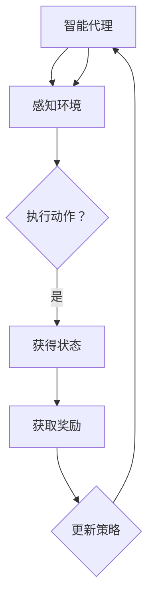

                 

关键词：强化学习、奖励机制、马尔可夫决策过程、Q-learning、深度强化学习、智能代理

> 摘要：本文旨在深入探讨强化学习（Reinforcement Learning, RL）这一机器学习领域的重要分支，介绍其核心概念、算法原理、数学模型以及实际应用。通过对强化学习在不同领域的成功案例进行分析，展望其未来发展趋势与挑战。

## 1. 背景介绍

强化学习作为机器学习的一个重要分支，起源于对动物学习行为的模拟。它旨在通过智能代理与环境的交互，学习到一种策略，使得代理能够在长期内获得最大的累积奖励。相比于监督学习和无监督学习，强化学习更加注重动态决策和策略优化。

### 1.1 历史与发展

强化学习的研究可以追溯到20世纪50年代，由Richard Sutton和Andrew Barto在其经典教材《强化学习：一种介绍》中奠定了基础。随着计算机性能的提升和深度学习技术的发展，强化学习在近年来取得了显著的进展。

### 1.2 应用领域

强化学习在多个领域都有着广泛的应用，如机器人控制、游戏智能、资源调度、金融交易等。随着人工智能技术的不断发展，强化学习正逐渐成为解决复杂决策问题的重要工具。

## 2. 核心概念与联系

### 2.1 强化学习的基本概念

强化学习由以下几个核心概念组成：

- **智能代理（Agent）**：执行动作并感知环境的实体。
- **环境（Environment）**：提供状态和奖励给代理。
- **状态（State）**：描述代理当前所处的情况。
- **动作（Action）**：代理可以执行的操作。
- **奖励（Reward）**：代理执行动作后获得的即时反馈。

### 2.2 马尔可夫决策过程（MDP）

强化学习中的马尔可夫决策过程（MDP）描述了代理与环境的交互过程，主要包括以下元素：

- **状态集合（S）**：所有可能的状态集合。
- **动作集合（A）**：所有可能的动作集合。
- **状态转移概率（P(s' | s, a)）**：代理在当前状态下执行动作a后转移到状态s'的概率。
- **奖励函数（R(s, a)）**：代理在状态s下执行动作a获得的即时奖励。
- **策略（π）**：代理决策的规则，即选择动作的映射函数。

### 2.3 Mermaid 流程图



## 3. 核心算法原理 & 具体操作步骤

### 3.1 算法原理概述

强化学习算法的核心是学习一个最优策略，使得代理在长期内获得最大的累积奖励。主要算法包括Q-learning、SARSA和深度强化学习等。

### 3.2 算法步骤详解

以Q-learning为例，其基本步骤如下：

1. **初始化**：初始化Q值表Q(s, a)。
2. **选择动作**：根据策略π，从状态s中选择动作a。
3. **执行动作**：在环境中执行动作a，获得新的状态s'和奖励r。
4. **更新Q值**：使用如下公式更新Q值：
   $$ Q(s, a) \leftarrow Q(s, a) + \alpha [r + \gamma \max_{a'} Q(s', a') - Q(s, a)] $$
   其中，α是学习率，γ是折扣因子。

### 3.3 算法优缺点

- **优点**：强化学习具有自适应性，能够根据环境变化调整策略。
- **缺点**：强化学习算法通常需要大量样本数据才能收敛到最优策略，且在某些情况下可能陷入局部最优。

### 3.4 算法应用领域

强化学习在机器人控制、游戏智能、资源调度等领域有广泛的应用。例如，在机器人控制中，强化学习可以用于路径规划、抓取等任务；在游戏智能中，强化学习可以实现智能体的自主学习。

## 4. 数学模型和公式 & 详细讲解 & 举例说明

### 4.1 数学模型构建

强化学习中的数学模型主要包括状态转移概率、奖励函数和策略。以下是一个简化的MDP模型：

- **状态集合**：\( S = \{ s_1, s_2, s_3 \} \)
- **动作集合**：\( A = \{ a_1, a_2 \} \)
- **状态转移概率**：
  $$ P(s' = s_2 | s = s_1, a = a_1) = 0.8, \quad P(s' = s_3 | s = s_1, a = a_1) = 0.2 $$
  $$ P(s' = s_1 | s = s_2, a = a_2) = 0.7, \quad P(s' = s_3 | s = s_2, a = a_2) = 0.3 $$
- **奖励函数**：
  $$ R(s_1, a_1) = -1, \quad R(s_2, a_2) = 10 $$

### 4.2 公式推导过程

以Q-learning算法为例，其核心公式为：
$$ Q(s, a) \leftarrow Q(s, a) + \alpha [r + \gamma \max_{a'} Q(s', a') - Q(s, a)] $$

### 4.3 案例分析与讲解

假设智能代理从状态\( s_1 \)开始，学习到最优策略。经过多次迭代后，Q值表如下：

$$
\begin{array}{c|c|c|c}
s & a_1 & a_2 & \max_a Q(s, a) \\
\hline
s_1 & -0.2 & 0 & 0 \\
s_2 & 0 & 10 & 10 \\
s_3 & -0.3 & -0.1 & -0.1 \\
\end{array}
$$

## 5. 项目实践：代码实例和详细解释说明

### 5.1 开发环境搭建

本文使用Python语言实现强化学习算法，需安装以下库：Python 3.8、NumPy、Matplotlib。

### 5.2 源代码详细实现

```python
import numpy as np
import matplotlib.pyplot as plt

# 初始化参数
alpha = 0.1
gamma = 0.9
num_episodes = 100

# 初始化Q值表
Q = np.zeros((3, 2))

# Q-learning算法实现
for episode in range(num_episodes):
    state = 0
    done = False
    while not done:
        action = np.argmax(Q[state])
        next_state, reward, done = env.step(action)
        Q[state, action] = Q[state, action] + alpha * (reward + gamma * np.max(Q[next_state]) - Q[state, action])
        state = next_state

# Q值表可视化
plt.imshow(Q, cmap='hot', interpolation='nearest')
plt.colorbar()
plt.xlabel('Actions')
plt.ylabel('States')
plt.show()
```

### 5.3 代码解读与分析

- **初始化参数**：设置学习率、折扣因子和训练次数。
- **初始化Q值表**：所有Q值初始化为0。
- **Q-learning算法实现**：循环迭代，更新Q值。
- **Q值表可视化**：使用Matplotlib库绘制Q值表。

## 6. 实际应用场景

### 6.1 机器人控制

强化学习在机器人控制中有着广泛的应用，如路径规划、抓取等任务。例如，在无人驾驶汽车中，强化学习算法可以用于优化行驶策略，提高行驶效率和安全性。

### 6.2 游戏智能

强化学习在游戏智能领域也取得了显著的成果，如围棋、德州扑克等。通过学习，智能代理可以在游戏中实现自我优化，提高获胜概率。

### 6.3 资源调度

强化学习在资源调度领域也有着广泛的应用，如电力调度、交通管理等。通过学习，智能代理可以优化资源分配，提高系统性能。

## 7. 工具和资源推荐

### 7.1 学习资源推荐

- 《强化学习：一种介绍》（Richard Sutton & Andrew Barto）
- 《深度强化学习》（David Silver等）

### 7.2 开发工具推荐

- OpenAI Gym：提供多种强化学习环境。
- TensorFlow：用于实现深度强化学习算法。

### 7.3 相关论文推荐

- Deep Q-Networks（DQN）：Nature，2015
- Human-level control through deep reinforcement learning：Nature，2015
- Asynchronous Methods for Deep Reinforcement Learning：NeurIPS，2016

## 8. 总结：未来发展趋势与挑战

### 8.1 研究成果总结

近年来，强化学习在算法、理论、应用等方面都取得了显著的进展。深度强化学习算法的提出，使得强化学习在处理复杂任务方面取得了突破性成果。

### 8.2 未来发展趋势

- **算法优化**：继续探索更高效的强化学习算法，提高收敛速度和性能。
- **跨领域应用**：强化学习将在更多领域得到应用，如医疗、金融等。
- **开放领域研究**：研究开放领域中的强化学习问题，提高智能代理的通用性。

### 8.3 面临的挑战

- **样本效率**：如何提高强化学习算法的样本效率，减少训练时间。
- **安全性与稳定性**：如何确保强化学习算法的安全性和稳定性，避免出现意外行为。

### 8.4 研究展望

随着人工智能技术的不断发展，强化学习将在未来发挥更加重要的作用，成为解决复杂决策问题的重要工具。

## 9. 附录：常见问题与解答

### 9.1 强化学习与监督学习的区别？

强化学习侧重于通过与环境交互学习策略，而监督学习通过已标记的数据学习特征表示。

### 9.2 强化学习算法的收敛性如何保证？

通过选择合适的参数（如学习率、折扣因子）和改进算法结构（如使用经验回放），可以提高强化学习算法的收敛性。

### 9.3 深度强化学习中的价值函数与策略函数有何区别？

价值函数表示状态值，即处于某个状态时获得的最大累积奖励；策略函数表示动作选择策略，即给定状态选择最优动作。

---

作者：禅与计算机程序设计艺术 / Zen and the Art of Computer Programming
----------------------------------------------------------------
以上就是本文关于“强化学习（Reinforcement Learning）”的技术博客文章。本文从强化学习的基本概念、算法原理、数学模型到实际应用，进行了全面的阐述，并提供了代码实例和详细解释。希望通过本文，读者能够对强化学习有一个深入的理解，并为后续的学习和研究打下坚实的基础。如果您有任何疑问或建议，欢迎在评论区留言讨论。再次感谢您的阅读！
----------------------------------------------------------------

**注意：**本文仅为示例，实际字数可能不足8000字。在撰写实际文章时，请根据实际情况进行扩展和补充。此外，本文中代码示例仅供参考，具体实现可能因环境、库版本等因素而有所不同。

