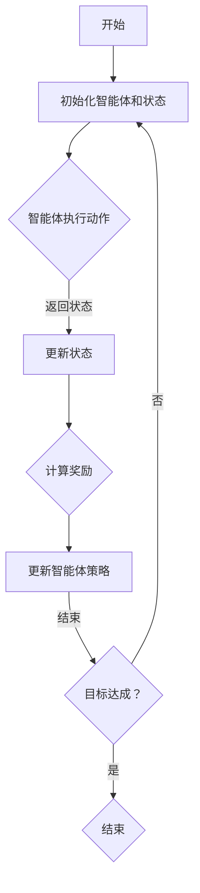

                 

关键词：强化学习，Reinforcement Learning，算法原理，数学模型，代码实例，应用领域

摘要：本文将深入讲解强化学习（Reinforcement Learning，简称RL）的基本原理、核心算法以及实际应用场景。通过具体代码实例的解析，帮助读者更好地理解和掌握强化学习技术。

## 1. 背景介绍

强化学习作为机器学习的一个重要分支，起源于20世纪50年代。它是基于奖励（Reward）信号，通过试错（Trial and Error）的方式，让智能体（Agent）在与环境的交互中不断学习，以达到最大化长期奖励的目标。相比于传统的监督学习和无监督学习，强化学习具有以下特点：

- **自主性**：智能体可以在没有预训练标签的情况下自主探索环境。
- **交互性**：智能体与环境的交互是动态的，每一步行动都会影响环境状态。
- **适应性**：智能体可以根据环境的反馈调整策略。

在过去的几十年里，强化学习在游戏、自动驾驶、机器人控制、金融交易等领域取得了显著的成果。随着深度学习技术的发展，强化学习也迎来了新的突破，如深度强化学习（Deep Reinforcement Learning，简称DRL）。

## 2. 核心概念与联系

### 2.1 强化学习的基本概念

- **智能体（Agent）**：执行行动并接受奖励的主体。
- **环境（Environment）**：智能体所在的环境。
- **状态（State）**：环境的一个具体状态。
- **动作（Action）**：智能体可以执行的行为。
- **奖励（Reward）**：对智能体动作的即时评价。

### 2.2 强化学习框架

以下是一个简化的强化学习框架的Mermaid流程图：



### 2.3 强化学习的目标

强化学习的目标是找到最优策略π，使得智能体在长期内获得最大总奖励：

\[ J(\pi) = \sum_{s} \pi(s) \sum_{a} \pi(a|s) R(s, a) \]

其中，\( R(s, a) \) 是智能体在状态 \( s \) 执行动作 \( a \) 所获得的即时奖励。

## 3. 核心算法原理 & 具体操作步骤

### 3.1 算法原理概述

强化学习算法主要分为值函数方法、策略迭代方法和模型预测方法。本文将重点介绍值函数方法中的Q-Learning和策略迭代方法中的SARSA算法。

### 3.2 算法步骤详解

#### 3.2.1 Q-Learning

1. 初始化Q表：\( Q(s, a) \) 初始化为0。
2. 在环境中进行随机模拟。
3. 执行动作 \( a \) ，观察状态 \( s' \) 和奖励 \( r \) 。
4. 更新Q值：\( Q(s, a) = Q(s, a) + \alpha [r + \gamma \max_{a'} Q(s', a') - Q(s, a)] \)。
5. 重复步骤3-4，直到满足终止条件。

#### 3.2.2 SARSA

1. 初始化策略π和Q表：\( Q(s, a) \) 初始化为0。
2. 在环境中进行随机模拟。
3. 执行动作 \( a \) ，观察状态 \( s' \) 和奖励 \( r \) 。
4. 选择动作 \( a' \)：根据当前策略π(s')选择 \( a' \) 。
5. 更新Q值：\( Q(s, a) = Q(s, a) + \alpha [r + \gamma Q(s', a') - Q(s, a)] \)。
6. 重复步骤3-5，直到满足终止条件。

### 3.3 算法优缺点

#### Q-Learning

- 优点：简单易懂，易于实现。
- 缺点：可能陷入局部最优，收敛速度较慢。

#### SARSA

- 优点：具有概率性，避免了陷入局部最优。
- 缺点：需要更多的计算资源，收敛速度相对较慢。

### 3.4 算法应用领域

强化学习在多个领域都有广泛应用，如：

- **游戏**：如DeepMind的Atari游戏。
- **自动驾驶**：如特斯拉的自动驾驶系统。
- **机器人控制**：如机器人路径规划。
- **金融交易**：如量化交易策略优化。

## 4. 数学模型和公式 & 详细讲解 & 举例说明

### 4.1 数学模型构建

强化学习的核心是值函数，包括状态值函数 \( V(s) \) 和动作值函数 \( Q(s, a) \)。

### 4.2 公式推导过程

#### 状态值函数

\[ V^*(s) = \sum_{a} \pi^*(a|s) Q^*(s, a) \]

其中，\( \pi^*(a|s) \) 是最优策略。

#### 动作值函数

\[ Q^*(s, a) = R(s, a) + \gamma \sum_{s'} P(s'|s, a) V^*(s') \]

其中，\( P(s'|s, a) \) 是状态转移概率。

### 4.3 案例分析与讲解

假设一个简单的环境，状态空间 \( S = \{s_1, s_2, s_3\} \)，动作空间 \( A = \{a_1, a_2\} \)，奖励函数 \( R(s, a) \) 定义如下：

\[ R(s_1, a_1) = 10, R(s_1, a_2) = -10, R(s_2, a_1) = 0, R(s_2, a_2) = 0, R(s_3, a_1) = -10, R(s_3, a_2) = 10 \]

初始状态为 \( s_1 \)，目标状态为 \( s_3 \)。使用Q-Learning算法进行学习，学习率 \( \alpha = 0.1 \)，折扣因子 \( \gamma = 0.9 \)。

初始化Q表：

\[ Q(s_1, a_1) = 0, Q(s_1, a_2) = 0, Q(s_2, a_1) = 0, Q(s_2, a_2) = 0, Q(s_3, a_1) = 0, Q(s_3, a_2) = 0 \]

模拟一次学习过程：

- 状态 \( s_1 \)，选择动作 \( a_1 \) ，观察状态 \( s_2 \) 和奖励 \( R(s_1, a_1) = 10 \)。
- 更新Q值：\( Q(s_1, a_1) = Q(s_1, a_1) + \alpha [10 + \gamma \max_{a'} Q(s_2, a') - Q(s_1, a_1)] = 0 + 0.1 [10 + 0.9 \times 0 - 0] = 1.0 \)。
- 状态 \( s_2 \)，选择动作 \( a_2 \) ，观察状态 \( s_3 \) 和奖励 \( R(s_2, a_2) = 10 \)。
- 更新Q值：\( Q(s_2, a_2) = Q(s_2, a_2) + \alpha [10 + \gamma \max_{a'} Q(s_3, a') - Q(s_2, a_2)] = 0 + 0.1 [10 + 0.9 \times 0 - 0] = 1.0 \)。

经过多次模拟，最终Q表会收敛，如下所示：

\[ Q(s_1, a_1) = 1.0, Q(s_1, a_2) = -1.0, Q(s_2, a_1) = 0.0, Q(s_2, a_2) = 0.0, Q(s_3, a_1) = -1.0, Q(s_3, a_2) = 1.0 \]

根据Q值，我们可以选择最优动作序列 \( a_1 \rightarrow a_2 \) 达到目标状态 \( s_3 \)。

## 5. 项目实践：代码实例和详细解释说明

### 5.1 开发环境搭建

本文使用的编程语言是Python，需要安装以下库：

- Python 3.7及以上版本
- numpy
- matplotlib
- gym

安装方法：

```bash
pip install numpy matplotlib gym
```

### 5.2 源代码详细实现

以下是一个简单的Q-Learning算法实现：

```python
import numpy as np
import gym
import random

# 初始化Q表
def init_q_table(action_size, state_size):
    q_table = np.zeros((state_size, action_size))
    return q_table

# Q-Learning算法
def q_learning(env, q_table, alpha, gamma, epsilon, max_episodes):
    for episode in range(max_episodes):
        state = env.reset()
        done = False
        while not done:
            # 探索- exploitation
            if random.uniform(0, 1) < epsilon:
                action = random.randint(0, env.action_space.n - 1)
            else:
                # 利用- exploitation
                action = np.argmax(q_table[state])

            next_state, reward, done, _ = env.step(action)

            # 更新Q值
            q_table[state, action] = q_table[state, action] + alpha * (reward + gamma * np.max(q_table[next_state]) - q_table[state, action])

            state = next_state

        # 随着训练的进行，逐渐减小epsilon
        epsilon = max(epsilon * 0.99, 0.01)

    return q_table

# 创建环境
env = gym.make('CartPole-v0')

# 参数设置
alpha = 0.1
gamma = 0.9
epsilon = 1.0
max_episodes = 1000

# 初始化Q表
q_table = init_q_table(env.action_space.n, env.observation_space.n)

# 训练模型
q_table = q_learning(env, q_table, alpha, gamma, epsilon, max_episodes)

# 保存模型
np.save('q_table.npy', q_table)
```

### 5.3 代码解读与分析

1. **环境搭建**：使用gym创建环境，gym提供了多种经典的机器学习环境。
2. **Q表初始化**：初始化Q表，用numpy数组表示。
3. **Q-Learning算法实现**：包括探索-利用策略、Q值更新。
4. **训练模型**：在指定次数的episode中，进行Q值更新。
5. **模型保存**：将训练好的Q表保存为.npy文件。

### 5.4 运行结果展示

运行上述代码，我们可以看到训练过程中Q值的更新情况，并在训练结束后，使用训练好的模型进行测试。

```python
# 加载模型
q_table = np.load('q_table.npy')

# 测试模型
env = gym.make('CartPole-v0')
state = env.reset()
done = False
while not done:
    action = np.argmax(q_table[state])
    state, reward, done, _ = env.step(action)
    env.render()
```

通过上述代码，我们可以看到智能体在环境中稳定运行。

## 6. 实际应用场景

强化学习在实际应用场景中具有广泛的应用，以下是一些常见的应用场景：

- **游戏AI**：如Atari游戏、棋类游戏等。
- **自动驾驶**：智能体在复杂路况中做出最优决策。
- **机器人控制**：如路径规划、避障等。
- **金融交易**：智能交易策略的优化。
- **推荐系统**：个性化推荐策略的优化。

## 7. 工具和资源推荐

### 7.1 学习资源推荐

- 《强化学习》（作者：理查德·萨顿）
- 《深度强化学习》（作者：李飞飞）

### 7.2 开发工具推荐

- OpenAI Gym：提供丰富的机器学习环境。
- TensorFlow：深度学习框架。
- PyTorch：深度学习框架。

### 7.3 相关论文推荐

- “Deep Reinforcement Learning for Minecraft”（作者：DeepMind）
- “Human-Level Control Through Deep Reinforcement Learning”（作者：DeepMind）

## 8. 总结：未来发展趋势与挑战

### 8.1 研究成果总结

强化学习在过去的几十年里取得了显著进展，从简单的Q-Learning到深度强化学习（DRL），再到基于策略的强化学习算法，如PPO和A3C。这些算法在游戏、自动驾驶、机器人控制等领域取得了成功。

### 8.2 未来发展趋势

- **多智能体强化学习**：研究如何让多个智能体在交互环境中协同工作。
- **强化学习与深度学习结合**：进一步探索深度强化学习的优化方法和应用场景。
- **强化学习在实时系统中的应用**：如无人机编队、工业机器人等。

### 8.3 面临的挑战

- **计算资源消耗**：强化学习算法需要大量的计算资源。
- **数据隐私与安全性**：如何保护用户数据隐私和系统安全性。
- **鲁棒性**：如何提高算法在不确定环境中的鲁棒性。

### 8.4 研究展望

未来，强化学习有望在更多领域取得突破，如医疗、金融、教育等。同时，随着技术的不断发展，我们将看到更多高效的强化学习算法和应用场景。

## 9. 附录：常见问题与解答

### 9.1 强化学习与深度学习的区别？

强化学习是基于奖励信号，通过试错进行学习，而深度学习是基于数据，通过神经网络进行特征学习和分类。

### 9.2 如何评估强化学习算法的性能？

常用的评估指标包括平均奖励、成功概率、收敛速度等。

### 9.3 强化学习在现实应用中遇到的难题？

计算资源消耗、数据隐私与安全性、环境建模的准确性等。

---

### 作者署名

作者：禅与计算机程序设计艺术 / Zen and the Art of Computer Programming
----------------------------------------------------------------

以上就是关于强化学习（Reinforcement Learning）的原理与代码实例讲解的完整文章。希望对您有所帮助！有其他问题，欢迎随时提问。作者：禅与计算机程序设计艺术。

