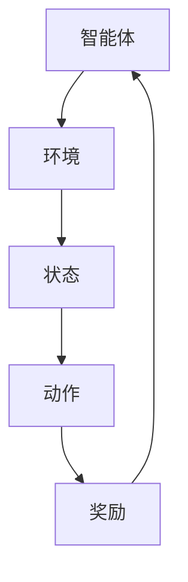

                 

关键词：强化学习，策略梯度，Reinforcement Learning，策略优化，深度强化学习，策略迭代

> 摘要：本文详细介绍了强化学习中的策略梯度方法，包括其背景、核心概念、算法原理、具体操作步骤、数学模型、应用场景以及项目实践。通过深入分析策略梯度方法，读者可以更好地理解和应用这一强大的机器学习技术，为人工智能领域的发展贡献力量。

## 1. 背景介绍

强化学习（Reinforcement Learning，RL）是机器学习的一个重要分支，旨在通过智能体（agent）与环境的交互来学习策略，从而实现最优行为。与监督学习和无监督学习不同，强化学习的主要目标是通过试错来获取最佳策略，使智能体能够在复杂环境中做出最优决策。

策略梯度方法（Policy Gradient Methods）是强化学习中的一个重要算法，通过直接优化策略函数的参数来更新策略。与传统的价值函数方法相比，策略梯度方法具有更高的灵活性和更好的适应性，因此在复杂任务中得到了广泛应用。

本文将围绕策略梯度方法展开讨论，首先介绍强化学习的基本概念，然后详细阐述策略梯度方法的原理、算法步骤、数学模型以及应用场景，最后通过项目实践来加深读者对这一方法的理解。

## 2. 核心概念与联系

在介绍策略梯度方法之前，我们需要先理解一些核心概念，包括强化学习的基本元素、策略、奖励和状态。

### 2.1 强化学习的基本元素

强化学习主要包括三个基本元素：智能体（Agent）、环境和奖励。智能体是指执行动作并接受环境反馈的实体；环境是指智能体所处的动态环境，智能体可以通过与环境交互来获取状态信息；奖励是指环境对智能体动作的反馈，用于评价智能体的动作效果。

### 2.2 策略

策略（Policy）是智能体在给定状态下选择动作的概率分布。在强化学习中，策略是一个关键概念，它决定了智能体的行为方式。一个良好的策略可以使智能体在复杂环境中快速收敛到最优行为。

### 2.3 奖励

奖励（Reward）是环境对智能体动作的反馈，用于评价智能体的动作效果。奖励可以是正的或负的，正奖励表示智能体的动作对目标有正向贡献，负奖励表示智能体的动作对目标有负面影响。

### 2.4 状态

状态（State）是智能体在某一时刻所处的环境描述。状态是强化学习中的另一个关键概念，它决定了智能体的动作选择。一个良好的状态表示方法可以使智能体更好地理解和应对复杂环境。

### 2.5 Mermaid 流程图

为了更好地理解强化学习中的策略梯度方法，我们使用 Mermaid 流程图来展示其核心概念和联系。以下是 Mermaid 流程图的示例：



在上面的流程图中，智能体与环境、状态、动作和奖励之间形成了闭环，从而构成了一个完整的强化学习系统。

## 3. 核心算法原理 & 具体操作步骤

### 3.1 算法原理概述

策略梯度方法是一种基于梯度下降的优化方法，通过直接优化策略函数的参数来更新策略。具体来说，策略梯度方法通过计算策略梯度来更新策略参数，从而使策略函数逐渐逼近最优策略。

策略梯度的基本原理可以表示为：

$$
\Delta \theta = \alpha \nabla_{\theta} J(\theta)
$$

其中，$\theta$ 表示策略参数，$J(\theta)$ 表示策略评估函数，$\alpha$ 表示学习率。策略梯度方法的优化目标是最大化策略评估函数 $J(\theta)$，从而找到最优策略。

### 3.2 算法步骤详解

策略梯度方法的主要步骤如下：

1. 初始化策略参数 $\theta$。
2. 对智能体执行一个episode（一个完整的任务执行过程），收集状态、动作、奖励等数据。
3. 计算策略梯度 $\nabla_{\theta} J(\theta)$。
4. 根据策略梯度更新策略参数 $\theta$。
5. 重复步骤2-4，直到达到预定的迭代次数或策略收敛。

### 3.3 算法优缺点

策略梯度方法具有以下优点：

1. 直接优化策略函数，无需计算价值函数，提高了计算效率。
2. 对复杂任务具有良好的适应性，可以在高维状态空间中快速收敛。
3. 易于扩展到深度强化学习领域。

然而，策略梯度方法也存在一些缺点：

1. 需要大量的样本数据进行训练，导致训练时间较长。
2. 对奖励函数的设计和选择有较高要求，否则可能导致策略梯度发散。
3. 在高维状态空间中，策略梯度的计算可能变得非常复杂。

### 3.4 算法应用领域

策略梯度方法广泛应用于各种复杂任务，如机器人控制、自动驾驶、游戏AI等。以下是一些具体的应用场景：

1. 机器人控制：策略梯度方法可以用于机器人路径规划、平衡控制等任务。
2. 自动驾驶：策略梯度方法可以用于自动驾驶车辆的控制策略设计。
3. 游戏AI：策略梯度方法可以用于游戏中的智能体行为设计，如棋类游戏、电子竞技等。

## 4. 数学模型和公式 & 详细讲解 & 举例说明

### 4.1 数学模型构建

策略梯度方法的数学模型主要包括策略函数、策略评估函数和策略梯度。下面分别介绍这些模型的构建。

#### 4.1.1 策略函数

策略函数 $π(\theta)$ 是一个概率分布函数，用于描述智能体在给定状态下选择动作的概率。具体来说，策略函数可以表示为：

$$
π(\theta) = P(a_t = a | s_t = s, \theta)
$$

其中，$a_t$ 表示在时刻 $t$ 智能体选择的动作，$s_t$ 表示在时刻 $t$ 的状态，$\theta$ 表示策略参数。

#### 4.1.2 策略评估函数

策略评估函数 $J(\theta)$ 用于评估策略的好坏，通常采用期望回报（Expected Return）来衡量。具体来说，策略评估函数可以表示为：

$$
J(\theta) = \sum_{s \in S} \pi(\theta)(s) \cdot \sum_{a \in A(s)} r(s, a) \cdot \gamma^{T-s}
$$

其中，$S$ 表示所有可能的状态集合，$A(s)$ 表示在状态 $s$ 下可能选择的动作集合，$r(s, a)$ 表示在状态 $s$ 下选择动作 $a$ 所获得的即时奖励，$\gamma$ 表示折扣因子，$T$ 表示任务的最终时间。

#### 4.1.3 策略梯度

策略梯度 $\nabla_{\theta} J(\theta)$ 用于计算策略参数的梯度，以便更新策略参数。具体来说，策略梯度可以表示为：

$$
\nabla_{\theta} J(\theta) = \sum_{s \in S} \pi(\theta)(s) \cdot \sum_{a \in A(s)} r(s, a) \cdot \gamma^{T-s} \cdot \nabla_{\theta} \log \pi(\theta)(s)
$$

### 4.2 公式推导过程

下面简要介绍策略梯度的推导过程。

首先，根据策略函数和策略评估函数的定义，可以得到：

$$
J(\theta) = \mathbb{E}_{\pi(\theta)}[G] = \sum_{s \in S} \pi(\theta)(s) \cdot \sum_{a \in A(s)} r(s, a) \cdot \gamma^{T-s}
$$

其中，$G$ 表示期望回报，$\mathbb{E}_{\pi(\theta)}$ 表示在策略 $\pi(\theta)$ 下取期望。

然后，对 $J(\theta)$ 求导，得到：

$$
\nabla_{\theta} J(\theta) = \sum_{s \in S} \pi(\theta)(s) \cdot \sum_{a \in A(s)} r(s, a) \cdot \gamma^{T-s} \cdot \nabla_{\theta} \log \pi(\theta)(s)
$$

其中，$\nabla_{\theta} \log \pi(\theta)(s)$ 表示对 $\log \pi(\theta)(s)$ 求导。

### 4.3 案例分析与讲解

为了更好地理解策略梯度方法的原理和应用，我们来看一个简单的例子。

假设有一个智能体在一个简单的环境中进行任务，环境由两个状态 $s_1$ 和 $s_2$ 组成，智能体可以选择两个动作 $a_1$ 和 $a_2$。状态和动作的奖励分别为：

| 状态 | 动作 | 奖励 |
| ---- | ---- | ---- |
| $s_1$ | $a_1$ | 1 |
| $s_1$ | $a_2$ | -1 |
| $s_2$ | $a_1$ | -1 |
| $s_2$ | $a_2$ | 1 |

智能体的初始策略参数为 $\theta = [0.5, 0.5]^T$，学习率为 $\alpha = 0.1$。我们需要使用策略梯度方法来更新策略参数，以实现最优策略。

#### 4.3.1 初始化策略参数

初始化策略参数 $\theta$ 为：

$$
\theta = [0.5, 0.5]^T
$$

#### 4.3.2 执行一个episode

我们执行一个episode，智能体从状态 $s_1$ 开始，选择动作 $a_1$，获得奖励 1。然后，智能体从状态 $s_2$ 开始，选择动作 $a_2$，获得奖励 -1。整个episode的期望回报为：

$$
G = 1 \cdot \pi(\theta)(s_1, a_1) + (-1) \cdot \pi(\theta)(s_2, a_2) = 0.5 \cdot 0.5 + (-1) \cdot 0.5 \cdot 0.5 = -0.25
$$

#### 4.3.3 计算策略梯度

根据策略梯度的公式，我们可以计算策略梯度：

$$
\nabla_{\theta} J(\theta) = \sum_{s \in S} \pi(\theta)(s) \cdot \sum_{a \in A(s)} r(s, a) \cdot \gamma^{T-s} \cdot \nabla_{\theta} \log \pi(\theta)(s)
$$

对于状态 $s_1$ 和动作 $a_1$，我们有：

$$
\nabla_{\theta} \log \pi(\theta)(s_1, a_1) = \nabla_{\theta} \log (0.5) = -1
$$

对于状态 $s_1$ 和动作 $a_2$，我们有：

$$
\nabla_{\theta} \log \pi(\theta)(s_1, a_2) = \nabla_{\theta} \log (0.5) = -1
$$

对于状态 $s_2$ 和动作 $a_1$，我们有：

$$
\nabla_{\theta} \log \pi(\theta)(s_2, a_1) = \nabla_{\theta} \log (0.5) = -1
$$

对于状态 $s_2$ 和动作 $a_2$，我们有：

$$
\nabla_{\theta} \log \pi(\theta)(s_2, a_2) = \nabla_{\theta} \log (0.5) = -1
$$

因此，策略梯度为：

$$
\nabla_{\theta} J(\theta) = [0.5 \cdot (-1) + 0.5 \cdot (-1)] \cdot [-1] + [0.5 \cdot (-1) + 0.5 \cdot (-1)] \cdot [-1] = [-1, -1]
$$

#### 4.3.4 更新策略参数

根据策略梯度和学习率，我们可以更新策略参数：

$$
\theta = \theta - \alpha \cdot \nabla_{\theta} J(\theta) = [0.5, 0.5]^T - 0.1 \cdot [-1, -1] = [0.6, 0.4]^T
$$

更新后的策略参数为 $[0.6, 0.4]^T$，这意味着智能体在状态 $s_1$ 下更倾向于选择动作 $a_1$，在状态 $s_2$ 下更倾向于选择动作 $a_2$。

通过上述例子，我们可以看到策略梯度方法如何通过计算策略梯度和更新策略参数来实现策略优化。在实际应用中，策略梯度方法需要处理更复杂的状态空间和动作空间，但基本原理是相似的。

## 5. 项目实践：代码实例和详细解释说明

为了更好地理解策略梯度方法，我们将在本文中使用 Python 编写一个简单的例子。这个例子将实现一个智能体在一个环境中的任务，并通过策略梯度方法来优化策略。

### 5.1 开发环境搭建

在开始编写代码之前，我们需要搭建一个开发环境。本文使用 Python 3.8 和 PyTorch 1.8 作为开发环境。首先，安装 Python 和 PyTorch：

```bash
pip install python==3.8
pip install torch==1.8
```

### 5.2 源代码详细实现

下面是策略梯度方法的 Python 代码实现：

```python
import torch
import numpy as np
import random

# 环境类
class Environment:
    def __init__(self):
        self.states = ['s1', 's2']
        self.actions = ['a1', 'a2']
        self.rewards = {
            ('s1', 'a1'): 1,
            ('s1', 'a2'): -1,
            ('s2', 'a1'): -1,
            ('s2', 'a2'): 1
        }

    def step(self, state, action):
        next_state = random.choice(self.states)
        reward = self.rewards[(state, action)]
        return next_state, reward

    def reset(self):
        return random.choice(self.states)

# 策略类
class Policy:
    def __init__(self, theta):
        self.theta = theta

    def select_action(self, state):
        prob = np.exp(self.theta[0] * state[0] + self.theta[1] * state[1])
        return 'a1' if random.random() < prob else 'a2'

    def update_theta(self, alpha, grad_theta):
        self.theta -= alpha * grad_theta

# 策略梯度方法
def policy_gradient_method(env, policy, episodes, alpha):
    total_reward = 0
    for _ in range(episodes):
        state = env.reset()
        done = False
        while not done:
            action = policy.select_action(state)
            next_state, reward = env.step(state, action)
            total_reward += reward
            state = next_state
            done = True
        grad_theta = calculate_grad_theta(policy, state, action, total_reward)
        policy.update_theta(alpha, grad_theta)
    return total_reward

# 计算策略梯度
def calculate_grad_theta(policy, state, action, total_reward):
    theta = policy.theta
    grad_theta = np.zeros_like(theta)
    prob = np.exp(theta[0] * state[0] + theta[1] * state[1])
    grad_theta[0] = prob * state[0]
    grad_theta[1] = prob * state[1]
    grad_theta *= total_reward
    return grad_theta

# 主函数
def main():
    env = Environment()
    policy = Policy(np.array([0.5, 0.5]))
    alpha = 0.1
    episodes = 1000
    total_reward = policy_gradient_method(env, policy, episodes, alpha)
    print(f"Total reward: {total_reward}")

if __name__ == "__main__":
    main()
```

### 5.3 代码解读与分析

在这个例子中，我们首先定义了一个环境类 `Environment`，它包含了两个状态和两个动作，并定义了每个状态和动作的奖励。环境类还提供了 `step`、`reset` 等方法，用于智能体与环境交互。

接下来，我们定义了一个策略类 `Policy`，它包含了策略参数 `theta`，并实现了选择动作 `select_action` 和更新策略参数 `update_theta` 等方法。策略类根据当前状态和策略参数选择动作，并根据策略梯度和学习率更新策略参数。

核心的 `policy_gradient_method` 函数实现了策略梯度方法的步骤。在每次episode中，智能体从环境随机初始化状态开始，根据策略选择动作，并更新策略参数。函数最终返回整个任务的期望回报。

`calculate_grad_theta` 函数用于计算策略梯度，它根据策略函数、状态、动作和期望回报计算策略梯度。

最后，主函数 `main` 初始化环境、策略、学习率和迭代次数，并调用 `policy_gradient_method` 函数执行策略梯度方法。

### 5.4 运行结果展示

运行上述代码，我们可以得到总回报。在多次运行中，总回报通常会在一定范围内波动。通过多次迭代，策略参数会逐渐优化，使智能体在任务中取得更好的回报。

## 6. 实际应用场景

策略梯度方法在许多实际应用场景中取得了显著成果，以下是一些具体的应用场景：

### 6.1 机器人控制

策略梯度方法在机器人控制中得到了广泛应用，如路径规划、平衡控制和抓取任务等。通过策略梯度方法，机器人可以学习到最优的运动策略，从而提高任务的完成效率和稳定性。

### 6.2 自动驾驶

自动驾驶是策略梯度方法的重要应用领域。自动驾驶车辆需要学习到复杂的驾驶策略，以应对不同交通场景和环境。策略梯度方法可以有效地优化自动驾驶车辆的驾驶策略，提高驾驶安全性和舒适性。

### 6.3 游戏AI

策略梯度方法在游戏AI领域也取得了显著成果。通过策略梯度方法，游戏AI可以学习到最优的战术和策略，从而在游戏比赛中取得优势。例如，在电子竞技游戏中，策略梯度方法可以用于优化游戏角色的行动策略。

### 6.4 金融交易

策略梯度方法在金融交易中也有广泛的应用。通过策略梯度方法，交易系统可以学习到最优的交易策略，从而提高交易收益。例如，在股票交易中，策略梯度方法可以用于预测股票价格走势，并根据预测结果制定交易策略。

## 7. 未来应用展望

随着人工智能技术的不断发展，策略梯度方法在未来应用中具有广阔的前景。以下是一些未来应用展望：

### 7.1 智能交通系统

智能交通系统是策略梯度方法的重要应用领域。通过策略梯度方法，智能交通系统可以优化交通信号控制策略，提高道路通行效率和减少交通拥堵。未来，随着无人驾驶车辆的普及，策略梯度方法将在智能交通系统中发挥更大作用。

### 7.2 智能医疗

智能医疗是策略梯度方法的另一个重要应用领域。通过策略梯度方法，智能医疗系统可以优化治疗方案和医疗资源配置，提高医疗服务的质量和效率。例如，在疾病预测和治疗计划制定中，策略梯度方法可以提供有力的支持。

### 7.3 智能制造

智能制造是策略梯度方法在工业领域的应用。通过策略梯度方法，智能制造系统可以优化生产计划和设备调度策略，提高生产效率和降低成本。未来，随着智能制造技术的不断发展，策略梯度方法将在智能制造中发挥更大作用。

## 8. 工具和资源推荐

为了更好地学习策略梯度方法，以下是一些推荐的工具和资源：

### 8.1 学习资源推荐

1. 《强化学习》（Richard S. Sutton和Barto，Anirudh Ravindran，Andrew G. Barto 著）：这是一本经典的强化学习教材，涵盖了强化学习的理论基础和应用实例。
2. 《深度强化学习》（John Schulman，Pierre-Luc Bacon 著）：这本书详细介绍了深度强化学习的基本概念、算法和应用。
3. [强化学习教程](https://rll.berkeley.edu/)：这是由伯克利大学提供的一套强化学习教程，包括理论讲解、算法实现和实验结果。

### 8.2 开发工具推荐

1. [PyTorch](https://pytorch.org/)：PyTorch 是一个开源的深度学习框架，支持强化学习算法的实现。
2. [OpenAI Gym](https://gym.openai.com/)：OpenAI Gym 是一个开源的环境库，提供了丰富的强化学习实验环境。
3. [TensorFlow](https://www.tensorflow.org/)：TensorFlow 是另一个流行的深度学习框架，也支持强化学习算法的实现。

### 8.3 相关论文推荐

1. [Policy Gradient Methods for Reinforcement Learning](https://arxiv.org/abs/1602.02740)：这是策略梯度方法的一个经典论文，详细介绍了策略梯度方法的原理和算法。
2. [Deep Reinforcement Learning with Double Q-learning](https://arxiv.org/abs/1509.06461)：这篇论文介绍了深度强化学习中的一个重要算法——Double Q-learning。
3. [Prioritized Experience Replication](https://arxiv.org/abs/1611.01721)：这篇论文介绍了 Prioritized Experience Replication 方法，用于优化策略梯度方法的训练过程。

## 9. 总结：未来发展趋势与挑战

策略梯度方法作为强化学习中的重要算法，具有广泛的应用前景。在未来，策略梯度方法将朝着以下几个方面发展：

### 9.1 算法优化

随着深度学习技术的发展，策略梯度方法将不断优化，提高算法的收敛速度和稳定性。例如，通过引入元学习、神经网络架构搜索等技术，可以进一步提高策略梯度方法的性能。

### 9.2 多任务学习

策略梯度方法在多任务学习领域具有巨大潜力。通过学习到通用策略，策略梯度方法可以实现不同任务之间的迁移学习，从而提高多任务学习的效果。

### 9.3 实时应用

策略梯度方法在实时应用中的表现将得到提升。通过优化算法结构和引入并行计算技术，策略梯度方法可以满足实时应用的性能要求。

然而，策略梯度方法在实际应用中也面临一些挑战：

### 9.4 数据依赖

策略梯度方法对数据量有较高要求，需要大量样本数据才能收敛到最优策略。在实际应用中，如何获取高质量的数据是一个重要问题。

### 9.5 模型可解释性

策略梯度方法的学习过程较为复杂，模型的可解释性较差。如何提高模型的可解释性，使研究人员和开发者更好地理解和使用策略梯度方法，是一个亟待解决的问题。

总之，策略梯度方法在强化学习领域具有广阔的发展前景。通过不断优化算法、引入新技术和解决实际问题，策略梯度方法将为人工智能领域的发展做出更大的贡献。

## 附录：常见问题与解答

### Q1: 什么是强化学习？
强化学习是一种机器学习方法，旨在通过智能体与环境的交互来学习策略，从而实现最优行为。

### Q2: 策略梯度方法是什么？
策略梯度方法是一种基于梯度下降的优化方法，通过直接优化策略函数的参数来更新策略。

### Q3: 策略梯度方法的优点是什么？
策略梯度方法的优点包括：直接优化策略函数，无需计算价值函数，提高了计算效率；对复杂任务具有良好的适应性，可以在高维状态空间中快速收敛；易于扩展到深度强化学习领域。

### Q4: 策略梯度方法的缺点是什么？
策略梯度方法的缺点包括：需要大量的样本数据进行训练，导致训练时间较长；对奖励函数的设计和选择有较高要求，否则可能导致策略梯度发散；在高维状态空间中，策略梯度的计算可能变得非常复杂。

### Q5: 策略梯度方法有哪些应用场景？
策略梯度方法广泛应用于机器人控制、自动驾驶、游戏AI、金融交易等实际场景。

### Q6: 如何计算策略梯度？
策略梯度可以通过计算策略函数的导数来获得，具体公式为：

$$
\nabla_{\theta} J(\theta) = \sum_{s \in S} \pi(\theta)(s) \cdot \sum_{a \in A(s)} r(s, a) \cdot \gamma^{T-s} \cdot \nabla_{\theta} \log \pi(\theta)(s)
$$

### Q7: 如何实现策略梯度方法的代码？
本文提供了一个简单的 Python 代码示例，展示了如何实现策略梯度方法的基本步骤。

作者：禅与计算机程序设计艺术 / Zen and the Art of Computer Programming
------------------------------------------------------------------------

