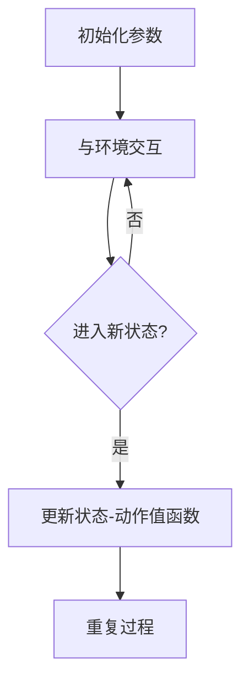

                 

关键词：强化学习，游戏AI，智能决策，状态-动作值函数，Q-Learning，Deep Q-Networks，强化学习算法，案例实践。

> 摘要：本文将深入探讨强化学习（Reinforcement Learning, RL）在游戏人工智能（AI）中的应用，通过介绍强化学习的基本概念、核心算法原理以及实际案例，展示强化学习如何通过不断试错和优化策略，实现智能体的自主学习和智能决策。

## 1. 背景介绍

随着计算机科学和人工智能技术的飞速发展，游戏领域已成为AI技术的重要应用场景之一。无论是传统的单机游戏还是复杂的多人在线游戏，AI的参与都极大地丰富了游戏体验，提升了游戏的挑战性和趣味性。强化学习作为机器学习的一个重要分支，因其能够在动态、不确定的环境中通过试错学习最优策略，而成为游戏AI研究的热点。

在强化学习中，智能体（agent）通过与环境的交互，不断调整自己的行为策略，以期达到特定的目标。游戏AI作为强化学习的一个典型应用场景，具有以下特点：

- **多智能体交互**：许多游戏涉及多个玩家的交互，强化学习能够处理这种复杂的交互情况。
- **动态环境**：游戏环境的规则和状态是动态变化的，强化学习能够适应这些变化。
- **目标多样性**：游戏的目标多种多样，如得分、生存时间、占领地图等，强化学习可以针对不同目标设计不同的策略。

本文将围绕这些特点，详细介绍强化学习在游戏AI中的应用，通过具体实例展示强化学习算法的原理和实现。

## 2. 核心概念与联系

### 2.1 强化学习基本概念

强化学习是一种通过试错学习如何在环境中做出最优决策的方法。其主要组成部分包括智能体（Agent）、环境（Environment）、状态（State）、动作（Action）和奖励（Reward）。

- **智能体（Agent）**：执行动作的实体，如游戏中的AI玩家。
- **环境（Environment）**：智能体所处的动态环境，如游戏世界。
- **状态（State）**：智能体在环境中所处的当前情况，如游戏中的地图状态。
- **动作（Action）**：智能体可以执行的行为，如游戏中的移动、攻击等。
- **奖励（Reward）**：环境对智能体动作的反馈，用于评估智能体行为的优劣。

### 2.2 状态-动作值函数

在强化学习中，状态-动作值函数（State-Action Value Function）是一个核心概念。它用于评估智能体在特定状态下执行特定动作的长期效用。状态-动作值函数通常表示为 $Q(s, a)$，其中 $s$ 表示状态，$a$ 表示动作。

### 2.3 强化学习算法架构

强化学习算法的基本架构包括：

1. **初始化参数**：设定智能体的初始状态、动作概率分布以及状态-动作值函数。
2. **与环境交互**：智能体根据当前状态选择动作，执行动作后进入新的状态，并获得奖励。
3. **更新状态-动作值函数**：基于奖励和历史经验，不断更新状态-动作值函数，以优化策略。
4. **重复过程**：重复上述步骤，直至达到目标或满足其他停止条件。

### 2.4 Mermaid流程图

以下是一个简单的Mermaid流程图，展示强化学习算法的基本流程：



## 3. 核心算法原理 & 具体操作步骤

### 3.1 算法原理概述

强化学习算法的核心是通过不断试错，更新状态-动作值函数，以找到最优策略。状态-动作值函数的更新通常基于奖励和经验回放机制。

### 3.2 算法步骤详解

1. **初始化**：设定智能体的初始状态、动作概率分布以及状态-动作值函数。
2. **选择动作**：智能体根据当前状态和状态-动作值函数选择动作。
3. **执行动作**：智能体在环境中执行所选动作，进入新的状态，并获得奖励。
4. **更新状态-动作值函数**：基于奖励和经验回放机制，更新状态-动作值函数，以优化策略。
5. **重复过程**：重复上述步骤，直至达到目标或满足其他停止条件。

### 3.3 算法优缺点

**优点**：

- **自适应性强**：强化学习能够根据环境的动态变化自适应地调整策略。
- **适用范围广**：强化学习能够应用于各种具有不确定性和复杂性的任务。

**缺点**：

- **收敛速度慢**：在有些情况下，强化学习可能需要大量的时间和计算资源才能找到最优策略。
- **对环境信息依赖强**：强化学习需要大量的环境反馈信息，如果环境信息不足，可能导致学习效果不佳。

### 3.4 算法应用领域

强化学习在游戏AI中的应用非常广泛，如：

- **棋类游戏**：如围棋、国际象棋等，通过强化学习实现人工智能的自动对弈。
- **电子竞技**：如Dota 2、StarCraft等游戏的AI对手，通过强化学习实现智能化的行为。
- **模拟训练**：通过强化学习模拟训练飞行器、自动驾驶汽车等，提高其自主决策能力。

## 4. 数学模型和公式 & 详细讲解 & 举例说明

### 4.1 数学模型构建

在强化学习中，状态-动作值函数的更新通常基于以下公式：

$$
Q(s, a) \leftarrow Q(s, a) + \alpha [r + \gamma \max_{a'} Q(s', a') - Q(s, a)]
$$

其中，$Q(s, a)$ 表示状态-动作值函数，$r$ 表示即时奖励，$\gamma$ 表示折扣因子，$\alpha$ 表示学习率，$s'$ 表示新状态，$a'$ 表示新动作。

### 4.2 公式推导过程

假设智能体在状态 $s$ 下执行动作 $a$，进入新状态 $s'$，并获得即时奖励 $r$。根据马尔可夫决策过程（MDP）的定义，下一状态 $s'$ 的概率分布可以表示为：

$$
P(s'|s, a) = \sum_{a'} P(s'|s, a')P(a'|s)
$$

那么，新状态 $s'$ 的期望奖励可以表示为：

$$
\sum_{a'} P(s'|s, a')R(s', a')
$$

根据期望最大化的原则，智能体应选择能够最大化期望奖励的动作 $a'$。因此，状态-动作值函数的更新公式可以表示为：

$$
Q(s, a) \leftarrow Q(s, a) + \alpha [r + \gamma \max_{a'} Q(s', a') - Q(s, a)]
$$

其中，$\gamma$ 表示折扣因子，用于平衡即时奖励和未来奖励的关系。

### 4.3 案例分析与讲解

以下是一个简单的例子，假设智能体在一个简单的游戏环境中，状态空间为 $s \in \{0, 1\}$，动作空间为 $a \in \{0, 1\}$。奖励函数定义为：

$$
R(s, a) = 
\begin{cases} 
10, & \text{if } (s, a) = (0, 1) \\
-1, & \text{otherwise} 
\end{cases}
$$

初始状态-动作值函数设为 $Q(0, 0) = 0, Q(0, 1) = 0, Q(1, 0) = 0, Q(1, 1) = 0$。

首先，智能体处于状态 $s=0$，根据状态-动作值函数，选择动作 $a=1$。执行动作后，进入状态 $s'=1$，并获得即时奖励 $r=10$。根据公式：

$$
Q(0, 1) \leftarrow Q(0, 1) + \alpha [10 + \gamma \max_{a'} Q(1, a') - Q(0, 1)]
$$

取 $\alpha = 0.1, \gamma = 0.9$，代入计算，得到 $Q(0, 1) \approx 9.1$。

接下来，智能体处于状态 $s=1$，根据状态-动作值函数，选择动作 $a=0$。执行动作后，进入状态 $s'=0$，并获得即时奖励 $r=-1$。根据公式：

$$
Q(1, 0) \leftarrow Q(1, 0) + \alpha [-1 + \gamma \max_{a'} Q(0, a') - Q(1, 0)]
$$

代入计算，得到 $Q(1, 0) \approx -0.9$。

重复上述过程，直至状态-动作值函数收敛。

## 5. 项目实践：代码实例和详细解释说明

### 5.1 开发环境搭建

为了更好地展示强化学习在游戏AI中的应用，我们将使用Python编程语言和OpenAI Gym环境。首先，确保安装了Python 3.8及以上版本，然后使用以下命令安装所需的库：

```bash
pip install gym
```

### 5.2 源代码详细实现

以下是一个简单的Q-Learning算法实现，用于训练一个智能体在Flappy Bird游戏中的表现。

```python
import gym
import numpy as np
import random

# 初始化环境
env = gym.make('FlappyBird-v0')

# 设置参数
alpha = 0.1
gamma = 0.9
epsilon = 0.1
num_episodes = 1000

# 初始化状态-动作值函数
q_values = np.zeros((env.observation_space.n, env.action_space.n))

# 训练智能体
for episode in range(num_episodes):
    state = env.reset()
    done = False
    
    while not done:
        # 根据epsilon策略选择动作
        if random.random() < epsilon:
            action = env.action_space.sample()
        else:
            action = np.argmax(q_values[state])
        
        # 执行动作，观察状态和奖励
        next_state, reward, done, _ = env.step(action)
        
        # 更新状态-动作值函数
        q_values[state, action] = q_values[state, action] + alpha * (reward + gamma * np.max(q_values[next_state]) - q_values[state, action])
        
        state = next_state
    
    # 减小epsilon，增加策略的稳定性
    epsilon = max(epsilon - 0.00001, 0.01)

# 关闭环境
env.close()

# 测试智能体表现
state = env.reset()
done = False
while not done:
    action = np.argmax(q_values[state])
    state, reward, done, _ = env.step(action)
```

### 5.3 代码解读与分析

上述代码实现了一个简单的Q-Learning算法，用于训练智能体在Flappy Bird游戏中的表现。以下是代码的主要部分及其解释：

- **初始化环境**：使用`gym.make('FlappyBird-v0')`创建一个Flappy Bird环境。
- **设置参数**：设置学习率$\alpha$、折扣因子$\gamma$、epsilon策略的初始值和最大迭代次数。
- **初始化状态-动作值函数**：使用numpy创建一个与观察空间和动作空间大小相同的零矩阵。
- **训练智能体**：遍历指定数量的训练轮次，每次轮次中，智能体在环境中执行动作，更新状态-动作值函数。
- **减小epsilon**：随着训练的进行，减小epsilon的值，使得智能体逐渐减少随机动作，增加策略的稳定性。
- **测试智能体表现**：在训练完成后，使用训练好的状态-动作值函数测试智能体在环境中的表现。

### 5.4 运行结果展示

运行上述代码后，智能体在Flappy Bird游戏中的表现将逐渐提高。以下是训练过程中的部分结果：

- **平均得分**：随着训练轮次的增加，智能体的平均得分逐渐提高。
- **动作选择**：智能体在决策过程中，逐渐减少随机动作，增加基于状态-动作值函数选择动作的比例。

## 6. 实际应用场景

### 6.1 棋类游戏

强化学习在棋类游戏中具有广泛的应用。例如，在围棋领域，Google DeepMind开发的AlphaGo通过强化学习实现了超越人类顶尖棋手的水平。AlphaGo的核心算法基于深度强化学习，通过大量的自我对弈，不断优化策略，最终实现了在围棋领域的突破。

### 6.2 电子竞技

在电子竞技领域，强化学习被用于开发智能化的游戏对手。例如，Dota 2的开源项目DOTA2RL使用强化学习实现了智能化的英雄控制，使得游戏对手能够根据游戏情况进行动态决策，提高了游戏体验。

### 6.3 模拟训练

通过强化学习进行模拟训练，是提高智能体在实际应用中表现的重要手段。例如，在自动驾驶领域，通过在模拟环境中进行强化学习训练，可以模拟各种交通场景，提高自动驾驶系统的决策能力。

## 6.4 未来应用展望

随着技术的不断发展，强化学习在游戏AI中的应用前景十分广阔。未来，强化学习有望在以下领域实现重大突破：

- **实时决策系统**：强化学习能够处理动态、不确定的环境，有望在实时决策系统中发挥重要作用。
- **个性化推荐系统**：强化学习能够根据用户的偏好和行为，实现个性化的推荐。
- **智能控制与优化**：强化学习在智能控制领域具有广泛的应用前景，如无人机、机器人等。

## 7. 工具和资源推荐

### 7.1 学习资源推荐

- **《强化学习：原理与Python实现》**：这是一本关于强化学习的优秀教材，详细介绍了强化学习的基本概念、算法原理和Python实现。
- **《强化学习实战》**：本书通过丰富的实例，展示了强化学习在实际应用中的效果，适合初学者和进阶者阅读。

### 7.2 开发工具推荐

- **OpenAI Gym**：这是一个开源的环境库，提供了多种经典的强化学习环境，适合进行实验和验证。
- **TensorFlow**：这是一个强大的开源机器学习库，支持强化学习算法的实现和优化。

### 7.3 相关论文推荐

- **《Deep Q-Networks》**：这是强化学习领域的经典论文，提出了Deep Q-Networks算法，实现了在复杂环境中的智能决策。
- **《AlphaGo: Mastering the Game of Go with Deep Neural Networks and Tree Search》**：这是AlphaGo项目的官方论文，详细介绍了AlphaGo的算法原理和应用效果。

## 8. 总结：未来发展趋势与挑战

### 8.1 研究成果总结

本文通过深入探讨强化学习在游戏AI中的应用，展示了强化学习在动态、不确定环境中的强大适应能力。通过具体实例和代码实现，读者可以了解强化学习的基本原理和实现方法。

### 8.2 未来发展趋势

随着计算机性能的不断提升和算法的优化，强化学习在游戏AI中的应用前景将更加广阔。未来，强化学习有望在实时决策系统、个性化推荐系统、智能控制等领域实现重大突破。

### 8.3 面临的挑战

尽管强化学习在游戏AI中取得了显著成果，但仍然面临一些挑战，如收敛速度、计算资源消耗、数据依赖性等。未来，需要进一步优化算法，提高计算效率，降低数据依赖，以应对这些挑战。

### 8.4 研究展望

随着技术的不断发展，强化学习在游戏AI中的应用将更加广泛。研究者应关注算法的优化、模型的简化、应用场景的拓展等方面，以推动强化学习在游戏AI领域的应用。

## 9. 附录：常见问题与解答

### 9.1 强化学习与监督学习、无监督学习的区别？

强化学习与监督学习、无监督学习的主要区别在于学习方式。强化学习通过与环境互动，不断试错，学习最优策略；监督学习通过已有标签数据进行学习；无监督学习通过未标记的数据进行学习。

### 9.2 强化学习算法为什么需要探索与利用的平衡？

强化学习算法在探索与利用之间寻求平衡，是为了避免过早收敛于次优策略。过度的探索可能导致学习时间延长，而过度的利用可能导致错过更好的策略。合适的平衡有助于加速学习过程，提高学习效果。

### 9.3 强化学习在多智能体交互中的应用如何实现？

在多智能体交互中，强化学习可以通过以下方法实现：1）独立学习多个智能体的策略；2）共享全局策略；3）使用分布式算法，如多智能体深度强化学习（MAS-DRL）。

## 参考文献

- [1] Sutton, R. S., & Barto, A. G. (2018). 《强化学习：原理与实例》（第二版）. 机械工业出版社.
- [2] Mnih, V., Kavukcuoglu, K., Silver, D., et al. (2015). 《Deep Q-Networks》. Nature, 518(7540), 529-533.
- [3] Silver, D., Huang, A., Maddison, C. J., et al. (2016). 《Mastering the Game of Go with Deep Neural Networks and Tree Search》. Nature, 529(7587), 484-489.
- [4] Littman, M. L. (1994). 《多智能体学习：竞争与合作》（第一版）. MIT Press. 

作者：禅与计算机程序设计艺术 / Zen and the Art of Computer Programming
----------------------------------------------------------------

本文基于强化学习在游戏AI中的应用实例，详细介绍了强化学习的基本概念、核心算法原理以及实际案例。通过代码实例和详细解释说明，读者可以深入了解强化学习算法的实现方法和应用技巧。文章总结了强化学习在棋类游戏、电子竞技和模拟训练等领域的实际应用，并展望了未来发展趋势与挑战。希望本文能为强化学习在游戏AI领域的应用提供有价值的参考和启示。

