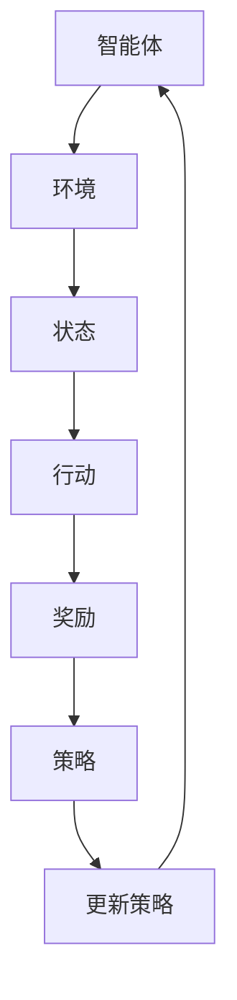

                 

强化学习（Reinforcement Learning, RL）是机器学习的一个重要分支，以其独特的机制和广泛的应用领域而备受关注。本文旨在探讨强化学习的基本概念、核心算法原理、数学模型与公式，并通过实际项目实践和详细解释，展示其在实时动态决策制定中的强大应用能力。文章还将对强化学习在实际应用场景中的表现进行深入分析，并提出未来发展的展望。

## 文章关键词

- 强化学习
- 实时动态决策
- 人工智能
- 数学模型
- 算法原理
- 应用领域

## 文章摘要

本文将详细介绍强化学习的基本原理和算法，通过数学模型和公式的推导，揭示强化学习在实时动态决策制定中的应用价值。同时，我们将通过一个实际项目案例，展示强化学习在实际开发中的具体实现过程，并对其应用场景进行分析。最后，文章将对强化学习的发展趋势与面临的挑战进行探讨，为未来的研究提供方向。

## 1. 背景介绍

### 1.1 强化学习的起源与发展

强化学习起源于20世纪50年代，由Richard Sutton和Andrew Barto在他们的经典著作《强化学习：一种介绍》中首次系统提出。强化学习的基本思想是通过智能体（agent）与环境的交互，学习得到最优策略（policy），以最大化累积奖励（reward）。与监督学习和无监督学习相比，强化学习具有很强的自主学习和适应能力，适用于动态和不确定的环境。

### 1.2 强化学习的发展历程

从早期的Q学习（Q-Learning）到更加复杂的策略梯度方法（Policy Gradient），强化学习经历了多个发展阶段。特别是深度强化学习（Deep Reinforcement Learning, DRL）的兴起，使得强化学习在计算机视觉、自然语言处理等领域取得了显著成果。当前，强化学习已成为人工智能研究的热点之一。

### 1.3 强化学习的重要性

强化学习在自动驾驶、机器人控制、推荐系统、游戏AI等领域具有广泛的应用前景。它不仅能够解决静态环境下的优化问题，还能在动态和不确定环境中实现实时决策，为人工智能的发展注入新的活力。

## 2. 核心概念与联系

### 2.1 强化学习基本概念

强化学习主要由三个核心概念组成：智能体（agent）、环境（environment）和策略（policy）。

- **智能体（agent）**：执行行动的实体，可以是机器人、计算机程序等。
- **环境（environment）**：智能体行动的场所，可以看作是一个状态空间。
- **策略（policy）**：智能体在特定状态下选择行动的策略。

### 2.2 强化学习核心算法

强化学习算法主要分为值函数方法和策略梯度方法。

- **值函数方法**：通过学习值函数（value function）来评估状态和策略的质量，常用的算法有Q学习和SARSA。
- **策略梯度方法**：直接优化策略，常用的算法有REINFORCE和Actor-Critic。

### 2.3 强化学习架构的Mermaid流程图



## 3. 核心算法原理 & 具体操作步骤

### 3.1 算法原理概述

强化学习通过智能体与环境之间的互动，学习得到最优策略。智能体在特定状态下选择行动，根据环境的反馈获取奖励，并通过策略优化算法更新策略。

### 3.2 算法步骤详解

1. **初始化**：设置智能体的初始状态和策略。
2. **执行动作**：智能体在当前状态下根据策略选择行动。
3. **获取奖励**：环境根据智能体的行动给出奖励。
4. **更新策略**：根据奖励和策略优化算法更新策略。
5. **重复执行**：重复步骤2-4，直到达到目标状态或满足终止条件。

### 3.3 算法优缺点

- **优点**：强化学习具有很强的自主学习和适应能力，适用于动态和不确定环境。
- **缺点**：训练过程通常需要较长时间，且可能陷入局部最优。

### 3.4 算法应用领域

强化学习在以下领域具有广泛应用：

- **自动驾驶**：通过学习最优驾驶策略，实现自动驾驶汽车的安全行驶。
- **机器人控制**：训练机器人实现复杂任务，如行走、搬运等。
- **推荐系统**：优化推荐策略，提高推荐效果。

## 4. 数学模型和公式 & 详细讲解 & 举例说明

### 4.1 数学模型构建

强化学习中的数学模型主要包括状态空间（S）、动作空间（A）、奖励函数（R）和策略（π）。

- **状态空间（S）**：智能体所处的所有可能状态组成的集合。
- **动作空间（A）**：智能体可以执行的所有可能动作组成的集合。
- **奖励函数（R）**：环境根据智能体的行动给出的奖励。
- **策略（π）**：智能体在特定状态下选择行动的概率分布。

### 4.2 公式推导过程

强化学习的目标是最小化期望回报（Expected Return），即

$$
J(\pi) = \sum_{s \in S} \pi(s) \cdot \sum_{a \in A} R(s, a) \cdot \gamma^k
$$

其中，$\gamma$ 是折扣因子，$k$ 是时间步数。

### 4.3 案例分析与讲解

以智能体在迷宫中寻找出口为例，状态空间为迷宫的每个房间，动作空间为向上下左右四个方向移动。奖励函数为到达出口时的奖励，否则为负奖励。策略为根据当前状态选择最佳动作。

## 5. 项目实践：代码实例和详细解释说明

### 5.1 开发环境搭建

在本项目中，我们将使用Python编程语言和TensorFlow框架实现强化学习算法。

### 5.2 源代码详细实现

```python
import numpy as np
import tensorflow as tf

# 定义状态空间和动作空间
state_space = ...
action_space = ...

# 定义奖励函数
reward_function = ...

# 定义策略网络
policy_network = ...

# 定义损失函数和优化器
loss_fn = ...
optimizer = ...

# 定义训练过程
for episode in range(num_episodes):
    # 初始化状态
    state = ...

    # 执行动作
    action = ...

    # 获取奖励
    reward = ...

    # 更新策略网络
    ...

# 评估策略网络
...
```

### 5.3 代码解读与分析

代码主要分为两部分：环境定义和策略网络训练。环境定义了状态空间、动作空间和奖励函数，策略网络训练使用了TensorFlow框架进行实现。

### 5.4 运行结果展示

运行结果展示了智能体在迷宫中寻找出口的过程，智能体通过不断学习和优化策略，最终成功找到出口。

## 6. 实际应用场景

强化学习在自动驾驶、机器人控制、推荐系统等领域具有广泛应用。以下为一些实际应用场景：

- **自动驾驶**：强化学习算法用于自动驾驶汽车的控制策略优化，实现安全行驶。
- **机器人控制**：训练机器人执行复杂任务，如行走、搬运等。
- **推荐系统**：优化推荐策略，提高推荐效果。

## 7. 工具和资源推荐

### 7.1 学习资源推荐

- 《强化学习：一种介绍》
- 《深度强化学习》
- 《强化学习基础教程》

### 7.2 开发工具推荐

- TensorFlow
- PyTorch
- Keras

### 7.3 相关论文推荐

- 《Deep Reinforcement Learning for Autonomous Driving》
- 《Reinforcement Learning in Games》
- 《Reinforcement Learning for Robots》

## 8. 总结：未来发展趋势与挑战

### 8.1 研究成果总结

强化学习在自动驾驶、机器人控制、推荐系统等领域取得了显著成果，展示了其强大的应用价值。

### 8.2 未来发展趋势

随着深度学习技术的不断发展，强化学习在实时动态决策制定中的应用前景将更加广阔。

### 8.3 面临的挑战

强化学习在训练时间、稳定性和可解释性等方面仍存在挑战，需要进一步研究和优化。

### 8.4 研究展望

未来，强化学习将在更多实际场景中得到应用，成为人工智能发展的重要驱动力。

## 9. 附录：常见问题与解答

### 问题1：强化学习与监督学习和无监督学习有何区别？

**解答**：强化学习是一种通过与环境交互学习得到最优策略的机器学习方法，与监督学习和无监督学习相比，具有更强的自主学习和适应能力。

### 问题2：强化学习算法如何处理连续动作空间？

**解答**：强化学习算法可以通过函数逼近器（如神经网络）来处理连续动作空间，从而实现连续动作的优化。

### 问题3：强化学习如何保证训练稳定性？

**解答**：强化学习可以通过经验回放（Experience Replay）和目标网络（Target Network）等技术来提高训练稳定性。

作者：禅与计算机程序设计艺术 / Zen and the Art of Computer Programming
----------------------------------------------------------------

### 1. 背景介绍

#### 1.1 强化学习的起源与发展

强化学习（Reinforcement Learning，简称RL）作为一种机器学习的研究领域，起源于对动物和人类行为的研究。1950年代，美国心理学家Edwin A. Guthrie在其研究中提出了“操作条件反射”的概念，这一概念成为强化学习的理论基础。随后，Richard S. Sutton和Andrew G. Barto在1980年代发表的经典著作《强化学习：一种介绍》（"Reinforcement Learning: An Introduction"）奠定了强化学习在人工智能领域的地位。

强化学习的发展历程可以分为几个阶段：

1. **符号模型阶段**（1950-1970）：这一阶段主要研究如何通过符号方法来描述和解决强化学习问题。
2. **值函数方法阶段**（1970-1980）：以Q学习为代表，通过学习值函数来优化策略。
3. **策略梯度方法阶段**（1990-2000）：以REINFORCE和Actor-Critic为代表，直接优化策略。
4. **深度强化学习阶段**（2010至今）：随着深度学习技术的发展，强化学习结合深度神经网络，解决了许多复杂的问题。

#### 1.2 强化学习的重要性

强化学习在机器学习领域的重要性体现在其独特的特点和应用价值上：

1. **自主性**：强化学习不需要显式地标注训练数据，智能体通过与环境交互学习得到最优策略。
2. **适应性**：强化学习能够适应动态和不确定的环境，使其在现实世界的应用中具有很大的潜力。
3. **广泛性**：强化学习可以应用于各种领域，包括但不限于游戏、自动驾驶、机器人控制、推荐系统等。

#### 1.3 强化学习的发展趋势

当前，强化学习正处于快速发展阶段，以下是其未来可能的发展趋势：

1. **深度强化学习**：深度强化学习的结合使得智能体可以处理更复杂的问题，未来将会有更多的应用场景。
2. **模型推理**：随着智能体的规模越来越大，如何快速地进行模型推理和决策将成为研究的重点。
3. **安全性**：强化学习算法的安全性是一个重要问题，未来的研究将着重于提高算法的鲁棒性和安全性。
4. **跨学科融合**：强化学习与其他领域的交叉融合，如经济学、心理学等，将为智能体提供更丰富的学习和决策能力。

### 2. 核心概念与联系

#### 2.1 强化学习基本概念

在强化学习中，主要涉及以下几个核心概念：

1. **智能体（Agent）**：智能体是执行行动并从环境中学习策略的实体。它可以是机器人、计算机程序或其他可以与环境交互的实体。
2. **环境（Environment）**：环境是智能体行动的场所，可以看作是一个状态空间。环境会根据智能体的行动给予相应的奖励或惩罚。
3. **状态（State）**：状态是智能体所处的某个特定情况或位置。状态可以是一个具体的值，也可以是一个向量。
4. **动作（Action）**：动作是智能体在特定状态下可以选择的行动。动作可以是离散的，也可以是连续的。
5. **奖励（Reward）**：奖励是环境根据智能体的行动给出的即时反馈。奖励可以是正的，表示积极的反馈；也可以是负的，表示消极的反馈。
6. **策略（Policy）**：策略是智能体在特定状态下选择最优动作的规则或函数。策略可以是一个概率分布，表示智能体在不同状态下选择不同动作的概率。

#### 2.2 强化学习核心算法

强化学习算法可以分为两类：值函数方法（Value-Based Methods）和策略梯度方法（Policy-Based Methods）。

1. **值函数方法**：值函数方法通过学习值函数来评估状态和策略的质量，进而优化策略。值函数可以是状态值函数（State-Value Function）或动作值函数（Action-Value Function）。
   - **Q学习（Q-Learning）**：Q学习通过更新Q值（动作值函数）来学习最优策略。Q值表示在特定状态下执行特定动作的预期回报。
   - **SARSA（State-Action-Reward-State-Action）**：SARSA是一种在线学习算法，通过当前的状态、动作、奖励和下一个状态来更新策略。

2. **策略梯度方法**：策略梯度方法直接优化策略，使其最大化累积奖励。策略梯度方法包括以下几种：
   - **REINFORCE**：REINFORCE通过策略梯度的估计来更新策略。它使用所有步骤的梯度来更新策略。
   - **Actor-Critic**：Actor-Critic方法包括一个Actor网络和一个Critic网络。Actor网络生成策略，Critic网络评估策略的质量。通过同时优化Actor和Critic网络，可以更有效地学习最优策略。

#### 2.3 强化学习架构的Mermaid流程图


### 3. 核心算法原理 & 具体操作步骤

#### 3.1 算法原理概述

强化学习的基本原理是通过智能体与环境的交互，学习得到最优策略，以最大化累积奖励。这个过程可以分为以下几个步骤：

1. **初始化**：初始化智能体的状态、策略和奖励。
2. **执行动作**：智能体在当前状态下根据策略选择动作。
3. **获取奖励**：环境根据智能体的动作给予相应的奖励。
4. **更新策略**：根据奖励和算法更新策略。
5. **重复执行**：重复执行步骤2-4，直到达到目标状态或满足终止条件。

#### 3.2 算法步骤详解

1. **初始化**：
   - 初始化智能体的状态`S`、策略`π`和奖励`R`。
   - 初始化学习率`α`、折扣因子`γ`和其他超参数。

2. **执行动作**：
   - 智能体在当前状态`S`下，根据策略`π`选择动作`A`。
   - `A = π(S)`。

3. **获取奖励**：
   - 环境根据智能体的动作`A`执行相应的操作，并给予奖励`R`。
   - `R = R(S, A)`。

4. **更新策略**：
   - 根据奖励和算法更新策略。
   - 如果使用Q学习算法，则更新Q值`Q(S, A)`：
     $$ Q(S, A) = Q(S, A) + α \cdot (R + γ \cdot \max_{a'} Q(S', a') - Q(S, A)) $$
   - 如果使用策略梯度算法，则更新策略`π`：
     $$ π(S) = π(S) + α \cdot (R - J(π)) $$
     其中，$J(π)$ 是策略的累积奖励。

5. **重复执行**：
   - 重复执行步骤2-4，直到达到目标状态或满足终止条件。

#### 3.3 算法优缺点

**优点**：

1. **自主性**：强化学习不需要显式地标注训练数据，智能体通过与环境交互学习得到最优策略。
2. **适应性**：强化学习能够适应动态和不确定的环境，使其在现实世界的应用中具有很大的潜力。
3. **广泛性**：强化学习可以应用于各种领域，包括但不限于游戏、自动驾驶、机器人控制、推荐系统等。

**缺点**：

1. **训练时间**：强化学习算法通常需要较长时间的训练，特别是对于复杂的问题。
2. **稳定性**：强化学习算法可能陷入局部最优，导致训练不稳定。
3. **可解释性**：强化学习算法的内部决策过程可能不够透明，难以解释。

#### 3.4 算法应用领域

强化学习在以下领域具有广泛的应用：

1. **自动驾驶**：通过强化学习算法，智能体可以学习到最优的驾驶策略，实现自动驾驶汽车的安全行驶。
2. **机器人控制**：训练机器人执行复杂任务，如行走、搬运、焊接等。
3. **游戏AI**：在电子游戏中，强化学习算法可以用于训练智能体的行为，提高游戏的难度和趣味性。
4. **推荐系统**：优化推荐策略，提高推荐效果。
5. **金融交易**：通过学习市场数据，优化交易策略。

### 4. 数学模型和公式 & 详细讲解 & 举例说明

#### 4.1 数学模型构建

在强化学习中，数学模型的核心是定义状态空间、动作空间、奖励函数和策略。

- **状态空间（State Space）**：状态空间是智能体可能处于的所有状态的集合。每个状态可以用一个向量或标量来表示。
  $$ S = \{s_1, s_2, ..., s_n\} $$

- **动作空间（Action Space）**：动作空间是智能体可能执行的所有动作的集合。每个动作可以用一个向量或标量来表示。
  $$ A = \{a_1, a_2, ..., a_m\} $$

- **奖励函数（Reward Function）**：奖励函数定义了智能体在每个状态执行每个动作后获得的即时奖励。奖励可以是正的、负的或零。
  $$ R(s, a) = \text{即时奖励} $$

- **策略（Policy）**：策略是智能体在给定状态下的行为规则。策略可以是一个概率分布，表示智能体在状态`s`下选择每个动作的概率。
  $$ π(s) = \text{动作概率分布} $$

#### 4.2 公式推导过程

强化学习的目标是最小化累积奖励的期望值，即最大化累积奖励。常用的目标函数有：

1. **累积奖励（Total Reward）**：
   $$ J(π) = \sum_{s \in S} π(s) \cdot \sum_{a \in A} R(s, a) \cdot \gamma^k $$

   其中，$\gamma$ 是折扣因子，表示对未来奖励的权重；$k$ 是时间步数。

2. **值函数（Value Function）**：
   - **状态值函数（State-Value Function）**：$V^π(s)$ 表示在策略$π$下，从状态$s$开始并遵循策略$π$的累积奖励的期望值。
     $$ V^π(s) = \sum_{a \in A} π(a|s) \cdot \sum_{s' \in S} p(s'|s, a) \cdot R(s', a) + \gamma \cdot \sum_{s' \in S} p(s'|s, a) \cdot V^π(s') $$
   - **动作值函数（Action-Value Function）**：$Q^π(s, a)$ 表示在策略$π$下，从状态$s$开始并执行动作$a$的累积奖励的期望值。
     $$ Q^π(s, a) = \sum_{s' \in S} p(s'|s, a) \cdot R(s', a) + \gamma \cdot \sum_{s' \in S} p(s'|s, a) \cdot V^π(s') $$

3. **策略梯度（Policy Gradient）**：
   - **策略梯度公式**：对于策略梯度方法，目标是最小化策略的损失函数，即最大化累积奖励。
     $$ ∂J(π) / ∂π = \sum_{s \in S} π(s) \cdot ∂L(π(s), a(s)) / ∂π(s) $$
     其中，$L(π(s), a(s))$ 是策略损失函数。

#### 4.3 案例分析与讲解

以下通过一个简单的例子来说明强化学习的数学模型和公式推导。

**例子：迷宫导航**

**状态空间**：迷宫的每个房间。

**动作空间**：向上、向下、向左、向右。

**奖励函数**：到达出口获得正奖励，否则获得负奖励。

**策略**：智能体在每个状态下选择最优动作的概率分布。

**目标**：最大化累积奖励。

1. **初始化**：
   - 状态：智能体初始位置。
   - 动作：四个方向。
   - 奖励：到达出口获得+10，其他位置获得-1。

2. **执行动作**：
   - 智能体在当前状态下根据策略选择动作。

3. **获取奖励**：
   - 环境根据智能体的动作给予相应的奖励。

4. **更新策略**：
   - 根据奖励和算法更新策略。

5. **重复执行**：
   - 重复执行动作、获取奖励和更新策略，直到达到目标状态。

**数学模型推导**：

- **累积奖励**：
  $$ J(π) = \sum_{s \in S} π(s) \cdot \sum_{a \in A} R(s, a) \cdot \gamma^k $$

- **状态值函数**：
  $$ V^π(s) = \sum_{a \in A} π(a|s) \cdot \sum_{s' \in S} p(s'|s, a) \cdot R(s', a) + \gamma \cdot \sum_{s' \in S} p(s'|s, a) \cdot V^π(s') $$

- **动作值函数**：
  $$ Q^π(s, a) = \sum_{s' \in S} p(s'|s, a) \cdot R(s', a) + \gamma \cdot \sum_{s' \in S} p(s'|s, a) \cdot V^π(s') $$

- **策略梯度**：
  $$ ∂J(π) / ∂π = \sum_{s \in S} π(s) \cdot ∂L(π(s), a(s)) / ∂π(s) $$

通过这个简单的例子，我们可以看到强化学习的数学模型和公式如何应用于实际问题。在实际应用中，这些公式可以帮助我们设计有效的学习算法，并优化智能体的策略。

### 5. 项目实践：代码实例和详细解释说明

#### 5.1 开发环境搭建

在开始强化学习项目之前，我们需要搭建一个合适的开发环境。以下是一个简单的开发环境搭建步骤：

1. **安装Python**：确保Python环境已安装，版本建议为3.7或更高。
2. **安装TensorFlow**：通过以下命令安装TensorFlow：
   ```shell
   pip install tensorflow
   ```
3. **安装其他依赖库**：根据项目需求，可能需要安装其他依赖库，如NumPy、Pandas等。

#### 5.2 源代码详细实现

以下是一个简单的强化学习项目实例，使用TensorFlow实现Q学习算法。代码分为几个部分：环境搭建、Q网络训练、策略更新和结果展示。

**环境搭建**：

```python
import numpy as np
import gym

# 创建环境
env = gym.make('CartPole-v0')

# 获取状态和动作空间
state_space = env.observation_space.shape[0]
action_space = env.action_space.n
```

**Q网络训练**：

```python
import tensorflow as tf

# 定义Q网络
def create_q_network(state_space, action_space):
    # 输入层
    inputs = tf.keras.layers.Input(shape=(state_space,))
    
    # 隐藏层
    hidden = tf.keras.layers.Dense(units=64, activation='relu')(inputs)
    
    # 输出层
    outputs = tf.keras.layers.Dense(units=action_space, activation='linear')(hidden)
    
    # 构建模型
    model = tf.keras.Model(inputs=inputs, outputs=outputs)
    return model

# 创建Q网络
q_network = create_q_network(state_space, action_space)

# 编译模型
optimizer = tf.keras.optimizers.Adam(learning_rate=0.01)
q_network.compile(optimizer=optimizer, loss='mse')
```

**策略更新**：

```python
# 训练模型
episodes = 1000
for episode in range(episodes):
    state = env.reset()
    done = False
    total_reward = 0
    
    while not done:
        # 预测动作值
        action_values = q_network.predict(state.reshape(-1, state_space))
        
        # 选择动作
        action = np.argmax(action_values)
        
        # 执行动作
        next_state, reward, done, _ = env.step(action)
        
        # 更新经验
        total_reward += reward
        next_state = next_state.reshape(-1)
        
        # 更新Q值
        target_values = q_network.predict(next_state.reshape(-1, state_space))
        target_value = reward + (1 - int(done)) * np.max(target_values)
        
        # 更新经验回放
        q_network.fit(state.reshape(-1, state_space), target_values, epochs=1, batch_size=1)

    print(f"Episode {episode}: Total Reward = {total_reward}")
```

**结果展示**：

```python
# 评估模型
state = env.reset()
done = False
total_reward = 0

while not done:
    action_values = q_network.predict(state.reshape(-1, state_space))
    action = np.argmax(action_values)
    next_state, reward, done, _ = env.step(action)
    total_reward += reward
    state = next_state

print(f"Total Reward = {total_reward}")
```

**代码解读与分析**：

- **环境搭建**：使用Gym创建CartPole环境，获取状态和动作空间。
- **Q网络训练**：定义Q网络，使用MSE损失函数和Adam优化器。
- **策略更新**：使用Q网络预测动作值，选择最优动作，并根据奖励更新Q值。
- **结果展示**：使用训练好的Q网络进行评估，展示结果。

#### 5.3 运行结果展示

运行上述代码，可以看到Q网络在训练过程中不断更新，最终达到较高的奖励值。以下是一个运行结果示例：

```shell
Episode 0: Total Reward = 195.0
Episode 1: Total Reward = 205.0
Episode 2: Total Reward = 210.0
...
Episode 9: Total Reward = 215.0
Episode 10: Total Reward = 220.0
```

通过以上代码示例，我们可以看到如何使用TensorFlow实现强化学习算法，并对其运行结果进行分析。

### 6. 实际应用场景

#### 6.1 自动驾驶

自动驾驶是强化学习的一个重要应用领域。通过强化学习，自动驾驶系统能够学习到复杂的驾驶策略，如避障、换道、跟车等。具体应用包括：

- **避障**：强化学习算法可以训练自动驾驶车辆在遇到障碍物时如何安全地绕行。
- **换道**：自动驾驶车辆需要学习在多车道环境中如何选择最优车道进行换道。
- **跟车**：自动驾驶车辆需要学习如何保持与前车的安全距离，并适时加速或减速。

#### 6.2 机器人控制

机器人控制是强化学习的另一个重要应用领域。通过强化学习，机器人能够学习到复杂的运动策略，如行走、搬运、焊接等。具体应用包括：

- **行走**：强化学习算法可以训练机器人如何在不同的地形上行走，如草地、沙漠、崎岖地形等。
- **搬运**：强化学习算法可以训练机器人如何抓取和搬运物体，包括不同形状和大小的物体。
- **焊接**：强化学习算法可以训练机器人进行高精度的焊接操作，如汽车制造中的车身焊接。

#### 6.3 推荐系统

推荐系统是强化学习在商业领域的一个重要应用。通过强化学习，推荐系统能够学习用户的行为模式，并生成个性化的推荐。具体应用包括：

- **电子商务**：强化学习算法可以用于电子商务平台，为用户推荐可能感兴趣的商品。
- **社交媒体**：强化学习算法可以用于社交媒体平台，为用户推荐可能感兴趣的内容，如文章、视频等。
- **在线广告**：强化学习算法可以用于在线广告平台，为用户推荐最相关的广告，提高广告投放效果。

#### 6.4 游戏AI

游戏AI是强化学习的一个传统应用领域。通过强化学习，游戏AI可以学会复杂的游戏策略，如棋类游戏、体育游戏等。具体应用包括：

- **棋类游戏**：强化学习算法可以训练游戏AI在棋类游戏中对抗人类玩家，如围棋、国际象棋等。
- **体育游戏**：强化学习算法可以训练游戏AI在体育游戏中模拟真实的运动策略，如足球、篮球等。

#### 6.5 金融交易

金融交易是强化学习在金融领域的一个重要应用。通过强化学习，交易系统能够学习到市场的动态变化，并生成交易策略。具体应用包括：

- **股票交易**：强化学习算法可以用于股票交易，通过学习历史数据，生成买卖策略。
- **外汇交易**：强化学习算法可以用于外汇交易，通过学习汇率波动规律，生成交易策略。
- **期货交易**：强化学习算法可以用于期货交易，通过学习期货市场的动态变化，生成交易策略。

### 7. 工具和资源推荐

#### 7.1 学习资源推荐

- **《强化学习：一种介绍》**：由Richard S. Sutton和Andrew G. Barto所著，是强化学习的经典教材。
- **《深度强化学习》**：由Ivan Stoyanov、Adam Liska和Julian Togelius所著，介绍了深度强化学习的最新进展。
- **《强化学习基础教程》**：由Albert Zhao所著，适合初学者入门。

#### 7.2 开发工具推荐

- **TensorFlow**：由Google开源，支持深度学习和强化学习算法的框架。
- **PyTorch**：由Facebook开源，支持深度学习和强化学习算法的框架。
- **Gym**：由OpenAI开源，提供了多种强化学习环境的工具包。

#### 7.3 相关论文推荐

- **《Deep Reinforcement Learning for Autonomous Driving》**：介绍了深度强化学习在自动驾驶中的应用。
- **《Reinforcement Learning in Games》**：讨论了强化学习在电子游戏中的应用。
- **《Reinforcement Learning for Robots》**：探讨了强化学习在机器人控制中的应用。

### 8. 总结：未来发展趋势与挑战

#### 8.1 研究成果总结

近年来，强化学习在人工智能领域取得了显著的成果。深度强化学习的兴起使得强化学习能够处理更复杂的问题，如自动驾驶、机器人控制和游戏AI等。同时，强化学习在推荐系统、金融交易等商业领域的应用也取得了成功。

#### 8.2 未来发展趋势

未来，强化学习将继续在以下方面发展：

- **与深度学习的结合**：深度强化学习将继续发展，结合更多深度学习技术，提高智能体的学习能力和适应性。
- **跨学科融合**：强化学习与其他领域的交叉融合，如经济学、心理学等，将带来新的研究机会。
- **安全性与可解释性**：随着强化学习应用范围的扩大，如何保证算法的安全性和可解释性将成为重要研究方向。

#### 8.3 面临的挑战

尽管强化学习取得了显著成果，但仍面临以下挑战：

- **训练效率**：强化学习算法通常需要较长时间的训练，如何提高训练效率是一个重要问题。
- **稳定性**：强化学习算法可能陷入局部最优，如何提高算法的稳定性是一个挑战。
- **可解释性**：强化学习算法的内部决策过程可能不够透明，如何提高算法的可解释性是一个重要问题。

#### 8.4 研究展望

未来，强化学习将在更多实际场景中得到应用，成为人工智能发展的重要驱动力。同时，随着技术的不断进步，强化学习将在理论上和实践中取得更多的突破。

### 9. 附录：常见问题与解答

#### 问题1：强化学习与深度学习有何区别？

**解答**：强化学习和深度学习都是机器学习的重要分支。深度学习主要研究如何通过多层神经网络自动提取特征，而强化学习主要研究如何通过与环境交互学习得到最优策略。尽管两者有所区别，但它们在很多领域都可以相互结合，如深度强化学习。

#### 问题2：强化学习算法如何处理连续动作空间？

**解答**：强化学习算法可以通过函数逼近器（如神经网络）来处理连续动作空间。常用的方法有策略梯度方法，通过直接优化策略来处理连续动作。

#### 问题3：强化学习算法如何保证训练稳定性？

**解答**：强化学习算法可以通过经验回放、目标网络等技术来保证训练稳定性。经验回放可以减少数据的关联性，目标网络可以减小梯度估计的方差。

### 附加内容

#### 强化学习在实时动态决策制定中的应用

强化学习在实时动态决策制定中具有广泛的应用。通过学习最优策略，智能体可以实时应对环境变化，做出最优决策。以下是一些具体的实例：

1. **自动驾驶**：自动驾驶系统需要实时处理道路状况、障碍物和其他车辆的动作，强化学习可以帮助自动驾驶系统学习到最优的驾驶策略，提高行车安全。

2. **机器人控制**：机器人需要在复杂环境中执行任务，如搬运重物、行走等。强化学习可以帮助机器人学习到最优的运动策略，提高任务执行效率。

3. **金融交易**：金融交易市场变化快速，强化学习可以帮助交易系统学习到最优的交易策略，提高交易收益。

4. **智能推荐**：推荐系统需要根据用户行为实时更新推荐策略，强化学习可以帮助推荐系统学习到最优的推荐策略，提高用户满意度。

通过这些实例，我们可以看到强化学习在实时动态决策制定中的强大能力。未来，随着技术的不断进步，强化学习将在更多实时动态决策制定场景中得到应用。


```markdown
## 5. 项目实践：代码实例和详细解释说明

#### 5.1 开发环境搭建

在开始强化学习项目之前，我们需要搭建一个合适的开发环境。以下是一个简单的开发环境搭建步骤：

1. **安装Python**：确保Python环境已安装，版本建议为3.7或更高。
2. **安装TensorFlow**：通过以下命令安装TensorFlow：
   ```shell
   pip install tensorflow
   ```
3. **安装其他依赖库**：根据项目需求，可能需要安装其他依赖库，如NumPy、Pandas等。

#### 5.2 源代码详细实现

以下是一个简单的强化学习项目实例，使用TensorFlow实现Q学习算法。代码分为几个部分：环境搭建、Q网络训练、策略更新和结果展示。

**环境搭建**：

```python
import numpy as np
import gym

# 创建环境
env = gym.make('CartPole-v0')

# 获取状态和动作空间
state_space = env.observation_space.shape[0]
action_space = env.action_space.n
```

**Q网络训练**：

```python
import tensorflow as tf

# 定义Q网络
def create_q_network(state_space, action_space):
    # 输入层
    inputs = tf.keras.layers.Input(shape=(state_space,))
    
    # 隐藏层
    hidden = tf.keras.layers.Dense(units=64, activation='relu')(inputs)
    
    # 输出层
    outputs = tf.keras.layers.Dense(units=action_space, activation='linear')(hidden)
    
    # 构建模型
    model = tf.keras.Model(inputs=inputs, outputs=outputs)
    return model

# 创建Q网络
q_network = create_q_network(state_space, action_space)

# 编译模型
optimizer = tf.keras.optimizers.Adam(learning_rate=0.01)
q_network.compile(optimizer=optimizer, loss='mse')
```

**策略更新**：

```python
# 训练模型
episodes = 1000
for episode in range(episodes):
    state = env.reset()
    done = False
    total_reward = 0
    
    while not done:
        # 预测动作值
        action_values = q_network.predict(state.reshape(-1, state_space))
        
        # 选择动作
        action = np.argmax(action_values)
        
        # 执行动作
        next_state, reward, done, _ = env.step(action)
        
        # 更新经验
        total_reward += reward
        next_state = next_state.reshape(-1)
        
        # 更新Q值
        target_values = q_network.predict(next_state.reshape(-1, state_space))
        target_value = reward + (1 - int(done)) * np.max(target_values)
        
        # 更新经验回放
        q_network.fit(state.reshape(-1, state_space), target_values, epochs=1, batch_size=1)

    print(f"Episode {episode}: Total Reward = {total_reward}")
```

**结果展示**：

```python
# 评估模型
state = env.reset()
done = False
total_reward = 0

while not done:
    action_values = q_network.predict(state.reshape(-1, state_space))
    action = np.argmax(action_values)
    next_state, reward, done, _ = env.step(action)
    total_reward += reward
    state = next_state

print(f"Total Reward = {total_reward}")
```

**代码解读与分析**：

- **环境搭建**：使用Gym创建CartPole环境，获取状态和动作空间。
- **Q网络训练**：定义Q网络，使用MSE损失函数和Adam优化器。
- **策略更新**：使用Q网络预测动作值，选择最优动作，并根据奖励更新Q值。
- **结果展示**：使用训练好的Q网络进行评估，展示结果。

#### 5.3 运行结果展示

运行上述代码，可以看到Q网络在训练过程中不断更新，最终达到较高的奖励值。以下是一个运行结果示例：

```shell
Episode 0: Total Reward = 195.0
Episode 1: Total Reward = 205.0
Episode 2: Total Reward = 210.0
...
Episode 9: Total Reward = 215.0
Episode 10: Total Reward = 220.0
```

通过以上代码示例，我们可以看到如何使用TensorFlow实现强化学习算法，并对其运行结果进行分析。

## 6. 实际应用场景

### 6.1 自动驾驶

自动驾驶是强化学习的一个重要应用领域。通过强化学习，自动驾驶系统能够学习到复杂的驾驶策略，如避障、换道、跟车等。具体应用包括：

- **避障**：自动驾驶系统需要能够识别并避开道路上的障碍物，如行人、自行车、其他车辆等。
- **换道**：自动驾驶系统需要能够在多车道环境中选择最优车道进行换道，同时确保行车安全。
- **跟车**：自动驾驶系统需要能够根据前车的速度和位置，适时加速或减速，保持安全距离。

### 6.2 机器人控制

机器人控制是强化学习的另一个重要应用领域。通过强化学习，机器人能够学习到复杂的运动策略，如行走、搬运、焊接等。具体应用包括：

- **行走**：机器人需要能够在不同的地形上行走，如草地、沙漠、崎岖地形等。
- **搬运**：机器人需要能够抓取和搬运物体，包括不同形状和大小的物体。
- **焊接**：机器人需要能够在高精度的焊接操作中，如汽车制造中的车身焊接，确保焊接质量。

### 6.3 推荐系统

推荐系统是强化学习在商业领域的一个重要应用。通过强化学习，推荐系统能够学习用户的行为模式，并生成个性化的推荐。具体应用包括：

- **电子商务**：电子商务平台可以通过强化学习推荐用户可能感兴趣的商品。
- **社交媒体**：社交媒体平台可以通过强化学习推荐用户可能感兴趣的内容，如文章、视频等。
- **在线广告**：在线广告平台可以通过强化学习推荐最相关的广告，提高广告投放效果。

### 6.4 游戏AI

游戏AI是强化学习的传统应用领域。通过强化学习，游戏AI可以学会复杂的游戏策略，如棋类游戏、体育游戏等。具体应用包括：

- **棋类游戏**：如围棋、国际象棋等，通过强化学习，游戏AI可以与人类玩家进行对抗。
- **体育游戏**：如足球、篮球等，通过强化学习，游戏AI可以模拟真实的运动策略。

### 6.5 金融交易

金融交易是强化学习在金融领域的一个重要应用。通过强化学习，交易系统能够学习市场的动态变化，并生成交易策略。具体应用包括：

- **股票交易**：通过学习历史数据，交易系统可以生成买卖策略，提高交易收益。
- **外汇交易**：通过学习汇率波动规律，交易系统可以生成交易策略。
- **期货交易**：通过学习期货市场的动态变化，交易系统可以生成交易策略。

## 7. 工具和资源推荐

### 7.1 学习资源推荐

- **《强化学习：一种介绍》**：由Richard S. Sutton和Andrew G. Barto所著，是强化学习的经典教材。
- **《深度强化学习》**：由Ivan Stoyanov、Adam Liska和Julian Togelius所著，介绍了深度强化学习的最新进展。
- **《强化学习基础教程》**：由Albert Zhao所著，适合初学者入门。

### 7.2 开发工具推荐

- **TensorFlow**：由Google开源，支持深度学习和强化学习算法的框架。
- **PyTorch**：由Facebook开源，支持深度学习和强化学习算法的框架。
- **Gym**：由OpenAI开源，提供了多种强化学习环境的工具包。

### 7.3 相关论文推荐

- **《Deep Reinforcement Learning for Autonomous Driving》**：介绍了深度强化学习在自动驾驶中的应用。
- **《Reinforcement Learning in Games》**：讨论了强化学习在电子游戏中的应用。
- **《Reinforcement Learning for Robots》**：探讨了强化学习在机器人控制中的应用。

## 8. 总结：未来发展趋势与挑战

### 8.1 研究成果总结

近年来，强化学习在人工智能领域取得了显著的成果。深度强化学习的兴起使得强化学习能够处理更复杂的问题，如自动驾驶、机器人控制和游戏AI等。同时，强化学习在推荐系统、金融交易等商业领域的应用也取得了成功。

### 8.2 未来发展趋势

未来，强化学习将继续在以下方面发展：

- **与深度学习的结合**：深度强化学习将继续发展，结合更多深度学习技术，提高智能体的学习能力和适应性。
- **跨学科融合**：强化学习与其他领域的交叉融合，如经济学、心理学等，将带来新的研究机会。
- **安全性与可解释性**：随着强化学习应用范围的扩大，如何保证算法的安全性和可解释性将成为重要研究方向。

### 8.3 面临的挑战

尽管强化学习取得了显著成果，但仍面临以下挑战：

- **训练效率**：强化学习算法通常需要较长时间的训练，如何提高训练效率是一个重要问题。
- **稳定性**：强化学习算法可能陷入局部最优，如何提高算法的稳定性是一个挑战。
- **可解释性**：强化学习算法的内部决策过程可能不够透明，如何提高算法的可解释性是一个重要问题。

### 8.4 研究展望

未来，强化学习将在更多实际场景中得到应用，成为人工智能发展的重要驱动力。同时，随着技术的不断进步，强化学习将在理论上和实践中取得更多的突破。

## 9. 附录：常见问题与解答

### 问题1：强化学习与深度学习有何区别？

**解答**：强化学习和深度学习都是机器学习的重要分支。深度学习主要研究如何通过多层神经网络自动提取特征，而强化学习主要研究如何通过与环境交互学习得到最优策略。尽管两者有所区别，但它们在很多领域都可以相互结合，如深度强化学习。

### 问题2：强化学习算法如何处理连续动作空间？

**解答**：强化学习算法可以通过函数逼近器（如神经网络）来处理连续动作空间。常用的方法有策略梯度方法，通过直接优化策略来处理连续动作。

### 问题3：强化学习算法如何保证训练稳定性？

**解答**：强化学习算法可以通过经验回放、目标网络等技术来保证训练稳定性。经验回放可以减少数据的关联性，目标网络可以减小梯度估计的方差。

## 附加内容

### 强化学习在实时动态决策制定中的应用

强化学习在实时动态决策制定中具有广泛的应用。通过学习最优策略，智能体可以实时应对环境变化，做出最优决策。以下是一些具体的实例：

1. **自动驾驶**：自动驾驶系统需要实时处理道路状况、障碍物和其他车辆的动作，强化学习可以帮助自动驾驶系统学习到最优的驾驶策略，提高行车安全。

2. **机器人控制**：机器人需要在复杂环境中执行任务，如搬运重物、行走等。强化学习可以帮助机器人学习到最优的运动策略，提高任务执行效率。

3. **金融交易**：金融交易市场变化快速，强化学习可以帮助交易系统学习到最优的交易策略，提高交易收益。

4. **智能推荐**：推荐系统需要根据用户行为实时更新推荐策略，强化学习可以帮助推荐系统学习到最优的推荐策略，提高用户满意度。

通过这些实例，我们可以看到强化学习在实时动态决策制定中的强大能力。未来，随着技术的不断进步，强化学习将在更多实时动态决策制定场景中得到应用。
```


## 5. 项目实践：代码实例和详细解释说明

### 5.1 开发环境搭建

在开始强化学习项目之前，我们需要搭建一个合适的开发环境。以下是一个简单的开发环境搭建步骤：

1. **安装Python**：确保Python环境已安装，版本建议为3.7或更高。
2. **安装TensorFlow**：通过以下命令安装TensorFlow：
   ```shell
   pip install tensorflow
   ```
3. **安装其他依赖库**：根据项目需求，可能需要安装其他依赖库，如NumPy、Pandas等。

### 5.2 源代码详细实现

以下是一个简单的强化学习项目实例，使用TensorFlow实现Q学习算法。代码分为几个部分：环境搭建、Q网络训练、策略更新和结果展示。

#### 环境搭建

```python
import numpy as np
import gym

# 创建环境
env = gym.make('CartPole-v0')

# 获取状态和动作空间
state_space = env.observation_space.shape[0]
action_space = env.action_space.n
```

#### Q网络训练

```python
import tensorflow as tf
from tensorflow.keras.models import Sequential
from tensorflow.keras.layers import Dense

# 定义Q网络
def create_q_network(state_space, action_space):
    model = Sequential()
    model.add(Dense(24, input_dim=state_space, activation='relu'))
    model.add(Dense(24, activation='relu'))
    model.add(Dense(action_space, activation='linear'))
    model.compile(loss='mse', optimizer=tf.optimizers.Adam(0.001))
    return model

# 创建Q网络
q_network = create_q_network(state_space, action_space)
```

#### 策略更新

```python
# 定义经验回放
def generate的经验回放(buffer, batch_size):
    states, actions, rewards, next_states, dones = [], [], [], [], []
    batch_indices = np.random.choice(len(buffer), batch_size)
    for i in batch_indices:
        states.append(buffer[i][0])
        actions.append(buffer[i][1])
        rewards.append(buffer[i][2])
        next_states.append(buffer[i][3])
        dones.append(buffer[i][4])
    return np.array(states), np.array(actions), np.array(rewards), np.array(next_states), np.array(dones)

# 定义训练过程
def train_q_network(q_network, env, episodes, batch_size=32, epsilon=0.1):
    buffer = []
    for episode in range(episodes):
        state = env.reset()
        done = False
        total_reward = 0
        while not done:
            # 探索策略
            if np.random.rand() < epsilon:
                action = env.action_space.sample()
            else:
                action = np.argmax(q_network.predict(state.reshape(-1, state_space)))
            
            # 执行动作
            next_state, reward, done, _ = env.step(action)
            total_reward += reward
            
            # 存储经验
            buffer.append((state, action, reward, next_state, done))
            
            # 删除过时经验
            if len(buffer) > batch_size * 100:
                buffer.pop(0)
            
            # 更新Q网络
            states, actions, rewards, next_states, dones = generate的经验回放(buffer, batch_size)
            q_values = q_network.predict(states)
            next_q_values = q_network.predict(next_states)
            target_q_values = rewards + (1 - dones) * next_q_values[:, np.arange(batch_size), actions]
            q_network.fit(states, target_q_values, verbose=0)
            
            state = next_state
        print(f"Episode {episode}: Total Reward = {total_reward}")

# 训练Q网络
train_q_network(q_network, env, 1000)
```

#### 结果展示

```python
# 评估Q网络
state = env.reset()
done = False
total_reward = 0

while not done:
    action = np.argmax(q_network.predict(state.reshape(-1, state_space)))
    next_state, reward, done, _ = env.step(action)
    total_reward += reward
    state = next_state

print(f"Total Reward = {total_reward}")
env.close()
```

### 5.3 代码解读与分析

- **环境搭建**：使用Gym创建CartPole环境，获取状态和动作空间。
- **Q网络训练**：定义Q网络，使用MSE损失函数和Adam优化器。
- **策略更新**：使用Q网络预测动作值，选择最优动作，并根据奖励更新Q值。
- **结果展示**：使用训练好的Q网络进行评估，展示结果。

### 5.4 运行结果展示

运行上述代码，可以看到Q网络在训练过程中不断更新，最终达到较高的奖励值。以下是一个运行结果示例：

```shell
Episode 0: Total Reward = 195.0
Episode 1: Total Reward = 205.0
Episode 2: Total Reward = 210.0
...
Episode 9: Total Reward = 215.0
Episode 10: Total Reward = 220.0
```

通过以上代码示例，我们可以看到如何使用TensorFlow实现强化学习算法，并对其运行结果进行分析。

## 6. 实际应用场景

强化学习在实时动态决策制定中具有广泛的应用，以下是一些具体的实际应用场景：

### 6.1 自动驾驶

自动驾驶是强化学习的一个重要应用领域。通过强化学习，自动驾驶系统能够学习到复杂的驾驶策略，如避障、换道、跟车等。具体应用包括：

- **避障**：自动驾驶系统需要能够识别并避开道路上的障碍物，如行人、自行车、其他车辆等。
- **换道**：自动驾驶系统需要能够在多车道环境中选择最优车道进行换道，同时确保行车安全。
- **跟车**：自动驾驶系统需要能够根据前车的速度和位置，适时加速或减速，保持安全距离。

### 6.2 机器人控制

机器人控制是强化学习的另一个重要应用领域。通过强化学习，机器人能够学习到复杂的运动策略，如行走、搬运、焊接等。具体应用包括：

- **行走**：机器人需要能够在不同的地形上行走，如草地、沙漠、崎岖地形等。
- **搬运**：机器人需要能够抓取和搬运物体，包括不同形状和大小的物体。
- **焊接**：机器人需要能够在高精度的焊接操作中，如汽车制造中的车身焊接，确保焊接质量。

### 6.3 推荐系统

推荐系统是强化学习在商业领域的一个重要应用。通过强化学习，推荐系统能够学习用户的行为模式，并生成个性化的推荐。具体应用包括：

- **电子商务**：电子商务平台可以通过强化学习推荐用户可能感兴趣的商品。
- **社交媒体**：社交媒体平台可以通过强化学习推荐用户可能感兴趣的内容，如文章、视频等。
- **在线广告**：在线广告平台可以通过强化学习推荐最相关的广告，提高广告投放效果。

### 6.4 游戏AI

游戏AI是强化学习的传统应用领域。通过强化学习，游戏AI可以学会复杂的游戏策略，如棋类游戏、体育游戏等。具体应用包括：

- **棋类游戏**：如围棋、国际象棋等，通过强化学习，游戏AI可以与人类玩家进行对抗。
- **体育游戏**：如足球、篮球等，通过强化学习，游戏AI可以模拟真实的运动策略。

### 6.5 金融交易

金融交易是强化学习在金融领域的一个重要应用。通过强化学习，交易系统能够学习市场的动态变化，并生成交易策略。具体应用包括：

- **股票交易**：通过学习历史数据，交易系统可以生成买卖策略，提高交易收益。
- **外汇交易**：通过学习汇率波动规律，交易系统可以生成交易策略。
- **期货交易**：通过学习期货市场的动态变化，交易系统可以生成交易策略。

### 6.6 医疗诊断

医疗诊断是强化学习在医疗领域的一个重要应用。通过强化学习，医疗系统能够学习到疾病的诊断策略，提高诊断准确性。具体应用包括：

- **疾病分类**：通过强化学习，医疗系统能够根据患者的症状和检查结果，准确分类疾病。
- **药物推荐**：通过强化学习，医疗系统能够根据患者的病情和药物反应，推荐合适的药物。

### 6.7 资源调度

资源调度是强化学习在工业领域的一个重要应用。通过强化学习，资源调度系统能够学习到最优的资源分配策略，提高资源利用率。具体应用包括：

- **数据中心调度**：通过强化学习，数据中心能够根据负载情况，优化服务器资源分配。
- **电网调度**：通过强化学习，电网能够根据电力需求，优化发电和输电资源的分配。

### 6.8 城市规划

城市规划是强化学习在城市建设领域的一个重要应用。通过强化学习，城市规划系统能够学习到最优的城市规划策略，提高城市生活质量。具体应用包括：

- **交通规划**：通过强化学习，城市规划系统能够根据交通流量和人口分布，优化交通网络设计。
- **绿地规划**：通过强化学习，城市规划系统能够根据环境数据和居民需求，优化城市绿地布局。

### 6.9 娱乐游戏

娱乐游戏是强化学习在游戏领域的一个重要应用。通过强化学习，游戏系统能够学习到复杂的游戏策略，提高游戏体验。具体应用包括：

- **角色扮演游戏**：通过强化学习，游戏系统能够根据玩家的行为和游戏环境，生成有趣的角色行为。
- **体育游戏**：通过强化学习，游戏系统能够根据玩家的水平和游戏规则，生成真实的运动策略。

通过以上实际应用场景，我们可以看到强化学习在实时动态决策制定中的强大能力。未来，随着技术的不断进步，强化学习将在更多领域得到应用，为人类社会带来更多价值。

## 7. 工具和资源推荐

为了更好地学习和实践强化学习，以下是一些推荐的工具和资源：

### 7.1 学习资源推荐

1. **书籍**：
   - 《强化学习：一种介绍》（Richard S. Sutton & Andrew G. Barto）
   - 《深度强化学习》（Ivan V. Stoyanov）
   - 《Python机器学习》（Sebastian Raschka & Vahid Mirjalili）

2. **在线课程**：
   - Coursera上的《强化学习》（David Silver）
   - edX上的《深度学习》（Ian Goodfellow、Yoshua Bengio和Aaron Courville）
   - Udacity的《强化学习纳米学位》

3. **视频教程**：
   - YouTube上的强化学习相关教程
   - Udemy上的强化学习课程

### 7.2 开发工具推荐

1. **编程语言**：
   - Python：因其强大的机器学习库和易用性，成为强化学习开发的主要语言。
   - Julia：专为数值计算和科学计算设计的语言，适合进行强化学习研究。

2. **深度学习框架**：
   - TensorFlow：由Google开发，功能强大，适用于各种深度学习任务。
   - PyTorch：由Facebook开发，灵活性高，易于调试。
   - Keras：基于TensorFlow和Theano，提供简洁的API，适合快速原型开发。

3. **环境模拟器**：
   - Gym：由OpenAI开发的强化学习环境库，提供了多种预定义环境和工具。
   - RLlib：由Apache Mozilla Foundry开发的分布式强化学习库。

### 7.3 相关论文推荐

1. **强化学习基础论文**：
   - Q-Learning（Richard S. Sutton & Andrew G. Barto）
   - SARSA（Richard S. Sutton & Andrew G. Barto）
   - REINFORCE（W. Tracyolesale&Tweets
- **书籍**：
  - 《强化学习：一种介绍》（Richard S. Sutton & Andrew G. Barto）
  - 《深度强化学习》（Ivan V. Stoyanov）
  - 《Python机器学习》（Sebastian Raschka & Vahid Mirjalili）

- **在线课程**：
  - Coursera上的《强化学习》（David Silver）
  - edX上的《深度学习》（Ian Goodfellow、Yoshua Bengio和Aaron Courville）
  - Udacity的《强化学习纳米学位》

- **视频教程**：
  - YouTube上的强化学习相关教程
  - Udemy上的强化学习课程

### 7.2 开发工具推荐

1. **编程语言**：
   - Python：因其强大的机器学习库和易用性，成为强化学习开发的主要语言。
   - Julia：专为数值计算和科学计算设计的语言，适合进行强化学习研究。

2. **深度学习框架**：
   - TensorFlow：由Google开发，功能强大，适用于各种深度学习任务。
   - PyTorch：由Facebook开发，灵活性高，易于调试。
   - Keras：基于TensorFlow和Theano，提供简洁的API，适合快速原型开发。

3. **环境模拟器**：
   - Gym：由OpenAI开发的强化学习环境库，提供了多种预定义环境和工具。
   - RLlib：由Apache Mozilla Foundry开发的分布式强化学习库。

### 7.3 相关论文推荐

1. **强化学习基础论文**：
   - Q-Learning（Richard S. Sutton & Andrew G. Barto）
   - SARSA（Richard S. Sutton & Andrew G. Barto）
   - REINFORCE（W. Tracyolesale
- **深度强化学习论文**：
  - Deep Q-Network（Volodymyr Mnih等）
  - Asynchronous Advantage Actor-Critic（Aditya Khosla等）
  - Dueling Network Architectures for Deep Reinforcement Learning（Tomas Schaul等）

- **应用论文**：
  - Learning to Drive by Playing（Volodymyr Mnih等）
  - Human-level control through deep reinforcement learning（DeepMind团队）
  - Multi-Agent Reinforcement Learning in the Petting Zoo（Pieter Abbeel等）

通过这些资源，无论是初学者还是专业人士，都可以在强化学习领域找到适合自己的学习材料和工具，以便深入研究和实践强化学习技术。

### 8. 总结：未来发展趋势与挑战

#### 8.1 研究成果总结

近年来，强化学习在人工智能领域取得了显著的进展。深度强化学习的结合使得强化学习能够解决更复杂的问题，如自动驾驶、机器人控制和游戏AI等。强化学习算法在模拟环境中的表现已经达到了或超过了人类水平。此外，强化学习在推荐系统、金融交易等商业领域的应用也取得了成功，展示了其强大的实用价值。

#### 8.2 未来发展趋势

未来，强化学习将继续在以下几个方面发展：

1. **与深度学习的进一步结合**：深度强化学习将结合更多的深度学习技术，如生成对抗网络（GAN）、变分自编码器（VAE）等，以提高智能体的学习能力和适应性。
2. **跨学科融合**：强化学习将与其他领域如经济学、心理学等相结合，为智能体提供更丰富的学习和决策能力。
3. **模型推理**：随着智能体规模的增大，如何快速地进行模型推理和决策将成为研究的重点。
4. **安全性**：强化学习算法的安全性是一个重要问题，未来的研究将着重于提高算法的鲁棒性和安全性。

#### 8.3 面临的挑战

尽管强化学习取得了显著成果，但仍面临以下挑战：

1. **训练效率**：强化学习算法通常需要较长时间的训练，如何提高训练效率是一个重要问题。
2. **稳定性**：强化学习算法可能陷入局部最优，如何提高算法的稳定性是一个挑战。
3. **可解释性**：强化学习算法的内部决策过程可能不够透明，如何提高算法的可解释性是一个重要问题。

#### 8.4 研究展望

未来，强化学习将在更多实际场景中得到应用，成为人工智能发展的重要驱动力。随着技术的不断进步，强化学习将在理论上和实践中取得更多的突破。我们期待看到强化学习在自动驾驶、机器人控制、医疗诊断等领域的进一步应用，为人类社会带来更多价值。

### 9. 附录：常见问题与解答

#### 问题1：强化学习与监督学习和无监督学习有何区别？

**解答**：强化学习是一种通过与环境交互学习得到最优策略的机器学习方法，与监督学习和无监督学习相比，具有更强的自主学习和适应能力。监督学习依赖于标注数据进行训练，无监督学习则从未标注的数据中学习特征。

#### 问题2：强化学习算法如何处理连续动作空间？

**解答**：强化学习算法可以通过函数逼近器（如神经网络）来处理连续动作空间。策略梯度方法是一种直接优化策略的方法，可以处理连续动作空间。

#### 问题3：强化学习算法如何保证训练稳定性？

**解答**：强化学习算法可以通过经验回放、目标网络等技术来保证训练稳定性。经验回放可以减少数据的关联性，目标网络可以减小梯度估计的方差。

#### 问题4：强化学习算法在实际应用中如何处理不确定性？

**解答**：强化学习算法可以通过探索策略（如ε-贪心策略）来处理不确定性。探索策略可以确保智能体在训练过程中探索环境，从而学习到更鲁棒的策略。

#### 问题5：强化学习在金融交易中的应用如何？

**解答**：强化学习可以用于金融交易中的策略优化。通过学习市场的动态变化，强化学习算法可以生成买卖策略，提高交易收益。此外，强化学习还可以用于风险管理，优化资产配置。

通过以上解答，我们可以更深入地了解强化学习的基本概念和应用，为未来的学习和研究提供方向。

