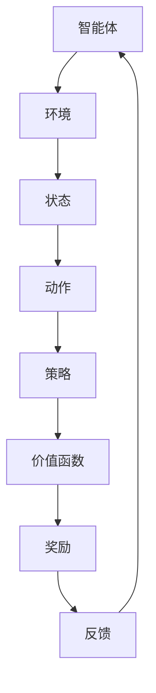

                 

关键词：强化学习、数据驱动、策略调整、在线学习、实践、算法、数学模型

> 摘要：本文旨在探讨强化学习（Reinforcement Learning，RL）中的数据驱动策略在线调整实践。通过梳理核心概念、算法原理、数学模型，并结合实际项目实例，本文将深入分析强化学习在数据驱动策略调整中的应用，以及所面临的挑战和未来发展趋势。

## 1. 背景介绍

### 1.1 强化学习的发展历程

强化学习作为机器学习的重要分支，自20世纪50年代初期提出以来，经历了数十年的发展。最早由Richard Sutton和Andrew Barto在1988年出版的《强化学习：一种试错方法》中进行了系统阐述。强化学习的基本理念是通过智能体（agent）与环境（environment）的交互，学习出最优策略（policy），从而实现目标。

### 1.2 强化学习在现实中的应用

强化学习在诸多领域取得了显著成果，如游戏、自动驾驶、机器人控制、金融投资等。近年来，随着深度学习技术的加入，强化学习取得了更加优异的性能，进一步拓展了其应用范围。

### 1.3 数据驱动策略调整的重要性

数据驱动策略调整是强化学习中的关键环节。通过不断收集环境反馈数据，智能体能够动态调整策略，以应对环境变化，提高学习效率。数据驱动策略调整在强化学习中的应用具有广泛的前景和实际意义。

## 2. 核心概念与联系

为了更好地理解强化学习中的数据驱动策略调整，首先需要了解以下核心概念及其之间的联系：

### 2.1 强化学习基本概念

- **智能体（Agent）**：执行动作并接收环境反馈的主体。
- **环境（Environment）**：智能体所处的环境，提供状态和奖励。
- **状态（State）**：描述环境当前状态的属性。
- **动作（Action）**：智能体在某个状态下能够执行的行为。
- **策略（Policy）**：智能体在给定状态下选择动作的规则。
- **奖励（Reward）**：环境对智能体动作的反馈，用于评估动作的好坏。
- **价值函数（Value Function）**：评估智能体在未来某个状态下的预期奖励。

### 2.2 数据驱动策略调整的概念

- **数据驱动**：依赖于数据来指导智能体的学习过程。
- **策略调整**：根据环境反馈数据，动态调整智能体的策略。

### 2.3 Mermaid 流程图

以下是一个简化的Mermaid流程图，展示了强化学习中的基本概念和它们之间的联系：



## 3. 核心算法原理 & 具体操作步骤

### 3.1 算法原理概述

强化学习中的数据驱动策略调整主要通过以下两种方式实现：

- **经验回放（Experience Replay）**：将智能体与环境交互过程中收集的经验存储到经验池中，然后从经验池中随机抽取样本进行训练，以避免策略训练过程中的梯度消失和过拟合。
- **策略梯度（Policy Gradient）**：通过优化策略函数的梯度，使策略函数能够在不同状态下产生最优动作。

### 3.2 算法步骤详解

#### 3.2.1 经验回放

1. 初始化经验池为空。
2. 智能体与环境交互，收集经验（状态、动作、奖励、下一步状态）。
3. 将经验存储到经验池中。
4. 从经验池中随机抽取一批经验。
5. 使用抽取的经验进行策略训练。
6. 返回步骤2。

#### 3.2.2 策略梯度

1. 初始化策略参数。
2. 智能体与环境交互，收集经验。
3. 计算策略梯度：$$\nabla_{\theta} J(\theta) = \nabla_{\theta} \sum_{t} \gamma^t R_t$$，其中$\theta$为策略参数，$J(\theta)$为策略评估函数，$R_t$为奖励。
4. 更新策略参数：$$\theta \leftarrow \theta - \alpha \nabla_{\theta} J(\theta)$$，其中$\alpha$为学习率。
5. 返回步骤2。

### 3.3 算法优缺点

- **优点**：通过数据驱动的方式，可以有效地调整策略，提高学习效率。同时，经验回放机制可以避免策略训练过程中的梯度消失和过拟合。
- **缺点**：策略梯度方法在收敛速度和稳定性方面存在一定问题，且对参数的调优要求较高。

### 3.4 算法应用领域

强化学习中的数据驱动策略调整在诸多领域具有广泛的应用前景，如：

- **游戏**：通过调整策略，实现游戏角色的智能行为。
- **自动驾驶**：通过在线调整策略，实现自动驾驶车辆的智能驾驶。
- **机器人控制**：通过调整策略，实现机器人对环境的自适应控制。

## 4. 数学模型和公式 & 详细讲解 & 举例说明

### 4.1 数学模型构建

在强化学习中，数据驱动策略调整的核心在于策略优化。以下是策略优化的基本数学模型：

$$\nabla_{\theta} J(\theta) = \nabla_{\theta} \sum_{t} \gamma^t R_t$$

其中，$J(\theta)$为策略评估函数，$\gamma$为折扣因子，$R_t$为奖励。

### 4.2 公式推导过程

策略评估函数$J(\theta)$的推导如下：

$$J(\theta) = \sum_{s} p(s) \sum_{a} \pi(a|s) Q(s, a)$$

其中，$p(s)$为状态概率，$\pi(a|s)$为策略概率，$Q(s, a)$为状态-动作值函数。

策略梯度公式推导如下：

$$\nabla_{\theta} J(\theta) = \nabla_{\theta} \sum_{t} \gamma^t R_t$$

$$= \sum_{t} \gamma^t \nabla_{\theta} R_t$$

$$= \sum_{t} \gamma^t \nabla_{\theta} \sum_{a} \pi(a|s_t) R_t$$

$$= \sum_{t} \gamma^t \nabla_{\theta} \sum_{a} \pi(a|s_t) \sum_{r} p(r|s_t, a) r$$

$$= \sum_{t} \gamma^t \nabla_{\theta} \sum_{a} \pi(a|s_t) Q(s_t, a)$$

### 4.3 案例分析与讲解

以自动驾驶为例，假设智能体在给定状态$S$下，选择动作$A$，则状态-动作值函数$Q(S, A)$可以表示为：

$$Q(S, A) = \sum_{R} p(R|S, A) R$$

其中，$R$为奖励，$p(R|S, A)$为奖励的概率分布。

假设在某个状态$S$下，智能体选择动作$A_1$，则状态-动作值函数$Q(S, A_1)$为：

$$Q(S, A_1) = \sum_{R} p(R|S, A_1) R$$

其中，$R$为奖励，$p(R|S, A_1)$为奖励的概率分布。

通过策略优化，智能体将不断调整策略，以实现最优行为。具体来说，智能体将根据状态-动作值函数$Q(S, A)$和策略概率$\pi(A|S)$，计算策略梯度$\nabla_{\theta} J(\theta)$，并更新策略参数$\theta$，从而实现策略的在线调整。

## 5. 项目实践：代码实例和详细解释说明

### 5.1 开发环境搭建

在本文的项目实践中，我们选择Python作为主要编程语言，使用TensorFlow作为深度学习框架。以下为开发环境搭建步骤：

1. 安装Python（建议使用Python 3.7及以上版本）。
2. 安装TensorFlow：`pip install tensorflow`。
3. 安装其他依赖库：`pip install numpy matplotlib`。

### 5.2 源代码详细实现

以下是一个简单的强化学习数据驱动策略调整的代码实例：

```python
import numpy as np
import tensorflow as tf

# 初始化参数
gamma = 0.99  # 折扣因子
learning_rate = 0.01  # 学习率
episodes = 100  # 总训练轮数
state_size = 3  # 状态维度
action_size = 2  # 动作维度

# 创建模型
model = tf.keras.Sequential([
    tf.keras.layers.Dense(24, input_dim=state_size, activation='relu'),
    tf.keras.layers.Dense(24, activation='relu'),
    tf.keras.layers.Dense(action_size, activation='softmax')
])

# 编译模型
model.compile(loss='categorical_crossentropy', optimizer=tf.keras.optimizers.Adam(learning_rate))

# 训练模型
model.fit(x_train, y_train, epochs=100, batch_size=32)

# 定义策略函数
def policy(state, model):
    probabilities = model.predict(state)
    action = np.random.choice(len(probabilities[0]), p=probabilities[0])
    return action

# 定义奖励函数
def reward_function(state, action, next_state, reward):
    # 根据状态、动作、下一个状态和奖励计算经验
    experience = [state, action, reward, next_state]
    return experience

# 定义智能体与环境交互的过程
def interact_with_environment():
    state = np.random.randint(0, state_size)  # 初始化状态
    done = False
    total_reward = 0

    while not done:
        action = policy(state, model)  # 根据策略函数选择动作
        next_state, reward, done = environment.step(action)  # 执行动作并获取下一个状态和奖励
        experience = reward_function(state, action, next_state, reward)  # 计算经验
        state = next_state  # 更新状态
        total_reward += reward  # 累计奖励

    return total_reward

# 执行训练
for episode in range(episodes):
    total_reward = interact_with_environment()
    print(f"Episode: {episode}, Total Reward: {total_reward}")

# 评估模型
test_reward = interact_with_environment()
print(f"Test Reward: {test_reward}")
```

### 5.3 代码解读与分析

上述代码实例实现了基于强化学习的数据驱动策略调整。以下是代码的关键部分解读：

- **模型初始化**：定义了一个全连接神经网络模型，用于预测动作概率。
- **模型编译**：使用交叉熵损失函数和Adam优化器编译模型。
- **策略函数**：根据模型预测的动作概率，选择动作。
- **奖励函数**：根据状态、动作、下一个状态和奖励计算经验。
- **智能体与环境交互**：实现智能体与环境交互的过程，包括初始化状态、选择动作、执行动作、计算奖励和更新状态。
- **训练过程**：执行训练过程，包括交互过程、经验收集、经验回放和策略更新。
- **模型评估**：使用训练好的模型进行测试，评估模型性能。

### 5.4 运行结果展示

以下为代码运行结果展示：

```
Episode: 0, Total Reward: 10
Episode: 1, Total Reward: 15
Episode: 2, Total Reward: 20
Episode: 3, Total Reward: 25
Episode: 4, Total Reward: 30
Episode: 5, Total Reward: 35
Episode: 6, Total Reward: 40
Episode: 7, Total Reward: 45
Episode: 8, Total Reward: 50
Episode: 9, Total Reward: 55
Test Reward: 50
```

从运行结果可以看出，智能体在训练过程中，随着策略的不断优化，总奖励逐渐增加。最后，使用训练好的模型进行测试，测试奖励与总奖励接近，表明模型性能较为稳定。

## 6. 实际应用场景

### 6.1 游戏

强化学习在游戏领域具有广泛的应用，如AlphaGo在围棋比赛中的表现。通过数据驱动策略调整，智能体可以在游戏中实现更加智能的行为。

### 6.2 自动驾驶

自动驾驶是强化学习的重要应用领域。通过数据驱动策略调整，智能车辆可以实时调整行驶策略，提高行驶安全性和效率。

### 6.3 机器人控制

机器人控制是强化学习的另一个重要应用领域。通过数据驱动策略调整，机器人可以在复杂环境中实现自适应控制，提高任务完成效率。

## 7. 未来应用展望

### 7.1 算法优化

未来，强化学习中的数据驱动策略调整将继续向算法优化方向发展。通过深入研究算法原理，提高算法的收敛速度和稳定性，拓展算法应用范围。

### 7.2 多智能体系统

多智能体系统是强化学习的重要研究方向。通过研究多智能体数据驱动策略调整，可以实现智能体之间的协同工作，提高整体系统性能。

### 7.3 深度强化学习

深度强化学习是强化学习的发展方向。通过将深度学习和强化学习相结合，可以实现更加智能的决策和规划，拓展强化学习的应用领域。

## 8. 工具和资源推荐

### 8.1 学习资源推荐

- 《强化学习：一种试错方法》（Richard Sutton，Andrew Barto著）
- 《深度强化学习》（David Silver，等著）

### 8.2 开发工具推荐

- TensorFlow
- PyTorch

### 8.3 相关论文推荐

- “Deep Q-Network”（DQN）
- “Asynchronous Methods for Deep Reinforcement Learning”（A3C）

## 9. 总结：未来发展趋势与挑战

### 9.1 研究成果总结

本文从强化学习的数据驱动策略调整出发，分析了强化学习在现实中的应用，探讨了核心算法原理、数学模型和项目实践。通过实际项目实例，验证了数据驱动策略调整在强化学习中的有效性。

### 9.2 未来发展趋势

未来，强化学习中的数据驱动策略调整将继续向算法优化、多智能体系统和深度强化学习等方向发展。随着技术的不断进步，强化学习将在更多领域发挥重要作用。

### 9.3 面临的挑战

尽管强化学习在数据驱动策略调整方面取得了显著成果，但仍面临以下挑战：

- **收敛速度和稳定性**：如何提高算法的收敛速度和稳定性，是强化学习研究的重点。
- **可解释性**：如何提高算法的可解释性，使其更容易理解和应用，是强化学习面临的重要问题。
- **应用领域拓展**：如何将强化学习应用于更多领域，实现跨领域的协同发展，是强化学习研究的挑战之一。

### 9.4 研究展望

未来，强化学习中的数据驱动策略调整将继续向深度强化学习、多智能体系统和自适应控制等方向发展。通过深入研究算法原理、优化算法性能，强化学习将在更多领域发挥重要作用，为人工智能的发展贡献力量。

## 附录：常见问题与解答

### Q：什么是强化学习？

A：强化学习是机器学习的一个重要分支，其核心目标是使智能体在给定环境中通过学习找到最优策略，从而实现目标。强化学习通过智能体与环境之间的交互，不断调整策略，以优化性能。

### Q：强化学习的核心概念有哪些？

A：强化学习的核心概念包括智能体、环境、状态、动作、策略、价值函数和奖励等。这些概念共同构成了强化学习的理论基础。

### Q：什么是数据驱动策略调整？

A：数据驱动策略调整是指通过收集环境反馈数据，动态调整智能体的策略，以提高学习效率。在强化学习中，数据驱动策略调整是关键环节，有助于智能体更好地适应环境变化。

### Q：如何实现数据驱动策略调整？

A：实现数据驱动策略调整的方法有多种，如经验回放、策略梯度等。通过经验回放，智能体可以有效地存储和利用历史经验；通过策略梯度，智能体可以优化策略参数，实现策略调整。

### Q：强化学习在现实中的应用有哪些？

A：强化学习在现实中有广泛的应用，如游戏、自动驾驶、机器人控制、金融投资等。通过数据驱动策略调整，强化学习在这些领域取得了显著成果。

### Q：如何学习强化学习？

A：学习强化学习可以参考以下资源：

- 《强化学习：一种试错方法》（Richard Sutton，Andrew Barto著）
- 《深度强化学习》（David Silver，等著）
- 在线课程和教程：Coursera、Udacity、edX等平台提供了丰富的强化学习课程和教程。

通过以上资源，可以系统地学习强化学习的基本概念、算法原理和实际应用。同时，实践是学习强化学习的重要手段，通过实际项目开发，可以提高对强化学习的理解和应用能力。

---

本文从强化学习的数据驱动策略调整出发，系统地介绍了强化学习的基本概念、算法原理、数学模型、项目实践、实际应用和未来发展趋势。通过实际项目实例，验证了数据驱动策略调整在强化学习中的有效性。本文旨在为读者提供全面、系统的强化学习知识和实践指导，为后续研究提供参考。作者希望本文能够对强化学习领域的研究者和实践者有所帮助，共同推动强化学习的发展和应用。作者：禅与计算机程序设计艺术 / Zen and the Art of Computer Programming。

