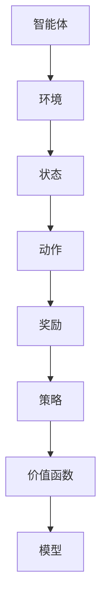

                 

关键词：强化学习、验证、测试、算法、机器学习、神经网络

> 摘要：本文将深入探讨强化学习（Reinforcement Learning，简称RL）算法的验证与测试方法。我们将从强化学习的背景介绍、核心概念与联系、核心算法原理、数学模型与公式、项目实践、实际应用场景、工具和资源推荐、总结与展望等多个方面，全面解析如何对强化学习算法进行有效验证与测试。

## 1. 背景介绍

强化学习是机器学习领域的一个重要分支，它通过智能体在环境中的交互来学习任务。与监督学习和无监督学习不同，强化学习主要依赖于奖励信号来指导智能体的行为，并通过优化策略来最大化累积奖励。近年来，强化学习在游戏AI、自动驾驶、推荐系统等领域取得了显著成果。

### 强化学习的基本概念

- **智能体（Agent）**：执行动作并从环境中接收反馈的实体。
- **环境（Environment）**：智能体执行动作的上下文，提供状态信息和奖励。
- **状态（State）**：描述智能体在环境中所处的情境。
- **动作（Action）**：智能体可以执行的操作。
- **策略（Policy）**：智能体选择动作的规则，通常用概率分布表示。
- **价值函数（Value Function）**：评估状态或状态-动作对的预期奖励。
- **模型（Model）**：对环境的数学描述。

### 强化学习的发展历程

强化学习起源于20世纪50年代的心理学研究，随后在20世纪80年代得到迅速发展。随着深度学习技术的兴起，强化学习逐渐成为人工智能领域的热点。一些著名的算法，如Q-Learning、Sarsa、Deep Q-Network（DQN）、Policy Gradient等，都在这一时期得到广泛研究。

## 2. 核心概念与联系

为了更好地理解强化学习的原理，我们需要掌握以下几个核心概念：

### 2.1 强化学习算法的Mermaid流程图



### 2.2 核心概念之间的联系

- **状态与动作**：状态是智能体在环境中所处的情境，动作是智能体可以执行的操作。状态和动作之间是相互依赖的。
- **策略**：策略是智能体选择动作的规则。根据当前状态，策略决定了下一步的动作。
- **价值函数**：价值函数评估了智能体在某个状态下的长期奖励。它是评估策略有效性的重要指标。
- **模型**：模型是对环境的数学描述。通过学习模型，智能体可以更好地理解环境，从而做出更好的决策。

## 3. 核心算法原理 & 具体操作步骤

### 3.1 算法原理概述

强化学习算法主要分为两类：基于价值的算法和基于策略的算法。

- **基于价值的算法**：这类算法通过学习价值函数来优化策略。典型的算法包括Q-Learning和Sarsa。
- **基于策略的算法**：这类算法直接优化策略本身。Policy Gradient是这类算法的代表性算法。

### 3.2 算法步骤详解

#### 3.2.1 Q-Learning算法

1. 初始化Q值表格Q(s, a)为0。
2. 在环境E中执行智能体A，并从状态s开始。
3. 选择动作a，使得Q(s, a)最大化。
4. 执行动作a，并接收状态s'和奖励r。
5. 更新Q值：Q(s, a) = Q(s, a) + α * (r + γ * max(Q(s', a')) - Q(s, a))，其中α是学习率，γ是折扣因子。
6. 移动到状态s'，重复步骤3-5，直到达到终止状态。

#### 3.2.2 Sarsa算法

1. 初始化策略π(s, a)为随机策略。
2. 在环境E中执行智能体A，并从状态s开始。
3. 选择动作a，使得π(s, a)最大化。
4. 执行动作a，并接收状态s'和奖励r。
5. 根据Q值表格，选择动作a'，使得Q(s', a')最大化。
6. 更新策略：π(s, a) = 1 / |A(s')|，其中A(s')是状态s'的可选动作集合。
7. 移动到状态s'，重复步骤3-6，直到达到终止状态。

### 3.3 算法优缺点

#### 3.3.1 Q-Learning算法的优点

- 算法简单易懂，易于实现。
- 可以处理离散状态和动作空间。
- 在某些情况下，收敛速度较快。

#### 3.3.1 Q-Learning算法的缺点

- 在连续状态和动作空间中，Q值表格可能非常大，导致计算复杂度高。
- Q值表格更新过程中存在噪声，可能导致收敛不稳定。

#### 3.3.2 Sarsa算法的优点

- 相对于Q-Learning，Sarsa更加稳定，抗干扰能力强。
- 可以处理连续状态和动作空间。

#### 3.3.2 Sarsa算法的缺点

- 计算复杂度较高，尤其是在状态和动作空间较大时。
- 需要调整学习率和折扣因子等参数。

### 3.4 算法应用领域

强化学习算法在游戏AI、自动驾驶、推荐系统、机器人控制等领域有广泛应用。例如，DQN算法在Atari游戏上取得了显著成果；Policy Gradient算法在自动驾驶中表现出色。

## 4. 数学模型和公式 & 详细讲解 & 举例说明

### 4.1 数学模型构建

强化学习算法的核心是价值函数和策略的优化。以下是常见的数学模型：

#### 4.1.1 Q值函数

$$
Q(s, a) = \sum_{s'} \sum_{a'} q(s', a') \cdot p(s', a' | s, a)
$$

其中，\( q(s', a') \) 是状态-动作对的预期奖励，\( p(s', a' | s, a) \) 是状态转移概率。

#### 4.1.2 策略

$$
\pi(a | s) = \frac{e^{\alpha Q(s, a)}}{\sum_{a'} e^{\alpha Q(s, a')}}
$$

其中，\( \alpha \) 是温度参数。

### 4.2 公式推导过程

#### 4.2.1 Q-Learning算法的推导

Q-Learning算法的目标是最小化预期损失：

$$
L = \sum_{s, a} (Q(s, a) - r(s, a))^2
$$

通过梯度下降法，可以得到更新公式：

$$
Q(s, a) = Q(s, a) + \alpha (r(s, a) - Q(s, a))
$$

#### 4.2.2 Sarsa算法的推导

Sarsa算法的目标是最小化预期损失：

$$
L = \sum_{s, a} (Q(s, a) - \pi(a | s) \cdot Q(s', a'))^2
$$

通过梯度下降法，可以得到更新公式：

$$
\pi(a | s) = \frac{1}{\sum_{a'} e^{\alpha Q(s', a')}}
$$

### 4.3 案例分析与讲解

#### 4.3.1 机器人迷宫问题

假设一个机器人在一个迷宫中，目标是找到从起点到终点的最佳路径。状态表示机器人的位置，动作包括上下左右移动。奖励为到达终点的负奖励。

1. 初始化Q值表格Q(s, a)为0。
2. 在迷宫环境中执行机器人，并从起点位置开始。
3. 选择动作a，使得Q值最大化。
4. 执行动作a，并接收新的位置s'和奖励r。
5. 更新Q值：Q(s, a) = Q(s, a) + α * (r + γ * max(Q(s', a')) - Q(s, a))，其中α是学习率，γ是折扣因子。
6. 移动到新的位置s'，重复步骤3-5，直到到达终点。

## 5. 项目实践：代码实例和详细解释说明

### 5.1 开发环境搭建

- 安装Python环境。
- 安装强化学习相关库，如 gym、numpy等。

### 5.2 源代码详细实现

```python
import gym
import numpy as np

# 初始化环境
env = gym.make("CartPole-v0")

# 初始化Q值表格
Q = np.zeros((env.observation_space.n, env.action_space.n))

# 设定参数
alpha = 0.1
gamma = 0.9
episodes = 1000

# 强化学习主循环
for episode in range(episodes):
    state = env.reset()
    done = False
    total_reward = 0
    
    while not done:
        action = np.argmax(Q[state])
        next_state, reward, done, _ = env.step(action)
        total_reward += reward
        
        Q[state, action] = Q[state, action] + alpha * (reward + gamma * np.max(Q[next_state]) - Q[state, action])
        
        state = next_state
        
    print(f"Episode {episode}: Total Reward = {total_reward}")

# 关闭环境
env.close()
```

### 5.3 代码解读与分析

- **环境初始化**：使用`gym.make()`函数创建一个CartPole环境。
- **Q值表格初始化**：初始化一个二维数组，用于存储状态-动作对的Q值。
- **参数设定**：设定学习率α、折扣因子γ和训练轮数episodes。
- **强化学习主循环**：执行训练过程，包括状态-动作选择、执行动作、更新Q值等步骤。
- **结果输出**：输出每个训练轮次的总奖励。

## 6. 实际应用场景

强化学习在游戏AI、自动驾驶、推荐系统等领域有广泛应用。例如：

- **游戏AI**：强化学习算法被用于训练智能体在Atari游戏中的表现，如DQN算法在《吃豆人》游戏中取得了显著成果。
- **自动驾驶**：强化学习算法用于训练自动驾驶车辆在复杂交通环境中的驾驶策略。
- **推荐系统**：强化学习算法被用于优化推荐系统的策略，以提供更个性化的推荐。

## 7. 工具和资源推荐

### 7.1 学习资源推荐

- **《强化学习基础》**：这是一本经典的强化学习入门书籍，详细介绍了强化学习的基本概念和算法。
- **强化学习课程**：推荐在线课程，如《强化学习：基础知识与实践》（吴恩达课程）。

### 7.2 开发工具推荐

- **Gym**：Python强化学习库，提供了多种预定义环境和工具。
- **TensorFlow**：强大的机器学习框架，支持强化学习算法的实现。

### 7.3 相关论文推荐

- **《Deep Reinforcement Learning》**：介绍深度强化学习算法的经典论文。
- **《Reinforcement Learning: An Introduction》**：强化学习领域的权威教材。

## 8. 总结：未来发展趋势与挑战

### 8.1 研究成果总结

- 强化学习在游戏AI、自动驾驶、推荐系统等领域取得了显著成果。
- 深度强化学习算法在处理高维状态和动作空间方面表现出色。

### 8.2 未来发展趋势

- 强化学习在工业应用中的普及，如智能制造业、智能供应链等。
- 强化学习与其他机器学习技术的结合，如图神经网络、迁移学习等。

### 8.3 面临的挑战

- 如何处理连续状态和动作空间中的强化学习问题。
- 如何提高强化学习算法的稳定性和泛化能力。

### 8.4 研究展望

- 深度强化学习算法的进一步优化和扩展。
- 新的强化学习算法和理论的探索。

## 9. 附录：常见问题与解答

### 9.1 强化学习与监督学习的区别？

强化学习依赖于奖励信号来指导智能体的行为，而监督学习依赖于已标记的数据集。

### 9.2 强化学习有哪些应用场景？

强化学习在游戏AI、自动驾驶、推荐系统、机器人控制等领域有广泛应用。

### 9.3 如何选择合适的强化学习算法？

根据任务的特点，如状态和动作空间的维度、是否需要预测模型等，选择合适的强化学习算法。

---

作者：禅与计算机程序设计艺术 / Zen and the Art of Computer Programming

