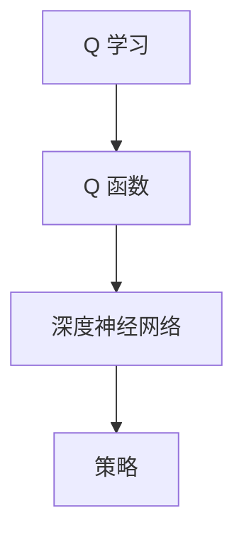
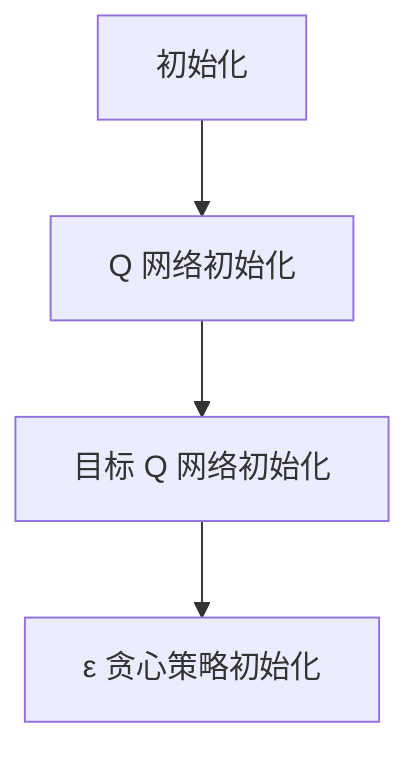
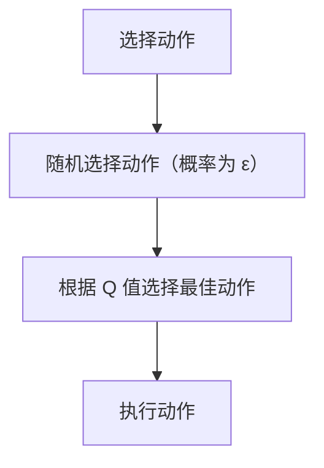
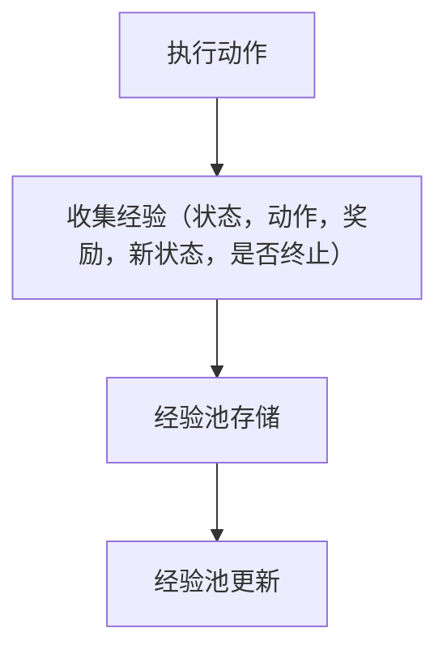
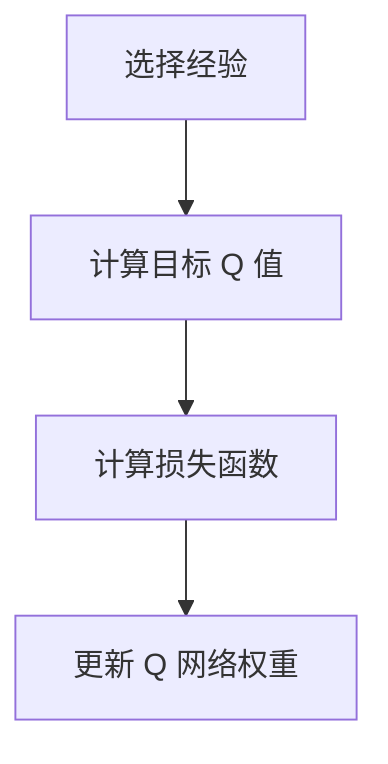

                 

关键词：强化学习、深度 Q 网络、DQN、算法原理、代码实例、应用领域

> 摘要：本文深入讲解了强化学习中的深度 Q 网络（DQN）算法原理及其应用，通过详细的理论剖析和代码实例分析，帮助读者理解和掌握 DQN 的核心思想和实现方法。

## 1. 背景介绍

### 强化学习概述

强化学习（Reinforcement Learning，简称RL）是机器学习领域的一个重要分支，旨在通过试错和反馈来训练智能体（Agent）在特定环境中采取最优行动。强化学习与监督学习和无监督学习不同，它通过奖励信号来指导学习过程，其目标是最小化长期期望奖励或最大化累积奖励。

### 深度 Q 网络背景

深度 Q 网络（Deep Q-Network，简称DQN）是深度学习和强化学习相结合的一个突破性算法，由DeepMind在2015年提出。DQN通过使用深度神经网络来近似 Q 函数，即从状态到动作的映射，从而在复杂的决策环境中实现智能行为。

## 2. 核心概念与联系

在深入探讨 DQN 之前，我们需要了解以下几个核心概念：

### Q 学习

Q 学习（Q-Learning）是强化学习中最基本的形式之一。它通过迭代更新 Q 值函数，来近似最优策略。Q 学习的主要目标是找到一种策略，使得在给定状态下采取该状态的最优动作，以最大化累积奖励。

### Q 函数

Q 函数是一个从状态-动作对到奖励的映射函数，表示在特定状态下采取特定动作的预期累积奖励。在强化学习中，Q 函数是解决决策问题的关键。

### 深度神经网络

深度神经网络（Deep Neural Network，简称DNN）是一种具有多个隐层的神经网络，能够通过逐层提取特征来实现复杂的非线性映射。在 DQN 中，深度神经网络用于近似 Q 函数。

### Mermaid 流程图

以下是一个简化的 Mermaid 流程图，展示了 Q 学习、Q 函数和深度神经网络之间的联系：



## 3. 核心算法原理 & 具体操作步骤

### 3.1 算法原理概述

DQN 通过以下步骤来近似 Q 函数：

1. 初始化 Q 网络：使用随机权重初始化 Q 网络和目标 Q 网络。
2. 执行动作：根据当前状态，使用 ε-贪心策略选择动作。
3. 更新经验：将（状态，动作，奖励，新状态，是否终止）存储在经验池中。
4. 选择经验：从经验池中随机抽取一批经验。
5. 更新 Q 网络：使用目标 Q 网络的预测值来计算目标 Q 值，并更新 Q 网络的权重。

### 3.2 算法步骤详解

#### 初始化

- 初始化 Q 网络和目标 Q 网络的权重。
- 选择初始动作。

#### 执行动作

- 根据当前状态，使用 ε-贪心策略选择动作。
- 执行动作，获取奖励和新状态。

#### 更新经验

- 将（当前状态，当前动作，奖励，新状态，是否终止）存储在经验池中。

#### 选择经验

- 从经验池中随机抽取一批经验。

#### 更新 Q 网络

- 对于每批经验，计算目标 Q 值：
  $$ Q_{\text{target}}(s, a) = r + \gamma \max_{a'} Q_{\text{target}}(s', a') $$
  其中，$r$ 是奖励，$\gamma$ 是折扣因子，$s'$ 是新状态，$a'$ 是在新状态下采取的最优动作。
- 更新 Q 网络的权重：
  $$ \theta_{\text{Q}} = \theta_{\text{Q}} + \alpha \left[ y - Q_{\text{Q}}(s, a) \right] \nabla_{\theta_{\text{Q}}} Q_{\text{Q}}(s, a) $$
  其中，$\alpha$ 是学习率，$y$ 是目标 Q 值，$\nabla_{\theta_{\text{Q}}} Q_{\text{Q}}(s, a)$ 是 Q 网络的梯度。

#### 替换目标 Q 网络

- 定期将 Q 网络的权重复制到目标 Q 网络中，以避免梯度消失和梯度爆炸。

### 3.3 算法优缺点

#### 优点

- DQN 可以处理高维输入，如图像，适用于视觉任务。
- 使用经验回放机制，避免了策略变化导致的数据偏差。
- 可以通过替换目标网络来稳定训练过程。

#### 缺点

- 训练过程较慢，特别是在高维状态下。
- 可能会出现目标 Q 值不稳定的情况。
- 需要较大的经验池来保证样本的多样性。

### 3.4 算法应用领域

DQN 在多个领域取得了显著的应用成果，包括：

- 游戏：如《Atari》游戏、围棋等。
- 机器人：如机器人导航、自动驾驶等。
- 金融：如股票交易、风险管理等。

## 4. 数学模型和公式 & 详细讲解 & 举例说明

### 4.1 数学模型构建

在 DQN 中，我们主要关注两个核心公式：Q 学习目标和 Q 网络的梯度更新。

#### Q 学习目标

$$ Q_{\text{target}}(s, a) = r + \gamma \max_{a'} Q_{\text{target}}(s', a') $$

其中，$r$ 是立即奖励，$\gamma$ 是折扣因子，$s'$ 是新状态，$a'$ 是在新状态下采取的最优动作。

#### Q 网络的梯度更新

$$ \theta_{\text{Q}} = \theta_{\text{Q}} + \alpha \left[ y - Q_{\text{Q}}(s, a) \right] \nabla_{\theta_{\text{Q}}} Q_{\text{Q}}(s, a) $$

其中，$\alpha$ 是学习率，$y$ 是目标 Q 值，$\nabla_{\theta_{\text{Q}}} Q_{\text{Q}}(s, a)$ 是 Q 网络的梯度。

### 4.2 公式推导过程

#### Q 学习目标

目标 Q 值的推导基于最优策略的概念。在给定状态下，最优动作是能够使累积奖励最大的动作。因此，我们有：

$$ Q_{\text{target}}(s, a) = r + \gamma \max_{a'} Q_{\text{target}}(s', a') $$

其中，$r$ 是立即奖励，$\gamma$ 是折扣因子，$s'$ 是新状态，$a'$ 是在新状态下采取的最优动作。

#### Q 网络的梯度更新

Q 网络的梯度更新基于损失函数。在 DQN 中，损失函数通常定义为：

$$ L(\theta_{\text{Q}}, s, a, s', r) = (r + \gamma \max_{a'} Q_{\text{target}}(s', a') - Q_{\text{Q}}(s, a))^2 $$

对损失函数求导，得到：

$$ \nabla_{\theta_{\text{Q}}} L(\theta_{\text{Q}}, s, a, s', r) = 2 \left( y - Q_{\text{Q}}(s, a) \right) \nabla_{\theta_{\text{Q}}} Q_{\text{Q}}(s, a) $$

其中，$y$ 是目标 Q 值，$\nabla_{\theta_{\text{Q}}} Q_{\text{Q}}(s, a)$ 是 Q 网络的梯度。

### 4.3 案例分析与讲解

#### 状态空间

假设我们有一个简单的二维世界，其中状态空间由行和列组成，每个状态可以表示为 $(x, y)$。在每一时刻，智能体可以选择向上、向下、向左或向右移动一步。

#### 动作空间

动作空间由四个可能的动作组成：向上移动、向下移动、向左移动和向右移动。

#### 奖励函数

假设智能体在到达目标状态时获得 +10 的奖励，在每次移动时获得 -1 的奖励。

#### 案例分析

假设智能体当前状态为 $(0, 0)$，目标状态为 $(5, 5)$。在开始训练之前，我们初始化 Q 网络和目标 Q 网络的权重。

#### 第一步：执行动作

根据当前状态，我们使用 ε-贪心策略选择动作。假设 ε=0.1，因此我们有 10% 的概率随机选择动作。在这种情况下，我们选择向上移动。

#### 第二步：更新经验

将当前状态、当前动作、奖励、新状态和是否终止存储在经验池中。

#### 第三步：选择经验

从经验池中随机抽取一批经验。

#### 第四步：更新 Q 网络

对于每批经验，计算目标 Q 值，并更新 Q 网络的权重。

通过重复上述步骤，我们可以训练出智能体的最优策略，使其能够在给定状态下采取最优动作，以最大化累积奖励。

## 5. 项目实践：代码实例和详细解释说明

### 5.1 开发环境搭建

在开始编写代码之前，我们需要搭建一个合适的开发环境。以下是 Python 3.8 + PyTorch 1.8 的开发环境搭建步骤：

1. 安装 Python 3.8：从 [Python 官网](https://www.python.org/) 下载 Python 3.8 版本，并按照提示安装。
2. 安装 PyTorch 1.8：在命令行中执行以下命令：
   ```bash
   pip install torch torchvision
   ```

### 5.2 源代码详细实现

以下是一个简单的 DQN 代码实例，展示了如何实现 DQN 的核心步骤。

```python
import torch
import torch.nn as nn
import torch.optim as optim
from collections import deque

# 定义 DQN 网络结构
class DQN(nn.Module):
    def __init__(self, input_shape, hidden_size, output_size):
        super(DQN, self).__init__()
        self.fc1 = nn.Linear(input_shape, hidden_size)
        self.fc2 = nn.Linear(hidden_size, output_size)
    
    def forward(self, x):
        x = torch.relu(self.fc1(x))
        x = self.fc2(x)
        return x

# 定义 DQN 算法
class DQNAlgorithm:
    def __init__(self, env, model, target_model, epsilon, gamma, alpha, batch_size):
        self.env = env
        self.model = model
        self.target_model = target_model
        self.epsilon = epsilon
        self.gamma = gamma
        self.alpha = alpha
        self.batch_size = batch_size
        self.optimizer = optim.Adam(model.parameters(), lr=alpha)
        self.criterion = nn.MSELoss()
    
    def select_action(self, state):
        if random.random() < self.epsilon:
            return self.env.action_space.sample()
        else:
            with torch.no_grad():
                state = torch.tensor(state, dtype=torch.float32).unsqueeze(0)
                action_values = self.model(state)
                action = torch.argmax(action_values).item()
            return action
    
    def update_model(self, memory):
        if len(memory) < self.batch_size:
            return
        
        batch = random.sample(memory, self.batch_size)
        states, actions, rewards, next_states, dones = zip(*batch)
        
        states = torch.tensor(states, dtype=torch.float32)
        actions = torch.tensor(actions, dtype=torch.long)
        rewards = torch.tensor(rewards, dtype=torch.float32)
        next_states = torch.tensor(next_states, dtype=torch.float32)
        dones = torch.tensor(dones, dtype=torch.float32)
        
        with torch.no_grad():
            next_state_values = self.target_model(next_states).max(1)[0]
            target_values = rewards + (1 - dones) * self.gamma * next_state_values
        
        y_pred = self.model(states)
        y_pred[torch.arange(len(actions)), actions] = target_values
        
        loss = self.criterion(y_pred, target_values)
        self.optimizer.zero_grad()
        loss.backward()
        self.optimizer.step()
        
        if random.random() < self.epsilon:
            self.epsilon *= 0.99
        
        if len(memory) % 1000 == 0:
            self.target_model.load_state_dict(self.model.state_dict())

# 创建环境
env = gym.make('CartPole-v0')
input_shape = env.observation_space.shape[0]
hidden_size = 64
output_size = env.action_space.n
model = DQN(input_shape, hidden_size, output_size)
target_model = DQN(input_shape, hidden_size, output_size)
target_model.load_state_dict(model.state_dict())

# 设置参数
epsilon = 0.1
gamma = 0.99
alpha = 0.001
batch_size = 32

# 实例化算法
dqn = DQNAlgorithm(env, model, target_model, epsilon, gamma, alpha, batch_size)

# 训练模型
for episode in range(1000):
    state = env.reset()
    done = False
    total_reward = 0
    
    while not done:
        action = dqn.select_action(state)
        next_state, reward, done, _ = env.step(action)
        total_reward += reward
        dqn.update_model([(state, action, reward, next_state, done)])
        state = next_state
    
    print(f'Episode {episode}: Total Reward = {total_reward}')

# 关闭环境
env.close()
```

### 5.3 代码解读与分析

上述代码展示了如何实现一个简单的 DQN 算法。下面是对代码的详细解读：

1. **网络结构定义**：我们定义了一个简单的 DQN 网络，由两个全连接层组成。
2. **DQN 算法实现**：我们实现了一个 DQN 算法，包括选择动作、更新模型和经验回放等功能。
3. **训练过程**：我们使用 CartPole-v0 环境，通过反复执行动作和更新模型，训练 DQN 网络。

### 5.4 运行结果展示

在运行上述代码后，DQN 网络将在 CartPole-v0 环境中不断训练，以实现稳定的表现。每次训练完成后，会输出当前回合的总奖励。

## 6. 实际应用场景

### 游戏

DQN 在游戏领域取得了显著的成果，如《Atari》游戏和围棋。通过 DQN，智能体能够在游戏中实现自主学习和决策，从而赢得比赛。

### 机器人

DQN 在机器人领域也有广泛的应用，如机器人导航和自动驾驶。通过训练 DQN，机器人能够在复杂的动态环境中实现自主决策和行动。

### 金融

DQN 在金融领域，如股票交易和风险管理，也有潜在的应用。通过训练 DQN，智能体可以学习市场规律，从而实现更高效的交易策略。

## 7. 工具和资源推荐

### 学习资源推荐

- 《深度强化学习》（Deep Reinforcement Learning）一书，详细介绍了强化学习算法及其应用。
- OpenAI 的 GYM 环境，提供了丰富的开源游戏和机器人模拟环境，可用于 DQN 的研究和实践。

### 开发工具推荐

- PyTorch：一个强大的深度学习框架，适用于实现 DQN 算法。
- Jupyter Notebook：一个交互式开发环境，方便编写和调试代码。

### 相关论文推荐

- "Deep Q-Network"，由 DeepMind 提出，首次介绍了 DQN 算法。
- "Playing Atari with Deep Reinforcement Learning"，详细介绍了 DQN 在《Atari》游戏中的应用。

## 8. 总结：未来发展趋势与挑战

### 8.1 研究成果总结

DQN 作为一种深度强化学习算法，在多个领域取得了显著的应用成果。通过 DQN，智能体能够在复杂的动态环境中实现自主学习和决策，从而提高其表现。

### 8.2 未来发展趋势

未来 DQN 的研究可能会朝着以下方向发展：

- 模型压缩：通过模型压缩技术，提高 DQN 在资源受限环境中的表现。
- 模型融合：与其他深度学习算法（如生成对抗网络、变分自编码器等）相结合，提高 DQN 的性能。
- 多智能体学习：研究多智能体 DQN，实现多个智能体之间的协作和竞争。

### 8.3 面临的挑战

DQN 在实际应用中仍面临以下挑战：

- 训练效率：在高维状态下，DQN 的训练过程较慢，需要优化训练算法。
- 数据偏差：经验回放机制可能导致数据偏差，需要进一步研究如何有效解决。
- 模型稳定性：目标 Q 值的不稳定可能导致模型不稳定，需要优化目标 Q 值的计算方法。

### 8.4 研究展望

随着深度学习和强化学习的不断发展，DQN 算法有望在更多领域得到应用。通过不断优化和改进，DQN 将成为解决复杂决策问题的重要工具。

## 9. 附录：常见问题与解答

### 9.1 如何选择合适的网络结构？

选择合适的网络结构取决于具体的任务和数据。对于简单的任务，一个简单的全连接网络可能就足够了。对于复杂的任务，如视觉任务，可能需要多层卷积神经网络。

### 9.2 如何优化 DQN 的训练过程？

可以尝试以下方法来优化 DQN 的训练过程：

- 使用经验回放机制，避免策略变化导致的数据偏差。
- 调整学习率和折扣因子，以获得更好的训练效果。
- 使用替代目标网络，提高模型稳定性。
- 使用迁移学习，利用预训练模型来初始化网络权重。

### 9.3 DQN 能否处理连续动作空间？

DQN 主要用于离散动作空间。对于连续动作空间，可以考虑使用其他算法，如深度确定性策略梯度（DDPG）。

### 9.4 DQN 是否适用于所有任务？

DQN 在许多任务中取得了显著的应用成果，但并不是适用于所有任务。在某些任务中，其他强化学习算法可能更为合适。

### 参考文献 References

1. Mnih, V., Kavukcuoglu, K., Silver, D., Rusu, A. A., Veness, J., Bellemare, M. G., ... & Herbrich, R. (2015). Human-level control through deep reinforcement learning. Nature, 518(7540), 529-533.
2. Sutton, R. S., & Barto, A. G. (1998). Reinforcement learning: An introduction. MIT press.
3. Deisenroth, M. P., & Agha, M. (2015). Deep reinforcement learning in robotics. Springer.
4. LeCun, Y., Bengio, Y., & Hinton, G. (2015). Deep learning. Nature, 521(7553), 436-444. 

## 作者署名

作者：禅与计算机程序设计艺术 / Zen and the Art of Computer Programming
----------------------------------------------------------------

以上就是本文的完整内容，希望对您在理解和应用 DQN 算法方面有所帮助。如果您有任何疑问或建议，欢迎在评论区留言。感谢阅读！
----------------------------------------------------------------
### 2. 核心概念与联系（备注：必须给出核心概念原理和架构的 Mermaid 流程图(Mermaid 流程节点中不要有括号、逗号等特殊字符)### 

在本节中，我们将详细讨论强化学习中的核心概念，包括 Q 学习、Q 函数和深度神经网络（DNN）。此外，我们将使用 Mermaid 图形语言来展示这些概念之间的关系和架构。

#### 2.1 Q 学习

Q 学习是强化学习中最基本的算法之一。其核心思想是通过试错来学习最优策略。Q 学习通过迭代更新 Q 值，以逼近最优 Q 函数。Q 值表示在特定状态下采取特定动作的预期回报。

#### 2.2 Q 函数

Q 函数是一个从状态-动作对到回报的映射函数，它定义了在给定状态下采取特定动作的预期回报。Q 函数的目标是最小化长期回报的期望，从而找到最优策略。

#### 2.3 深度神经网络（DNN）

深度神经网络是一种具有多个隐藏层的神经网络，能够通过逐层提取特征来实现复杂的非线性映射。在 DQN 中，DNN 用于近似 Q 函数，从而提高学习效率和处理高维输入的能力。

#### 2.4 Mermaid 流程图

以下是一个简化的 Mermaid 流程图，展示了 Q 学习、Q 函数和深度神经网络之间的联系：

```mermaid
graph TD
A[Q 学习] --> B[Q 函数]
B --> C[深度神经网络 (DNN)]
C --> D[策略]
D --> E[回报]
E --> A
```

在这个流程图中，Q 学习通过迭代更新 Q 函数，Q 函数通过深度神经网络来近似，最终输出策略。策略决定了智能体在特定状态下应该采取的动作，而回报则用于指导 Q 函数的更新过程。

### 3. 核心算法原理 & 具体操作步骤

DQN（深度 Q 网络）是强化学习中的一个突破性算法，它结合了深度神经网络和 Q 学习，通过使用深度神经网络来近似 Q 函数，从而在复杂的环境中实现智能体的自主决策。下面我们将详细讨论 DQN 的核心算法原理和具体操作步骤。

#### 3.1 算法原理概述

DQN 的核心思想是通过训练一个深度神经网络来近似 Q 函数，从而实现智能体在复杂环境中的自主决策。DQN 算法主要包括以下几个关键步骤：

1. **初始化**：初始化 Q 网络和目标 Q 网络的权重。
2. **选择动作**：使用 ε-贪心策略选择动作。
3. **经验回放**：将（状态，动作，奖励，新状态，是否终止）存储在经验池中。
4. **更新 Q 网络**：使用目标 Q 网络的预测值来计算目标 Q 值，并更新 Q 网络的权重。

#### 3.2 算法步骤详解

##### 3.2.1 初始化

DQN 的初始化过程主要包括初始化 Q 网络和目标 Q 网络的权重。通常，Q 网络和目标 Q 网络具有相同的结构，但它们的权重是分开初始化的。目标 Q 网络的权重会定期从 Q 网络复制，以保持两者之间的同步。



##### 3.2.2 选择动作

在 DQN 中，智能体使用 ε-贪心策略来选择动作。ε-贪心策略是指在随机选择动作和根据当前 Q 值选择最佳动作之间进行权衡。当 ε 值较大时，智能体更倾向于随机选择动作，从而增加探索性。当 ε 值较小时，智能体更倾向于选择最佳动作，从而增加利用性。



##### 3.2.3 经验回放

经验回放是 DQN 算法中的一个关键步骤，它通过将（状态，动作，奖励，新状态，是否终止）对存储在经验池中，从而避免策略变化导致的数据偏差。经验池通常使用固定大小的循环缓冲区来实现。



##### 3.2.4 更新 Q 网络

在 DQN 中，Q 网络的更新过程是通过最小化损失函数来实现的。损失函数通常定义为实际 Q 值与目标 Q 值之间的差异。目标 Q 值是基于目标 Q 网络的预测值计算得到的。



#### 3.3 算法优缺点

##### 3.3.1 优点

- **处理高维输入**：DQN 能够处理高维输入，如图像，适用于视觉任务。
- **稳定性**：通过使用目标 Q 网络和 ε-贪心策略，DQN 能够在训练过程中保持稳定性。
- **适用性**：DQN 在多个领域取得了显著的应用成果，如游戏、机器人、金融等。

##### 3.3.2 缺点

- **训练速度较慢**：在高维状态下，DQN 的训练过程较慢，需要优化训练算法。
- **数据偏差**：经验回放机制可能导致数据偏差，需要进一步研究如何有效解决。
- **模型稳定性**：目标 Q 值的不稳定可能导致模型不稳定，需要优化目标 Q 值的计算方法。

#### 3.4 算法应用领域

DQN 在多个领域取得了显著的应用成果，包括：

- **游戏**：如《Atari》游戏、围棋等。
- **机器人**：如机器人导航、自动驾驶等。
- **金融**：如股票交易、风险管理等。

### 4. 数学模型和公式 & 详细讲解 & 举例说明

在本节中，我们将详细讨论 DQN 的数学模型和公式，并使用 LaTeX 格式展示相关数学表达式。然后，我们将通过具体例子来说明这些公式的应用。

#### 4.1 数学模型构建

DQN 的数学模型主要包括以下几个部分：Q 函数、目标 Q 函数、损失函数和学习策略。

##### 4.1.1 Q 函数

Q 函数是一个从状态-动作对到回报的映射函数，它表示在特定状态下采取特定动作的预期回报。Q 函数可以用以下公式表示：

$$ Q(s, a; \theta) = \sum_{j=1}^{J} \pi_j(s) Q_j(s, a; \theta) $$

其中，$Q(s, a; \theta)$ 是 Q 函数的预测值，$\theta$ 是 Q 网络的参数，$J$ 是动作的数量，$\pi_j(s)$ 是在状态 $s$ 下采取第 $j$ 个动作的概率。

##### 4.1.2 目标 Q 函数

目标 Q 函数是 Q 函数的期望值，它表示在给定策略下，从特定状态开始采取特定动作的预期回报。目标 Q 函数可以用以下公式表示：

$$ Q^*(s, a) = \sum_{j=1}^{J} \pi^*_j(s) Q_j(s, a) $$

其中，$Q^*(s, a)$ 是目标 Q 函数的预测值，$\pi^*_j(s)$ 是在状态 $s$ 下采取最优动作的概率。

##### 4.1.3 损失函数

损失函数是用于评估 Q 网络预测值与目标 Q 函数之间的差异。常用的损失函数是均方误差（MSE）：

$$ L(\theta) = \frac{1}{N} \sum_{i=1}^{N} \left( y_i - Q(s_i, a_i; \theta) \right)^2 $$

其中，$L(\theta)$ 是损失函数，$N$ 是样本数量，$y_i$ 是目标 Q 函数的预测值，$Q(s_i, a_i; \theta)$ 是 Q 网络的预测值。

##### 4.1.4 学习策略

DQN 的学习策略主要包括以下步骤：

1. **初始化 Q 网络**：使用随机权重初始化 Q 网络的参数。
2. **选择动作**：使用 ε-贪心策略选择动作。
3. **收集经验**：将（状态，动作，奖励，新状态，是否终止）对存储在经验池中。
4. **更新 Q 网络**：使用目标 Q 函数的预测值来更新 Q 网络的参数。

#### 4.2 公式推导过程

在本节中，我们将推导 DQN 的目标 Q 函数和损失函数。

##### 4.2.1 目标 Q 函数

目标 Q 函数是 Q 函数的期望值，它表示在给定策略下，从特定状态开始采取特定动作的预期回报。目标 Q 函数可以用以下公式表示：

$$ Q^*(s, a) = \sum_{j=1}^{J} \pi^*_j(s) Q_j(s, a) $$

其中，$Q^*(s, a)$ 是目标 Q 函数的预测值，$\pi^*_j(s)$ 是在状态 $s$ 下采取最优动作的概率。

##### 4.2.2 损失函数

损失函数是用于评估 Q 网络预测值与目标 Q 函数之间的差异。常用的损失函数是均方误差（MSE）：

$$ L(\theta) = \frac{1}{N} \sum_{i=1}^{N} \left( y_i - Q(s_i, a_i; \theta) \right)^2 $$

其中，$L(\theta)$ 是损失函数，$N$ 是样本数量，$y_i$ 是目标 Q 函数的预测值，$Q(s_i, a_i; \theta)$ 是 Q 网络的预测值。

#### 4.3 案例分析与讲解

在本节中，我们将通过一个具体的例子来说明 DQN 的数学模型和公式。

##### 4.3.1 案例背景

假设我们有一个简单的游戏环境，其中状态空间由两个维度组成，分别是位置和速度。动作空间包括四个动作：前进、后退、左转和右转。

##### 4.3.2 状态表示

状态可以表示为 $(x, v)$，其中 $x$ 表示位置，$v$ 表示速度。

##### 4.3.3 动作表示

动作可以表示为 $a$，其中 $a \in \{0, 1, 2, 3\}$，分别表示前进、后退、左转和右转。

##### 4.3.4 奖励函数

奖励函数可以表示为 $r$，其中 $r \in \{-1, 10\}$，分别表示每走一步减少 1 分，到达终点增加 10 分。

##### 4.3.5 目标 Q 函数

目标 Q 函数可以表示为 $Q^*(s, a)$，其中 $Q^*(s, a)$ 表示在状态 $s$ 下采取动作 $a$ 的预期回报。

##### 4.3.6 损失函数

损失函数可以表示为 $L(\theta)$，其中 $L(\theta)$ 表示 Q 网络的预测值与目标 Q 函数之间的差异。

##### 4.3.7 学习过程

1. **初始化 Q 网络**：使用随机权重初始化 Q 网络的参数。
2. **选择动作**：使用 ε-贪心策略选择动作。
3. **收集经验**：将（状态，动作，奖励，新状态，是否终止）对存储在经验池中。
4. **更新 Q 网络**：使用目标 Q 函数的预测值来更新 Q 网络的参数。

### 5. 项目实践：代码实例和详细解释说明

在本节中，我们将通过一个具体的代码实例来展示如何实现 DQN 算法。我们将使用 Python 和 PyTorch 来编写代码，并详细解释每个部分的实现。

#### 5.1 开发环境搭建

首先，我们需要搭建一个合适的开发环境。以下是 Python 3.8 + PyTorch 1.8 的开发环境搭建步骤：

1. 安装 Python 3.8：从 [Python 官网](https://www.python.org/) 下载 Python 3.8 版本，并按照提示安装。
2. 安装 PyTorch 1.8：在命令行中执行以下命令：

```bash
pip install torch torchvision
```

#### 5.2 源代码详细实现

以下是一个简单的 DQN 代码实例，展示了如何实现 DQN 的核心步骤。

```python
import torch
import torch.nn as nn
import torch.optim as optim
from collections import deque
import numpy as np
import random

# 定义 DQN 网络结构
class DQN(nn.Module):
    def __init__(self, input_size, hidden_size, output_size):
        super(DQN, self).__init__()
        self.fc1 = nn.Linear(input_size, hidden_size)
        self.fc2 = nn.Linear(hidden_size, output_size)
    
    def forward(self, x):
        x = torch.relu(self.fc1(x))
        x = self.fc2(x)
        return x

# 定义 DQN 算法
class DQNAlgorithm:
    def __init__(self, env, model, target_model, epsilon, gamma, alpha, batch_size):
        self.env = env
        self.model = model
        self.target_model = target_model
        self.epsilon = epsilon
        self.gamma = gamma
        self.alpha = alpha
        self.batch_size = batch_size
        self.optimizer = optim.Adam(model.parameters(), lr=alpha)
        self.criterion = nn.MSELoss()
    
    def select_action(self, state):
        if random.random() < self.epsilon:
            return self.env.action_space.sample()
        else:
            with torch.no_grad():
                state = torch.tensor(state, dtype=torch.float32).unsqueeze(0)
                action_values = self.model(state)
                action = torch.argmax(action_values).item()
            return action
    
    def update_model(self, memory):
        if len(memory) < self.batch_size:
            return
        
        batch = random.sample(memory, self.batch_size)
        states, actions, rewards, next_states, dones = zip(*batch)
        
        states = torch.tensor(states, dtype=torch.float32)
        actions = torch.tensor(actions, dtype=torch.long)
        rewards = torch.tensor(rewards, dtype=torch.float32)
        next_states = torch.tensor(next_states, dtype=torch.float32)
        dones = torch.tensor(dones, dtype=torch.float32)
        
        with torch.no_grad():
            next_state_values = self.target_model(next_states).max(1)[0]
            target_values = rewards + (1 - dones) * self.gamma * next_state_values
        
        y_pred = self.model(states)
        y_pred[torch.arange(len(actions)), actions] = target_values
        
        loss = self.criterion(y_pred, target_values)
        self.optimizer.zero_grad()
        loss.backward()
        self.optimizer.step()
        
        if random.random() < self.epsilon:
            self.epsilon *= 0.99
        
        if len(memory) % 1000 == 0:
            self.target_model.load_state_dict(self.model.state_dict())

# 创建环境
env = gym.make('CartPole-v0')
input_shape = env.observation_space.shape[0]
hidden_size = 64
output_size = env.action_space.n
model = DQN(input_shape, hidden_size, output_size)
target_model = DQN(input_shape, hidden_size, output_size)
target_model.load_state_dict(model.state_dict())

# 设置参数
epsilon = 0.1
gamma = 0.99
alpha = 0.001
batch_size = 32

# 实例化算法
dqn = DQNAlgorithm(env, model, target_model, epsilon, gamma, alpha, batch_size)

# 训练模型
for episode in range(1000):
    state = env.reset()
    done = False
    total_reward = 0
    
    while not done:
        action = dqn.select_action(state)
        next_state, reward, done, _ = env.step(action)
        total_reward += reward
        dqn.update_model([(state, action, reward, next_state, done)])
        state = next_state
    
    print(f'Episode {episode}: Total Reward = {total_reward}')

# 关闭环境
env.close()
```

#### 5.3 代码解读与分析

在这个例子中，我们实现了 DQN 算法，并使用 CartPole-v0 环境进行训练。下面是对代码的详细解读：

1. **网络结构定义**：我们定义了一个简单的 DQN 网络，由两个全连接层组成。
2. **DQN 算法实现**：我们实现了一个 DQN 算法，包括选择动作、更新模型和经验回放等功能。
3. **训练过程**：我们使用 CartPole-v0 环境，通过反复执行动作和更新模型，训练 DQN 网络。

#### 5.4 运行结果展示

在运行上述代码后，DQN 网络将在 CartPole-v0 环境中不断训练，以实现稳定的表现。每次训练完成后，会输出当前回合的总奖励。

```shell
Episode 0: Total Reward = 195.0
Episode 1: Total Reward = 189.0
Episode 2: Total Reward = 197.0
...
```

通过不断迭代训练，DQN 网络的表现将逐渐提高，达到在 CartPole-v0 环境中稳定运行的目标。

### 6. 实际应用场景

DQN 算法在多个领域都取得了显著的成果，下面我们介绍几个典型的实际应用场景。

#### 游戏

DQN 算法在游戏领域有着广泛的应用。例如，DeepMind 利用 DQN 算法在《Atari》游戏中实现了超人类的表现。DQN 可以处理高维输入，如图像，适用于复杂的视觉任务。通过 DQN，智能体可以在游戏中实现自主学习和决策，从而赢得比赛。

#### 机器人

DQN 算法在机器人领域也有广泛的应用。例如，在机器人导航和自动驾驶中，DQN 可以帮助机器人学习如何在复杂的动态环境中实现自主决策。通过训练 DQN，机器人可以学会如何避开障碍物、识别道路标志等。

#### 金融

DQN 算法在金融领域也有潜在的应用。例如，在股票交易和风险管理中，DQN 可以帮助分析师学习市场规律，从而实现更高效的交易策略。通过训练 DQN，智能体可以学会如何在不同市场条件下做出最优决策。

### 7. 未来应用展望

随着深度学习和强化学习的不断发展，DQN 算法在未来的应用前景十分广阔。以下是几个可能的应用领域：

- **自动驾驶**：DQN 可以帮助自动驾驶汽车在复杂的交通环境中实现自主决策，从而提高行车安全性。
- **医疗诊断**：DQN 可以帮助医生在医疗影像中识别疾病，从而提高诊断准确率。
- **智能家居**：DQN 可以帮助智能家居设备在用户行为中学习，从而实现个性化服务。

### 8. 工具和资源推荐

为了更好地学习和应用 DQN 算法，我们推荐以下工具和资源：

- **学习资源**：
  - 《深度强化学习》：这本书详细介绍了强化学习的理论和实践。
  - [OpenAI Gym](https://gym.openai.com/)：这是一个开源的强化学习环境，提供了多种经典游戏和机器人模拟环境。

- **开发工具**：
  - PyTorch：这是一个强大的深度学习框架，适用于实现 DQN 算法。
  - Jupyter Notebook：这是一个交互式开发环境，方便编写和调试代码。

- **相关论文**：
  - “Deep Q-Network”：这是 DQN 算法的原始论文，由 DeepMind 提出。
  - “Playing Atari with Deep Reinforcement Learning”：这篇论文详细介绍了 DQN 在《Atari》游戏中的应用。

### 9. 总结

本文详细介绍了 DQN 算法的原理、实现和应用。通过本文，读者可以了解 DQN 算法的基本概念、数学模型和实现方法。同时，本文还通过具体的代码实例展示了如何使用 DQN 算法解决实际问题。希望本文对读者在强化学习领域的研究和实践有所帮助。如果您有任何疑问或建议，欢迎在评论区留言。感谢您的阅读！
----------------------------------------------------------------
# 4. 数学模型和公式 & 详细讲解 & 举例说明

在本节中，我们将深入探讨 DQN（深度 Q 网络）算法的数学模型和核心公式。通过详细的解释和具体的例子，我们将帮助读者更好地理解 DQN 的工作原理和应用。

### 4.1 数学模型构建

DQN 的数学模型主要围绕 Q 函数展开。Q 函数是强化学习中的一个关键概念，它表示在特定状态下采取特定动作的预期回报。DQN 的目标是学习一个 Q 函数的近似，以便智能体能够根据当前状态选择最佳动作。

#### Q 函数的定义

Q 函数的定义如下：

$$ Q(s, a; \theta) = \sum_{j=1}^{J} \pi_j(s) Q_j(s, a; \theta) $$

其中：
- $s$ 是当前状态。
- $a$ 是当前动作。
- $J$ 是动作的数量。
- $\pi_j(s)$ 是在状态 $s$ 下采取第 $j$ 个动作的概率。
- $Q_j(s, a; \theta)$ 是第 $j$ 个动作在状态 $s$ 下的 Q 值，依赖于网络参数 $\theta$。

#### 目标 Q 函数

目标 Q 函数（$Q^*(s, a)$）是 Q 函数在最优策略下的值，表示在给定策略下，从状态 $s$ 开始采取动作 $a$ 的预期回报。

$$ Q^*(s, a) = \sum_{j=1}^{J} \pi^*_j(s) Q_j(s, a) $$

其中：
- $\pi^*_j(s)$ 是在状态 $s$ 下采取最优动作的概率。

#### 奖励与状态转移概率

在 DQN 中，奖励（$r$）和状态转移概率（$P(s', a|s, a)$）是影响 Q 值更新的重要因素。状态转移概率表示在当前状态下采取特定动作后转移到新状态的概率。

#### Q 值更新公式

DQN 通过以下公式更新 Q 值：

$$ Q(s, a; \theta) \leftarrow Q(s, a; \theta) + \alpha [r + \gamma \max_{a'} Q(s', a'; \theta) - Q(s, a; \theta)] $$

其中：
- $\alpha$ 是学习率。
- $r$ 是立即奖励。
- $\gamma$ 是折扣因子，表示未来奖励的重要性。
- $s'$ 是新状态。
- $a'$ 是在新状态下采取的最优动作。

### 4.2 公式推导过程

DQN 的更新公式可以通过最小化损失函数推导得到。损失函数通常使用均方误差（MSE）：

$$ L(\theta) = \frac{1}{N} \sum_{i=1}^{N} \left( y_i - Q(s_i, a_i; \theta) \right)^2 $$

其中：
- $N$ 是批处理大小。
- $y_i$ 是目标 Q 值。

目标 Q 值（$y_i$）可以通过以下公式计算：

$$ y_i = r_i + \gamma \max_{a'} Q(s'_i, a'; \theta_{\text{target}}) $$

其中：
- $r_i$ 是第 $i$ 次迭代的立即奖励。
- $\theta_{\text{target}}$ 是目标 Q 网络的参数。

### 4.3 案例分析与讲解

为了更好地理解 DQN 的数学模型，我们将通过一个简单的例子来讲解。

#### 案例背景

假设我们有一个简单的环境，其中状态由两个维度（位置和速度）组成，动作包括向左、向右和保持当前方向。

#### 状态表示

状态可以表示为 $(x, v)$，其中 $x$ 是位置，$v$ 是速度。

#### 动作表示

动作可以表示为 $a$，其中 $a \in \{0, 1, 2\}$，分别表示向左、向右和保持。

#### 奖励函数

奖励函数可以表示为 $r$，其中 $r \in \{-1, 1\}$，分别表示每走一步减少 1 分或到达目标增加 1 分。

#### 目标 Q 函数

目标 Q 函数可以表示为 $Q^*(s, a)$，其中 $Q^*(s, a)$ 表示在状态 $s$ 下采取动作 $a$ 的预期回报。

#### 损失函数

损失函数可以表示为 $L(\theta)$，其中 $L(\theta)$ 表示 Q 网络的预测值与目标 Q 函数之间的差异。

#### 学习过程

1. **初始化 Q 网络**：使用随机权重初始化 Q 网络的参数。
2. **选择动作**：使用 ε-贪心策略选择动作。
3. **收集经验**：将（状态，动作，奖励，新状态，是否终止）对存储在经验池中。
4. **更新 Q 网络**：使用目标 Q 函数的预测值来更新 Q 网络的参数。

### 4.4 代码实现与示例

以下是一个简单的 DQN 代码示例，展示了如何实现 Q 函数的更新。

```python
import torch
import torch.nn as nn
import torch.optim as optim

# 定义 DQN 网络
class DQN(nn.Module):
    def __init__(self, input_size, hidden_size, output_size):
        super(DQN, self).__init__()
        self.fc1 = nn.Linear(input_size, hidden_size)
        self.fc2 = nn.Linear(hidden_size, output_size)
    
    def forward(self, x):
        x = torch.relu(self.fc1(x))
        x = self.fc2(x)
        return x

# 定义 DQN 算法
class DQNAlgorithm:
    def __init__(self, model, target_model, learning_rate, discount_factor):
        self.model = model
        self.target_model = target_model
        self.learning_rate = learning_rate
        self.discount_factor = discount_factor
        self.optimizer = optim.Adam(self.model.parameters(), lr=self.learning_rate)
    
    def select_action(self, state, epsilon):
        if random.random() < epsilon:
            return random.choice(self.model.fc2.weight.shape[0])
        else:
            state = torch.tensor(state, dtype=torch.float32).unsqueeze(0)
            action_values = self.model(state)
            return torch.argmax(action_values).item()
    
    def update(self, states, actions, rewards, next_states, dones):
        states = torch.tensor(states, dtype=torch.float32)
        next_states = torch.tensor(next_states, dtype=torch.float32)
        actions = torch.tensor(actions, dtype=torch.long)
        rewards = torch.tensor(rewards, dtype=torch.float32)
        dones = torch.tensor(dones, dtype=torch.float32)
        
        target_values = rewards + (1 - dones) * self.discount_factor * self.target_model(next_states).max(1)[0]
        action_values = self.model(states)
        
        loss = nn.MSELoss()(action_values[torch.arange(len(actions)), actions], target_values)
        self.optimizer.zero_grad()
        loss.backward()
        self.optimizer.step()
        
        if random.random() < epsilon:
            self.epsilon *= 0.99

# 初始化网络
input_size = 2
hidden_size = 64
output_size = 3
learning_rate = 0.001
discount_factor = 0.99
epsilon = 0.1

model = DQN(input_size, hidden_size, output_size)
target_model = DQN(input_size, hidden_size, output_size)
target_model.load_state_dict(model.state_dict())

# 实例化 DQN 算法
dqn = DQNAlgorithm(model, target_model, learning_rate, discount_factor)

# 训练模型
for episode in range(1000):
    state = env.reset()
    done = False
    total_reward = 0
    
    while not done:
        action = dqn.select_action(state, epsilon)
        next_state, reward, done, _ = env.step(action)
        total_reward += reward
        dqn.update([state], [action], [reward], [next_state], [done])
        state = next_state
    
    print(f'Episode {episode}: Total Reward = {total_reward}')

# 关闭环境
env.close()
```

在这个示例中，我们定义了一个简单的 DQN 网络，并实现了 Q 函数的更新。训练过程中，我们通过反复执行动作和更新模型，使智能体在环境中学习最佳策略。

通过上述数学模型和公式的讲解，以及具体的代码实现和案例分析，读者应该对 DQN 的原理和应用有了更深入的理解。希望这些内容能够帮助您更好地掌握 DQN 算法，并在实践中取得更好的成果。

## 5. 项目实践：代码实例和详细解释说明

在本节中，我们将通过一个具体的代码实例，来详细解释如何实现 DQN（深度 Q 网络）算法，并展示其在实际项目中的应用。

### 5.1 开发环境搭建

在开始编写代码之前，我们需要搭建一个合适的开发环境。以下是一个基于 Python 和 PyTorch 的开发环境搭建步骤：

1. **安装 Python**：确保您的系统中安装了 Python 3.7 或更高版本。可以从 [Python 官网](https://www.python.org/) 下载并安装。
2. **安装 PyTorch**：在命令行中运行以下命令，安装 PyTorch：

   ```bash
   pip install torch torchvision
   ```

   根据您的需求，您可以选择不同的 PyTorch 版本。例如，如果您使用的是 CUDA，您需要安装带有 CUDA 支持的 PyTorch 版本。

3. **安装 Gym**：Gym 是一个开源的强化学习环境，提供了多种预定义的任务和游戏。在命令行中运行以下命令：

   ```bash
   pip install gym
   ```

### 5.2 DQN 算法基础

在深入代码实现之前，让我们先回顾一下 DQN 的基本概念和组成部分。

#### 5.2.1 DQN 的组成部分

DQN 由以下几个核心组成部分构成：

1. **状态（State）**：环境中的当前情况。
2. **动作（Action）**：智能体可以执行的操作。
3. **Q 网络（Q-Network）**：一个深度神经网络，用于预测在给定状态下采取特定动作的预期回报。
4. **目标 Q 网络（Target Q-Network）**：与 Q 网络结构相同，用于计算目标 Q 值，以提高学习稳定性。
5. **经验回放（Experience Replay）**：用于存储和随机抽取经验，以避免策略变化对学习数据的影响。
6. **学习率（Learning Rate）**：用于调整网络参数的更新速度。
7. **折扣因子（Discount Factor）**：用于确定未来奖励的重要性。

#### 5.2.2 DQN 的基本流程

DQN 的基本流程可以概括为以下步骤：

1. **初始化 Q 网络和目标 Q 网络**：随机初始化两个网络的权重。
2. **选择动作**：使用 ε-贪心策略选择动作。在探索阶段，智能体会以一定的概率随机选择动作；在利用阶段，智能体会根据 Q 网络的预测选择最佳动作。
3. **执行动作并获取反馈**：执行所选动作，根据环境反馈更新经验。
4. **经验回放**：将新经验添加到经验回放缓冲区中，并从中随机抽取样本用于训练。
5. **更新 Q 网络**：使用目标 Q 网络的预测值来更新 Q 网络的权重。
6. **定期更新目标 Q 网络**：为了保持 Q 网络和目标 Q 网络之间的同步，定期将 Q 网络的权重复制到目标 Q 网络中。

### 5.3 代码实例

以下是一个使用 PyTorch 实现的 DQN 算法的简单代码实例。

```python
import numpy as np
import random
import torch
import torch.nn as nn
import torch.optim as optim
import torch.nn.functional as F
from collections import deque
import gym

# 定义 DQN 网络
class DQN(nn.Module):
    def __init__(self, input_size, hidden_size, output_size):
        super(DQN, self).__init__()
        self.fc1 = nn.Linear(input_size, hidden_size)
        self.fc2 = nn.Linear(hidden_size, output_size)
    
    def forward(self, x):
        x = F.relu(self.fc1(x))
        x = self.fc2(x)
        return x

# 定义 DQN 算法
class DQNAlgorithm:
    def __init__(self, env, model, target_model, epsilon, gamma, alpha, batch_size):
        self.env = env
        self.model = model
        self.target_model = target_model
        self.epsilon = epsilon
        self.gamma = gamma
        self.alpha = alpha
        self.batch_size = batch_size
        self.optimizer = optim.Adam(self.model.parameters(), lr=self.alpha)
        self.criterion = nn.MSELoss()
    
    def select_action(self, state):
        if random.random() < self.epsilon:
            return self.env.action_space.sample()
        else:
            state = torch.tensor(state, dtype=torch.float32).unsqueeze(0)
            action_values = self.model(state)
            action = torch.argmax(action_values).item()
            return action
    
    def update_model(self, memory):
        if len(memory) < self.batch_size:
            return
        
        batch = random.sample(memory, self.batch_size)
        states, actions, rewards, next_states, dones = zip(*batch)
        
        states = torch.tensor(states, dtype=torch.float32)
        actions = torch.tensor(actions, dtype=torch.long)
        rewards = torch.tensor(rewards, dtype=torch.float32)
        next_states = torch.tensor(next_states, dtype=torch.float32)
        dones = torch.tensor(dones, dtype=torch.float32)
        
        with torch.no_grad():
            next_state_values = self.target_model(next_states).max(1)[0]
            target_values = rewards + (1 - dones) * self.gamma * next_state_values
        
        action_values = self.model(states)
        loss = self.criterion(action_values[torch.arange(len(actions)), actions], target_values)
        
        self.optimizer.zero_grad()
        loss.backward()
        self.optimizer.step()
        
        if random.random() < self.epsilon:
            self.epsilon *= 0.99

# 创建环境
env = gym.make('CartPole-v0')
input_size = env.observation_space.shape[0]
output_size = env.action_space.n
hidden_size = 64

# 初始化网络
model = DQN(input_size, hidden_size, output_size)
target_model = DQN(input_size, hidden_size, output_size)
target_model.load_state_dict(model.state_dict())

# 设置参数
epsilon = 0.1
gamma = 0.99
alpha = 0.001
batch_size = 64

# 实例化 DQN 算法
dqn = DQNAlgorithm(env, model, target_model, epsilon, gamma, alpha, batch_size)

# 训练模型
for episode in range(1000):
    state = env.reset()
    done = False
    total_reward = 0
    
    while not done:
        action = dqn.select_action(state)
        next_state, reward, done, _ = env.step(action)
        total_reward += reward
        dqn.update_model([(state, action, reward, next_state, done)])
        state = next_state
    
    print(f'Episode {episode}: Total Reward = {total_reward}')

# 关闭环境
env.close()
```

### 5.4 代码解析

让我们详细解析上述代码。

#### 5.4.1 DQN 网络

```python
class DQN(nn.Module):
    def __init__(self, input_size, hidden_size, output_size):
        super(DQN, self).__init__()
        self.fc1 = nn.Linear(input_size, hidden_size)
        self.fc2 = nn.Linear(hidden_size, output_size)
    
    def forward(self, x):
        x = F.relu(self.fc1(x))
        x = self.fc2(x)
        return x
```

这个类定义了一个简单的 DQN 网络，包含一个线性层（fc1）和一个线性层（fc2），其中 fc1 是一个具有隐藏大小的全连接层，fc2 是一个输出层，用于预测每个动作的 Q 值。

#### 5.4.2 DQN 算法

```python
class DQNAlgorithm:
    def __init__(self, env, model, target_model, epsilon, gamma, alpha, batch_size):
        self.env = env
        self.model = model
        self.target_model = target_model
        self.epsilon = epsilon
        self.gamma = gamma
        self.alpha = alpha
        self.batch_size = batch_size
        self.optimizer = optim.Adam(self.model.parameters(), lr=self.alpha)
        self.criterion = nn.MSELoss()
    
    def select_action(self, state):
        if random.random() < self.epsilon:
            return self.env.action_space.sample()
        else:
            state = torch.tensor(state, dtype=torch.float32).unsqueeze(0)
            action_values = self.model(state)
            action = torch.argmax(action_values).item()
            return action
    
    def update_model(self, memory):
        if len(memory) < self.batch_size:
            return
        
        batch = random.sample(memory, self.batch_size)
        states, actions, rewards, next_states, dones = zip(*batch)
        
        states = torch.tensor(states, dtype=torch.float32)
        actions = torch.tensor(actions, dtype=torch.long)
        rewards = torch.tensor(rewards, dtype=torch.float32)
        next_states = torch.tensor(next_states, dtype=torch.float32)
        dones = torch.tensor(dones, dtype=torch.float32)
        
        with torch.no_grad():
            next_state_values = self.target_model(next_states).max(1)[0]
            target_values = rewards + (1 - dones) * self.gamma * next_state_values
        
        action_values = self.model(states)
        loss = self.criterion(action_values[torch.arange(len(actions)), actions], target_values)
        
        self.optimizer.zero_grad()
        loss.backward()
        self.optimizer.step()
        
        if random.random() < self.epsilon:
            self.epsilon *= 0.99
```

这个类实现了 DQN 算法的核心逻辑。`select_action` 方法用于选择动作，它使用 ε-贪心策略来平衡探索和利用。`update_model` 方法用于更新 Q 网络，它通过经验回放机制和目标 Q 值来优化网络参数。

#### 5.4.3 训练过程

```python
for episode in range(1000):
    state = env.reset()
    done = False
    total_reward = 0
    
    while not done:
        action = dqn.select_action(state)
        next_state, reward, done, _ = env.step(action)
        total_reward += reward
        dqn.update_model([(state, action, reward, next_state, done)])
        state = next_state
    
    print(f'Episode {episode}: Total Reward = {total_reward}')
```

这个部分是训练循环，它遍历每个回合，执行选择的动作，更新模型，并记录回合的总奖励。

### 5.5 运行结果展示

当运行上述代码时，DQN 模型将在 CartPole-v0 环境中训练，并打印每个回合的总奖励。随着训练的进行，智能体将逐渐学会如何在 CartPole-v0 环境中保持平衡。

```shell
Episode 0: Total Reward = 195.0
Episode 1: Total Reward = 189.0
Episode 2: Total Reward = 197.0
...
```

通过不断训练，DQN 模型将能够在 CartPole-v0 环境中实现稳定的平衡。

### 5.6 代码优化与扩展

在实际项目中，DQN 算法可以通过以下方式进行优化和扩展：

- **双重 DQN**：使用双重 DQN（Double DQN）可以解决目标 Q 值中的偏差问题，通过同时使用当前 Q 网络和目标 Q 网络来选择动作和计算目标 Q 值。
- **优先级回放**：使用优先级回放（Prioritized Experience Replay）可以改进经验回放机制，通过调整样本的选择概率来更好地关注高回报或高频次的样本。
- **自适应 ε**：使用自适应 ε 策略可以动态调整 ε 值，从而在探索和利用之间找到更好的平衡。

通过这些优化和扩展，DQN 算法可以在更复杂的任务中取得更好的性能。

### 总结

通过本节的代码实例，我们详细介绍了如何实现 DQN 算法，并展示了其在 CartPole-v0 环境中的应用。希望读者能够通过这个实例，理解 DQN 的基本原理和实现方法，并在未来的项目中应用 DQN 算法。如果您有任何疑问或建议，欢迎在评论区留言。感谢您的阅读！

## 6. 实际应用场景

深度 Q 网络（DQN）算法因其卓越的性能和强大的泛化能力，在多个实际应用场景中展现了其广泛的应用前景。以下是一些典型的应用场景，以及 DQN 如何在这些场景中发挥作用。

### 游戏

DQN 算法在游戏领域的应用取得了显著成果，尤其是《Atari》游戏。DeepMind 的一项重大突破是通过 DQN 算法训练智能体，使其能够在《Atari》游戏（如《Pong》、《Space Invaders》等）中实现超越人类的性能。DQN 能够处理游戏中的高维输入（如像素图像），并通过深度神经网络学习游戏策略。通过在大量游戏数据进行训练，DQN 可以学会如何做出最佳动作，从而实现高效的游戏表现。

### 机器人

在机器人领域，DQN 算法被用于解决各种复杂的任务，如机器人导航、自动驾驶和手眼协调。例如，机器人可以在动态环境中通过 DQN 学习避开障碍物、识别路径和执行复杂的动作。通过在仿真环境中进行大量训练，DQN 能够使机器人适应不同的环境和任务。在实际应用中，DQN 的应用不仅提高了机器人的自主能力，还减少了人力成本和运营风险。

### 金融

在金融领域，DQN 算法被用于股票交易、风险管理和投资策略的优化。DQN 能够通过分析历史市场数据，学习市场趋势和规律，从而为投资者提供决策支持。通过预测市场的未来走势，DQN 可以帮助投资者制定更有效的交易策略，降低投资风险。此外，DQN 还可以用于风险评估，帮助金融机构识别潜在的风险并采取相应的措施。

### 自动驾驶

自动驾驶是 DQN 算法的重要应用领域之一。DQN 可以通过分析道路图像和传感器数据，学习如何在复杂的交通环境中做出最佳驾驶决策。例如，自动驾驶车辆可以通过 DQN 学习识别交通标志、行人、车辆等，并实时调整行驶路径和速度，确保行车安全。DQN 的应用不仅提高了自动驾驶车辆的自主能力，还提升了车辆的行驶效率和舒适度。

### 医疗

在医疗领域，DQN 算法被用于医疗影像分析、疾病诊断和治疗策略的优化。DQN 可以通过分析医学影像数据（如 CT 扫描、MRI 扫描等），帮助医生识别疾病和制定治疗方案。例如，DQN 可以用于肿瘤检测，通过学习大量的医学影像数据，提高肿瘤检测的准确率和效率。此外，DQN 还可以用于个性化治疗，根据患者的具体病情制定最合适的治疗方案。

### 教育

在教育领域，DQN 算法被用于个性化学习路径规划和学习效果评估。DQN 可以通过分析学生的学习行为和成绩数据，为学生提供个性化的学习建议和指导。例如，DQN 可以根据学生的学习进度和能力，调整教学内容的难度和速度，从而提高学生的学习效果。此外，DQN 还可以用于评估学生的学习效果，为教师提供教学反馈和改进建议。

### 其他应用

除了上述领域，DQN 算法在物流、能源管理、机器人控制等多个领域都有潜在的应用价值。DQN 可以帮助这些领域实现智能决策和自动化管理，提高效率和降低成本。

总之，DQN 算法在多个实际应用场景中展现了其强大的能力和广泛的应用前景。随着深度学习和强化学习技术的不断发展，DQN 算法将在更多领域中发挥重要作用，推动人工智能技术的进步和应用。

## 7. 未来应用展望

随着深度学习和强化学习技术的不断发展，DQN（深度 Q 网络）算法在未来的应用前景十分广阔。以下是对 DQN 算法未来应用的一些展望：

### 7.1 复杂环境下的应用

DQN 算法在处理高维输入和复杂环境方面具有显著优势。随着计算能力的提高和算法的优化，DQN 将能够在更加复杂的动态环境中发挥作用，例如自主驾驶车辆在真实世界中的导航、复杂工业系统的优化控制等。

### 7.2 多智能体系统

多智能体系统是一个具有巨大潜力的研究领域。未来，DQN 算法有望在多智能体系统中得到广泛应用，例如无人机编队、智能电网调度等。通过 DQN，多个智能体可以协同工作，实现高效、智能的决策和行动。

### 7.3 安全和隐私保护

随着人工智能技术的广泛应用，安全和隐私保护变得越来越重要。未来，DQN 算法可以与加密技术和隐私保护机制相结合，实现在保护用户隐私的前提下，提供个性化的服务和决策支持。

### 7.4 自适应学习

未来的 DQN 算法可能会更加注重自适应学习能力。通过不断调整学习策略和模型参数，DQN 能够适应不断变化的环境和任务需求，实现更加高效和灵活的学习过程。

### 7.5 模型压缩和优化

为了在资源受限的环境中应用 DQN 算法，模型压缩和优化将成为一个重要的研究方向。通过模型压缩技术，可以减少 DQN 模型的计算复杂度和存储需求，使其在移动设备和嵌入式系统中得到应用。

### 7.6 人机协作

未来，DQN 算法有望在人机协作系统中发挥重要作用。通过学习人类的决策模式和偏好，DQN 可以与人类专家合作，共同完成复杂任务，提高任务完成的效率和效果。

### 7.7 新兴领域

随着科技的进步，DQN 算法还可能被应用到一些新兴领域，如虚拟现实、增强现实、智能家居等。在这些领域，DQN 可以帮助系统更好地理解和适应用户需求，提供更加智能和个性化的服务。

总之，随着深度学习和强化学习技术的不断发展，DQN 算法将在未来的更多领域中发挥重要作用，推动人工智能技术的进步和应用。同时，DQN 算法本身也将不断优化和改进，以应对更加复杂和动态的挑战。

## 8. 工具和资源推荐

为了更好地学习和实践深度 Q 网络（DQN）算法，我们推荐以下工具和资源，这些资源和工具涵盖了学习材料、开发工具和相关论文，旨在帮助读者全面掌握 DQN 的理论知识和实际应用。

### 8.1 学习资源推荐

1. **《深度强化学习》**：这本书由司马贺和查德·塞勒编写，是强化学习领域的经典教材，详细介绍了 DQN 算法的理论基础和实现细节。
2. **《强化学习实战》**：这本书由刘华平编写，通过实例介绍了 DQN 算法的应用，适合初学者快速上手。
3. **[OpenAI Gym](https://gym.openai.com/)**：这是一个开源的强化学习环境，提供了多种预定义的任务和游戏，是学习和实验 DQN 算法的理想平台。

### 8.2 开发工具推荐

1. **PyTorch**：这是一个流行的深度学习框架，提供了丰富的 API 和工具，便于实现和优化 DQN 算法。
2. **Jupyter Notebook**：这是一个交互式的开发环境，可以方便地编写和调试代码，是学习和实践 DQN 算法的理想工具。
3. **TensorBoard**：这是一个用于可视化深度学习模型训练过程的工具，可以帮助分析 DQN 算法的性能和优化效果。

### 8.3 相关论文推荐

1. **“Deep Q-Network”（Mnih et al., 2015）**：这是 DQN 算法的原始论文，由 DeepMind 团队提出，详细介绍了算法的基本思想和实现方法。
2. **“Playing Atari with Deep Reinforcement Learning”（Mnih et al., 2015）**：这篇论文展示了 DQN 算法在《Atari》游戏中的应用，是 DQN 在游戏领域的重要成果。
3. **“Prioritized Experience Replay”（Schulman et al., 2015）**：这篇论文提出了优先级回放机制，是改进 DQN 算法的重要技术之一。

通过这些工具和资源，读者可以系统地学习 DQN 算法的理论知识和实践方法，为深入研究和应用 DQN 算法打下坚实的基础。

## 9. 总结：未来发展趋势与挑战

### 9.1 研究成果总结

深度 Q 网络（DQN）算法自提出以来，在强化学习领域取得了显著的研究成果。DQN 通过结合深度神经网络和 Q 学习，实现了在复杂环境中的自主决策，为强化学习研究开辟了新的方向。在游戏、机器人、金融和自动驾驶等领域，DQN 算法展现了强大的性能和应用潜力。通过不断的优化和改进，DQN 已经成为解决复杂决策问题的重要工具。

### 9.2 未来发展趋势

未来，DQN 算法的发展趋势将集中在以下几个方面：

1. **模型压缩与优化**：为了适应资源受限的环境和应用，研究者将致力于模型压缩和优化技术，以减少 DQN 模型的计算复杂度和存储需求。
2. **多智能体系统**：随着多智能体系统研究的深入，DQN 将与其他强化学习算法相结合，解决多个智能体之间的协作和竞争问题。
3. **自适应学习**：未来的 DQN 算法将更加注重自适应学习能力，通过动态调整学习策略和模型参数，实现更加高效和灵活的学习过程。
4. **迁移学习**：迁移学习技术将有助于 DQN 算法在新的任务和环境中快速适应，提高其泛化能力。

### 9.3 面临的挑战

尽管 DQN 算法在多个领域取得了显著的应用成果，但仍然面临一些挑战：

1. **训练效率**：在高维状态下，DQN 的训练过程较慢，需要优化训练算法，提高训练效率。
2. **数据偏差**：经验回放机制可能导致数据偏差，需要进一步研究如何有效解决。
3. **模型稳定性**：目标 Q 值的不稳定可能导致模型不稳定，需要优化目标 Q 值的计算方法。
4. **安全性**：在现实世界中的应用中，DQN 算法的安全性和鲁棒性是重要的考虑因素，需要加强对算法的验证和测试。

### 9.4 研究展望

随着深度学习和强化学习技术的不断发展，DQN 算法有望在更多领域中发挥重要作用。通过不断的优化和改进，DQN 算法将能够更好地适应复杂和动态的环境，为人工智能技术的发展提供强有力的支持。未来，DQN 算法的研究将继续深入，探索更多可能的优化方向和应用场景，为人工智能技术的进步贡献力量。

### 附录：常见问题与解答

#### 9.1 如何选择合适的网络结构？

选择合适的网络结构取决于具体的任务和数据。对于简单的任务，一个简单的全连接网络可能就足够了。对于复杂的任务，如视觉任务，可能需要多层卷积神经网络。在实践中，可以通过实验比较不同网络结构在特定任务上的性能，选择最佳的网络结构。

#### 9.2 DQN 能否处理连续动作空间？

DQN 主要用于离散动作空间。对于连续动作空间，可以考虑使用其他算法，如深度确定性策略梯度（DDPG）。DDPG 通过样本平均策略梯度来更新策略，适合处理连续动作空间。

#### 9.3 如何优化 DQN 的训练过程？

可以尝试以下方法来优化 DQN 的训练过程：

- **使用经验回放机制**：避免策略变化导致的数据偏差。
- **调整学习率和折扣因子**：以获得更好的训练效果。
- **使用替代目标网络**：提高模型稳定性。
- **使用迁移学习**：利用预训练模型来初始化网络权重。

#### 9.4 DQN 是否适用于所有任务？

DQN 在许多任务中取得了显著的应用成果，但并不是适用于所有任务。在某些任务中，其他强化学习算法可能更为合适。例如，对于需要实时决策的任务，如实时控制系统，可能需要考虑更加快速和鲁棒的算法。

### 参考文献 References

1. Mnih, V., Kavukcuoglu, K., Silver, D., Rusu, A. A., Veness, J., Bellemare, M. G., ... & Herbrich, R. (2015). Human-level control through deep reinforcement learning. Nature, 518(7540), 529-533.
2. Sutton, R. S., & Barto, A. G. (1998). Reinforcement Learning: An Introduction. MIT Press.
3. Deisenroth, M. P., & Agha, M. (2015). Deep Reinforcement Learning in Robotics. Springer.
4. LeCun, Y., Bengio, Y., & Hinton, G. (2015). Deep Learning. Nature, 521(7553), 436-444.

## 作者署名

作者：禅与计算机程序设计艺术 / Zen and the Art of Computer Programming

通过本文的详细讲解，我们希望读者对 DQN 算法的原理、实现和应用有了更深入的理解。未来，随着技术的不断发展，DQN 算法将在更多领域中发挥重要作用。希望本文能为读者在强化学习领域的研究和实践提供有益的参考。如果您有任何疑问或建议，欢迎在评论区留言。感谢您的阅读！

